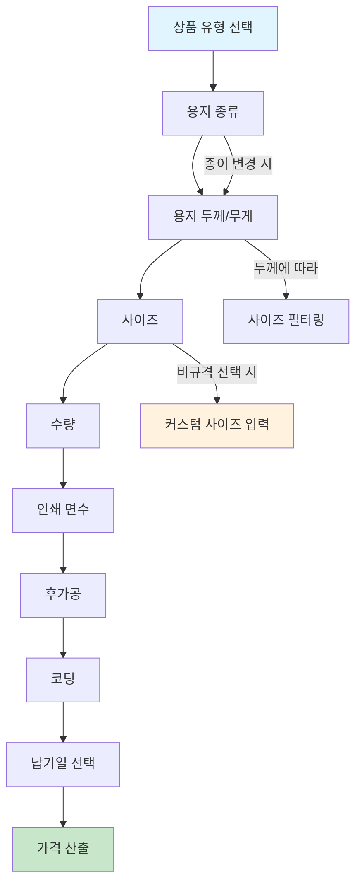
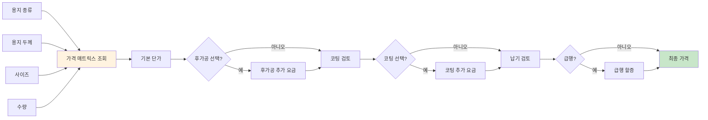
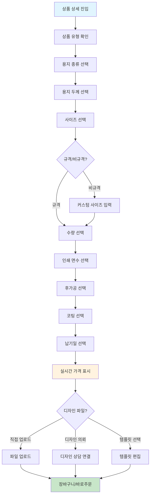
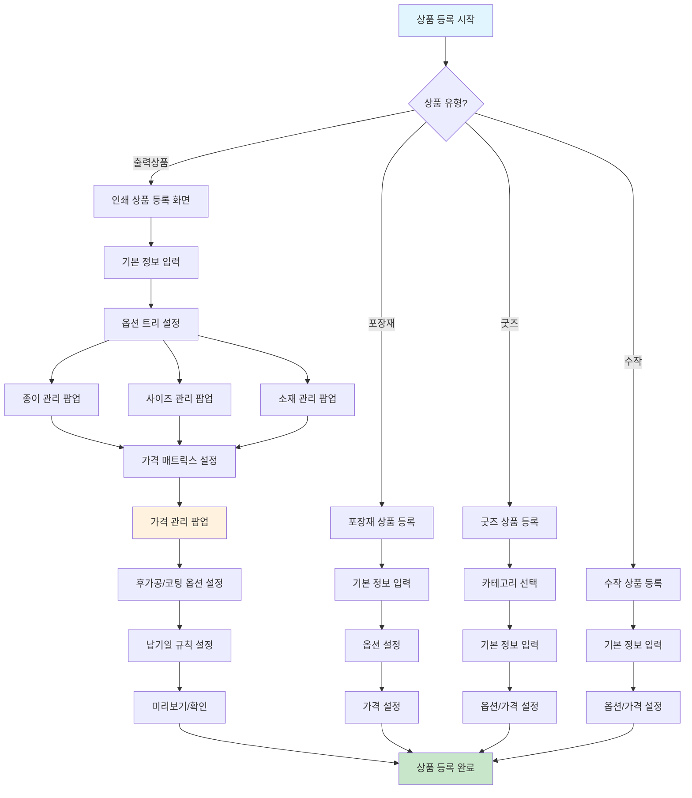
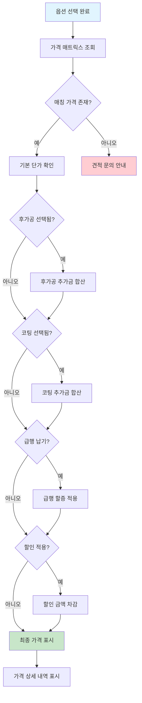

# 상품/옵션/가격 정책

**문서번호**: POLICY-A10B4-PRODUCT
**작성일**: 2026-03-15
**대상 독자**: 인쇄실무진 (기획, 상품기획, 운영)
**관련 IA**: A-10 상품 (4개), B-4 상품관리 (10개)

---

## 목차
1. [정책 요약](#1-정책-요약)
2. [경쟁사 상품 구성 비교](#2-경쟁사-상품-구성-비교)
3. [후니프린팅 상품 카테고리 정책](#3-후니프린팅-상품-카테고리-정책)
4. [인쇄 옵션 구조 정책](#4-인쇄-옵션-구조-정책)
5. [가격 체계 정책](#5-가격-체계-정책)
6. [UserFlow](#6-userflow)
7. [정책 결정 체크리스트](#7-정책-결정-체크리스트)
8. [추천 정책안](#8-추천-정책안)
9. [제작 Case별 공정 흐름](#9-제작-case별-공정-흐름)
10. [부록: 개발 참고사항](#부록-개발-참고사항)

---

## 1. 정책 요약

후니프린팅의 상품 체계는 **4대 카테고리**(출력상품, 포장재, 굿즈, 수작)로 구성되며, 각 카테고리별로 옵션 구조와 가격 산출 방식이 상이합니다.

핵심 정책 방향:
- **출력상품**(명함/전단/포스터/봉투)은 **다단계 종속 옵션 + 동적 가격 매트릭스**로 운영
- **인쇄/제본 상품**은 **종속 옵션 엔진 + 가격 매트릭스** 기반 커스텀 등록
- **포장재/굿즈/수작**은 일반 상품 등록 방식(스킨 또는 네이티브)으로 운영
- 옵션 관리는 **팝업 기반 8종**(사이즈/소재/종이/가격 등)으로 통합 관리

| 구분 | 기능 수 | shopby 분류 | 비고 |
|------|---------|-------------|------|
| A-10 상품 (프론트) | 4개 | CUSTOM 2 / SKIN 2 | 출력상품 4종은 CUSTOM |
| B-4 상품관리 (어드민) | 10개 | CUSTOM 6 / NATIVE 3 / SKIN 1 | 옵션/가격 팝업은 CUSTOM |

---

## 2. 경쟁사 상품 구성 비교

### 2.1 카테고리 비교표

| 카테고리 | 레드프린팅 | 와우프레스 | 오프린트미 | 후니프린팅 (계획) |
|----------|-----------|-----------|-----------|------------------|
| 명함 | O (디지털인쇄) | O (상업인쇄소) | O (DIY) | O (출력상품) |
| 전단/홍보물 | O (디지털인쇄) | O (상업인쇄소) | O | O (출력상품) |
| 스티커 | O (디지털인쇄) | O (상업인쇄소) | O | - (향후 검토) |
| 봉투 | - | O (상업인쇄소) | - | O (출력상품) |
| 포스터 | O (디지털인쇄) | O (힙지로) | O | O (출력상품) |
| 책자/제본 | O (디지털인쇄) | O (책공방) | - | O (인쇄/제본) |
| 현수막/배너 | O (대형실사) | O (가게용품) | - | - (향후 검토) |
| 패키지/포장 | - | O (힙지로) | O | O (포장재) |
| 굿즈 | O (라이프스타일) | O (문구점) | O (DIY) | O (굿즈) |
| 의류/어패럴 | O (의류) | O (어패럴) | - | - (향후 검토) |
| 수작업 상품 | - | - | - | O (수작) |
| 디자인 상품 | - | - | O (핵심) | O (디자인) |

### 2.2 경쟁사 특징 분석

**레드프린팅**
- 디지털인쇄 중심의 폭넓은 카테고리 (명함~라이프스타일)
- 옵셋공장/대형실사/사진관/문방구 등 채널별 분류 체계
- 대량 옵셋과 소량 디지털의 이원화 운영

**와우프레스**
- 채널별 브랜드 세분화 (힙지로디지털, 책공방 등)
- 가게용품(현수막/배너/보드) 카테고리 강점
- 어패럴(에코백/T셔츠) 별도 카테고리 운영

**오프린트미**
- DIY 브랜딩에 특화된 모바일 앱 중심 서비스
- 상품 구성보다 사용자 경험(편집 도구)에 집중

---

## 3. 후니프린팅 상품 카테고리 정책

### 3.1 4대 카테고리 정의

#### (1) 출력상품 (디지털 인쇄)

| 상품 | 설명 | 주요 옵션 |
|------|------|----------|
| 명함 | 개인/비즈니스 명함 | 용지, 사이즈, 수량, 인쇄면, 후가공 |
| 전단 | 전단지/리플렛/브로슈어 | 용지, 사이즈, 수량, 접지방식, 코팅 |
| 포스터 | 포스터/POP | 용지, 사이즈, 수량, 코팅 |
| 봉투 | 서류봉투/편지봉투 | 용지, 사이즈, 수량, 인쇄면, 창봉투여부 |

- **shopby 분류**: CUSTOM (다단계 종속 옵션 + 동적 가격 필수)
- **등록 방식**: 커스텀 상품 등록 화면

#### (2) 포장재

| 상품 | 설명 | 주요 옵션 |
|------|------|----------|
| 박스 | 택배박스, 선물박스 등 | 사이즈, 재질, 수량 |
| 쇼핑백 | 종이 쇼핑백 | 사이즈, 재질, 수량 |
| 포장지 | 래핑지, 완충재 등 | 사이즈, 재질, 수량 |
| 테이프 | 커스텀 테이프 | 폭, 길이, 수량 |

- **shopby 분류**: SKIN (일반 상품 등록 + 옵션 커스텀)
- **등록 방식**: shopby 기본 상품 등록에 스킨 커스텀

#### (3) 굿즈

| 상품 | 설명 | 주요 옵션 |
|------|------|----------|
| 다이어리/노트 | 커스텀 다이어리 | 사이즈, 제본방식, 내지 |
| 캘린더 | 탁상/벽걸이 캘린더 | 유형, 사이즈, 수량 |
| 스테이셔너리 | 펜/메모지/파일 등 | 상품별 상이 |
| 폰 액세서리 | 케이스/그립톡 등 | 기종, 유형 |

- **shopby 분류**: SKIN (굿즈 상품 등록) / NATIVE (굿즈 카테고리 관리)
- **등록 방식**: 굿즈 전용 등록 화면 또는 네이티브 등록

#### (4) 수작 (수작업 상품)

| 상품 | 설명 | 주요 옵션 |
|------|------|----------|
| 캘리그라피 | 손글씨 제작물 | 스타일, 사이즈, 매체 |
| 수제 초대장 | 핸드메이드 초대장 | 디자인, 수량, 추가옵션 |
| 커스텀 아트 | 주문제작 아트워크 | 매체, 사이즈, 액자 |

- **shopby 분류**: SKIN (수작 상품 등록) / NATIVE (수작 상품 등록)
- **등록 방식**: shopby 기본 등록에 스킨 커스텀 또는 네이티브

### 3.2 카테고리별 shopby 구현 분류

```
┌──────────────────────────────────────────────────────────────┐
│                    상품 카테고리 분류                          │
├──────────────┬───────────┬──────────────────────────────────-┤
│   카테고리    │ shopby    │ 사유                              │
├──────────────┼───────────┼──────────────────────────────────-┤
│ 출력상품 4종  │ CUSTOM    │ 다단계 종속 옵션 + 동적 가격 필수   │
│ 인쇄/제본등록 │ CUSTOM    │ 종속 옵션 엔진 + 가격 매트릭스     │
│ 관리 팝업 8종 │ CUSTOM    │ 사이즈/소재/종이/가격 전용 UI      │
│ 포장재 상품   │ SKIN      │ 일반 등록 + 옵션 커스텀            │
│ 굿즈 상품    │ SKIN      │ 일반 등록 + 카테고리 커스텀         │
│ 수작 상품    │ SKIN      │ 일반 등록 + 스킨 커스텀            │
│ 굿즈 카테고리 │ NATIVE    │ shopby 기본 카테고리 관리          │
│ 수작/포장 등록│ NATIVE    │ shopby 기본 상품 등록 활용         │
│ 디자인 상품  │ SKIN      │ 디자인 파일 업로드 + 커스텀         │
└──────────────┴───────────┴──────────────────────────────────-┘
```

---

## 4. 인쇄 옵션 구조 정책

### 4.1 종속 옵션 트리 구조

인쇄 상품(출력상품/인쇄제본)의 옵션은 **다단계 종속 관계**를 갖습니다. 상위 옵션 선택에 따라 하위 옵션 목록이 동적으로 변경됩니다.



### 4.2 옵션 종속 관계 상세

| 단계 | 옵션명 | 종속 관계 | 비고 |
|------|--------|----------|------|
| 1단계 | 용지 종류 | 독립 | 아트지, 모조지, 스노우지 등 |
| 2단계 | 용지 두께(g) | 용지 종류에 종속 | 150g, 200g, 250g, 300g 등 |
| 3단계 | 사이즈 | 용지 종류+두께에 종속 | 규격/비규격 선택 가능 |
| 4단계 | 수량 | 사이즈에 종속 | 사이즈별 최소/최대 수량 상이 |
| 5단계 | 인쇄 면수 | 상품 유형에 종속 | 단면/양면/4면 등 |
| 6단계 | 후가공 | 용지+사이즈에 종속 | 박/형압/도무송/타공 등 |
| 7단계 | 코팅 | 용지+후가공에 종속 | 무광/유광/벨벳 등 |
| 8단계 | 납기일 | 모든 옵션 확정 후 | 일반(3~5일)/급행(1~2일) |

### 4.3 상품별 옵션 적용 범위

| 상품 | 용지 | 두께 | 사이즈 | 수량 | 인쇄면 | 후가공 | 코팅 | 납기 |
|------|------|------|--------|------|--------|--------|------|------|
| 명함 | O | O | O | O | O | O | O | O |
| 전단 | O | O | O | O | O | O | O | O |
| 포스터 | O | O | O | O | - | - | O | O |
| 봉투 | O | O | O | O | O | - | - | O |
| 인쇄/제본 | O | O | O | O | O | O | O | O |

### 4.4 비규격 사이즈 정책

**결정 필요 사항**:
- 비규격 사이즈 입력 허용 여부
- 허용 시 최소/최대 범위 설정
- 비규격 추가 요금 산정 기준
- 비규격 납기일 변동 규칙

**추천안**: 출력상품 4종에 한해 비규격 사이즈를 허용하되, 규격 사이즈 대비 10~30% 추가 요금을 적용하고 납기일은 1일 추가합니다.

### 4.5 관리 팝업 8종 구성

어드민(B-4)에서 옵션 데이터를 관리하는 팝업 UI는 총 8종입니다.

| 팝업 | 관리 대상 | 주요 기능 |
|------|----------|----------|
| 사이즈 관리 | 규격/비규격 사이즈 | 사이즈 추가/수정/삭제, 단위 설정 |
| 소재 관리 | 용지 외 소재 | 소재 종류, 특성 정보 관리 |
| 종이 관리 | 용지 종류/두께 | 용지명, 두께(g), 재고 연동 |
| 가격 관리 (명함) | 명함 가격 매트릭스 | 옵션 조합별 단가 설정 |
| 가격 관리 (전단) | 전단 가격 매트릭스 | 옵션 조합별 단가 설정 |
| 가격 관리 (포스터) | 포스터 가격 매트릭스 | 옵션 조합별 단가 설정 |
| 가격 관리 (봉투) | 봉투 가격 매트릭스 | 옵션 조합별 단가 설정 |
| 가격 관리 (인쇄/제본) | 인쇄제본 가격 매트릭스 | 옵션 조합별 단가 설정 |

---

## 5. 가격 체계 정책

### 5.1 가격 매트릭스 구조

인쇄 상품의 가격은 단일 가격이 아니라 **옵션 조합에 따른 매트릭스**로 산출됩니다.



### 5.2 가격 산출 공식

```
최종 가격 = 기본 단가(매트릭스) + 후가공 추가금 + 코팅 추가금 + 급행 할증 - 할인
```

**기본 단가 매트릭스 예시 (명함)**:

| 용지 | 두께 | 사이즈 | 100매 | 200매 | 500매 | 1,000매 |
|------|------|--------|-------|-------|-------|---------|
| 아트지 | 250g | 90x50 | 8,000 | 12,000 | 22,000 | 35,000 |
| 아트지 | 300g | 90x50 | 9,000 | 14,000 | 25,000 | 40,000 |
| 모조지 | 200g | 90x50 | 7,000 | 10,000 | 18,000 | 28,000 |
| 스노우지 | 250g | 90x50 | 8,500 | 13,000 | 23,000 | 37,000 |

(위 가격은 예시이며, 실제 가격은 운영팀에서 팝업을 통해 설정합니다)

### 5.3 추가 요금 체계

| 항목 | 적용 방식 | 비고 |
|------|----------|------|
| 후가공 (박/형압) | 정액 추가 | 건당 고정 금액 |
| 후가공 (도무송/타공) | 정액 추가 | 건당 고정 금액 |
| 코팅 (무광/유광) | 정액 추가 | 면적 기반 또는 건당 |
| 코팅 (벨벳) | 정액 추가 | 프리미엄 코팅 |
| 양면 인쇄 | 기본단가에 포함 | 매트릭스에 반영 |
| 비규격 사이즈 | 비율 추가 (10~30%) | 규격 대비 비율 |
| 급행 납기 | 비율 추가 (30~50%) | 납기에 따라 차등 |
| 디자인 의뢰 | 별도 견적 | 디자인 상담 연계 |

### 5.4 수량별 단가 정책

**결정 필요 사항**:
- 수량 구간 설정 (예: 100/200/500/1000/2000/5000/10000)
- 대량 주문 할인율 체계
- 최소 주문 수량 (상품별)
- 대량 주문 별도 견적 기준선 (예: 10,000매 이상)

**추천안**:
- 기본 수량 구간: 100 / 200 / 500 / 1,000 / 2,000 / 5,000
- 5,000매 초과: 대량 주문 견적 문의로 전환
- 수량 증가에 따른 단가 하락률: 약 15~25% (구간별 차등)

### 5.5 가격 관리 운영 정책

- 가격 변경은 **어드민 가격 관리 팝업**을 통해서만 수행
- 가격 변경 시 **변경 이력**을 자동 기록
- 가격 변경 **즉시 반영** 또는 **예약 반영** 선택 가능
- 이벤트/프로모션 가격은 별도 할인 정책으로 관리 (가격 매트릭스와 분리)

---

## 6. UserFlow

### 6.1 고객 - 인쇄 옵션 선택 Flow



### 6.2 운영자 - 상품 등록 Flow



### 6.3 가격 산출 Flow



---

## 7. 정책 결정 체크리스트

아래 항목들은 개발 착수 전 인쇄실무진(기획/상품기획/운영)이 결정해야 할 사항입니다.

### 7.1 상품 카테고리 관련

- [ ] 출력상품 4종(명함/전단/포스터/봉투) 외 추가 상품 유형 여부 (스티커, 현수막 등)
- [ ] 포장재 세부 상품 목록 확정
- [ ] 굿즈 세부 상품 목록 및 카테고리 구조 확정
- [ ] 수작 상품 범위 및 주문 프로세스 확정
- [ ] 디자인 상품 운영 범위 확정

### 7.2 옵션 구조 관련

- [ ] 옵션 트리 최대 뎁스 결정 (현재 8단계 제안, 축소/확대 검토)
- [ ] 용지 종류 목록 확정 (아트지/모조지/스노우지/레이드지 등)
- [ ] 용지 두께 구간 확정 (상품별)
- [ ] 규격 사이즈 목록 확정 (상품별)
- [ ] 비규격 사이즈 허용 여부 및 범위
- [ ] 후가공 종류 확정 (박/형압/도무송/타공/에폭시 등)
- [ ] 코팅 종류 확정 (무광/유광/벨벳 등)
- [ ] 상품별 옵션 적용 범위 최종 확인

### 7.3 가격 체계 관련

- [ ] 수량 구간 확정 (상품별)
- [ ] 가격 매트릭스 초기 데이터 준비
- [ ] 후가공/코팅 추가 요금 확정
- [ ] 비규격 추가 요금 비율 확정
- [ ] 급행 납기 할증 비율 확정
- [ ] 대량 주문 견적 전환 기준선 확정
- [ ] 이벤트/프로모션 할인 정책 수립

### 7.4 납기일 관련

- [ ] 상품별 기본 납기일 확정
- [ ] 급행 납기 가능 범위 확정
- [ ] 납기일 산출 규칙 확정 (공휴일/주말 처리, 입금 확인 기준)
- [ ] 비규격/특수 후가공의 납기일 추가 일수

### 7.5 디자인 파일 관련

- [ ] 업로드 허용 파일 형식 (AI, PSD, PDF, JPG 등)
- [ ] 파일 용량 제한
- [ ] 디자인 검수 프로세스 (자동/수동)
- [ ] 템플릿 제공 범위 및 편집 도구 선정

---

## 8. 추천 정책안

### 8.1 1단계 (MVP) 추천안

**상품 범위**: 출력상품 4종(명함/전단/포스터/봉투)에 집중

| 항목 | 추천 정책 |
|------|----------|
| 옵션 트리 뎁스 | 6단계 (용지→두께→사이즈→수량→후가공→코팅) |
| 비규격 사이즈 | 1단계에서는 미지원, 규격 사이즈만 |
| 수량 구간 | 100 / 200 / 500 / 1,000 / 2,000 |
| 대량 견적 기준 | 2,000매 초과 시 견적 문의 |
| 납기일 | 일반 3~5영업일, 급행 1~2영업일 |
| 급행 할증 | 30% |
| 가격 관리 | 팝업 4종 (명함/전단/포스터/봉투) |
| 디자인 파일 | PDF, AI 업로드만 지원 |

### 8.2 2단계 확장 추천안

| 항목 | 추천 정책 |
|------|----------|
| 상품 확장 | 인쇄/제본 상품 추가 |
| 비규격 사이즈 | 지원 (추가 요금 15%) |
| 수량 구간 확대 | ~ 5,000매까지 |
| 포장재/굿즈 | 일반 상품 등록 방식으로 추가 |
| 디자인 도구 | 온라인 편집 도구 도입 검토 |

### 8.3 3단계 고도화 추천안

| 항목 | 추천 정책 |
|------|----------|
| 전체 카테고리 | 수작, 디자인 상품 포함 |
| 대량 주문 | 자동 견적 시스템 |
| AI 가격 최적화 | 수요/재고 기반 동적 가격 |
| 스티커/현수막 | 카테고리 확장 |

---

## 9. 제작 Case별 공정 흐름

production-flow.md에 정의된 17개 제작Case를 기반으로, 각 상품 카테고리가 어떤 공정을 거치는지 매핑한다.

### 9.1 상품 카테고리 → 제작Case 매핑

| 상품 카테고리 | 세부 상품 | 제작Case | 주요 공정 |
|-------------|-----------|---------|-----------|
| **출력상품** | 명함 | Case 1 (낱장) | 출력 → 재단 → 포장 |
| **출력상품** | 명함 (후가공) | Case 3 (인쇄후가공) | 출력 → 코팅/박/형압 → 재단 → 포장 |
| **출력상품** | 전단 | Case 1 (낱장) | 출력 → 재단 → 포장 |
| **출력상품** | 전단 (코팅) | Case 3 (인쇄후가공) | 출력 → 코팅 → 재단 → 포장 |
| **출력상품** | 포스터 | Case 1 (낱장) / Case 5 (실사) | 사이즈에 따라 분기 |
| **출력상품** | 봉투 | Case 1 (낱장) | 출력 → 재단 → 접지 → 포장 |
| **인쇄/제본** | 중철제본 | Case 4 (책자) | 출력 → 접지 → 중철 → 재단 → 포장 |
| **인쇄/제본** | 무선제본 | Case 4 (책자) | 출력 → 접지 → 무선 → 재단 → 포장 |
| **인쇄/제본** | 스프링제본 | Case 4 (책자) | 출력 → 재단 → 타공 → 스프링 → 포장 |
| **인쇄/제본** | 양장제본 | Case 6 (커버) | 출력 → 코팅 → 커버톰슨 → 제본 → 포장 |
| **포장재** | 박스 | Case 6 (커버) | 출력 → 코팅 → 톰슨 → 조립 → 포장 |
| **포장재** | 쇼핑백 | Case 6 (커버) | 출력 → 코팅 → 톰슨 → 조립 → 포장 |
| **굿즈** | 스티커 | Case 2 (스티커) | 출력 → 커팅 → 포장 |
| **굿즈** | 에코백/파우치 | Case 8 (봉제) | 전사인쇄 → 봉제 → 포장 |
| **굿즈** | 아크릴 굿즈 | Case 10 (아크릴) | 디자인 → 레이저커팅 → UV인쇄 → 포장 |
| **굿즈** | 머그컵/텀블러 | Case 11 (전사) | 디자인 → 전사인쇄 → 포장 |
| **굿즈** | 도장 | Case 12 (도장) | 디자인 → 각인/제작 → 포장 |
| **굿즈** | 외주 굿즈 | Case 13 (외주) | 발주 → 외주제작 → 입고 → 검수 → 포장 |
| **수작** | 수작업 전체 | Case별 상이 | 수작업 공정에 따라 개별 관리 |

### 9.2 공정 흐름 참조

각 제작Case의 상세 공정 흐름, 트래킹 포인트, 소요시간은 아래 문서를 참조한다:

- **POLICY-FILE-PROCESSING.md**: 17개 제작Case 상세 공정 흐름
- **POLICY-B7-STATISTICS.md Section 9**: 공정별 현황 대시보드, 산출 데이터

---

## [부록] 개발 참고사항

> 이 부록은 개발팀 참고용이며, 인쇄실무진은 건너뛰어도 됩니다.

### 기술 구현 분류

| 기능 | shopby 분류 | 구현 방향 |
|------|-------------|----------|
| 출력상품 4종 상세 | CUSTOM | 종속 옵션 엔진 + 실시간 가격 계산 UI |
| 인쇄/제본 상품 등록 | CUSTOM | 종속 옵션 엔진 + 가격 매트릭스 어드민 |
| 사이즈/소재/종이 관리 팝업 | CUSTOM | 어드민 전용 CRUD 팝업 |
| 가격 관리 팝업 (5종) | CUSTOM | 다차원 매트릭스 편집 UI |
| 포장재/수작 상품 | SKIN | shopby 기본 등록 + 스킨 커스텀 |
| 굿즈 카테고리/등록 | NATIVE | shopby 네이티브 카테고리/상품 관리 |
| 디자인 상품 | SKIN | 파일 업로드 + 스킨 커스텀 |

### 핵심 기술 요구사항

1. **종속 옵션 엔진**: 상위 옵션 변경 시 하위 옵션 목록 동적 갱신 (API 기반)
2. **가격 매트릭스 조회**: 다차원 옵션 조합 기반 가격 조회 (성능 최적화 필요)
3. **실시간 가격 계산**: 옵션 변경 시 즉시 가격 업데이트 (프론트엔드)
4. **가격 관리 팝업**: 엑셀 형태의 매트릭스 편집 UI (대량 데이터 처리)
5. **납기일 자동 산출**: 영업일 기반 납기 계산 로직

### 데이터 모델 고려사항

- 옵션 트리: 재귀적 트리 구조 또는 인접 리스트 모델
- 가격 매트릭스: 다차원 키-값 구조 (옵션 조합 → 가격)
- 가격 이력: 변경 로그 테이블 (감사 추적)
- 상품-옵션 매핑: 다대다 관계 테이블
