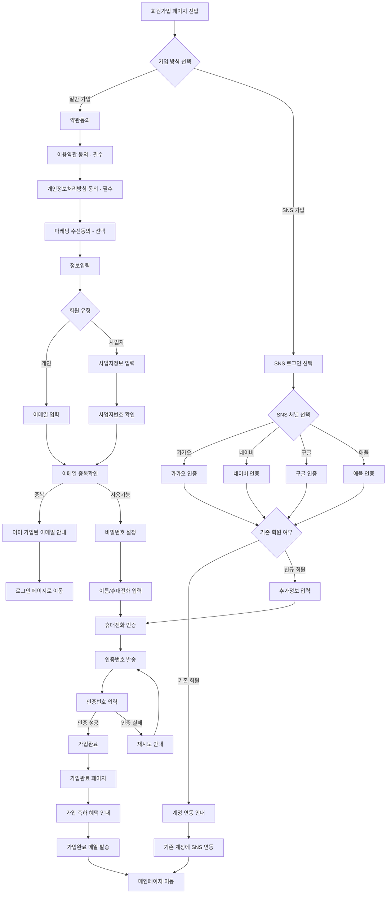
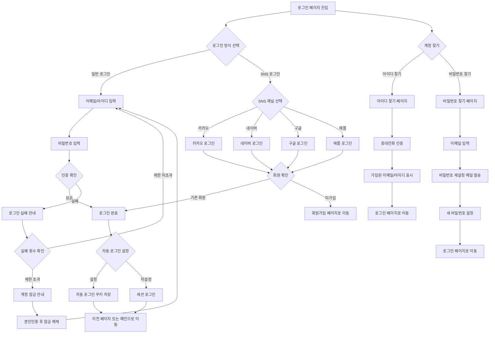
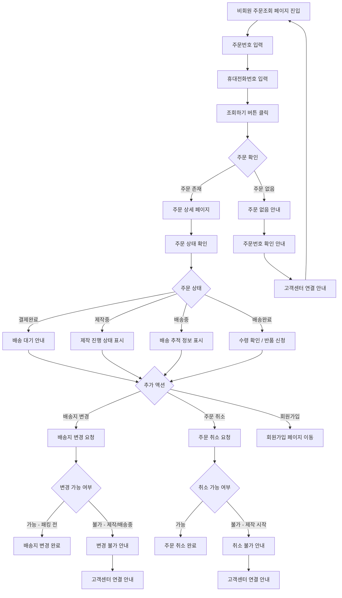

# 회원/인증 정책

## 문서 정보

| 항목 | 내용 |
|------|------|
| 문서번호 | POLICY-A1A2-MEMBER |
| 작성일 | 2026-03-15 |
| 최종수정 | 2026-03-15 |
| 작성자 | 지니 |
| 대상독자 | 인쇄실무진, 운영팀 |
| 관련 IA | A-1 (로그인 3개), A-2 (회원가입 5개), B-6 (회원관리 4개) |
| 총 결정 항목 | 12개 |
| 상태 | 작성중 |

---

## 목차

1. [정책 요약](#1-정책-요약)
2. [경쟁사 현황](#2-경쟁사-현황)
3. [IA 기능별 정책 결정](#3-ia-기능별-정책-결정)
4. [UserFlow](#4-userflow)
5. [정책 결정 체크리스트](#5-정책-결정-체크리스트)
6. [추천 정책안](#6-추천-정책안)
7. [부록: 개발 참고사항](#부록-개발-참고사항)

---

## 1. 정책 요약

후니프린팅 회원/인증 정책은 **인쇄 전문 쇼핑몰**의 특성을 반영하여, 일반 개인 고객과 사업자 고객을 모두 수용하는 회원 체계를 구축하는 것을 목표로 합니다.

### 핵심 결정사항

| 번호 | 결정 사항 | 상태 |
|------|-----------|------|
| 1 | SNS 로그인 채널 선정 (카카오/네이버/구글/애플 중 택) | 미결정 |
| 2 | 비회원 주문 허용 여부 및 범위 | 미결정 |
| 3 | 회원 유형 구분 (개인/사업자/기업) | 미결정 |
| 4 | 회원등급 체계 및 혜택 설계 | 미결정 |
| 5 | 프린팅머니(적립금) 운영 정책 | 미결정 |

---

## 2. 경쟁사 현황

### 2.1 레드프린팅

| 항목 | 내용 |
|------|------|
| SNS 로그인 | 카카오, 네이버, 구글, 애플 (4종) |
| 비회원 주문 | 가능 (주문번호 + 휴대전화번호로 조회) |
| 회원 혜택 | i.TOKEN 적립 서비스 |
| 기업 서비스 | 별도 브랜드몰 운영 (betterwaysystems.com) |
| 특이사항 | 간편재주문 기능 (1개월 보관), 기업고객 별도 관리 |

**시사점**: SNS 로그인을 4종 모두 제공하여 가입 장벽을 최소화. 비회원 주문을 허용하여 첫 구매 전환율을 높이는 전략. 기업 고객은 별도 몰로 분리 운영.

### 2.2 와우프레스

| 항목 | 내용 |
|------|------|
| SNS 로그인 | 네이버, 페이스북, 카카오 (3종) |
| 가입 혜택 | 쿠폰 4종 + 무료배송 |
| 회원등급 | 6단계 (3개월 접수액 기준) |
| 등급 체계 | VVIP(1,200만원 이상) → VIP(300만원) → Diamond(90만원) → Gold(30만원) → Silver(5만원) → Family(5만원 미만) |
| VVIP 혜택 | 4% 적립, 배송비 무료 |
| 적립 이벤트 | GOOD리뷰어 이벤트 (포인트 + 경품) |

**시사점**: 가입 시 즉시 혜택을 제공하여 가입 전환율을 높임. 6단계 회원등급으로 고객 충성도를 세밀하게 관리. 3개월 접수액 기준은 인쇄업 특성(비정기적 대량주문)에 적합.

### 2.3 오프린트미

| 항목 | 내용 |
|------|------|
| 모바일앱 | iOS, Android 제공 |
| 디자인 특화 | DIY 브랜딩, 모바일 앱 중심 |
| 고객센터 | 1577-4703, Zendesk 헬프센터 |

**시사점**: 모바일 앱 중심 전략으로 젊은 고객층 공략. 디자인 특화로 차별화. Zendesk 기반의 체계적인 CS 운영.

### 2.4 비교 분석표

| 비교 항목 | 레드프린팅 | 와우프레스 | 오프린트미 |
|-----------|-----------|-----------|-----------|
| **SNS 로그인 수** | 4종 | 3종 | 미확인 |
| **카카오 로그인** | O | O | 미확인 |
| **네이버 로그인** | O | O | 미확인 |
| **구글 로그인** | O | X | 미확인 |
| **애플 로그인** | O | X | 미확인 |
| **비회원 주문** | O | 미확인 | 미확인 |
| **가입 혜택** | 미확인 | 쿠폰4종+무료배송 | 미확인 |
| **회원등급** | 단일(적립) | 6단계 | 미확인 |
| **기업회원 분리** | 별도 몰 | 미확인 | 미확인 |
| **모바일앱** | 미확인 | 미확인 | O |

---

## 3. IA 기능별 정책 결정

### 3.1 로그인 (A-1)

#### 3.1.1 일반로그인

**경쟁사 현황**
- 레드프린팅: 이메일(아이디) + 비밀번호 로그인
- 와우프레스: 아이디 + 비밀번호 로그인
- 오프린트미: 이메일 기반 로그인

**정책 결정 필요사항**

| 번호 | 결정 항목 | 선택지 | 결정 |
|------|-----------|--------|------|
| 1 | 로그인 식별자 | 이메일 / 아이디 / 둘 다 | 미결정 |
| 2 | 자동 로그인 유지 기간 | 7일 / 14일 / 30일 | 미결정 |
| 3 | 로그인 실패 제한 | 5회 / 10회 차단 후 본인인증 | 미결정 |
| 4 | 동시 로그인 허용 | 허용 / 1기기 제한 / 3기기 제한 | 미결정 |

#### 3.1.2 SNS 로그인

**경쟁사 현황**
- 레드프린팅: 카카오, 네이버, 구글, 애플 (4종)
- 와우프레스: 네이버, 페이스북, 카카오 (3종)
- 오프린트미: 미확인

**정책 결정 필요사항**

| 번호 | 결정 항목 | 선택지 | 결정 |
|------|-----------|--------|------|
| 1 | 카카오 로그인 | 도입 / 미도입 | 미결정 |
| 2 | 네이버 로그인 | 도입 / 미도입 | 미결정 |
| 3 | 구글 로그인 | 도입 / 미도입 | 미결정 |
| 4 | 애플 로그인 | 도입 / 미도입 | 미결정 |
| 5 | SNS 최초 로그인 시 추가정보 수집 | 휴대전화만 / 휴대전화+이름 / 없음 | 미결정 |
| 6 | 기존 이메일과 SNS 계정 연동 | 자동연동 / 수동연동 / 별도계정 | 미결정 |

#### 3.1.3 아이디찾기

**경쟁사 현황**
- 일반적으로 휴대전화 인증 또는 이메일 인증으로 아이디(이메일) 확인

**정책 결정 필요사항**

| 번호 | 결정 항목 | 선택지 | 결정 |
|------|-----------|--------|------|
| 1 | 아이디 찾기 방법 | 휴대전화 인증 / 이메일 인증 / 둘 다 | 미결정 |
| 2 | 아이디 노출 방식 | 전체 노출 / 일부 마스킹(ho***@gmail.com) | 미결정 |

#### 3.1.4 비밀번호찾기

**경쟁사 현황**
- 일반적으로 이메일 인증 후 비밀번호 재설정 링크 발송

**정책 결정 필요사항**

| 번호 | 결정 항목 | 선택지 | 결정 |
|------|-----------|--------|------|
| 1 | 비밀번호 찾기 방법 | 이메일 재설정 링크 / 휴대전화 임시비밀번호 / 둘 다 | 미결정 |
| 2 | 재설정 링크 유효시간 | 30분 / 1시간 / 24시간 | 미결정 |
| 3 | 비밀번호 규칙 | 8자 이상 영문+숫자 / 8자 이상 영문+숫자+특수문자 | 미결정 |

---

### 3.2 회원가입 (A-2)

#### 3.2.1 약관동의

**경쟁사 현황**
- 공통: 이용약관(필수), 개인정보처리방침(필수), 마케팅 수신동의(선택)
- 와우프레스: 가입 시 쿠폰 4종 + 무료배송 혜택 안내

**정책 결정 필요사항**

| 번호 | 결정 항목 | 선택지 | 결정 |
|------|-----------|--------|------|
| 1 | 필수 약관 목록 | 이용약관 + 개인정보 / 추가 약관 포함 | 미결정 |
| 2 | 선택 약관 목록 | 마케팅 수신 / SMS+이메일 분리 / 제3자 제공 | 미결정 |
| 3 | 14세 미만 가입 | 허용(법정대리인 동의) / 불허 | 미결정 |
| 4 | 전체동의 버튼 | 제공 / 미제공 | 미결정 |

#### 3.2.2 정보입력

**경쟁사 현황**
- 레드프린팅: 일반회원 가입, 기업은 별도 몰
- 와우프레스: 일반회원 가입, 등급제 운영

**정책 결정 필요사항 - 일반회원**

| 번호 | 결정 항목 | 선택지 | 결정 |
|------|-----------|--------|------|
| 1 | 필수 입력 항목 | 이메일+비밀번호+이름+휴대전화 / 추가항목 | 미결정 |
| 2 | 선택 입력 항목 | 주소, 생년월일, 성별 등 | 미결정 |
| 3 | 닉네임 사용 여부 | 사용 / 미사용 | 미결정 |

**정책 결정 필요사항 - 사업자회원**

| 번호 | 결정 항목 | 선택지 | 결정 |
|------|-----------|--------|------|
| 1 | 사업자회원 별도 가입 | 별도 가입폼 / 일반가입 후 전환 / 미제공 | 미결정 |
| 2 | 사업자 필수 정보 | 사업자번호+상호명+대표자 / 추가항목 | 미결정 |
| 3 | 사업자등록증 첨부 | 필수 / 선택 / 불필요 | 미결정 |
| 4 | 세금계산서 자동발행 | 자동 / 요청시 / 미제공 | 미결정 |

#### 3.2.3 이메일중복확인

**경쟁사 현황**
- 공통: 가입 시 실시간 이메일 중복 확인

**정책 결정 필요사항**

| 번호 | 결정 항목 | 선택지 | 결정 |
|------|-----------|--------|------|
| 1 | 중복 확인 시점 | 실시간(입력 즉시) / 버튼 클릭 시 | 미결정 |
| 2 | 이미 가입된 이메일 안내 | SNS 연동 계정 안내 / 로그인 페이지 이동 | 미결정 |

#### 3.2.4 휴대전화인증

**경쟁사 현황**
- 공통: 본인인증(PASS 등) 또는 SMS 인증번호

**정책 결정 필요사항**

| 번호 | 결정 항목 | 선택지 | 결정 |
|------|-----------|--------|------|
| 1 | 인증 방식 | SMS 인증번호 / 본인인증(PASS) / 둘 다 | 미결정 |
| 2 | 인증번호 유효시간 | 3분 / 5분 | 미결정 |
| 3 | 일일 인증 횟수 제한 | 5회 / 10회 / 무제한 | 미결정 |
| 4 | 1인 1계정 제한 | 제한(동일 전화번호 1계정) / 미제한 | 미결정 |

#### 3.2.5 가입완료메일

**경쟁사 현황**
- 와우프레스: 가입 시 쿠폰 4종 + 무료배송 혜택 즉시 지급

**정책 결정 필요사항**

| 번호 | 결정 항목 | 선택지 | 결정 |
|------|-----------|--------|------|
| 1 | 가입 완료 메일 발송 | 발송 / 미발송 | 미결정 |
| 2 | 가입 혜택 | 쿠폰 / 적립금 / 무료배송 / 없음 / 복합 | 미결정 |
| 3 | 혜택 금액/내용 | 구체적 금액 결정 필요 | 미결정 |
| 4 | 가입 완료 페이지 내용 | 혜택안내 / 추천상품 / 이용가이드 | 미결정 |

---

### 3.3 회원관리 (B-6)

#### 3.3.1 회원등급 체계

**경쟁사 현황**
- 와우프레스: 6단계, 3개월 접수액 기준
  - VVIP(1,200만원 이상): 4% 적립, 배송비 무료
  - VIP(300만원 이상): 적립 + 할인
  - Diamond(90만원 이상), Gold(30만원 이상), Silver(5만원 이상), Family(5만원 미만)
- 레드프린팅: i.TOKEN 적립 서비스 (등급 구분 미확인)

**정책 결정 필요사항**

| 번호 | 결정 항목 | 선택지 | 결정 |
|------|-----------|--------|------|
| 1 | 등급 체계 도입 여부 | 도입 / 미도입(단일등급) | 미결정 |
| 2 | 등급 단계 수 | 3단계 / 4단계 / 5단계 / 6단계 | 미결정 |
| 3 | 등급 산정 기준 | 구매금액(기간) / 주문건수 / 복합 | 미결정 |
| 4 | 등급 산정 기간 | 최근 1개월 / 3개월 / 6개월 / 12개월 | 미결정 |
| 5 | 등급별 혜택 종류 | 적립률 / 할인률 / 배송비 / 쿠폰 / 복합 | 미결정 |
| 6 | 등급 갱신 주기 | 매월 / 매분기 / 반기 | 미결정 |
| 7 | 등급 하락 방지 | 1회 유예 / 즉시 하락 / 최소등급 보장 | 미결정 |

#### 3.3.2 탈퇴회원 관리

**경쟁사 현황**
- 공통: 개인정보보호법에 따른 탈퇴 처리

**정책 결정 필요사항**

| 번호 | 결정 항목 | 선택지 | 결정 |
|------|-----------|--------|------|
| 1 | 탈퇴 유예 기간 | 즉시 탈퇴 / 7일 유예 / 30일 유예 | 미결정 |
| 2 | 탈퇴 후 데이터 보관 | 법정 의무기간만 / 추가 보관 | 미결정 |
| 3 | 재가입 제한 | 제한 없음 / 30일 제한 / 동일정보 제한 | 미결정 |
| 4 | 잔여 적립금/쿠폰 | 자동 소멸 / 탈퇴 전 안내 후 소멸 | 미결정 |
| 5 | 진행중 주문 | 탈퇴 불가(완료 후 가능) / 주문유지+탈퇴 | 미결정 |

#### 3.3.3 프린팅머니 관리

**경쟁사 현황**
- 레드프린팅: i.TOKEN 적립 서비스
- 와우프레스: 등급별 적립률 차등 (VVIP 4%)

**정책 결정 필요사항**

| 번호 | 결정 항목 | 선택지 | 결정 |
|------|-----------|--------|------|
| 1 | 적립금 명칭 | 프린팅머니 / 포인트 / 적립금 / 기타 | 미결정 |
| 2 | 기본 적립률 | 1% / 2% / 3% / 등급별 차등 | 미결정 |
| 3 | 적립 시점 | 구매확정 시 / 배송완료 시 / 결제 시 | 미결정 |
| 4 | 유효기간 | 6개월 / 12개월 / 24개월 / 무기한 | 미결정 |
| 5 | 최소 사용 금액 | 1,000원 / 5,000원 / 제한없음 | 미결정 |
| 6 | 최대 사용 비율 | 전액 / 결제금의 50% / 결제금의 80% | 미결정 |
| 7 | 충전 기능 | 제공 / 미제공 | 미결정 |
| 8 | 충전 시 추가 혜택 | 보너스 적립(예: 10만원 충전시 +5%) / 없음 | 미결정 |
| 9 | 환불 시 적립금 | 사용분 차감 / 복원 | 미결정 |

#### 3.3.4 쿠폰 관리

**경쟁사 현황**
- 와우프레스: 가입 시 쿠폰 4종 제공, GOOD리뷰어 이벤트로 추가 지급

**정책 결정 필요사항**

| 번호 | 결정 항목 | 선택지 | 결정 |
|------|-----------|--------|------|
| 1 | 쿠폰 유형 | 정액할인 / 정률할인 / 무료배송 / 복합 | 미결정 |
| 2 | 쿠폰 발급 조건 | 가입 / 첫구매 / 리뷰 / 이벤트 / 등급별 | 미결정 |
| 3 | 쿠폰 유효기간 | 발급일로부터 30일 / 60일 / 90일 | 미결정 |
| 4 | 쿠폰 중복 사용 | 허용 / 불허 / 종류별 1매씩 허용 | 미결정 |
| 5 | 적립금과 동시 사용 | 허용 / 불허 | 미결정 |
| 6 | 최소 주문금액 조건 | 없음 / 1만원 이상 / 3만원 이상 | 미결정 |
| 7 | 가입 축하 쿠폰 구성 | 쿠폰 종류 및 금액 결정 필요 | 미결정 |

---

## 4. UserFlow

### 4.1 회원가입 UserFlow

### 4.2 로그인 UserFlow

### 4.3 비회원 주문조회 UserFlow

---

## 5. 정책 결정 체크리스트

### A-1 로그인

- [ ] 로그인 식별자 결정 (이메일 / 아이디 / 둘 다)
- [ ] 자동 로그인 유지 기간 결정
- [ ] 로그인 실패 제한 횟수 결정
- [ ] 동시 로그인 허용 정책 결정
- [ ] 카카오 로그인 도입 여부 결정
- [ ] 네이버 로그인 도입 여부 결정
- [ ] 구글 로그인 도입 여부 결정
- [ ] 애플 로그인 도입 여부 결정
- [ ] SNS 최초 로그인 시 추가정보 수집 범위 결정
- [ ] SNS-기존계정 연동 방식 결정
- [ ] 아이디 찾기 방법 결정
- [ ] 아이디 노출 방식 결정 (전체/마스킹)
- [ ] 비밀번호 찾기 방법 결정
- [ ] 비밀번호 재설정 링크 유효시간 결정
- [ ] 비밀번호 규칙 결정

### A-2 회원가입

- [ ] 필수 약관 목록 확정
- [ ] 선택 약관 목록 확정
- [ ] 14세 미만 가입 허용 여부 결정
- [ ] 전체동의 버튼 제공 여부 결정
- [ ] 일반회원 필수 입력 항목 확정
- [ ] 일반회원 선택 입력 항목 확정
- [ ] 닉네임 사용 여부 결정
- [ ] 사업자회원 별도 가입 방식 결정
- [ ] 사업자 필수 정보 항목 확정
- [ ] 사업자등록증 첨부 요구 수준 결정
- [ ] 세금계산서 자동발행 여부 결정
- [ ] 이메일 중복확인 시점 결정
- [ ] 중복 이메일 안내 방식 결정
- [ ] 휴대전화 인증 방식 결정 (SMS / PASS)
- [ ] 인증번호 유효시간 결정
- [ ] 일일 인증 횟수 제한 결정
- [ ] 1인 1계정 제한 여부 결정
- [ ] 가입완료 메일 발송 여부 결정
- [ ] 가입 혜택 종류 및 금액 결정
- [ ] 가입 완료 페이지 구성 결정

### B-6 회원관리

- [ ] 회원등급 체계 도입 여부 결정
- [ ] 등급 단계 수 결정
- [ ] 등급 산정 기준 결정
- [ ] 등급 산정 기간 결정
- [ ] 등급별 혜택 종류 결정
- [ ] 등급 갱신 주기 결정
- [ ] 등급 하락 방지 정책 결정
- [ ] 탈퇴 유예 기간 결정
- [ ] 탈퇴 후 데이터 보관 정책 결정
- [ ] 재가입 제한 정책 결정
- [ ] 잔여 적립금/쿠폰 처리 정책 결정
- [ ] 진행중 주문 시 탈퇴 처리 결정
- [ ] 적립금 명칭 결정
- [ ] 기본 적립률 결정
- [ ] 적립 시점 결정
- [ ] 적립금 유효기간 결정
- [ ] 최소 사용 금액 결정
- [ ] 최대 사용 비율 결정
- [ ] 충전 기능 제공 여부 결정
- [ ] 충전 시 추가 혜택 결정
- [ ] 환불 시 적립금 처리 결정
- [ ] 쿠폰 유형 결정
- [ ] 쿠폰 발급 조건 결정
- [ ] 쿠폰 유효기간 결정
- [ ] 쿠폰 중복 사용 정책 결정
- [ ] 적립금-쿠폰 동시 사용 정책 결정
- [ ] 쿠폰 최소 주문금액 조건 결정
- [ ] 가입 축하 쿠폰 구성 결정

---

## 6. 추천 정책안

아래는 경쟁사 분석과 인쇄업 특성을 반영한 추천안입니다. 최종 결정은 운영팀에서 진행합니다.

### 6.1 로그인 추천안

| 항목 | 추천안 | 근거 |
|------|--------|------|
| 로그인 식별자 | **이메일** | 관리 편의성, SNS 연동 용이 |
| SNS 로그인 | **카카오 + 네이버** (1차), 구글/애플은 2차 | 국내 인쇄 고객 주 사용 채널 |
| 자동 로그인 | **30일** | 재주문 편의성 (인쇄물 재주문 주기 고려) |
| 로그인 실패 제한 | **5회 후 본인인증** | 보안과 편의성 균형 |
| 동시 로그인 | **3기기 허용** | 사무실PC + 개인PC + 모바일 사용 패턴 |

### 6.2 회원가입 추천안

| 항목 | 추천안 | 근거 |
|------|--------|------|
| 회원 유형 | **개인 + 사업자** 분리 가입 | 세금계산서 발행, B2B 대응 |
| 인증 방식 | **SMS 인증번호** (1차) | 비용 효율, PASS는 2차 도입 검토 |
| 비회원 주문 | **허용** | 레드프린팅 사례, 첫 구매 전환율 향상 |
| 가입 혜택 | **쿠폰 2종 + 적립금** | 와우프레스 벤치마크, 첫 주문 유도 |

### 6.3 회원등급 추천안

| 항목 | 추천안 | 근거 |
|------|--------|------|
| 등급 체계 | **4단계** (VIP/Gold/Silver/일반) | 와우프레스 대비 단순화, 운영 효율 |
| 산정 기간 | **최근 3개월** | 인쇄업 특성 (분기별 인쇄물 수요) |
| 산정 기준 | **구매금액** | 인쇄업은 주문 단가 편차가 크므로 금액 기준 적합 |
| 갱신 주기 | **매월 1일** | 실시간 갱신, 고객 동기부여 |
| 등급 하락 방지 | **1회 유예** | 비정기 주문 고객 이탈 방지 |

### 6.4 적립금 추천안

| 항목 | 추천안 | 근거 |
|------|--------|------|
| 명칭 | **프린팅머니** | 브랜드 아이덴티티, 후니프린팅 IA 명칭 |
| 기본 적립률 | **1% (등급별 최대 4%)** | 와우프레스 VVIP 4% 벤치마크 |
| 적립 시점 | **구매확정 시** | 반품/환불 리스크 방지 |
| 유효기간 | **12개월** | 연간 재주문 유도 |
| 충전 기능 | **2차 도입** | 초기에는 적립 위주, 안정화 후 충전 도입 |

### 6.5 쿠폰 추천안

| 항목 | 추천안 | 근거 |
|------|--------|------|
| 가입 축하 쿠폰 | **명함 3,000원 할인 + 전단 5,000원 할인** | 인쇄물 중 가장 수요 많은 상품 기준 |
| 유효기간 | **발급일로부터 30일** | 조기 전환 유도 |
| 중복 사용 | **종류별 1매씩 허용** | 객단가 상승 유도 |
| 적립금 동시 사용 | **허용** | 고객 편의성 |

---

## [부록] 개발 참고사항

> 이 섹션은 개발팀 참고용입니다. 인쇄실무진은 위 정책 결정 항목에 집중해주세요.

### shopby 플랫폼 대응 현황

shopby(NHN커머스)는 회원/인증 관련 기본 기능을 제공하며, 커스터마이징 수준에 따라 구현 방식이 달라집니다.

| 기능 | 구현 방식 | 설명 |
|------|-----------|------|
| 일반 로그인 | NATIVE | shopby 기본 제공 (이메일/아이디 로그인) |
| SNS 로그인 (카카오/네이버) | NATIVE | shopby 간편로그인 설정으로 활성화 |
| SNS 로그인 (구글/애플) | EXTERNAL | shopby 미지원, 별도 OAuth 연동 필요 |
| 아이디/비밀번호 찾기 | NATIVE | shopby 기본 제공 |
| 약관동의 | SKIN | shopby 기본 약관 + 스킨 커스터마이징 |
| 회원가입 정보입력 | SKIN | 기본 필드 제공, 추가 필드는 스킨에서 구현 |
| 사업자회원 가입 | CUSTOM | shopby 회원 추가필드 + 커스텀 가입폼 |
| 이메일 중복확인 | NATIVE | shopby API 제공 |
| 휴대전화 인증 | NATIVE | shopby 본인인증 연동 |
| 가입완료 메일 | NATIVE | shopby 자동메일 설정 |
| 회원등급 | NATIVE | shopby 회원등급 관리 기능 제공 |
| 적립금(프린팅머니) | NATIVE | shopby 적립금 기능 제공 |
| 적립금 충전 | CUSTOM | shopby 미지원, 별도 개발 필요 |
| 쿠폰 관리 | NATIVE | shopby 쿠폰 관리 기능 제공 |
| 비회원 주문조회 | NATIVE | shopby 기본 제공 |

**구현 방식 범례**
- **NATIVE**: shopby 기본 제공 기능, 관리자 설정만으로 사용 가능
- **SKIN**: shopby 스킨(프론트엔드) 커스터마이징으로 구현
- **CUSTOM**: shopby API 활용 + 별도 백엔드/프론트엔드 개발 필요
- **EXTERNAL**: 외부 서비스 연동 필요

### 주요 API 참조

| 기능 | API 엔드포인트 | 비고 |
|------|---------------|------|
| 회원가입 | POST /members | shopby 회원 API |
| 로그인 | POST /auth/token | OAuth 토큰 발급 |
| SNS 로그인 | POST /auth/openid | OpenID 기반 간편로그인 |
| 이메일 중복확인 | GET /members/email-check | 실시간 확인 |
| 본인인증 | POST /auth/certification | KG이니시스 등 PG 연동 |
| 회원등급 조회 | GET /members/grades | 등급 정보 |
| 적립금 조회 | GET /members/accumulations | 적립금 잔액/내역 |
| 쿠폰 조회 | GET /members/coupons | 보유 쿠폰 목록 |

### 기술 구현 포인트

1. **SNS 로그인 연동 시 주의사항**
   - 카카오/네이버는 shopby 관리자에서 앱키 등록으로 간편 설정
   - 구글/애플은 shopby 미지원이므로 별도 OAuth 클라이언트 구현 필요
   - SNS 계정 연동 해제 기능도 마이페이지에 구현 필요

2. **사업자회원 처리**
   - shopby 회원 추가필드(custom fields)를 활용하여 사업자번호, 상호명 등 저장
   - 사업자등록증 파일 업로드는 shopby 파일 API 활용
   - 세금계산서 자동발행은 PG사 연동 또는 외부 서비스(팝빌 등) 연동

3. **회원등급 자동화**
   - shopby 회원등급 자동산정 기능 활용 (구매금액 기준)
   - 등급 변경 시 자동 알림(SMS/이메일)은 shopby 자동메일 + 외부 SMS API

4. **프린팅머니 충전 기능**
   - shopby 기본 적립금은 충전 미지원
   - 충전 기능 구현 시: PG 결제 → 적립금 적립 API 호출 → 충전 내역 관리
   - 충전 보너스는 별도 로직 구현 필요
