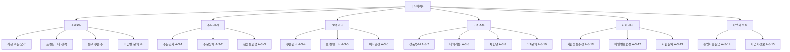
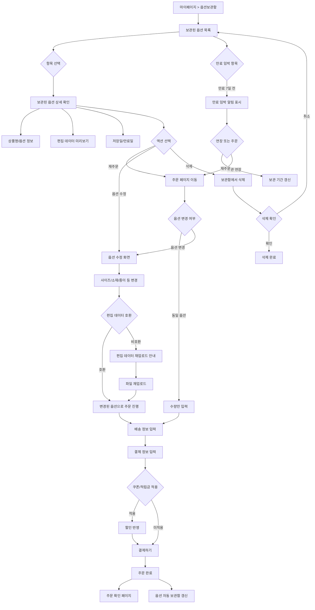
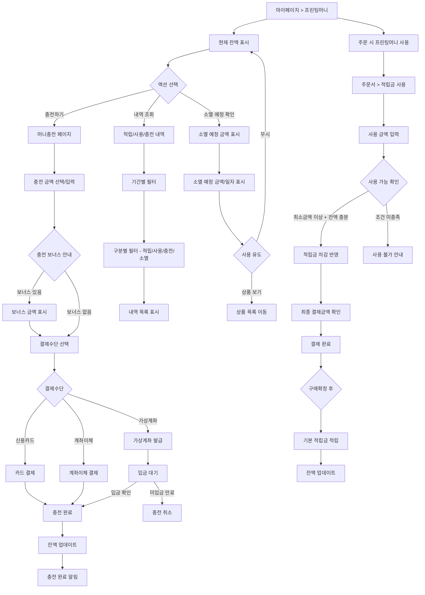

# 마이페이지 정책

## 문서 정보

| 항목 | 내용 |
|------|------|
| 문서번호 | POLICY-A3-MYPAGE |
| 작성일 | 2026-03-15 |
| 최종수정 | 2026-03-15 |
| 작성자 | 지니 |
| 대상독자 | 인쇄실무진, 운영팀 |
| 관련 IA | A-3 (마이페이지 15개) |
| 총 결정 항목 | 15개 |
| 상태 | 작성중 |

---

## 목차

1. [정책 요약](#1-정책-요약)
2. [경쟁사 현황](#2-경쟁사-현황)
3. [마이페이지 메뉴 구성](#3-마이페이지-메뉴-구성)
4. [기능별 정책](#4-기능별-정책)
5. [UserFlow](#5-userflow)
6. [정책 결정 체크리스트](#6-정책-결정-체크리스트)
7. [추천 정책안](#7-추천-정책안)
8. [부록: 개발 참고사항](#부록-개발-참고사항)

---

## 1. 정책 요약

후니프린팅 마이페이지는 **주문 관리**, **혜택 관리**, **고객 소통**, **회원 정보 관리**를 통합하는 고객 전용 공간입니다. 인쇄 전문 쇼핑몰의 특성을 반영하여 옵션보관함(편집 데이터 저장), 프린팅머니(적립금), 증빙서류 발급 등 차별화된 기능을 제공합니다.

### 핵심 결정사항

| 번호 | 결정 사항 | 상태 |
|------|-----------|------|
| 1 | 주문조회 필터/정렬 및 기간 범위 | 미결정 |
| 2 | 주문상세 편집 미리보기 제공 범위 | 미결정 |
| 3 | 옵션보관함 보관 기간 및 재주문 정책 | 미결정 |
| 4 | 쿠폰 관리 노출 및 알림 정책 | 미결정 |
| 5 | 프린팅머니 적립/사용/충전 정책 | 미결정 |
| 6 | 머니충전 결제수단 및 보너스 정책 | 미결정 |
| 7 | 상품Q&A 운영 정책 | 미결정 |
| 8 | 나의리뷰 관리 정책 | 미결정 |
| 9 | 체험단 참여 이력 관리 정책 | 미결정 |
| 10 | 1:1문의 운영 정책 | 미결정 |
| 11 | 회원정보 수정 범위 | 미결정 |
| 12 | 비밀번호 변경 정책 | 미결정 |
| 13 | 회원탈퇴 절차 및 정책 | 미결정 |
| 14 | 증빙서류 발급 종류 및 절차 | 미결정 |
| 15 | 사업자정보 관리 범위 | 미결정 |

---

## 2. 경쟁사 현황

### 2.1 레드프린팅

| 항목 | 내용 |
|------|------|
| 마이페이지 구성 | 장바구니, 마이페이지(주문/반품/환불) |
| 간편재주문 | 1개월 이내 주문 간편재주문 기능 제공 |
| 반품/환불 | 마이페이지 내 반품/환불 신청 기능 |
| 특이사항 | 간편재주문으로 동일 인쇄물 재주문 편의성 강화 |

**시사점**: 인쇄물 특성상 동일 사양의 재주문 빈도가 높으므로 간편재주문 기능이 핵심. 1개월 보관 기간은 비교적 짧은 편으로, 후니프린팅은 더 긴 보관 기간 검토 필요.

### 2.2 와우프레스

| 항목 | 내용 |
|------|------|
| 마이페이지 구성 | 주문배송조회, 장바구니, 견적상담, 쿠폰관리 |
| 주문관리 | 주문배송조회에서 주문 상태별 필터링 |
| 견적상담 | 대량주문 견적 상담 이력 관리 |
| 쿠폰 | 보유 쿠폰 목록 + 사용완료/만료 쿠폰 구분 |

**시사점**: 견적상담 이력을 마이페이지에 통합하여 B2B 고객 편의성 향상. 쿠폰 관리에서 사용/만료 이력까지 제공하여 투명한 혜택 관리.

### 2.3 비교 분석표

| 비교 항목 | 레드프린팅 | 와우프레스 |
|-----------|-----------|-----------|
| **주문조회** | 기본 제공 | 상태별 필터 제공 |
| **간편재주문** | O (1개월) | 미확인 |
| **장바구니** | 별도 관리 | 별도 관리 |
| **반품/환불** | 마이페이지 내 | 미확인 |
| **쿠폰관리** | 미확인 | O (사용/만료 구분) |
| **견적상담** | 미확인 | O (이력 관리) |
| **적립금** | i.TOKEN | 등급별 차등 |
| **증빙서류** | 미확인 | 미확인 |

---

## 3. 마이페이지 메뉴 구성

### 3.1 메뉴 분류

| 분류 | IA 코드 | 메뉴명 | 설명 |
|------|---------|--------|------|
| **주문 관리** | A-3-1 | 주문조회 | 주문 내역 목록 및 상태 확인 |
| | A-3-2 | 주문상세 | 개별 주문 상세 정보 + 편집 미리보기 |
| | A-3-3 | 옵션보관함 | 주문 옵션/편집 데이터 저장 및 재주문 |
| **혜택 관리** | A-3-4 | 쿠폰관리 | 보유/사용/만료 쿠폰 관리 |
| | A-3-5 | 프린팅머니 | 적립금 잔액/내역 조회 |
| | A-3-6 | 머니충전 | 프린팅머니 충전 기능 |
| **고객 소통** | A-3-7 | 상품Q&A | 상품 문의 작성/답변 확인 |
| | A-3-8 | 나의리뷰 | 작성한 리뷰 관리 |
| | A-3-9 | 체험단 | 체험단 참여 이력 및 현황 |
| | A-3-10 | 1:1문의 | 개인 문의 작성/답변 확인 |
| **회원 관리** | A-3-11 | 회원정보수정 | 개인정보 수정 |
| | A-3-12 | 비밀번호변경 | 비밀번호 변경 |
| | A-3-13 | 회원탈퇴 | 회원 탈퇴 신청 |
| **사업자 전용** | A-3-14 | 증빙서류발급 | 세금계산서, 거래명세서 등 발급 |
| | A-3-15 | 사업자정보 | 사업자 정보 등록/수정 |

---

## 4. 기능별 정책

### 4.1 주문조회 (A-3-1)

**경쟁사 현황**
- 레드프린팅: 기본 주문 목록 제공
- 와우프레스: 주문 상태별 필터링 제공

**정책 결정 필요사항**

| 번호 | 결정 항목 | 선택지 | 결정 |
|------|-----------|--------|------|
| 1 | 주문조회 기본 기간 | 최근 1개월 / 3개월 / 6개월 | 미결정 |
| 2 | 최대 조회 기간 | 1년 / 2년 / 전체 | 미결정 |
| 3 | 상태별 필터 | 전체/결제완료/제작중/배송중/배송완료/취소 | 미결정 |
| 4 | 정렬 기준 | 최신순 / 주문번호순 / 금액순 | 미결정 |
| 5 | 목록 표시 정보 | 주문번호/날짜/상품명/금액/상태 | 미결정 |
| 6 | 페이지당 표시 건수 | 10건 / 20건 / 50건 | 미결정 |
| 7 | 간편재주문 버튼 | 목록에 표시 / 상세에서만 / 미제공 | 미결정 |

### 4.2 주문상세 (A-3-2)

**경쟁사 현황**
- 레드프린팅: 주문 상세 + 반품/환불 신청 가능
- 와우프레스: 주문 상세 + 배송 추적

**정책 결정 필요사항**

| 번호 | 결정 항목 | 선택지 | 결정 |
|------|-----------|--------|------|
| 1 | 편집 미리보기 제공 | 제공(썸네일) / 제공(상세보기) / 미제공 | 미결정 |
| 2 | 주문 상태 변경 이력 | 표시 / 미표시 | 미결정 |
| 3 | 배송 추적 연동 | 택배사 API 연동 / 송장번호 링크 / 미제공 | 미결정 |
| 4 | 주문 취소 가능 시점 | 결제완료~제작 시작 전 / 결제 후 1시간 / 미제공 | 미결정 |
| 5 | 반품/교환 신청 | 마이페이지 내 신청 / 고객센터 연결 | 미결정 |
| 6 | 재주문 기능 | 동일 옵션 재주문 / 옵션 수정 후 재주문 / 미제공 | 미결정 |
| 7 | 주문서 인쇄 | 제공 / 미제공 | 미결정 |
| 8 | 파일 재다운로드 | 제공(기간 제한) / 미제공 | 미결정 |

### 4.3 옵션보관함 (A-3-3)

**경쟁사 현황**
- 레드프린팅: 간편재주문 기능 (1개월 보관)
- 와우프레스: 별도 보관함 미확인

**정책 결정 필요사항**

| 번호 | 결정 항목 | 선택지 | 결정 |
|------|-----------|--------|------|
| 1 | 보관 대상 | 주문 옵션만 / 편집 데이터 포함 / 시안 파일 포함 | 미결정 |
| 2 | 보관 기간 | 1개월 / 3개월 / 6개월 / 12개월 / 무기한 | 미결정 |
| 3 | 최대 보관 건수 | 10건 / 30건 / 50건 / 무제한 | 미결정 |
| 4 | 보관함에서 재주문 | 동일 옵션 즉시 재주문 / 옵션 수정 후 주문 / 둘 다 | 미결정 |
| 5 | 보관 항목 삭제 | 수동 삭제만 / 기간 만료 시 자동 삭제 / 둘 다 | 미결정 |
| 6 | 보관함 분류 | 상품 유형별 / 날짜별 / 미분류 | 미결정 |
| 7 | 보관함 이름 지정 | 사용자 지정 이름 / 자동 생성(상품명+날짜) | 미결정 |

### 4.4 쿠폰관리 (A-3-4)

**경쟁사 현황**
- 와우프레스: 보유 쿠폰 목록 + 사용완료/만료 구분

**정책 결정 필요사항**

| 번호 | 결정 항목 | 선택지 | 결정 |
|------|-----------|--------|------|
| 1 | 쿠폰 탭 구분 | 사용가능/사용완료/만료 3탭 / 전체+필터 | 미결정 |
| 2 | 만료 임박 알림 | 3일 전 / 7일 전 / 미제공 | 미결정 |
| 3 | 쿠폰 상세 정보 | 할인금액/조건/유효기간/적용 가능 상품 | 미결정 |
| 4 | 쿠폰 등록 기능 | 쿠폰코드 수동 입력 등록 / 미제공 | 미결정 |
| 5 | 쿠폰 정렬 | 만료일순 / 할인금액순 / 등록일순 | 미결정 |

### 4.5 프린팅머니 (A-3-5)

**경쟁사 현황**
- 레드프린팅: i.TOKEN 적립/사용 내역 조회
- 와우프레스: 등급별 차등 적립률

**정책 결정 필요사항**

| 번호 | 결정 항목 | 선택지 | 결정 |
|------|-----------|--------|------|
| 1 | 잔액 표시 위치 | 마이페이지 대시보드 + 상세 / 상세만 | 미결정 |
| 2 | 내역 표시 항목 | 일시/구분(적립/사용/충전)/금액/잔액/사유 | 미결정 |
| 3 | 내역 조회 기간 | 1개월 / 3개월 / 6개월 / 1년 / 전체 | 미결정 |
| 4 | 소멸 예정 알림 | 30일 전 / 7일 전 / 미제공 | 미결정 |
| 5 | 소멸 예정 금액 표시 | 별도 영역 표시 / 내역에 표기 / 미표시 | 미결정 |

### 4.6 머니충전 (A-3-6)

**경쟁사 현황**
- 레드프린팅: 별도 충전 기능 미확인
- 와우프레스: 별도 충전 기능 미확인

**정책 결정 필요사항**

| 번호 | 결정 항목 | 선택지 | 결정 |
|------|-----------|--------|------|
| 1 | 충전 기능 도입 시기 | 오픈 시 / 2차 도입 / 미도입 | 미결정 |
| 2 | 충전 결제수단 | 신용카드 / 계좌이체 / 가상계좌 / 복합 | 미결정 |
| 3 | 최소 충전 금액 | 10,000원 / 30,000원 / 50,000원 | 미결정 |
| 4 | 최대 충전 금액 | 100,000원 / 500,000원 / 1,000,000원 | 미결정 |
| 5 | 충전 단위 | 자유 입력 / 1만원 단위 / 정액 선택 | 미결정 |
| 6 | 충전 보너스 | 5% / 10% / 금액별 차등 / 없음 | 미결정 |
| 7 | 충전금 환불 | 가능(수수료 공제) / 가능(전액) / 불가 | 미결정 |
| 8 | 자동충전 기능 | 잔액 부족 시 자동충전 / 미제공 | 미결정 |

### 4.7 상품Q&A (A-3-7)

**경쟁사 현황**
- 공통: 상품 상세 페이지 내 Q&A 탭 운영

**정책 결정 필요사항**

| 번호 | 결정 항목 | 선택지 | 결정 |
|------|-----------|--------|------|
| 1 | Q&A 공개 범위 | 전체 공개 / 작성자만 / 선택(공개/비밀) | 미결정 |
| 2 | 비밀글 기능 | 제공 / 미제공 | 미결정 |
| 3 | 답변 알림 | SMS / 이메일 / 앱알림 / 복합 | 미결정 |
| 4 | 문의 분류 | 상품문의/배송문의/기타 / 자유 입력 | 미결정 |
| 5 | 파일 첨부 | 허용(이미지만) / 허용(이미지+PDF) / 불허 | 미결정 |
| 6 | 답변 기한 안내 | 영업일 1일 / 2일 / 미표기 | 미결정 |

### 4.8 나의리뷰 (A-3-8)

**경쟁사 현황**
- 와우프레스: 작성 가능 리뷰 + 작성 완료 리뷰 구분 관리

**정책 결정 필요사항**

| 번호 | 결정 항목 | 선택지 | 결정 |
|------|-----------|--------|------|
| 1 | 탭 구분 | 작성가능/작성완료 2탭 / 전체 | 미결정 |
| 2 | 리뷰 수정 기능 | 제공(기간 제한) / 제공(무기한) / 미제공 | 미결정 |
| 3 | 리뷰 삭제 기능 | 제공(보상 회수) / 제공(보상 유지) / 미제공 | 미결정 |
| 4 | 리뷰 보상 내역 | 리뷰별 보상 금액 표시 / 미표시 | 미결정 |
| 5 | 베스트리뷰 배지 | 선정 시 배지 표시 / 미표시 | 미결정 |

### 4.9 체험단 (A-3-9)

**경쟁사 현황**
- 별도 체험단 관리 기능을 마이페이지에 포함하는 사례 드묾

**정책 결정 필요사항**

| 번호 | 결정 항목 | 선택지 | 결정 |
|------|-----------|--------|------|
| 1 | 체험단 메뉴 도입 시기 | 오픈 시 / 체험단 기능 도입 시 / 미도입 | 미결정 |
| 2 | 참여 이력 표시 | 신청/선정/완료 전체 이력 / 진행중만 | 미결정 |
| 3 | 리뷰 작성 상태 | 미작성/작성완료 표시 / 미표시 | 미결정 |
| 4 | 리뷰 작성 바로가기 | 제공 / 미제공 | 미결정 |

### 4.10 1:1문의 (A-3-10)

**경쟁사 현황**
- 공통: 1:1 문의 게시판 형태로 운영
- 와우프레스: AI챗봇 "방울이" 24시간 운영 (1차 응대)

**정책 결정 필요사항**

| 번호 | 결정 항목 | 선택지 | 결정 |
|------|-----------|--------|------|
| 1 | 문의 분류 카테고리 | 주문/배송/결제/환불/기타 / 자유 입력 | 미결정 |
| 2 | 파일 첨부 | 허용(이미지만) / 허용(이미지+파일) / 불허 | 미결정 |
| 3 | 답변 알림 | SMS / 이메일 / 복합 | 미결정 |
| 4 | 답변 만족도 평가 | 제공(5점) / 제공(좋아요/싫어요) / 미제공 | 미결정 |
| 5 | 이전 문의 이력 조회 | 전체 이력 / 최근 6개월 / 미제공 | 미결정 |
| 6 | 주문 연결 기능 | 문의 시 주문번호 자동 연결 / 수동 입력 | 미결정 |

### 4.11 회원정보수정 (A-3-11)

**경쟁사 현황**
- 공통: 비밀번호 재확인 후 정보 수정 가능

**정책 결정 필요사항**

| 번호 | 결정 항목 | 선택지 | 결정 |
|------|-----------|--------|------|
| 1 | 수정 전 본인확인 | 비밀번호 재입력 / 본인인증 / 둘 다 | 미결정 |
| 2 | 수정 가능 항목 | 이름/휴대전화/주소/추가정보 | 미결정 |
| 3 | 수정 불가 항목 | 이메일(아이디) / 가입일 | 미결정 |
| 4 | 휴대전화 변경 시 인증 | SMS 재인증 필수 / 선택 | 미결정 |
| 5 | SNS 계정 연동 관리 | 연동/해제 기능 / 미제공 | 미결정 |
| 6 | 마케팅 수신동의 변경 | 변경 가능 / 고객센터 통해서만 | 미결정 |

### 4.12 비밀번호변경 (A-3-12)

**경쟁사 현황**
- 공통: 현재 비밀번호 확인 후 새 비밀번호 설정

**정책 결정 필요사항**

| 번호 | 결정 항목 | 선택지 | 결정 |
|------|-----------|--------|------|
| 1 | 변경 절차 | 현재비밀번호 입력 → 새 비밀번호 / 본인인증 → 새 비밀번호 | 미결정 |
| 2 | 비밀번호 규칙 | 8자 이상 영문+숫자 / 영문+숫자+특수문자 | 미결정 |
| 3 | 이전 비밀번호 재사용 | 최근 3개 불가 / 5개 불가 / 제한 없음 | 미결정 |
| 4 | 변경 주기 권고 | 90일마다 권고 알림 / 180일 / 미권고 | 미결정 |
| 5 | 변경 후 전체 로그아웃 | 전체 기기 로그아웃 / 현재 기기만 유지 | 미결정 |

### 4.13 회원탈퇴 (A-3-13)

**경쟁사 현황**
- 공통: 탈퇴 사유 수집, 유의사항 안내 후 탈퇴 처리

**정책 결정 필요사항**

| 번호 | 결정 항목 | 선택지 | 결정 |
|------|-----------|--------|------|
| 1 | 탈퇴 전 확인사항 안내 | 잔여 적립금/쿠폰/진행중 주문 안내 / 간략 안내 | 미결정 |
| 2 | 탈퇴 사유 수집 | 필수 / 선택 / 미수집 | 미결정 |
| 3 | 탈퇴 사유 선택지 | 이용 불편/가격/서비스 불만/개인정보/기타(자유입력) | 미결정 |
| 4 | 탈퇴 유예 기간 | 즉시 / 7일 / 30일 (철회 가능) | 미결정 |
| 5 | 진행중 주문 시 탈퇴 | 탈퇴 불가(완료 후 가능) / 주문유지+탈퇴 | 미결정 |
| 6 | 탈퇴 완료 안내 | 이메일 발송 / 페이지 안내만 / 둘 다 | 미결정 |

### 4.14 증빙서류발급 (A-3-14)

**경쟁사 현황**
- 인쇄업체 특성상 사업자 고객이 많아 증빙서류 발급 수요 높음

**정책 결정 필요사항**

| 번호 | 결정 항목 | 선택지 | 결정 |
|------|-----------|--------|------|
| 1 | 발급 가능 서류 종류 | 세금계산서/거래명세서/영수증/현금영수증 | 미결정 |
| 2 | 세금계산서 발행 방식 | 자동 발행 / 요청 시 발행 / PG 연동 자동 | 미결정 |
| 3 | 거래명세서 다운로드 | PDF 다운로드 / 인쇄하기 / 둘 다 | 미결정 |
| 4 | 현금영수증 발급 | 결제 시 자동 / 마이페이지에서 사후 발급 | 미결정 |
| 5 | 증빙서류 조회 기간 | 최근 1년 / 2년 / 전체 | 미결정 |
| 6 | 수정 세금계산서 | 발급 가능 / 고객센터 문의 | 미결정 |

### 4.15 사업자정보 (A-3-15)

**경쟁사 현황**
- 레드프린팅: 기업고객 별도 몰 운영
- 와우프레스: 사업자 정보 별도 관리 미확인

**정책 결정 필요사항**

| 번호 | 결정 항목 | 선택지 | 결정 |
|------|-----------|--------|------|
| 1 | 사업자정보 등록 시점 | 회원가입 시 / 마이페이지에서 추후 등록 / 둘 다 | 미결정 |
| 2 | 필수 입력 항목 | 사업자번호/상호명/대표자/업태/종목/사업장주소 | 미결정 |
| 3 | 사업자등록증 첨부 | 필수 / 선택 / 불필요 | 미결정 |
| 4 | 사업자번호 검증 | 국세청 API 실시간 검증 / 형식 검증만 / 미검증 | 미결정 |
| 5 | 세금계산서 수신 이메일 | 별도 입력 / 회원 이메일과 동일 / 선택 | 미결정 |
| 6 | 사업자정보 수정 | 자유 수정 / 관리자 승인 후 수정 | 미결정 |
| 7 | 담당자 정보 | 별도 담당자 이름/연락처 입력 / 미제공 | 미결정 |

---

## 5. UserFlow

### 5.1 마이페이지 메뉴 구조도

### 5.2 옵션보관함 → 재주문 UserFlow

### 5.3 프린팅머니 충전/사용 UserFlow

---

## 6. 정책 결정 체크리스트

### A-3-1 주문조회

- [ ] 기본 조회 기간 결정
- [ ] 최대 조회 기간 결정
- [ ] 상태별 필터 항목 확정
- [ ] 정렬 기준 결정
- [ ] 목록 표시 정보 확정
- [ ] 페이지당 표시 건수 결정
- [ ] 간편재주문 버튼 위치 결정

### A-3-2 주문상세

- [ ] 편집 미리보기 제공 범위 결정
- [ ] 주문 상태 변경 이력 표시 여부 결정
- [ ] 배송 추적 연동 방식 결정
- [ ] 주문 취소 가능 시점 결정
- [ ] 반품/교환 신청 방식 결정
- [ ] 재주문 기능 방식 결정
- [ ] 주문서 인쇄 기능 제공 여부 결정
- [ ] 파일 재다운로드 제공 여부 결정

### A-3-3 옵션보관함

- [ ] 보관 대상 범위 결정
- [ ] 보관 기간 결정
- [ ] 최대 보관 건수 결정
- [ ] 보관함에서 재주문 방식 결정
- [ ] 보관 항목 삭제 정책 결정
- [ ] 보관함 분류 방식 결정
- [ ] 보관함 이름 지정 방식 결정

### A-3-4 쿠폰관리

- [ ] 쿠폰 탭 구분 방식 결정
- [ ] 만료 임박 알림 시점 결정
- [ ] 쿠폰 상세 정보 표시 항목 확정
- [ ] 쿠폰코드 수동 등록 기능 결정
- [ ] 쿠폰 정렬 기준 결정

### A-3-5 프린팅머니

- [ ] 잔액 표시 위치 결정
- [ ] 내역 표시 항목 확정
- [ ] 내역 조회 기간 결정
- [ ] 소멸 예정 알림 시점 결정
- [ ] 소멸 예정 금액 표시 방식 결정

### A-3-6 머니충전

- [ ] 충전 기능 도입 시기 결정
- [ ] 충전 결제수단 확정
- [ ] 최소/최대 충전 금액 결정
- [ ] 충전 단위 결정
- [ ] 충전 보너스 정책 결정
- [ ] 충전금 환불 정책 결정
- [ ] 자동충전 기능 제공 여부 결정

### A-3-7 상품Q&A

- [ ] Q&A 공개 범위 결정
- [ ] 비밀글 기능 제공 여부 결정
- [ ] 답변 알림 방식 결정
- [ ] 문의 분류 카테고리 결정
- [ ] 파일 첨부 허용 범위 결정
- [ ] 답변 기한 안내 여부 결정

### A-3-8 나의리뷰

- [ ] 탭 구분 방식 결정
- [ ] 리뷰 수정 기능 정책 결정
- [ ] 리뷰 삭제 시 보상 처리 결정
- [ ] 리뷰 보상 내역 표시 여부 결정
- [ ] 베스트리뷰 배지 표시 여부 결정

### A-3-9 체험단

- [ ] 체험단 메뉴 도입 시기 결정
- [ ] 참여 이력 표시 범위 결정
- [ ] 리뷰 작성 상태 표시 여부 결정
- [ ] 리뷰 작성 바로가기 제공 여부 결정

### A-3-10 1:1문의

- [ ] 문의 분류 카테고리 확정
- [ ] 파일 첨부 허용 범위 결정
- [ ] 답변 알림 방식 결정
- [ ] 답변 만족도 평가 방식 결정
- [ ] 이전 문의 이력 조회 기간 결정
- [ ] 주문 연결 기능 방식 결정

### A-3-11 회원정보수정

- [ ] 수정 전 본인확인 방식 결정
- [ ] 수정 가능 항목 확정
- [ ] 수정 불가 항목 확정
- [ ] 휴대전화 변경 시 재인증 여부 결정
- [ ] SNS 계정 연동 관리 기능 결정
- [ ] 마케팅 수신동의 변경 기능 결정

### A-3-12 비밀번호변경

- [ ] 변경 절차 결정
- [ ] 비밀번호 규칙 확정
- [ ] 이전 비밀번호 재사용 제한 결정
- [ ] 변경 주기 권고 정책 결정
- [ ] 변경 후 전체 로그아웃 정책 결정

### A-3-13 회원탈퇴

- [ ] 탈퇴 전 확인사항 안내 범위 결정
- [ ] 탈퇴 사유 수집 여부 결정
- [ ] 탈퇴 사유 선택지 확정
- [ ] 탈퇴 유예 기간 결정
- [ ] 진행중 주문 시 탈퇴 처리 결정
- [ ] 탈퇴 완료 안내 방식 결정

### A-3-14 증빙서류발급

- [ ] 발급 가능 서류 종류 확정
- [ ] 세금계산서 발행 방식 결정
- [ ] 거래명세서 제공 형태 결정
- [ ] 현금영수증 발급 방식 결정
- [ ] 증빙서류 조회 기간 결정
- [ ] 수정 세금계산서 발급 방식 결정

### A-3-15 사업자정보

- [ ] 사업자정보 등록 시점 결정
- [ ] 필수 입력 항목 확정
- [ ] 사업자등록증 첨부 요구 수준 결정
- [ ] 사업자번호 검증 방식 결정
- [ ] 세금계산서 수신 이메일 설정 결정
- [ ] 사업자정보 수정 방식 결정
- [ ] 담당자 정보 입력 여부 결정

---

## 7. 추천 정책안

아래는 경쟁사 분석과 인쇄업 특성을 반영한 추천안입니다. 최종 결정은 운영팀에서 진행합니다.

### 7.1 주문 관리 추천안

| 항목 | 추천안 | 근거 |
|------|--------|------|
| 기본 조회 기간 | **최근 3개월** | 인쇄물 재주문 주기 고려 |
| 최대 조회 기간 | **전체** | 과거 주문 옵션 재활용 수요 |
| 편집 미리보기 | **썸네일 + 상세보기** | 인쇄물 확인 편의성 (업계 차별화 포인트) |
| 배송 추적 | **택배사 API 연동** | 실시간 배송 상태 확인 |
| 간편재주문 | **목록 + 상세 모두 표시** | 재주문 빈도 높은 인쇄업 특성 |

### 7.2 옵션보관함 추천안

| 항목 | 추천안 | 근거 |
|------|--------|------|
| 보관 대상 | **주문 옵션 + 편집 데이터 + 시안 파일** | 완전한 재주문 지원 |
| 보관 기간 | **6개월** (레드프린팅 1개월 대비 차별화) | 분기별 인쇄물 재주문 수요 커버 |
| 최대 보관 건수 | **30건** | 과도한 서버 부담 없이 실용적 |
| 재주문 방식 | **동일 옵션 즉시 + 옵션 수정 후 주문 둘 다** | 최대 편의성 |
| 보관함 이름 | **자동 생성(상품명+날짜) + 사용자 수정 가능** | 편의성과 구분 용이성 |

### 7.3 혜택 관리 추천안

| 항목 | 추천안 | 근거 |
|------|--------|------|
| 쿠폰 탭 | **사용가능/사용완료/만료 3탭** | 직관적 구분 |
| 만료 임박 알림 | **7일 전 SMS/이메일** | 쿠폰 사용률 향상 |
| 프린팅머니 잔액 | **대시보드 + 상세 둘 다** | 상시 잔액 인지 |
| 머니충전 | **2차 도입** (오픈 후 안정화 후) | 초기 운영 복잡도 최소화 |
| 소멸 예정 알림 | **30일 전** | 적립금 소멸 방지 + 사용 유도 |

### 7.4 고객 소통 추천안

| 항목 | 추천안 | 근거 |
|------|--------|------|
| Q&A 공개 범위 | **선택(공개/비밀)** | 고객 편의 + 다른 고객 참고용 |
| 답변 알림 | **SMS + 이메일 복합** | 확인율 극대화 |
| 1:1문의 분류 | **주문/배송/결제/반품교환/기타** | 인쇄업 CS 유형별 분류 |
| 답변 만족도 | **좋아요/싫어요** | 간편한 피드백 수집 |
| 리뷰 탭 | **작성가능/작성완료 2탭** | 리뷰 작성 유도 |

### 7.5 회원 관리 추천안

| 항목 | 추천안 | 근거 |
|------|--------|------|
| 수정 전 본인확인 | **비밀번호 재입력** | 간편하면서도 보안 유지 |
| 비밀번호 규칙 | **8자 이상 영문+숫자+특수문자** | 보안 강화 |
| 변경 주기 권고 | **180일** | 과도한 변경 요청은 UX 저하 |
| 탈퇴 유예 기간 | **7일 (철회 가능)** | 충동적 탈퇴 방지 |
| 탈퇴 사유 수집 | **선택(체크박스)** | 서비스 개선 데이터 확보 |

### 7.6 사업자 전용 추천안

| 항목 | 추천안 | 근거 |
|------|--------|------|
| 세금계산서 | **PG 연동 자동 발행** | 운영 효율, 사업자 고객 편의 |
| 거래명세서 | **PDF 다운로드 + 인쇄** | 다양한 활용 지원 |
| 사업자번호 검증 | **국세청 API 실시간 검증** | 허위 사업자 방지 |
| 사업자정보 등록 | **가입 시 + 마이페이지 추후 등록 둘 다** | 유연한 전환 지원 |
| 담당자 정보 | **별도 입력 제공** | B2B 커뮤니케이션 편의 |

---

## [부록] 개발 참고사항

> 이 섹션은 개발팀 참고용입니다. 인쇄실무진은 위 정책 결정 항목에 집중해주세요.

### shopby 플랫폼 대응 현황

shopby(NHN커머스)의 마이페이지 관련 기능 구현 방식을 정리합니다.

| IA 코드 | 기능 | 구현 방식 | 설명 |
|---------|------|-----------|------|
| A-3-1 | 주문조회 | SKIN | shopby 주문 API 활용 + 스킨 커스터마이징 |
| A-3-2 | 주문상세 | CUSTOM | 편집 미리보기는 별도 개발 필요, 기본 주문 상세는 SKIN |
| A-3-3 | 옵션보관함 | CUSTOM | shopby 미지원, 별도 데이터 저장/관리 시스템 개발 |
| A-3-4 | 쿠폰관리 | NATIVE | shopby 쿠폰 API 기본 제공 |
| A-3-5 | 프린팅머니 | SKIN | shopby 적립금 API 활용 + 스킨 커스터마이징 |
| A-3-6 | 머니충전 | CUSTOM | shopby 미지원, PG 결제 연동 + 적립금 적립 API 조합 |
| A-3-7 | 상품Q&A | NATIVE | shopby 상품문의 API 기본 제공 |
| A-3-8 | 나의리뷰 | NATIVE | shopby 상품후기 API 기본 제공 |
| A-3-9 | 체험단 | CUSTOM | shopby 미지원, 별도 관리 시스템 개발 |
| A-3-10 | 1:1문의 | NATIVE | shopby 1:1문의 API 기본 제공 |
| A-3-11 | 회원정보수정 | NATIVE | shopby 회원 API 기본 제공 |
| A-3-12 | 비밀번호변경 | NATIVE | shopby 회원 API 기본 제공 |
| A-3-13 | 회원탈퇴 | NATIVE | shopby 회원 탈퇴 API 기본 제공 |
| A-3-14 | 증빙서류발급 | SKIN | shopby 주문 API + 외부 서비스(팝빌 등) 연동 |
| A-3-15 | 사업자정보 | SKIN | shopby 회원 추가필드 활용 + 스킨 커스터마이징 |

**구현 방식 범례**
- **NATIVE**: shopby 기본 제공 기능, 관리자 설정만으로 사용 가능
- **SKIN**: shopby 스킨(프론트엔드) 커스터마이징으로 구현
- **CUSTOM**: shopby API 활용 + 별도 백엔드/프론트엔드 개발 필요

### 주요 API 참조

#### 주문 관련

| 기능 | API 엔드포인트 | 비고 |
|------|---------------|------|
| 주문 목록 조회 | GET /profile/orders | 기간/상태 필터 지원 |
| 주문 상세 조회 | GET /profile/orders/{orderNo} | 주문 상세 정보 |
| 주문 취소 요청 | PUT /profile/orders/{orderNo}/claim/cancel | 취소 가능 상태 확인 |
| 반품 신청 | POST /profile/orders/{orderNo}/claim/return | 반품 사유 포함 |
| 교환 신청 | POST /profile/orders/{orderNo}/claim/exchange | 교환 사유 포함 |
| 구매 확정 | PUT /profile/orders/{orderNo}/confirm | 구매 확정 처리 |

#### 혜택 관련

| 기능 | API 엔드포인트 | 비고 |
|------|---------------|------|
| 쿠폰 목록 조회 | GET /profile/coupons | 사용가능/사용완료/만료 필터 |
| 쿠폰 등록 | POST /profile/coupons | 쿠폰코드 수동 등록 |
| 적립금 잔액 조회 | GET /profile/accumulations/summary | 현재 잔액 |
| 적립금 내역 조회 | GET /profile/accumulations | 적립/사용/소멸 내역 |

#### 고객 소통 관련

| 기능 | API 엔드포인트 | 비고 |
|------|---------------|------|
| 상품Q&A 목록 | GET /profile/product-inquiries | 내 문의 목록 |
| 상품Q&A 작성 | POST /products/{productNo}/inquiries | 문의 등록 |
| 리뷰 목록 | GET /profile/product-reviews | 내 리뷰 목록 |
| 리뷰 작성 | POST /products/{productNo}/reviews | 리뷰 등록 |
| 1:1문의 목록 | GET /profile/inquiries | 내 문의 목록 |
| 1:1문의 작성 | POST /profile/inquiries | 문의 등록 |

#### 회원 관련

| 기능 | API 엔드포인트 | 비고 |
|------|---------------|------|
| 회원정보 조회 | GET /profile | 현재 로그인 회원 정보 |
| 회원정보 수정 | PUT /profile | 수정 가능 항목 |
| 비밀번호 변경 | PUT /profile/password | 현재+새 비밀번호 |
| 회원 탈퇴 | DELETE /profile | 탈퇴 사유 포함 |

### 기술 구현 포인트

1. **옵션보관함 (CUSTOM 개발)**
   - shopby에 보관함 기능이 없으므로 별도 데이터 저장 시스템 필요
   - 편집 데이터(시안 파일, 옵션 JSON)를 별도 스토리지에 저장
   - 보관함 → 재주문 시 주문 API에 저장된 옵션을 자동 주입
   - 보관 기간 만료 시 자동 삭제 배치 처리 구현

2. **주문상세 편집 미리보기 (CUSTOM 개발)**
   - 주문 시 업로드한 시안 파일의 썸네일 생성 및 저장
   - 이미지 뷰어 컴포넌트로 확대/축소 미리보기 제공
   - PDF 시안의 경우 PDF.js 등 라이브러리 활용

3. **머니충전 (CUSTOM 개발)**
   - PG 결제 → 결제 완료 콜백 → shopby 적립금 적립 API 호출
   - 충전 보너스 로직: 충전 금액 구간별 보너스 적립금 자동 추가
   - 충전 이력은 적립금 내역 API에 '충전' 구분으로 기록
   - 환불 처리: 충전 취소 시 PG 환불 + 적립금 차감 동시 처리

4. **증빙서류 발급**
   - 세금계산서: 팝빌(Popbill) API 연동으로 전자세금계산서 발행
   - 거래명세서: shopby 주문 데이터 기반 PDF 자동 생성
   - 현금영수증: PG사 현금영수증 발급 API 연동

5. **사업자정보 관리**
   - shopby 회원 추가필드(custom fields)에 사업자번호, 상호명, 대표자 등 저장
   - 국세청 사업자등록번호 조회 API로 실시간 검증
   - 사업자등록증 파일은 shopby 파일 업로드 API 활용

6. **체험단 마이페이지 연동**
   - 체험단 신청/선정/완료 상태는 커스텀 게시판 데이터와 연동
   - 마이페이지 체험단 메뉴에서 참여 이력 조회 시 게시판 API + 커스텀 필터링
   - 리뷰 작성 바로가기: 체험단 상품의 리뷰 작성 페이지로 직접 링크
