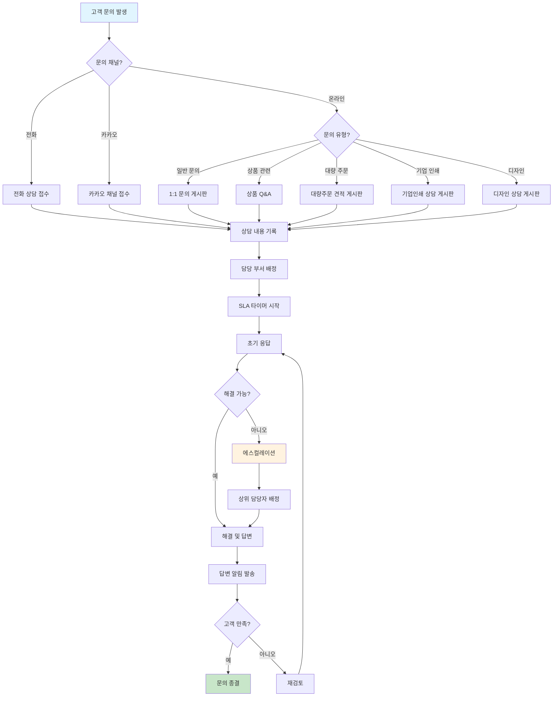
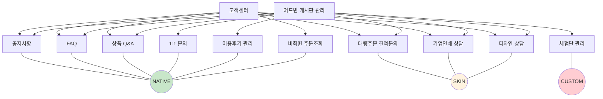
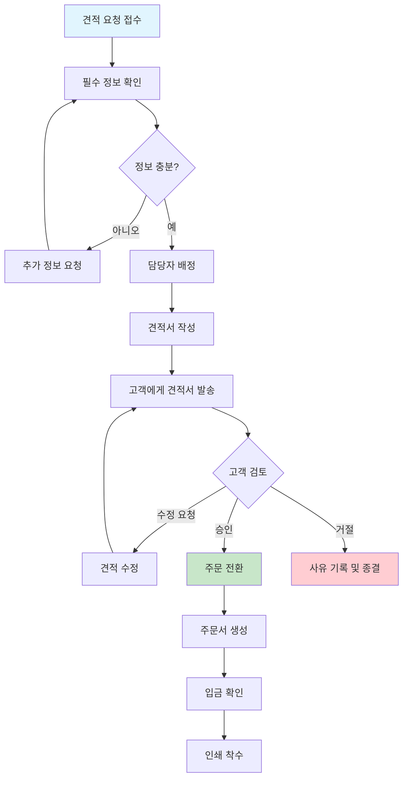
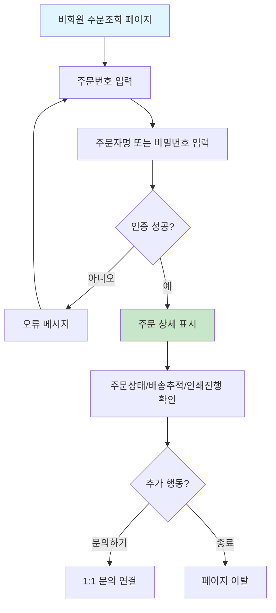
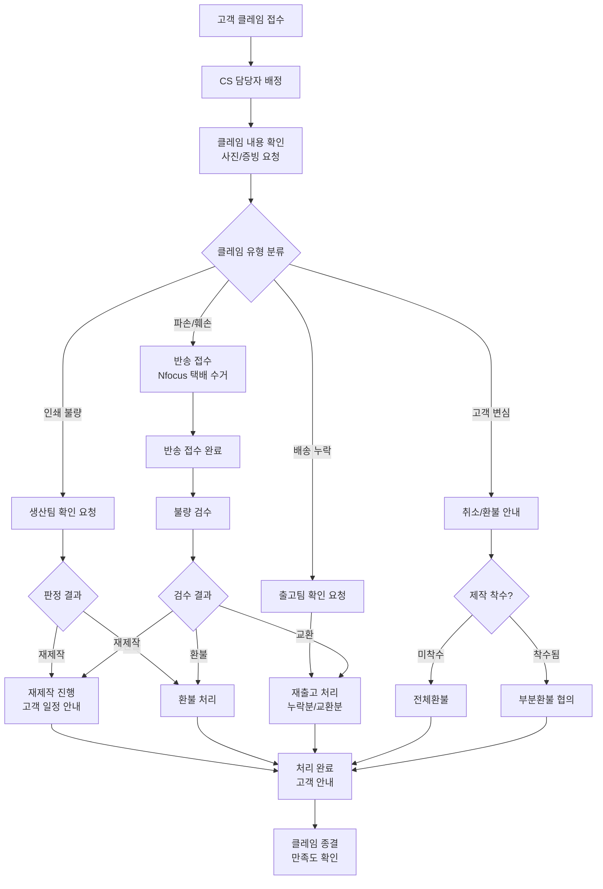

# 고객서비스 정책

**문서번호**: POLICY-A4B5-CS
**작성일**: 2026-03-15
**대상 독자**: 인쇄실무진 (CS, 운영)
**관련 IA**: A-4 고객센터 (7개), B-5 게시판 (9개)

---

## 목차
1. [정책 요약](#1-정책-요약)
2. [경쟁사 CS 체계 비교](#2-경쟁사-cs-체계-비교)
3. [고객 문의 채널 정책](#3-고객-문의-채널-정책)
4. [게시판 구성 정책](#4-게시판-구성-정책)
5. [SLA 정책](#5-sla-정책)
6. [UserFlow](#6-userflow)
7. [정책 결정 체크리스트](#7-정책-결정-체크리스트)
8. [추천 정책안](#8-추천-정책안)
9. [자동알림 연동](#9-자동알림-연동)
10. [클레임 처리 프로세스](#10-클레임-처리-프로세스)
11. [부록: 개발 참고사항](#부록-개발-참고사항)

---

## 1. 정책 요약

후니프린팅의 고객서비스는 **프론트 7개 기능(A-4)**과 **어드민 9개 기능(B-5)**으로 구성되며, 중복 제거 시 약 11개 고유 기능으로 운영됩니다.

핵심 정책 방향:
- **기본 CS 채널**(공지사항, FAQ, 상품Q&A, 1:1문의)은 shopby **네이티브** 기능 활용
- **인쇄 전문 상담**(대량주문견적, 기업인쇄상담, 디자인상담)은 **커스텀 게시판(SKIN)** 으로 구축
- 비회원 주문 조회는 shopby **네이티브** 기능 활용
- 체험단 관리는 별도 **커스텀 개발(CUSTOM)** 필요

| 구분 | 기능 수 | shopby 분류 | 비고 |
|------|---------|-------------|------|
| A-4 고객센터 (프론트) | 7개 | NATIVE 4 / SKIN 3 | 전문상담 3종이 SKIN |
| B-5 게시판 (어드민) | 9개 | NATIVE 5 / SKIN 3 / CUSTOM 1 | 체험단이 CUSTOM |

### 프론트/어드민 기능 매핑

| 프론트 (A-4) | 어드민 (B-5) | 비고 |
|-------------|-------------|------|
| 공지사항 | 공지사항 | 중복 (NATIVE) |
| FAQ | FAQ | 중복 (NATIVE) |
| 상품Q&A | 상품Q&A | 중복 (NATIVE) |
| 대량주문견적문의 | 대량주문견적 | 중복 (SKIN) |
| 기업인쇄상담 | 기업인쇄상담 | 중복 (SKIN) |
| 디자인상담 | 디자인상담 | 중복 (SKIN) |
| 비회원주문조회 | - | 프론트 전용 (NATIVE) |
| - | 1:1문의 | 어드민 전용 (NATIVE) |
| - | 체험단관리 | 어드민 전용 (CUSTOM) |
| - | 이용후기관리 | 어드민 전용 (NATIVE) |

---

## 2. 경쟁사 CS 체계 비교

### 2.1 CS 운영 비교표

| 항목 | 레드프린팅 | 와우프레스 | 오프린트미 | 후니프린팅 (계획) |
|------|-----------|-----------|-----------|------------------|
| 대표전화 | 1544-6698 | 1670-7645~9 | 1577-4703 | 결정 필요 |
| 운영시간 | 평일 10:00~18:00 | 평일 09:00~21:00 | 미공개 | 결정 필요 |
| 점심시간 | 12:00~14:00 | 미공개 | 미공개 | 결정 필요 |
| 파일상담 | - | O (합판/디지털 분리) | - | 검토 필요 |
| 견적상담 | - | O (독판 전용) | - | O (대량주문) |
| AI 챗봇 | - | O ("방울이" 24시간) | - | 검토 필요 |
| 헬프센터 | - | - | O (Zendesk) | 검토 필요 |

### 2.2 경쟁사 CS 특징 분석

**레드프린팅**
- 단일 대표번호 운영
- 점심시간 2시간(12~14시)으로 상대적으로 김
- 운영시간이 10~18시로 가장 짧음

**와우프레스**
- 상담 유형별 전화번호 분리 운영 (파일상담 합판/디지털, 견적상담 독판)
- **09:00~21:00** 장시간 운영으로 차별화
- **AI 챗봇 "방울이"** 24시간 운영 (업계 유일)

**오프린트미**
- Zendesk 기반 헬프센터 운영
- 모바일 앱 중심 CS (앱 내 문의)
- 전화 상담보다 온라인 상담 중심

### 2.3 시사점

- 인쇄업계 CS는 **파일 검수 상담**이 핵심 (인쇄 특수성)
- 와우프레스의 **장시간 운영**(09~21시)은 고객 만족도 핵심 요소
- **AI 챗봇**은 24시간 기본 응대 + 운영 효율화에 효과적
- **상담 유형별 채널 분리**가 전문성 향상에 유리

---

## 3. 고객 문의 채널 정책

### 3.1 채널 구성

| 채널 | 유형 | 운영 방식 | 우선순위 |
|------|------|----------|---------|
| 1:1 문의 게시판 | 온라인 | shopby 네이티브 | 기본 채널 |
| 상품 Q&A | 온라인 | shopby 네이티브 | 상품별 문의 |
| 대표 전화 | 유선 | 인입 전화 상담 | 긴급/복잡 문의 |
| 카카오 채널 | 메신저 | 카카오톡 채널 연동 | 간편 문의 |
| AI 챗봇 (검토) | 자동화 | 24시간 자동 응대 | 기본 응대 |

### 3.2 채널별 처리 범위

| 문의 유형 | 1:1 문의 | 전화 | 카카오 | AI 챗봇 |
|----------|---------|------|--------|---------|
| 주문/배송 문의 | O | O | O | O |
| 파일 검수 문의 | O | O | - | - |
| 가격/견적 문의 | O | O | O | O (간단) |
| 대량 주문 견적 | 전용 게시판 | O | - | - |
| 기업 인쇄 상담 | 전용 게시판 | O | - | - |
| 디자인 상담 | 전용 게시판 | O | - | - |
| 교환/환불 | O | O | O | - |
| 인쇄 품질 클레임 | O | O | - | - |

### 3.3 전화 상담 운영 정책

**결정 필요 사항**:
- 대표전화 번호 (1588/1544/1670 등)
- 운영 시간 (경쟁사 범위: 09:00~21:00)
- 점심 시간 운영 여부
- 주말/공휴일 운영 여부
- ARS 메뉴 구성

**추천안**:
- 운영 시간: 평일 09:00~18:00 (1단계), 향후 확대 검토
- 점심 시간: 12:00~13:00 (교대 운영으로 무중단 추천)
- 주말/공휴일: 미운영 (AI 챗봇으로 기본 응대)

### 3.4 카카오 채널 정책

- 카카오톡 비즈니스 채널 개설
- 자동 응답 메시지 설정 (운영시간 안내, FAQ 안내)
- 상담원 연결 기능 (운영 시간 내)
- 주문 알림톡 발송 (주문확인/입금확인/발송/배송완료)

### 3.5 AI 챗봇 도입 검토

| 항목 | 상세 |
|------|------|
| 도입 시기 | 2단계 이후 검토 |
| 적용 범위 | FAQ 응대, 주문 조회, 배송 추적, 간단 견적 |
| 기술 방식 | 규칙 기반(1단계) → AI 기반(2단계) |
| 참고 사례 | 와우프레스 "방울이" (24시간 운영) |
| 예상 효과 | CS 인력 30~40% 부하 절감 |

---

## 4. 게시판 구성 정책

### 4.1 게시판 유형 분류

#### (1) shopby 네이티브 게시판

| 게시판 | 설명 | 주요 기능 |
|--------|------|----------|
| 공지사항 | 운영 공지, 이벤트, 시스템 안내 | 목록/상세, 카테고리, 상단고정, 첨부파일 |
| FAQ | 자주 묻는 질문 | 카테고리별 분류, 검색, 아코디언 |
| 상품 Q&A | 상품별 문의/답변 | 상품 연동, 비밀글, 답변 알림 |
| 1:1 문의 | 개인 문의/답변 | 비밀글, 카테고리, 답변 알림, 첨부파일 |
| 이용후기 | 상품 후기/평점 | 상품 연동, 포토 후기, 평점, 베스트 후기 |

#### (2) 커스텀 게시판 (SKIN)

인쇄 전문 상담을 위한 커스텀 게시판 3종:

| 게시판 | 설명 | 커스텀 필드 |
|--------|------|-----------|
| 대량주문 견적 | 대량 인쇄 견적 요청 | 상품유형, 예상수량, 희망납기, 용지/사이즈, 인쇄사양, 첨부파일 |
| 기업인쇄 상담 | 기업 전용 인쇄 상담 | 회사명, 담당자, 인쇄유형, 정기/비정기, 예상물량, 예산범위 |
| 디자인 상담 | 디자인 의뢰/상담 | 상품유형, 디자인범위, 참고이미지, 희망납기, 예산범위 |

#### (3) 커스텀 개발 (CUSTOM)

| 게시판 | 설명 | 커스텀 사유 |
|--------|------|-----------|
| 체험단 관리 | 체험단 모집/관리 | shopby 미지원, 신청/선정/리뷰 관리 전용 워크플로우 필요 |

### 4.2 비회원 주문 조회

- shopby **네이티브** 기능 활용
- 주문번호 + 주문자명 또는 주문번호 + 비밀번호로 조회
- 조회 가능 정보: 주문 상태, 배송 추적, 인쇄 진행 상황

### 4.3 게시판 공통 정책

| 항목 | 정책 |
|------|------|
| 스팸 방지 | 비회원 작성 불가 (공지/FAQ 열람은 가능) |
| 비밀글 | 1:1문의, 견적문의, 기업상담, 디자인상담에 기본 적용 |
| 첨부파일 | 최대 5개, 파일당 10MB, 허용 형식: jpg/png/pdf/ai/psd/zip |
| 답변 알림 | 이메일 + 카카오 알림톡 (선택) |
| 답변 상태 | 접수/검토중/답변완료/종결 4단계 |
| 보존 기간 | 작성일로부터 3년 (법적 의무 보존 기간 준수) |

### 4.4 FAQ 카테고리 구성안

| 카테고리 | 예시 질문 |
|----------|----------|
| 주문/결제 | 주문 방법, 결제 수단, 주문 변경/취소 |
| 인쇄/제작 | 인쇄 사양, 파일 규격, 색상 차이, 후가공 |
| 배송 | 배송 기간, 배송비, 배송 추적, 분할 배송 |
| 교환/환불 | 교환 조건, 환불 절차, 인쇄 불량 처리 |
| 회원/계정 | 회원가입, 비밀번호, 등급, 포인트 |
| 파일 관련 | 파일 형식, 해상도, 재단 여백, 템플릿 |
| 대량주문 | 대량 할인, 견적 방법, 납기, 샘플 |

---

## 5. SLA 정책

### 5.1 문의 유형별 SLA

| 문의 유형 | 초기 응답 | 최종 해결 | 담당 부서 | 우선순위 |
|----------|----------|----------|----------|---------|
| 주문/배송 문의 | 4시간 이내 | 1영업일 | CS팀 | 보통 |
| 파일 검수 문의 | 2시간 이내 | 4시간 | 인쇄팀 | 높음 |
| 인쇄 품질 클레임 | 1시간 이내 | 2영업일 | 품질관리팀 | 긴급 |
| 교환/환불 요청 | 4시간 이내 | 3영업일 | CS팀 | 높음 |
| 대량주문 견적 | 4시간 이내 | 1영업일 | 영업팀 | 높음 |
| 기업인쇄 상담 | 4시간 이내 | 2영업일 | 영업팀 | 보통 |
| 디자인 상담 | 1영업일 이내 | 3영업일 | 디자인팀 | 보통 |
| 일반 문의 (FAQ) | 1영업일 이내 | 2영업일 | CS팀 | 낮음 |

### 5.2 SLA 측정 기준

- **초기 응답**: 문의 접수 시점부터 첫 번째 담당자 회신까지의 시간
- **최종 해결**: 문의 접수 시점부터 고객이 만족하는 해결까지의 시간
- **영업일 기준**: 평일 09:00~18:00 (공휴일 제외)
- **긴급 건**: 운영시간 외에도 카카오 알림으로 담당자 통보

### 5.3 SLA 미준수 시 에스컬레이션

| 단계 | 조건 | 조치 |
|------|------|------|
| 1단계 | 초기 응답 SLA 초과 | 팀장에게 자동 알림 |
| 2단계 | 최종 해결 SLA 50% 경과 | 팀장 직접 개입 |
| 3단계 | 최종 해결 SLA 초과 | 경영진 보고 + 고객 사과 안내 |

### 5.4 CS 품질 지표 (KPI)

| 지표 | 목표 | 측정 주기 |
|------|------|----------|
| 초기 응답 SLA 준수율 | 95% 이상 | 주간 |
| 최종 해결 SLA 준수율 | 90% 이상 | 주간 |
| 고객 만족도 (CSAT) | 4.0/5.0 이상 | 월간 |
| 1차 해결율 (FCR) | 70% 이상 | 월간 |
| 문의 재접수율 | 10% 이하 | 월간 |

---

## 6. UserFlow

### 6.1 고객 문의 처리 Flow

### 6.2 게시판 구조도

### 6.3 대량주문 견적 처리 Flow

### 6.4 비회원 주문 조회 Flow

---

## 7. 정책 결정 체크리스트

아래 항목들은 개발 착수 전 인쇄실무진(CS, 운영)이 결정해야 할 사항입니다.

### 7.1 CS 채널 관련

- [ ] 대표 전화번호 확정 (1588/1544/1670 등)
- [ ] 전화 운영 시간 확정 (09~18시 / 09~21시 등)
- [ ] 점심 시간 운영 방식 (중단 / 교대 무중단)
- [ ] 주말/공휴일 운영 여부
- [ ] 카카오 채널 개설 여부 및 운영 방식
- [ ] AI 챗봇 도입 시기 및 범위

### 7.2 게시판 관련

- [ ] 커스텀 게시판 3종(대량견적/기업상담/디자인상담) 입력 필드 최종 확정
- [ ] FAQ 초기 콘텐츠 작성 (카테고리별 최소 5개)
- [ ] 공지사항 카테고리 구성 확정
- [ ] 게시판 비밀글 기본 적용 범위 확인
- [ ] 첨부파일 용량/형식 제한 확정
- [ ] 체험단 운영 계획 및 시기

### 7.3 SLA 관련

- [ ] 문의 유형별 초기 응답 SLA 최종 확정
- [ ] 문의 유형별 최종 해결 SLA 최종 확정
- [ ] 에스컬레이션 프로세스 및 담당자 확정
- [ ] CS 품질 지표(KPI) 목표치 확정
- [ ] SLA 미준수 시 알림 수신자 확정

### 7.4 알림/통보 관련

- [ ] 답변 알림 채널 확정 (이메일 / 카카오 알림톡 / SMS)
- [ ] 주문 상태 알림 종류 확정 (주문확인/입금/발송/배송완료)
- [ ] 긴급 건 담당자 통보 방식 확정

### 7.5 운영 인력 관련

- [ ] CS 초기 인력 규모 산정
- [ ] 담당 부서별 역할 분담 확정 (CS팀/인쇄팀/영업팀/디자인팀)
- [ ] 파일 검수 담당자 지정
- [ ] 교육/매뉴얼 준비 계획

---

## 8. 추천 정책안

### 8.1 1단계 (MVP) 추천안

| 항목 | 추천 정책 |
|------|----------|
| CS 채널 | 1:1문의(네이티브) + 전화 + 카카오 채널 |
| 전화 운영 | 평일 09:00~18:00, 점심 교대 무중단 |
| 게시판 | 공지/FAQ/Q&A/1:1문의(네이티브) + 대량견적(SKIN) |
| SLA | 일반 4시간 초기응답, 파일검수 2시간, 클레임 1시간 |
| 알림 | 이메일 답변 알림 + 카카오 주문 알림톡 |
| AI 챗봇 | 미도입 (2단계 검토) |
| 체험단 | 미운영 (2단계 이후) |

### 8.2 2단계 확장 추천안

| 항목 | 추천 정책 |
|------|----------|
| CS 채널 확장 | 기업인쇄상담/디자인상담 게시판 추가 |
| 운영시간 확대 | 평일 09:00~20:00 (수요 기반 결정) |
| AI 챗봇 도입 | FAQ 응대 + 주문조회 자동화 (규칙 기반) |
| 체험단 | 체험단 모집/관리 시스템 구축 |
| SLA 고도화 | 자동 에스컬레이션 + 대시보드 구축 |

### 8.3 3단계 고도화 추천안

| 항목 | 추천 정책 |
|------|----------|
| AI 챗봇 고도화 | 자연어 기반 AI 상담 (견적 자동 산출 포함) |
| 옴니채널 통합 | 전화/채팅/이메일/카카오 통합 관리 시스템 |
| CS 분석 | 문의 트렌드 분석, 고객 감성 분석 |
| 자동화 | 반복 문의 자동 답변, 파일 자동 검수 |

---

## 9. 자동알림 연동

주문 상태 변경 시 자동 발송되는 알림 11종과 CS 업무의 연동 정책을 정의한다. (상세 알림 정의는 POLICY-A6B8-ORDER.md Section 9 참조)

### 9.1 알림별 CS 연동 포인트

| 코드 | 알림 종류 | 발송 시점 | CS 연동 |
|------|-----------|-----------|---------|
| 001 | 가상계좌 발급완료 | 가상계좌 주문 시 | 미입금 문의 시 안내 참고 |
| 002 | 결제완료 | 입금확인/카드결제 | 결제 관련 문의 응대 기준 |
| 003 | 재업로드 요청 | 파일검수 불합격 | **CS 적극 개입** - 고객 재업로드 안내 |
| 004 | 수정요청 | 편집기 수정 필요 | **CS 적극 개입** - 수정 안내 |
| 005 | 제작중 | 제작 착수 | 제작 진행 문의 응대 기준 |
| 006 | 제작완료(방문) | 방문수령 제작 완료 | 방문수령 안내 연락 |
| 007 | 출고예정(택배) | 출고 예정 | 배송 문의 응대 기준 |
| 008 | 출고완료 | 출고 완료 | 배송 추적 안내 |
| 009 | 출고완료(택배송장) | 송장번호 포함 | 송장번호 기반 배송 추적 안내 |
| 010 | 주문취소 | 취소 처리 | 환불 처리 상태 안내 |
| 011 | 가상계좌 자동취소 | 입금기한 초과 | 재주문 안내 |

### 9.2 알림 미수신 대응 프로세스

- 고객이 알림을 받지 못했다고 문의 시: 알림 발송 이력 확인 후 수동 재발송
- 알림톡 수신 실패 시: SMS 대체 발송 또는 이메일 발송
- 발송 이력은 주문 상세 화면에서 CS 담당자가 확인 가능

---

## 10. 클레임 처리 프로세스

CS 관점에서의 클레임 접수 및 처리 프로세스를 정의한다. (처리 정책 상세는 POLICY-A6B8-ORDER.md Section 10 참조)

### 10.1 클레임 접수 채널

| 접수 채널 | 접수 방식 | 우선순위 |
|-----------|-----------|---------|
| 전화 | CS 담당자가 직접 접수 | 긴급 |
| 1:1 문의 | 게시판으로 접수 | 높음 |
| 카카오 채널 | 메신저로 접수 | 보통 |
| 상품 Q&A | 게시판으로 접수 | 보통 |

### 10.2 클레임 유형별 CS 처리 규칙

| 클레임 유형 | CS 초기 대응 | 후속 처리 | SLA |
|------------|-------------|-----------|-----|
| 재제작 (일부/전체) | 불량 사진 요청, 불량 내용 확인 | 생산팀 재제작 요청 | 1시간 초기응답, 2영업일 해결 |
| 환불 (부분/전체) | 취소 사유 확인, 환불 안내 | 정산팀 환불 처리 | 1시간 초기응답, 3영업일 해결 |
| 반송 (Nfocus) | 반송 접수, Nfocus 택배 수거 안내 | 반송 접수 후 검수, 재제작/환불 결정 | 1시간 초기응답, 5영업일 해결 |
| 재출고 (누락/교환) | 누락/불량 내용 확인 | 출고팀 재출고 처리 | 1시간 초기응답, 2영업일 해결 |

### 10.3 클레임 처리 CS 흐름도

---

## [부록] 개발 참고사항

> 이 부록은 개발팀 참고용이며, 인쇄실무진은 건너뛰어도 됩니다.

### 기술 구현 분류

| 기능 | shopby 분류 | 구현 방향 |
|------|-------------|----------|
| 공지사항 | NATIVE | shopby 기본 게시판 사용 |
| FAQ | NATIVE | shopby 기본 게시판 + 카테고리 설정 |
| 상품 Q&A | NATIVE | shopby 기본 상품문의 사용 |
| 1:1 문의 | NATIVE | shopby 기본 1:1문의 사용 |
| 이용후기 관리 | NATIVE | shopby 기본 후기 시스템 사용 |
| 비회원 주문조회 | NATIVE | shopby 기본 비회원 조회 사용 |
| 대량주문 견적 | SKIN | 커스텀 입력 필드 + 스킨 게시판 |
| 기업인쇄 상담 | SKIN | 커스텀 입력 필드 + 스킨 게시판 |
| 디자인 상담 | SKIN | 커스텀 입력 필드 + 스킨 게시판 |
| 체험단 관리 | CUSTOM | 신청/선정/리뷰 워크플로우 전용 개발 |

### SKIN 게시판 커스텀 필드 설계

**대량주문 견적 게시판**:
- 상품 유형 (셀렉트: 명함/전단/포스터/봉투/제본/기타)
- 예상 수량 (숫자 입력)
- 희망 납기일 (날짜 선택)
- 용지/사이즈 요청사항 (텍스트)
- 인쇄 사양 상세 (텍스트에어리어)
- 첨부파일 (파일 업로드, 최대 5개)
- 연락처 (전화번호)
- 이메일 (이메일)

**기업인쇄 상담 게시판**:
- 회사명 (텍스트)
- 담당자명 (텍스트)
- 인쇄 유형 (셀렉트: 명함/전단/봉투/제본/기타)
- 정기/비정기 (라디오: 정기주문/비정기주문)
- 월 예상 물량 (텍스트)
- 예산 범위 (셀렉트: ~50만/50~100만/100~500만/500만~)
- 추가 요청사항 (텍스트에어리어)
- 첨부파일 (파일 업로드)

**디자인 상담 게시판**:
- 상품 유형 (셀렉트: 명함/전단/포스터/봉투/로고/기타)
- 디자인 범위 (체크박스: 신규디자인/수정보완/시안제작/로고디자인)
- 참고 이미지 (파일 업로드, 최대 10개)
- 희망 납기일 (날짜 선택)
- 예산 범위 (셀렉트: ~10만/10~30만/30~50만/50만~)
- 디자인 요청 상세 (텍스트에어리어)

### 체험단 관리 시스템 구조

체험단 워크플로우:
1. 체험단 모집 공고 등록 (어드민)
2. 회원 신청 접수 (프론트)
3. 신청자 심사 및 선정 (어드민)
4. 선정 알림 발송 (자동)
5. 상품 발송 (어드민)
6. 리뷰 작성 기한 관리 (자동)
7. 리뷰 승인/반려 (어드민)
8. 체험단 종료 및 통계 (어드민)

### 카카오 알림톡 연동

주요 알림톡 템플릿:
- 주문 확인 알림
- 입금 확인 알림
- 인쇄 착수 알림
- 발송 완료 알림 (운송장 포함)
- 배송 완료 알림
- 문의 답변 완료 알림
- 체험단 선정 알림
