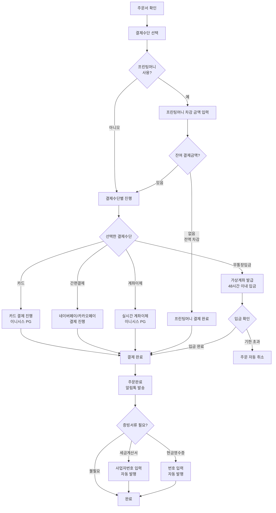
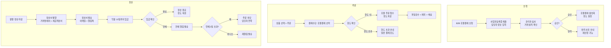

# 결제 정책

**문서번호**: POLICY-A5-PAYMENT
**작성일**: 2026-03-15
**대상 독자**: 인쇄실무진 (기획, 운영, CS)
**관련 IA**: A-5 결제, A-3 프린팅머니/머니충전, B-8 후불결제/증빙서류

---

## 목차
1. 정책 요약
2. 경쟁사 현황
3. 결제 수단별 정책
4. 프린팅머니 정책
5. B2B 후불결제 정책
6. 증빙서류 정책
7. UserFlow
8. 정책 결정 체크리스트
9. 추천 정책안
[부록] 개발 참고사항

---

## 1. 정책 요약

본 문서는 인쇄 주문의 결제와 관련된 전체 정책을 정의한다. 일반 결제, 프린팅머니(적립금), B2B 후불결제, 증빙서류 발급까지의 범위를 다룬다.

**핵심 정책 방향**:
- 선결제 후 제작 원칙
- 다양한 결제 수단 지원 (카드, 간편결제, 계좌이체, 무통장입금)
- 프린팅머니(적립금) 시스템으로 재구매 유도
- B2B 고객을 위한 후불결제 별도 운영
- 세금계산서/현금영수증 자동 발급 지원

---

## 2. 경쟁사 현황

### 2.1 결제 수단 비교

| 결제 수단 | 레드프린팅 | 와우프레스 | 오프린트미 | 후니프린팅(우리) |
|----------|-----------|-----------|-----------|----------------|
| 신용/체크카드 | O | O | O | O (예정) |
| 네이버페이 | O | O | - | O (예정) |
| 카카오페이 | O | O | - | O (예정) |
| 스마일페이 | O | - | - | 검토 |
| 페이코 | O | - | - | 검토 |
| 계좌이체 | O | - | - | O (예정) |
| 무통장입금 | O | O (가상계좌) | O | O (예정) |
| 티페이 | - | O | - | 미도입 |
| 수동카드결제 | - | - | - | O (예정) |
| 적립금 | - | - | - | 프린팅머니 |

### 2.2 결제 정책 비교

| 항목 | 레드프린팅 | 와우프레스 | 오프린트미 | 후니프린팅(우리) |
|------|-----------|-----------|-----------|----------------|
| 결제 시점 | 선결제 | 선결제 | 선결제 | 선결제 (B2B 후불 별도) |
| 취소 환불 | - | - | 1시간 이내 | 파일검수 전 |
| 무통장 환불 | - | - | 고객센터/1:1문의 | 환불계좌 확인 후 |
| 부분 결제 | - | - | - | 프린팅머니 + 결제수단 |

### 2.3 부가 서비스 비교

| 항목 | 레드프린팅 | 와우프레스 | 후니프린팅(우리) |
|------|-----------|-----------|----------------|
| 납기 보상 | - | 독판납기지연 100% 보상 | 검토 |
| 포인트/적립금 | - | - | 프린팅머니 |
| 등급 혜택 | - | 등급별 택배 무료 | 등급별 적립률 (검토) |

---

## 3. 결제 수단별 정책

### 3.1 신용/체크카드

| 정책 항목 | 선택지 | 추천 | 근거 |
|----------|--------|------|------|
| PG사 | 이니시스 / KCP / 토스페이먼츠 | 이니시스 | 기존 연동, 안정성 |
| 할부 | 무이자 / 일반할부 / 미지원 | 일반할부 (3/6/12개월) | 고액 주문 대응 |
| 자동 환불 | 즉시 / 영업일 기준 | 즉시 (카드사 기준 3~5일) | 고객 경험 |

### 3.2 간편결제

| 정책 항목 | 선택지 | 추천 | 근거 |
|----------|--------|------|------|
| 네이버페이 | 도입 / 미도입 | 도입 | 레드프린팅/와우프레스 모두 지원 |
| 카카오페이 | 도입 / 미도입 | 도입 | 레드프린팅/와우프레스 모두 지원 |
| 스마일페이 | 도입 / 미도입 | 2차 검토 | 레드프린팅만 지원 |
| 페이코 | 도입 / 미도입 | 2차 검토 | 레드프린팅만 지원 |
| 토스페이 | 도입 / 미도입 | 2차 검토 | 시장 점유율 증가 추세 |

### 3.3 계좌이체

| 정책 항목 | 선택지 | 추천 | 근거 |
|----------|--------|------|------|
| 실시간 계좌이체 | PG 연동 | PG 연동 | 즉시 결제 확인 |
| 환불 처리 | 자동 / 수동 | 자동 (PG 환불 API) | 운영 효율 |

### 3.4 무통장입금 (가상계좌)

| 정책 항목 | 선택지 | 추천 | 근거 |
|----------|--------|------|------|
| 입금 기한 | 24시간 / 48시간 / 72시간 | 48시간 | 주문 관리 효율 |
| 입금 확인 | 자동 (가상계좌) / 수동 | 자동 (가상계좌) | 운영 효율 |
| 미입금 처리 | 자동 취소 / 수동 관리 | 자동 취소 (기한 후) | 주문 정리 |
| 환불 처리 | 환불계좌 입력 후 수동 | 환불계좌 입력 후 수동 | 오프린트미 동일 방식 |
| 입금 알림 | 알림톡 / 이메일 | 알림톡 + 이메일 | 이중 안내 |

### 3.5 수동카드결제 (관리자)

| 정책 항목 | 선택지 | 추천 | 근거 |
|----------|--------|------|------|
| 사용 대상 | 전화 주문 / B2B / 특수 | 전화 주문 + B2B | 오프라인 주문 대응 |
| 결제 방식 | PG 관리자 결제 | PG 관리자 결제 API | 후니프린팅 IA 기준 |
| 권한 | 관리자만 / 담당자 | 관리자 + 결제 담당자 | 보안 + 운영 효율 |
| 카드정보 보관 | 미보관 | 미보관 | PCI-DSS 준수, 보안 |

### 3.6 복합 결제

| 정책 항목 | 선택지 | 추천 | 근거 |
|----------|--------|------|------|
| 프린팅머니 + 카드 | 지원 / 미지원 | 지원 | 적립금 활용 촉진 |
| 프린팅머니 + 무통장 | 지원 / 미지원 | 지원 | 결제 유연성 |
| 최소 결제 금액 | 100원 / 1,000원 | 100원 | PG 최소 결제 기준 |

---

## 4. 프린팅머니 정책

### 4.1 기본 정책

| 정책 항목 | 선택지 | 추천 | 근거 |
|----------|--------|------|------|
| 명칭 | 적립금 / 포인트 / 프린팅머니 | 프린팅머니 | 브랜드 차별화 |
| 단위 | 원 (1:1) / 포인트 (환산) | 원 (1:1) | 직관적 이해 |
| 유효기간 | 6개월 / 1년 / 2년 / 무제한 | 1년 | 부채 관리 + 고객 편의 |
| 최소 사용 금액 | 없음 / 1,000원 / 5,000원 | 1,000원 | 소액 결제 방지 |
| 최대 사용 비율 | 전액 / 90% / 80% | 전액 사용 가능 | 고객 편의 |

### 4.2 적립 정책

| 적립 유형 | 적립률/금액 | 조건 | 비고 |
|----------|-----------|------|------|
| 구매 적립 | 결제금액의 1~3% | 배송완료 후 | 등급별 차등 |
| 회원가입 적립 | 3,000원 | 신규 가입 시 | 첫 주문 유도 |
| 리뷰 적립 | 500~1,000원 | 텍스트/포토 리뷰 | 포토 리뷰 우대 |
| 이벤트 적립 | 별도 공지 | 프로모션별 | 기간 한정 |
| 충전 적립 | 충전 금액의 3~5% | 프린팅머니 충전 시 | 선충전 유도 |

### 4.3 등급별 적립률 (추천안)

| 등급 | 조건 (최근 6개월) | 구매 적립률 | 추가 혜택 |
|------|-----------------|-----------|----------|
| 일반 | 가입 시 기본 | 1% | - |
| 실버 | 누적 10만원 이상 | 2% | - |
| 골드 | 누적 30만원 이상 | 3% | 택배비 할인 |
| VIP | 누적 100만원 이상 | 5% | 택배비 무료 + 우선 검수 |

### 4.4 프린팅머니 충전

| 정책 항목 | 선택지 | 추천 | 근거 |
|----------|--------|------|------|
| 충전 방식 | PG 결제 → 적립금 전환 | PG 결제 → 적립금 전환 | 후니프린팅 IA 기준 |
| 최소 충전 금액 | 1만원 / 5만원 | 1만원 | 진입장벽 낮춤 |
| 최대 충전 금액 | 100만원 / 500만원 | 100만원 | 리스크 관리 |
| 충전 보너스 | 없음 / 3~5% | 3~5% 추가 적립 | 선충전 유도 |
| 환불 | 미사용분 환불 가능 | 미사용분 환불 가능 | 전자상거래법 준수 |

### 4.5 프린팅머니 차감/환불

| 정책 항목 | 선택지 | 추천 | 근거 |
|----------|--------|------|------|
| 차감 시점 | 결제 시 즉시 | 결제 시 즉시 | 실시간 잔액 반영 |
| 주문 취소 시 | 즉시 복원 | 즉시 복원 | 고객 경험 |
| 유효기간 만료 분 | 소멸 / 연장 | 소멸 (30일 전 알림) | 부채 관리 |
| 충전분 환불 | 미사용분 가능 | 미사용분 가능 | 법적 요건 |
| 적립분 환불 | 불가 | 불가 | 일반 관행 |

---

## 5. B2B 후불결제 정책

### 5.1 대상 및 자격

| 정책 항목 | 선택지 | 추천 | 근거 |
|----------|--------|------|------|
| 대상 | 사업자등록 고객 | 사업자등록 + 심사 통과 | 리스크 관리 |
| 심사 기준 | 거래 실적 / 신용평가 / 보증금 | 거래 실적 (3회 이상) | 실거래 기반 신뢰 |
| 승인 절차 | 자동 / 수동 | 수동 (관리자 승인) | 신중한 심사 |
| 한도 설정 | 고정 / 등급별 | 등급별 차등 | 거래 규모 반영 |

### 5.2 한도 및 정산

| 등급 | 월 한도 | 정산 주기 | 비고 |
|------|--------|----------|------|
| B2B 기본 | 100만원 | 월 1회 (익월 10일) | 첫 승인 시 |
| B2B 우수 | 300만원 | 월 1회 (익월 10일) | 6개월 이상 거래 |
| B2B 프리미엄 | 500만원 | 월 1회 (익월 10일) | 1년 이상 + 대량 거래 |
| 별도 협의 | 협의 | 협의 | 대형 고객 |

### 5.3 연체 관리

| 정책 항목 | 선택지 | 추천 | 근거 |
|----------|--------|------|------|
| 정산일 | 익월 10일 | 익월 10일 | 회계 기준 |
| 연체 알림 | 정산일 3일 전 / 당일 / 연체 후 | 3단계 (3일 전 + 당일 + 연체 3일) | 단계별 안내 |
| 연체 시 조치 | 주문 차단 / 한도 축소 | 주문 차단 + 담당자 연락 | 채권 관리 |
| 연체 이자 | 미부과 / 부과 | 미부과 (1차) | 관계 유지 |

---

## 6. 증빙서류 정책

### 6.1 세금계산서

| 정책 항목 | 선택지 | 추천 | 근거 |
|----------|--------|------|------|
| 발행 대상 | 사업자 고객 | 사업자등록번호 입력 고객 | 법적 요건 |
| 발행 시점 | 결제 즉시 / 월말 일괄 | 결제 즉시 (후불은 정산 시) | 고객 편의 |
| 발행 방식 | 직접 / 외부 연동 | 외부 연동 (팝빌 등) | 운영 효율 |
| 수정 발행 | 지원 / 미지원 | 지원 | 법적 요건 |

### 6.2 현금영수증

| 정책 항목 | 선택지 | 추천 | 근거 |
|----------|--------|------|------|
| 발행 대상 | 현금 결제 고객 | 계좌이체/무통장/프린팅머니 | 법적 요건 |
| 발행 방식 | 자동 / 수동 | 자동 (결제 시 번호 입력) | 법적 의무 |
| 용도 | 소득공제 / 지출증빙 | 선택 가능 | 고객 편의 |

### 6.3 거래명세서

| 정책 항목 | 선택지 | 추천 | 근거 |
|----------|--------|------|------|
| 제공 대상 | 전체 / 요청 시 | 요청 시 | 운영 효율 |
| 형식 | PDF 다운로드 / 이메일 | PDF 다운로드 | 즉시 발급 |
| 자동 발급 | 후불결제 시 자동 | 후불결제 시 자동 | B2B 편의 |

---

## 7. UserFlow

### 7.1 일반결제 UserFlow

### 7.2 프린팅머니 충전/사용 UserFlow

```mermaid
flowchart TD
    subgraph 충전
        A[마이페이지 > 프린팅머니] --> B[충전하기 클릭]
        B --> C[충전 금액 선택/입력<br/>최소 1만원]
        C --> D[보너스 안내<br/>3~5% 추가 적립]
        D --> E[결제수단 선택<br/>카드/계좌이체]
        E --> F[PG 결제 진행]
        F --> G{결제 성공?}
        G -->|성공| H[프린팅머니 충전 완료<br/>잔액 업데이트]
        G -->|실패| I[결제 실패 안내<br/>재시도]
    end

    subgraph 사용
        J[주문서 결제 화면] --> K[프린팅머니 사용 체크]
        K --> L[사용 금액 입력<br/>최소 1,000원]
        L --> M{전액 결제<br/>가능?}
        M -->|가능| N[프린팅머니 단독 결제]
        M -->|잔여금 있음| O[추가 결제수단 선택]
        O --> P[복합 결제 진행]
        N --> Q[결제 완료]
        P --> Q
    end

    subgraph 이력
        R[마이페이지 > 프린팅머니] --> S[충전/사용 이력 조회]
        S --> T[잔액 확인<br/>유효기간 확인]
        T --> U{유효기간 임박?}
        U -->|30일 이내| V[만료 예정 알림]
        U -->|여유| W[정상]
    end
```

### 7.3 B2B 후불결제 UserFlow

---

## 8. 정책 결정 체크리스트

아래 항목을 검토하여 최종 정책을 확정한다.

### 결제 수단

- [ ] PG사 선정 확정 (이니시스)
- [ ] 카드 할부 개월 수 확정
- [ ] 네이버페이 도입 여부 결정
- [ ] 카카오페이 도입 여부 결정
- [ ] 스마일페이/페이코/토스페이 도입 검토
- [ ] 무통장입금 기한 확정 (48시간)
- [ ] 수동카드결제 사용 범위 확정
- [ ] 복합결제(프린팅머니+결제수단) 지원 확정

### 프린팅머니

- [ ] 명칭 확정 (프린팅머니)
- [ ] 유효기간 확정 (1년)
- [ ] 등급별 적립률 확정
- [ ] 등급 기준 (누적 금액/기간) 확정
- [ ] 회원가입 적립금 확정 (3,000원)
- [ ] 리뷰 적립금 확정
- [ ] 충전 보너스율 확정 (3~5%)
- [ ] 최소 충전/사용 금액 확정
- [ ] 환불 정책 확정 (충전분 환불 가능, 적립분 불가)
- [ ] 만료 알림 시점 확정 (30일 전)

### B2B 후불결제

- [ ] 심사 기준 확정 (거래 실적 3회 이상)
- [ ] 등급별 한도 확정
- [ ] 정산 주기 확정 (월 1회, 익월 10일)
- [ ] 연체 시 조치 기준 확정
- [ ] 연체 이자 부과 여부 결정

### 증빙서류

- [ ] 세금계산서 연동 업체 선정 (팝빌 등)
- [ ] 세금계산서 발행 시점 확정
- [ ] 현금영수증 자동 발행 설정
- [ ] 거래명세서 제공 방식 확정

### 환불

- [ ] 카드 결제 환불 프로세스 확정
- [ ] 무통장입금 환불 프로세스 확정
- [ ] 프린팅머니 환불 프로세스 확정
- [ ] 복합 결제 환불 순서 확정 (PG 우선 환불 → 프린팅머니 복원)

---

## 9. 추천 정책안

### 1차 오픈 (MVP)

| 영역 | 추천 정책 | 우선순위 |
|------|----------|---------|
| 카드 결제 | 이니시스 PG, 일반할부 | 필수 |
| 네이버페이 | 도입 | 필수 |
| 카카오페이 | 도입 | 필수 |
| 계좌이체 | 이니시스 실시간 계좌이체 | 필수 |
| 무통장입금 | 가상계좌, 48시간 기한, 자동 취소 | 필수 |
| 프린팅머니 | 기본 적립 (1%), 회원가입 3,000원 | 필수 |
| 현금영수증 | 자동 발행 | 필수 |
| 세금계산서 | 외부 연동 (팝빌) 자동 발행 | 필수 |
| 수동카드결제 | 관리자 PG 결제 | 권장 |
| 복합결제 | 프린팅머니 + 결제수단 | 권장 |

### 2차 고도화

| 영역 | 추천 정책 | 비고 |
|------|----------|------|
| B2B 후불결제 | 사업자 심사 + 등급별 한도 + 월 정산 | B2B 매출 확대 |
| 등급제 | 4단계 (일반/실버/골드/VIP) | 재구매율 향상 |
| 프린팅머니 충전 | PG 결제 → 적립금 전환, 3~5% 보너스 | 선충전 유도 |
| 추가 간편결제 | 토스페이, 스마일페이 검토 | 시장 동향 반영 |
| 납기 보상 | 납기 지연 시 프린팅머니 보상 | 와우프레스 참고 |

### 3차 확장

| 영역 | 추천 정책 | 비고 |
|------|----------|------|
| 정기결제 | 월간 구독형 인쇄 서비스 | B2B 고정 고객 |
| 해외결제 | 해외카드/PayPal | 해외 시장 진출 시 |
| 분할결제 | 대량 주문 분할 납부 | 고액 주문 대응 |

---

## [부록] 개발 참고사항

### shopby 분류 및 개발 범위

| 기능 | shopby 분류 | 개발 방식 | API 참고 |
|------|------------|----------|---------|
| 수동카드결제 | CUSTOM | PG 관리자 결제 API 직접 연동 | 이니시스 관리자 결제 API |
| 결제하기(이니시스) | EXTERNAL | PG 연동 (shopby 결제 모듈 활용) | shopby 결제 API + 이니시스 API |
| 프린팅머니 | SKIN | 적립금 명칭 커스텀 (프린팅머니) | shopby 적립금 API |
| 머니충전 | CUSTOM | PG 결제 → 적립금 전환 자체 개발 | shopby 적립금 API + PG 결제 API |
| 후불결제 | CUSTOM | B2B 후불/정산 시스템 자체 개발 | 별도 정산 모듈 개발 필요 |
| 증빙서류 | SKIN | 세금계산서 외부 연동 커스텀 | 팝빌 API / 세금계산서 발행 API |

### 개발 우선순위 (CUSTOM 항목)

1. **PG 결제 연동**: shopby 결제 모듈 + 이니시스 연동 (1차 핵심)
2. **프린팅머니 커스텀**: shopby 적립금 명칭/UI 커스텀 (SKIN 수준)
3. **수동카드결제**: 관리자 PG 결제 모듈 (관리자 화면)
4. **머니충전**: PG 결제 → 적립금 전환 로직 (2차 개발)
5. **증빙서류 연동**: 팝빌 API 연동 (세금계산서 자동 발행)
6. **후불결제/정산**: B2B 정산 시스템 (2차 개발, 규모 큼)

### 주요 커스텀 개발 영역

- **수동카드결제 모듈**: 이니시스 관리자 결제 API 연동, 카드번호 비보관 (PCI-DSS)
- **프린팅머니 충전 모듈**: PG 결제 완료 콜백 → shopby 적립금 API 호출 → 잔액 증가
- **B2B 정산 모듈**: 후불 주문 집계, 정산서 생성 (PDF), 세금계산서 자동 발행, 입금 확인
- **증빙서류 연동**: 팝빌 API 또는 바로빌 API 연동 (세금계산서/현금영수증/거래명세서)
- **등급 시스템**: shopby 회원등급 API 활용 + 적립률 차등 적용

### 보안 고려사항

- 카드정보 비보관 원칙 (PCI-DSS 준수)
- PG 결제 시 HTTPS 필수
- 수동카드결제 시 관리자 인증 2단계
- 프린팅머니 충전/환불 이력 감사 로그 필수
- B2B 후불 한도 변경 시 관리자 승인 필수
