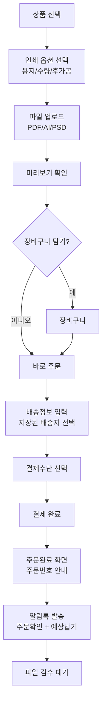
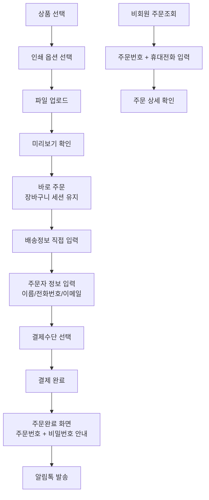
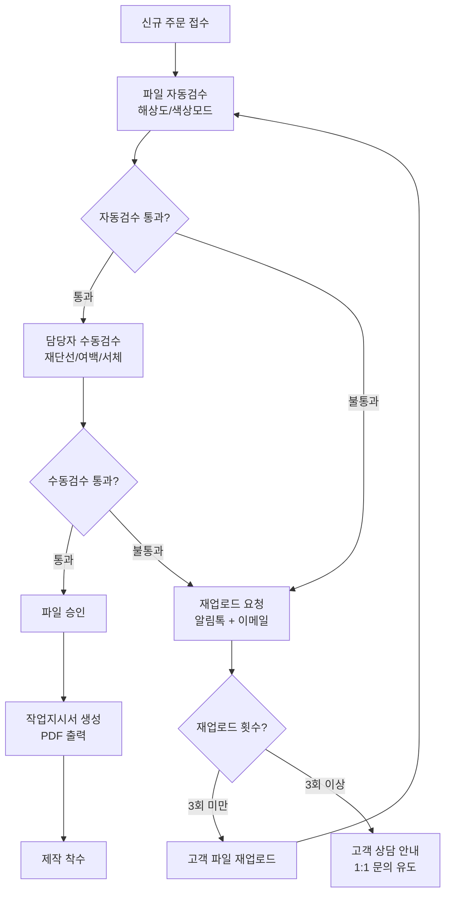
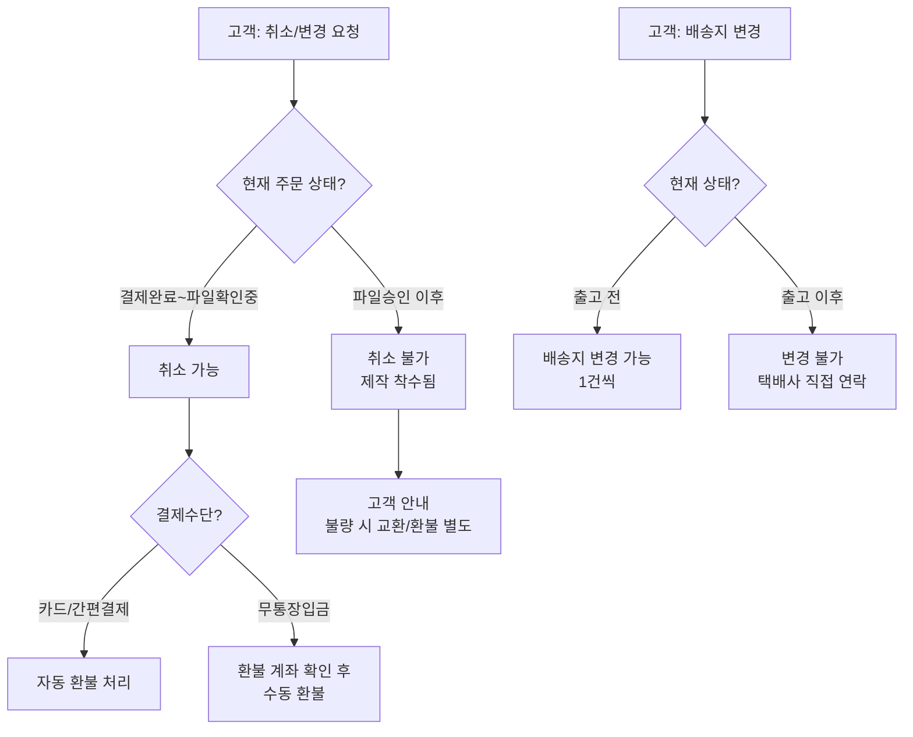
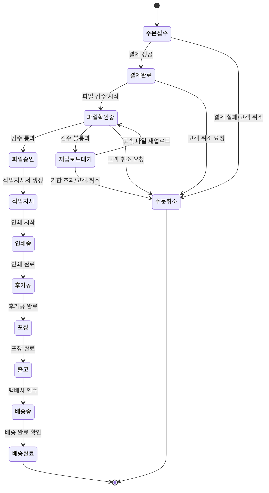
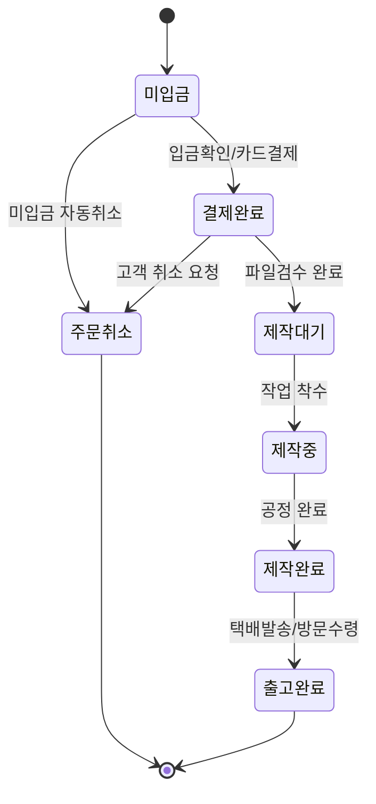
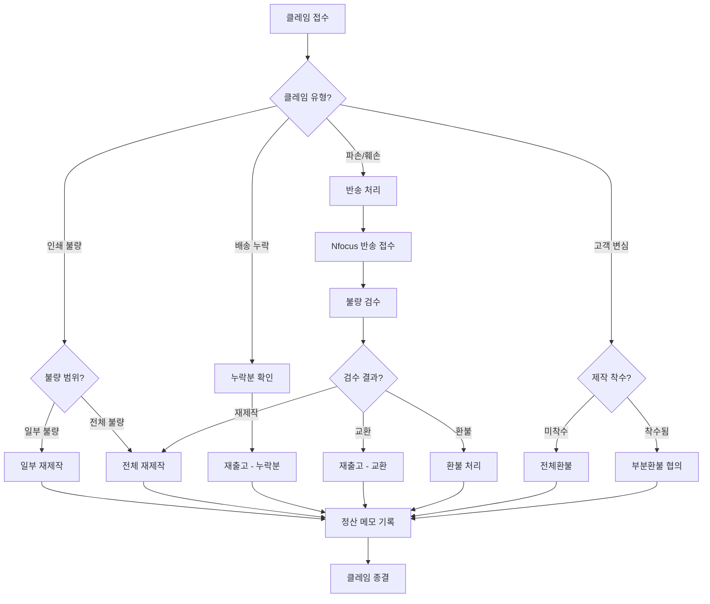

# 주문 워크플로우 정책

**문서번호**: POLICY-A6B8-ORDER
**작성일**: 2026-03-15
**대상 독자**: 인쇄실무진 (기획, 운영, CS)
**관련 IA**: A-6 주문 (7개), B-8 주문관리 (10개)

---

## 목차
1. 정책 요약
2. 경쟁사 현황
3. IA 기능별 정책 결정
4. UserFlow
5. 인쇄 주문 상태 정의
6. 정책 결정 체크리스트
7. 추천 정책안
[부록] 개발 참고사항

---

## 1. 정책 요약

본 문서는 인쇄 주문의 전체 워크플로우를 정의한다. 고객이 상품을 선택한 후 파일 업로드부터 결제, 파일검수, 인쇄, 배송까지의 전 과정을 다룬다.

**핵심 정책 방향**:
- 회원/비회원 모두 주문 가능
- 선결제 후 제작 원칙 (B2B 후불결제는 별도 정책)
- 파일검수 완료 후 제작 착수
- 주문 취소는 파일검수 완료 전까지 가능
- 재주문 파일 보관 기간: 최소 1개월

---

## 2. 경쟁사 현황

### 2.1 주문 방식 비교

| 항목 | 레드프린팅 | 와우프레스 | 오프린트미 | 후니프린팅(우리) |
|------|-----------|-----------|-----------|----------------|
| 주문 방식 | PDF주문, 간편주문, 에디터주문 | 이지템플릿(EZT) 90개+ | DIY 브랜딩 특화 | 파일업로드 + 옵션선택 |
| 비회원 주문 | 가능 | - | - | 가능 (예정) |
| 간편 재주문 | 1개월 보관 | - | - | 보관함 기능 |
| 디자인 도구 | 무료 템플릿 | 이지템플릿(EZT) | DIY 도구 | 디자인 의뢰 |
| 파일 상담 | - | 09~21시 | - | 운영시간 내 |

### 2.2 취소/변경 정책 비교

| 항목 | 레드프린팅 | 와우프레스 | 오프린트미 | 후니프린팅(우리) |
|------|-----------|-----------|-----------|----------------|
| 주문 취소 | 패킹 전까지 | - | 결제 후 1시간 이내 | 파일검수 완료 전 |
| 배송지 변경 | 패킹 전, 1건씩 | - | - | 출고 전까지 |
| 반품 | 수령 5일 이내 | - | - | 불량 시 교환/환불 |

### 2.3 주문관리(관리자) 비교

| 항목 | 후니프린팅 IA | 비고 |
|------|-------------|------|
| 주문관리(인쇄) | B-8 | 작업상태 트래킹 |
| 주문관리(제본) | B-8 | 제본 별도 관리 |
| 주문관리(굿즈) | B-8 | 일반 상품 관리 |
| 파일확인처리 | B-8 | 검수 워크플로우 |
| 재업로드요청 | B-8 | 고객에게 재업로드 안내 |
| 주문서출력 | B-8 | 작업지시서 PDF |
| 주문상태변경 | B-8 | 커스텀 상태 포함 |
| 후불결제 | B-8 | B2B 전용 |
| 증빙서류 | B-8 | 세금계산서 등 |
| SMS발송 | B-8 | 알림톡/SMS |

---

## 3. IA 기능별 정책 결정

### A-6 주문 (고객 화면, 7개 기능)

#### 3.1 파일/편집정보입력

| 정책 항목 | 선택지 | 추천 | 근거 |
|----------|--------|------|------|
| 파일 업로드 형식 | PDF만 / PDF+AI+PSD / 전체 | PDF+AI+PSD | 인쇄 품질 보장, 레드프린팅 PDF주문 참고 |
| 최대 파일 크기 | 50MB / 100MB / 200MB | 100MB | 고해상도 인쇄 파일 대응 |
| 파일 미리보기 | 제공 / 미제공 | 제공 | 고객 실수 방지, 검수 부담 감소 |
| 편집 옵션 입력 | 용지/수량/후가공 일괄 | 단계별 입력 | 단계별 입력 | 오입력 방지 |
| 디자인 의뢰 | 제공 / 미제공 | 1차 미제공, 추후 도입 | 운영 리소스 고려 |

#### 3.2 보관함/장바구니

| 정책 항목 | 선택지 | 추천 | 근거 |
|----------|--------|------|------|
| 보관함 보관 기간 | 1개월 / 3개월 / 6개월 | 1개월 | 레드프린팅 간편재주문 1개월 참고 |
| 장바구니 합배송 | 가능 / 불가 | 가능 (동일 납기) | 배송비 절감 |
| 장바구니 인쇄옵션 수정 | 가능 / 불가 | 가능 | 고객 편의 |
| 비회원 장바구니 | 세션 유지 / 미제공 | 세션 유지 | 비회원 주문 지원 |

#### 3.3 배송정보입력

| 정책 항목 | 선택지 | 추천 | 근거 |
|----------|--------|------|------|
| 배송지 저장 | 최근 5개 / 10개 / 무제한 | 최근 10개 | 기업 고객 다수 배송지 |
| 수령 방법 | 택배만 / 택배+방문수령 / 택배+퀵 | 택배 + 방문수령 | 와우프레스 방문수령 참고 |
| 분할 배송 | 가능 / 불가 | 불가 (1차) | 운영 복잡도 고려 |
| 배송 희망일 | 선택 가능 / 자동 | 자동 (납기일 기준) | 인쇄 제작 특성 |

#### 3.4 배송지목록

| 정책 항목 | 선택지 | 추천 | 근거 |
|----------|--------|------|------|
| 기본 배송지 설정 | 가능 / 불가 | 가능 | 반복 주문 편의 |
| 배송지 그룹 관리 | 제공 / 미제공 | 미제공 (1차) | 기본 기능 우선 |
| 주소 자동완성 | 카카오 주소 / 네이버 주소 | 카카오 주소 | shopby 기본 연동 |

#### 3.5 결제하기 (이니시스)

> 상세 결제 정책은 POLICY-A5-PAYMENT 참조

| 정책 항목 | 선택지 | 추천 | 근거 |
|----------|--------|------|------|
| PG사 | 이니시스 / KCP / 토스 | 이니시스 | 기존 연동 유지 |
| 결제 시점 | 선결제 / 후결제 | 선결제 | 인쇄업 표준, 레드프린팅 동일 |

#### 3.6 주문완료

| 정책 항목 | 선택지 | 추천 | 근거 |
|----------|--------|------|------|
| 주문완료 안내 | 화면 + 이메일 + SMS | 화면 + 알림톡 | 비용 효율, 도달률 |
| 예상 납기 표시 | 표시 / 미표시 | 표시 | 고객 기대 관리 |
| 주문번호 형식 | 날짜+순번 / 랜덤 | 날짜+순번 | 관리 편의, 비회원 조회 활용 |

#### 3.7 디자인의뢰

| 정책 항목 | 선택지 | 추천 | 근거 |
|----------|--------|------|------|
| 서비스 제공 시점 | 오픈 시 / 추후 도입 | 추후 도입 | 운영 리소스 확보 필요 |
| 의뢰 방식 | 온라인 폼 / 1:1 상담 | 1:1 상담 (1차) | 인쇄 특성상 상세 상담 필요 |
| 별도 과금 | 무료 / 유료 | 유료 | 디자인 리소스 비용 |

### B-8 주문관리 (관리자 화면, 10개 기능)

#### 3.8 주문관리(인쇄)

| 정책 항목 | 선택지 | 추천 | 근거 |
|----------|--------|------|------|
| 작업 상태 트래킹 | 기본 상태 / 커스텀 상태 | 커스텀 상태 | 인쇄 공정별 세분화 필요 |
| 작업 배정 | 수동 / 자동 | 수동 (1차) | 장비/인력 상황 유동적 |
| 납기 관리 | 수동 / 자동 계산 | 자동 계산 + 수동 조정 | 효율성 + 유연성 |

#### 3.9 주문관리(제본)

| 정책 항목 | 선택지 | 추천 | 근거 |
|----------|--------|------|------|
| 제본 별도 관리 | 통합 / 분리 | 분리 | 공정 차이, 납기 차이 |
| 제본 유형 | 무선/중철/스프링/양장 | 전체 지원 | 상품 다양성 |

#### 3.10 주문관리(굿즈)

| 정책 항목 | 선택지 | 추천 | 근거 |
|----------|--------|------|------|
| 굿즈 관리 방식 | 인쇄와 통합 / 분리 | 분리 | shopby 기본 주문관리 활용 |
| 재고 관리 | 재고형 / 주문제작형 | 주문제작형 | 인쇄업 특성 |

#### 3.11 파일확인처리

| 정책 항목 | 선택지 | 추천 | 근거 |
|----------|--------|------|------|
| 검수 기준 | 해상도/재단선/색상모드 | 전체 (체크리스트) | 인쇄 품질 보장 |
| 검수 결과 통보 | 이메일 / 알림톡 / 둘다 | 알림톡 + 이메일 | 신속 + 기록 보관 |
| 자동 검수 | 미적용 / 해상도만 / 전체 | 해상도+색상모드 자동 | 검수 효율화 |
| 승인 기한 | 24시간 / 48시간 / 무제한 | 48시간 | 납기 관리 |

#### 3.12 재업로드요청

| 정책 항목 | 선택지 | 추천 | 근거 |
|----------|--------|------|------|
| 요청 횟수 제한 | 무제한 / 3회 / 5회 | 3회 | 무한 루프 방지 |
| 요청 사유 템플릿 | 자유 입력 / 템플릿 | 템플릿 + 자유 입력 | 표준화 + 유연성 |
| 재업로드 기한 | 3일 / 5일 / 7일 | 5일 | 고객 대응 시간 확보 |

#### 3.13 주문서출력

| 정책 항목 | 선택지 | 추천 | 근거 |
|----------|--------|------|------|
| 출력 형식 | PDF / 프린트 / 둘다 | PDF | 디지털 관리, 보관 용이 |
| 포함 정보 | 기본정보 / 기본+작업지시 | 기본 + 작업지시 | 현장 작업 편의 |
| 일괄 출력 | 가능 / 불가 | 가능 | 대량 주문 처리 |

#### 3.14 주문상태변경

| 정책 항목 | 선택지 | 추천 | 근거 |
|----------|--------|------|------|
| 상태 변경 권한 | 관리자만 / 담당자 | 담당자 (역할 기반) | 운영 효율 |
| 상태 변경 알림 | 내부만 / 내부+고객 | 내부 + 고객 | 고객 신뢰 |
| 변경 이력 관리 | 자동 기록 | 자동 기록 | 감사 추적 필수 |

#### 3.15 후불결제

> 상세 정책은 POLICY-A5-PAYMENT 참조

| 정책 항목 | 선택지 | 추천 | 근거 |
|----------|--------|------|------|
| 대상 | B2B 승인 고객 | B2B 승인 고객 | 리스크 관리 |
| 정산 주기 | 월 1회 / 월 2회 | 월 1회 | 관리 효율 |

#### 3.16 증빙서류

> 상세 정책은 POLICY-A5-PAYMENT 참조

| 정책 항목 | 선택지 | 추천 | 근거 |
|----------|--------|------|------|
| 발급 종류 | 세금계산서 / 현금영수증 / 둘다 | 둘다 | 법적 요건 |
| 발급 방식 | 자동 / 수동 | 자동 (세금계산서 외부연동) | 운영 효율 |

#### 3.17 SMS발송

| 정책 항목 | 선택지 | 추천 | 근거 |
|----------|--------|------|------|
| 발송 채널 | SMS / 알림톡 / 둘다 | 알림톡 우선, SMS 보조 | 비용 절감, 도달률 |
| 자동 발송 시점 | 상태 변경 시 / 수동 | 주요 상태 자동 + 수동 | 고객 안내 + 유연성 |
| 템플릿 관리 | 고정 / 커스텀 | 커스텀 가능 | 운영 유연성 |

---

## 4. UserFlow

### 4.1 회원 주문 UserFlow



### 4.2 비회원 주문 UserFlow



### 4.3 파일검수 UserFlow (관리자)



### 4.4 주문 취소/변경 UserFlow



---

## 5. 인쇄 주문 상태 정의

### 5.1 상태 전환 다이어그램



### 5.2 상태별 정의

| 상태 | 설명 | 고객 노출 | 알림 발송 | 취소 가능 |
|------|------|----------|----------|----------|
| 주문접수 | 주문서 생성, 결제 대기 | O | - | O |
| 결제완료 | 결제 확인됨 | O | 알림톡 | O |
| 파일확인중 | 업로드 파일 검수 중 | O | - | O |
| 재업로드대기 | 파일 문제로 재업로드 요청 | O | 알림톡+이메일 | O |
| 파일승인 | 파일 검수 통과 | O | 알림톡 | X |
| 작업지시 | 작업지시서 생성/인쇄 대기 | "제작준비중" | - | X |
| 인쇄중 | 인쇄 진행 중 | "제작중" | - | X |
| 후가공 | 코팅/박/형압 등 진행 | "제작중" | - | X |
| 포장 | 포장 진행 | "제작중" | - | X |
| 출고 | 택배사 인수 완료 | O | 알림톡(송장번호) | X |
| 배송중 | 배송 진행 | O | - | X |
| 배송완료 | 배송 완료 | O | 알림톡 | X |
| 주문취소 | 취소 처리 완료 | O | 알림톡 | - |

### 5.3 고객 노출 상태 매핑

인쇄 공정의 세부 상태는 고객에게 단순화하여 노출한다.

| 내부 상태 | 고객 노출 상태 |
|----------|--------------|
| 주문접수 | 주문접수 |
| 결제완료 | 결제완료 |
| 파일확인중 | 파일확인중 |
| 재업로드대기 | 파일재업로드 요청 |
| 파일승인 | 파일확인완료 |
| 작업지시/인쇄중/후가공/포장 | 제작중 |
| 출고 | 출고완료 |
| 배송중 | 배송중 |
| 배송완료 | 배송완료 |
| 주문취소 | 주문취소 |

---

## 6. 정책 결정 체크리스트

아래 항목을 검토하여 최종 정책을 확정한다.

### 주문 기본

- [ ] 비회원 주문 허용 여부 결정
- [ ] 비회원 주문조회 방식 결정 (주문번호+휴대전화)
- [ ] 파일 업로드 지원 형식 확정 (PDF/AI/PSD)
- [ ] 최대 파일 크기 확정
- [ ] 파일 미리보기 제공 여부 결정
- [ ] 보관함 파일 보관 기간 확정
- [ ] 장바구니 합배송 정책 확정

### 배송

- [ ] 수령 방법 확정 (택배/방문수령/퀵)
- [ ] 방문수령 지점 확정
- [ ] 배송지 저장 개수 확정
- [ ] 분할 배송 지원 여부 결정
- [ ] 배송비 정책 확정 (무료 기준, 등급별)

### 파일검수

- [ ] 자동 검수 항목 확정 (해상도/색상모드)
- [ ] 수동 검수 체크리스트 작성
- [ ] 재업로드 요청 횟수 제한 확정
- [ ] 재업로드 기한 확정
- [ ] 검수 결과 통보 방식 확정

### 주문관리

- [ ] 인쇄 주문 상태 세부 정의 확정
- [ ] 고객 노출 상태 매핑 확정
- [ ] 상태 변경 알림 시점/채널 확정
- [ ] 작업지시서 포함 정보 확정
- [ ] 주문서 일괄 출력 지원 여부 결정
- [ ] SMS/알림톡 템플릿 작성

### 취소/변경

- [ ] 취소 가능 시점 확정 (파일검수 완료 전)
- [ ] 배송지 변경 가능 시점 확정 (출고 전)
- [ ] 환불 처리 방식 확정 (자동/수동)
- [ ] 반품 정책 확정 (불량 시 교환/환불)

### 디자인의뢰

- [ ] 디자인의뢰 서비스 도입 시점 결정
- [ ] 의뢰 방식 결정 (온라인 폼/1:1 상담)
- [ ] 과금 정책 결정

---

## 7. 추천 정책안

### 1차 오픈 (MVP)

| 영역 | 추천 정책 | 우선순위 |
|------|----------|---------|
| 주문 방식 | 파일 업로드 + 옵션 선택 (PDF/AI/PSD, 100MB) | 필수 |
| 비회원 주문 | 지원 (주문번호+휴대전화 조회) | 필수 |
| 장바구니 | shopby 기본 + 인쇄옵션 커스텀 | 필수 |
| 배송 | 택배 (기본) | 필수 |
| 파일검수 | 해상도+색상모드 자동 + 수동 검수 | 필수 |
| 재업로드 | 3회 제한, 5일 기한 | 필수 |
| 주문상태 | 11단계 (고객 노출 9단계) | 필수 |
| 알림 | 알림톡 우선 | 필수 |
| 작업지시서 | PDF 출력, 일괄 출력 | 필수 |
| 디자인의뢰 | 미제공 | - |
| 방문수령 | 미제공 | - |

### 2차 고도화

| 영역 | 추천 정책 | 비고 |
|------|----------|------|
| 보관함 | 간편 재주문 (1개월 보관) | 레드프린팅 참고 |
| 방문수령 | 주요 거점 제공 | 와우프레스 참고 |
| 디자인의뢰 | 1:1 상담 방식, 유료 | 운영 준비 후 |
| 자동 납기 계산 | 상품/옵션별 자동 계산 | 운영 효율 |
| 대량 주문 | 엑셀 일괄 주문 | B2B 대응 |

---

## 8. MES 기반 주문 상태 정의

### 8.1 MES 주문 상태 전환 흐름

MES(Manufacturing Execution System) 기반의 주문 상태는 아래 흐름을 따른다.

```
미입금 → 결제완료 → 제작대기 → 제작중 → 제작완료 → 출고완료
                                                    ↘ 주문취소
```



### 8.2 파일번호 상태 관리

각 주문의 파일번호는 입고 경로에 따라 3가지 Case로 상태가 전환된다.

| Case | 경로 | 상태 전환 |
|------|------|-----------|
| Case 1 | 배송 (파일 없음) | 준비중 → 포장완료 |
| Case 2 | 파일업로드 | 확인전 → 파일확인 → 재업로드 → 다운로드완료 → 포장완료 |
| Case 3 | 편집기 | 렌더링전 → 렌더링완료 → 수정 → 다운로드 → 포장완료 |

### 8.3 파일명 규칙

생산 현장에서 사용하는 파일명은 아래 규칙을 따른다:

```
{품목}_{출력사이즈}_{양단면}_{소재명}_{거래처명}_{고객명}_{파일고유번호}_{수량}
```

**예시**: `명함_90x50_양면_아트지250g_후니프린팅_홍길동_F20260315001_200매`

---

## 9. 자동알림 정책 (11종)

주문 상태 변경 시 자동으로 발송되는 알림은 총 11종이다.

| 코드 | 알림 종류 | 발송 시점 | 채널 | 수신 대상 |
|------|-----------|-----------|------|-----------|
| 001 | 가상계좌 발급완료 | 가상계좌 주문 시 | 알림톡 | 고객 |
| 002 | 결제완료 | 입금확인/카드결제 완료 | 알림톡 | 고객 |
| 003 | 재업로드 요청 | 파일검수 불합격 시 | 알림톡+이메일 | 고객 |
| 004 | 수정요청 | 편집기 파일 수정 필요 시 | 알림톡 | 고객 |
| 005 | 제작중 | 제작 착수 시 | 알림톡 | 고객 |
| 006 | 제작완료(방문) | 방문수령 상품 제작 완료 | 알림톡 | 고객 |
| 007 | 출고예정(택배) | 택배 출고 예정 안내 | 알림톡 | 고객 |
| 008 | 출고완료 | 출고 완료 시 | 알림톡 | 고객 |
| 009 | 출고완료(택배송장) | 송장번호 포함 출고 안내 | 알림톡 | 고객 |
| 010 | 주문취소 | 주문 취소 처리 시 | 알림톡 | 고객 |
| 011 | 가상계좌 자동취소 | 가상계좌 입금기한 초과 | 알림톡 | 고객 |

---

## 10. 클레임 처리 정책

### 10.1 클레임 유형 및 처리 방법

| 유형 | 세부 구분 | 처리 방법 | 비고 |
|------|-----------|-----------|------|
| **재제작** | 일부 재제작 | 불량 파일번호만 재제작 | 원본 파일 기준 |
| **재제작** | 전체 재제작 | 전체 주문 재제작 | 제작 오류 시 |
| **주문취소** | 부분환불 | 일부 상품만 취소/환불 | 미제작 분만 |
| **주문취소** | 전체환불 | 전체 주문 취소/환불 | 결제수단별 처리 |
| **반송** | Nfocus 반송 | 불량품 Nfocus 택배로 회수 | 회수 후 검수 |
| **재출고** | 누락분 출고 | 누락된 상품 추가 출고 | 검수 확인 후 |
| **재출고** | 교환 출고 | 불량 교환 상품 출고 | 반송 확인 후 |

### 10.2 정산 처리

- 클레임 발생 시 관리자 **메모 필드**에 클레임 사유 및 처리 내역 기록
- 환불 금액, 재제작 비용, 반송 비용 등은 정산 시 반영
- 클레임 이력은 주문 상세에서 조회 가능

### 10.3 클레임 처리 흐름도



---

## 11. Pain Points (현행 운영 이슈)

현행 주문 운영에서 확인된 주요 문제점과 개선 방향:

| 이슈 | 상세 설명 | 개선 방향 |
|------|-----------|-----------|
| 장바구니 없음 | 현행 시스템에 장바구니 기능 미지원 | shopby 장바구니 + 인쇄옵션 커스텀 |
| 무통장입금 확인 지연 | 수동 입금 확인으로 처리 지연 발생 | 가상계좌 자동 입금확인 알림(001번) 연동 |
| 합배송 리스트 없음 | 동일 고객 복수 주문 합배송 관리 불가 | 합배송 관리 기능 개발 |
| 파일명 불통일 | 파일명 규칙 미준수로 현장 혼란 | 파일명 자동 생성 규칙 적용 (Section 8.3) |

---

## [부록] 개발 참고사항

### shopby 분류 및 개발 범위

| 기능 | shopby 분류 | 개발 방식 | API 참고 |
|------|------------|----------|---------|
| 파일/편집정보입력 | CUSTOM | 파일 업로드 모듈 자체 개발 | 인쇄 파일 업로드 API 없음, 별도 스토리지 필요 |
| 보관함/장바구니 | SKIN | 장바구니 API 기본 활용, 인쇄옵션 조합 커스텀 | shopby 장바구니 API |
| 배송정보입력 | NATIVE | shopby 기본 기능 사용 | shopby 배송 API |
| 배송지목록 | NATIVE | shopby 기본 기능 사용 | shopby 배송지 API |
| 결제하기(이니시스) | EXTERNAL | PG 연동 (이니시스) | 이니시스 결제 API |
| 주문완료 | NATIVE | shopby 기본 기능 사용 | shopby 주문완료 API |
| 디자인의뢰 | CUSTOM | 디자인 의뢰 워크플로우 자체 개발 | 없음 (추후 개발) |
| 주문관리(인쇄) | SKIN | 작업상태 트래킹 커스텀 개발 | shopby 주문관리 API + 커스텀 상태 |
| 주문관리(제본) | SKIN | 제본 공정 관리 커스텀 | shopby 주문관리 API + 커스텀 상태 |
| 주문관리(굿즈) | NATIVE | shopby 기본 주문관리 | shopby 주문관리 API |
| 파일확인처리 | CUSTOM | 파일 검수 워크플로우 자체 개발 | 없음 (자체 개발) |
| 재업로드요청 | CUSTOM | 재업로드 알림/관리 자체 개발 | 알림톡 API 연동 |
| 주문서출력 | SKIN | 작업지시서 PDF 커스텀 생성 | PDF 생성 라이브러리 활용 |
| 주문상태변경 | NATIVE (커스텀 상태 추가 시 SKIN) | 커스텀 인쇄 상태 추가 | shopby 주문상태 API |
| 후불결제 | CUSTOM | B2B 후불/정산 자체 개발 | 별도 정산 모듈 필요 |
| 증빙서류 | SKIN | 세금계산서 외부 연동 | 세금계산서 발행 API (팝빌 등) |
| SMS발송 | NATIVE | shopby 기본 알림 기능 | shopby 알림 API / 알림톡 API |

### 개발 우선순위 (CUSTOM 항목)

1. **파일 업로드 모듈**: 인쇄 파일 업로드/저장/미리보기 (핵심 기능)
2. **파일 검수 워크플로우**: 자동검수 + 수동검수 + 재업로드 요청
3. **작업지시서 PDF**: 주문정보 + 인쇄옵션 + 파일정보 포함
4. **커스텀 주문 상태**: 인쇄 공정별 상태 추가
5. **후불결제/정산**: B2B 고객용 (2차 개발)
6. **디자인의뢰**: 워크플로우 설계 후 개발 (2차 이후)

### 주요 커스텀 개발 영역

- **파일 스토리지**: AWS S3 또는 NHN Cloud Object Storage (인쇄 파일 전용)
- **파일 검수 엔진**: 해상도 확인, 색상모드(CMYK) 확인, 재단선 확인
- **작업지시서 생성**: PDF 라이브러리 활용 (jsPDF 또는 서버사이드 생성)
- **인쇄 상태 관리**: shopby 주문 상태 확장 또는 별도 상태 테이블
- **알림 연동**: 카카오 알림톡 API 연동 (주요 상태 변경 시 자동 발송)
