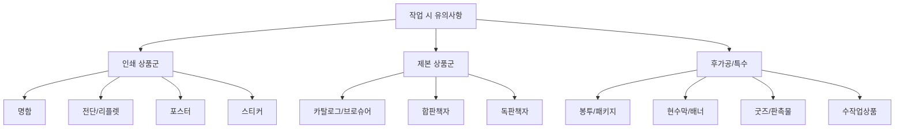
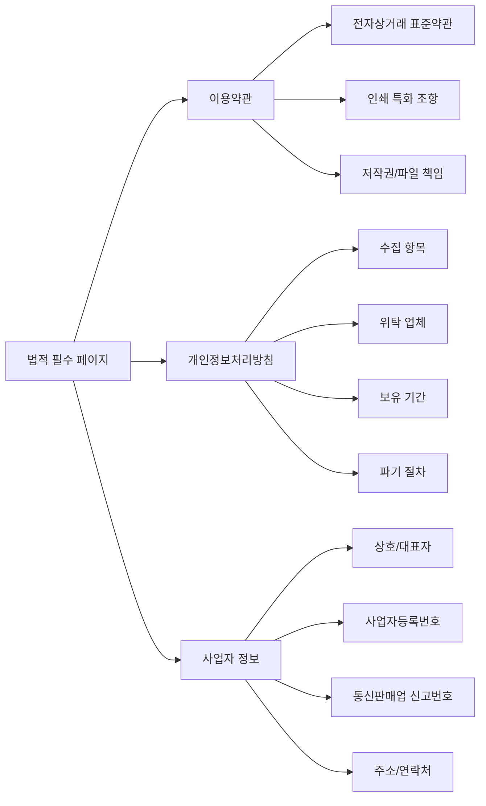
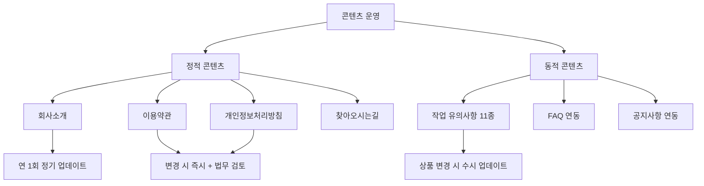
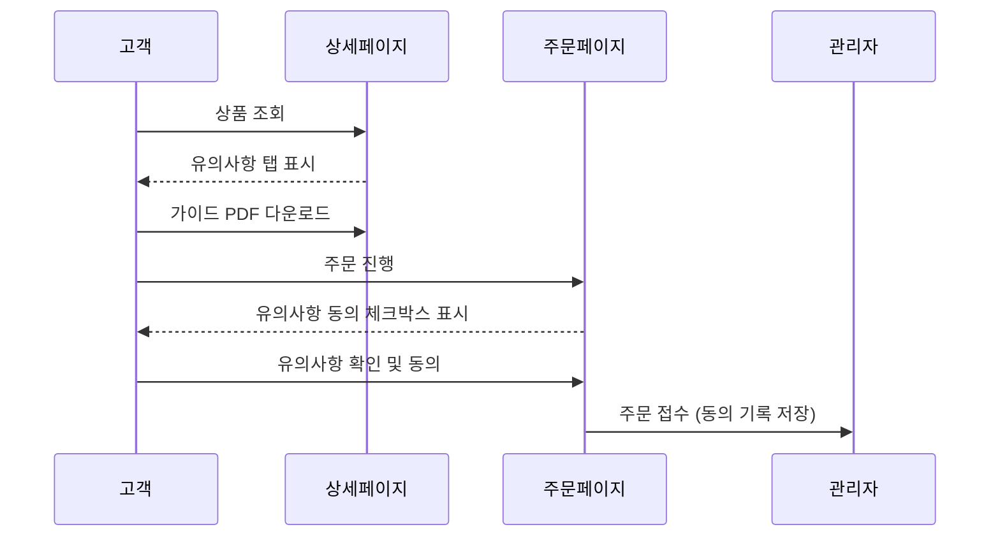

# 정보/가이드 정책

## 문서 정보

| 항목 | 내용 |
|------|------|
| 문서번호 | POLICY-A7A8-CONTENT |
| 작성일 | 2026-03-15 |
| 최종수정 | 2026-03-15 |
| 작성자 | 지니 |
| 대상독자 | 인쇄실무진 (기획, 운영, CS) |
| 관련 IA | A-7 정보 (4개: 회사소개, 이용약관, 개인정보보호, 찾아오시는길), A-8 가이드 (1개: 작업시유의사항 11개) |
| 총 결정 항목 | 9개 |
| 상태 | 작성중 |

---

## 목차

1. [정책 요약](#1-정책-요약)
2. [경쟁사 현황](#2-경쟁사-현황)
3. [콘텐츠 구성 정책](#3-콘텐츠-구성-정책)
4. [작업 가이드 정책](#4-작업-가이드-정책)
5. [법적 필수 페이지](#5-법적-필수-페이지)
6. [정책 결정 체크리스트](#6-정책-결정-체크리스트)
7. [추천 정책안](#7-추천-정책안)
8. [부록: 개발 참고사항](#부록-개발-참고사항)

---

## 1. 정책 요약

본 문서는 후니프린팅 쇼핑몰의 **정보 페이지**(회사소개, 이용약관, 개인정보보호, 찾아오시는길)와 **작업 가이드 페이지**(상품별 작업 시 유의사항 11개)에 대한 콘텐츠 구성 및 운영 정책을 정의한다.

**핵심 정책 방향**:
- 인쇄 전문 쇼핑몰로서의 전문성과 신뢰를 전달하는 회사소개
- 인쇄 특성을 반영한 이용약관(색상오차, 재단오차, 파일 책임 등)
- 법적 필수 요건을 충족하는 개인정보처리방침
- 방문 고객/거래처를 위한 찾아오시는길 지도 커스텀
- 상품 카테고리별 구체적 작업 유의사항으로 CS 문의 감소 및 재작업 방지

**핵심 결정사항**

| 번호 | 결정 사항 | 상태 |
|------|-----------|------|
| 1 | 회사소개 페이지 구성 요소 (연혁/장비/인증 포함 여부) | 미결정 |
| 2 | 이용약관 인쇄 특화 조항 범위 | 미결정 |
| 3 | 개인정보처리방침 위탁 업체 목록 | 미결정 |
| 4 | 찾아오시는길 지도 API 선정 (카카오/네이버/구글) | 미결정 |
| 5 | 작업 유의사항 표현 방식 (텍스트/이미지/영상) | 미결정 |
| 6 | 유의사항 미확인 시 면책 동의 절차 | 미결정 |

---

## 2. 경쟁사 현황

### 2.1 레드프린팅

| 항목 | 내용 |
|------|------|
| 회사소개 | 간결한 브랜드 스토리 + 장비 리스트 |
| 이용약관 | 인쇄 특화 조항 포함 (색상오차 10% 허용, 재단오차 1~2mm) |
| 작업 가이드 | 상품 상세페이지 내 유의사항 탭 + 별도 가이드 페이지 |
| 가이드 형태 | 텍스트 + 이미지 예시 (OK/NG 비교) |
| 특이사항 | 주문 시 유의사항 확인 체크박스 의무화 |

**시사점**: 상품 상세와 별도 가이드 이중 안내로 CS 문의를 최소화. 주문 전 체크박스로 면책 근거를 확보.

### 2.2 와우프레스

| 항목 | 내용 |
|------|------|
| 회사소개 | 연혁 중심 + 생산설비 소개 (사진 포함) |
| 이용약관 | 표준 이용약관 + 인쇄 관련 별도 안내 |
| 작업 가이드 | 카테고리별 데이터 제작 가이드 (상세) |
| 가이드 형태 | PDF 다운로드 + 웹페이지 동시 제공 |
| 특이사항 | 독판인쇄 납기 지연 시 100% 보상 명시 |

**시사점**: PDF 다운로드 제공으로 디자이너가 오프라인에서도 참고 가능. 생산설비 공개로 신뢰도를 높이는 전략.

### 2.3 오프린트미

| 항목 | 내용 |
|------|------|
| 회사소개 | 모바일 앱 중심, 미니멀 디자인 |
| 이용약관 | 표준 전자상거래 약관 |
| 작업 가이드 | 앱 내 인터랙티브 가이드 |
| 가이드 형태 | 스텝 바이 스텝 온보딩 |
| 특이사항 | Zendesk 헬프센터로 FAQ 통합 |

**시사점**: 모바일 중심 UX로 젊은 고객층에 효과적. 인터랙티브 가이드는 학습 곡선을 낮추지만 전문 인쇄 고객에겐 정보 부족 가능.

### 2.4 비교 분석표

| 비교 항목 | 레드프린팅 | 와우프레스 | 오프린트미 |
|-----------|-----------|-----------|-----------|
| **회사소개 상세도** | 중간 | 상세(연혁+장비) | 간결 |
| **이용약관 인쇄특화** | O (구체적) | 부분적 | X |
| **가이드 제공 방식** | 웹+체크박스 | 웹+PDF | 앱 내 가이드 |
| **이미지 가이드** | OK/NG 비교 | 상세 도해 | 스텝 가이드 |
| **동영상 가이드** | 부분 | X | X |
| **주문시 동의** | 체크박스 | 미확인 | 미확인 |
| **개인정보 고지** | 법적 준수 | 법적 준수 | 법적 준수 |

---

## 3. 콘텐츠 구성 정책

### 3.1 회사소개

| 정책 항목 | 선택지 | 추천 | 근거 |
|----------|--------|------|------|
| 페이지 구성 | 간결형 / 상세형(연혁+장비) | 상세형 | B2B 거래처 신뢰 확보 |
| 생산설비 공개 | 장비 목록 / 장비+사진 / 미공개 | 장비+사진 | 와우프레스 사례, 인쇄 전문성 어필 |
| 인증/수상 | 표시 / 미표시 | 표시 | ISO 등 인증 보유 시 신뢰도 상승 |
| 연혁 표시 | 타임라인형 / 테이블형 / 미표시 | 타임라인형 | 시각적 효과 |
| CTA (문의하기) | 포함 / 미포함 | 포함 | B2B 전환 유도 |

### 3.2 이용약관

인쇄업 특성을 반영한 특화 조항이 필수적이다.

| 정책 항목 | 선택지 | 추천 | 근거 |
|----------|--------|------|------|
| 색상 오차 기준 | 5% / 10% / 15% | 10% | 레드프린팅 동일, 업계 표준 |
| 재단 오차 기준 | 1mm / 1~2mm / 2mm | 1~2mm | 업계 표준 |
| 파일 책임 | 고객 전적 책임 / 검수 후 안내 | 검수 후 안내 + 최종 승인 고객 | CS 분쟁 방지 |
| 납기 지연 보상 | 없음 / 부분보상 / 전액보상 | 부분보상(할인쿠폰) | 와우프레스 참고, 비용 관리 |
| 인쇄 사고 기준 | 별도 정의 / 약관 내 포함 | 약관 내 포함 | 관리 일원화 |

### 3.3 개인정보처리방침

| 정책 항목 | 선택지 | 추천 | 근거 |
|----------|--------|------|------|
| 작성 방식 | 자체 작성 / 법무법인 위탁 | 법무법인 검토 | 법적 리스크 최소화 |
| 업데이트 주기 | 연 1회 / 변경 시 즉시 | 변경 시 즉시 + 연 1회 정기 | 법적 의무 |
| 위탁 업체 고지 | 약관 내 / 별도 페이지 | 약관 내 테이블 | 접근성 |
| 마케팅 동의 | 필수 / 선택 / 미수집 | 선택 동의 | 개인정보보호법 준수 |

### 3.4 찾아오시는길

| 정책 항목 | 선택지 | 추천 | 근거 |
|----------|--------|------|------|
| 지도 API | 카카오맵 / 네이버지도 / 구글맵 | 카카오맵 | 국내 사용률 1위, 로드뷰 지원 |
| 교통 안내 | 대중교통+자차 / 자차만 | 대중교통+자차+주차 | 방문 고객 편의 |
| 부가 정보 | 영업시간/전화번호 | 영업시간+전화+팩스+이메일 | B2B 고객 문의 편의 |
| 지도 커스텀 | 기본 핀 / 커스텀 마커+경로 | 커스텀 마커 | 브랜딩 일관성 |

---

## 4. 작업 가이드 정책

### 4.1 상품별 유의사항 11개 카테고리

인쇄 상품의 특성에 따라 11개 카테고리별 유의사항을 제공한다.

### 4.2 공통 유의사항

모든 인쇄 상품에 적용되는 기본 유의사항:

| 항목 | 내용 |
|------|------|
| 도련(Bleed) | 사방 3mm 여유 필수 |
| 해상도 | 300dpi 이상 (웹용 72dpi 불가) |
| 색상 모드 | CMYK 필수 (RGB 입고 시 색상 변환 안내) |
| 서체 | 아웃라인 처리 필수 (또는 서체 파일 첨부) |
| 파일 형식 | AI, PDF(인쇄용), PSD (확장자별 주의사항 안내) |
| 오버프린트 | 검정 텍스트 오버프린트 확인 |
| 별색(스팟컬러) | 별색 사용 시 사전 협의 필요 |

### 4.3 카테고리별 유의사항

#### 1) 명함

| 유의사항 | 설명 |
|---------|------|
| 사이즈 | 국내표준 90x50mm, 미니명함 86x50mm |
| 양면 여부 | 양면 시 앞/뒤 파일 별도 제출 |
| 코팅 종류 | 무광/유광/벨벳/엠보 택 1 |
| 모서리 | 직각/라운드(R3/R5) 선택 |
| 수량 단위 | 최소 100매, 100매 단위 |

#### 2) 전단/리플렛

| 유의사항 | 설명 |
|---------|------|
| 접지 방식 | 2단접지/3단접지/병풍접지/대문접지 |
| 접지선 표시 | 파일 내 접히는 부분 가이드라인 필수 |
| 내용 배치 | 접지 후 앞면/뒷면 고려한 페이지 배열 |
| 용지 | 아트지/스노우지/모조지 (양면 인쇄 시 투비침 주의) |

#### 3) 포스터

| 유의사항 | 설명 |
|---------|------|
| 대형 사이즈 | A1/A0 이상 시 분할 인쇄 가능 여부 확인 |
| 이미지 해상도 | 대형 출력 시 150dpi 이상 (근거리 게시 300dpi) |
| 실내/실외 | 실외용: 방수 코팅/UV 잉크 선택 |
| 마감 | 코팅/라미네이팅/폼보드 부착 선택 |

#### 4) 스티커

| 유의사항 | 설명 |
|---------|------|
| 칼선 | 칼선 별도 레이어/별도 파일 필수 |
| 반칼/완칼 | 반칼(떼어내기)/완칼(개별 컷) 선택 |
| 재질 | 아트/유포/투명/크라프트 택 1 |
| 방수 여부 | 방수 필요 시 유포지+유광 라미네이팅 |

#### 5) 카탈로그/브로슈어

| 유의사항 | 설명 |
|---------|------|
| 페이지 수 | 4의 배수 (4, 8, 12, 16...) |
| 제본 방식 | 중철/무선/사철/스프링 선택 |
| 표지/내지 구분 | 표지 별도 용지/코팅 가능 |
| 페이지 순서 | 펼침면(Spread) 기준 파일 제출 |

#### 6) 합판책자

| 유의사항 | 설명 |
|---------|------|
| 합판 특성 | 색상 조합 다른 주문과 합판 → 색상 오차 가능 |
| 납기 | 합판 스케줄에 따라 납기 변동 |
| 수량 | 소량 인쇄에 적합 (500부 이하) |

#### 7) 독판책자

| 유의사항 | 설명 |
|---------|------|
| 독판 특성 | 단독 인쇄판 사용 → 색상 정밀도 높음 |
| 색교정 | 본 인쇄 전 색교정(Proof) 요청 가능 |
| 최소 수량 | 일반적으로 500부 이상 |

#### 8) 봉투/패키지

| 유의사항 | 설명 |
|---------|------|
| 전개도 | 전개도 기준 파일 제출 (접힘선/풀칠면 표시) |
| 톰슨 | 칼형(톰슨) 제작 비용 별도 |
| 인쇄 영역 | 풀칠 부분/접히는 부분 인쇄 불가 영역 확인 |

#### 9) 현수막/배너

| 유의사항 | 설명 |
|---------|------|
| 원본 크기 | 축소 제작 시 비율 명시 (1/10 축소 등) |
| 마감 | 열재단/그로밋(아일렛)/봉재봉 선택 |
| 재질 | 천현수막/PVC/메쉬 선택 |
| 설치 환경 | 실내/실외 구분 (실외: 내후성 잉크) |

#### 10) 굿즈/판촉물

| 유의사항 | 설명 |
|---------|------|
| 인쇄 방식 | 실크인쇄/UV인쇄/전사인쇄/각인 (상품별 상이) |
| 시안 확인 | 실물 목업(Mock-up) 제작 권장 |
| 색상 제한 | 실크인쇄 시 최대 3도까지 (비용 증가) |
| 최소 주문 | 상품별 MOQ 상이 (사전 확인 필수) |

#### 11) 수작업상품

| 유의사항 | 설명 |
|---------|------|
| 작업 특성 | 수작업 특성상 개별 편차 발생 가능 |
| 납기 | 일반 인쇄보다 납기 길어짐 (수작업 공정 추가) |
| 단가 | 수량에 따른 단가 변동 폭 큼 |
| 샘플 | 대량 주문 전 샘플 제작 권장 |

### 4.4 유의사항 표시 정책

| 정책 항목 | 선택지 | 추천 | 근거 |
|----------|--------|------|------|
| 표시 위치 | 상세페이지 내 / 별도 페이지 / 둘 다 | 둘 다 | 레드프린팅 방식, CS 문의 감소 |
| 표현 방식 | 텍스트만 / 텍스트+이미지 / 텍스트+이미지+영상 | 텍스트+이미지 | 비용 대비 효과 우수 |
| 이미지 형식 | OK/NG 비교 / 도해 / 실제 인쇄물 사진 | OK/NG 비교 | 레드프린팅 사례, 직관적 |
| PDF 다운로드 | 제공 / 미제공 | 제공 | 와우프레스 사례, 디자이너 편의 |
| 주문 시 동의 | 체크박스 필수 / 안내만 / 없음 | 체크박스 필수 | 면책 근거 확보, 재작업 분쟁 방지 |

---

## 5. 법적 필수 페이지

전자상거래 등에서의 소비자보호에 관한 법률에 따른 필수 고지 사항:

### 필수 고지 항목 체크

| 항목 | 법적 근거 | 표시 위치 |
|------|-----------|-----------|
| 상호/대표자명 | 전자상거래법 제13조 | 하단(footer) 상시 노출 |
| 사업자등록번호 | 전자상거래법 제13조 | 하단(footer) 상시 노출 |
| 통신판매업 신고번호 | 전자상거래법 제13조 | 하단(footer) 상시 노출 |
| 개인정보관리책임자 | 개인정보보호법 제31조 | 개인정보처리방침 내 |
| 이용약관 | 전자상거래법 제14조 | 별도 페이지 + 회원가입 시 동의 |
| 개인정보처리방침 | 개인정보보호법 제30조 | 별도 페이지 + 상시 접근 가능 |
| 청소년보호책임자 | 청소년보호법 제45조 | 해당 시 하단 표시 |

---

## 6. 정책 결정 체크리스트

### 콘텐츠 구성

- [ ] 회사소개 페이지 구성 확정 (연혁/장비/인증 포함 범위)
- [ ] 회사소개 생산설비 사진 촬영 및 게재 승인
- [ ] 이용약관 인쇄 특화 조항 최종 검토 (법무 확인)
- [ ] 색상 오차/재단 오차 허용 기준 확정
- [ ] 납기 지연 시 보상 정책 확정
- [ ] 개인정보처리방침 위탁 업체 목록 확정
- [ ] 개인정보처리방침 법무법인 검토 완료

### 작업 가이드

- [ ] 11개 카테고리별 유의사항 콘텐츠 작성 완료
- [ ] OK/NG 비교 이미지 제작 완료
- [ ] PDF 가이드 제작 여부 확정
- [ ] 동영상 가이드 제작 여부 확정
- [ ] 주문 시 유의사항 동의 체크박스 도입 확정

### 찾아오시는길

- [ ] 지도 API 선정 (카카오맵/네이버지도/구글맵)
- [ ] 교통 안내 정보 작성 (대중교통/자차/주차)
- [ ] 영업시간/연락처 정보 확정

### 법적 요건

- [ ] 전자상거래 필수 고지 사항 모두 반영 확인
- [ ] footer 사업자 정보 표시 확인
- [ ] 이용약관/개인정보처리방침 페이지 접근성 확인

---

## 7. 추천 정책안

### 추천안 요약

| 영역 | 추천 정책 | 우선순위 |
|------|-----------|----------|
| 회사소개 | 상세형 (연혁+장비사진+인증) + B2B 문의 CTA | 높음 |
| 이용약관 | 표준약관 + 인쇄 특화 조항 (색상10%, 재단1~2mm, 파일책임) | 높음 |
| 개인정보 | 법무법인 검토 + 변경 시 즉시 업데이트 | 높음 |
| 찾아오시는길 | 카카오맵 API + 커스텀 마커 + 교통/주차 안내 | 중간 |
| 유의사항 표시 | 상세페이지+별도페이지 이중 표시 + 주문 시 동의 체크박스 | 높음 |
| 가이드 형태 | 텍스트+OK/NG 이미지 비교 + PDF 다운로드 | 중간 |

### 추천안 상세

#### 7.1 콘텐츠 운영 체계

#### 7.2 작업 유의사항 표시 권장 흐름

#### 7.3 단계별 도입 제안

| 단계 | 항목 | 시기 |
|------|------|------|
| 1단계 | 법적 필수 페이지 (이용약관, 개인정보, 사업자정보) | 오픈 전 필수 |
| 2단계 | 회사소개 + 찾아오시는길 + 주요 상품 유의사항 (명함/전단/포스터) | 오픈 시 |
| 3단계 | 나머지 유의사항 8개 카테고리 + PDF 가이드 | 오픈 후 1개월 |
| 4단계 | OK/NG 이미지 고도화 + 동영상 가이드 (선택) | 오픈 후 3개월 |

---

## [부록] 개발 참고사항

### shopby 기능 매핑

| IA 항목 | shopby 분류 | 구현 방식 |
|---------|------------|-----------|
| 회사소개 | NATIVE | shopby 기본 페이지 기능 활용 |
| 이용약관 | NATIVE | shopby 약관 관리 기능 활용 |
| 개인정보보호 | NATIVE | shopby 약관 관리 기능 활용 |
| 찾아오시는길 | SKIN | 스킨 커스텀 (지도 API 연동) |
| 작업시유의사항 | SKIN | 콘텐츠 페이지로 스킨 커스텀 |

### 기술 구현 가이드

#### 찾아오시는길 (SKIN)

- 카카오맵 JavaScript API 연동
- 커스텀 마커 이미지 (브랜드 로고 핀)
- 반응형 지도 (모바일 터치 지원)
- 로드뷰 연동 (선택)

#### 작업시유의사항 (SKIN)

- shopby 콘텐츠 페이지 기능 활용
- 카테고리별 탭 또는 아코디언 UI
- 상품 상세페이지에서 해당 카테고리 유의사항 자동 연결
- 관리자 페이지에서 유의사항 콘텐츠 수정 가능
- 주문 시 동의 체크박스: 주문 페이지 스킨 커스텀

#### 주문 시 유의사항 동의 로직

- 상품 카테고리에 매핑된 유의사항 ID 조회
- 주문 페이지에서 해당 유의사항 요약 표시
- 체크박스 미선택 시 주문 버튼 비활성화
- 동의 일시/내용 DB 기록 (CS 분쟁 시 근거)

### 관련 API

| API | 용도 | 비고 |
|-----|------|------|
| 카카오맵 JavaScript API | 찾아오시는길 지도 | 무료 (일 30만 호출) |
| shopby 약관 관리 API | 이용약관/개인정보 CRUD | NATIVE 기능 |
| shopby 콘텐츠 페이지 API | 유의사항 콘텐츠 관리 | NATIVE 기능 |
