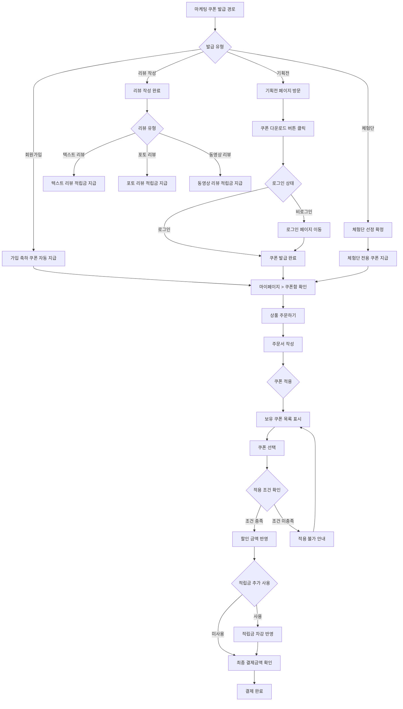
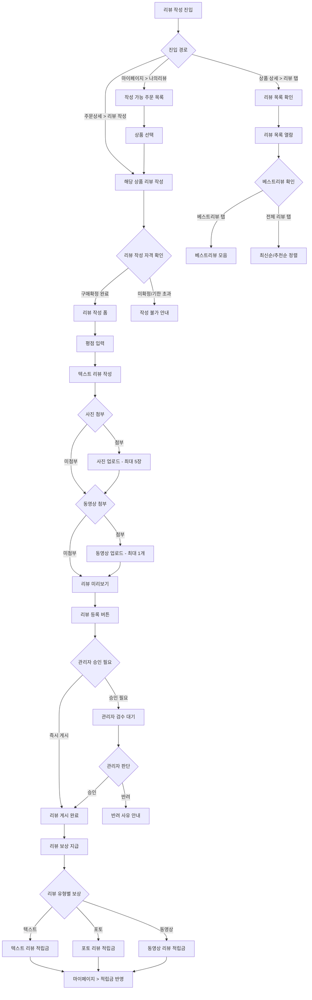
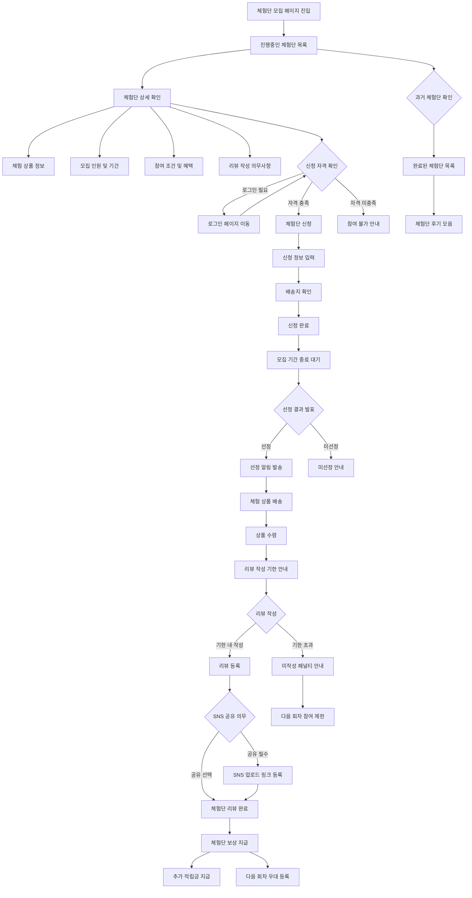

# 마케팅 정책

## 문서 정보

| 항목 | 내용 |
|------|------|
| 문서번호 | POLICY-A9-MARKETING |
| 작성일 | 2026-03-15 |
| 최종수정 | 2026-03-15 |
| 작성자 | 지니 |
| 대상독자 | 인쇄실무진, 운영팀 |
| 관련 IA | A-9 (마케팅 3개: 랜딩페이지5종, 이용후기, 체험단모집) |
| 총 결정 항목 | 3개 |
| 상태 | 작성중 |

---

## 목차

1. [정책 요약](#1-정책-요약)
2. [경쟁사 현황](#2-경쟁사-현황)
3. [쿠폰 정책](#3-쿠폰-정책)
4. [적립금 정책](#4-적립금-정책)
5. [리뷰/후기 정책](#5-리뷰후기-정책)
6. [체험단 정책](#6-체험단-정책)
7. [랜딩페이지 정책](#7-랜딩페이지-정책)
8. [UserFlow](#8-userflow)
9. [정책 결정 체크리스트](#9-정책-결정-체크리스트)
10. [추천 정책안](#10-추천-정책안)
11. [부록: 개발 참고사항](#부록-개발-참고사항)

---

## 1. 정책 요약

후니프린팅 마케팅 정책은 **신규 고객 유입**, **기존 고객 재구매 유도**, **브랜드 신뢰도 강화**를 목표로 합니다. 랜딩페이지 5종을 통한 기획전 운영, 이용후기를 통한 사회적 증거 확보, 체험단 모집을 통한 입소문 마케팅을 핵심 전략으로 수립합니다.

### 핵심 결정사항

| 번호 | 결정 사항 | 상태 |
|------|-----------|------|
| 1 | 랜딩페이지 5종 구성 및 기획전 운영 방식 | 미결정 |
| 2 | 이용후기 작성 보상 및 운영 정책 | 미결정 |
| 3 | 체험단 모집 운영 방식 및 혜택 설계 | 미결정 |

---

## 2. 경쟁사 현황

### 2.1 레드프린팅

| 항목 | 내용 |
|------|------|
| 적립 서비스 | i.TOKEN 적립 서비스 운영 |
| 기업 서비스 | 별도 브랜드몰 운영 (기업고객 전용) |
| 마케팅 특징 | 기업고객 대상 브랜드몰 분리 전략, 기업인쇄 서비스에 집중 |
| 리뷰 운영 | 상품 상세페이지 내 후기 영역 운영 |
| 랜딩페이지 | 기업서비스 소개 전용 랜딩페이지 운영 |

**시사점**: 기업고객과 개인고객을 분리하여 타겟 마케팅 실행. i.TOKEN이라는 자체 적립 브랜드로 차별화. 기업서비스 전용 랜딩페이지로 B2B 전환율 향상.

### 2.2 와우프레스

| 항목 | 내용 |
|------|------|
| 리뷰 이벤트 | GOOD리뷰어 이벤트 (포인트 + 경품 지급) |
| 베스트리뷰 | 베스트리뷰 선정 및 별도 노출 |
| 가입 쿠폰 | 회원가입 시 쿠폰 4종 + 무료배송 즉시 지급 |
| 회원등급 혜택 | 6단계 등급별 적립률 차등 (최대 VVIP 4%) |
| 체험단 | 별도 체험단 모집 프로그램 미확인 |

**시사점**: GOOD리뷰어 이벤트로 양질의 후기를 확보하는 전략이 효과적. 가입 시 즉시 혜택 제공으로 첫 주문 전환율을 높임. 베스트리뷰 선정으로 리뷰 품질 관리.

### 2.3 비교 분석표

| 비교 항목 | 레드프린팅 | 와우프레스 |
|-----------|-----------|-----------|
| **쿠폰 지급** | 미확인 | 가입 시 4종 즉시 지급 |
| **적립금** | i.TOKEN 자체 적립 | 등급별 차등 적립 (1~4%) |
| **리뷰 보상** | 미확인 | GOOD리뷰어 포인트+경품 |
| **베스트리뷰** | 미확인 | 선정 및 별도 노출 |
| **체험단** | 미확인 | 미확인 |
| **기획전/랜딩** | 기업서비스 랜딩 | 일반 기획전 운영 |
| **무료배송** | 조건부 | 가입 시 무료배송 쿠폰 |

---

## 3. 쿠폰 정책

마케팅 목적의 쿠폰 발급 및 사용 정책을 정의합니다. (회원 기본 쿠폰 정책은 POLICY-A1A2-MEMBER.md 참조)

### 3.1 마케팅 쿠폰 유형

| 번호 | 결정 항목 | 선택지 | 결정 |
|------|-----------|--------|------|
| 1 | 기획전 전용 쿠폰 | 정액할인 / 정률할인 / 무료배송 / 복합 | 미결정 |
| 2 | 시즌 이벤트 쿠폰 | 설날/추석/연말 등 시즌별 발급 / 미운영 | 미결정 |
| 3 | 재구매 유도 쿠폰 | 30일 미구매 시 자동발급 / 60일 / 미운영 | 미결정 |
| 4 | 체험단 전용 쿠폰 | 체험단 선정자 전용 쿠폰 발급 / 미운영 | 미결정 |
| 5 | 리뷰 작성 쿠폰 | 포토리뷰 쿠폰 / 텍스트리뷰 쿠폰 / 미운영 | 미결정 |

### 3.2 쿠폰 운영 규칙

| 번호 | 결정 항목 | 선택지 | 결정 |
|------|-----------|--------|------|
| 1 | 마케팅 쿠폰 유효기간 | 7일 / 14일 / 30일 / 이벤트별 상이 | 미결정 |
| 2 | 마케팅 쿠폰 중복사용 | 기본쿠폰과 중복 허용 / 불허 | 미결정 |
| 3 | 쿠폰 다운로드 방식 | 자동지급 / 다운로드 버튼 / 선착순 | 미결정 |
| 4 | 쿠폰 발급 알림 | SMS / 이메일 / 앱푸시 / 복합 | 미결정 |

---

## 4. 적립금 정책

마케팅 목적의 추가 적립금 정책을 정의합니다. (기본 적립금 정책은 POLICY-A1A2-MEMBER.md 참조)

### 4.1 마케팅 추가 적립

| 번호 | 결정 항목 | 선택지 | 결정 |
|------|-----------|--------|------|
| 1 | 리뷰 작성 적립금 | 텍스트: 500원 / 1,000원, 포토: 1,000원 / 2,000원 | 미결정 |
| 2 | 체험단 리뷰 적립금 | 일반 리뷰 적립금과 동일 / 추가 적립 / 미지급 | 미결정 |
| 3 | 이벤트 참여 적립금 | 출석체크 / 룰렛 / SNS공유 등 이벤트별 적립 | 미결정 |
| 4 | 추천인 적립금 | 추천인/피추천인 각각 적립 / 미운영 | 미결정 |

---

## 5. 리뷰/후기 정책

### 5.1 이용후기 유형

**경쟁사 현황**
- 와우프레스: GOOD리뷰어 이벤트로 포인트 + 경품 지급, 베스트리뷰 선정 및 노출
- 레드프린팅: 상품 상세 내 후기 영역 운영

**정책 결정 필요사항**

| 번호 | 결정 항목 | 선택지 | 결정 |
|------|-----------|--------|------|
| 1 | 리뷰 유형 구분 | 텍스트 리뷰만 / 텍스트+포토 / 텍스트+포토+동영상 | 미결정 |
| 2 | 리뷰 작성 자격 | 구매확정 회원만 / 배송완료 후 / 모든 구매자 | 미결정 |
| 3 | 리뷰 작성 기한 | 구매확정 후 30일 / 60일 / 90일 / 무기한 | 미결정 |
| 4 | 리뷰 수정/삭제 | 작성 후 7일 이내 / 30일 이내 / 언제든 가능 | 미결정 |

### 5.2 리뷰 보상 체계

| 번호 | 결정 항목 | 선택지 | 결정 |
|------|-----------|--------|------|
| 1 | 텍스트 리뷰 보상 | 적립금 500원 / 1,000원 / 미지급 | 미결정 |
| 2 | 포토 리뷰 보상 | 적립금 1,000원 / 2,000원 / 3,000원 | 미결정 |
| 3 | 동영상 리뷰 보상 | 적립금 3,000원 / 5,000원 / 미운영 | 미결정 |
| 4 | 베스트리뷰 보상 | 추가 적립금 / 쿠폰 / 경품 / 미운영 | 미결정 |
| 5 | 리뷰 보상 지급 시점 | 즉시 / 관리자 승인 후 / 익일 자동 지급 | 미결정 |

### 5.3 리뷰 노출 및 관리

| 번호 | 결정 항목 | 선택지 | 결정 |
|------|-----------|--------|------|
| 1 | 리뷰 노출 위치 | 상품 상세 내 / 별도 후기 게시판 / 둘 다 | 미결정 |
| 2 | 리뷰 정렬 기준 | 최신순 / 추천순 / 평점순 / 사용자 선택 | 미결정 |
| 3 | 베스트리뷰 선정 기준 | 추천수 / 관리자 선정 / 포토 우선 / 복합 | 미결정 |
| 4 | 리뷰 신고 기능 | 제공 / 미제공 | 미결정 |
| 5 | 관리자 리뷰 답변 | 제공(관리자 댓글) / 미제공 | 미결정 |
| 6 | 평점(별점) 체계 | 5점 / 10점 / 미사용 | 미결정 |
| 7 | 리뷰 비공개 처리 | 비속어 자동필터 / 관리자 수동 / 둘 다 | 미결정 |

---

## 6. 체험단 정책

### 6.1 체험단 운영 방식

**경쟁사 현황**
- 와우프레스: GOOD리뷰어 이벤트로 체험단과 유사한 효과 달성
- 레드프린팅: 별도 체험단 프로그램 미확인

**정책 결정 필요사항**

| 번호 | 결정 항목 | 선택지 | 결정 |
|------|-----------|--------|------|
| 1 | 체험단 운영 여부 | 운영 / 미운영(2차 도입) | 미결정 |
| 2 | 체험단 모집 주기 | 매월 / 격월 / 분기별 / 비정기 | 미결정 |
| 3 | 체험단 모집 인원 | 5명 / 10명 / 20명 / 상품별 상이 | 미결정 |
| 4 | 체험단 선정 기준 | 추첨 / SNS 영향력 / 구매이력 / 복합 | 미결정 |

### 6.2 체험단 혜택 및 의무

| 번호 | 결정 항목 | 선택지 | 결정 |
|------|-----------|--------|------|
| 1 | 체험단 제공 혜택 | 무료 제공 / 할인 쿠폰(50~90%) / 적립금 | 미결정 |
| 2 | 배송비 부담 | 업체 부담 / 체험단 부담 / 조건부 | 미결정 |
| 3 | 리뷰 작성 의무 | 필수(기한 내) / 권장 / 없음 | 미결정 |
| 4 | 리뷰 작성 기한 | 수령 후 7일 / 14일 / 30일 | 미결정 |
| 5 | 리뷰 최소 요건 | 포토 3장 이상 / 텍스트 200자 이상 / 동영상 / 복합 | 미결정 |
| 6 | SNS 공유 의무 | 인스타그램 / 블로그 / 선택 / 없음 | 미결정 |

### 6.3 체험단 관리

| 번호 | 결정 항목 | 선택지 | 결정 |
|------|-----------|--------|------|
| 1 | 미리뷰 체험단 페널티 | 다음 회차 참여 제한 / 혜택 회수 / 경고 | 미결정 |
| 2 | 중복 선정 제한 | 3개월 내 재선정 불가 / 6개월 / 제한 없음 | 미결정 |
| 3 | 체험단 모집 공개 범위 | 전체 공개 / 회원 전용 / 등급별 차등 | 미결정 |
| 4 | 체험단 진행 상태 관리 | 모집중 / 선정완료 / 배송중 / 리뷰대기 / 완료 | 미결정 |

---

## 7. 랜딩페이지 정책

### 7.1 랜딩페이지 5종 구성

후니프린팅의 주요 마케팅 캠페인을 위한 랜딩페이지 5종을 운영합니다.

**정책 결정 필요사항**

| 번호 | 랜딩페이지 유형 | 목적 | 결정 |
|------|----------------|------|------|
| 1 | 신규 회원 가입 이벤트 | 가입 유도 + 첫 주문 쿠폰 제공 | 미결정 |
| 2 | 시즌 기획전 (명함/전단 등) | 시즌별 주력 상품 프로모션 | 미결정 |
| 3 | 대량주문 기업고객 전용 | B2B 고객 유치 + 견적 상담 유도 | 미결정 |
| 4 | 체험단 모집 전용 | 체험단 신청 및 후기 모음 | 미결정 |
| 5 | 베스트리뷰/포트폴리오 | 인쇄 품질 신뢰도 강화 | 미결정 |

### 7.2 랜딩페이지 운영 정책

| 번호 | 결정 항목 | 선택지 | 결정 |
|------|-----------|--------|------|
| 1 | 기획전 교체 주기 | 월 1회 / 격주 / 시즌별 / 비정기 | 미결정 |
| 2 | 랜딩페이지 접근 경로 | 메인 배너 / GNB 메뉴 / 외부 링크(SNS 광고) / 복합 | 미결정 |
| 3 | 기획전 상품 구성 | 카테고리별 / 용도별 / 가격대별 / 자유 구성 | 미결정 |
| 4 | 기획전 할인 방식 | 전용 쿠폰 / 즉시 할인가 / 적립금 추가 지급 | 미결정 |
| 5 | 종료된 기획전 처리 | 삭제 / 종료 안내 후 보관 / 상시 전환 | 미결정 |
| 6 | 기획전 성과 지표 | 페이지뷰 / 전환율 / 매출액 / 쿠폰 사용률 | 미결정 |

---

## 8. UserFlow

### 8.1 쿠폰 발급/사용 UserFlow

### 8.2 리뷰 작성 UserFlow

### 8.3 체험단 진행 UserFlow

---

## 9. 정책 결정 체크리스트

### A-9-1 랜딩페이지 5종

- [ ] 랜딩페이지 5종 유형 확정 (신규가입/시즌기획전/기업고객/체험단/베스트리뷰)
- [ ] 기획전 교체 주기 결정
- [ ] 랜딩페이지 접근 경로 결정
- [ ] 기획전 상품 구성 방식 결정
- [ ] 기획전 할인 방식 결정
- [ ] 종료된 기획전 처리 방식 결정
- [ ] 기획전 성과 측정 지표 결정

### A-9-2 이용후기

- [ ] 리뷰 유형 구분 결정 (텍스트/포토/동영상)
- [ ] 리뷰 작성 자격 조건 결정
- [ ] 리뷰 작성 기한 결정
- [ ] 리뷰 수정/삭제 정책 결정
- [ ] 텍스트 리뷰 보상 금액 결정
- [ ] 포토 리뷰 보상 금액 결정
- [ ] 동영상 리뷰 보상 금액 결정
- [ ] 베스트리뷰 선정 기준 및 보상 결정
- [ ] 리뷰 보상 지급 시점 결정
- [ ] 리뷰 노출 위치 결정
- [ ] 리뷰 정렬 기준 결정
- [ ] 평점(별점) 체계 결정
- [ ] 리뷰 신고 기능 제공 여부 결정
- [ ] 관리자 리뷰 답변 기능 제공 여부 결정
- [ ] 리뷰 비공개 처리 방식 결정

### A-9-3 체험단 모집

- [ ] 체험단 운영 여부 결정
- [ ] 체험단 모집 주기 결정
- [ ] 체험단 모집 인원 결정
- [ ] 체험단 선정 기준 결정
- [ ] 체험단 제공 혜택 결정
- [ ] 배송비 부담 주체 결정
- [ ] 리뷰 작성 의무 여부 결정
- [ ] 리뷰 작성 기한 결정
- [ ] 리뷰 최소 요건 결정
- [ ] SNS 공유 의무 여부 결정
- [ ] 미리뷰 체험단 페널티 결정
- [ ] 중복 선정 제한 정책 결정
- [ ] 체험단 모집 공개 범위 결정
- [ ] 체험단 진행 상태 관리 방식 결정

### 쿠폰/적립금 (마케팅 관련)

- [ ] 기획전 전용 쿠폰 유형 결정
- [ ] 시즌 이벤트 쿠폰 운영 여부 결정
- [ ] 재구매 유도 쿠폰 정책 결정
- [ ] 마케팅 쿠폰 유효기간 결정
- [ ] 마케팅 쿠폰 중복사용 정책 결정
- [ ] 쿠폰 다운로드 방식 결정
- [ ] 리뷰 작성 적립금 금액 결정
- [ ] 추천인 적립금 운영 여부 결정

---

## 10. 추천 정책안

아래는 경쟁사 분석과 인쇄업 특성을 반영한 추천안입니다. 최종 결정은 운영팀에서 진행합니다.

### 10.1 랜딩페이지 추천안

| 항목 | 추천안 | 근거 |
|------|--------|------|
| 랜딩페이지 5종 | 신규가입 / 시즌기획전 / 기업고객 / 체험단 / 베스트리뷰 | 고객 유입~신뢰 확보 전체 퍼널 커버 |
| 기획전 교체 주기 | **월 1회** (시즌기획전만 분기별) | 운영 부담과 신선도 균형 |
| 접근 경로 | **메인 배너 + SNS 광고 링크** | 내부/외부 트래픽 동시 확보 |
| 할인 방식 | **기획전 전용 쿠폰 다운로드** | 쿠폰 다운로드 행위로 고객 데이터 확보 |

### 10.2 리뷰/후기 추천안

| 항목 | 추천안 | 근거 |
|------|--------|------|
| 리뷰 유형 | **텍스트 + 포토** (동영상은 2차) | 인쇄물 특성상 포토가 핵심, 초기 운영 간소화 |
| 텍스트 리뷰 보상 | **적립금 500원** | 업계 평균 수준 |
| 포토 리뷰 보상 | **적립금 2,000원** | 포토리뷰 유도를 위한 차등 보상 |
| 베스트리뷰 | **관리자 선정 + 추가 적립금 5,000원** | 품질 관리 + 참여 동기부여 |
| 리뷰 작성 기한 | **구매확정 후 30일** | 인쇄물 사용 후 리뷰 작성 시간 확보 |
| 리뷰 노출 | **상품 상세 내 + 후기 게시판 둘 다** | 구매 결정 시점과 탐색 시점 모두 커버 |
| 평점 체계 | **5점 별점** | 직관적, 업계 표준 |

### 10.3 체험단 추천안

| 항목 | 추천안 | 근거 |
|------|--------|------|
| 운영 여부 | **2차 도입** (오픈 후 3개월 안정화 후) | 초기에는 리뷰 보상에 집중, 안정화 후 체험단 |
| 모집 주기 | **월 1회** | 운영 부담 최소화하면서 지속 운영 |
| 모집 인원 | **10명** | 소수 정예로 리뷰 품질 확보 |
| 제공 혜택 | **무료 제공** (배송비 업체 부담) | 양질의 리뷰 확보를 위한 투자 |
| 리뷰 의무 | **포토 3장 이상 + 텍스트 200자 이상, 수령 후 14일 이내** | 인쇄물 품질을 보여줄 수 있는 최소 요건 |
| SNS 공유 | **권장(선택)** | 강제 시 참여율 저하 우려 |
| 미리뷰 페널티 | **다음 회차 참여 제한** | 온건한 페널티로 참여 의지 확인 |

### 10.4 쿠폰/적립금 추천안 (마케팅)

| 항목 | 추천안 | 근거 |
|------|--------|------|
| 기획전 쿠폰 | **정액 할인 (3,000~10,000원)** | 인쇄물 가격대에 맞는 할인 |
| 시즌 이벤트 | **분기별 1회** (설날/추석/연말/신학기) | 인쇄물 수요 시즌에 맞춤 |
| 재구매 유도 | **60일 미구매 시 자동발급** | 인쇄물 재주문 주기 고려 |
| 추천인 적립금 | **2차 도입** | 초기에는 직접 마케팅에 집중 |

---

## [부록] 개발 참고사항

> 이 섹션은 개발팀 참고용입니다. 인쇄실무진은 위 정책 결정 항목에 집중해주세요.

### shopby 플랫폼 대응 현황

shopby(NHN커머스)의 마케팅 관련 기능 구현 방식을 정리합니다.

| 기능 | 구현 방식 | 설명 |
|------|-----------|------|
| 랜딩페이지 5종 | SKIN | shopby 기획전(Page API) + 스킨 커스터마이징으로 구현 |
| 이용후기 | NATIVE | shopby 상품후기 API 기본 제공 |
| 체험단 모집 | CUSTOM | shopby 미지원, 별도 게시판 + 커스텀 관리 기능 개발 필요 |

**구현 방식 범례**
- **NATIVE**: shopby 기본 제공 기능, 관리자 설정만으로 사용 가능
- **SKIN**: shopby 스킨(프론트엔드) 커스터마이징으로 구현
- **CUSTOM**: shopby API 활용 + 별도 백엔드/프론트엔드 개발 필요

### 기능별 구현 상세

#### 1. 랜딩페이지 (SKIN)

| 항목 | 상세 |
|------|------|
| 구현 방식 | shopby 기획전(Promotion) + Page API 활용 |
| 기획전 생성 | shopby 관리자 > 기획전 관리에서 생성 |
| 페이지 구성 | Page API로 컴포넌트 조합 (배너 + 상품목록 + 쿠폰 다운로드) |
| URL 관리 | /pages/{page-id} 형태의 고유 URL 자동 생성 |
| SEO 설정 | 기획전별 메타태그, OG태그 설정 가능 |
| 외부 유입 추적 | UTM 파라미터 지원 (utm_source, utm_medium, utm_campaign) |

**주요 API 참조**

| 기능 | API 엔드포인트 | 비고 |
|------|---------------|------|
| 기획전 목록 조회 | GET /promotions | 진행중/종료 기획전 목록 |
| 기획전 상세 조회 | GET /promotions/{promotionNo} | 기획전 상품 목록 포함 |
| 페이지 조회 | GET /pages/{pageId} | 커스텀 페이지 렌더링 |
| 쿠폰 다운로드 | POST /coupons/download | 기획전 전용 쿠폰 발급 |

#### 2. 이용후기 (NATIVE)

| 항목 | 상세 |
|------|------|
| 구현 방식 | shopby 상품후기(Product Review) API 기본 활용 |
| 리뷰 작성 | 구매확정 후 작성 가능, shopby 기본 제공 |
| 사진 첨부 | shopby 이미지 업로드 API 연동 |
| 평점 관리 | shopby 상품평점 자동 집계 |
| 관리자 답변 | shopby 관리자 댓글 기능 제공 |
| 베스트리뷰 | shopby 추천 기능 활용 + 관리자 선정 플래그 추가 |

**주요 API 참조**

| 기능 | API 엔드포인트 | 비고 |
|------|---------------|------|
| 리뷰 목록 조회 | GET /products/{productNo}/reviews | 상품별 리뷰 목록 |
| 리뷰 작성 | POST /products/{productNo}/reviews | 텍스트 + 이미지 |
| 리뷰 수정 | PUT /products/{productNo}/reviews/{reviewNo} | 작성자만 수정 가능 |
| 리뷰 삭제 | DELETE /products/{productNo}/reviews/{reviewNo} | 작성자/관리자 |
| 리뷰 추천 | POST /products/{productNo}/reviews/{reviewNo}/recommend | 추천수 증가 |
| 이미지 업로드 | POST /files/images | 리뷰 첨부 이미지 |

#### 3. 체험단 모집 (CUSTOM)

| 항목 | 상세 |
|------|------|
| 구현 방식 | shopby 게시판 API + 커스텀 관리 화면 별도 개발 |
| 모집 게시판 | shopby 게시판(Board) 생성 후 체험단 전용 카테고리 운영 |
| 신청 접수 | 게시판 글쓰기 폼을 체험단 신청서로 커스터마이징 |
| 선정 관리 | 별도 관리 화면에서 선정/미선정 처리 (커스텀 개발) |
| 상태 관리 | 모집중→선정완료→배송중→리뷰대기→완료 상태 플로우 (커스텀 필드) |
| 리뷰 연동 | 체험단 리뷰는 상품후기 API에 '체험단' 태그 부착 |
| 알림 발송 | shopby 자동메일 + 외부 SMS API 연동 |

**주요 API 참조**

| 기능 | API 엔드포인트 | 비고 |
|------|---------------|------|
| 게시판 목록 조회 | GET /boards/{boardNo}/articles | 체험단 모집글 목록 |
| 체험단 신청 | POST /boards/{boardNo}/articles | 신청서 제출 |
| 게시글 수정 | PUT /boards/{boardNo}/articles/{articleNo} | 상태 변경 포함 |
| 쿠폰 발급 | POST /coupons/issue | 체험단 전용 쿠폰 지급 |
| 적립금 지급 | POST /members/{memberNo}/accumulations | 체험단 보상 적립 |

### 기술 구현 포인트

1. **랜딩페이지 운영**
   - shopby 기획전 관리에서 기본 구조 생성 후 스킨에서 디자인 커스터마이징
   - UTM 파라미터를 활용한 마케팅 채널별 유입 추적
   - 기획전 종료 시 자동 비노출 처리 스케줄링

2. **리뷰 보상 자동화**
   - 리뷰 등록 시 Webhook 또는 배치 처리로 적립금 자동 지급
   - 포토/텍스트 리뷰 구분에 따른 차등 적립 로직
   - 베스트리뷰 선정 시 추가 보상 자동 처리

3. **체험단 관리 시스템**
   - shopby 게시판을 기반으로 하되 관리 화면은 별도 개발
   - 상태 전환 시 자동 알림(SMS/이메일) 발송
   - 리뷰 미작성 체험단원 자동 감지 및 리마인드 발송
   - 체험단 리뷰에 '체험단' 배지 표시를 위한 커스텀 태그 관리
