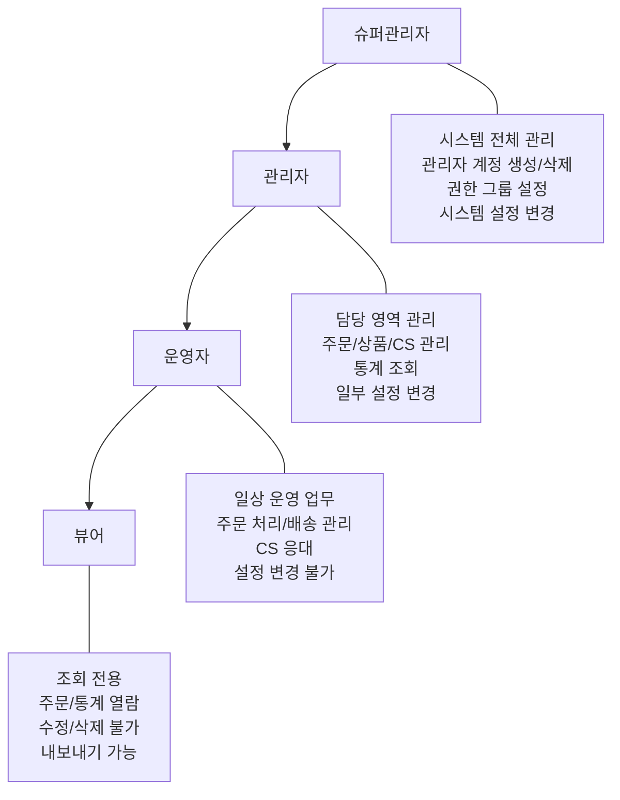
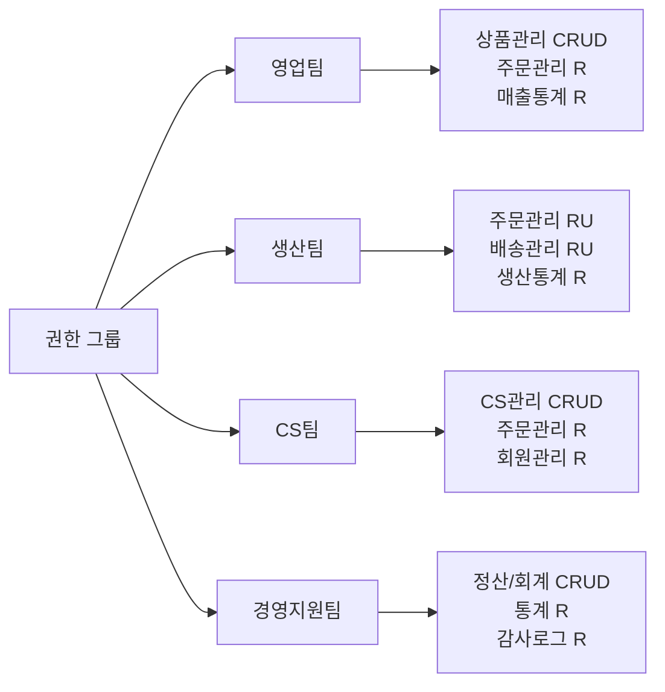
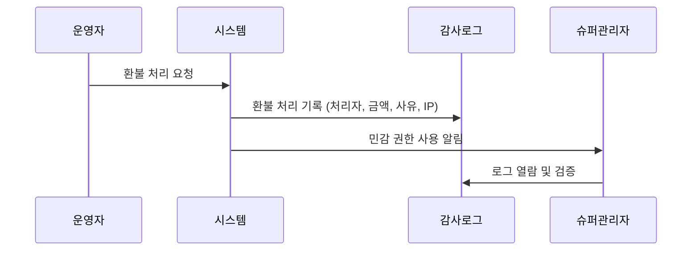
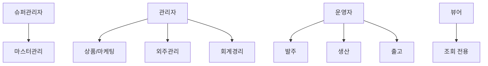
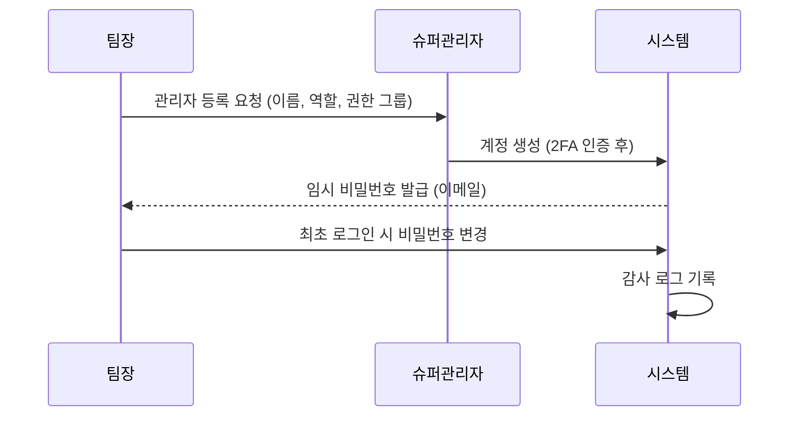

# 관리자/운영 정책

## 문서 정보

| 항목 | 내용 |
|------|------|
| 문서번호 | POLICY-B1-ADMIN |
| 작성일 | 2026-03-15 |
| 최종수정 | 2026-03-15 |
| 작성자 | 지니 |
| 대상독자 | 인쇄실무진 (대표, 운영팀장, 관리자) |
| 관련 IA | B-1 관리자 (2개: 관리자등록, 관리자관리) |
| 총 결정 항목 | 8개 |
| 상태 | 작성중 |

---

## 목차

1. [정책 요약](#1-정책-요약)
2. [경쟁사 현황](#2-경쟁사-현황)
3. [관리자 역할 정의](#3-관리자-역할-정의)
4. [권한 그룹별 메뉴 접근](#4-권한-그룹별-메뉴-접근)
5. [감사 로그](#5-감사-로그)
6. [조직별 업무 분장](#6-조직별-업무-분장)
7. [MES 화면별 기능](#7-mes-화면별-기능)
8. [정책 결정 체크리스트](#8-정책-결정-체크리스트)
9. [추천 정책안](#9-추천-정책안)
10. [부록: 개발 참고사항](#부록-개발-참고사항)

---

## 1. 정책 요약

본 문서는 후니프린팅 관리자 시스템의 역할 정의, 권한 관리, 감사 로그에 대한 운영 정책을 정의한다.

**핵심 정책 방향**:
- 역할 기반 접근 제어(RBAC)로 관리자 권한을 체계적으로 관리
- 슈퍼관리자/관리자/운영자/뷰어 4단계 역할 분리
- 권한 그룹으로 메뉴별 접근과 기능(조회/수정/삭제)을 세분화
- 주요 작업에 대한 감사 로그(Audit Log) 기록으로 책임 추적
- 인쇄업 특성을 반영한 생산/배송 관련 권한 분리

**핵심 결정사항**

| 번호 | 결정 사항 | 상태 |
|------|-----------|------|
| 1 | 관리자 역할 단계 수 (3단계/4단계) | 미결정 |
| 2 | 팀별 권한 그룹 구성 | 미결정 |
| 3 | 감사 로그 보관 기간 | 미결정 |
| 4 | 관리자 로그인 보안 정책 (2FA 도입 여부) | 미결정 |
| 5 | 관리자 비밀번호 변경 주기 | 미결정 |
| 6 | 동시 접속 제한 정책 | 미결정 |
| 7 | 권한 변경 승인 프로세스 | 미결정 |
| 8 | 퇴직자 계정 처리 절차 | 미결정 |

---

## 2. 경쟁사 현황

### 2.1 레드프린팅

| 항목 | 내용 |
|------|------|
| 관리자 체계 | 슈퍼관리자 + 부서별 담당자 |
| 권한 관리 | 부서별 메뉴 접근 제어 |
| 특이사항 | 대규모 조직 운영 (부서별 분업) |

**시사점**: 대규모 인쇄 기업으로서 부서별 권한 분리가 잘 되어 있음. 생산/영업/CS 각 부서가 필요한 메뉴만 접근.

### 2.2 와우프레스

| 항목 | 내용 |
|------|------|
| 관리자 체계 | 대표 관리자 + 담당 관리자 |
| 권한 관리 | 기능별 권한 부여 |
| 특이사항 | 납기 관리에 특화된 권한 구조 |

**시사점**: 납기 지연 보상 정책과 연동된 생산 관리 권한이 특징. 납기 관련 수정 권한을 제한하여 임의 변경 방지.

### 2.3 오프린트미

| 항목 | 내용 |
|------|------|
| 관리자 체계 | IT 기반 조직 구조 |
| 권한 관리 | 기술 조직 중심 |
| 특이사항 | Zendesk 연동으로 CS 권한 외부화 |

**시사점**: CS 업무를 외부 도구로 분리하여 관리자 시스템 복잡도를 줄이는 전략.

### 2.4 비교 분석표

| 비교 항목 | 레드프린팅 | 와우프레스 | 오프린트미 |
|-----------|-----------|-----------|-----------|
| **관리자 단계** | 다단계(부서별) | 2단계 | 기술조직 중심 |
| **권한 세분화** | 높음 | 중간 | 낮음 |
| **생산 권한 분리** | O | O | 해당없음 |
| **감사 로그** | 미확인 | 미확인 | 미확인 |
| **2FA** | 미확인 | 미확인 | 미확인 |

---

## 3. 관리자 역할 정의

### 3.1 4단계 역할 체계

### 3.2 역할별 상세 정의

| 역할 | 대상 | 주요 권한 | 제한 사항 |
|------|------|-----------|-----------|
| **슈퍼관리자** | 대표, 총괄이사 | 모든 메뉴/기능 접근, 관리자 계정 CRUD, 시스템 설정 | 없음 (최고 권한) |
| **관리자** | 팀장, 실장 | 담당 영역 전체 관리, 하위 운영자 관리, 통계 조회 | 시스템 설정 변경 불가, 관리자 계정 생성 불가 |
| **운영자** | 실무 담당자 | 일상 운영 (주문처리, CS, 배송), 데이터 입력/수정 | 설정 변경 불가, 계정 관리 불가, 삭제 제한 |
| **뷰어** | 경영진, 외부 감사 | 모든 데이터 조회, 엑셀 내보내기 | 수정/삭제/생성 불가 |

### 3.3 인쇄업 특화 역할

인쇄업 특성에 따른 세부 운영자 역할:

| 세부 역할 | 역할 등급 | 담당 업무 |
|-----------|-----------|-----------|
| 파일검수 담당 | 운영자 | 입고 파일 확인, 파일 오류 안내, 재입고 요청 |
| 생산관리 담당 | 운영자 | 생산 스케줄, 기계 배정, 작업 지시 |
| 배송관리 담당 | 운영자 | 배송사 배정, 송장 입력, 배송 추적 |
| CS 담당 | 운영자 | 고객 문의 응대, 교환/반품 처리 |
| 정산 담당 | 관리자 | 매출 정산, 거래처 정산, 세금계산서 |

---

## 4. 권한 그룹별 메뉴 접근

### 4.1 권한 매트릭스

| 메뉴 영역 | 슈퍼관리자 | 관리자 | 운영자 | 뷰어 |
|-----------|-----------|--------|--------|------|
| **시스템 설정** | CRUD | R | - | - |
| **관리자 계정** | CRUD | R (하위만) | - | - |
| **권한 그룹** | CRUD | R | - | - |
| **상품 관리** | CRUD | CRUD | CRU | R |
| **주문 관리** | CRUD | CRUD | RU | R |
| **CS 관리** | CRUD | CRUD | CRU | R |
| **배송 관리** | CRUD | CRUD | RU | R |
| **통계/리포트** | R | R | R (일부) | R |
| **정산/회계** | CRUD | CRU | R | R |
| **회원 관리** | CRUD | CRU | R | R |
| **프로모션** | CRUD | CRUD | R | R |
| **감사 로그** | R | R (본인) | - | - |

> CRUD: Create(생성), Read(조회), Update(수정), Delete(삭제)

### 4.2 팀별 권한 그룹 예시

### 4.3 민감 권한 정의

특별 관리가 필요한 고위험 권한:

| 민감 권한 | 허용 역할 | 추가 조건 |
|-----------|-----------|-----------|
| 관리자 계정 생성/삭제 | 슈퍼관리자만 | 2FA 인증 후 |
| 환불 처리 | 관리자 이상 | 금액 한도 설정 |
| 가격 일괄 변경 | 관리자 이상 | 변경 내역 감사 로그 |
| 회원 개인정보 조회 | 관리자 이상 | 접근 로그 기록 |
| 매출 데이터 내보내기 | 관리자 이상 | 내보내기 로그 기록 |
| 주문 삭제 | 슈퍼관리자만 | 삭제 사유 필수 입력 |

---

## 5. 감사 로그

### 5.1 로그 기록 대상

| 분류 | 기록 항목 | 상세 |
|------|-----------|------|
| **계정** | 로그인/로그아웃 | 일시, IP, 기기, 성공/실패 |
| **계정** | 비밀번호 변경 | 변경자, 변경일시 |
| **계정** | 관리자 등록/수정/삭제 | 처리자, 대상, 변경 내용 |
| **권한** | 권한 그룹 변경 | 변경자, 변경 전/후 |
| **주문** | 주문 상태 변경 | 처리자, 주문번호, 변경 전/후 |
| **주문** | 환불/취소 처리 | 처리자, 금액, 사유 |
| **상품** | 가격 변경 | 변경자, 상품, 변경 전/후 |
| **회원** | 개인정보 조회 | 조회자, 대상 회원, 조회 항목 |
| **데이터** | 엑셀 내보내기 | 내보내기 대상, 건수, 처리자 |
| **설정** | 시스템 설정 변경 | 변경자, 변경 항목, 변경 전/후 |

### 5.2 로그 관리 정책

| 정책 항목 | 선택지 | 추천 | 근거 |
|----------|--------|------|------|
| 보관 기간 | 1년 / 3년 / 5년 | 3년 | 전자상거래법 보존 의무 (5년 권장) |
| 열람 권한 | 슈퍼관리자만 / 관리자 이상 | 슈퍼관리자+관리자(본인분) | 책임 추적 + 자기 감시 |
| 실시간 알림 | 전체 / 민감 권한만 / 없음 | 민감 권한만 | 과다 알림 방지 |
| 로그 형식 | 텍스트 / 구조화(JSON) | 구조화(JSON) | 검색/분석 용이 |
| 로그 백업 | 일 1회 / 주 1회 | 일 1회 | 데이터 안전 |

### 5.3 감사 로그 활용

---

## 6. 조직별 업무 분장

order-process.md Section 04 기반의 조직별 업무 분장 정의.

### 6.1 조직별 업무 매트릭스

| 조직 | 주요 업무 | 관련 메뉴 | 비고 |
|------|-----------|-----------|------|
| **마스터관리** | 시스템 설정, 관리자 계정, 권한 그룹, 쇼핑몰 기본 설정 | 시스템설정, 관리자계정, 권한그룹 | 슈퍼관리자 전용 |
| **상품/마케팅** | 상품 등록/수정, 가격 관리, 프로모션, 이벤트, 배너 관리 | 상품관리, 프로모션, 마케팅 | 관리자/운영자 |
| **발주** | 주문 접수 확인, 발주서 생성, 외주 발주, 거래처 연락 | 주문관리, 거래처관리 | 운영자 |
| **생산** | 작업지시, 공정 관리, 인쇄/제본/후가공 진행, 품질 검수 | 주문관리(인쇄/제본), MES화면 | 운영자 |
| **출고** | 포장, 송장 입력, 택배사 연동, 방문수령 관리 | 배송관리, 주문상태변경 | 운영자 |
| **외주관리** | 외주 발주 현황, 입고 확인, 외주 품질 관리, 납기 관리 | 거래처관리, 굿즈발주정산 | 관리자/운영자 |
| **회계경리** | 매출 정산, 세금계산서 발행, 미수금 관리, 원장 관리 | 정산/회계, 원장관리, 증빙서류 | 관리자(정산담당) |

### 6.2 조직-역할 매핑

---

## 7. MES 화면별 기능

MES(Manufacturing Execution System) 화면은 생산 현장에서 사용하는 전용 화면으로, 아래 기능을 제공한다.

### 7.1 MES 화면 구성

| 화면 | 기능 | 사용 조직 |
|------|------|-----------|
| 주문 대기 목록 | 제작대기 상태 주문 목록 조회, 작업 착수 처리 | 생산 |
| 작업 지시서 | 주문별 작업 지시서 조회/출력, 파일 다운로드 | 생산 |
| 공정 현황판 | 공정별(출력→커팅→제본→가공→포장) 실시간 현황 | 생산, 출고 |
| 출력 완료 처리 | 출력 완료 상태 변경, 다음 공정으로 이관 | 생산 |
| 포장 완료 처리 | 포장 완료 처리, 출고 대기 전환 | 출고 |
| 송장 출력 | 택배 송장 출력, 송장번호 입력 | 출고 |
| 불량 처리 | 불량 등록, 재제작 요청, 클레임 연동 | 생산 |

### 7.2 MES 화면 접근 권한

| MES 화면 | 슈퍼관리자 | 관리자 | 운영자(생산) | 운영자(출고) | 뷰어 |
|----------|-----------|--------|-------------|-------------|------|
| 주문 대기 목록 | R | R | RU | R | R |
| 작업 지시서 | R | R | R | R | R |
| 공정 현황판 | R | R | R | R | R |
| 출력 완료 처리 | RU | RU | RU | - | - |
| 포장 완료 처리 | RU | RU | - | RU | - |
| 송장 출력 | RU | RU | - | RU | - |
| 불량 처리 | CRUD | CRU | CRU | R | R |

---

## 8. 정책 결정 체크리스트

### 역할 및 권한

- [ ] 관리자 역할 단계 확정 (3단계/4단계)
- [ ] 각 역할별 대상 인원 지정
- [ ] 팀별 권한 그룹 구성 확정
- [ ] 민감 권한 목록 및 추가 조건 확정
- [ ] 권한 변경 시 승인 프로세스 확정 (즉시/승인 후)

### 보안

- [ ] 관리자 로그인 2FA 도입 여부 확정
- [ ] 비밀번호 정책 확정 (최소 길이, 변경 주기, 복잡도)
- [ ] 동시 접속 제한 정책 확정
- [ ] 로그인 실패 잠금 기준 확정 (5회/10회)
- [ ] IP 접근 제한 도입 여부 확정

### 계정 관리

- [ ] 관리자 등록 절차 확정 (요청서/구두)
- [ ] 퇴직자 계정 비활성화 절차 확정
- [ ] 계정 비활성 기간(미사용) 기준 확정
- [ ] 임시 권한 부여 절차 확정 (대리/휴가 시)

### 감사 로그

- [ ] 감사 로그 보관 기간 확정
- [ ] 실시간 알림 대상 권한 확정
- [ ] 정기 감사 주기 확정 (월/분기)

---

## 9. 추천 정책안

### 추천안 요약

| 영역 | 추천 정책 | 우선순위 |
|------|-----------|----------|
| 역할 체계 | 4단계 (슈퍼관리자/관리자/운영자/뷰어) | 높음 |
| 권한 관리 | 역할 기반(RBAC) + 팀별 권한 그룹 | 높음 |
| 보안 | 슈퍼관리자 2FA 필수, 비밀번호 90일 변경 | 높음 |
| 감사 로그 | 3년 보관, 민감 권한 실시간 알림 | 중간 |
| 계정 관리 | 퇴직 즉시 비활성화, 90일 미사용 자동 잠금 | 중간 |

### 추천안 상세

#### 9.1 관리자 등록 프로세스

#### 9.2 퇴직자 계정 처리

#### 9.3 비밀번호 정책

| 항목 | 추천 기준 |
|------|-----------|
| 최소 길이 | 8자 이상 |
| 복잡도 | 영문 대/소문자 + 숫자 + 특수문자 조합 |
| 변경 주기 | 90일 (슈퍼관리자: 60일) |
| 이전 비밀번호 재사용 | 최근 5회 사용 비밀번호 재사용 불가 |
| 로그인 실패 잠금 | 5회 실패 시 30분 잠금 |

#### 9.4 단계별 도입 제안

| 단계 | 항목 | 시기 |
|------|------|------|
| 1단계 | 4단계 역할 체계 + 기본 권한 그룹 설정 | 오픈 전 필수 |
| 2단계 | 팀별 세부 권한 그룹 + 감사 로그 | 오픈 시 |
| 3단계 | 2FA 도입 + IP 접근 제한 | 오픈 후 1개월 |
| 4단계 | 정기 감사 체계 + 자동 알림 고도화 | 오픈 후 3개월 |

---

## [부록] 개발 참고사항

### shopby 기능 매핑

| IA 항목 | shopby 분류 | 구현 방식 |
|---------|------------|-----------|
| 관리자등록 | NATIVE | shopby 운영자관리 기능 활용 |
| 관리자관리 | NATIVE | shopby 권한그룹 기능 활용 |

### 기술 구현 가이드

#### 운영자 관리 (NATIVE)

- shopby 관리자 > 운영자관리 메뉴 활용
- 기본 제공: 계정 생성/수정/삭제, 상태 관리
- 역할 등급은 shopby 운영자 유형으로 매핑
- 커스텀 필드 추가 검토: 부서, 직급, 담당 업무

#### 권한 그룹 (NATIVE)

- shopby 관리자 > 권한그룹 메뉴 활용
- 기본 제공: 메뉴별 접근 권한 설정
- 팀별 권한 그룹 사전 정의 (영업/생산/CS/경영지원)
- 메뉴 접근 + 기능(CRUD) 레벨 제어

#### 감사 로그 확장

- shopby 기본 로그: 관리자 로그인/로그아웃 기록
- 확장 필요 항목: 환불 처리, 가격 변경, 개인정보 조회 등
- 방안 1: shopby 확장 API 활용 (가능 여부 확인 필요)
- 방안 2: 별도 감사 로그 테이블 구축 (CUSTOM)
- 방안 3: 외부 로깅 서비스 연동 (EXTERNAL)

### 관련 API

| API | 용도 | 비고 |
|-----|------|------|
| shopby 운영자 관리 API | 관리자 계정 CRUD | NATIVE 기능 |
| shopby 권한그룹 API | 권한 그룹 설정 | NATIVE 기능 |
| shopby 관리자 로그 API | 로그인/활동 로그 | NATIVE 기능 (범위 확인 필요) |
