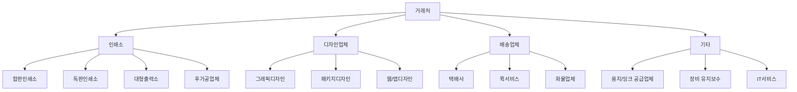
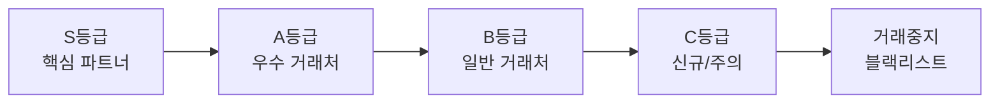
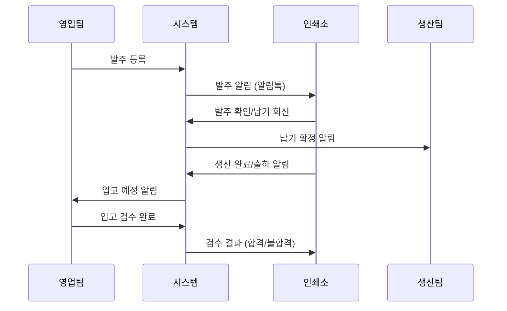
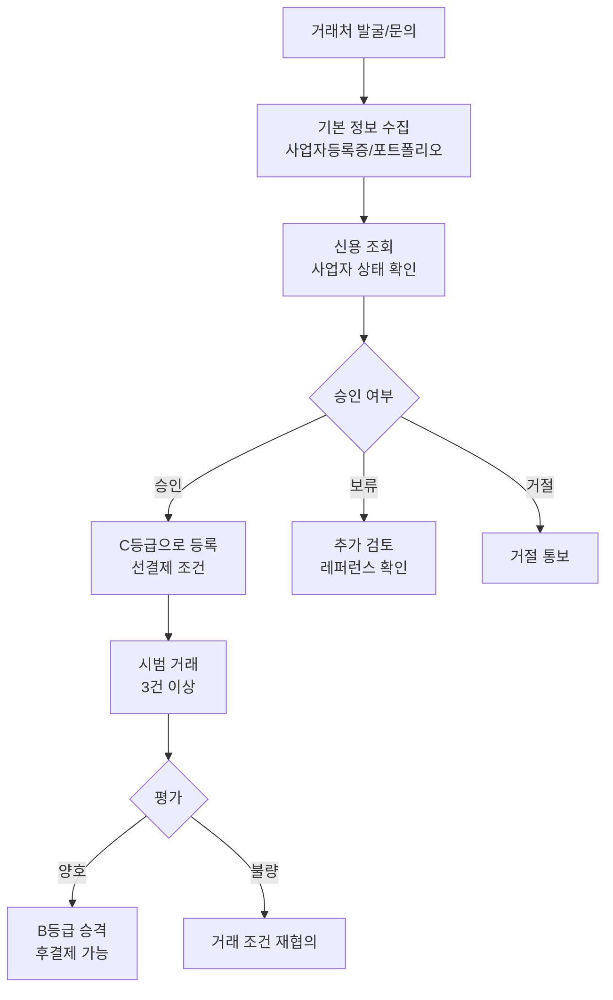
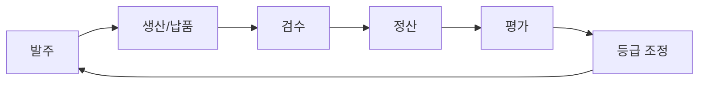

# 거래처 정책

## 문서 정보

| 항목 | 내용 |
|------|------|
| 문서번호 | POLICY-B2-VENDOR |
| 작성일 | 2026-03-15 |
| 최종수정 | 2026-03-15 |
| 작성자 | 지니 |
| 대상독자 | 인쇄실무진 (대표, 구매/영업팀, 생산관리) |
| 관련 IA | B-2 거래처 (2개: 거래처관리, 매장게시판) |
| 총 결정 항목 | 10개 |
| 상태 | 작성중 |

---

## 목차

1. [정책 요약](#1-정책-요약)
2. [경쟁사 현황](#2-경쟁사-현황)
3. [거래처 유형 정의](#3-거래처-유형-정의)
4. [거래 조건 및 신용 등급](#4-거래-조건-및-신용-등급)
5. [커뮤니케이션 채널](#5-커뮤니케이션-채널)
6. [정책 결정 체크리스트](#6-정책-결정-체크리스트)
7. [추천 정책안](#7-추천-정책안)
8. [부록: 개발 참고사항](#부록-개발-참고사항)

---

## 1. 정책 요약

본 문서는 후니프린팅의 거래처(인쇄소, 디자인업체, 배송업체 등) 관리 및 커뮤니케이션 정책을 정의한다.

**핵심 정책 방향**:
- 거래처 유형별(인쇄소/디자인업체/배송업체) 체계적 분류 및 관리
- 거래 조건(결제 조건, 납기 기준, 품질 기준)의 명문화
- 신용 등급 기반 거래처 평가 및 관리
- 매장게시판을 활용한 거래처 간 업무 커뮤니케이션
- 거래처 성과 모니터링 및 피드백 체계

**핵심 결정사항**

| 번호 | 결정 사항 | 상태 |
|------|-----------|------|
| 1 | 거래처 유형 분류 기준 (인쇄소/디자인/배송/기타) | 미결정 |
| 2 | 거래처별 결제 조건 (선결제/후결제/월정산) | 미결정 |
| 3 | 신용 등급 체계 (등급 수, 평가 기준) | 미결정 |
| 4 | 매장게시판 운영 방식 (공개/비공개/거래처별 분리) | 미결정 |
| 5 | 거래처 성과 평가 주기 | 미결정 |
| 6 | 신규 거래처 등록 승인 프로세스 | 미결정 |
| 7 | 거래처 정보 관리 항목 (기본정보/담당자/계약) | 미결정 |
| 8 | 거래 중지/해지 기준 | 미결정 |
| 9 | 거래처 커뮤니케이션 이력 보관 기간 | 미결정 |
| 10 | 외주 발주 자동화 범위 | 미결정 |

---

## 2. 경쟁사 현황

### 2.1 레드프린팅

| 항목 | 내용 |
|------|------|
| 거래처 관리 | 자체 생산 + 외주 인쇄소 네트워크 |
| 외주 체계 | 품목별 전문 인쇄소 분배 |
| 배송 | 자체 배송팀 + 택배사 계약 |
| 특이사항 | 대규모 설비 자체 보유, 외주 비율 낮음 |

**시사점**: 자체 생산 비율이 높아 거래처 관리 복잡도가 상대적으로 낮음. 특수 후가공만 외주 운영.

### 2.2 와우프레스

| 항목 | 내용 |
|------|------|
| 거래처 관리 | 협력 인쇄소 네트워크 운영 |
| 외주 체계 | 합판/독판 구분 외주 |
| 배송 | 택배사 다수 계약 (택배비 등급별 무료) |
| 특이사항 | 독판 납기 지연 100% 보상 → 인쇄소 납기 관리 엄격 |

**시사점**: 납기 보상 정책으로 인해 거래처(인쇄소) 납기 관리가 매우 엄격. 납기 위반 시 패널티 적용 추정.

### 2.3 오프린트미

| 항목 | 내용 |
|------|------|
| 거래처 관리 | 자체 생산 + 외부 파트너 |
| 외주 체계 | 굿즈/판촉물 위주 외주 |
| 배송 | 택배사 계약 |
| 특이사항 | 디자인 서비스 중심, 생산은 파트너 의존 |

**시사점**: 디자인 업체와의 협업 모델이 독특. 디자인 파트너 관리 체계가 잘 되어 있을 것으로 추정.

### 2.4 비교 분석표

| 비교 항목 | 레드프린팅 | 와우프레스 | 오프린트미 |
|-----------|-----------|-----------|-----------|
| **자체 생산 비율** | 높음 | 중간 | 낮음 |
| **외주 인쇄소 수** | 소수 | 다수 | 중간 |
| **디자인 파트너** | 미확인 | 미확인 | 있음 |
| **배송 업체 관리** | 자체+택배 | 택배 다수 | 택배 |
| **납기 관리 수준** | 높음 | 매우 높음 | 중간 |
| **거래처 평가** | 미확인 | 엄격(추정) | 미확인 |

---

## 3. 거래처 유형 정의

### 3.1 거래처 유형 분류

### 3.2 유형별 관리 항목

#### 인쇄소

| 관리 항목 | 내용 |
|-----------|------|
| 기본정보 | 업체명, 사업자번호, 주소, 대표자 |
| 생산역량 | 보유 장비, 최대 생산량, 가능 인쇄 종류 |
| 전문분야 | 합판/독판, 특수인쇄, 후가공 종류 |
| 담당자 | 영업 담당, 생산 담당 (복수 가능) |
| 결제조건 | 선결제/후결제/월정산, 결제일 |
| 납기기준 | 표준 납기일, 긴급 납기 가능 여부 |
| 품질기준 | 색상 오차 허용범위, 재단 오차 허용범위 |

#### 디자인업체

| 관리 항목 | 내용 |
|-----------|------|
| 기본정보 | 업체명, 사업자번호, 포트폴리오 |
| 전문분야 | CI/BI, 패키지, 인쇄물, 웹 |
| 단가표 | 디자인 유형별 단가 |
| 작업시간 | 평균 소요 시간, 수정 횟수 기준 |
| 계약형태 | 건별 계약 / 기간 계약 |

#### 배송업체

| 관리 항목 | 내용 |
|-----------|------|
| 기본정보 | 업체명, 계약번호 |
| 서비스영역 | 전국/수도권/지역, 도서산간 가능 여부 |
| 요금체계 | 기본요금, 중량별, 사이즈별 |
| 배송속도 | 익일/당일/퀵, 마감시간 |
| 사고율 | 파손/분실 이력, 클레임 처리 |

---

## 4. 거래 조건 및 신용 등급

### 4.1 결제 조건

| 결제 유형 | 적용 대상 | 조건 |
|-----------|-----------|------|
| 선결제 | 신규 거래처, C등급 | 발주 시 즉시 결제 |
| 후결제 (건별) | B등급 이상 | 납품 확인 후 7일 이내 |
| 월정산 | A등급 이상 | 월말 마감, 익월 10일 결제 |
| 어음/외상 | S등급 | 별도 계약 (60일/90일) |

### 4.2 신용 등급 체계

| 등급 | 기준 | 혜택 | 거래 조건 |
|------|------|------|-----------|
| **S등급** | 거래 2년+, 사고율 1% 미만, 월 거래액 500만원+ | 최우선 발주, 결제유예 | 어음/외상 가능 |
| **A등급** | 거래 1년+, 사고율 3% 미만, 월 거래액 200만원+ | 우선 발주, 월정산 | 월정산 가능 |
| **B등급** | 거래 6개월+, 사고율 5% 미만 | 일반 발주 | 후결제(건별) |
| **C등급** | 신규 등록, 실적 부족 | - | 선결제만 |
| **거래중지** | 사고율 10% 이상, 납기 위반 3회+, 연락두절 | 발주 중단 | 거래 불가 |

### 4.3 등급 평가 기준

| 평가 항목 | 배점 | 평가 주기 |
|-----------|------|-----------|
| 납기 준수율 | 30점 | 분기 |
| 품질 적합률 | 30점 | 분기 |
| 가격 경쟁력 | 20점 | 반기 |
| 커뮤니케이션 | 10점 | 분기 |
| 긴급 대응력 | 10점 | 분기 |

| 총점 | 등급 |
|------|------|
| 90~100점 | S등급 |
| 75~89점 | A등급 |
| 60~74점 | B등급 |
| 60점 미만 | C등급 |

---

## 5. 커뮤니케이션 채널

### 5.1 매장게시판 운영

인쇄업 특성상 거래처와의 실시간 업무 소통이 중요하며, 매장게시판을 활용하여 발주/납품/클레임 등의 커뮤니케이션을 관리한다.

| 정책 항목 | 선택지 | 추천 | 근거 |
|----------|--------|------|------|
| 게시판 유형 | 공개 / 비공개(거래처별) / 혼합 | 비공개(거래처별) | 거래 조건 보안 |
| 게시판 분류 | 단일 / 유형별(발주/납품/클레임) | 유형별 분류 | 업무 효율 |
| 파일 첨부 | 허용 / 미허용 | 허용 (용량 제한) | 시안/인쇄물 사진 공유 |
| 알림 | 이메일 / 카카오알림톡 / 둘 다 | 카카오알림톡 + 이메일 | 즉시성 + 기록 보존 |
| 이력 보관 | 1년 / 3년 / 영구 | 3년 | 분쟁 시 근거 |

### 5.2 커뮤니케이션 흐름

### 5.3 채널별 용도

| 채널 | 용도 | 대상 |
|------|------|------|
| 매장게시판 | 공식 업무 커뮤니케이션 (발주/납품/클레임) | 전 거래처 |
| 카카오알림톡 | 즉시 알림 (발주확인, 납기변경, 긴급) | 전 거래처 |
| 이메일 | 계약서, 정산서, 공문 | 전 거래처 |
| 전화/카카오톡 | 긴급 소통, 비공식 협의 | 핵심 거래처 |
| 정기 미팅 | 분기 성과 리뷰, 단가 협의 | S/A등급 거래처 |

---

## 6. 정책 결정 체크리스트

### 거래처 분류

- [ ] 거래처 유형 분류 기준 확정 (인쇄소/디자인/배송/기타)
- [ ] 인쇄소 세부 분류 확정 (합판/독판/대형출력/후가공)
- [ ] 유형별 필수 관리 항목 확정

### 거래 조건

- [ ] 결제 조건 유형 확정 (선결제/후결제/월정산/어음)
- [ ] 신용 등급 체계 확정 (등급 수, 평가 기준)
- [ ] 등급별 혜택 및 거래 조건 확정
- [ ] 등급 평가 주기 확정 (분기/반기)
- [ ] 거래 중지/해지 기준 확정

### 커뮤니케이션

- [ ] 매장게시판 운영 방식 확정 (공개/비공개)
- [ ] 게시판 분류 체계 확정
- [ ] 알림 채널 확정 (알림톡/이메일/둘 다)
- [ ] 커뮤니케이션 이력 보관 기간 확정

### 프로세스

- [ ] 신규 거래처 등록 승인 프로세스 확정
- [ ] 거래처 정보 업데이트 주기 확정
- [ ] 발주-납품-검수-정산 워크플로우 확정
- [ ] 클레임 처리 프로세스 확정

---

## 7. 추천 정책안

### 추천안 요약

| 영역 | 추천 정책 | 우선순위 |
|------|-----------|----------|
| 거래처 유형 | 4유형 (인쇄소/디자인/배송/기타) + 인쇄소 세분화 | 높음 |
| 신용 등급 | 4등급 (S/A/B/C) + 거래중지 | 높음 |
| 결제 조건 | 등급별 차등 (C:선결제 ~ S:외상가능) | 높음 |
| 매장게시판 | 거래처별 비공개 + 유형별 분류 | 중간 |
| 성과 평가 | 분기 평가 (납기30+품질30+가격20+소통10+긴급10) | 중간 |

### 추천안 상세

#### 7.1 신규 거래처 등록 프로세스

#### 7.2 거래처 성과 관리 사이클

#### 7.3 클레임 처리 프로세스

| 단계 | 행동 | 담당 | 기한 |
|------|------|------|------|
| 1 | 불량 발견 및 사진 기록 | 검수 담당 | 입고 당일 |
| 2 | 클레임 등록 (매장게시판) | 검수 담당 | 입고 후 24시간 |
| 3 | 거래처 확인 및 원인 분석 | 거래처 | 클레임 후 48시간 |
| 4 | 보상 협의 (재생산/할인/환불) | 구매 담당 | 원인분석 후 24시간 |
| 5 | 처리 완료 및 이력 기록 | 구매 담당 | 협의 후 즉시 |
| 6 | 분기 평가에 반영 | 관리자 | 분기 말 |

#### 7.4 단계별 도입 제안

| 단계 | 항목 | 시기 |
|------|------|------|
| 1단계 | 거래처 유형 분류 + 기본 정보 등록 | 오픈 전 필수 |
| 2단계 | 매장게시판 + 발주/납품 워크플로우 | 오픈 시 |
| 3단계 | 신용 등급 체계 + 성과 평가 | 오픈 후 3개월 |
| 4단계 | 자동 발주 + 정산 연동 | 오픈 후 6개월 |

---

## [부록] 개발 참고사항

### shopby 기능 매핑

| IA 항목 | shopby 분류 | 구현 방식 |
|---------|------------|-----------|
| 거래처관리 | SKIN | shopby 파트너관리 기능 활용 + 커스텀 필드 확장 |
| 매장게시판 | CUSTOM | shopby에 해당 기능 없음, 별도 구축 필요 |

### 기술 구현 가이드

#### 거래처관리 (SKIN)

- shopby 파트너관리 기본 기능 활용
- 커스텀 필드 추가:
  - 거래처 유형 (인쇄소/디자인/배송/기타)
  - 세부 유형 (합판/독판/대형출력/후가공)
  - 신용 등급 (S/A/B/C/거래중지)
  - 결제 조건 (선결제/후결제/월정산)
  - 전문 분야 (태그 형식)
  - 보유 장비 (인쇄소만)
  - 계약 기간 (시작일/종료일)
- 거래처 목록 필터링: 유형별, 등급별, 상태별
- 거래처 상세 페이지: 기본정보 + 거래이력 + 평가이력

#### 매장게시판 (CUSTOM)

- 별도 게시판 시스템 구축 필요
- 요구사항:
  - 거래처별 독립 게시판 (접근 권한 제어)
  - 카테고리: 발주, 납품, 클레임, 일반
  - 파일 첨부 (이미지/PDF, 건당 50MB 제한)
  - 댓글/답글 기능
  - 읽음 확인 기능
  - 알림 연동 (카카오알림톡 API, 이메일)
- 대안 검토:
  - 방안 1: CUSTOM 게시판 직접 구축
  - 방안 2: 외부 협업 도구 연동 (Slack, 카카오워크)
  - 방안 3: shopby 게시판 기능 확장 (제한적)

#### 신용 등급 자동 계산

- 분기별 자동 평가 배치 작업
- 평가 기준 데이터 수집:
  - 납기 준수율: 발주 대비 정시 납품 비율
  - 품질 적합률: 입고 검수 합격률
  - 가격 경쟁력: 동종 거래처 대비 단가
  - 커뮤니케이션: 응답 시간, 게시판 활동
  - 긴급 대응력: 긴급 발주 수용률

### 관련 API

| API | 용도 | 비고 |
|-----|------|------|
| shopby 파트너관리 API | 거래처 기본 CRUD | SKIN (커스텀 필드 확장) |
| 카카오 알림톡 API | 발주/납품 알림 | EXTERNAL |
| 이메일 발송 API | 정산서/계약서 발송 | EXTERNAL |
| 사업자 상태 조회 API | 신규 등록 시 검증 | 국세청 API (EXTERNAL) |
