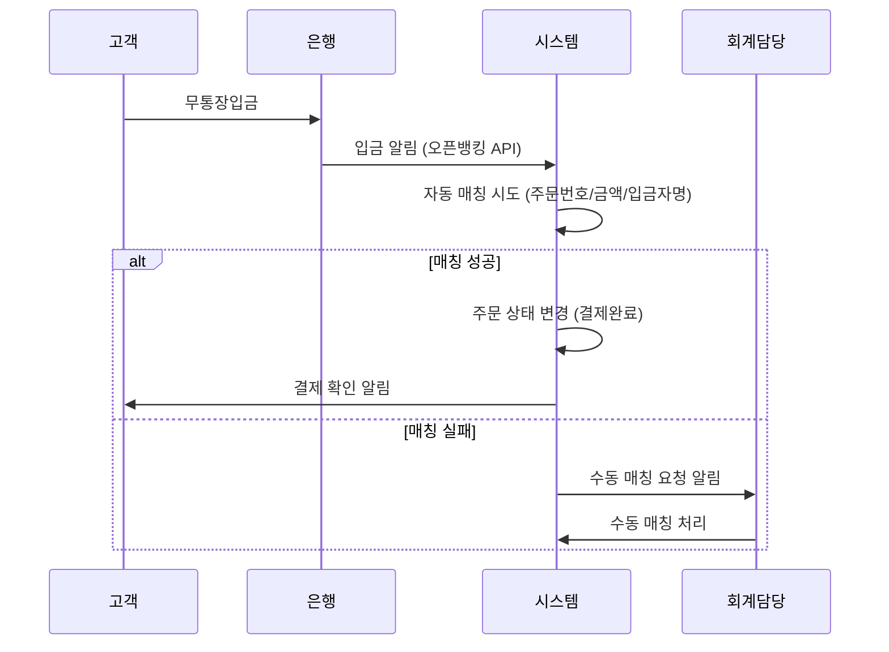
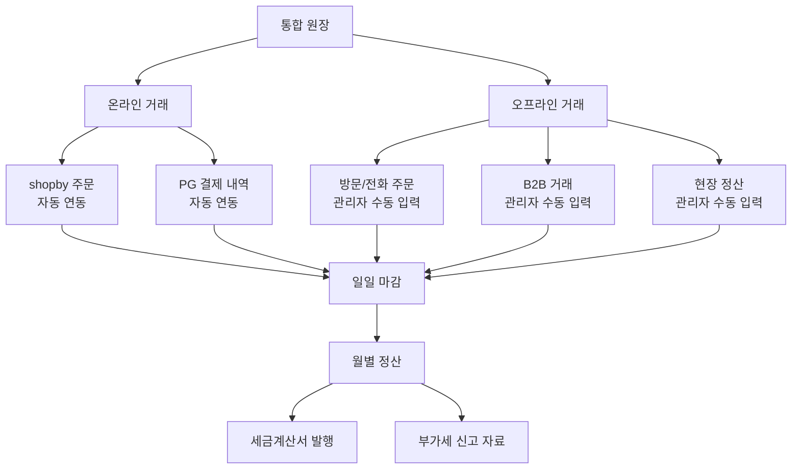
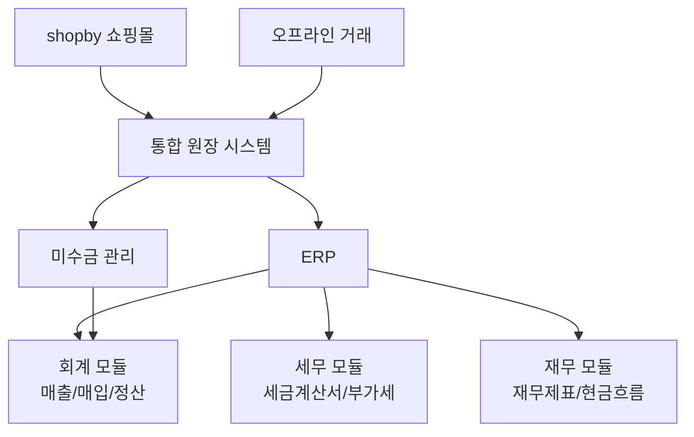
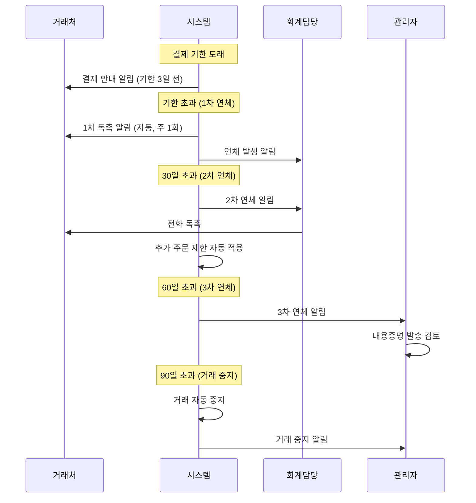
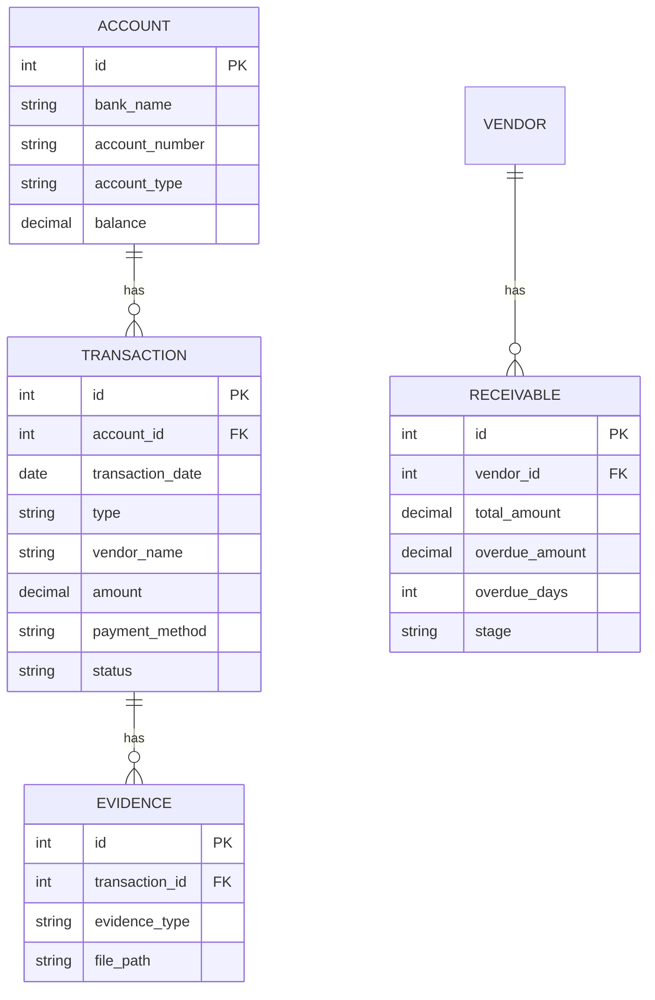

# 원장/회계 정책

## 문서 정보

| 항목 | 내용 |
|------|------|
| 문서번호 | POLICY-B3-ACCOUNTING |
| 작성일 | 2026-03-15 |
| 최종수정 | 2026-03-15 |
| 작성자 | 지니 |
| 대상독자 | 인쇄실무진 (대표, 경영지원팀, 회계담당) |
| 관련 IA | B-3 원장관리 (3개: 계좌관리, 원장관리(오프라인거래), 업체별미수금) |
| 총 결정 항목 | 12개 |
| 상태 | 작성중 |

---

## 목차

1. [정책 요약](#1-정책-요약)
2. [경쟁사 현황](#2-경쟁사-현황)
3. [계좌 관리 정책](#3-계좌-관리-정책)
4. [오프라인 거래 원장](#4-오프라인-거래-원장)
5. [미수금 관리](#5-미수금-관리)
6. [ERP 연동 검토](#6-erp-연동-검토)
7. [정책 결정 체크리스트](#7-정책-결정-체크리스트)
8. [추천 정책안](#8-추천-정책안)
9. [부록: 개발 참고사항](#부록-개발-참고사항)

---

## 1. 정책 요약

본 문서는 후니프린팅의 원장/회계 관리 정책을 정의한다. shopby에는 원장/회계 기능이 없으므로 전체 커스텀 구축이 필요한 영역이다.

**핵심 정책 방향**:
- 온라인 주문(shopby)과 오프라인 거래를 통합 관리하는 원장 체계
- 거래처별/고객별 계좌 및 미수금 추적
- 연체 단계별 자동 알림 및 거래 중지 기준
- ERP 연동을 통한 회계 업무 자동화 검토
- 인쇄업 특성(대량 주문, B2B 후불, 분할 납품)을 반영한 정산 체계

**핵심 결정사항**

| 번호 | 결정 사항 | 상태 |
|------|-----------|------|
| 1 | 법인 계좌 관리 방식 (단일/복수 계좌) | 미결정 |
| 2 | 오프라인 거래 기록 방식 (수기/반자동/자동) | 미결정 |
| 3 | 미수금 연체 기준일 (30일/60일/90일) | 미결정 |
| 4 | 연체 시 자동 거래 중지 여부 | 미결정 |
| 5 | ERP 도입 시기 및 범위 | 미결정 |
| 6 | 정산 주기 (건별/주간/월간) | 미결정 |
| 7 | 세금계산서 자동 발행 여부 | 미결정 |
| 8 | 현금영수증 자동 발행 여부 | 미결정 |
| 9 | 미수금 독촉 프로세스 단계 | 미결정 |
| 10 | 대손 처리 기준 금액 및 기간 | 미결정 |
| 11 | 원장 데이터 보관 기간 | 미결정 |
| 12 | 결제 수단별 수수료 부담 주체 | 미결정 |

---

## 2. 경쟁사 현황

### 2.1 레드프린팅

| 항목 | 내용 |
|------|------|
| 결제 체계 | 선결제 원칙 (온라인) |
| B2B | 기업몰 별도 운영 (별도 정산 추정) |
| 증빙 | 세금계산서/현금영수증 발행 |
| 특이사항 | 대규모 기업으로 자체 회계 시스템 보유 추정 |

**시사점**: 온라인 선결제 중심으로 미수금 리스크 최소화. B2B는 별도 몰로 분리하여 정산 복잡도 관리.

### 2.2 와우프레스

| 항목 | 내용 |
|------|------|
| 결제 체계 | 선결제 원칙 |
| B2B | 등급별 혜택 (배송비 무료 등), 후불 여부 미확인 |
| 증빙 | 세금계산서 발행 |
| 특이사항 | 포인트 적립 시스템으로 실질적 할인 운영 |

**시사점**: 포인트 시스템이 사실상 할인이자 미래 결제 수단. 포인트 부채 관리가 필요할 것으로 추정.

### 2.3 오프린트미

| 항목 | 내용 |
|------|------|
| 결제 체계 | 선결제 원칙 |
| B2B | 미확인 |
| 증빙 | Zendesk 통한 증빙 요청 처리 |
| 특이사항 | 1시간 이내 취소 시 전액 환불 |

**시사점**: 단순한 결제 체계로 운영. 환불 정책이 명확하여 정산 복잡도가 낮음.

### 2.4 비교 분석표

| 비교 항목 | 레드프린팅 | 와우프레스 | 오프린트미 |
|-----------|-----------|-----------|-----------|
| **B2B 후불결제** | 별도 몰 | 미확인 | 미확인 |
| **오프라인 거래** | 있음(추정) | 미확인 | 없음(추정) |
| **미수금 관리** | 자체 시스템(추정) | 미확인 | 해당없음(추정) |
| **세금계산서** | 자동 발행 | 발행 | 요청 시 |
| **ERP 연동** | 있음(추정) | 미확인 | 미확인 |

---

## 3. 계좌 관리 정책

### 3.1 법인 계좌 구성

| 정책 항목 | 선택지 | 추천 | 근거 |
|----------|--------|------|------|
| 계좌 운영 | 단일 / 복수(용도별) | 복수(용도별) | 입출금 구분 명확 |
| 용도 구분 | 매출/매입/급여/예비 | 매출+매입+급여 3개 | 기본 회계 원칙 |
| 입금 확인 | 수동 / 자동(API) | 자동(오픈뱅킹 API) | 실시간 입금 확인 |
| 잔고 알림 | 없음 / 기준액 이하 알림 | 기준액 이하 알림 | 자금 관리 |

### 3.2 계좌 관리 항목

| 항목 | 내용 |
|------|------|
| 은행명 | 주거래 은행 (기업은행/국민은행 등) |
| 계좌번호 | 매출/매입/급여 용도별 구분 |
| 예금주 | 법인명 |
| 계좌 용도 | 매출입금/매입지급/급여이체/예비자금 |
| 일일 잔고 | 자동 조회 (오픈뱅킹 API) |
| 입출금 내역 | 자동 연동 + 원장 매칭 |

### 3.3 입금 매칭 프로세스

---

## 4. 오프라인 거래 원장

### 4.1 오프라인 거래 유형

인쇄업 특성상 다양한 오프라인 거래가 발생한다:

| 거래 유형 | 설명 | 빈도 |
|-----------|------|------|
| 방문 주문 | 고객이 매장 방문하여 직접 주문 | 높음 |
| 전화 주문 | 전화로 주문 접수 (관리자 수동 등록) | 높음 |
| B2B 거래 | 거래처와의 대량/정기 주문 | 중간 |
| 현장 정산 | 납품 시 현장에서 카드/현금 결제 | 낮음 |
| 외상 거래 | 단골 고객/거래처 외상 매출 | 중간 |

### 4.2 원장 기록 방식

| 정책 항목 | 선택지 | 추천 | 근거 |
|----------|--------|------|------|
| 기록 방식 | 수기(엑셀) / 반자동(관리자입력) / 자동(POS연동) | 반자동(관리자입력) | 비용 대비 효율 |
| 온/오프라인 통합 | 분리 관리 / 통합 원장 | 통합 원장 | 전체 매출 파악 |
| 증빙 첨부 | 필수 / 선택 / 미관리 | 필수 (10만원 이상) | 세무 감사 대비 |
| 결제 수단 기록 | 카드/현금/계좌이체/외상 | 전체 구분 기록 | 정산 정확도 |

### 4.3 원장 기록 항목

| 항목 | 필수여부 | 설명 |
|------|---------|------|
| 거래일자 | 필수 | 거래 발생일 |
| 거래 유형 | 필수 | 매출/매입/환불/기타 |
| 거래처/고객명 | 필수 | 거래 상대방 |
| 품목 | 필수 | 인쇄 상품 종류 |
| 수량 | 필수 | 주문 수량 |
| 공급가액 | 필수 | 부가세 제외 금액 |
| 부가세 | 필수 | VAT |
| 합계 금액 | 필수 | 총 거래 금액 |
| 결제 수단 | 필수 | 카드/현금/계좌이체/외상 |
| 결제 상태 | 필수 | 완료/미결제/부분결제 |
| 증빙 유형 | 선택 | 세금계산서/현금영수증/카드전표 |
| 비고 | 선택 | 특이사항 메모 |

### 4.4 온라인-오프라인 통합 원장

---

## 5. 미수금 관리

### 5.1 미수금 발생 유형

| 유형 | 설명 | 대상 |
|------|------|------|
| B2B 후불 미수 | 월정산 거래처의 미결제 잔액 | 거래처 |
| 외상 미수 | 오프라인 외상 매출 미결제 | 단골고객/거래처 |
| 무통장 미입금 | 무통장 주문 후 미입금 | 온라인 고객 |
| 부분결제 잔액 | 분할 결제 중 미결제 잔액 | B2B 고객 |

### 5.2 연체 단계 및 조치

| 단계 | 기간 | 조치 | 담당 |
|------|------|------|------|
| **정상** | 결제기한 내 | - | - |
| **1차 연체** | 기한 초과 1~30일 | 알림톡/이메일 자동 발송 (주 1회) | 시스템(자동) |
| **2차 연체** | 31~60일 | 전화 독촉 + 추가 주문 제한 | 회계담당 |
| **3차 연체** | 61~90일 | 내용증명 발송 검토 + 신규 주문 거부 | 관리자 |
| **거래 중지** | 90일 초과 | 거래 중지 + 법적 조치 검토 | 대표/법무 |
| **대손 처리** | 180일 초과 | 대손 상각 처리 (회계 반영) | 회계담당 |

### 5.3 미수금 관리 정책

| 정책 항목 | 선택지 | 추천 | 근거 |
|----------|--------|------|------|
| 연체 기준일 | 결제기한 익일 / 30일 후 / 60일 후 | 결제기한 익일 | 조기 관리 |
| 자동 알림 | 없음 / 1차만 / 전 단계 | 1차+2차 자동 | 운영 효율 |
| 자동 거래 중지 | 없음 / 90일 자동 / 관리자 판단 | 90일 자동 (관리자 해제 가능) | 미수금 누적 방지 |
| 이자 부과 | 없음 / 연 이율 적용 | 없음 | 거래처 관계 유지 |
| 미수금 한도 | 없음 / 등급별 한도 설정 | 등급별 한도 | 리스크 관리 |
| 대손 처리 기준 | 180일+50만원 이하 / 1년+100만원 이하 | 180일+50만원 이하 | 세법 기준 참고 |

### 5.4 업체별 미수금 현황 관리

| 표시 항목 | 설명 |
|-----------|------|
| 거래처명 | 업체명 + 신용등급 표시 |
| 총 미수금 | 현재 미결제 총액 |
| 연체 금액 | 기한 초과 미결제 금액 |
| 연체 일수 | 최장 연체 일수 |
| 미수금 한도 | 등급별 설정 한도 |
| 한도 사용률 | 미수금/한도 비율 (%) |
| 최근 결제일 | 가장 최근 결제한 날짜 |
| 상태 | 정상/1차연체/2차연체/3차연체/거래중지 |

---

## 6. ERP 연동 검토

### 6.1 ERP 도입 필요성

| 항목 | 현재 (예상) | ERP 도입 후 |
|------|-------------|-------------|
| 매출 집계 | 수동 (엑셀) | 자동 |
| 세금계산서 | 수동 발행 | 자동 발행 |
| 미수금 관리 | 수동 추적 | 자동 알림 + 추적 |
| 재무제표 | 세무사 의존 | 실시간 조회 |
| 부가세 신고 | 수동 자료 정리 | 자동 신고 자료 생성 |

### 6.2 ERP 연동 범위

### 6.3 ERP 선택지

| ERP | 특징 | 비용 | 적합도 |
|-----|------|------|--------|
| 더존 Smart A | 국내 1위, 인쇄업 사례 풍부 | 월 5~10만원 | 높음 |
| 영림원 K시스템 | 중소기업 특화 | 월 3~8만원 | 중간 |
| 이카운트 | 클라우드 기반, 저렴 | 월 3만원~ | 중간 |
| 자체 구축 | 완전 커스텀 | 개발비 높음 | 높음(유연성) |
| 미도입 | 엑셀+수동 관리 | 0원 | 초기만 적합 |

---

## 7. 정책 결정 체크리스트

### 계좌 관리

- [ ] 법인 계좌 수 및 용도 확정
- [ ] 주거래 은행 선정
- [ ] 오픈뱅킹 API 연동 여부 확정
- [ ] 입금 자동 매칭 기준 확정

### 원장 관리

- [ ] 오프라인 거래 기록 방식 확정 (수기/반자동/자동)
- [ ] 온-오프라인 통합 원장 구조 확정
- [ ] 증빙 첨부 의무 기준 금액 확정
- [ ] 원장 데이터 보관 기간 확정
- [ ] 일일/월별 마감 프로세스 확정

### 미수금 관리

- [ ] 연체 기준일 확정
- [ ] 연체 단계별 조치 확정
- [ ] 자동 거래 중지 기준 확정 (일수/금액)
- [ ] 미수금 한도 등급별 설정 확정
- [ ] 대손 처리 기준 확정 (기간/금액)
- [ ] 미수금 독촉 알림 채널 확정

### ERP 연동

- [ ] ERP 도입 여부 확정
- [ ] ERP 선택 (더존/영림원/이카운트/자체/미도입)
- [ ] ERP 연동 범위 확정 (회계/세무/재무)
- [ ] ERP 도입 시기 확정

### 세무/증빙

- [ ] 세금계산서 자동 발행 여부 확정
- [ ] 현금영수증 자동 발행 여부 확정
- [ ] 결제 수단별 수수료 부담 주체 확정

---

## 8. 추천 정책안

### 추천안 요약

| 영역 | 추천 정책 | 우선순위 |
|------|-----------|----------|
| 계좌 관리 | 3개 용도별 계좌 + 오픈뱅킹 자동 입금확인 | 높음 |
| 원장 | 반자동 입력(관리자) + 온/오프라인 통합 | 높음 |
| 미수금 | 4단계 연체관리 + 90일 자동 거래중지 + 등급별 한도 | 높음 |
| 세무 | 세금계산서/현금영수증 반자동 발행 | 중간 |
| ERP | 1단계: 자체원장, 2단계: 이카운트/더존 연동 | 낮음(장기) |

### 추천안 상세

#### 8.1 미수금 관리 프로세스

#### 8.2 등급별 미수금 한도 권장

| 신용등급 | 미수금 한도 | 결제 유예 기간 |
|---------|-------------|----------------|
| S등급 | 2,000만원 | 60일 |
| A등급 | 1,000만원 | 30일 |
| B등급 | 300만원 | 15일 |
| C등급 | 0원 (선결제만) | 없음 |

#### 8.3 단계별 도입 제안

| 단계 | 항목 | 시기 |
|------|------|------|
| 1단계 | 기본 원장 시스템 (수동 입력 + 조회) | 오픈 전 필수 |
| 2단계 | shopby 매출 자동 연동 + 미수금 관리 | 오픈 시 |
| 3단계 | 오픈뱅킹 입금 자동 매칭 + 연체 자동 알림 | 오픈 후 3개월 |
| 4단계 | ERP 연동 (세금계산서 자동발행 포함) | 오픈 후 6개월~ |

---

## [부록] 개발 참고사항

### shopby 기능 매핑

| IA 항목 | shopby 분류 | 구현 방식 |
|---------|------------|-----------|
| 계좌관리 | CUSTOM | shopby에 해당 기능 없음, 별도 구축 필요 |
| 원장관리(오프라인거래) | CUSTOM | shopby에 해당 기능 없음, 별도 구축 필요 |
| 업체별미수금 | CUSTOM | shopby에 해당 기능 없음, 별도 구축 필요 |

### 기술 구현 가이드

#### 계좌관리 (CUSTOM)

- 별도 관리자 페이지 구축
- 기능 요구사항:
  - 법인 계좌 등록/수정/삭제
  - 계좌별 잔고 조회 (오픈뱅킹 API 연동)
  - 입출금 내역 조회 (실시간/일괄)
  - 입금 내역-주문 자동 매칭 엔진
  - 매칭 실패 건 수동 매칭 UI
- 오픈뱅킹 API 연동:
  - 금융결제원 오픈뱅킹 API 활용
  - 잔고 조회, 입출금 내역 조회, 출금 이체
  - 사전 등록: 이용기관 등록 + 계좌 인증

#### 원장관리 (CUSTOM)

- 별도 관리자 페이지 구축
- DB 설계:
  - 원장 테이블: 거래일자, 유형, 거래처, 품목, 금액, 결제수단, 상태
  - 증빙 테이블: 원장ID, 증빙유형, 파일경로
  - 정산 테이블: 월별 집계, 거래처별 집계
- 연동:
  - shopby 주문 API → 온라인 매출 자동 연동
  - 오프라인 거래 → 관리자 수동 입력 UI
  - 계좌 입금 → 자동 매칭 후 원장 반영
- 리포트:
  - 일일/주간/월간 매출 집계
  - 거래처별/상품별 매출 분석
  - 현금흐름표 자동 생성

#### 업체별미수금 (CUSTOM)

- 별도 관리자 페이지 구축
- 기능 요구사항:
  - 거래처별 미수금 현황 대시보드
  - 연체 단계 자동 판별 + 시각적 표시 (색상 구분)
  - 자동 알림 발송 (알림톡/이메일, 스케줄러)
  - 거래 중지 자동 적용/해제
  - 미수금 한도 설정 (거래처 신용등급 연동)
  - 대손 처리 기능
  - 미수금 이력 조회 (결제 독촉 이력 포함)
- 연동:
  - 거래처관리 (POLICY-B2-VENDOR) 신용등급 연동
  - 원장관리와 실시간 동기화
  - 카카오 알림톡 API (독촉 알림)

### 데이터 모델 (ERD 개요)

### 관련 API

| API | 용도 | 비고 |
|-----|------|------|
| 금융결제원 오픈뱅킹 API | 계좌 조회/입출금 | EXTERNAL (인증 필요) |
| shopby 주문 API | 온라인 매출 자동 연동 | NATIVE |
| 카카오 알림톡 API | 미수금 독촉 알림 | EXTERNAL |
| 국세청 홈택스 API | 세금계산서 자동 발행 | EXTERNAL (연동 검토) |
| 더존/이카운트 API | ERP 연동 (2단계) | EXTERNAL (선택) |
