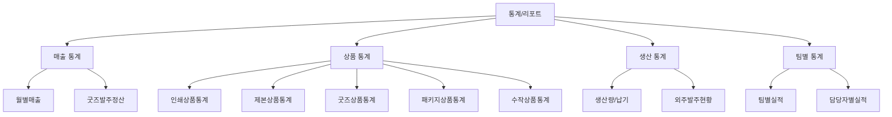
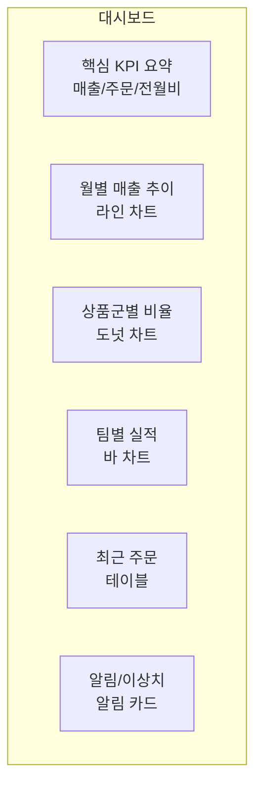
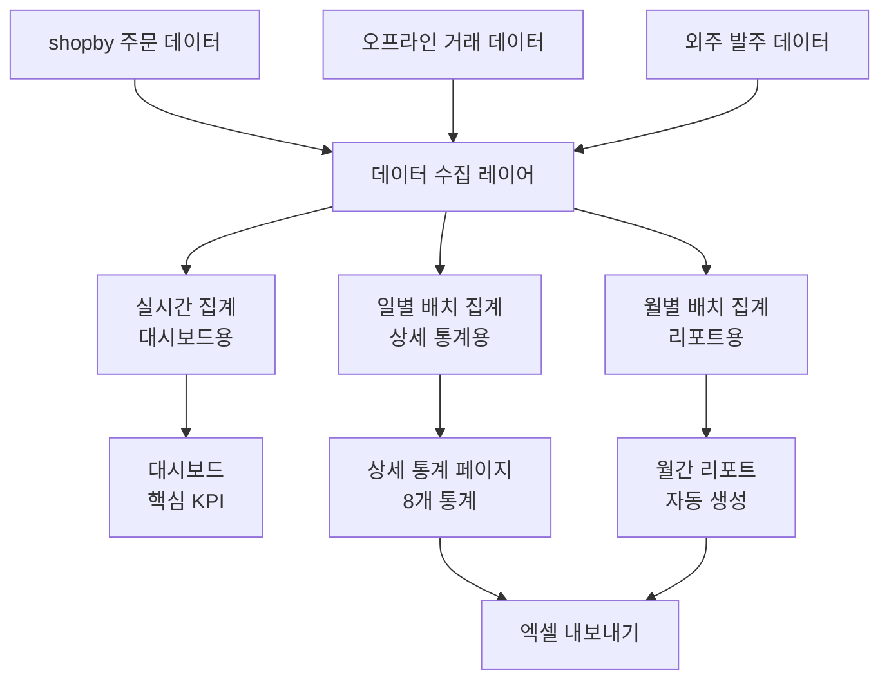
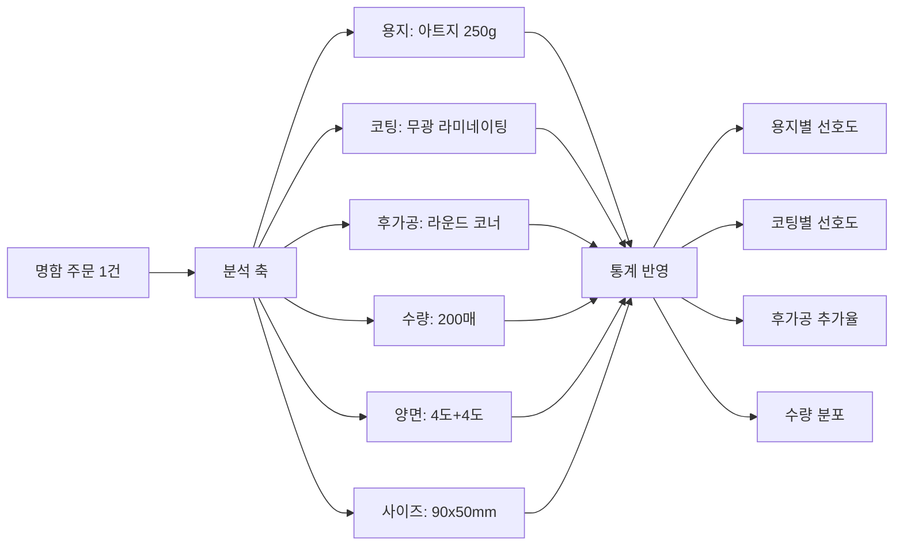
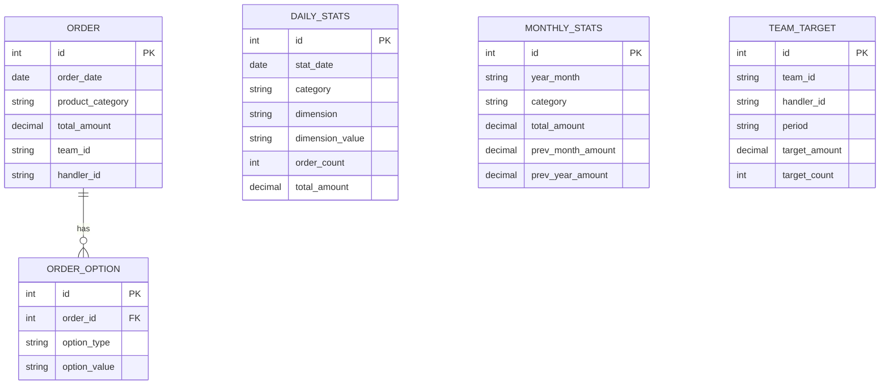

# 통계/리포트 정책

## 문서 정보

| 항목 | 내용 |
|------|------|
| 문서번호 | POLICY-B7-STATISTICS |
| 작성일 | 2026-03-15 |
| 최종수정 | 2026-03-15 |
| 작성자 | 지니 |
| 대상독자 | 인쇄실무진 (대표, 경영지원, 영업팀장, 생산관리) |
| 관련 IA | B-7 통계 (8개: 인쇄상품통계, 제본상품통계, 굿즈상품통계, 패키지상품통계, 수작상품통계, 월별매출, 굿즈발주정산, 팀별통계) |
| 총 결정 항목 | 11개 |
| 상태 | 작성중 |

---

## 목차

1. [정책 요약](#1-정책-요약)
2. [경쟁사 통계 체계](#2-경쟁사-통계-체계)
3. [통계 유형 정의](#3-통계-유형-정의)
4. [리포트 항목 정의](#4-리포트-항목-정의)
5. [엑셀 내보내기](#5-엑셀-내보내기)
6. [대시보드 구성](#6-대시보드-구성)
7. [정책 결정 체크리스트](#7-정책-결정-체크리스트)
8. [추천 정책안](#8-추천-정책안)
9. [공정별 현황 대시보드](#9-공정별-현황-대시보드)
10. [17개 제작Case 참조](#10-17개-제작case-참조)
11. [부록: 개발 참고사항](#부록-개발-참고사항)

---

## 1. 정책 요약

본 문서는 후니프린팅의 통계/리포트 시스템에 대한 운영 정책을 정의한다. 인쇄 상품의 특성(옵션 기반 가격, 생산 공정, 거래처 발주)을 반영한 8개 통계 항목을 다룬다.

**핵심 정책 방향**:
- 상품군별(인쇄/제본/굿즈/패키지/수작) 특화 통계 제공
- 인쇄 옵션(용지/코팅/후가공/수량) 기반 세분화 분석
- 월별 매출 추이 및 전년 대비 성장 분석
- 굿즈 발주 정산 통계로 외주 비용 관리
- 팀별/담당자별 실적 통계로 조직 성과 관리
- 대시보드를 통한 핵심 지표 실시간 모니터링

**핵심 결정사항**

| 번호 | 결정 사항 | 상태 |
|------|-----------|------|
| 1 | 통계 조회 기간 범위 (일/주/월/분기/연) | 미결정 |
| 2 | 통계 데이터 갱신 주기 (실시간/시간별/일별) | 미결정 |
| 3 | 팀별 통계 열람 권한 (본인팀만/전체) | 미결정 |
| 4 | 엑셀 내보내기 필드 범위 | 미결정 |
| 5 | 대시보드 구성 항목 (위젯 선택) | 미결정 |
| 6 | 통계 기준 금액 (공급가/판매가/정산가) | 미결정 |
| 7 | 상품 분류 기준 (카테고리1차/2차) | 미결정 |
| 8 | 주문 상태별 통계 포함 기준 (결제완료 이후만 등) | 미결정 |
| 9 | 비교 기간 설정 (전월/전년동기/직접선택) | 미결정 |
| 10 | 통계 알림 설정 (목표달성/이상치 감지) | 미결정 |
| 11 | 데이터 보관 기간 (원본/집계) | 미결정 |

---

## 2. 경쟁사 통계 체계

### 2.1 레드프린팅

| 항목 | 내용 |
|------|------|
| 통계 범위 | 대규모 조직 → 부서별 성과 통계 추정 |
| 매출 분석 | 상품군별 매출, 고객별 매출 |
| 생산 통계 | 자체 생산 비율 높아 생산량/가동률 통계 추정 |
| 특이사항 | i.TOKEN 적립 데이터 기반 고객 행동 분석 추정 |

**시사점**: 대규모 자체 생산 설비를 보유하여 생산 효율 통계가 핵심. 고객 적립 데이터로 재구매 패턴 분석 가능.

### 2.2 와우프레스

| 항목 | 내용 |
|------|------|
| 통계 범위 | 회원등급(6단계) 기반 고객 분석 |
| 매출 분석 | 등급별 매출, 3개월 접수액 기준 |
| 생산 통계 | 합판/독판 분류 통계 (납기 관리용) |
| 특이사항 | 독판 납기 100% 보상 → 납기 통계 매우 중요 |

**시사점**: 회원등급 기반 매출 분석이 핵심. 납기 보상 정책으로 인해 생산 납기 통계 관리가 중요.

### 2.3 오프린트미

| 항목 | 내용 |
|------|------|
| 통계 범위 | 모바일 앱 중심 사용 통계 |
| 매출 분석 | 상품별 매출, 디자인 서비스 매출 |
| 특이사항 | 앱 사용 데이터 기반 UX 분석 |

**시사점**: 디자인 서비스 매출이 별도로 존재. 앱 기반으로 사용자 행동 데이터 풍부.

### 2.4 비교 분석표

| 비교 항목 | 레드프린팅 | 와우프레스 | 오프린트미 |
|-----------|-----------|-----------|-----------|
| **상품별 매출통계** | O | O | O |
| **고객등급별 분석** | 미확인 | O (6단계) | 미확인 |
| **생산 통계** | O (자체생산) | O (합판/독판) | 미확인 |
| **납기 통계** | 미확인 | O (보상 연동) | 미확인 |
| **팀별 통계** | O (추정) | 미확인 | 미확인 |
| **엑셀 내보내기** | 미확인 | 미확인 | 미확인 |
| **대시보드** | 자체 시스템(추정) | 미확인 | 앱 기반(추정) |

---

## 3. 통계 유형 정의

### 3.1 통계 분류 체계

### 3.2 통계 8개 항목 정의

| 번호 | 통계 항목 | 설명 | 주요 지표 |
|------|-----------|------|-----------|
| 1 | 인쇄상품통계 | 명함/전단/포스터/스티커 등 인쇄 상품 매출/주문 | 주문건수, 매출액, 옵션별 분포 |
| 2 | 제본상품통계 | 카탈로그/브로슈어/책자 등 제본 상품 | 주문건수, 매출액, 제본방식별 분포 |
| 3 | 굿즈상품통계 | 머그컵/텀블러/에코백 등 판촉물 | 주문건수, 매출액, 인쇄방식별 분포 |
| 4 | 패키지상품통계 | 박스/봉투/패키지 등 포장 상품 | 주문건수, 매출액, 톰슨/형태별 분포 |
| 5 | 수작상품통계 | 수작업 상품 (엠보싱/형압 등 수공정) | 주문건수, 매출액, 공정별 분포 |
| 6 | 월별매출 | 전체 월별 매출 추이 및 분석 | 총매출, 전월비, 전년동기비, 상품군비율 |
| 7 | 굿즈발주정산 | 굿즈 외주 발주 및 정산 현황 | 발주금액, 정산금액, 마진율, 거래처별 |
| 8 | 팀별통계 | 팀/담당자별 실적 통계 | 매출액, 주문건수, 목표달성률 |

---

## 4. 리포트 항목 정의

### 4.1 인쇄상품통계

인쇄 옵션 기반으로 세분화된 통계를 제공한다.

| 분석 축 | 항목 | 설명 |
|---------|------|------|
| 상품별 | 명함/전단/리플렛/포스터/스티커/현수막 | 상품 종류별 매출/주문건수 |
| 용지별 | 아트지/스노우지/모조지/특수지 | 용지 선택 분포 |
| 코팅별 | 무광/유광/벨벳/엠보 | 코팅 선택 분포 |
| 후가공별 | 박/형압/톰슨/오시 | 후가공 추가율 |
| 수량별 | 100매/200매/500매/1000매+ | 주문 수량 분포 |
| 인쇄도수별 | 단도/양면/4도+4도 | 인쇄 도수 분포 |
| 사이즈별 | A4/A3/A2/명함/맞춤 | 사이즈 분포 |

### 4.2 제본상품통계

| 분석 축 | 항목 | 설명 |
|---------|------|------|
| 제본방식별 | 중철/무선/사철/스프링/양장 | 제본 방식 분포 |
| 페이지수별 | 4~16p/20~48p/52~100p/100p+ | 페이지 수 분포 |
| 표지용지별 | 아트지/레자크/특수지 | 표지 용지 분포 |
| 합판/독판별 | 합판/독판 | 인쇄 방식별 매출/마진 |
| 부수별 | 50부 이하/100부/500부/1000부+ | 주문 부수 분포 |

### 4.3 굿즈상품통계

| 분석 축 | 항목 | 설명 |
|---------|------|------|
| 상품유형별 | 머그컵/텀블러/에코백/볼펜/노트 등 | 굿즈 종류별 매출 |
| 인쇄방식별 | 실크/UV/전사/각인/디지털 | 인쇄 방식 분포 |
| 용도별 | 기업판촉/행사/기념품/개인 | 주문 용도 분포 |
| MOQ별 | 최소수량/중량/대량 | 주문 규모 분포 |

### 4.4 패키지상품통계

| 분석 축 | 항목 | 설명 |
|---------|------|------|
| 형태별 | 박스/봉투/쇼핑백/포장지 | 패키지 종류별 매출 |
| 재질별 | 골판지/백판지/크라프트/특수 | 재질 분포 |
| 톰슨별 | 기존톰슨/신규톰슨 | 칼형 제작 비율 |
| 후가공별 | 박/엠보/코팅/합지 | 후가공 추가율 |

### 4.5 수작상품통계

| 분석 축 | 항목 | 설명 |
|---------|------|------|
| 공정별 | 엠보싱/형압/수제본/특수접지/손칼 | 수작업 공정 분포 |
| 소요시간별 | 1시간 이내/반일/1일/2일+ | 작업 시간 분포 |
| 단가별 | 1만원 이하/1~5만원/5만원+ | 건당 단가 분포 |

### 4.6 월별매출

| 항목 | 설명 |
|------|------|
| 월 총매출 | 해당 월 전체 매출 합계 |
| 전월 대비 | 전월 대비 증감률 (%) |
| 전년동기 대비 | 전년 같은 달 대비 증감률 (%) |
| 상품군별 비율 | 인쇄/제본/굿즈/패키지/수작 비율 |
| 온라인/오프라인 비율 | 채널별 매출 비율 |
| 결제수단별 | 카드/계좌이체/무통장/프린팅머니 |
| 주문건수 | 총 주문 건수 및 평균 주문액 |
| 신규/재구매 비율 | 신규 고객 vs 재구매 고객 |

### 4.7 굿즈발주정산

| 항목 | 설명 |
|------|------|
| 거래처별 발주액 | 외주 거래처별 발주 금액 |
| 거래처별 정산액 | 실제 정산(지급) 금액 |
| 마진율 | (판매가 - 발주가) / 판매가 |
| 미정산액 | 발주 후 미지급 금액 |
| 발주 건수 | 거래처별 발주 건수 |
| 품질 이슈 | 불량/반품/재작업 건수 |
| 납기 준수율 | 약정 납기 대비 실제 납품 비율 |

### 4.8 팀별통계

| 항목 | 설명 |
|------|------|
| 팀별 매출 | 영업팀/CS팀 등 팀별 매출 합계 |
| 담당자별 매출 | 개인별 처리 주문 매출 |
| 목표달성률 | 월/분기 목표 대비 실적 비율 |
| 주문처리 건수 | 담당자별 처리 건수 |
| 평균 처리 시간 | 주문 접수~완료 평균 소요 시간 |
| CS 처리 건수 | 담당자별 CS 응대 건수 |
| 고객 만족도 | 담당자별 고객 평가 평균 (선택) |

---

## 5. 엑셀 내보내기

### 5.1 내보내기 정책

| 정책 항목 | 선택지 | 추천 | 근거 |
|----------|--------|------|------|
| 파일 형식 | xlsx / csv / 둘 다 | xlsx | 서식 유지, 피벗 활용 |
| 최대 행 수 | 5만행 / 10만행 / 무제한 | 10만행 | 성능 + 활용성 |
| 다운로드 권한 | 전체 / 관리자 이상 / 뷰어 이상 | 관리자 이상 | 데이터 보안 |
| 다운로드 로그 | 기록 / 미기록 | 기록 | 감사 추적 |
| 필드 선택 | 전체 고정 / 사용자 선택 | 사용자 선택 | 유연성 |
| 기간 제한 | 1년 / 2년 / 전체 | 2년 | 성능 + 세무 |

### 5.2 통계별 내보내기 항목

| 통계 | 기본 내보내기 항목 |
|------|-------------------|
| 인쇄상품 | 주문일, 상품명, 용지, 코팅, 후가공, 수량, 단가, 합계 |
| 제본상품 | 주문일, 상품명, 제본방식, 페이지수, 부수, 단가, 합계 |
| 굿즈상품 | 주문일, 상품명, 인쇄방식, 수량, 발주가, 판매가, 마진 |
| 패키지상품 | 주문일, 상품명, 형태, 재질, 톰슨, 수량, 합계 |
| 수작상품 | 주문일, 상품명, 공정, 소요시간, 수량, 합계 |
| 월별매출 | 월, 총매출, 전월비, 전년비, 상품군별, 채널별 |
| 굿즈발주정산 | 거래처, 발주일, 상품, 발주가, 정산가, 마진, 상태 |
| 팀별통계 | 팀, 담당자, 매출, 건수, 목표, 달성률 |

---

## 6. 대시보드 구성

### 6.1 대시보드 레이아웃

### 6.2 위젯 구성

| 위젯 | 표시 내용 | 차트 유형 | 갱신 주기 |
|------|-----------|-----------|-----------|
| 핵심 KPI | 금일매출, 금월매출, 전월대비, 주문건수 | 숫자 카드 | 실시간 |
| 매출 추이 | 최근 12개월 매출 + 전년 비교 | 라인 차트 | 일별 |
| 상품군 비율 | 인쇄/제본/굿즈/패키지/수작 매출 비율 | 도넛 차트 | 일별 |
| 팀별 실적 | 팀별 월 매출 + 목표 달성률 | 수평 바 차트 | 일별 |
| 최근 주문 | 최근 10건 주문 (상태 포함) | 테이블 | 실시간 |
| 인기 상품 TOP 10 | 주문건수 기준 상위 10개 상품 | 수평 바 차트 | 일별 |
| 외주 현황 | 굿즈 발주 현황 + 미정산 알림 | 요약 카드 | 일별 |
| 알림 | 목표 달성, 이상치 감지, 미수금 알림 | 알림 리스트 | 실시간 |

### 6.3 대시보드 접근 권한

| 역할 | 볼 수 있는 대시보드 |
|------|---------------------|
| 슈퍼관리자 | 전체 대시보드 |
| 관리자 | 담당 영역 대시보드 + 전체 매출 |
| 운영자 | 본인 팀 실적 + 주문 현황 |
| 뷰어 | 전체 대시보드 (조회만) |

---

## 7. 정책 결정 체크리스트

### 통계 기본 설정

- [ ] 통계 조회 기간 범위 확정 (일/주/월/분기/연)
- [ ] 데이터 갱신 주기 확정 (실시간/시간별/일별)
- [ ] 통계 기준 금액 확정 (공급가/판매가/정산가)
- [ ] 주문 상태별 포함 기준 확정 (결제완료 이후만 등)
- [ ] 비교 기간 설정 확정 (전월/전년동기/직접선택)

### 상품 통계

- [ ] 상품 분류 기준 확정 (1차 카테고리/2차 카테고리)
- [ ] 인쇄 옵션별 분석 축 확정 (용지/코팅/후가공/수량)
- [ ] 상품군별 핵심 지표 확정

### 팀별 통계

- [ ] 팀별 통계 열람 권한 확정 (본인팀만/전체)
- [ ] 목표 설정 주기 확정 (월/분기)
- [ ] 목표 설정 기준 확정 (매출/건수/혼합)
- [ ] 담당자별 실적 공개 범위 확정

### 대시보드

- [ ] 대시보드 위젯 구성 확정
- [ ] 위젯별 갱신 주기 확정
- [ ] 역할별 대시보드 접근 범위 확정
- [ ] 알림 기준 확정 (목표달성률/이상치 감지 기준)

### 내보내기

- [ ] 엑셀 내보내기 파일 형식 확정
- [ ] 최대 행 수 제한 확정
- [ ] 다운로드 권한 확정
- [ ] 통계별 내보내기 필드 확정

### 데이터 관리

- [ ] 통계 원본 데이터 보관 기간 확정
- [ ] 집계 데이터 보관 기간 확정
- [ ] 데이터 백업 주기 확정

---

## 8. 추천 정책안

### 추천안 요약

| 영역 | 추천 정책 | 우선순위 |
|------|-----------|----------|
| 데이터 갱신 | 대시보드 실시간, 상세통계 일별 집계 | 높음 |
| 기준 금액 | 공급가(VAT 제외) 기준 | 높음 |
| 조회 기간 | 일/주/월/분기/연 + 직접선택 | 중간 |
| 팀별 권한 | 관리자: 전체, 운영자: 본인팀만 | 중간 |
| 내보내기 | xlsx + 사용자 필드 선택 + 관리자 이상 | 중간 |
| 대시보드 | 핵심KPI + 매출추이 + 상품군비율 + 팀실적 | 높음 |

### 추천안 상세

#### 8.1 통계 데이터 흐름

#### 8.2 인쇄 옵션 기반 분석 예시

#### 8.3 팀별 목표 관리

| 항목 | 추천 기준 |
|------|-----------|
| 목표 설정 주기 | 월별 (분기 리뷰) |
| 목표 기준 | 매출액 (주 지표) + 주문건수 (보조 지표) |
| 달성률 표시 | 실시간 업데이트, 색상 구분 (100%+:초록, 80~99%:노랑, 80%미만:빨강) |
| 인센티브 연동 | 분기 달성률 기반 (검토) |

#### 8.4 단계별 도입 제안

| 단계 | 항목 | 시기 |
|------|------|------|
| 1단계 | 월별매출 + 핵심 대시보드 (KPI 카드 + 매출추이) | 오픈 시 |
| 2단계 | 상품군별 5개 통계 (인쇄/제본/굿즈/패키지/수작) | 오픈 후 1개월 |
| 3단계 | 팀별통계 + 굿즈발주정산 + 엑셀 내보내기 | 오픈 후 2개월 |
| 4단계 | 인쇄옵션 기반 심화 분석 + 알림 시스템 | 오픈 후 3개월 |
| 5단계 | 예측 분석 (트렌드 기반 수요 예측, AI) | 오픈 후 6개월~ |

---

## 9. 공정별 현황 대시보드

production-flow.md 기반의 공정 현황 대시보드 정책을 정의한다.

### 9.1 내부팀 현황 (7개 팀)

| 팀 | 담당 공정 | 대시보드 표시 항목 |
|-----|-----------|-------------------|
| 디지털출력팀 | 낱장 출력, 디지털 인쇄 | 대기/완료/주의/불량 |
| 오프셋인쇄팀 | 오프셋 인쇄 | 대기/완료/주의/불량 |
| 후가공팀 | 코팅, 박, 형압, 도무송 | 대기/완료/주의/불량 |
| 제본팀 | 중철, 무선, 사철, 양장 | 대기/완료/주의/불량 |
| 커팅팀 | 재단, 커팅, 톰슨 | 대기/완료/주의/불량 |
| 포장팀 | 포장, 검수, 출고 준비 | 대기/완료/주의/불량 |
| 품질관리팀 | 품질 검수, 불량 판정 | 대기/완료/주의/불량 |

### 9.2 외주공정 현황 (8개 공정)

| 외주 공정 | 설명 | 대시보드 표시 항목 |
|-----------|------|-------------------|
| 스티커 외주 | 스티커 전문 외주 | 대기/완료/주의/불량 |
| UV 인쇄 외주 | UV 인쇄 전문 | 대기/완료/주의/불량 |
| 아크릴 가공 외주 | 아크릴 레이저 커팅 | 대기/완료/주의/불량 |
| 전사 인쇄 외주 | 전사/승화 인쇄 | 대기/완료/주의/불량 |
| 도장/각인 외주 | 도장, 레이저 각인 | 대기/완료/주의/불량 |
| 봉제 외주 | 에코백, 파우치 등 | 대기/완료/주의/불량 |
| 커버 가공 외주 | 양장 커버 | 대기/완료/주의/불량 |
| 기타 외주 | 특수 공정 | 대기/완료/주의/불량 |

### 9.3 KPI 지표 (공정 대시보드)

| KPI | 설명 | 목표 |
|-----|------|------|
| **대기** | 해당 공정 착수 전 대기 건수 | 최소화 (적체 방지) |
| **완료** | 금일 공정 완료 건수 | 목표 대비 달성률 |
| **주의** | 납기 임박 또는 지연 위험 건수 | 0건 목표 |
| **불량** | 공정 중 불량 발생 건수 | 불량률 1% 이하 |

### 9.4 공정 상태 트래킹 포인트

생산 공정에서 상태를 기록하는 주요 트래킹 포인트:

| 트래킹 포인트 | 설명 | 기록 주체 |
|--------------|------|-----------|
| 출력완료 | 디지털/오프셋 출력 완료 시점 | 출력팀 |
| 커팅완료 | 재단/커팅 완료 시점 | 커팅팀 |
| 제본시작 | 제본 공정 착수 시점 | 제본팀 |
| 봉제시작 | 봉제 공정 착수 시점 | 봉제 외주 |
| 가공시작 | 후가공 착수 시점 | 후가공팀 |
| 제작완료 | 전체 제작 완료 시점 | 품질관리팀 |
| 송장출력 | 택배 송장 출력 시점 | 포장/출고팀 |

### 9.5 산출 데이터

#### 1차 데이터 (일별 집계)

| 데이터 항목 | 설명 | 갱신 주기 |
|------------|------|-----------|
| 일별 출력량 | 금일 출력 완료 건수/매수 | 실시간 |
| 출고건 | 금일 출고 완료 건수 | 실시간 |
| 입고건 | 금일 외주 입고 건수 | 실시간 |

#### 2차 데이터 (분석 집계)

| 데이터 항목 | 설명 | 갱신 주기 |
|------------|------|-----------|
| 입고예정 | 향후 7일간 외주 입고 예정 건수 | 일별 |
| 평균 리드타임 | 주문접수~출고완료 평균 소요 기간 | 주별 |
| 평균 제작기간 | 제작착수~제작완료 평균 소요 기간 | 주별 |

---

## 10. 17개 제작Case 참조

production-flow.md에 정의된 17개 제작Case의 공정 흐름은 통계 분석의 기준이 된다.

| 번호 | 제작Case | 주요 공정 흐름 |
|------|----------|---------------|
| 1 | 낱장 | 출력 → 재단 → 포장 |
| 2 | 스티커 | 출력 → 커팅 → 포장 |
| 3 | 인쇄후가공 | 출력 → 코팅/박/형압 → 재단 → 포장 |
| 4 | 책자 | 출력 → 접지 → 제본 → 재단 → 포장 |
| 5 | 실사 | 대형출력 → 재단 → 포장 |
| 6 | 커버 | 출력 → 코팅 → 톰슨 → 조립 → 포장 |
| 7 | 커팅 | 출력 → 커팅(플로터) → 포장 |
| 8 | 봉제 | 전사인쇄 → 봉제 → 포장 |
| 9 | UV | 소재준비 → UV인쇄 → 포장 |
| 10 | 아크릴 | 디자인 → 레이저커팅 → UV인쇄 → 포장 |
| 11 | 전사 | 디자인 → 전사인쇄 → 포장 |
| 12 | 도장 | 디자인 → 각인/제작 → 포장 |
| 13 | 외주 | 발주 → 외주제작 → 입고 → 검수 → 포장 |
| 14 | 재고 | 재고확인 → 피킹 → 포장 |
| 15 | 외주제작 | 발주 → 외주제작 → 입고 → 검수 → 포장 |
| 16 | 인쇄+봉제 | 출력 → 재단 → 봉제 → 포장 |
| 17 | 인쇄+UV | 출력 → 재단 → UV인쇄 → 포장 |

> 각 제작Case의 상세 공정 흐름 및 소요시간은 POLICY-FILE-PROCESSING.md 참조

---

## [부록] 개발 참고사항

### shopby 기능 매핑

| IA 항목 | shopby 분류 | 구현 방식 |
|---------|------------|-----------|
| 인쇄상품통계 | CUSTOM | shopby 주문 데이터 기반 별도 통계 구축 (인쇄 옵션 분석) |
| 제본상품통계 | CUSTOM | shopby 주문 데이터 기반 별도 통계 구축 (제본 옵션 분석) |
| 굿즈상품통계 | SKIN | shopby 기본 상품통계 활용 + 스킨 커스텀 (인쇄방식 분석 추가) |
| 패키지상품통계 | CUSTOM | shopby 주문 데이터 기반 별도 통계 구축 (톰슨/형태 분석) |
| 수작상품통계 | SKIN | shopby 기본 상품통계 활용 + 스킨 커스텀 (공정/시간 분석 추가) |
| 월별매출 | NATIVE | shopby 기본 매출통계 기능 활용 |
| 굿즈발주정산 | SKIN | shopby 기본 정산 기능 활용 + 스킨 커스텀 (거래처별 마진 분석) |
| 팀별통계 | CUSTOM | shopby에 해당 기능 없음, 별도 구축 필요 |

### 기술 구현 가이드

#### 월별매출 (NATIVE)

- shopby 관리자 > 통계 > 매출통계 기본 기능 활용
- 기본 제공: 일별/주별/월별 매출, 주문건수, 결제수단별
- 추가 커스텀 불요 (기본 기능으로 충분)

#### 굿즈상품통계 / 수작상품통계 (SKIN)

- shopby 기본 상품통계 화면을 스킨으로 확장
- 추가 분석 축: 인쇄방식, 공정, 소요시간
- shopby 주문 옵션 데이터에서 추출
- 차트 라이브러리: Chart.js 또는 ApexCharts

#### 굿즈발주정산 (SKIN)

- shopby 기본 정산 기능 위에 스킨 커스텀
- 추가: 거래처별 발주/정산 매칭, 마진율 계산
- 외주 발주 데이터는 거래처관리(B-2)와 연동

#### 인쇄/제본/패키지 상품통계 (CUSTOM)

- 별도 통계 페이지 구축 필요
- 이유: 인쇄 옵션(용지/코팅/후가공/도수/사이즈)별 세분화 분석은 shopby 기본 통계로 불가
- 데이터 소스: shopby 주문 API + 주문옵션 데이터
- 집계 방식:
  - 실시간: Redis 기반 카운터 (대시보드용)
  - 일별: 배치 작업으로 집계 테이블 생성
  - 월별: 일별 집계 기반 월별 리포트 생성
- 차트: Chart.js / ApexCharts
- 테이블: AG Grid 또는 커스텀 테이블 (정렬/필터/페이징)

#### 팀별통계 (CUSTOM)

- 완전 별도 구축 필요
- shopby에 팀/담당자 개념이 없으므로 별도 매핑 필요
- 데이터 모델:
  - 팀 테이블: 팀ID, 팀명, 팀장
  - 담당자 테이블: 담당자ID, 이름, 팀ID, 역할
  - 주문-담당자 매핑: 주문ID, 담당자ID, 처리일시
  - 목표 테이블: 팀ID/담당자ID, 기간, 목표매출, 목표건수
- 기능:
  - 팀별/담당자별 매출 집계
  - 목표 설정 및 달성률 계산
  - 기간별 비교 (전월/전년동기)

#### 대시보드 구현

- 프레임워크: React (shopby 스킨 기반)
- 차트 라이브러리: ApexCharts (반응형, 인터랙티브)
- 실시간 데이터: WebSocket 또는 폴링 (30초 간격)
- 레이아웃: CSS Grid 기반 위젯 배치
- 반응형: 데스크톱 4열 / 태블릿 2열 / 모바일 1열

#### 엑셀 내보내기

- 라이브러리: SheetJS (xlsx)
- 서버 사이드 생성 (대용량 대응)
- 비동기 처리: 10만행 이상 시 백그라운드 생성 + 다운로드 링크 알림
- 다운로드 로그 기록 (감사 로그 연동)

### 데이터 모델 (통계 집계 테이블)

### 관련 API

| API | 용도 | 비고 |
|-----|------|------|
| shopby 주문 API | 주문 데이터 조회 | NATIVE |
| shopby 매출통계 API | 기본 매출통계 | NATIVE |
| shopby 상품통계 API | 기본 상품통계 | NATIVE (확장 필요) |
| Chart.js / ApexCharts | 차트 렌더링 | 프론트엔드 라이브러리 |
| SheetJS | 엑셀 생성 | 프론트엔드/백엔드 라이브러리 |
