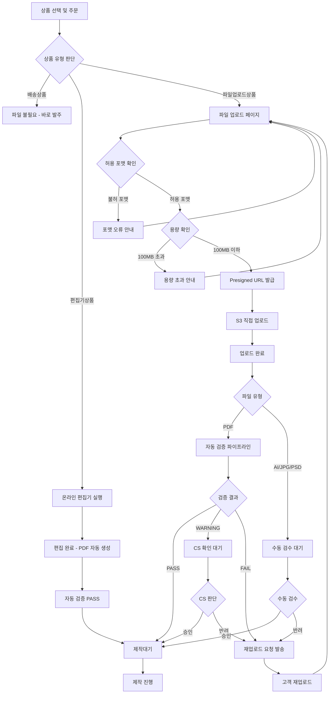
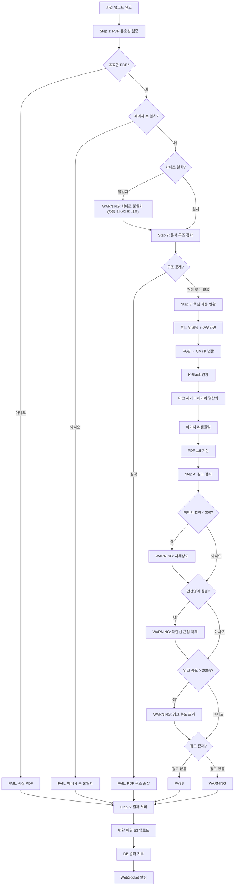
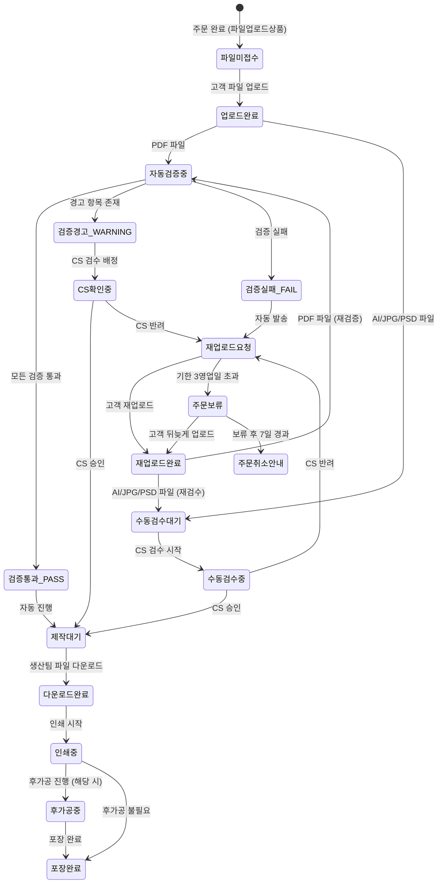

# 파일 업로드 및 처리 정책

**문서번호**: POLICY-FILE-PROCESSING
**작성일**: 2026-03-15
**대상 독자**: 인쇄실무진 (CS, 발주, 생산, 운영)
**관련 IA**: A-6 파일/편집정보입력, B-8 파일확인처리/재업로드요청

---

## 목차

1. [정책 요약](#1-정책-요약)
2. [경쟁사 파일 처리 현황](#2-경쟁사-파일-처리-현황)
3. [파일 접수 규격 정책](#3-파일-접수-규격-정책)
4. [파일 업로드 프로세스 정책](#4-파일-업로드-프로세스-정책)
5. [파일 자동 검증 정책](#5-파일-자동-검증-정책)
6. [파일 검수(수동) 정책](#6-파일-검수수동-정책)
7. [재업로드 정책](#7-재업로드-정책)
8. [파일명 규칙 정책](#8-파일명-규칙-정책)
9. [파일 보관 정책](#9-파일-보관-정책)
10. [UserFlow (Mermaid)](#10-userflow-mermaid)
11. [정책 결정 체크리스트](#11-정책-결정-체크리스트)
12. [추천 정책안](#12-추천-정책안)
13. [[부록] 개발 참고사항](#부록-개발-참고사항)

---

## 1. 정책 요약

후니프린팅 shopby 쇼핑몰의 인쇄 파일 업로드/처리/검수 전 과정에 대한 운영 정책이다. 아래 5가지 핵심 결정이 전체 정책의 뼈대를 이룬다.

| # | 핵심 결정 | 내용 |
|---|----------|------|
| 1 | **접수 포맷 표준화** | 인쇄타입별 허용 파일 포맷을 명확히 정의한다. 디지털인쇄는 PDF, 커팅/박 추가 시 AI 병행, 실사/전사는 JPG로 한정한다. |
| 2 | **자동 검증 도입** | Printly 파이프라인(PitStop 기반)으로 PDF 유효성, 폰트 임베딩, 색상 변환, DPI 검사를 자동화하여 CS 수동 검수 부담을 줄인다. |
| 3 | **검증 결과 3분류** | 자동 검증 결과를 PASS/WARNING/FAIL로 분류한다. PASS는 즉시 제작대기, WARNING은 CS 확인 후 진행, FAIL은 재업로드 요청을 자동 발송한다. |
| 4 | **재업로드 기한 관리** | 재업로드 요청 발송 후 영업일 3일 이내 미업로드 시 주문을 자동 보류 처리하고, 7일 초과 시 CS가 고객에게 취소 안내한다. |
| 5 | **3단계 도입 로드맵** | MVP(기본 포맷 검증 + 수동 검수) -> 확장(Printly 자동 검증 연동) -> 고도화(AI 기반 품질 자동 판단) 순서로 점진 도입한다. |

---

## 2. 경쟁사 파일 처리 현황

### 2.1 경쟁사별 파일 처리 비교

| 항목 | 레드프린팅 | 와우프레스 | 오프린트미 | 후니프린팅(목표) |
|------|----------|----------|----------|--------------|
| **접수 포맷** | PDF (AI/InDesign 필수 상품 있음) | PDF, 이지템플릿 | PDF, 모바일앱 DIY | PDF/AI/JPG (인쇄타입별) |
| **도련(Bleed)** | 상하좌우 5mm | 3mm | 3mm | 상하좌우 5mm |
| **안전영역** | 재단선 안쪽 3mm | 3mm | 3mm | 재단선 안쪽 3mm |
| **해상도** | 300 DPI 이상 | 300 DPI | 300 DPI | 300 DPI 이상 |
| **색상모드** | CMYK 필수 (자동 변환) | CMYK | CMYK | CMYK (자동 변환) |
| **PDF 프리셋** | Press Quality | 미공개 | 미공개 | Press Quality |
| **PDF 버전** | Acrobat 6 (PDF 1.5) | 미공개 | 미공개 | PDF 1.5 |
| **MS Office PDF** | 품질 미보장 명시 | 제한적 허용 | 미공개 | 품질 미보장 (경고 안내) |
| **온라인 에디터** | 없음 | 이지템플릿 | 모바일앱 DIY | 편집기상품 (TO-BE) |
| **AI 상담** | Anna 챗봇 (934건/460건 해결) | 없음 | 없음 | TO-BE 검토 |
| **자동 검증** | 미공개 | 미공개 | 미공개 | Printly 파이프라인 |
| **Marks 옵션** | 선택하지 않음 | 미공개 | 미공개 | Marks 없이 접수 |

### 2.2 경쟁사 분석에서 도출한 시사점

1. **레드프린팅의 파일 가이드가 업계 표준에 가까움**: 도련 5mm, CMYK, 300 DPI, Press Quality 설정은 대부분의 인쇄사에서 채택하는 기준이다. 후니프린팅도 동일 기준 적용을 권장한다.
2. **MS Office PDF 품질 문제는 업계 공통 이슈**: 레드프린팅도 Word/PPT/Excel로 만든 PDF의 폰트 깨짐, 이미지 왜곡을 공식적으로 경고한다. 후니프린팅도 명확한 안내 문구가 필요하다.
3. **편집기 제공은 차별화 포인트**: 와우프레스의 이지템플릿, 오프린트미의 모바일앱 DIY처럼, 파일 없이 주문 가능한 상품 카테고리는 진입 장벽을 낮추는 효과가 있다.
4. **자동 검증 시스템은 공개하지 않는 것이 일반적**: 경쟁사들은 내부 파일 처리 파이프라인을 외부에 공개하지 않는다. 후니프린팅의 Printly 자동 검증은 내부 운영 도구로 활용하되, 고객에게는 검증 결과(통과/경고/실패)만 안내한다.

---

## 3. 파일 접수 규격 정책

### 3.1 인쇄타입별 허용 파일 포맷

| 인쇄타입 | PDF | AI | JPG | PSD | 비고 |
|---------|-----|-----|-----|-----|------|
| 디지털인쇄 | O (필수) | - | - | - | 기본 인쇄 |
| 디지털인쇄 + 커팅 | O (인쇄면) | O (칼선) | - | - | PDF + AI 동시 접수 |
| 디지털인쇄 + 박 | O (인쇄면) | O (박판) | - | - | PDF + AI 동시 접수 |
| 실사출력 | - | - | O (필수) | - | 대형 출력물 |
| 화이트인쇄 | O (필수) | - | - | - | 투명/유색 소재 |
| UV평판출력 | O (필수) | - | - | - | 판촉물 등 |
| 전사인쇄 | - | - | O (필수) | - | 의류/잡화 |
| 도장 | - | O (필수) | - | - | 벡터 필수 |
| 책자(외주) | O (필수) | - | - | - | 페이지 단위 |
| 스티커/버튼 | O | - | - | O (가능) | 후가공 템플릿 확인 필요 |

### 3.2 파일 규격 기준

| 항목 | 후니프린팅 기준 | 레드프린팅 기준 | 비고 |
|------|--------------|--------------|------|
| **도련(Bleed)** | 상하좌우 5mm | 상하좌우 5mm | 동일 |
| **안전영역** | 재단선 안쪽 3mm | 재단선 안쪽 3mm | 동일 |
| **해상도** | 300 DPI 이상 | 300 DPI 이상 | 동일 |
| **색상모드** | CMYK (RGB 접수 시 자동 변환) | CMYK 필수 (RGB/PANTONE 자동 변환) | 자동 변환 범위 차이 |
| **PDF 프리셋** | Press Quality | Press Quality | 동일 |
| **PDF 버전** | PDF 1.5 (Acrobat 6) | PDF 1.5 (Acrobat 6) | 동일 |
| **PDF 저장 방식** | 낱장 페이지 Export | 낱장 페이지 Export (펼침면 금지) | 동일 |
| **Marks 옵션** | 선택하지 않음 | 선택하지 않음 | 동일 |
| **폰트** | 임베딩 또는 아웃라인 필수 | 임베딩 또는 아웃라인 필수 | 자동 변환 대상 |
| **최대 파일 크기** | 100MB 이하 | 미공개 | Printly 기준 |
| **잉크 농도** | CMYK 합산 300% 이하 권장 | 미공개 | 경고 대상 |

### 3.3 MS Office PDF 관련 정책

MS Office(Word, PowerPoint, Excel)로 생성한 PDF는 다음과 같은 품질 문제가 발생할 수 있다.

- **폰트 깨짐**: 시스템 폰트가 PDF에 임베딩되지 않아 다른 글꼴로 대체됨
- **이미지 왜곡**: 원본 이미지가 화면용 해상도(72~150 DPI)로 저장됨
- **색상 편차**: RGB 색상이 인쇄 시 CMYK로 변환되면서 색감 차이 발생
- **레이아웃 틀어짐**: 표, 도형, 텍스트 상자 위치가 변경됨

**정책 결정 필요 사항**:
- [ ] MS Office PDF 접수 자체를 거부할 것인가?
- [ ] 접수는 허용하되 "품질 미보장" 동의를 받을 것인가? (레드프린팅 방식)
- [ ] 접수 후 자동 검증에서 경고(WARNING)로 분류하고 CS가 확인할 것인가?

> **추천**: 접수는 허용하되, 업로드 시 "MS Office로 만든 PDF는 인쇄 품질을 보장하지 않습니다" 경고 팝업을 표시하고, 자동 검증에서 WARNING으로 분류하여 CS가 고객에게 재확인하는 방식

---

## 4. 파일 업로드 프로세스 정책

### 4.1 3가지 상품 유형별 파일 처리

#### Case 1: 배송상품 (파일 불필요)

기성품, 판촉물 등 인쇄 파일이 필요 없는 상품이다.

- 파일 업로드 단계 자체가 생략됨
- 주문 완료 즉시 발주 프로세스로 진입
- shopby 기본 주문 프로세스 그대로 사용

#### Case 2: 파일업로드상품 (고객이 직접 파일 업로드)

명함, 전단지, 스티커 등 고객이 완성된 인쇄 파일을 업로드하는 상품이다.

- 주문 완료 후 파일 업로드 페이지로 이동
- 허용 포맷/용량 검증 후 S3에 업로드
- 업로드 완료 시 자동 검증 파이프라인 진입
- 검증 결과에 따라 PASS/WARNING/FAIL 처리

#### Case 3: 편집기상품 (온라인 에디터로 제작)

온라인 편집기에서 직접 디자인하여 주문하는 상품이다.

- 편집기에서 제작 -> PDF 자동 생성
- 생성된 PDF는 규격을 충족하므로 자동 검증 PASS 처리
- 편집기 연동은 TO-BE(고도화) 단계에서 구현

### 4.2 파일 업로드 제한 사항

| 항목 | 제한 | 비고 |
|------|-----|------|
| **허용 포맷** | PDF, AI, JPG, PSD (인쇄타입별 상이) | 3.1절 참조 |
| **최대 파일 크기** | 100MB | Printly 기준 |
| **최소 해상도** | 300 DPI | 경고 기준 (FAIL 아님) |
| **최대 페이지 수** | 상품별 상이 | 책자: 최대 500p, 명함: 앞뒤 2p |
| **동시 업로드** | 최대 5파일 | 다도안 상품용 |

### 4.3 업로드 방식: Presigned URL

파일 업로드는 **Presigned URL 방식**을 사용한다. 쉽게 설명하면 다음과 같다.

1. 고객이 파일을 선택하면, 서버에서 "이 파일을 올려도 좋다"는 허가증(Presigned URL)을 발급한다.
2. 고객의 브라우저가 허가증을 이용해 클라우드 저장소(S3)에 직접 파일을 올린다.
3. 서버를 거치지 않고 직접 올리므로 대용량 파일도 빠르게 업로드된다.
4. 업로드 진행률(프로그레스바)이 화면에 표시되어 고객이 진행 상황을 확인할 수 있다.
5. 업로드 완료 후 서버에 "업로드 완료" 알림이 전달되고, 자동 검증이 시작된다.

---

## 5. 파일 자동 검증 정책

> 이 절은 전체 정책의 핵심이다. Printly 파이프라인(PitStop 기반)을 활용하여 파일 품질 검증을 자동화한다.

### 5.1 자동 검증 파이프라인 (5단계)

#### Step 1: PDF 유효성 검증

파일이 정상적인 PDF인지 기본 검증을 수행한다.

| 검증 항목 | 설명 | 실패 시 처리 |
|----------|------|------------|
| PDF 파일 무결성 | 깨진 PDF, 열리지 않는 파일 | FAIL |
| 페이지 수 확인 | 상품 규격과 페이지 수 일치 여부 | FAIL |
| 페이지 사이즈 | 주문 사이즈와 파일 사이즈 비교 | WARNING (자동 리사이즈 가능 시) |
| 폰트 임베딩 확인 | 미임베딩 폰트 존재 여부 | Step 3에서 자동 처리 시도 |
| 색상 공간 확인 | RGB/Spot Color 사용 여부 | Step 3에서 자동 변환 |

검증 결과는 PDFInfo JSON 형태로 생성되어 이후 단계에서 참조된다.

#### Step 2: 문서 구조 검사

PDF 내부 구조의 문제를 검사한다.

- 손상된 PDF 객체 검출
- 비표준 PDF 구조 감지
- 암호화/보안 설정 확인
- 페이지 회전 상태 확인

#### Step 3: 핵심 자동 변환

파일의 인쇄 품질을 보장하기 위한 자동 변환을 수행한다. 이 단계가 Printly의 핵심 기능이다.

| 변환 카테고리 | 세부 처리 | 설명 |
|-------------|----------|------|
| **폰트 처리** | 폰트 임베딩 | 미임베딩 폰트를 PDF에 포함 |
| | 폰트 아웃라인 | 폰트를 벡터 도형으로 변환 |
| | K-Black 변환 | 검정색 텍스트를 순수 K100으로 변환 |
| **색상 처리** | RGB → CMYK 변환 | 화면용 색상을 인쇄용 색상으로 변환 |
| | Spot → CMYK 변환 | 별색(PANTONE 등)을 CMYK로 변환 |
| **페이지 처리** | 빈 페이지 추가 | 홀수 페이지 시 빈 페이지 삽입 (양면 인쇄 대비) |
| **기타 처리** | 프린터 마크 제거 | 재단선, 색상 바 등 불필요한 마크 제거 |
| | 레이어 평탄화 | 다중 레이어를 단일 레이어로 합침 |
| | 이미지 리샘플링 | 과도하게 큰 이미지를 적정 해상도로 조정 |
| | 비가시 데이터 삭제 | 숨겨진 레이어, 메타데이터 등 제거 |
| | PDF 1.5 저장 | 최종 파일을 PDF 1.5 규격으로 저장 |

#### Step 4: 경고 검사

자동 변환 후에도 인쇄 품질에 영향을 줄 수 있는 항목을 경고로 보고한다.

| 경고 항목 | 기준 | 위험도 |
|----------|------|--------|
| 이미지 DPI | 300 DPI 미만 | 중 (150 DPI 미만: 고) |
| 객체 근접 검사 | 재단선에서 3mm 이내 텍스트/로고 | 중 |
| 잉크 농도 | CMYK 합산 300% 초과 | 중 |
| 폰트 미임베딩 잔존 | Step 3에서 처리 실패한 폰트 | 고 |

#### Step 5: 결과 처리

검증 및 변환이 완료된 파일을 최종 처리한다.

1. 변환된 파일을 로컬 임시 저장소에 복사
2. S3 버킷에 업로드 (원본과 별도 경로)
3. 데이터베이스에 처리 결과 기록
4. WebSocket으로 관리자 화면에 실시간 알림

### 5.2 자동 검증 결과별 처리 정책

| 결과 | 조건 | 처리 | 고객 안내 |
|------|-----|------|----------|
| **PASS** | 모든 검증 통과 + 경고 없음 | 자동으로 제작대기 진입 | "파일 확인 완료, 제작이 시작됩니다" |
| **WARNING** | 검증 통과 + 경고 존재 | CS 확인 후 제작 진행 여부 결정 | "파일 확인 중입니다 (예상 소요: 1영업일)" |
| **FAIL** | 검증 실패 (깨진 PDF, 페이지 수 불일치 등) | 재업로드 요청 자동 발송 | "파일에 문제가 있어 다시 올려주세요" + 사유 안내 |

### 5.3 자동 검증 비적용 대상

다음 경우에는 자동 검증을 거치지 않고 수동 검수로 직행한다.

- AI 파일 (Illustrator 파일은 PitStop 처리 대상이 아님)
- JPG 파일 (실사출력, 전사인쇄용)
- PSD 파일 (Photoshop 파일)
- 편집기에서 생성된 PDF (이미 규격 충족)

---

## 6. 파일 검수(수동) 정책

### 6.1 수동 검수 대상

| 대상 | 검수 사유 |
|------|----------|
| 자동 검증 WARNING 파일 | DPI 부족, 안전영역 침범 등 경고 항목 확인 |
| AI 파일 | 칼선/박판 정확성 확인 (자동 검증 불가) |
| JPG 파일 | 해상도, 색상 육안 확인 |
| PSD 파일 | 레이어 상태, 후가공 템플릿 일치 여부 |
| 특수 상품 | 명함 커스텀커팅, 특수 형태 등 |

### 6.2 검수 프로세스

1. **파일 다운로드**: 관리자 화면에서 접수된 파일 다운로드
2. **육안 확인**: 아래 체크리스트에 따라 확인
3. **결과 기록**: 승인 또는 반려 사유 입력
4. **처리 분기**: 승인 시 제작대기 진입, 반려 시 재업로드 요청 발송

### 6.3 수동 검수 체크리스트

| # | 검수 항목 | 확인 내용 | 비고 |
|---|----------|----------|------|
| 1 | 재단선 여유 | 중요 요소가 재단선에서 3mm 이상 안쪽에 위치하는가 | |
| 2 | 도련 영역 | 배경이 재단선 바깥 5mm까지 확장되어 있는가 | |
| 3 | 폰트 상태 | 텍스트가 깨지거나 대체 폰트로 표시되지 않는가 | |
| 4 | 이미지 품질 | 이미지가 흐릿하거나 깨져 보이지 않는가 | |
| 5 | 색상 모드 | CMYK 모드인가 (RGB 잔존 여부) | |
| 6 | 페이지 수 | 주문 상품과 페이지 수가 일치하는가 | |
| 7 | 페이지 방향 | 가로/세로 방향이 올바른가 | |
| 8 | 칼선 (커팅 상품) | 칼선이 별도 레이어/별색으로 분리되어 있는가 | AI 파일 |
| 9 | 박판 (박 상품) | 박 영역이 별도 레이어/별색으로 분리되어 있는가 | AI 파일 |
| 10 | 파일 사이즈 | 주문한 출력 사이즈와 파일 사이즈가 일치하는가 | |

### 6.4 검수 SLA (서비스 수준 합의)

| 항목 | 기준 |
|------|-----|
| **검수 시작** | 파일 접수 후 4영업시간 이내 |
| **검수 완료** | 검수 시작 후 2영업시간 이내 |
| **전체 소요** | 파일 접수 후 최대 1영업일 |
| **우선 검수** | 긴급 주문 표시 건은 2영업시간 이내 완료 |

**정책 결정 필요 사항**:
- [ ] 검수 SLA를 4영업시간 / 8영업시간 / 1영업일 중 어느 것으로 할 것인가?
- [ ] 긴급 주문 우선 검수 서비스를 제공할 것인가? (추가 비용?)
- [ ] 야간/주말 접수 건의 검수 시작 기준은? (익영업일 오전?)

---

## 7. 재업로드 정책

### 7.1 재업로드 요청 발송

파일이 FAIL 또는 반려 처리된 경우 고객에게 재업로드 요청을 발송한다.

| 항목 | 내용 |
|------|-----|
| **발송 채널** | 알림톡 003번 (카카오 알림톡) |
| **발송 시점** | FAIL 판정 또는 CS 반려 즉시 |
| **발송 내용** | 반려 사유 + 재업로드 링크 + 올바른 파일 가이드 |
| **발송 대상** | 주문자 휴대폰 번호 |

### 7.2 재업로드 기한 및 횟수

| 항목 | 기준 | 비고 |
|------|-----|------|
| **재업로드 기한** | 영업일 3일 이내 | 알림톡 발송일 기준 |
| **최대 재업로드 횟수** | 3회 | 3회 초과 시 CS 직접 안내 |
| **1차 리마인더** | 기한 1일 전 | 알림톡 자동 발송 |
| **기한 초과 시** | 주문 자동 보류 | 주문 상태: 보류(파일미접수) |
| **보류 후 7일 경과** | CS가 고객에게 취소 안내 | 자동 취소는 하지 않음 |

### 7.3 재업로드 처리 흐름

1. 고객이 재업로드 링크를 통해 새 파일 업로드
2. 기존 파일은 원본 보관 (덮어쓰지 않음)
3. 새 파일에 대해 자동 검증 파이프라인 재진입
4. PASS 시 제작대기 진입, FAIL 시 재차 재업로드 요청
5. 재업로드 이력은 주문 상세에 기록 (몇 회차, 사유)

**정책 결정 필요 사항**:
- [ ] 재업로드 기한을 영업일 3일 / 5일 / 7일 중 어느 것으로 할 것인가?
- [ ] 최대 재업로드 횟수를 3회 / 5회 / 무제한 중 어느 것으로 할 것인가?
- [ ] 기한 초과 시 자동 취소할 것인가, 보류 후 CS 안내할 것인가?
- [ ] 재업로드 시 이전 파일을 삭제할 것인가, 이력으로 보관할 것인가?

---

## 8. 파일명 규칙 정책

### 8.1 파일명 구조

```
{품목}_{출력사이즈}_{양단면}_{소재명}_{거래처명}_{고객명}_{파일고유번호}_{수량}
```

### 8.2 각 항목 규칙

| 항목 | 규칙 | 예시 |
|------|-----|------|
| 품목 | 상품 카테고리명 | 명함, 전단지, 스티커 |
| 출력사이즈 | 가로x세로mm | 90x50, 210x297 |
| 양단면 | 단면/양면 | 단면, 양면 |
| 소재명 | 인쇄 소재 | 스노우지250g, 아트지150g |
| 거래처명 | B2B 거래처명 | 후니컴퍼니 |
| 고객명 | 주문자명 | 홍길동 |
| 파일고유번호 | 시스템 자동 생성 | 20260315001 |
| 수량 | 주문 수량 | 500 |

### 8.3 파일명 예시

| 인쇄타입 | 파일명 예시 |
|---------|-----------|
| 명함 | 명함_90x50_양면_스노우지250g_후니컴퍼니_홍길동_20260315001_500 |
| 전단지 | 전단지_210x297_단면_아트지150g_후니컴퍼니_이영희_20260315002_1000 |
| 스티커 | 스티커_50x50_단면_유포지_후니컴퍼니_김철수_20260315003_200 |

### 8.4 자동 리네이밍 정책

고객이 업로드한 파일은 원본 파일명을 보존하되, 내부 처리용 파일명은 시스템이 자동 생성한다.

| 구분 | 파일명 | 설명 |
|------|--------|------|
| 원본 파일 | 고객이 업로드한 이름 그대로 | 예: 내명함최종_진짜최종.pdf |
| 내부 처리용 | 위 규칙에 따라 자동 생성 | 예: 명함_90x50_양면_스노우지250g_... |
| 생산 전달용 | 내부 처리용 파일명 사용 | 인쇄기 작업 시 사용 |

**정책 결정 필요 사항**:
- [ ] 파일명 규칙을 전 인쇄타입에 동일 적용할 것인가?
- [ ] 거래처명은 B2B 전용인가, B2C도 포함인가?
- [ ] 파일고유번호 체계: 날짜 기반(20260315001) vs UUID vs 주문번호 기반?

---

## 9. 파일 보관 정책

### 9.1 파일 유형별 보관 기간

| 파일 유형 | 보관 기간 | 보관 위치 | 비고 |
|----------|----------|----------|------|
| 원본 파일 (고객 업로드) | 출고 후 90일 | S3 Standard | 재주문/클레임 대비 |
| 접수 파일 (자동 변환 후) | 출고 후 90일 | S3 Standard | 재인쇄 대비 |
| 검증 결과 (PDFInfo JSON) | 출고 후 180일 | S3 Standard-IA | 이력 관리 |
| 반려/재업로드 이력 파일 | 출고 후 30일 | S3 Standard | 최종본만 장기 보관 |
| 편집기 작업 데이터 | 최종 수정 후 365일 | S3 Standard-IA | 재편집 대비 |

### 9.2 스토리지 정책 (Hot/Warm/Cold)

| 계층 | 스토리지 클래스 | 대상 | 전환 시점 |
|------|--------------|------|----------|
| **Hot** (접근 빈번) | S3 Standard | 현재 처리 중 + 출고 후 30일 | 업로드 시 |
| **Warm** (간헐 접근) | S3 Standard-IA | 출고 후 30~90일 | 출고 30일 후 자동 전환 |
| **Cold** (거의 접근 안 함) | S3 Glacier Instant Retrieval | 출고 후 90~180일 | 출고 90일 후 자동 전환 |
| **삭제** | - | 보관 기간 만료 파일 | S3 Lifecycle Rule로 자동 삭제 |

### 9.3 재주문 시 파일 재사용

| 항목 | 정책 |
|------|-----|
| 재사용 가능 기간 | 원본 파일 보관 기간 내 (출고 후 90일) |
| 재사용 방식 | 마이페이지 > 주문내역 > "같은 파일로 재주문" 버튼 |
| 재검증 | 재주문 시에도 자동 검증 파이프라인 재진입 (규격 변경 가능) |
| 수정 후 재주문 | 새 파일 업로드 프로세스와 동일 |

**정책 결정 필요 사항**:
- [ ] 원본 파일 보관 기간을 90일 / 180일 / 365일 중 어느 것으로 할 것인가?
- [ ] 재주문 시 파일 재사용 기능을 MVP에서 제공할 것인가?
- [ ] Cold 계층 전환 후 고객이 파일 접근 요청 시 복구 소요 시간 안내 필요

---

## 10. UserFlow (Mermaid)

### 10.1 고객 파일 업로드 UserFlow



### 10.2 파일 자동 검증 파이프라인 Flow



### 10.3 CS 파일 검수 UserFlow

```mermaid
flowchart TD
    A[관리자 화면: 검수 대기 목록] --> B[검수 대상 파일 선택]
    B --> C[파일 다운로드]
    C --> D[파일 열기 - Acrobat/Illustrator]

    D --> E{재단선 여유 확인}
    E -->|부족| F[반려 사유 기록]
    E -->|충분| G{폰트 상태 확인}
    G -->|깨짐| F
    G -->|정상| H{이미지 품질 확인}
    H -->|저품질| I{고객 확인 필요?}
    I -->|예| F
    I -->|아니오 - 경미| J{색상 모드 확인}
    H -->|양호| J
    J -->|RGB 잔존| F
    J -->|CMYK| K{페이지 수/방향 확인}
    K -->|불일치| F
    K -->|일치| L{칼선/박판 확인 (해당 시)}
    L -->|문제| F
    L -->|정상 또는 해당없음| M[승인 처리]

    F --> N[반려 처리]
    N --> O[재업로드 요청 발송 - 알림톡 003번]
    O --> P[고객 재업로드 대기]

    M --> Q[제작대기 진입]
```

### 10.4 파일 상태 전환 다이어그램



---

## 11. 정책 결정 체크리스트

아래 항목들은 정책 확정 전 반드시 결정되어야 한다. 각 항목에 대해 담당자가 결정 후 체크한다.

### 11.1 파일 접수 규격

- [ ] 도련 기준: 상하좌우 5mm로 확정할 것인가?
- [ ] 안전영역 기준: 재단선 안쪽 3mm로 확정할 것인가?
- [ ] 해상도 기준: 300 DPI 미만을 FAIL로 할 것인가, WARNING으로 할 것인가?
- [ ] 최소 허용 DPI를 별도로 정할 것인가? (예: 150 DPI 미만은 FAIL)
- [ ] MS Office PDF를 어떻게 처리할 것인가? (거부 / 경고 후 허용 / 무조건 허용)
- [ ] 잉크 농도 상한: CMYK 합산 300% / 320% / 350% 중 선택

### 11.2 파일 업로드

- [ ] 최대 파일 크기: 100MB로 확정할 것인가?
- [ ] 동시 업로드 파일 수 제한: 5개로 확정할 것인가?
- [ ] 다도안 상품의 파일 업로드 방식: 개별 업로드 / ZIP 업로드 / 두 가지 모두
- [ ] 업로드 후 취소/재업로드 가능 시점: 자동 검증 전까지 / 검수 완료 전까지

### 11.3 자동 검증

- [ ] 자동 검증 범위: PDF 전체 / PDF 일부 (기본 검증만) / 단계적 확대
- [ ] PASS 시 완전 자동 처리할 것인가? (CS 확인 없이 바로 제작대기)
- [ ] WARNING 시 제작 진행 가능 여부: CS 확인 필수 / 일정 시간 후 자동 진행
- [ ] 자동 변환(RGB→CMYK, 폰트 임베딩 등) 적용 범위 확정
- [ ] 자동 리사이즈 허용 범위: 5% 이내 / 10% 이내 / 불허

### 11.4 수동 검수

- [ ] 검수 SLA: 파일 접수 후 4영업시간 / 8영업시간 / 1영업일
- [ ] 긴급 주문 우선 검수 서비스 제공 여부
- [ ] 야간/주말 접수 건 검수 시작 기준
- [ ] 검수 담당자 배정 방식: 자동 배정 / 수동 배정
- [ ] 검수 결과 고객 안내 방식: 알림톡 / 이메일 / 마이페이지 알림 / 복수

### 11.5 재업로드

- [ ] 재업로드 기한: 영업일 3일 / 5일 / 7일
- [ ] 최대 재업로드 횟수: 3회 / 5회 / 무제한
- [ ] 기한 초과 시 처리: 자동 취소 / 보류 후 CS 안내
- [ ] 리마인더 발송 시점: 기한 1일 전 / 2일 전
- [ ] 재업로드 시 이전 파일 처리: 삭제 / 이력 보관

### 11.6 파일명 및 보관

- [ ] 파일명 규칙 전 인쇄타입 통일 적용 여부
- [ ] 파일고유번호 체계: 날짜 기반 / UUID / 주문번호 기반
- [ ] 원본 파일 보관 기간: 90일 / 180일 / 365일
- [ ] S3 스토리지 계층 전환 자동화 적용 여부
- [ ] 재주문 시 파일 재사용 기능 MVP 포함 여부

### 11.7 운영 정책

- [ ] 파일 처리 상태를 고객에게 실시간 공개할 것인가? (주문 상세에서 확인)
- [ ] 파일 처리 소요 시간 안내 문구 확정
- [ ] 파일 관련 고객 문의 대응 매뉴얼 작성 여부
- [ ] 파일 처리 오류 발생 시 에스컬레이션 절차

---

## 12. 추천 정책안

### 12.1 1단계: MVP (기본 포맷 검증 + 수동 검수)

최소 기능으로 빠르게 오픈하여 운영 경험을 축적하는 단계이다.

**범위**:
- 파일 업로드: PDF/AI/JPG 포맷별 확장자 검증 + 용량 제한(100MB)
- 파일 검증: 기본 유효성만 (깨진 파일, 페이지 수 확인)
- 파일 검수: CS팀 100% 수동 검수
- 재업로드: 알림톡 수동 발송 + 재업로드 링크 제공
- 파일 보관: S3 Standard 단일 계층, 90일 보관

**구현 항목**:
- shopby 주문 프로세스에 파일 업로드 단계 추가 (CUSTOM)
- Presigned URL 기반 S3 업로드
- 관리자 화면에 파일 검수 메뉴 추가
- 파일 상태 관리 (미접수/업로드완료/검수중/승인/반려)
- 자동 리네이밍 (파일명 규칙 적용)

**장점**: 빠른 오픈 가능, 운영 데이터 축적으로 자동 검증 기준 수립 가능
**단점**: CS 인력 부담, 검수 병목 발생 가능

**예상 검수 처리량**: CS 1인 기준 일 40~60건 (파일당 평균 10분)

---

### 12.2 2단계: 확장 (Printly 자동 검증 연동)

Printly 파이프라인과 연동하여 PDF 자동 검증을 도입하는 단계이다.

**범위**:
- 파일 검증: Printly 5단계 자동 검증 파이프라인 연동
- 자동 변환: 폰트 임베딩, RGB→CMYK, 마크 제거 등 자동 처리
- PASS/WARNING/FAIL 자동 분류
- PASS 건은 CS 검수 없이 자동 제작대기 진입
- WARNING 건만 CS 수동 검수
- FAIL 건은 재업로드 요청 자동 발송 (알림톡 003번)
- S3 Lifecycle Rule 적용 (Hot/Warm/Cold 계층 전환)
- 재주문 시 파일 재사용 기능

**구현 항목**:
- Printly API 연동 (파일 전송 -> 검증 결과 수신)
- Job 상태 코드 매핑 (Printly STAT_010~STAT_900 <-> shopby 파일 상태)
- ProcessOptions 설정 관리 (상품별 검증 옵션)
- 알림톡 003번 자동 발송 연동
- 관리자 화면 검증 결과 표시 (경고 상세, 변환 내역)

**장점**: CS 검수 부담 60~70% 감소 (PASS 건 자동 처리), 파일 품질 일관성 확보
**단점**: Printly 연동 개발 필요, PitStop 라이선스 비용

**예상 자동 처리율**: 전체 PDF 중 PASS 60%, WARNING 25%, FAIL 15%

---

### 12.3 3단계: 고도화 (AI 기반 파일 품질 자동 판단)

AI 기술을 활용하여 파일 품질을 자동으로 판단하고, 고객 편의를 극대화하는 단계이다.

**범위**:
- AI 기반 이미지 품질 자동 평가 (저해상도 영역 자동 감지)
- AI 기반 디자인 오류 자동 감지 (상하 반전, 잘린 텍스트 등)
- 온라인 편집기 연동 (파일 없이 주문 가능)
- 실시간 파일 미리보기 (업로드 즉시 인쇄 결과물 시뮬레이션)
- 고객 셀프 수정 기능 (WARNING 항목 고객이 직접 확인/수정)
- 다도안 자동 분리 (1개 파일에 여러 도안 → 자동 분리)
- 조판(판걸이) 자동 생성

**장점**: CS 검수 90% 이상 자동화, 고객 경험 대폭 향상
**단점**: AI 모델 개발/학습 비용, 편집기 개발 비용

---

### 12.4 단계별 로드맵 요약

| 항목 | 1단계 MVP | 2단계 확장 | 3단계 고도화 |
|------|----------|----------|------------|
| 파일 업로드 | Presigned URL | 동일 | 동일 + 편집기 |
| 포맷 검증 | 확장자/용량만 | Printly 자동 | Printly + AI |
| PDF 자동 변환 | 없음 | PitStop 기반 | PitStop + AI 보정 |
| 검수 방식 | 100% 수동 | PASS 자동 + WARNING 수동 | 90% 이상 자동 |
| 재업로드 요청 | 수동 발송 | 자동 발송 | 자동 + 셀프 수정 |
| 파일 보관 | S3 Standard | S3 Lifecycle | S3 Lifecycle + CDN |
| CS 부담 | 높음 | 중간 | 낮음 |
| 예상 소요 | 4~6주 | 8~12주 | 16~24주 |

---

## [부록] 개발 참고사항

> 이 부록은 개발팀 전용이다. 인쇄실무진은 참고하지 않아도 된다.

### A.1 shopby 대응 범위

shopby 기본 기능에 인쇄 파일 처리 관련 기능은 포함되어 있지 않다. 아래 기능은 전체 CUSTOM 개발이 필요하다.

| IA 번호 | 기능 | 대응 방식 | 설명 |
|---------|------|----------|------|
| A-6 | 파일/편집정보입력 | CUSTOM | 주문 시 인쇄 파일 업로드 UI/UX 전체 |
| B-8 | 파일확인처리 | CUSTOM | 관리자 파일 검수/승인/반려 프로세스 |
| B-8 | 재업로드요청 | CUSTOM | 반려 시 재업로드 요청 워크플로우 |

### A.2 Printly 연동 포인트

#### API 엔드포인트 (TO-BE 웹 기반)

| 기능 | Method | Endpoint | 설명 |
|------|--------|----------|------|
| 파일 업로드 URL 발급 | POST | `/api/files/presigned-url` | S3 Presigned URL 생성 |
| 파일 처리 요청 | POST | `/api/jobs` | PDF 검증/변환 Job 생성 |
| 처리 상태 조회 | GET | `/api/jobs/{jobId}` | Job 상태 및 결과 조회 |
| 처리 결과 상세 | GET | `/api/jobs/{jobId}/result` | 검증 결과, 경고 항목, 변환 내역 |
| 파일 다운로드 URL | GET | `/api/files/{fileId}/download` | 변환 완료 파일 다운로드 URL |

#### Job 상태 코드 매핑

| Printly 상태 코드 | 의미 | shopby 파일 상태 | 비고 |
|------------------|------|-----------------|------|
| STAT_010 | 주문 접수 | 업로드완료 | 접수 직후 |
| STAT_020 | 파일 업로드 완료 | 업로드완료 | S3 업로드 확인 |
| STAT_030 | 처리 중 | 자동검증중 | 파이프라인 실행 |
| STAT_040 | 처리 완료, 파일 이동 중 | 자동검증중 | S3 최종 저장 |
| STAT_050 | 완료 | 검증통과(PASS) / 검증경고(WARNING) | 결과에 따라 분기 |
| STAT_900 | 오류 | 검증실패(FAIL) | 에러 상세 포함 |

### A.3 ProcessOptions 주요 설정

Printly 파이프라인에서 사용하는 처리 옵션이다. 상품 카테고리별로 다른 옵션을 적용할 수 있다.

```
FontOptions:
  - 폰트임베딩: true (미임베딩 폰트를 PDF에 포함)
  - 아웃라인: true (폰트를 벡터 도형으로 변환)
  - K-Black변환: true (검정색 텍스트를 K100으로)

ChangeColorToCMYK:
  - RGB→CMYK: true (화면용 → 인쇄용 색상 변환)
  - Spot→CMYK: true (별색 → CMYK 변환)
  - 올블랙: true (순수 검정 변환)

PageOptions:
  - 리사이즈: true (사이즈 불일치 시 자동 조정)
  - 마진제거: true (불필요한 여백 제거)
  - 빈페이지추가: true (양면 인쇄 대비 홀수 페이지 시)

EtcOptions:
  - 마크제거: true (재단선, 색상 바 등)
  - 비가시데이터삭제: true (숨겨진 레이어, 메타데이터)
  - 레이어평탄화: true (다중 → 단일 레이어)
  - 이미지리샘플링: true (과대 이미지 적정 해상도로)
  - PDF1.5저장: true (최종 PDF 버전)

WarningOptions:
  - 이미지DPI: 300 (기준 DPI, 미만 시 경고)
  - 객체근접: 3mm (재단선 근접 기준)
  - 잉크농도: 300% (CMYK 합산 상한)
```

### A.4 S3 버킷 구조

```
s3://printly-files/
├── uploads/                    # 고객 원본 업로드
│   └── {year}/{month}/{day}/
│       └── {orderId}/
│           └── {originalFilename}
├── processed/                  # 자동 변환 완료 파일
│   └── {year}/{month}/{day}/
│       └── {orderId}/
│           └── {processedFilename}
├── results/                    # 검증 결과 JSON
│   └── {year}/{month}/{day}/
│       └── {orderId}/
│           └── {jobId}_result.json
└── thumbnails/                 # 미리보기 이미지
    └── {year}/{month}/{day}/
        └── {orderId}/
            └── {page}_thumb.jpg
```

### A.5 인쇄타입별 접수파일 속성 상세

| 인쇄타입 | 파일 포맷 | 해상도 | 색상 | 도련 | 특이사항 |
|---------|----------|-------|------|------|---------|
| 디지털인쇄 | PDF | 300 DPI | CMYK | 5mm | 기본 설정 |
| 디지털인쇄+커팅 | PDF+AI | 300 DPI | CMYK | 5mm | AI: 칼선 별색 레이어 |
| 디지털인쇄+박 | PDF+AI | 300 DPI | CMYK | 5mm | AI: 박판 별색 레이어 |
| 실사출력 | JPG | 100~150 DPI | RGB 허용 | 없음 | 대형출력, 낮은 DPI 허용 |
| 화이트인쇄 | PDF | 300 DPI | CMYK+White | 5mm | 화이트 레이어 별도 |
| UV평판출력 | PDF | 300 DPI | CMYK | 상품별 | 소재별 도련 상이 |
| 전사인쇄 | JPG | 300 DPI | RGB 허용 | 없음 | 전사 특성상 RGB 허용 |
| 도장 | AI | 벡터 | K100 | 없음 | 벡터 필수, 단색 |
| 책자(외주) | PDF | 300 DPI | CMYK | 5mm | 페이지별 낱장 |
| 스티커/버튼 | PDF/PSD | 300 DPI | CMYK | 상품별 | 후가공 템플릿 확인 |

### A.6 WebSocket 실시간 알림 이벤트

| 이벤트 | 대상 | 페이로드 |
|--------|------|---------|
| `file.uploaded` | 관리자 | orderId, fileName, fileSize |
| `file.processing` | 관리자 | orderId, jobId, step(1~5) |
| `file.completed` | 관리자 + 고객 | orderId, result(PASS/WARNING/FAIL), warnings[] |
| `file.failed` | 관리자 + 고객 | orderId, errorCode, errorMessage |
| `file.reupload_requested` | 고객 | orderId, reason, reuploadUrl |

---

**문서 끝**

| 항목 | 내용 |
|------|-----|
| 문서번호 | POLICY-FILE-PROCESSING |
| 버전 | 1.0 |
| 작성일 | 2026-03-15 |
| 작성자 | MoAI |
| 승인 상태 | 초안 (정책 결정 체크리스트 미완료) |
| 다음 단계 | 11절 체크리스트 항목별 결정 후 정책 확정 |
