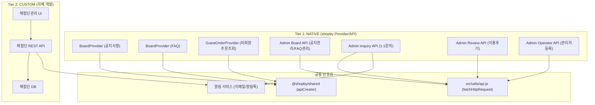
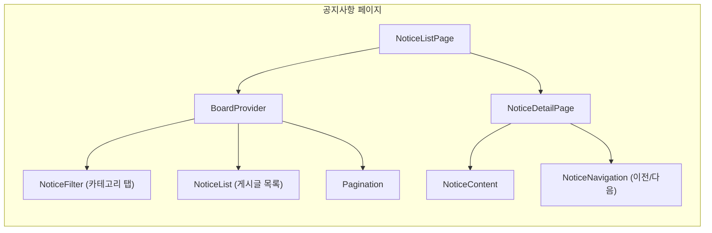
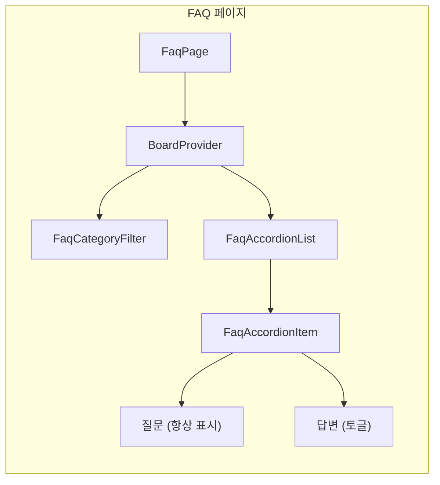
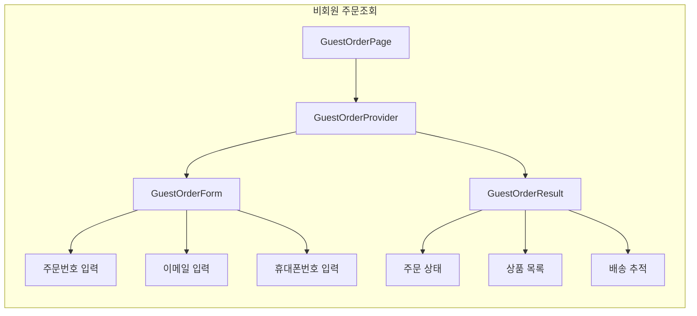
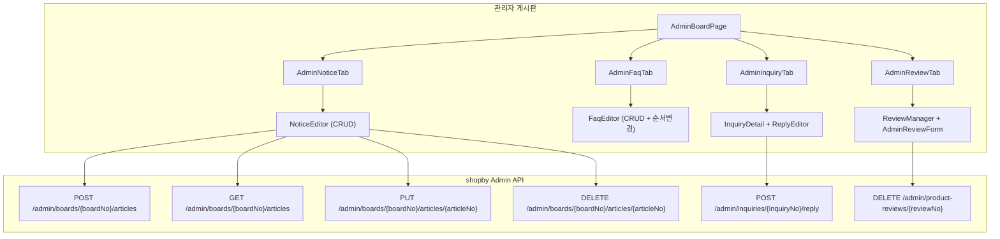
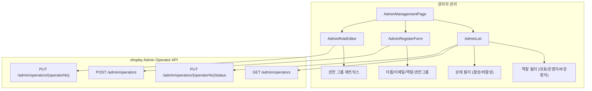
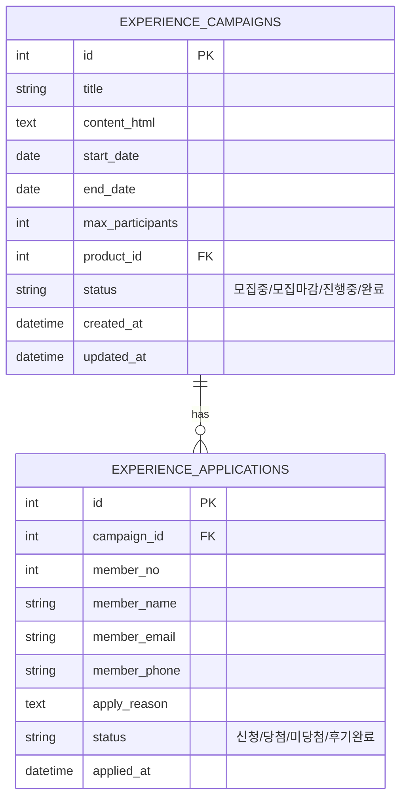
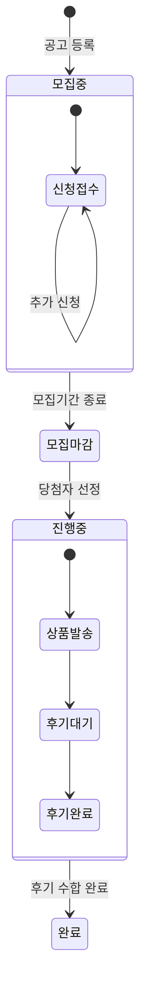
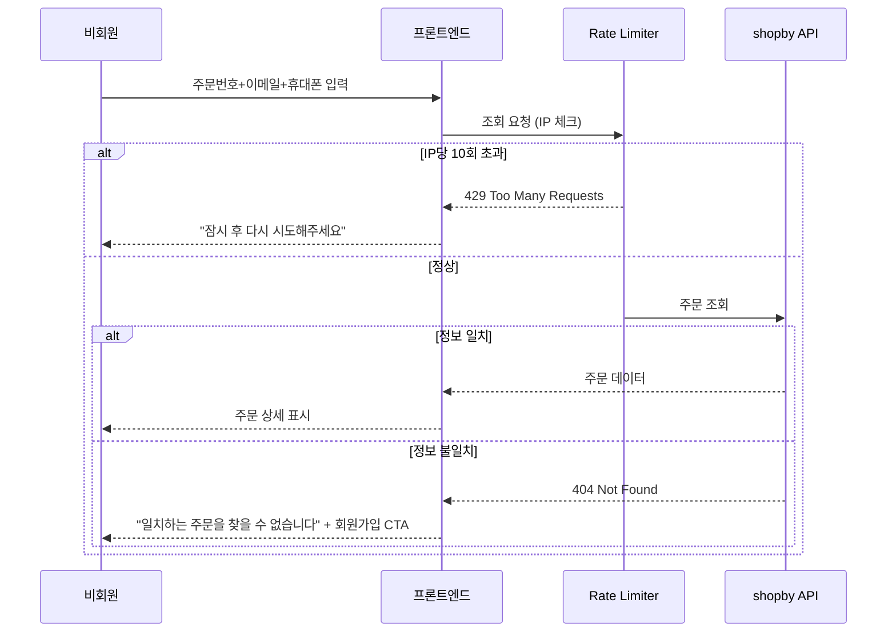
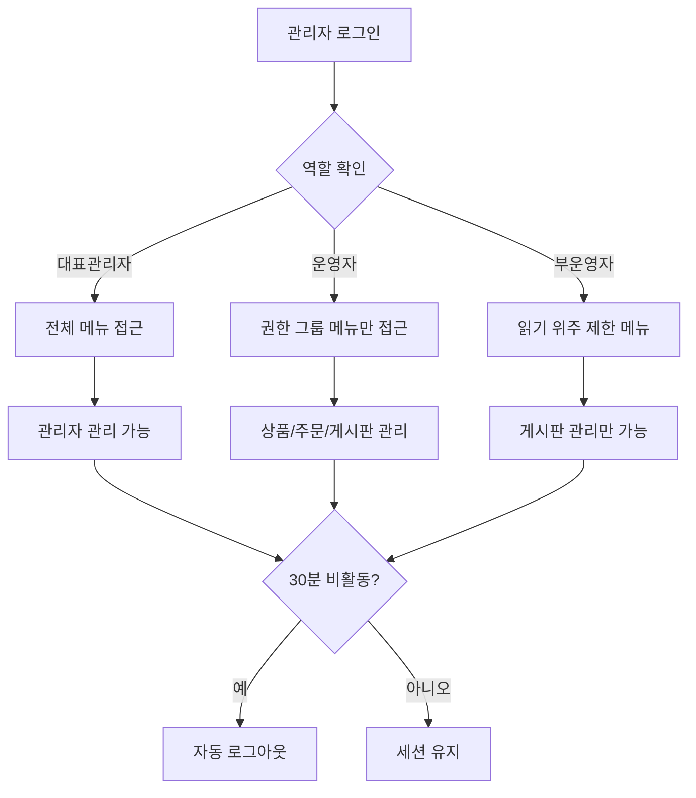

# SPEC-CS-001: A4B5-CS + B1-ADMIN 아키텍처 설계

> 후니프린팅 고객센터/관리자 도메인 (9개 기능) 기술 아키텍처

---

## 1. 시스템 아키텍처 개요

### 1.1 2-Tier 아키텍처에서의 위치

### 1.2 핵심 설계 원칙

| 원칙 | 내용 |
|------|------|
| NATIVE 최우선 | 7/9 기능은 shopby 기본 Provider/API 활용 |
| CUSTOM 최소화 | 체험단관리만 자체 개발, 나머지는 설정 기반 |
| Provider 활용 | 쇼핑몰 프론트는 shopby Provider 패턴 유지 |
| Admin API 직접 호출 | 관리자 기능은 shopby Admin API 직접 호출 |
| 보안 우선 | Rate Limiting, RBAC, XSS 방지 적용 |

---

## 2. 쇼핑몰 프론트 아키텍처

### 2.1 공지사항 페이지 구조

**라우트 구조**:
- `/customer/notice` - 공지사항 목록
- `/customer/notice/:id` - 공지사항 상세

### 2.2 FAQ 페이지 구조

**라우트 구조**:
- `/customer/faq` - FAQ 페이지 (SPA, 페이지 이동 없음)

### 2.3 비회원 주문조회 구조

**라우트 구조**:
- `/order/guest` - 비회원 주문조회

---

## 3. 관리자 패널 아키텍처

### 3.1 관리자 게시판 관리 구조

### 3.2 관리자 등록/관리 구조

---

## 4. 체험단관리 CUSTOM 모듈 아키텍처

### 4.1 데이터 모델

### 4.2 체험단 상태 머신

### 4.3 API 설계 방향

| Method | Endpoint | 설명 |
|--------|----------|------|
| POST | `/api/admin/experience-campaigns` | 체험단 공고 등록 |
| GET | `/api/admin/experience-campaigns` | 공고 목록 조회 |
| PUT | `/api/admin/experience-campaigns/:id` | 공고 수정 |
| DELETE | `/api/admin/experience-campaigns/:id` | 공고 삭제 |
| GET | `/api/admin/experience-campaigns/:id/applications` | 신청자 목록 |
| POST | `/api/admin/experience-campaigns/:id/select-winners` | 당첨자 선정 |
| GET | `/api/experience-campaigns` | 쇼핑몰 공고 목록 |
| POST | `/api/experience-campaigns/:id/apply` | 체험단 신청 |

---

## 5. 보안 아키텍처

### 5.1 비회원 주문조회 보안

### 5.2 관리자 접근 제어

### 5.3 체험단 HTML 보안

| 위협 | 방어 수단 |
|------|----------|
| XSS (스크립트 삽입) | DOMPurify로 HTML 정화 |
| SQL Injection | Parameterized Query 필수 |
| CSRF | 관리자 API에 CSRF 토큰 적용 |
| 파일 업로드 공격 | 체험단 이미지 업로드 시 파일 유형/크기 제한 |

---

## 6. 화면 라우팅

### 6.1 쇼핑몰 라우트

| Route | 페이지 | 컴포넌트 |
|-------|--------|---------|
| `/customer/notice` | 공지사항 목록 | NoticeListPage |
| `/customer/notice/:id` | 공지사항 상세 | NoticeDetailPage |
| `/customer/faq` | FAQ | FaqPage |
| `/order/guest` | 비회원 주문조회 | GuestOrderPage |

### 6.2 관리자 라우트

| Route | 페이지 | 컴포넌트 |
|-------|--------|---------|
| `/admin/board/notice` | 공지사항 관리 | AdminNoticePage |
| `/admin/board/faq` | FAQ 관리 | AdminFaqPage |
| `/admin/board/inquiry` | 1:1문의 관리 | AdminInquiryPage |
| `/admin/board/review` | 이용후기 관리 | AdminReviewPage |
| `/admin/experience` | 체험단 관리 | AdminExperiencePage |
| `/admin/operators` | 관리자 관리 | AdminOperatorPage |
