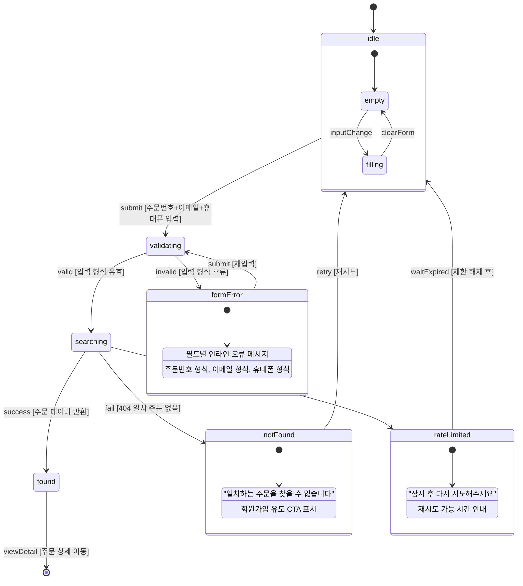
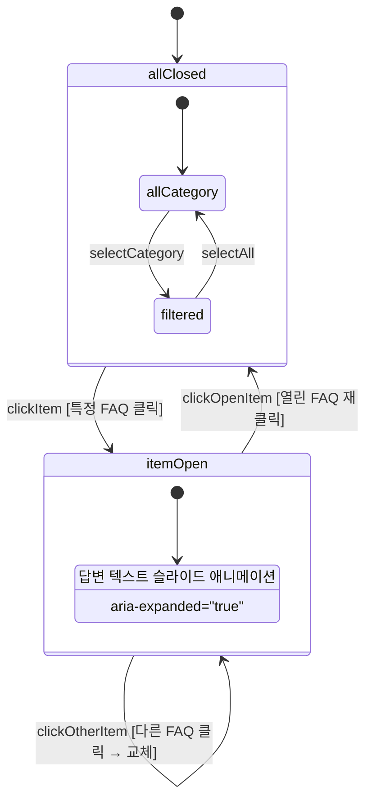
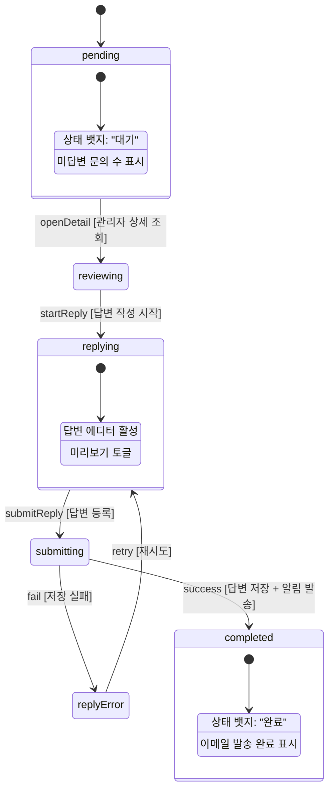
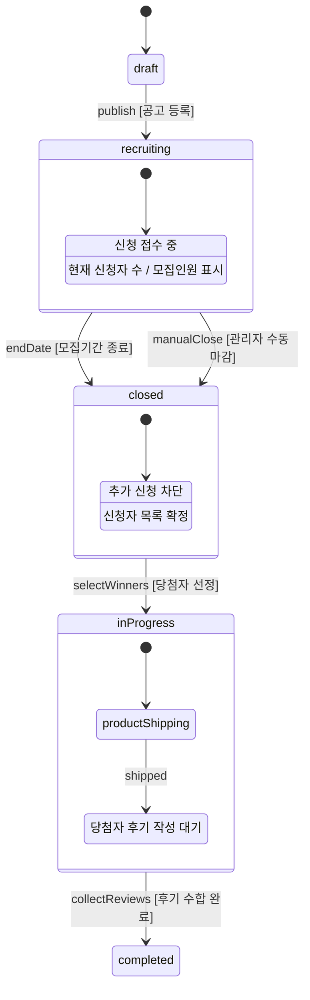

# SPEC-CS-001: 인터랙션 정의서

> A4B5-CS + B1-ADMIN 고객센터/관리자 도메인 상태 머신, 로딩/에러 상태, 조건부 표시 규칙

---

## 1. 상태 머신 (State Machines)

### 1.1 비회원 주문조회 (GuestOrderSearch)

### 1.2 FAQ 아코디언 (FaqAccordion)

### 1.3 1:1문의 관리자 답변 (InquiryReply)

### 1.4 체험단 라이프사이클 (ExperienceCampaign)

---

## 2. 로딩 및 에러 상태

### 2.1 로딩 상태

| 화면 | 로딩 표시 | 로딩 시간 기준 |
|------|----------|--------------|
| 공지사항 목록 | 스켈레톤 UI (5줄) | < 1초 |
| 공지사항 상세 | 스켈레톤 UI (제목+본문) | < 500ms |
| FAQ 목록 | 스켈레톤 UI (6줄) | < 1초 |
| 비회원 주문조회 | 스피너 (버튼 내) | < 2초 |
| 관리자 게시판 목록 | 테이블 스켈레톤 | < 1초 |
| 체험단 신청자 목록 | 테이블 스켈레톤 | < 1초 |

### 2.2 에러 상태

| 화면 | 에러 유형 | 표시 방식 |
|------|----------|----------|
| 공지사항 | 네트워크 오류 | "일시적으로 공지사항을 불러올 수 없습니다. 새로고침해주세요." |
| FAQ | 네트워크 오류 | "FAQ를 불러오는 중 오류가 발생했습니다." |
| 비회원 조회 | 조회 실패 | 인라인 오류 메시지 + 회원가입 CTA |
| 비회원 조회 | Rate Limit | 토스트 알림 "잠시 후 다시 시도해주세요" |
| 관리자 CRUD | 저장 실패 | 토스트 알림 "저장 중 오류가 발생했습니다. 다시 시도해주세요." |
| 체험단 신청 | 중복 신청 | 인라인 오류 "이미 신청한 체험단입니다" |
| 관리자 등록 | 이메일 중복 | 인라인 오류 "이미 등록된 이메일입니다" |

---

## 3. 조건부 표시 규칙

### 3.1 쇼핑몰 고객센터

| 조건 | 동작 | 화면 |
|------|------|------|
| 공지사항이 0건 | 빈 상태 표시 (SCR-CS-003) | 공지사항 목록 |
| 공지사항이 상단고정 | 목록 최상단 + 핀 아이콘 | 공지사항 목록 |
| FAQ 카테고리 선택 | 해당 카테고리 FAQ만 표시 | FAQ |
| FAQ 결과 0건 | 빈 카테고리 안내 (SCR-CS-006) | FAQ |
| 비회원 주문 조회 성공 | 결과 섹션 표시 (SCR-CS-008) | 비회원 주문조회 |
| 비회원 주문 조회 실패 | 실패 메시지 + 회원가입 CTA | 비회원 주문조회 |
| Rate Limit 초과 | 제한 안내 + 폼 비활성화 | 비회원 주문조회 |

### 3.2 관리자 게시판

| 조건 | 동작 | 화면 |
|------|------|------|
| 1:1문의 미답변 존재 | 사이드바 뱃지 (미답변 수) | 관리자 전체 |
| 이용후기 삭제 시 적립금 지급 이력 | 적립금 회수 경고 표시 | 이용후기 관리 |
| 관리자 임의등록 후기 | "관리자 등록" 뱃지 표시 | 이용후기 관리 |
| 체험단 모집기간 D-3 이하 | "마감 임박" 뱃지 | 체험단 목록 |
| 체험단 이미 신청 | 신청 버튼 비활성 + 안내 | 체험단 상세 |

### 3.3 관리자 접근 제어

| 조건 | 동작 | 화면 |
|------|------|------|
| 역할이 부운영자 | 게시판 관리만 사이드바 표시 | 관리자 전체 |
| 역할이 운영자 | 관리자 관리 메뉴 숨김 | 관리자 전체 |
| 유일한 대표관리자 | 삭제/비활성화 버튼 비활성 | 관리자 관리 |
| 자기 자신 계정 | 역할 변경 버튼 비활성 | 관리자 관리 |

---

## 4. 애니메이션 및 트랜지션

| 인터랙션 | 애니메이션 | 시간 |
|---------|-----------|------|
| FAQ 아코디언 펼침/접힘 | slideDown/slideUp | 200ms ease-out |
| 삭제 확인 모달 | fadeIn + scale(0.95→1) | 150ms |
| 토스트 알림 | slideDown + fadeIn → fadeOut | 300ms + 3초 표시 |
| 페이지네이션 전환 | fadeIn | 100ms |
| 로딩 스켈레톤 | pulse 애니메이션 | 반복 |
| 드래그앤드롭 (FAQ 순서) | 드래그 요소 opacity 0.5 | 드래그 중 |
