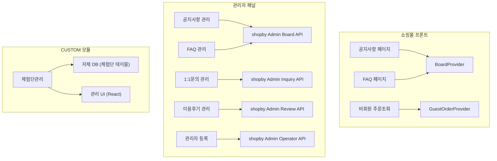

# SPEC-CS-001: 구현 계획서

> A4B5-CS + B1-ADMIN 고객센터/관리자 도메인 구현 전략

---

## 1. 구현 개요

### 1.1 범위

후니프린팅 shopby Enterprise 기반 고객센터/관리자 도메인의 9개 기능을 3개 Phase로 나누어 구현한다. 7개 NATIVE 기능은 shopby Provider/Admin API를 활용하고, 1개 CUSTOM 기능(체험단관리)은 자체 개발한다.

### 1.2 접근 방식

- **Provider 우선**: shopby 공식 게시판 Provider(BoardProvider 등) 활용
- **Admin API 활용**: 관리자 기능은 shopby Admin API 직접 호출
- **PC 우선 설계**: 인쇄 업종 특성상 PC 주문 비중이 높으므로 PC 최적화 후 모바일 대응
- **최소 CUSTOM**: 체험단관리만 자체 개발, 나머지는 NATIVE 최대 활용

### 1.3 개발 방법론

DDD (ANALYZE-PRESERVE-IMPROVE) 방식 적용. 기존 shopby Aurora Skin에 게시판 관련 코드가 존재할 수 있으므로 기존 동작을 보존하면서 점진적으로 개선한다.

---

## 2. 아키텍처 결정사항

### 2.1 2-Tier 구조

| Tier | 해당 기능 | 구현 방식 |
|------|----------|----------|
| Tier 1 (NATIVE) | 공지사항, FAQ, 비회원주문조회, 공지관리, FAQ관리, 1:1문의, 이용후기관리, 관리자등록 | shopby Provider / Admin API |
| Tier 2 (CUSTOM) | 체험단관리 | 자체 DB + 관리 UI |

### 2.2 shopby 게시판 Provider 활용 전략

### 2.3 비회원 주문조회 인증 전략

- 주문번호 + 이메일 + 휴대폰번호 3중 조합
- Rate Limiting: IP당 10회/시간
- shopby `GuestOrderProvider` 활용
- 실패 시 회원가입 유도 CTA 제공

### 2.4 체험단관리 CUSTOM 모듈 설계

- **데이터 저장**: 자체 DB 테이블 (체험단 공고, 신청자, 당첨자)
- **관리 UI**: React 기반 관리자 페이지
- **당첨 처리**: 관리자 수동 선정 + 알림 발송
- **HTML 입력**: 에디터를 통한 체험단 공고 HTML 직접 입력
- **우선순위**: P3 (런칭 후 개발)

---

## 3. 구현 단계

### Phase 1: 쇼핑몰 고객센터 (P1/P2 핵심) - 최우선

**목표**: 공지사항, FAQ, 비회원 주문조회 쇼핑몰 프론트 구현

| TAG | 기능 | 작업 범위 | 완료 조건 | 의존성 |
|-----|------|----------|----------|--------|
| TAG-CS-001 | 공지사항 페이지 | 목록, 상세, 카테고리 필터, 페이지네이션 | 공지사항 CRUD 표시, 상단 고정 동작 | shopby Board API |
| TAG-CS-002 | FAQ 페이지 | 카테고리 필터, 아코디언, 검색 | 카테고리별 FAQ 표시, 아코디언 토글 | shopby Board API |
| TAG-CS-003 | 비회원 주문조회 | 3중 인증, 주문 조회, 에러 처리 | 주문번호+이메일+휴대폰 조회 성공 | shopby Guest Order API |

**핵심 리스크**: shopby 게시판 Provider 카테고리 커스터마이징 범위 확인 필요

### Phase 2: 관리자 게시판 관리 (P2) - 차순위

**목표**: 공지관리, FAQ관리, 1:1문의, 이용후기관리, 관리자등록 Admin 기능 구현

| TAG | 기능 | 작업 범위 | 완료 조건 | 의존성 |
|-----|------|----------|----------|--------|
| TAG-CS-004 | 공지사항 관리 | CRUD, 상단 고정, 에디터 | 등록/수정/삭제/고정 동작 | shopby Admin API |
| TAG-CS-005 | FAQ 관리 | CRUD, 카테고리, 순서 변경 | 등록/수정/삭제/순서 변경 동작 | shopby Admin API |
| TAG-CS-006 | 1:1문의 관리 | 목록, 답변, 상태 관리, 알림 | 답변 등록 + 알림 발송 동작 | shopby Admin API |
| TAG-CS-007 | 이용후기 관리 | 조회, 삭제, 답변, 임의등록, 적립금 | 관리자 등록 + 삭제 시 적립금 회수 | shopby Admin API + 적립금 API |
| TAG-CS-008 | 관리자 등록/관리 | 계정 등록, 역할/권한, 비활성화 | 3단계 역할 + 권한 그룹 동작 | shopby Operator API |

**핵심 리스크**: 이용후기 삭제 시 적립금 자동 회수 로직 shopby API 지원 범위 확인

### Phase 3: 체험단관리 CUSTOM 개발 (P3) - 런칭 후

**목표**: 체험단 모집/신청/당첨/후기 CUSTOM 모듈 구현

| TAG | 기능 | 작업 범위 | 완료 조건 | 의존성 |
|-----|------|----------|----------|--------|
| TAG-CS-009 | 체험단 DB 설계 | 테이블 설계, API 설계 | ERD 확정, API 스펙 확정 | 없음 |
| TAG-CS-010 | 체험단 관리 UI | 공고 등록, 신청자 관리, 당첨 처리 | CRUD + 당첨 처리 동작 | TAG-CS-009 |
| TAG-CS-011 | 체험단 쇼핑몰 UI | 체험단 목록, 신청, 결과 확인 | 쇼핑몰 체험단 페이지 동작 | TAG-CS-009 |

**핵심 리스크**: 자체 DB/API 설계 필요, HTML 에디터 보안 (XSS 방지)

---

## 4. 리스크 및 대응

| 리스크 | 영향 | 대응 방안 |
|--------|------|----------|
| shopby 게시판 Provider 카테고리 제한 | 인쇄 업종 특화 카테고리 불가 | SKIN 커스터마이징으로 카테고리 프론트 구현 |
| 적립금 자동 회수 API 미지원 | 이용후기 삭제 시 수동 처리 | shopby 적립금 차감 API 별도 호출 |
| 체험단 HTML 입력 보안 | XSS 공격 취약 | DOMPurify + Sanitization 적용 |
| 관리자 2FA 도입 시점 | 초기 보안 우려 | P2 단계에서 이메일 OTP 검토 |

---

## 5. 기술 스택

| 영역 | 기술 |
|------|------|
| 프론트엔드 (쇼핑몰) | React + shopby Provider + Tailwind CSS |
| 프론트엔드 (관리자) | React + shopby Admin API 호출 |
| 체험단 CUSTOM | React + Express/Fastify + PostgreSQL |
| 에디터 | TBD (체험단 HTML 입력용) |
| 보안 | DOMPurify (XSS), Parameterized Query (SQL Injection) |

---

## 6. 마일스톤

| Phase | 목표 | 우선순위 |
|-------|------|---------|
| Phase 1 | 쇼핑몰 고객센터 3개 페이지 완성 | Primary |
| Phase 2 | 관리자 게시판 5개 기능 완성 | Secondary |
| Phase 3 | 체험단관리 CUSTOM 모듈 완성 | Tertiary |
