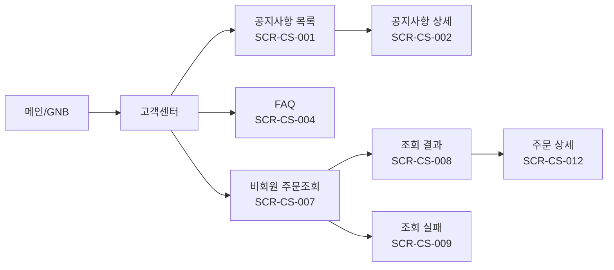
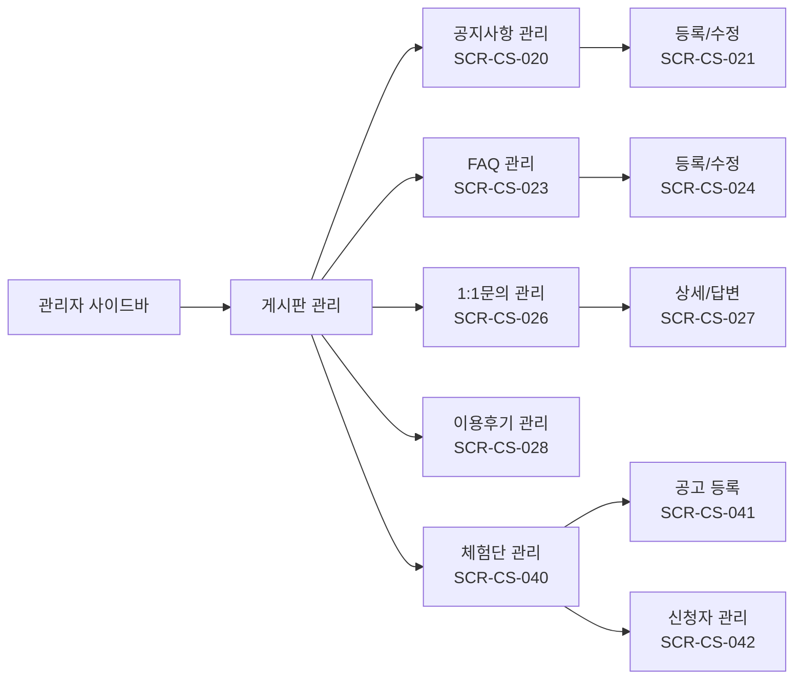

# SPEC-CS-001: 화면 인벤토리 (Screen Inventory)

> A4B5-CS + B1-ADMIN 고객센터/관리자 도메인 전체 화면 설계 기초 자료

---

## 1. 전체 화면 인벤토리

### 1.1 모듈 1: 쇼핑몰 고객센터 - SCR-CS-001 ~ 012

| Screen ID | 화면명 | 유형 | Route Path | 부모 | 우선순위 | 모듈 | 핵심 기능 |
|-----------|--------|------|------------|------|---------|------|----------|
| SCR-CS-001 | 공지사항 목록 | Page | `/customer/notice` | - | P2 | CS-FRONT | 카테고리 탭(공지/이벤트/상품), 상단 고정 표시, 페이지네이션 |
| SCR-CS-002 | 공지사항 상세 | Page | `/customer/notice/:id` | - | P2 | CS-FRONT | 제목, 내용, 작성일, 조회수, 이전/다음 네비게이션 |
| SCR-CS-003 | 공지사항 빈 상태 | State | `/customer/notice` | SCR-CS-001 | P2 | CS-FRONT | "등록된 공지사항이 없습니다" 안내 |
| SCR-CS-004 | FAQ 목록 | Page | `/customer/faq` | - | P2 | CS-FRONT | 카테고리 필터(6개), 아코디언 질문/답변, 검색 |
| SCR-CS-005 | FAQ 아코디언 펼침 | State | `/customer/faq` | SCR-CS-004 | P2 | CS-FRONT | 선택된 질문의 답변 펼침, 나머지 접힘 |
| SCR-CS-006 | FAQ 빈 상태 | State | `/customer/faq` | SCR-CS-004 | P2 | CS-FRONT | "해당 카테고리에 FAQ가 없습니다" 안내 |
| SCR-CS-007 | 비회원 주문조회 폼 | Page | `/order/guest` | - | P1 | CS-FRONT | 주문번호, 이메일, 휴대폰번호 입력, 조회 버튼 |
| SCR-CS-008 | 비회원 주문조회 결과 | Section | `/order/guest` | SCR-CS-007 | P1 | CS-FRONT | 주문 상태, 상품 목록, 배송 추적 링크, 증빙서류 |
| SCR-CS-009 | 비회원 주문조회 실패 | State | `/order/guest` | SCR-CS-007 | P1 | CS-FRONT | "일치하는 주문을 찾을 수 없습니다" + 회원가입 유도 CTA |
| SCR-CS-010 | 비회원 주문조회 Rate Limit | State | `/order/guest` | SCR-CS-007 | P1 | CS-FRONT | "잠시 후 다시 시도해주세요" 안내 (10회 초과) |
| SCR-CS-011 | 비회원 주문조회 폼 검증 | State | `/order/guest` | SCR-CS-007 | P1 | CS-FRONT | 필드별 인라인 오류 (주문번호 형식, 이메일 형식, 휴대폰 형식) |
| SCR-CS-012 | 비회원 주문 상세 | Page | `/order/guest/:orderNo` | SCR-CS-008 | P1 | CS-FRONT | 주문 상세 정보, 결제 정보, 배송 상세 |

### 1.2 모듈 2: 관리자 게시판 관리 - SCR-CS-020 ~ 038

| Screen ID | 화면명 | 유형 | Route Path | 부모 | 우선순위 | 모듈 | 핵심 기능 |
|-----------|--------|------|------------|------|---------|------|----------|
| SCR-CS-020 | 공지사항 관리 목록 | Page | `/admin/board/notice` | - | P2 | ADMIN-BOARD | 목록, 검색, 상단고정 토글, 삭제 |
| SCR-CS-021 | 공지사항 등록/수정 | Page | `/admin/board/notice/write` | - | P2 | ADMIN-BOARD | 제목, 카테고리, 에디터, 상단고정, 등록/수정 |
| SCR-CS-022 | 공지사항 삭제 확인 | Modal | - | SCR-CS-020 | P2 | ADMIN-BOARD | "삭제하시겠습니까?" 확인 다이얼로그 |
| SCR-CS-023 | FAQ 관리 목록 | Page | `/admin/board/faq` | - | P2 | ADMIN-BOARD | 카테고리별 목록, 순서 변경(드래그), 노출 토글 |
| SCR-CS-024 | FAQ 등록/수정 | Page | `/admin/board/faq/write` | - | P2 | ADMIN-BOARD | 질문, 답변, 카테고리, 노출 여부 |
| SCR-CS-025 | FAQ 카테고리 관리 | Modal | - | SCR-CS-023 | P2 | ADMIN-BOARD | 카테고리 추가/수정/삭제 |
| SCR-CS-026 | 1:1문의 관리 목록 | Page | `/admin/board/inquiry` | - | P2 | ADMIN-BOARD | 상태 필터(대기/처리중/완료), 검색, 일괄 상태 변경 |
| SCR-CS-027 | 1:1문의 상세/답변 | Page | `/admin/board/inquiry/:id` | - | P2 | ADMIN-BOARD | 문의 내용, 답변 에디터, 상태 변경, 알림 발송 |
| SCR-CS-028 | 이용후기 관리 목록 | Page | `/admin/board/review` | - | P2 | ADMIN-BOARD | 리뷰 목록, 평점 필터, 포토/일반 필터, 삭제 |
| SCR-CS-029 | 이용후기 관리자 등록 | Modal | - | SCR-CS-028 | P2 | ADMIN-BOARD | 상품 선택, 작성자명, 평점, 내용, 이미지 |
| SCR-CS-030 | 이용후기 삭제 확인 | Modal | - | SCR-CS-028 | P2 | ADMIN-BOARD | "삭제 시 적립금이 자동 회수됩니다" 경고 + 확인 |
| SCR-CS-031 | 이용후기 답변 | Modal | - | SCR-CS-028 | P2 | ADMIN-BOARD | 리뷰에 대한 사업자 답변 작성 |

### 1.3 체험단관리 (CUSTOM) - SCR-CS-040 ~ 048

| Screen ID | 화면명 | 유형 | Route Path | 부모 | 우선순위 | 모듈 | 핵심 기능 |
|-----------|--------|------|------------|------|---------|------|----------|
| SCR-CS-040 | 체험단 관리 목록 | Page | `/admin/experience` | - | P3 | CUSTOM-EXP | 공고 목록, 상태 필터(모집중/마감/진행중/완료) |
| SCR-CS-041 | 체험단 공고 등록 | Page | `/admin/experience/write` | - | P3 | CUSTOM-EXP | 제목, HTML 에디터, 기간, 인원, 상품 선택 |
| SCR-CS-042 | 체험단 신청자 목록 | Page | `/admin/experience/:id/applicants` | - | P3 | CUSTOM-EXP | 신청자 목록, 당첨 체크박스, 일괄 당첨 처리 |
| SCR-CS-043 | 체험단 당첨 확인 | Modal | - | SCR-CS-042 | P3 | CUSTOM-EXP | "N명을 당첨 처리하시겠습니까?" 확인 + 알림 발송 옵션 |
| SCR-CS-044 | 체험단 쇼핑몰 목록 | Page | `/experience` | - | P3 | CUSTOM-EXP | 모집중 체험단 목록, 마감 임박 표시 |
| SCR-CS-045 | 체험단 상세/신청 | Page | `/experience/:id` | - | P3 | CUSTOM-EXP | 공고 내용, 신청 폼, 신청 상태 확인 |
| SCR-CS-046 | 체험단 신청 완료 | State | `/experience/:id` | SCR-CS-045 | P3 | CUSTOM-EXP | "신청이 완료되었습니다" 안내 |
| SCR-CS-047 | 체험단 중복 신청 | State | `/experience/:id` | SCR-CS-045 | P3 | CUSTOM-EXP | "이미 신청한 체험단입니다" 오류 |
| SCR-CS-048 | 체험단 모집 마감 | State | `/experience/:id` | SCR-CS-045 | P3 | CUSTOM-EXP | "모집이 마감되었습니다" 안내 |

### 1.4 관리자 등록/관리 - SCR-CS-050 ~ 055

| Screen ID | 화면명 | 유형 | Route Path | 부모 | 우선순위 | 모듈 | 핵심 기능 |
|-----------|--------|------|------------|------|---------|------|----------|
| SCR-CS-050 | 관리자 목록 | Page | `/admin/operators` | - | P2 | ADMIN-MGT | 역할/상태 필터, 관리자 목록, 비활성화 |
| SCR-CS-051 | 관리자 등록 | Page | `/admin/operators/register` | - | P2 | ADMIN-MGT | 이름, 이메일, 역할, 권한 그룹 선택 |
| SCR-CS-052 | 관리자 권한 수정 | Modal | - | SCR-CS-050 | P2 | ADMIN-MGT | 역할 변경, 권한 그룹 매트릭스 수정 |
| SCR-CS-053 | 관리자 비활성화 확인 | Modal | - | SCR-CS-050 | P2 | ADMIN-MGT | "비활성화하시겠습니까?" 확인 다이얼로그 |
| SCR-CS-054 | 대표관리자 보호 오류 | State | - | SCR-CS-050 | P2 | ADMIN-MGT | "유일한 대표관리자는 삭제/비활성화 불가" 오류 |
| SCR-CS-055 | 권한 그룹 관리 | Page | `/admin/operators/permissions` | - | P2 | ADMIN-MGT | 권한 그룹 목록, 메뉴별 접근 권한 매트릭스 |

---

## 2. 화면 통계 요약

| 모듈 | Page | Section | State | Modal | 합계 |
|------|------|---------|-------|-------|------|
| 쇼핑몰 고객센터 | 4 | 1 | 5 | 0 | 10 (+2 추가) |
| 관리자 게시판 | 6 | 0 | 0 | 6 | 12 |
| 체험단관리 (CUSTOM) | 4 | 0 | 3 | 1 | 8 (+1 쇼핑몰) |
| 관리자 등록/관리 | 3 | 0 | 1 | 2 | 6 |
| **합계** | **17** | **1** | **9** | **9** | **36** |

---

## 3. 화면 간 네비게이션 플로우

### 3.1 쇼핑몰 고객센터 플로우

### 3.2 관리자 게시판 관리 플로우

