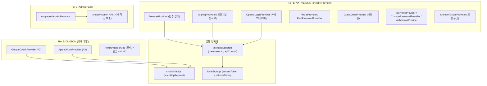
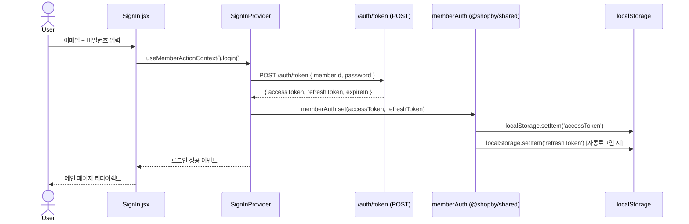
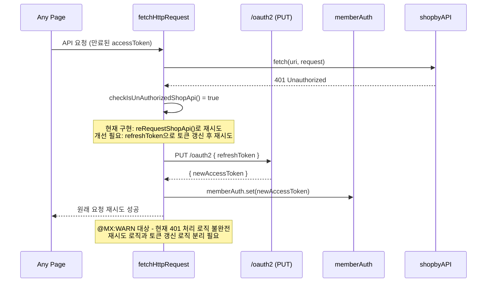
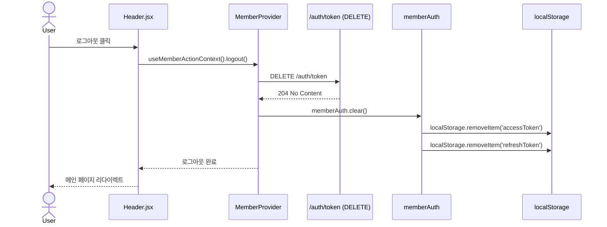
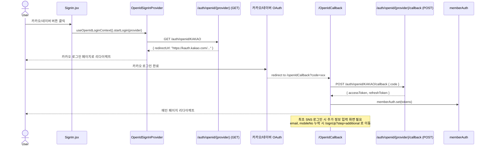
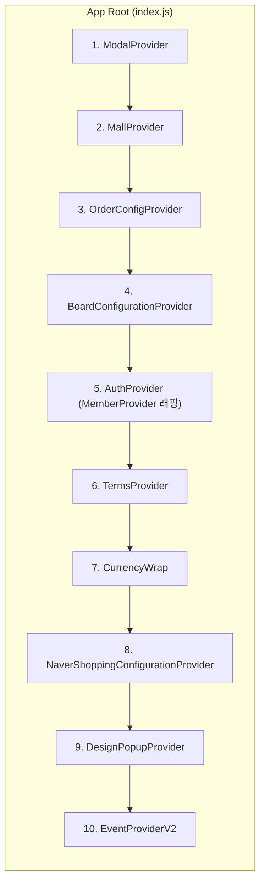
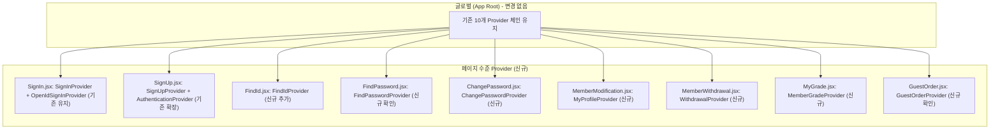

# SPEC-MEMBER-001: A1A2-MEMBER 아키텍처 설계

> 후니프린팅 로그인/회원 도메인 (18개 기능) 기술 아키텍처

---

## 1. 시스템 아키텍처 개요

### 1.1 3-Tier Hybrid 아키텍처에서의 위치



### 1.2 핵심 설계 원칙

| 원칙 | 내용 |
|------|------|
| Provider 우선 | shopby 공식 Provider는 교체하지 않고 래핑(wrapping)만 함 |
| 최소 침습 | 기존 Provider 체인 구조 유지, 새 Provider는 끝에 추가 |
| Mobile-First | 로그인/회원가입/마이페이지 모든 페이지 (REQ-PLAN-032) |
| 카드 스타일 | 데스크톱에서 인증 페이지 카드 UI 유지 (SPEC-LAYOUT-002 계승) |

---

## 2. 인증 플로우 설계

### 2.1 일반 로그인 플로우



**자동 로그인 처리**:
- 체크박스 선택 시 refreshToken을 localStorage에 영구 저장
- 미선택 시 refreshToken을 sessionStorage 또는 메모리에 임시 저장
- `keepDefaultTokenTime: true` 설정이 `src/utils/api.js`의 `apiCreator`에 이미 적용됨

### 2.2 토큰 갱신 (401 인터셉터) 플로우



**현재 코드 분석** (`src/utils/api.js` line 85-101):
- `reRequestShopApi`: 토큰 갱신 없이 원본 요청을 재시도만 함 (버그 가능성)
- `checkIsUnAuthorizedShopApi`: `PUT oauth2` 요청 제외, 올바른 가드 조건
- **개선 포인트**: 실제 토큰 갱신 로직이 `@shopby/shared`의 `memberAuth`에 위임되어 있어 현재는 shopby SDK가 내부적으로 처리하는 것으로 추정

### 2.3 로그아웃 플로우



### 2.4 SNS 로그인 플로우 (카카오/네이버 - P1)



**기존 파일**: `src/pages/OpenIdCallback/index.js`, `src/components/OpenIdSignIn/index.js` 존재 확인

---

## 3. Provider 통합 전략

### 3.1 기존 Provider 체인 (10개)



**중요**: `AuthProvider`가 5번째에 위치하며 이것이 `MemberProvider`의 래퍼임 (기존 코드 확인 필요)

### 3.2 새 Provider 추가 전략

**원칙**: 기존 Provider 체인 순서를 변경하지 않음. 페이지 수준에서 필요한 Provider만 추가.



### 3.3 Provider 의존성 순서

| 순서 | Provider | 의존성 | 초기화 방식 |
|------|----------|--------|------------|
| 1 | MallProvider | 없음 | 앱 시작 시 몰 정보 로드 |
| 2 | AuthProvider (MemberProvider) | MallProvider | clientId 필요 |
| 3 | TermsProvider | MallProvider | 약관 목록 로드 |
| 4 | (페이지별) SignInProvider | AuthProvider | 로그인 플로우 |
| 5 | (페이지별) OpenIdSignInProvider | SignInProvider + TermsProvider | SNS 로그인 |
| 6 | (페이지별) SignUpProvider | TermsProvider | 회원가입 플로우 |

---

## 4. 파일 영향 분석 (전체 목록)

### 4.1 기존 파일 수정

| 파일 경로 | 수정 내용 | 복잡도 |
|-----------|----------|--------|
| `src/pages/SignIn/SignIn.jsx` | OpenIdSignInProvider 카카오/네이버 공식 디자인 버튼 추가, 로그인 실패 메시지 고도화 | 소 |
| `src/pages/SignIn/SignInForm.jsx` | 자동로그인 체크박스, 로그인 실패 횟수 안내, SNS 버튼 영역 | 중 |
| `src/pages/SignUp/index.js` | SignUpProvider 래핑 확인, AuthenticationProvider 추가 | 소 |
| `src/pages/FindId/index.js` | FindIdProvider 래핑 | 소 |
| `src/pages/FindPassword/index.js` | FindPasswordProvider 래핑 | 소 |
| `src/pages/ChangePassword/index.js` | ChangePasswordProvider 확인/추가 | 소 |
| `src/pages/MemberModification/index.js` | MyProfileProvider 추가, 비밀번호 확인 인증 플로우 | 중 |
| `src/pages/MemberWithdrawal/index.js` | WithdrawalProvider 추가, 탈퇴 안내 UI 개선 | 중 |
| `src/pages/MyPage/MyGrade/index.js` | MemberGradeProvider 추가, 등급 안내 UI | 중 |
| `src/pages/GuestOrder/index.js` | GuestOrderProvider 확인, 비회원 주문조회 UI | 중 |
| `src/pages/OpenIdCallback/index.js` | SNS 최초 로그인 시 추가 정보 입력 분기 처리 | 중 |
| `src/components/OpenIdSignIn/index.js` | 카카오/네이버 공식 디자인 가이드 준수 버튼 스타일 | 중 |
| `src/utils/api.js` | 401 토큰 갱신 로직 보강 (현재 불완전) | 고 |

### 4.2 신규 파일 생성

| 파일 경로 | 목적 | 복잡도 |
|-----------|------|--------|
| `src/pages/SignUp/SignUpTerms.jsx` | 약관동의 단계 UI (전체동의, 아코디언) | 중 |
| `src/pages/SignUp/SignUpForm.jsx` | 정보입력 단계 UI (이메일 중복확인, SMS 인증) | 고 |
| `src/pages/SignUp/SignUpComplete.jsx` | 가입완료 화면 (혜택 안내) | 소 |
| `src/pages/SignUp/SignUpAdditionalInfo.jsx` | SNS 최초 로그인 시 추가 정보 입력 | 중 |
| `src/components/SmsAuthField/index.js` | 휴대전화 인증 공통 컴포넌트 (타이머 포함) | 고 |
| `src/components/PasswordStrength/index.js` | 비밀번호 강도 표시 공통 컴포넌트 | 소 |
| `src/components/MemberGradeBadge/index.js` | 회원등급 배지 공통 컴포넌트 | 소 |
| `src/components/MemberGradeProgress/index.js` | 다음 등급까지 프로그레스 바 | 소 |
| `src/hooks/useAuthRedirect.js` | 인증 상태에 따른 라우팅 훅 | 소 |
| `src/hooks/useSmsAuth.js` | SMS 인증 상태/액션 훅 (타이머, 발송, 확인) | 중 |

### 4.3 설정/상수 변경

| 파일 경로 | 수정 내용 | 복잡도 |
|-----------|----------|--------|
| `src/constants/common.js` | SNS 제공자 상수, 회원등급 상수 추가 | 소 |

### 4.4 Admin 기능 (P2 - Tier 3)

| 파일 경로 | 목적 | 복잡도 |
|-----------|------|--------|
| `src/pages/admin/Members/index.js` | 회원 목록/검색 (기존 파일 - 현재 Mock) | 고 |
| `src/pages/admin/Members/MemberDetail.jsx` | 회원 상세 패널 | 고 |
| `src/pages/admin/Members/CouponManagement.jsx` | 회원별 쿠폰 발급/조회 | 중 |
| `src/pages/admin/Members/PrintingMoneyManagement.jsx` | 프린팅머니(적립금) 관리 | 중 |
| `src/pages/admin/Members/GradeManagement.jsx` | 회원등급 설정 UI | 중 |
| `src/services/adminAuth.js` | 관리자 인증 서비스 (Mock → 실제 연동 시 수정) | 중 |

---

## 5. 구현 단계 (Implementation Phases)

### Phase 1: Core Auth (P1 핵심)

**TAG-001: Authentication Foundation**
- 목적: 로그인/로그아웃/토큰 관리 기반 구축
- 작업 파일: `src/utils/api.js`, `src/pages/SignIn/SignIn.jsx`, `src/pages/SignIn/SignInForm.jsx`
- 완료 조건: 이메일/비밀번호 로그인 성공, 401 토큰 갱신 동작 확인, 자동로그인 체크박스 동작
- 의존성: 없음

**TAG-002: SNS Login (카카오/네이버)**
- 목적: shopby OpenID 기반 SNS 로그인
- 작업 파일: `src/components/OpenIdSignIn/index.js`, `src/pages/OpenIdCallback/index.js`
- 완료 조건: 카카오/네이버 로그인 버튼 클릭 → OAuth 흐름 → 로그인 완료, 최초 SNS 가입 시 추가 정보 입력
- 의존성: TAG-001

### Phase 2: Registration (P1 회원가입)

**TAG-003: Terms Agreement**
- 목적: 약관동의 단계 구현
- 작업 파일: `src/pages/SignUp/SignUpTerms.jsx`, `src/components/TermsContent/index.js` 확인
- 완료 조건: 전체동의 체크박스, 필수/선택 약관 분리, 아코디언 펼치기, 14세 확인
- 의존성: 없음 (TermsProvider는 글로벌)

**TAG-004: Registration Form**
- 목적: 정보입력 단계 구현
- 작업 파일: `src/pages/SignUp/SignUpForm.jsx`, `src/components/SmsAuthField/index.js`
- 완료 조건: 이메일 중복확인(debounce), SMS 인증(3분 타이머), 비밀번호 강도 표시, 가입 완료
- 의존성: TAG-003

**TAG-005: Registration Complete**
- 목적: 가입완료 화면 및 혜택 안내
- 작업 파일: `src/pages/SignUp/SignUpComplete.jsx`
- 완료 조건: 환영 메시지, 쿠폰/적립금 혜택 표시, 로그인/메인으로 버튼
- 의존성: TAG-004

### Phase 3: Account Management (P1 계정관리)

**TAG-006: Find ID / Find Password**
- 목적: 아이디 찾기, 비밀번호 찾기 기능
- 작업 파일: `src/pages/FindId/index.js`, `src/pages/FindPassword/index.js`
- 완료 조건: 이름+휴대전화로 아이디 찾기, 이메일로 비밀번호 재설정 링크 발송
- 의존성: TAG-001

**TAG-007: Member Profile Management**
- 목적: 회원정보수정, 비밀번호변경, 회원탈퇴
- 작업 파일: `src/pages/MemberModification/index.js`, `src/pages/ChangePassword/index.js`, `src/pages/MemberWithdrawal/index.js`
- 완료 조건: 프로필 수정(비밀번호 확인 후), 비밀번호 변경 후 재로그인, 탈퇴 전 안내 및 확인
- 의존성: TAG-001

**TAG-008: Guest Order**
- 목적: 비회원 주문조회 기능
- 작업 파일: `src/pages/GuestOrder/index.js`
- 완료 조건: 주문번호+휴대전화로 주문 조회, 회원가입 유도 안내
- 의존성: 없음 (GuestOrderProvider 독립)

**TAG-009: Member Grade**
- 목적: 회원등급 조회 및 안내
- 작업 파일: `src/pages/MyPage/MyGrade/index.js`, `src/components/MemberGradeBadge/index.js`, `src/components/MemberGradeProgress/index.js`
- 완료 조건: 현재 등급 표시, 다음 등급 프로그레스, 등급별 혜택 안내표
- 의존성: TAG-001

### Phase 4: Admin Operations (P2 관리자)

**TAG-010: Admin Member Management**
- 목적: 관리자 회원 목록/검색/상세
- 작업 파일: `src/pages/admin/Members/` 전체
- 완료 조건: 회원 목록 DataTable, 검색/필터, 회원 상세 패널
- 의존성: TAG-001 (관리자 인증 기반)

**TAG-011: Admin Coupon & PrintingMoney**
- 목적: 쿠폰 발급 및 적립금 관리
- 작업 파일: `src/pages/admin/Members/CouponManagement.jsx`, `src/pages/admin/Members/PrintingMoneyManagement.jsx`
- 완료 조건: 회원별 쿠폰 발급, 적립금 충전/차감
- 의존성: TAG-010

**TAG-012: Admin Grade Settings**
- 목적: 회원등급 체계 관리자 설정
- 작업 파일: `src/pages/admin/Members/GradeManagement.jsx`
- 완료 조건: 등급 조건 설정, 혜택 설정 UI
- 의존성: TAG-010

### Phase 5: P2 External OAuth

**TAG-013: Google OAuth (P2)**
- 목적: 구글 로그인 (shopby 미지원, 자체 구현)
- 작업 파일: 신규 커스텀 Provider 생성 필요
- 완료 조건: Google OAuth 2.0 플로우, shopby 회원 연동
- 의존성: TAG-001 (별도 SPEC으로 분리 권장)

**TAG-014: Apple Sign In (P2)**
- 목적: 애플 로그인 (shopby 미지원, 자체 구현)
- 작업 파일: 신규 커스텀 Provider 생성 필요
- 완료 조건: Apple Sign In 플로우, shopby 회원 연동
- 의존성: TAG-001 (별도 SPEC으로 분리 권장)

### TAG 의존성 다이어그램

```
[TAG-001] --> [TAG-002]
     |-------> [TAG-006]
     |-------> [TAG-007]
     |-------> [TAG-009]
     |-------> [TAG-010] --> [TAG-011]
                         --> [TAG-012]
     |-------> [TAG-013] (P2, 독립)
     |-------> [TAG-014] (P2, 독립)

[TAG-003] --> [TAG-004] --> [TAG-005]

[TAG-008] (독립)
```

---

## 6. 인터페이스 계약 (Interface Contracts)

### 6.1 핵심 훅 시그니처

```javascript
// src/hooks/useSmsAuth.js
const useSmsAuth = () => {
  return {
    // 상태
    isSent: boolean,          // SMS 발송 여부
    isVerified: boolean,      // 인증 완료 여부
    timeLeft: number,         // 남은 시간 (초)
    isExpired: boolean,       // 타이머 만료 여부
    // 액션
    sendSms: (mobileNo: string) => Promise<void>,
    verifySms: (mobileNo: string, code: string) => Promise<boolean>,
    resetTimer: () => void,
  };
};

// src/hooks/useAuthRedirect.js
const useAuthRedirect = () => {
  return {
    redirectToLogin: (returnUrl?: string) => void,
    redirectAfterLogin: () => void,
    isAuthenticated: boolean,
  };
};
```

### 6.2 컴포넌트 Props 계약

```javascript
// src/components/SmsAuthField/index.js
SmsAuthField.propTypes = {
  mobileNo: PropTypes.string.isRequired,
  onVerified: PropTypes.func.isRequired,    // (ci: string) => void
  onMobileChange: PropTypes.func.isRequired, // (mobileNo: string) => void
  disabled: PropTypes.bool,
};

// src/components/MemberGradeBadge/index.js
MemberGradeBadge.propTypes = {
  gradeName: PropTypes.string.isRequired,
  gradeNo: PropTypes.number.isRequired,
};

// src/components/MemberGradeProgress/index.js
MemberGradeProgress.propTypes = {
  currentAmount: PropTypes.number.isRequired,
  targetAmount: PropTypes.number.isRequired,
  nextGradeName: PropTypes.string,
};

// src/components/PasswordStrength/index.js
PasswordStrength.propTypes = {
  password: PropTypes.string.isRequired,
  // Returns: 'weak' | 'medium' | 'strong'
};
```

### 6.3 API 서비스 함수 시그니처 (필요 시 신규 작성)

```javascript
// 현재 fetchHttpRequest로 직접 호출 가능 (별도 서비스 레이어 불필요)
// shopby Provider가 이미 추상화 제공

// SNS 추가 정보 입력 (OpenIdCallback에서 사용)
const submitAdditionalInfo = async ({ mobileNo, memberName, agreedTermsNos }) => {
  return fetchHttpRequest({
    url: 'members/openid/additional',
    method: HTTP_REQUEST_METHOD.POST,
    requestBody: { mobileNo, memberName, agreedTermsNos },
  });
};
```

---

## 7. 보안 설계

### 7.1 토큰 스토리지 보안

| 항목 | 전략 | 근거 |
|------|------|------|
| accessToken 저장 | `@shopby/shared` `memberAuth`에 위임 | SDK가 XSS 방어 포함 |
| refreshToken (자동로그인) | localStorage (shopby SDK 표준) | sessionStorage는 탭 종료 시 소멸 |
| refreshToken (일반로그인) | sessionStorage 또는 메모리 | 브라우저 종료 시 자동 소멸 |
| 관리자 토큰 | sessionStorage (Mock 체계) | 관리자 세션은 자동 만료 필요 |

**XSS 방어**:
- React의 기본 JSX 이스케이핑으로 1차 방어
- `src/components/Sanitized/index.js` 사용 (서버 HTML 렌더링 시)
- 사용자 입력값 직접 `dangerouslySetInnerHTML` 금지 (기존 패턴 유지)

### 7.2 입력 검증 전략

| 필드 | 검증 위치 | 규칙 |
|------|----------|------|
| 이메일 | 프론트엔드 + API | RFC 5322 형식 + 중복 확인 API |
| 비밀번호 | 프론트엔드 (실시간) | 8자 이상, 영문+숫자+특수문자 |
| 휴대전화 | 프론트엔드 | 010-XXXX-XXXX 형식 정규식 |
| 이름 | 프론트엔드 | 2~20자, 특수문자 제외 |
| SMS 인증번호 | 프론트엔드 + API | 6자리 숫자 |

**Rate Limiting**:
- 로그인 실패: shopby 관리자에서 5회/10회 설정 (클라이언트 별도 처리 불필요)
- SMS 발송: shopby 고정 1분 간격 (타이머로 버튼 비활성화)
- 이메일 중복확인: debounce 300ms 적용 (API 호출 최소화)

### 7.3 CSRF 방어

- shopby API는 JWT Bearer Token 방식 사용 → CSRF 공격 표면 최소화
- 관리자 API (서버 직접 호출 시): `X-CSRF-Token` 헤더 추가 검토 (P2)
- SNS OAuth 콜백: `state` 파라미터 검증 (shopby Provider 내부 처리 확인 필요)

### 7.4 비밀번호 보안

- 비밀번호는 절대 로컬에 저장하지 않음
- 비밀번호 확인 화면 (`/profile/password/verify`): 비밀번호를 입력받아 API로만 전달
- 비밀번호 변경 후 `memberAuth.clear()` 호출하여 모든 기기 로그아웃 유도

---

## 8. @MX Tag 전략

### 8.1 ANCHOR 대상

| 파일 | 함수/컴포넌트 | 이유 |
|------|-------------|------|
| `src/utils/api.js` | `fetchHttpRequest` | fan_in >= 10, 모든 API 호출의 단일 진입점 |
| `src/utils/api.js` | `initializeShopApi` | fan_in >= 5, 앱 초기화 시 필수 호출 |
| `src/pages/SignIn/SignIn.jsx` | `SignIn` 컴포넌트 | MemberProvider + OpenIdSignInProvider 래핑 |

```javascript
// src/utils/api.js
// @MX:ANCHOR: [AUTO] 모든 shopby API 호출의 단일 진입점
// @MX:REASON: fan_in >= 10, 서명 변경 시 전체 API 호출 영향
// @MX:SPEC: SPEC-MEMBER-001
export const fetchHttpRequest = async ({ url, baseURL, method, query, requestBody, headers }) => { ... }
```

### 8.2 WARN 대상

| 파일 | 위치 | 경고 이유 |
|------|------|----------|
| `src/utils/api.js` | `reRequestShopApi` 함수 | 토큰 갱신 없이 재시도하는 잠재 버그 |
| `src/utils/api.js` | `makeHeaderOption` | accessToken을 모든 요청 헤더에 추가 (노출 위험) |
| `src/pages/SignIn/SignInForm.jsx` | 비밀번호 필드 처리 | 비밀번호 상태 관리 - XSS 주의 |

```javascript
// src/utils/api.js
// @MX:WARN: [AUTO] 401 재시도 로직 - 토큰 갱신 없이 원본 요청 재시도
// @MX:REASON: refreshToken 기반 갱신이 아닌 단순 재시도로 무한 루프 가능성
// @MX:SPEC: SPEC-MEMBER-001
const reRequestShopApi = async (uri, request) => { ... }
```

### 8.3 NOTE 대상

| 파일 | 위치 | 주석 이유 |
|------|------|----------|
| `src/pages/SignIn/SignIn.jsx` | `OpenIdSignInProvider` 래핑 | PI_TERMS_MAP 전달 이유 설명 필요 |
| `src/pages/OpenIdCallback/index.js` | SNS 최초 가입 분기 | 추가 정보 입력 조건 설명 |
| `src/hooks/useSmsAuth.js` | 타이머 로직 | 3분 타이머, 1분 재발송 간격 이유 |
| `src/constants/common.js` | SNS 제공자 상수 | KAKAO/NAVER는 NATIVE, GOOGLE/APPLE은 P2 EXTERNAL |

```javascript
// src/pages/SignIn/SignIn.jsx
// @MX:NOTE: [AUTO] OpenIdSignInProvider는 PI_TERMS_MAP과 terms를 필요로 함
// @MX:NOTE: SNS 최초 로그인 시 개인정보 약관 동의 매핑에 사용
// @MX:SPEC: SPEC-MEMBER-001
```

---

## 9. 기술 스택 결정

### 9.1 신규 라이브러리 필요 여부

| 기능 | 현재 | 추가 필요 |
|------|------|---------|
| 이메일 debounce | 없음 | `use-debounce` (이미 설치 여부 확인 필요) 또는 직접 구현 |
| 비밀번호 강도 측정 | 없음 | `zxcvbn` 또는 정규식 기반 직접 구현 (간단 규칙이므로 직접 구현 권장) |
| SMS 타이머 | `src/components/Timer/index.js` 존재 | 기존 Timer 컴포넌트 재사용 |
| 폼 유효성 검증 | `@shopby/react-components` Provider 내장 | 추가 라이브러리 불필요 |
| 구글 OAuth (P2) | 없음 | `@react-oauth/google` (P2 시점에 결정) |
| 애플 OAuth (P2) | 없음 | 직접 구현 또는 `react-apple-login` (P2 시점에 결정) |

### 9.2 기존 컴포넌트 재사용

| 신규 필요 기능 | 재사용 가능 기존 컴포넌트 |
|-------------|----------------------|
| SMS 인증 타이머 | `src/components/Timer/index.js` |
| 약관 내용 표시 | `src/components/TermsContent/index.js` |
| 약관 상세 | `src/components/TermsDetail/index.js` |
| 마케팅 수신 동의 | `src/components/MarketingReceiveAgreement/index.js` |
| 비밀번호 변경 공통 | `src/components/PasswordChanger/index.js` |
| 비밀번호 확인 | `src/components/CheckMemberPassword/index.js` |

---

## 10. 리스크 및 대응 방안

| 리스크 | 영향 | 가능성 | 대응 방안 |
|--------|------|--------|----------|
| `reRequestShopApi` 토큰 갱신 버그 | 고 | 중 | TAG-001에서 최우선 검증, shopby SDK 내부 동작 확인 |
| SNS 최초 가입 시 추가 정보 입력 플로우 복잡성 | 중 | 중 | OpenIdCallback에서 분기 처리, 별도 페이지(/signUpAdditional) 생성 |
| 카카오/네이버 공식 디자인 가이드 준수 | 저 | 고 | 카카오/네이버 개발자 문서의 버튼 이미지 에셋 사용 |
| 관리자 API CORS 이슈 | 중 | 고 | 현재 Mock 체계 유지, 실제 서버 API 연동 시 별도 SPEC |
| SMS 발송 비용 과다 | 저 | 저 | debounce + 재발송 간격 1분 제한으로 통제 |
| 비밀번호 변경 후 세션 동기화 | 중 | 중 | 변경 후 즉시 logout() 호출하여 재로그인 유도 |

---

## 11. 구현 우선순위 최종 요약

### P1 필수 (Phase 1-3): TAG-001 ~ TAG-009

```
Week 1: TAG-001 (로그인), TAG-002 (SNS 카카오/네이버)
Week 2: TAG-003, TAG-004, TAG-005 (회원가입 전체)
Week 3: TAG-006 (아이디/비밀번호 찾기), TAG-007 (정보수정/탈퇴)
Week 4: TAG-008 (비회원), TAG-009 (등급)
```

### P2 선택 (Phase 4-5): TAG-010 ~ TAG-014

```
Phase 4: TAG-010, TAG-011, TAG-012 (관리자 기능)
Phase 5: TAG-013, TAG-014 (구글/애플 - 별도 SPEC 생성 권장)
```

---

*문서 작성: manager-strategy (MoAI)*
*참조 SPEC: SPEC-PLAN-001 v1.1.0*
*참조 연구: research-shopby-auth.md (15개 기능 API 분석)*
