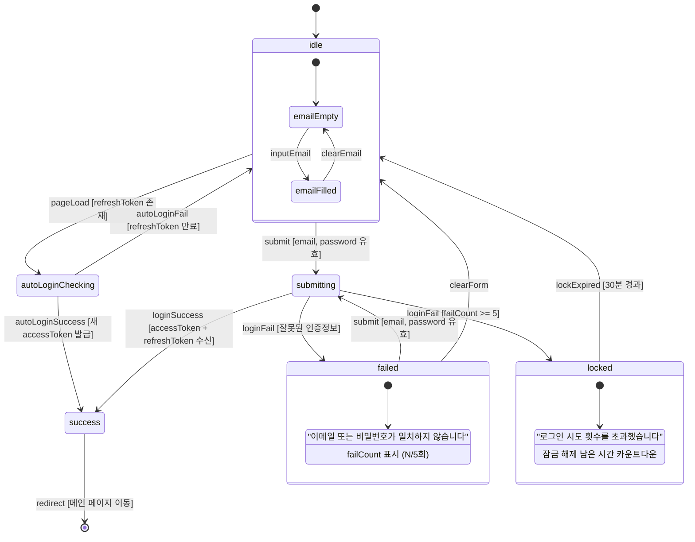
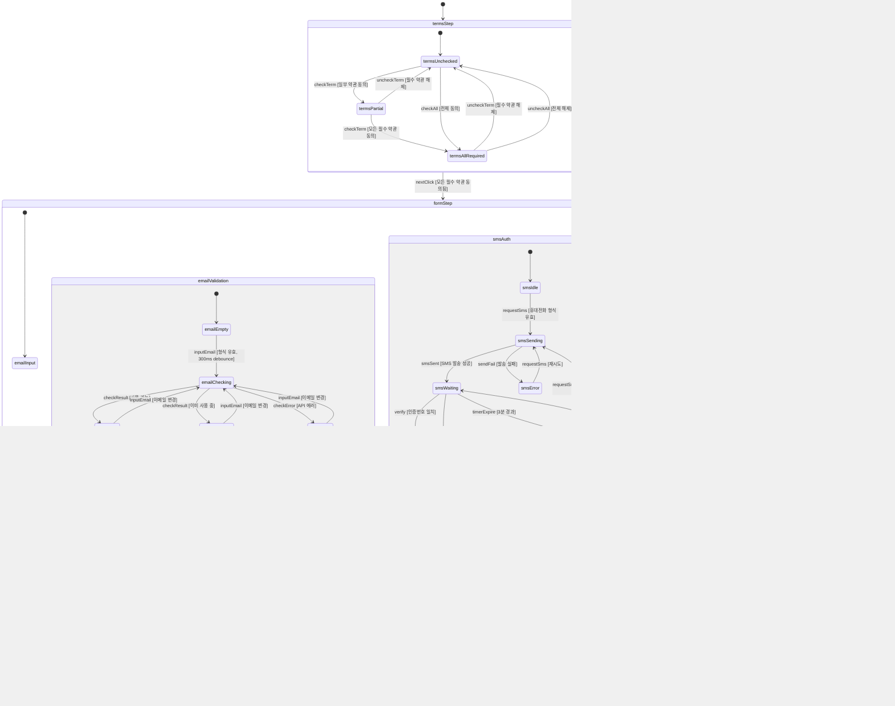
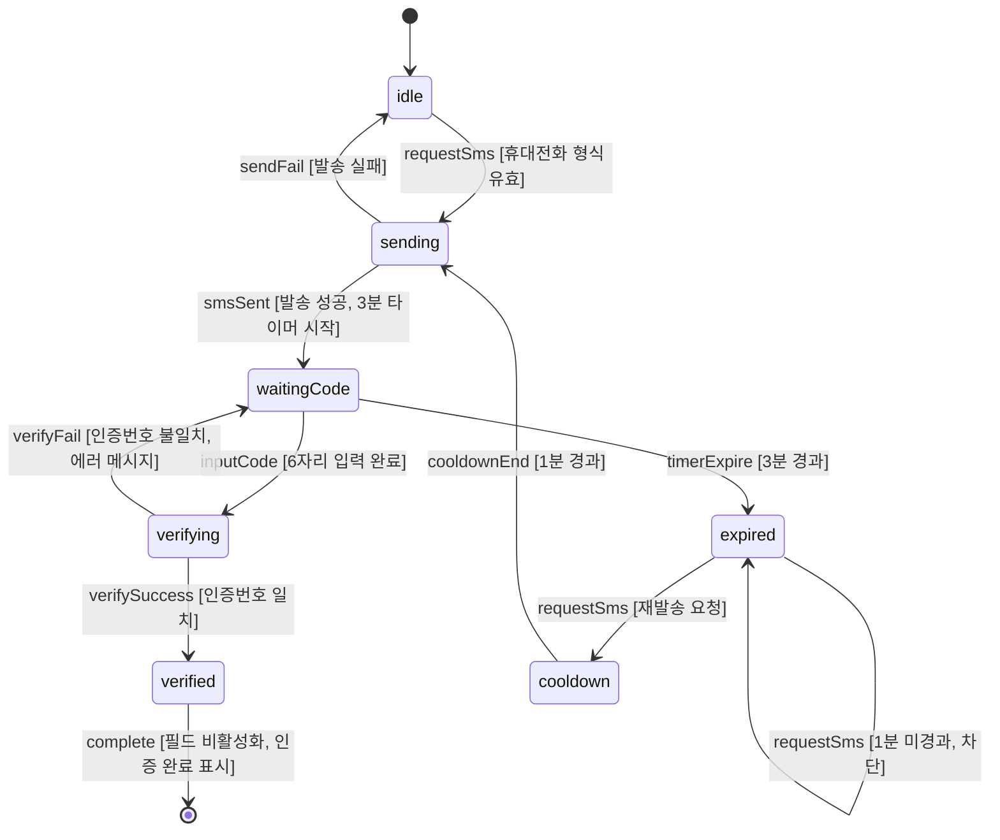
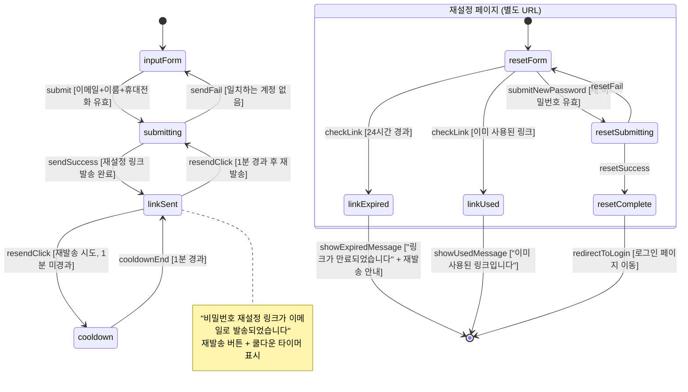
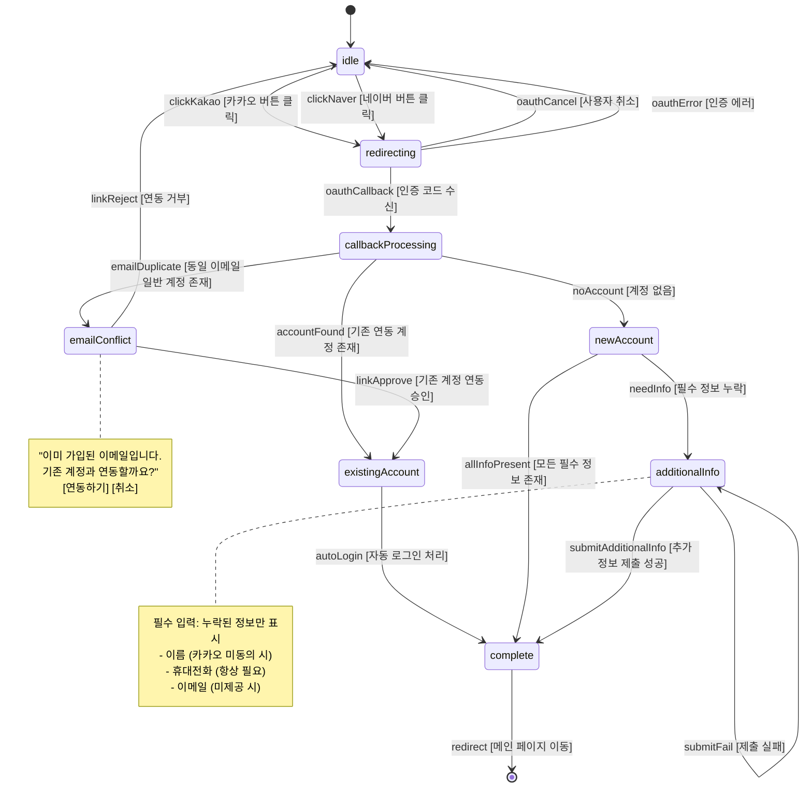

# SPEC-MEMBER-001: 인터랙션 정의서

> A1A2-MEMBER 로그인/회원 도메인 상태 머신, 로딩/에러 상태, SNS 제공자 매핑, 조건부 표시 규칙

---

## 1. 상태 머신 (State Machines)

### 1.1 로그인 폼 (SignIn)



**상태 설명**:

| 상태 | 설명 | 진입 조건 | UI 표현 |
|------|------|----------|---------|
| idle | 초기 상태, 폼 입력 대기 | 페이지 로드, 에러 초기화 | 이메일/비밀번호 입력 필드 활성화, 로그인 버튼 활성화 |
| autoLoginChecking | 자동 로그인 토큰 검증 중 | refreshToken 존재 시 페이지 로드 | 스피너 표시, 폼 비활성화 |
| submitting | 로그인 API 호출 중 | 로그인 버튼 클릭 | 버튼 로딩 스피너, 폼 비활성화 |
| success | 인증 성공 | API 200 응답 | 메인 페이지 리다이렉트 |
| failed | 인증 실패 | API 401/400 응답 | 에러 메시지 표시, 실패 횟수 안내 |
| locked | 계정 잠금 | 5회 연속 실패 | 잠금 메시지 + 해제 시간 카운트다운, 폼 비활성화 |

**이벤트 정의**:

| 이벤트 | 트리거 | 가드 조건 | 부수 효과 |
|--------|--------|----------|----------|
| submit | 로그인 버튼 클릭 / Enter | email 형식 유효 AND password 비어있지 않음 | POST /auth/token API 호출 |
| loginSuccess | API 성공 응답 | accessToken 존재 | memberAuth.set(), 자동로그인 시 localStorage 저장 |
| loginFail | API 에러 응답 | - | failCount 증가, 에러 메시지 표시 |
| lockExpired | 30분 타이머 만료 | - | failCount 초기화 |
| autoLoginCheck | 페이지 로드 | refreshToken 존재 | PUT /oauth2 토큰 갱신 시도 |

**관련 요구사항**: REQ-MEMBER-005~015

---

### 1.2 회원가입 폼 (SignUpForm)



**"가입하기" 버튼 활성화 조건** (AND 조건):

| 조건 | 상태 확인 |
|------|----------|
| 이메일 중복 확인 완료 | emailValidation === emailValid |
| SMS 인증 완료 | smsAuth === smsVerified |
| 비밀번호 규칙 충족 | 영문+숫자+특수문자 8자 이상 |
| 비밀번호 확인 일치 | password === confirmPassword |
| 이름 입력 | name.length >= 2 |

**관련 요구사항**: REQ-MEMBER-032~061

---

### 1.3 SMS 인증 (SmsAuthField)



**타이머 규칙**:

| 타이머 | 시간 | 동작 |
|--------|------|------|
| 인증번호 유효 시간 | 3분 (180초) | 만료 시 인증번호 무효화, "인증번호가 만료되었습니다" 표시 |
| 재발송 쿨다운 | 1분 (60초) | 재발송 버튼 비활성화, "N초 후 재발송 가능" 카운트다운 |

**상태별 UI**:

| 상태 | 휴대전화 필드 | 인증번호 필드 | 발송 버튼 | 확인 버튼 |
|------|------------|------------|----------|----------|
| idle | 활성화 | 숨김 | "인증번호 발송" 활성화 | 숨김 |
| sending | 비활성화 | 숨김 | 로딩 스피너 | 숨김 |
| waitingCode | 비활성화 | 표시, 활성화 | "재발송" (쿨다운 중이면 비활성화) | "확인" 활성화 |
| verifying | 비활성화 | 비활성화 | 비활성화 | 로딩 스피너 |
| verified | 비활성화 | 비활성화, 초록 체크 | 숨김 | 숨김, "인증 완료" 텍스트 |
| expired | 비활성화 | 비활성화, 빨간 텍스트 | "재발송" 활성화 | 비활성화 |

**관련 요구사항**: REQ-MEMBER-053~058

---

### 1.4 비밀번호 찾기 (FindPassword)



**상태별 UI**:

| 상태 | 표시 내용 |
|------|----------|
| inputForm | 이메일, 이름, 휴대전화 입력 폼 + "재설정 링크 발송" 버튼 |
| submitting | 버튼 로딩 스피너, 폼 비활성화 |
| linkSent | 성공 메시지 + 재발송 버튼 (쿨다운 카운트다운) |
| cooldown | 재발송 버튼 비활성화, "N초 후 재발송 가능" |
| resetForm | 새 비밀번호 + 비밀번호 확인 입력 폼 |
| linkExpired | 만료 안내 + "재설정 이메일 재발송" 버튼 |
| linkUsed | 사용 완료 안내 + 로그인 페이지 링크 |
| resetComplete | "비밀번호가 변경되었습니다" + 로그인 버튼 |

**관련 요구사항**: REQ-MEMBER-020~024

---

### 1.5 SNS 로그인 플로우 (OpenIdLogin)



**SNS 콜백 분기 로직**:

```
oauthCallback 수신
  -> POST /auth/openid/{provider}/callback
    -> 응답에 accessToken 있음?
      -> YES: existingAccount (자동 로그인)
      -> NO: 응답 코드 확인
        -> EMAIL_DUPLICATE: emailConflict (계정 연동 안내)
        -> NEED_ADDITIONAL_INFO: newAccount -> additionalInfo
        -> ERROR: idle (에러 메시지)
```

**관련 요구사항**: REQ-MEMBER-025~029

---

## 2. 로딩/에러/빈 상태 정의

### 2.1 화면별 상태 매핑

| 화면 | 로딩 상태 | 빈 상태 | 에러 상태 | 복구 액션 |
|------|----------|---------|----------|----------|
| **로그인 (SignIn)** | 버튼 내 스피너 + 폼 비활성화 | N/A (항상 폼 표시) | 인라인 에러 메시지 (폼 하단) | 폼 재입력 가능 |
| **회원가입 약관 (SignUpTerms)** | 약관 내용 로딩 스켈레톤 | "약관 정보를 불러올 수 없습니다" | "약관 로딩에 실패했습니다" 토스트 | "다시 시도" 버튼 |
| **회원가입 폼 (SignUpForm)** | 이메일 체크: 인라인 스피너, SMS: 버튼 스피너, 가입: 풀스크린 스피너 | N/A (항상 폼 표시) | 필드별 인라인 에러 메시지 | 필드 재입력 |
| **가입 완료 (SignUpComplete)** | 쿠폰 발급 확인 로딩 | N/A (항상 축하 메시지 표시) | "쿠폰 발급 확인에 실패했습니다" (비차단) | 마이페이지에서 확인 안내 |
| **아이디 찾기 (FindId)** | 버튼 내 스피너 | "일치하는 계정을 찾을 수 없습니다" 안내 | "일시적인 오류입니다" 토스트 | "다시 시도" 버튼 |
| **비밀번호 찾기 (FindPassword)** | 버튼 내 스피너 | N/A | "일치하는 계정을 찾을 수 없습니다" 인라인 | 폼 재입력 |
| **비밀번호 재설정 (ResetPassword)** | 링크 유효성 검증 스켈레톤 | N/A | "만료된 링크" / "사용된 링크" 전체화면 | 재발송 버튼 |
| **마이페이지 등급 (MyGrade)** | 등급 정보 스켈레톤 (배지 + 프로그레스 바) | "등급 정보가 없습니다" (신규 가입 직후) | "등급 정보를 불러올 수 없습니다" | "다시 시도" 버튼 |
| **비회원 주문조회 (GuestOrder)** | 버튼 내 스피너 | "일치하는 주문을 찾을 수 없습니다" | "주문 조회에 실패했습니다" 토스트 | 재조회 버튼 |
| **SNS 로그인 콜백 (OpenIdCallback)** | 풀스크린 로딩 ("로그인 처리 중...") | N/A | "SNS 로그인에 실패했습니다" + 로그인 페이지 이동 | 로그인 페이지로 돌아가기 |
| **회원정보 수정 (MemberModification)** | 현재 정보 로딩 스켈레톤 | N/A | "회원 정보를 불러올 수 없습니다" | "다시 시도" 버튼 |
| **회원 탈퇴 (MemberWithdrawal)** | 미완료 주문 확인 스피너 | N/A | "탈퇴 처리에 실패했습니다" | "다시 시도" 또는 고객센터 안내 |

### 2.2 에러 표시 원칙

| 원칙 | 설명 | 적용 예시 |
|------|------|----------|
| 인라인 우선 | 필드 관련 에러는 해당 필드 아래에 표시 | 이메일 중복, 비밀번호 불일치 |
| 토스트 보조 | 네트워크/서버 에러는 토스트 알림 | API 타임아웃, 500 에러 |
| 색상 + 텍스트 + 아이콘 | 색상만으로 에러 표현 금지 (접근성) | 빨간 텍스트 + X 아이콘 + 에러 메시지 |
| 비차단 원칙 | 부수적 에러는 핵심 플로우를 차단하지 않음 | 쿠폰 발급 실패해도 가입 완료 표시 |
| 구체적 안내 | "오류가 발생했습니다" 대신 구체적 원인 안내 | "이메일 또는 비밀번호가 일치하지 않습니다" |

### 2.3 네트워크 에러 공통 처리

| 에러 유형 | HTTP 코드 | 사용자 메시지 | 처리 방법 |
|----------|----------|-------------|----------|
| 인증 만료 | 401 | (자동 처리, 사용자 인지 없음) | refreshToken으로 갱신 후 원래 요청 재시도 |
| 갱신 실패 | 401 (갱신 요청) | "로그인이 만료되었습니다" | 로그인 페이지 리다이렉트 |
| 권한 없음 | 403 | "접근 권한이 없습니다" | 이전 페이지로 이동 |
| 서버 에러 | 500 | "일시적인 오류가 발생했습니다" | 토스트 + "다시 시도" 버튼 |
| 네트워크 끊김 | - | "네트워크 연결을 확인해주세요" | 자동 재시도 (3회) 후 에러 표시 |
| 요청 초과 | 429 | "잠시 후 다시 시도해주세요" | 쿨다운 타이머 표시 |

---

## 3. SNS 제공자 정보 매핑

### 3.1 제공자별 제공 정보

| 항목 | 카카오 (KAKAO) | 네이버 (NAVER) | 구글 (P2) | 애플 (P2) |
|------|--------------|--------------|----------|----------|
| **이메일** | 동의 시 제공 (선택 동의) | 동의 시 제공 (필수 동의) | 항상 제공 | 최초 1회만 제공 |
| **이름** | 동의 시 제공 (선택 동의) | 동의 시 제공 (필수 동의) | 항상 제공 | 최초 1회만 제공 |
| **휴대전화** | 미제공 | 동의 시 제공 (선택 동의) | 미제공 | 미제공 |
| **프로필 이미지** | 동의 시 제공 | 동의 시 제공 | 항상 제공 | 미제공 |
| **성별** | 동의 시 제공 | 동의 시 제공 | 미제공 | 미제공 |
| **생년월일** | 동의 시 제공 | 동의 시 제공 | 미제공 | 미제공 |

### 3.2 제공자별 추가 정보 입력 화면

| 제공자 | 제공 정보 (best case) | 누락 가능 정보 | 추가 입력 필드 | UI 플로우 |
|--------|---------------------|--------------|-------------|----------|
| **카카오** | 이메일, 이름 (동의 시) | 휴대전화 (항상), 이메일 (미동의 시), 이름 (미동의 시) | 휴대전화 SMS 인증 (필수) + 이메일/이름 (조건부) | 누락 필드만 표시하는 최소 폼 |
| **네이버** | 이메일, 이름, 휴대전화 (동의 시) | 이름 (미동의 시), 휴대전화 (미동의 시) | 누락 항목만 입력 요청 | 누락 필드만 표시하는 최소 폼 |
| **구글 (P2)** | 이메일, 이름 | 휴대전화 (항상) | 휴대전화 SMS 인증 (필수) | 휴대전화 입력 전용 폼 |
| **애플 (P2)** | 이메일, 이름 (최초 1회) | 휴대전화 (항상), 이메일 (2회차부터), 이름 (2회차부터) | 휴대전화 + 이메일/이름 (조건부) | 누락 필드만 표시하는 최소 폼 |

### 3.3 추가 정보 입력 화면 동적 구성 로직

```
SNS 콜백 응답 분석:
  1. response.email 존재?
     -> NO: 이메일 입력 필드 표시
     -> YES: 이메일 자동 채움 (수정 불가)

  2. response.memberName 존재?
     -> NO: 이름 입력 필드 표시
     -> YES: 이름 자동 채움 (수정 가능)

  3. 휴대전화는 항상 입력 필요 (SMS 인증 필수)

  4. 표시할 필드가 1개 이상이면 추가 정보 입력 화면으로 이동
     표시할 필드가 0개이면 (불가능: 휴대전화는 항상 필요) 직접 가입 완료
```

### 3.4 SNS 버튼 디자인 규격

| 제공자 | 배경색 | 텍스트색 | 로고 | 최소 너비 | 라벨 |
|--------|--------|---------|------|----------|------|
| 카카오 | #FEE500 | #191919 | 카카오 공식 로고 | 300px | "카카오 로그인" |
| 네이버 | #03C75A | #FFFFFF | 네이버 공식 로고 | 300px | "네이버 로그인" |
| 구글 (P2) | #FFFFFF (border: #747775) | #1F1F1F | 구글 공식 로고 | 300px | "Google로 로그인" |
| 애플 (P2) | #000000 | #FFFFFF | 애플 공식 로고 | 300px | "Apple로 로그인" |

**배치 순서**: 카카오 > 네이버 > (P2: 구글 > 애플)

---

## 4. 조건부 표시 규칙

### 4.1 인증 상태 기반 표시 규칙

| 조건 | 영향 화면 | 표시 변경 |
|------|----------|----------|
| 비회원 (미로그인) | 헤더 | "로그인" / "회원가입" 버튼 표시 |
| 회원 (로그인 완료) | 헤더 | 회원 이름 + "마이페이지" / "로그아웃" 표시 |
| 로그인 상태에서 /sign-in 접근 | 로그인 페이지 | 메인 페이지로 자동 리다이렉트 (REQ-MEMBER-012) |
| 비로그인 상태에서 /my-page 접근 | 마이페이지 | 로그인 페이지로 리다이렉트 (returnUrl 보존) |
| accessToken 만료 | 모든 API 호출 | 자동 갱신 시도, 실패 시 로그인 리다이렉트 |

### 4.2 회원 등급 기반 표시 규칙

| 조건 | 영향 화면 | 표시 변경 |
|------|----------|----------|
| VIP 등급 | 주문서 | 무료배송 배지 자동 표시, 배송비 0원 (REQ-MEMBER-076) |
| VIP 등급 | 마이페이지 상단 | VIP 배지 (금색), "최고 등급입니다" 텍스트 |
| 골드 등급 | 마이페이지 상단 | 골드 배지, "VIP까지 N원 남았습니다" 프로그레스 바 |
| 실버 등급 | 마이페이지 상단 | 실버 배지, "골드까지 N원 남았습니다" 프로그레스 바 |
| 일반 등급 | 마이페이지 상단 | 일반 배지, "실버까지 N원 남았습니다" 프로그레스 바 |
| 모든 등급 | 등급 혜택 페이지 | 현재 등급 행 하이라이트 표시 |

### 4.3 비회원 주문 조건부 규칙

| 조건 | 영향 화면 | 표시 변경 |
|------|----------|----------|
| 비회원 + 굿즈 상품 주문 | 주문서 | 비회원 정보 입력 폼 (이름, 휴대전화, 이메일) 표시 |
| 비회원 + 인쇄물 주문 시도 | 주문서 | 주문 차단 모달: "인쇄물 주문은 회원만 가능합니다" + CTA(로그인/가입) + 가입 혜택 안내 |
| 비회원 + 쿠폰 사용 시도 | 주문서 쿠폰 영역 | "쿠폰은 회원만 사용 가능합니다" 안내 + 가입 유도 |
| 비회원 + 프린팅머니 사용 시도 | 주문서 적립금 영역 | "프린팅머니는 회원만 사용 가능합니다" 안내 + 가입 유도 |
| 비회원 주문 완료 | 주문완료 페이지 | 주문번호 강조 표시 + "주문번호를 반드시 기억해주세요" 안내 |

### 4.4 계정 상태 기반 표시 규칙

| 조건 | 영향 화면 | 표시 변경 |
|------|----------|----------|
| 계정 잠금 (5회 실패) | 로그인 페이지 | 로그인 폼 대신 잠금 안내 메시지 + 해제 카운트다운 |
| 탈퇴 후 30일 이내 재가입 | 회원가입 페이지 | "탈퇴 후 30일간 재가입이 제한됩니다" 에러 (이메일 중복확인 시) |
| 미완료 주문 존재 + 탈퇴 시도 | 회원 탈퇴 페이지 | "진행 중인 주문 N건이 있어 탈퇴가 불가합니다" + 주문조회 링크 |
| 잔여 쿠폰/프린팅머니 + 탈퇴 시도 | 회원 탈퇴 페이지 | "탈퇴 시 잔여 쿠폰 N건, 프린팅머니 N원이 소멸됩니다" 경고 |

### 4.5 회원가입 폼 조건부 규칙

| 조건 | 영향 영역 | 표시 변경 |
|------|----------|----------|
| 이메일 미입력 | 이메일 필드 | 기본 상태 (아이콘/메시지 없음) |
| 이메일 형식 오류 | 이메일 필드 | 빨간 테두리 + "올바른 이메일 형식을 입력해주세요" |
| 이메일 확인 중 (debounce) | 이메일 필드 | 회전 스피너 아이콘 |
| 이메일 사용 가능 | 이메일 필드 | 초록 체크 + "사용 가능한 이메일입니다" |
| 이메일 중복 | 이메일 필드 | 빨간 X + "이미 사용 중인 이메일입니다" |
| 비밀번호 강도: 약함 | 비밀번호 필드 | 빨간 바 (1/3) + "약함" |
| 비밀번호 강도: 보통 | 비밀번호 필드 | 주황 바 (2/3) + "보통" |
| 비밀번호 강도: 강함 | 비밀번호 필드 | 초록 바 (3/3) + "강함" |
| 비밀번호 확인 불일치 | 비밀번호 확인 필드 | 빨간 테두리 + "비밀번호가 일치하지 않습니다" |
| 비밀번호 확인 일치 | 비밀번호 확인 필드 | 초록 체크 |
| 필수 약관 미동의 | "다음" 버튼 | 비활성화 (disabled) |
| 모든 필수 약관 동의 | "다음" 버튼 | 활성화 (primary color) |
| 가입 조건 미충족 | "가입하기" 버튼 | 비활성화 (disabled) + 미충족 항목 안내 툴팁 |
| 모든 가입 조건 충족 | "가입하기" 버튼 | 활성화 (primary color) |

### 4.6 SNS 로그인 조건부 규칙

| 조건 | 영향 화면 | 표시 변경 |
|------|----------|----------|
| SNS 이메일 = 기존 일반 계정 | SNS 콜백 처리 | 계정 연동 안내 모달 표시 |
| SNS 최초 로그인 + 정보 누락 | SNS 콜백 처리 | 추가 정보 입력 폼 (누락 필드만) |
| SNS 최초 로그인 + 정보 완전 | SNS 콜백 처리 | 즉시 계정 생성 + 메인 이동 |
| SNS 연동 완료된 계정 | SNS 콜백 처리 | 즉시 로그인 + 메인 이동 |

---

## 5. 화면 전환 맵 (Navigation Flow)

### 5.1 인증 관련 화면 전환

```
[메인 페이지]
  |-- 로그인 필요 시 --> [로그인 페이지 /sign-in]
  |                        |-- 로그인 성공 --> [returnUrl 또는 메인]
  |                        |-- 카카오/네이버 클릭 --> [OAuth 페이지] --> [콜백 /openIdCallback]
  |                        |     |-- 기존 계정 --> [메인]
  |                        |     |-- 연동 안내 --> [연동 모달] --> [메인]
  |                        |     |-- 추가 정보 --> [추가정보 입력 /signUp?step=additional]
  |                        |-- "아이디 찾기" --> [아이디 찾기 /find-id]
  |                        |     |-- 결과 표시 --> [로그인 페이지]
  |                        |-- "비밀번호 찾기" --> [비밀번호 찾기 /find-password]
  |                        |     |-- 링크 발송 완료 표시
  |                        |-- "회원가입" --> [회원가입 /sign-up]
  |
  |-- 비회원 주문조회 --> [비회원 주문조회 /guest-order]
```

### 5.2 회원가입 단계 전환

```
[회원가입 /sign-up]
  Step 1: 약관동의 (SignUpTerms)
    |-- "다음" --> Step 2 [필수 약관 모두 동의 시]
    |-- "다음" 비활성화 [필수 약관 미동의]
  Step 2: 정보입력 (SignUpForm)
    |-- "이전" --> Step 1
    |-- "가입하기" --> Step 3 [모든 조건 충족 시]
    |-- "가입하기" 비활성화 [조건 미충족]
  Step 3: 가입완료 (SignUpComplete)
    |-- "로그인하기" --> [로그인 페이지]
    |-- "메인으로" --> [메인 페이지]
```

---

*문서 작성: UX Interaction Designer (MoAI)*
*참조 SPEC: SPEC-MEMBER-001 v1.0.0*
*참조 아키텍처: architecture-design.md*
*참조 요구사항: requirements-analysis.md*
