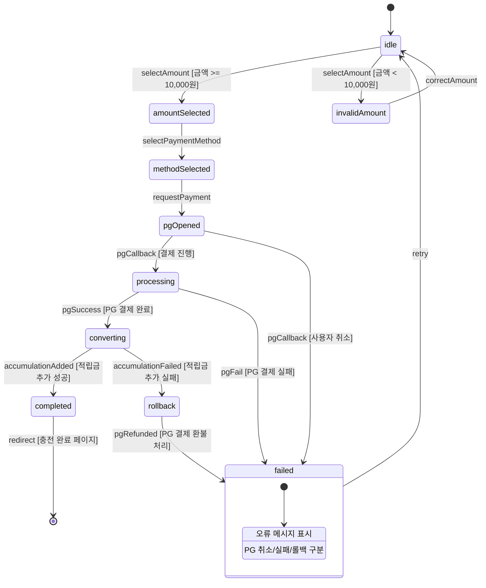
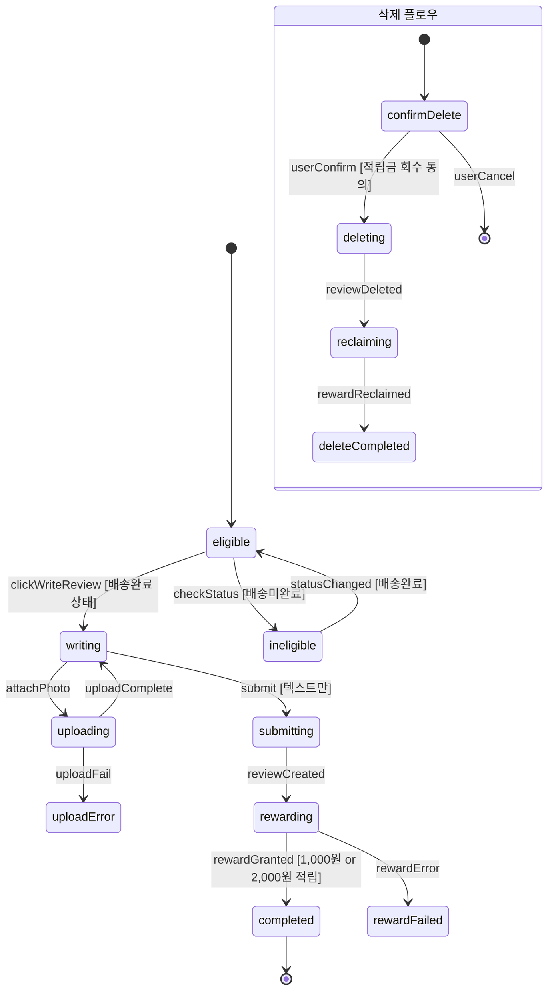
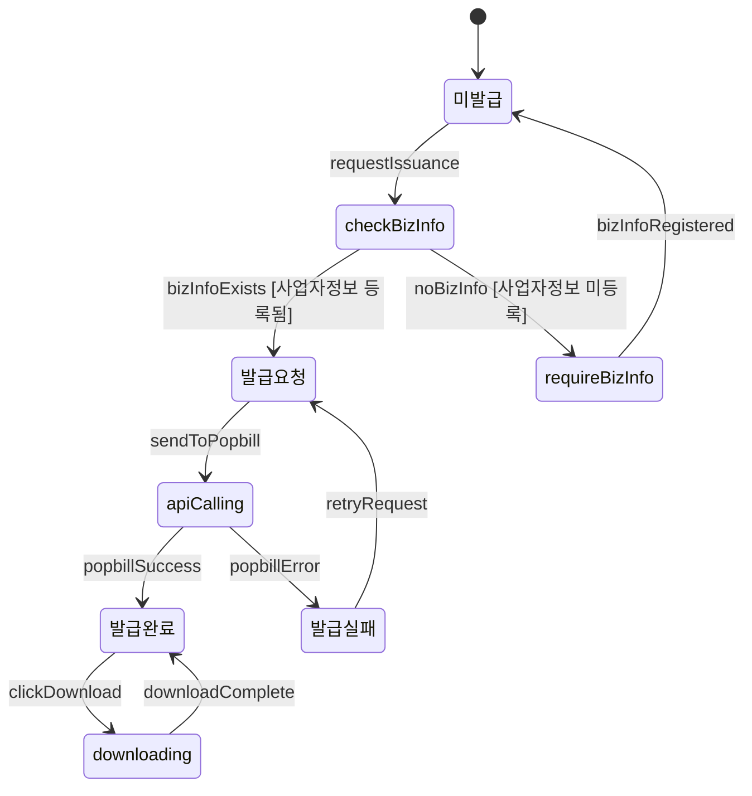
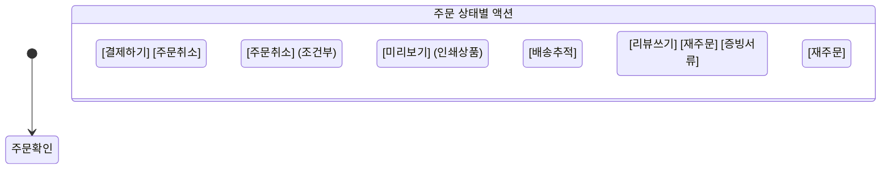
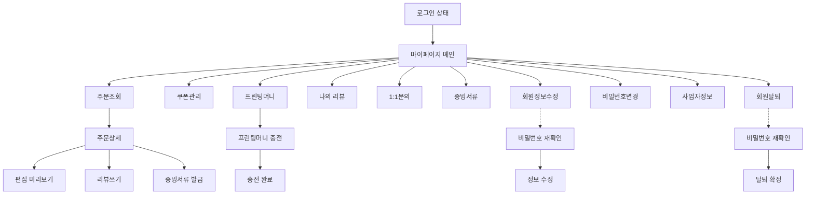

# SPEC-MYPAGE-001: 인터랙션 정의서

> A3-MYPAGE 마이페이지 도메인 상태 머신, 로딩/에러 상태, 조건부 표시 규칙

---

## 1. 상태 머신 (State Machines)

### 1.1 프린팅머니 충전 (MoneyCharge)

### 1.2 리뷰 작성/삭제 + 적립금 (ReviewReward)

### 1.3 증빙서류 발급 (DocumentIssuance)

### 1.4 주문 상태별 액션 (OrderActions)

---

## 2. 로딩/에러 상태

### 2.1 전역 로딩 상태

| 화면 | 로딩 트리거 | 로딩 UI | 타임아웃 |
|------|-----------|---------|---------|
| 주문목록 | 페이지 진입 / 필터 변경 | 주문 카드 스켈레톤 (4개) | 10초 |
| 주문상세 | 페이지 진입 | 전체 스켈레톤 | 10초 |
| 쿠폰목록 | 페이지 진입 / 탭 전환 | 쿠폰 카드 스켈레톤 (3개) | 5초 |
| 프린팅머니 | 페이지 진입 | 잔액 + 내역 스켈레톤 | 5초 |
| 머니충전 결제 | PG 결제 진행 | 결제 진행중 모달 (스피너) | 60초 |
| 리뷰목록 | 페이지 진입 | 리뷰 카드 스켈레톤 (3개) | 5초 |
| 리뷰 사진 업로드 | 사진 첨부 | 프로그레스 바 (각 파일별) | 30초/장 |
| 증빙서류 발급 | 팝빌 API 호출 | 발급 진행중 스피너 | 15초 |

### 2.2 에러 상태

| 에러 유형 | 표시 방식 | 재시도 | 메시지 |
|----------|----------|--------|--------|
| 네트워크 오류 | 토스트 알림 | 자동 재시도 (3회) | "네트워크 연결을 확인해주세요" |
| API 오류 (4xx) | 인라인 메시지 | 수동 | 서버 응답 메시지 표시 |
| API 오류 (5xx) | 에러 페이지 | 수동 (새로고침) | "일시적인 오류가 발생했습니다" |
| PG 결제 실패 | 모달 알림 | 수동 (재결제) | PG사 오류 메시지 |
| 팝빌 API 실패 | 인라인 + 상태 변경 | 수동 (재발급) | "증빙서류 발급에 실패했습니다" |
| 인증 만료 | 리다이렉트 | 재로그인 | 로그인 페이지 이동 |

---

## 3. 조건부 표시 규칙

### 3.1 주문 목록 조건부 규칙

| 조건 | 화면 요소 | 동작 |
|------|----------|------|
| 주문 0건 | 빈 상태 안내 (SCR-MYP-004) | 상품 페이지 CTA 표시 |
| 인쇄 상품 주문 | "미리보기" 버튼 | 썸네일 모달 표시 |
| 굿즈/일반 상품 주문 | "미리보기" 버튼 | 숨김 |
| 입금대기 상태 | "결제하기/주문취소" 버튼 | 활성화 |
| 배송완료 상태 | "리뷰쓰기" 버튼 | 미작성 시만 활성화 |
| 배송완료 상태 | "재주문" 버튼 | 항상 활성화 |
| 배송완료 상태 | "증빙서류" 버튼 | 결제완료 건만 활성화 |

### 3.2 프린팅머니 조건부 규칙

| 조건 | 화면 요소 | 동작 |
|------|----------|------|
| 잔액 > 0 | 잔액 금액 | 금액 표시 (파란색) |
| 잔액 = 0 | 잔액 금액 | "0원" 표시 (회색) |
| 충전 금액 < 10,000원 | 결제 버튼 | 비활성화 + 안내 메시지 |
| 충전 완료 + 쿠폰 자동발급 | 쿠폰 안내 | 발급된 쿠폰 정보 표시 |

### 3.3 리뷰 조건부 규칙

| 조건 | 화면 요소 | 동작 |
|------|----------|------|
| 배송미완료 | 리뷰쓰기 버튼 | 비활성화 + "배송완료 후 작성 가능" 툴팁 |
| 이미 리뷰 작성 | 리뷰쓰기 버튼 | 숨김, 수정/삭제 버튼 표시 |
| 사진 5장 도달 | 사진 추가 버튼 | 비활성화 |
| 사진 10MB 초과 | 사진 업로드 | 차단 + "10MB 이하 파일만 가능" |
| 삭제 시 적립금 존재 | 삭제 확인 | 회수 금액 명시 다이얼로그 |

### 3.4 증빙서류 조건부 규칙

| 조건 | 화면 요소 | 동작 |
|------|----------|------|
| 사업자정보 미등록 | 세금계산서 발급 버튼 | "사업자정보를 먼저 등록해주세요" 안내 |
| 현금/계좌이체 결제 아님 | 현금영수증 발급 버튼 | 숨김 |
| 발급완료 상태 | PDF 다운로드 버튼 | 활성화 |
| 발급실패 상태 | 재발급 버튼 | 활성화 |
| 발급요청 상태 | 모든 버튼 | 비활성화 (처리중) |

### 3.5 쿠폰 조건부 규칙

| 조건 | 화면 요소 | 동작 |
|------|----------|------|
| 사용가능 쿠폰 0개 | 사용가능 탭 | "사용 가능한 쿠폰이 없습니다" |
| 쿠폰 유효기간 7일 이내 | 쿠폰 카드 | "곧 만료" 경고 배지 |
| 쿠폰 코드 빈 값 | 등록 버튼 | 비활성화 |

---

## 4. 마이페이지 네비게이션 Flow

