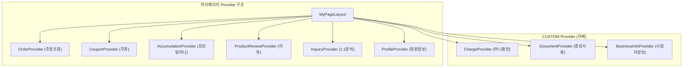
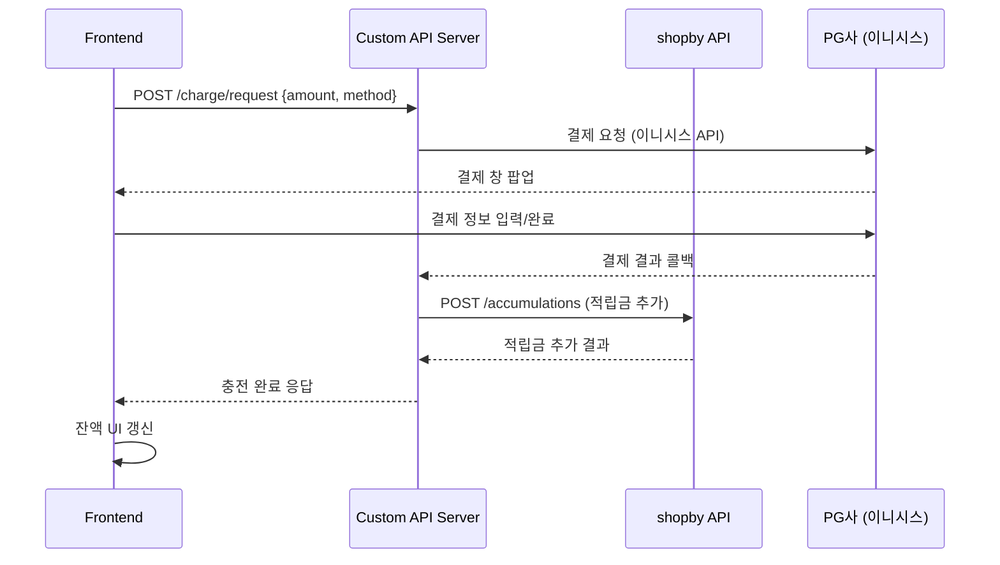
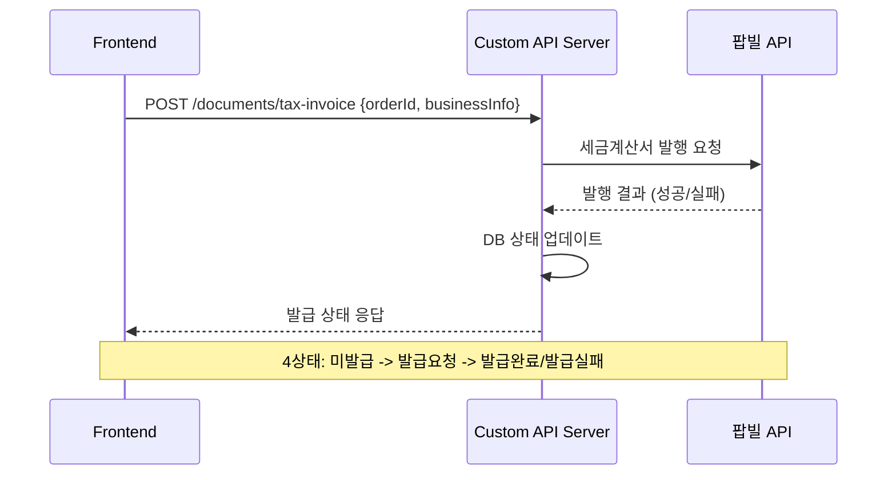

# SPEC-MYPAGE-001: 구현 계획서

> A3-MYPAGE 마이페이지 도메인 구현 전략

---

## 1. 구현 개요

### 1.1 범위

후니프린팅 shopby Enterprise 기반 마이페이지 도메인의 16개 기능을 4개 Phase로 나누어 구현한다. shopby NATIVE/SKIN Provider를 활용하면서 CUSTOM 모듈(편집 미리보기, 머니충전)은 자체 개발한다.

### 1.2 접근 방식

- **Provider 우선**: shopby 공식 Provider(주문, 쿠폰, 적립금, 리뷰, 문의)를 최대한 활용
- **Hybrid 아키텍처**: NATIVE/SKIN은 shopby API, CUSTOM은 별도 서버 로직
- **Mobile-First 설계**: 일반 쇼핑몰 마이페이지이므로 모바일 우선 (인쇄 작업 제외)
- **의존 SPEC 독립성**: ORDER/PAYMENT SPEC 미확정 시에도 인터페이스 기반으로 선행 개발 가능

### 1.3 개발 방법론

DDD (ANALYZE-PRESERVE-IMPROVE) 방식 적용. 기존 Aurora Skin의 마이페이지 코드를 분석 후 점진적으로 개선한다.

---

## 2. 아키텍처 결정사항

### 2.1 Hybrid 배치

| Tier | 해당 기능 | 구현 방식 |
|------|----------|----------|
| Tier 1 (NATIVE) | 쿠폰관리, 1:1문의, 리뷰(기본), 회원정보 | shopby Provider 직접 활용 |
| Tier 1.5 (SKIN) | 주문조회, 프린팅머니(조회), 증빙서류, 사업자정보 | shopby API + 스킨 커스텀 UI |
| Tier 2 (CUSTOM) | 주문상세 편집 미리보기, 머니충전(PG->적립금) | 자체 서버 + 프론트엔드 개발 |

### 2.2 Provider 통합 전략

### 2.3 프린팅머니 충전 아키텍처

### 2.4 팝빌 증빙서류 연동

---

## 3. 구현 단계

### Phase 1: Core MyPage (P1 핵심) - 최우선

**목표**: 마이페이지 레이아웃 + 주문조회 + 회원정보 기반 구축

| TAG | 기능 | 작업 내용 | 완료 조건 | 의존성 |
|-----|------|----------|----------|--------|
| TAG-MYP-001 | MyPage Layout + Navigation | 마이페이지 공통 레이아웃, 좌측 메뉴, 상단 요약(등급/적립금) | 레이아웃 렌더링 + 메뉴 네비게이션 정상 | SPEC-MEMBER-001 (인증) |
| TAG-MYP-002 | 주문조회 + 상세 | 주문 목록, 기간/상태 필터, 주문 상세, 주문상태별 액션 | 주문 필터링 + 상세 조회 동작 | TAG-MYP-001 |
| TAG-MYP-003 | 회원정보수정/비밀번호변경/탈퇴 | 비밀번호 재확인 게이트, 프로필 수정, 비밀번호 변경, 탈퇴 | SPEC-MEMBER-001 연계 기능 정상 | TAG-MYP-001, SPEC-MEMBER-001 |

### Phase 2: Money & Coupon (P1 핵심) - 높음

**목표**: 프린팅머니(조회+충전) + 쿠폰관리 완료

| TAG | 기능 | 작업 내용 | 완료 조건 | 의존성 |
|-----|------|----------|----------|--------|
| TAG-MYP-004 | 프린팅머니 조회 | shopby 적립금 API 연동, 잔액/내역 표시 | 적립/사용/충전 내역 정상 표시 | TAG-MYP-001 |
| TAG-MYP-005 | 프린팅머니 충전 (CUSTOM) | PG 결제 -> 적립금 전환 서버 로직, 결제 UI | 실 결제 -> 적립금 전환 E2E 정상 | TAG-MYP-004, SPEC-PAYMENT |
| TAG-MYP-006 | 쿠폰관리/등록 | shopby 쿠폰 API 연동, 탭 구분, 코드 등록 | 쿠폰 목록/등록/상태 표시 정상 | TAG-MYP-001 |

### Phase 3: Review & Inquiry (P2) - 보통

**목표**: 리뷰(작성/수정/삭제/적립금) + 1:1문의

| TAG | 기능 | 작업 내용 | 완료 조건 | 의존성 |
|-----|------|----------|----------|--------|
| TAG-MYP-007 | 리뷰 목록/작성/수정/삭제 | shopby 상품후기 API, 사진 업로드, 텍스트/포토 구분 | 리뷰 CRUD + 사진 업로드 정상 | TAG-MYP-001 |
| TAG-MYP-008 | 리뷰 적립금 자동지급/회수 | 텍스트 1,000원/포토 2,000원 자동적립, 삭제 시 회수 | 적립/회수 자동 처리 정상 | TAG-MYP-007, TAG-MYP-004 |
| TAG-MYP-009 | 1:1문의 | shopby 1:1문의 API, 문의 작성/목록/상세 | 문의 CRUD + 답변 표시 정상 | TAG-MYP-001 |

### Phase 4: Documents & Business (P1/P2) - 보통

**목표**: 증빙서류 팝빌 연동 + 사업자정보 관리

| TAG | 기능 | 작업 내용 | 완료 조건 | 의존성 |
|-----|------|----------|----------|--------|
| TAG-MYP-010 | 증빙서류 발급내역 | 발급 내역 UI, 4상태 표시, PDF 다운로드 | 발급 내역/상태 표시 정상 | TAG-MYP-001 |
| TAG-MYP-011 | 증빙서류 발급 (팝빌) | 팝빌 API 연동, 세금계산서/현금영수증 발급 | 팝빌 E2E 발급 정상 | TAG-MYP-010 |
| TAG-MYP-012 | 사업자정보/현금영수증정보 | 사업자정보 CRUD, 현금영수증 정보 등록 | 사업자 등록/수정/삭제 정상 | TAG-MYP-001 |

### Phase 5: CUSTOM Enhancement (P1) - 높음

**목표**: 편집 미리보기 CUSTOM 기능

| TAG | 기능 | 작업 내용 | 완료 조건 | 의존성 |
|-----|------|----------|----------|--------|
| TAG-MYP-013 | 주문상세 편집 미리보기 | 인쇄 파일 썸네일 생성/저장 서버, 모달 뷰어 | 미리보기 이미지 정상 표시 | TAG-MYP-002, SPEC-ORDER |

---

## 4. 리스크 및 대응

| 리스크 | 영향도 | 발생 가능성 | 대응 방안 |
|--------|--------|-----------|----------|
| SPEC-ORDER 미확정 시 주문 API 불확실 | 높음 | 중간 | shopby 주문 API 직접 매핑으로 선행 개발, ORDER SPEC 확정 후 정합성 검증 |
| PG 결제 모듈 미준비 | 높음 | 중간 | 머니충전은 PG 모듈과 분리 개발, Mock PG 인터페이스로 선행, SPEC-PAYMENT 확정 후 통합 |
| 팝빌 API 연동 복잡도 | 중간 | 높음 | 팝빌 SDK 서버사이드 래핑, 테스트 환경 사전 구축, 에러 핸들링 강화 |
| 리뷰 적립금 자동지급/회수 동시성 | 중간 | 낮음 | shopby 적립금 API 트랜잭션 보장 확인, 실패 시 수동 보정 프로세스 |
| 기존 Aurora Skin 마이페이지 코드 호환성 | 중간 | 중간 | DDD ANALYZE 단계에서 기존 코드 구조 파악, Provider 래핑으로 최소 변경 |

---

## 5. 기술 스택 (마이페이지 영역)

| 영역 | 기술 | 용도 |
|------|------|------|
| Frontend | React + shopby Aurora Skin | 마이페이지 UI |
| State Management | shopby Provider Context | 주문/쿠폰/적립금/리뷰 상태 |
| Custom State | React Context (자체) | 머니충전/증빙서류/사업자정보 |
| PG 연동 | KG이니시스 (기존 PG) | 프린팅머니 충전 |
| 외부 API | 팝빌 API | 세금계산서/현금영수증 |
| 파일 처리 | (서버사이드) | 인쇄 파일 썸네일 생성 |

---

## 6. Milestone 요약

```mermaid
gantt
    title SPEC-MYPAGE-001 구현 Milestone (우선순위 기반)
    dateFormat X
    axisFormat %s

    section Phase 1: Core
    마이페이지 레이아웃       :a1, 0, 1
    주문조회/상세            :a2, after a1, 2
    회원정보/비밀번호/탈퇴     :a3, after a1, 1

    section Phase 2: Money
    프린팅머니 조회           :b1, after a2, 1
    프린팅머니 충전 CUSTOM    :b2, after b1, 2
    쿠폰관리/등록            :b3, after a2, 1

    section Phase 3: Review
    리뷰 CRUD              :c1, after b1, 2
    리뷰 적립금 자동지급      :c2, after c1, 1
    1:1문의                :c3, after a2, 1

    section Phase 4: Documents
    증빙서류 내역            :d1, after b1, 1
    증빙서류 팝빌 연동        :d2, after d1, 2
    사업자정보               :d3, after d1, 1

    section Phase 5: CUSTOM
    편집 미리보기            :e1, after a2, 2
```

> 참고: 시간 축은 상대적 우선순위를 나타내며, 절대 기간이 아님
