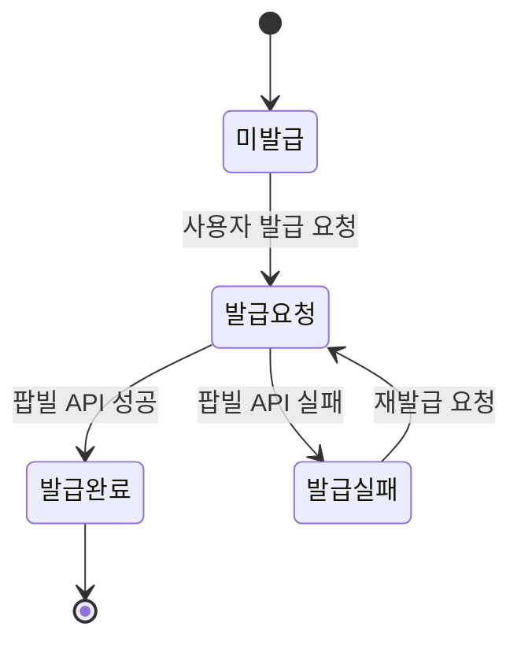

# SPEC-MYPAGE-001 요구사항 분석 (A3-MYPAGE 도메인)

> **작성일**: 2026-03-20
> **SPEC ID**: SPEC-MYPAGE-001
> **대상 도메인**: A3-MYPAGE (마이페이지)
> **플랫폼**: 후니프린팅 shopby Enterprise 기반
> **shopby 구현 방식**: Hybrid (NATIVE/SKIN + CUSTOM 2개)

---

## 목차

1. [핵심 의사결정 사항 (9개)](#1-핵심-의사결정-사항)
2. [모듈 1: 주문조회 (Order History)](#2-모듈-1-주문조회)
3. [모듈 2: 쿠폰관리 (Coupon)](#3-모듈-2-쿠폰관리)
4. [모듈 3: 프린팅머니 (Printing Money)](#4-모듈-3-프린팅머니)
5. [모듈 4: 리뷰 (Review)](#5-모듈-4-리뷰)
6. [모듈 5: 증빙서류 (Document Issuance)](#6-모듈-5-증빙서류)
7. [모듈 6: 사업자정보 (Business Info)](#7-모듈-6-사업자정보)
8. [모듈 7: 1:1문의 (Inquiry)](#8-모듈-7-11문의)
9. [엣지 케이스 및 리스크](#9-엣지-케이스-및-리스크)
10. [크로스 도메인 의존성](#10-크로스-도메인-의존성)

---

## 1. 핵심 의사결정 사항

### KD-MYP-01: 주문조회 필터/정렬 방식 (A-3-1)

**결정 항목**: 기간 필터, 상태 필터, 정렬 기준

**선택 가능 옵션**:
| 항목 | 옵션 | 비고 |
|------|------|------|
| 기간 필터 | 1/3/6/12개월/전체 | 인쇄 업종은 재주문 패턴 有 |
| 상태 필터 | 전체/입금대기/제작진행/배송중/완료/취소 | shopby 기본 상태 + 인쇄 커스텀 상태 |
| 정렬 | 최신순(기본)/금액순 | 최신순 권장 |

**권장 결정**: **기간 5단계 + 상태 6탭 + 최신순 기본**

**근거**:
- 인쇄 B2B 고객은 과거 주문 재주문 빈도 높음 (12개월 필터 필수)
- shopby 주문 API는 기간/상태 파라미터 기본 지원
- 인쇄 특화 상태(제작진행)는 shopby 커스텀 상태 매핑 필요

**shopby 구현 가능 여부**: 기본 필터는 API 지원, 인쇄 상태는 SKIN 커스텀

---

### KD-MYP-02: 주문상세 편집 미리보기 범위 (A-3-2)

**결정 항목**: 인쇄 파일 미리보기 제공 범위

**선택 가능 옵션**:
| 옵션 | 내용 | 개발 규모 | 비용 |
|------|------|----------|------|
| A | 썸네일 이미지만 | M | 서버 썸네일 생성 |
| B | 온라인 뷰어 (PDF 렌더링) | L | PDF.js 연동 |
| C | 풀 에디터 미리보기 | XL | 에디터 엔진 필요 |

**권장 결정**: **옵션 A (썸네일 이미지만)**

**근거**:
- 초기 런칭 시 최소 범위로 시작
- 썸네일 생성은 서버사이드에서 파일 업로드 시 자동 생성 가능
- 풀 에디터는 비용 대비 효용 낮음 (인쇄물은 입고 후 확인)
- 향후 PDF 뷰어 확장 가능

**shopby 구현 가능 여부**: CUSTOM 개발 필수 (shopby 미지원)

---

### KD-MYP-03: 리뷰 보상 금액/방식 (확정)

**결정 항목**: 리뷰 작성 시 보상 금액 및 지급 방식

**확정 결정**:
- 텍스트 리뷰: 적립금(프린팅머니) 1,000원
- 포토 리뷰: 적립금(프린팅머니) 2,000원
- 지급 시점: 즉시 자동지급
- 삭제 시: 자동 회수

**근거**: policy-confirmed.md #14 (리뷰 보상 적립금), #25 (포토리뷰 +1,000원), #15 (즉시 지급), #24 (자동 회수) 확정

**shopby 구현 가능 여부**: shopby 적립금 API 활용, 자동지급/회수는 커스텀 로직 필요

---

### KD-MYP-04: 프린팅머니 충전 결제수단 (A-3-6)

**결정 항목**: 충전 시 사용 가능한 결제수단

**선택 가능 옵션**:
| 옵션 | 결제수단 | 개발 복잡도 |
|------|---------|-----------|
| A | 신용카드만 | 낮음 |
| B | 신용카드 + 계좌이체 | 중간 |
| C | 신용카드 + 계좌이체 + 간편결제 | 높음 |

**권장 결정**: **옵션 B (신용카드 + 계좌이체)**

**근거**:
- B2B 고객은 계좌이체 선호 비율 높음
- 간편결제는 SPEC-PAYMENT 확정 후 추가 도입
- PG(이니시스) 기본 결제수단 범위 내

---

### KD-MYP-05: 프린팅머니 충전 보너스 (A-3-6)

**결정 항목**: 충전 시 추가 보너스 적립금 지급 여부

**선택 가능 옵션**:
| 옵션 | 내용 | 관리 부담 |
|------|------|----------|
| A | 보너스 없음 | 없음 |
| B | 정률 보너스 (충전액 5%) | 낮음 |
| C | 구간별 차등 보너스 | 높음 |

**권장 결정**: **옵션 A (보너스 없음, 초기)**

**근거**:
- 초기 운영 시 재무 영향 예측 어려움
- 충전 시 쿠폰 자동발급(features-data.json extra_notes)으로 대체 가능
- 추후 이벤트성으로 도입 검토

---

### KD-MYP-06: 리뷰 보상 방식 (확정)

**확정 결정**: 적립금(프린팅머니) 즉시 자동지급

**근거**: policy-confirmed.md #23 확정

---

### KD-MYP-07: 리뷰 삭제 시 적립금 회수 (확정)

**확정 결정**: 자동 회수

**근거**: policy-confirmed.md #24 확정

---

### KD-MYP-08: 증빙서류 발급 종류/절차 (A-3-14)

**결정 항목**: 지원 증빙서류 종류 및 발급 절차

**선택 가능 옵션**:
| 항목 | 옵션 |
|------|------|
| 종류 | 세금계산서 + 현금영수증 |
| 발급 채널 | 팝빌 API (B2B 인쇄업 표준) |
| 상태 관리 | 4상태 (미발급/발급요청/발급완료/발급실패) |

**권장 결정**: **세금계산서 + 현금영수증 (팝빌 API 연동)**

**근거**:
- B2B 인쇄 업종 필수 기능 (세금계산서 발급 의무)
- 팝빌은 국내 전자세금계산서 발행 서비스 대표 업체
- features-data.json에서 "4상태 관리" 명시
- 현금 결제 시 현금영수증 의무 발급

---

### KD-MYP-09: 회원정보 수정 범위 (A-3-11)

**결정 항목**: 수정 가능 항목 범위

**선택 가능 옵션**:
| 항목 | 수정 가능 | 근거 |
|------|----------|------|
| 이메일 | 불가 | KD-01 로그인 식별자 (SPEC-MEMBER-001) |
| 이름 | 가능 | 본인 확인 후 변경 허용 |
| 휴대전화 | 가능 | SMS 재인증 필요 |
| 비밀번호 | 별도 화면 | 보안 분리 |
| 마케팅 동의 | 가능 | 수시 변경 허용 |

**권장 결정**: **이름/휴대전화/마케팅동의 수정, 이메일 변경 불가**

**근거**:
- SPEC-MEMBER-001 KD-01에서 이메일 = 로그인 식별자로 확정
- 이메일 변경은 계정 통합 이슈 발생
- 비밀번호 변경은 별도 보안 화면으로 분리

---

## 2. 모듈 1: 주문조회 (Order History)

### 기능 구성

| # | 기능 | shopby 분류 | 크기 | 우선순위 |
|---|------|-----------|------|---------|
| 8 | 주문조회 | SKIN | M | 1순위 |
| - | 주문상세조회(편집 미리보기) | CUSTOM | L | 1순위 |

### shopby API 매핑

- 주문 목록: `GET /orders` (기간/상태 필터 파라미터)
- 주문 상세: `GET /orders/{orderNo}`
- 주문 상태 코드: shopby 기본 + 인쇄 커스텀 상태 매핑

### 인쇄 특화 요구사항

- shopby 기본 주문 상태에 "제작진행" 단계 매핑 필요
- 인쇄 파일 미리보기는 CUSTOM 서버에서 생성한 썸네일 URL 매핑
- 재주문 시 인쇄 옵션(용지/사이즈/코팅 등) 재현 필요

---

## 3. 모듈 2: 쿠폰관리 (Coupon)

### 기능 구성

| # | 기능 | shopby 분류 | 크기 | 우선순위 |
|---|------|-----------|------|---------|
| 10 | 쿠폰관리 | NATIVE | S | 2순위 |
| - | 쿠폰등록 | NATIVE | S | 2순위 |

### 확정 정책 반영

| 정책 | 확정값 | 출처 |
|------|--------|------|
| 신규가입 쿠폰 | 5,000원 | policy-confirmed.md #12 |
| 최소주문금액 | 30,000원 | policy-confirmed.md #13 |
| 동시사용 제한 | 상품1+주문1 (총 2개) | policy-confirmed.md #20 |
| 유효기간 | 30일 | policy-confirmed.md #21 |

### shopby API 매핑

- 쿠폰 목록: `GET /coupons` (usable/used/expired 구분)
- 쿠폰 등록: `POST /coupons/register`

---

## 4. 모듈 3: 프린팅머니 (Printing Money)

### 기능 구성

| # | 기능 | shopby 분류 | 크기 | 우선순위 |
|---|------|-----------|------|---------|
| 11 | 프린팅머니 | SKIN | M | 1순위 |
| - | 머니충전 | CUSTOM | L | 1순위 |

### 프린팅머니 = shopby 적립금 래핑

프린팅머니는 shopby의 적립금(accumulation) API를 래핑한 개념이다:
- 표시명: "프린팅머니" (UI 레벨)
- 실제 데이터: shopby 적립금
- 충전: PG 결제 -> Custom Server -> shopby 적립금 추가 API
- 적립: 리뷰/이벤트 -> shopby 적립금 자동지급
- 사용: 주문 결제 시 적립금 사용 (shopby 기본)

### CUSTOM 모듈: 머니충전

| 항목 | 내용 |
|------|------|
| 개발 범위 | PG 결제 -> 적립금 전환 서버 로직 |
| 결제수단 | 신용카드, 계좌이체 (KD-MYP-04) |
| 최소 충전 | 10,000원 |
| 충전 단위 | 10,000원 / 30,000원 / 50,000원 / 100,000원 / 직접입력 |
| PG사 | KG이니시스 (policy-confirmed.md #7) |
| 부가 기능 | 충전 시 쿠폰 자동발급 (features-data extra_notes) |
| 의존성 | SPEC-PAYMENT (PG 결제 모듈) |

### shopby API 매핑

- 적립금 잔액: `GET /accumulations`
- 적립금 내역: `GET /accumulations/history`
- 적립금 추가 (Admin): `POST /accumulations` (서버사이드)

---

## 5. 모듈 4: 리뷰 (Review)

### 기능 구성

| # | 기능 | shopby 분류 | 크기 | 우선순위 |
|---|------|-----------|------|---------|
| 13 | 나의 리뷰 | NATIVE | M | 2순위 |
| - | 리뷰쓰기(사진업로드) 수정/삭제 | NATIVE | S | 2순위 |

### 확정 정책 반영

| 정책 | 확정값 | 출처 |
|------|--------|------|
| 리뷰 노출 | 즉시 노출 (사후 관리) | policy-confirmed.md #22 |
| 텍스트 리뷰 보상 | 적립금 1,000원 | policy-confirmed.md #14 |
| 포토 리뷰 보상 | 적립금 2,000원 | policy-confirmed.md #14, #25 |
| 보상 지급시점 | 즉시 자동지급 | policy-confirmed.md #15 |
| 삭제 시 처리 | 적립금 자동 회수 | policy-confirmed.md #24 |
| 작성 자격 | 배송완료 건 한정 | features-data.json notes |

### 리뷰 적립금 자동지급/회수 로직

```
리뷰 작성 시:
1. shopby 상품후기 API로 리뷰 등록
2. 사진 첨부 여부 판단
3. shopby 적립금 API로 해당 금액 자동 지급
4. 지급 내역 기록 (리뷰 ID ↔ 적립금 트랜잭션 매핑)

리뷰 삭제 시:
1. 해당 리뷰의 적립금 지급 내역 조회
2. 확인 다이얼로그 표시 (회수 금액 안내)
3. 사용자 확인 시 리뷰 삭제
4. shopby 적립금 차감 API로 자동 회수
```

---

## 6. 모듈 5: 증빙서류 (Document Issuance)

### 기능 구성

| # | 기능 | shopby 분류 | 크기 | 우선순위 |
|---|------|-----------|------|---------|
| 19 | 증빙서류발급내역 | SKIN | M | 1순위 |

### 팝빌 API 연동

| API | 용도 | 엔드포인트 |
|-----|------|-----------|
| 세금계산서 발행 | 전자세금계산서 발급 | `POST /Taxinvoice` |
| 현금영수증 발행 | 현금영수증 자동 발급 | `POST /CashBill` |
| 발급 상태 조회 | 발급 진행 상태 확인 | `GET /Taxinvoice/{mgtKey}` |
| PDF 다운로드 | 발급완료 문서 다운 | `GET /Taxinvoice/{mgtKey}/PDF` |

### 4상태 관리



---

## 7. 모듈 6: 사업자정보 (Business Info)

### 기능 구성

| # | 기능 | shopby 분류 | 크기 | 우선순위 |
|---|------|-----------|------|---------|
| - | 사업자정보(목록/등록) | SKIN | M | 2순위 |
| - | 현금영수증정보 | SKIN | S | 2순위 |

### 사업자정보 데이터 모델

| 필드 | 타입 | 필수 | 유효성 검사 |
|------|------|------|-----------|
| 상호명 | String | Y | 1~50자 |
| 사업자등록번호 | String | Y | 10자리 숫자 + 체크섬 |
| 대표자명 | String | Y | 1~20자 |
| 업태 | String | N | 자유 입력 |
| 종목 | String | N | 자유 입력 |
| 사업장 주소 | String | N | 주소 검색 API |
| 담당자 이메일 | String | N | 이메일 형식 |

### shopby 구현 방식

- shopby 회원 추가필드(customFields)를 활용하여 사업자정보 저장
- 또는 별도 Custom DB 테이블로 관리 (추천)

---

## 8. 모듈 7: 1:1문의 (Inquiry)

### 기능 구성

| # | 기능 | shopby 분류 | 크기 | 우선순위 |
|---|------|-----------|------|---------|
| 15 | 1:1문의 + 문의하기 | NATIVE | S | 2순위 |

### shopby API 매핑

- 문의 목록: `GET /inquiries`
- 문의 등록: `POST /inquiries`
- 문의 상세: `GET /inquiries/{inquiryNo}`
- 문의 유형: 주문/배송/결제/상품/기타

---

## 9. 엣지 케이스 및 리스크

### 프린팅머니 충전 관련

| 엣지 케이스 | 대응 |
|------------|------|
| PG 결제 성공 + 적립금 추가 실패 | 결제 취소 롤백 + 관리자 알림 |
| PG 결제 중 사용자 이탈 | 결제 타임아웃 처리, 미완료 거래 정리 배치 |
| 동시 충전 요청 | 요청별 고유 트랜잭션 ID로 멱등성 보장 |
| 충전 금액 음수 입력 | 프론트/서버 양쪽 최소금액 검증 |

### 리뷰 적립금 관련

| 엣지 케이스 | 대응 |
|------------|------|
| 리뷰 작성 + 적립 성공 + 즉시 삭제 | 적립금 즉시 회수 처리 |
| 적립금 사용 후 리뷰 삭제 (잔액 부족) | 잔액 0원까지만 차감, 나머지는 차기 적립에서 차감 |
| 동일 상품 중복 리뷰 시도 | 서버 측 중복 체크 (주문번호+상품번호 unique) |

### 증빙서류 관련

| 엣지 케이스 | 대응 |
|------------|------|
| 팝빌 API 장애 | 발급실패 상태로 전환, 재시도 안내 |
| 사업자정보 미등록 시 세금계산서 요청 | 사업자정보 등록 유도 |
| 취소/환불 주문 증빙서류 | 수정세금계산서 발행 (마이너스) |

---

## 10. 크로스 도메인 의존성

### SPEC-MEMBER-001 의존

| 기능 | 의존 내용 | 방향 |
|------|----------|------|
| 마이페이지 진입 | MemberProvider 인증 상태 | 읽기 |
| 회원정보수정 | ProfileProvider, ChangePasswordProvider | 읽기/쓰기 |
| 회원탈퇴 | WithdrawalProvider, 적립금 소멸 | 쓰기 |
| 회원등급 표시 | MemberGradeProvider | 읽기 |

### SPEC-ORDER-001 의존 (미정)

| 기능 | 의존 내용 | 방향 |
|------|----------|------|
| 주문조회 | 주문 목록/상세 API | 읽기 |
| 재주문 | 장바구니 추가 API | 쓰기 |
| 증빙서류 | 주문 결제 정보 | 읽기 |
| 리뷰 작성 | 배송완료 상태 확인 | 읽기 |

### SPEC-PAYMENT-001 의존 (미정)

| 기능 | 의존 내용 | 방향 |
|------|----------|------|
| 머니충전 | PG 결제 모듈 | 호출 |
