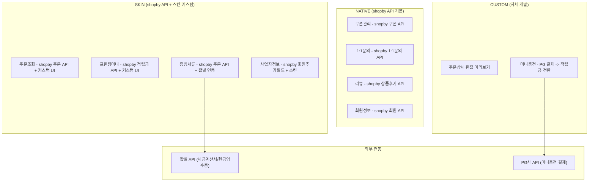
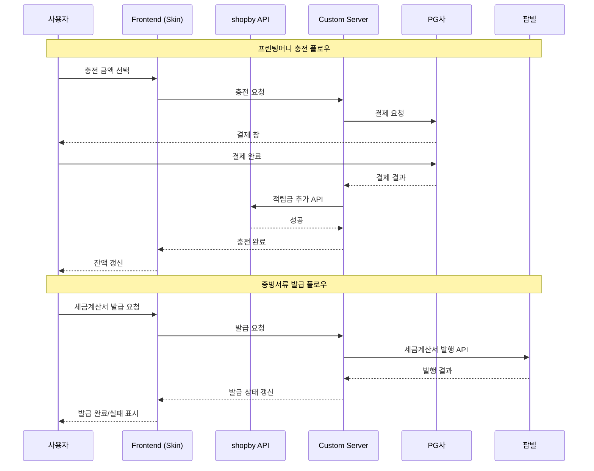
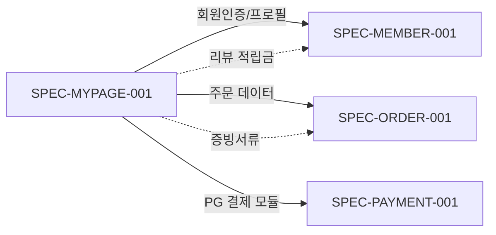

# SPEC-MYPAGE-001: A3-MYPAGE 마이페이지 도메인

> 후니프린팅 shopby Enterprise 기반 마이페이지 시스템 (16개 기능, 7개 모듈)

---

## HISTORY

| 버전 | 일자 | 작성자 | 변경 내용 |
|------|------|--------|----------|
| 1.0.0 | 2026-03-20 | MoAI (manager-spec) | 초기 SPEC 작성 - 7개 모듈, 16개 기능 정의 |

---

## 1. 개요

### 1.1 목적

후니프린팅 shopby Enterprise 마이그레이션에서 마이페이지(A3-MYPAGE) 도메인의 전체 기능을 정의한다. 주문조회, 쿠폰관리, 프린팅머니, 리뷰, 증빙서류, 회원정보, 사업자정보 기능을 포괄하며, shopby NATIVE/SKIN Provider 활용과 CUSTOM 모듈 자체 개발의 Hybrid 접근을 따른다.

### 1.2 범위

- **포함**: 주문조회/상세, 쿠폰관리/등록, 프린팅머니(조회/충전), 리뷰(목록/작성/수정/삭제), 1:1문의, 회원정보수정, 비밀번호변경, 회원탈퇴, 증빙서류발급, 사업자정보, 현금영수증정보
- **제외**: 주문/결제 프로세스(SPEC-ORDER), 상품상세 리뷰 탭(SPEC-PRODUCT), 관리자 주문관리(SPEC-ADMIN-ORDER)

### 1.3 SPEC-PLAN-001과의 관계

본 SPEC은 SPEC-PLAN-001 v1.1.0 마스터 기획서의 A3-MYPAGE 도메인 정책을 구현 수준으로 구체화한 문서이다. 정책 체크리스트의 A-3-1 ~ A-3-15 항목을 포괄한다.

### 1.4 의존 SPEC

| SPEC | 의존 내용 | 의존 유형 |
|------|----------|----------|
| SPEC-MEMBER-001 | 회원 인증/프로필 데이터, 비밀번호 변경, 회원탈퇴 | 읽기/쓰기 |
| SPEC-ORDER-001 (미정) | 주문 데이터, 주문 상태 코드, 배송 추적 | 읽기 |
| SPEC-PAYMENT-001 (미정) | PG 결제 모듈 (머니충전 시 사용) | 호출 |

---

## 2. 핵심 의사결정 요약

| KD ID | 항목 | 권장 결정 | 근거 요약 | 상태 |
|-------|------|----------|----------|------|
| KD-MYP-01 | 주문조회 필터/정렬 | 기간(1/3/6/12개월)+상태필터+최신순 | 인쇄 업종 재주문 패턴 지원 | 미결정 |
| KD-MYP-02 | 편집 미리보기 범위 | 썸네일 이미지만 (CUSTOM) | 풀 에디터 비용 과다, 초기는 이미지 미리보기 | 미결정 |
| KD-MYP-03 | 프린팅머니 적립 정책 | 리뷰 텍스트 1,000원 / 포토 2,000원 | 확정 정책 반영 (policy-confirmed.md #14, #25) | 확정 |
| KD-MYP-04 | 프린팅머니 충전 수단 | 신용카드/계좌이체/간편결제 | PG 결제 모듈 연동, 최소 충전 10,000원 | 미결정 |
| KD-MYP-05 | 머니 충전 보너스 | 없음 (초기), 추후 이벤트성 도입 | 초기 운영 부담 최소화 | 미결정 |
| KD-MYP-06 | 리뷰 보상 방식 | 적립금(프린팅머니) 즉시 자동지급 | 확정 정책 (policy-confirmed.md #23, #15) | 확정 |
| KD-MYP-07 | 리뷰 삭제 시 회수 | 적립금 자동 회수 | 확정 정책 (policy-confirmed.md #24) | 확정 |
| KD-MYP-08 | 증빙서류 발급 종류 | 세금계산서 + 현금영수증 (팝빌 API) | B2B 인쇄 업종 필수, 4상태 관리 | 미결정 |
| KD-MYP-09 | 회원정보 수정 범위 | 이름/휴대전화/마케팅동의 (이메일 변경 불가) | SPEC-MEMBER-001 KD-05 연계, 이메일 = 식별자 | 미결정 |

> KD-MYP-03, KD-MYP-06, KD-MYP-07은 policy-confirmed.md 기반 확정. 나머지는 상세 분석 후 결정 필요.

---

## 3. EARS 요구사항

### 3.1 모듈 1: 주문조회 (Order History) - 4개 기능

#### REQ-MYP-001 [Ubiquitous] 주문 목록 기본 표시

시스템은 항상 로그인 회원의 주문 목록을 최신순으로 표시해야 한다.

#### REQ-MYP-002 [Event-Driven] 주문 기간 필터링

WHEN 사용자가 기간 필터(1개월/3개월/6개월/12개월/전체)를 선택하면 THEN 시스템은 해당 기간 내 주문만 표시해야 한다.

#### REQ-MYP-003 [Event-Driven] 주문 상태 필터링

WHEN 사용자가 주문 상태 탭(전체/입금대기/제작진행/배송중/완료/취소)을 선택하면 THEN 시스템은 해당 상태의 주문만 필터링해야 한다.

#### REQ-MYP-004 [Event-Driven] 주문 상세 조회

WHEN 사용자가 주문 목록에서 특정 주문을 클릭하면 THEN 시스템은 주문 상세 정보(상품명, 옵션, 수량, 금액, 상태, 배송정보)를 표시해야 한다.

#### REQ-MYP-005 [Event-Driven] 편집 미리보기 (CUSTOM)

WHEN 사용자가 인쇄 상품 주문의 "미리보기" 버튼을 클릭하면 THEN 시스템은 업로드된 인쇄 파일의 썸네일 이미지를 모달로 표시해야 한다.

#### REQ-MYP-006 [State-Driven] 빈 주문 목록 안내

IF 조회 기간 내 주문이 없으면 THEN 시스템은 "주문 내역이 없습니다" 안내와 함께 상품 페이지 이동 버튼을 표시해야 한다.

#### REQ-MYP-007 [Event-Driven] 재주문

WHEN 사용자가 완료된 주문에서 "재주문" 버튼을 클릭하면 THEN 시스템은 동일 옵션으로 장바구니에 상품을 추가해야 한다.

#### REQ-MYP-008 [Event-Driven] 주문 상태별 액션

WHEN 주문 상태가 "입금대기"이면 THEN 시스템은 "결제하기/주문취소" 버튼을 제공하고, IF 주문 상태가 "배송완료"이면 THEN "리뷰쓰기/재주문" 버튼을 제공해야 한다.

### 3.2 모듈 2: 쿠폰관리 (Coupon) - 2개 기능

#### REQ-MYP-009 [Ubiquitous] 쿠폰 목록 표시

시스템은 항상 로그인 회원의 보유 쿠폰을 사용가능/사용완료/만료 탭으로 구분하여 표시해야 한다.

#### REQ-MYP-010 [Event-Driven] 쿠폰 정보 표시

WHEN 쿠폰 목록이 표시되면 THEN 시스템은 각 쿠폰의 이름, 할인금액, 최소주문금액, 유효기간, 적용 가능 상품을 표시해야 한다.

#### REQ-MYP-011 [Event-Driven] 쿠폰 코드 등록

WHEN 사용자가 쿠폰 코드를 입력하고 등록 버튼을 클릭하면 THEN 시스템은 유효한 경우 쿠폰을 보유 목록에 추가하고 성공 메시지를 표시해야 한다.

#### REQ-MYP-012 [Unwanted] 비로그인 쿠폰 등록 차단

시스템은 비로그인 상태에서 쿠폰을 등록하지 않아야 한다.

#### REQ-MYP-013 [Event-Driven] 쿠폰 동시 사용 제한

WHEN 사용자가 결제 시 쿠폰을 선택하면 THEN 시스템은 상품쿠폰 1개 + 주문쿠폰 1개(총 2개)까지만 적용을 허용해야 한다.

### 3.3 모듈 3: 프린팅머니 (Printing Money) - 2개 기능

#### REQ-MYP-014 [Ubiquitous] 프린팅머니 잔액 표시

시스템은 항상 마이페이지 상단에 회원의 프린팅머니(적립금) 잔액을 표시해야 한다.

#### REQ-MYP-015 [Event-Driven] 프린팅머니 내역 조회

WHEN 사용자가 프린팅머니 메뉴를 클릭하면 THEN 시스템은 적립/사용/충전 내역을 날짜순으로 표시해야 한다.

#### REQ-MYP-016 [Event-Driven] 프린팅머니 내역 구분

WHEN 프린팅머니 내역이 표시되면 THEN 시스템은 각 내역의 유형(적립/사용/충전/환불/회수), 금액, 일시, 관련 주문번호를 표시해야 한다.

#### REQ-MYP-017 [Event-Driven] 프린팅머니 충전 (CUSTOM)

WHEN 사용자가 충전 금액을 선택하고 결제를 완료하면 THEN 시스템은 PG 결제 금액을 프린팅머니(shopby 적립금)로 전환하여 잔액에 반영해야 한다.

#### REQ-MYP-018 [State-Driven] 최소 충전 금액 제한

IF 입력된 충전 금액이 10,000원 미만이면 THEN 시스템은 "최소 충전 금액은 10,000원입니다" 안내를 표시하고 결제를 차단해야 한다.

#### REQ-MYP-019 [Event-Driven] 충전 시 쿠폰 자동 발급

WHEN 프린팅머니 충전이 완료되면 THEN 시스템은 충전 금액에 따른 쿠폰을 자동 발급해야 한다.

#### REQ-MYP-020 [Unwanted] 프린팅머니 마이너스 잔액 방지

시스템은 프린팅머니 잔액이 0 미만이 되는 사용을 허용하지 않아야 한다.

### 3.4 모듈 4: 리뷰 (Review) - 2개 기능

#### REQ-MYP-021 [Event-Driven] 나의 리뷰 목록 조회

WHEN 사용자가 "나의 리뷰" 메뉴를 클릭하면 THEN 시스템은 작성한 리뷰 목록(상품명, 작성일, 평점, 텍스트/포토 구분)을 표시해야 한다.

#### REQ-MYP-022 [State-Driven] 리뷰 작성 자격 검증

IF 주문 상태가 "배송완료"가 아니면 THEN 시스템은 리뷰 작성 버튼을 비활성화하고 "배송완료 후 작성 가능합니다" 안내를 표시해야 한다.

#### REQ-MYP-023 [Event-Driven] 텍스트 리뷰 작성

WHEN 사용자가 리뷰를 텍스트로만 작성하고 등록하면 THEN 시스템은 리뷰를 즉시 등록하고 프린팅머니 1,000원을 자동 적립해야 한다.

#### REQ-MYP-024 [Event-Driven] 포토 리뷰 작성

WHEN 사용자가 사진을 첨부하여 리뷰를 작성하고 등록하면 THEN 시스템은 리뷰를 즉시 등록하고 프린팅머니 2,000원을 자동 적립해야 한다.

#### REQ-MYP-025 [Event-Driven] 리뷰 수정

WHEN 사용자가 기존 리뷰의 수정 버튼을 클릭하면 THEN 시스템은 리뷰 편집 폼을 표시하고 수정 후 저장을 허용해야 한다.

#### REQ-MYP-026 [Event-Driven] 리뷰 삭제 + 적립금 자동 회수

WHEN 사용자가 리뷰를 삭제하면 THEN 시스템은 해당 리뷰에 대해 지급된 적립금을 자동 회수(차감)하고 "리뷰 삭제 시 적립금이 회수됩니다" 확인 다이얼로그를 사전에 표시해야 한다.

#### REQ-MYP-027 [Unwanted] 중복 리뷰 차단

시스템은 동일 주문 상품에 대해 2건 이상의 리뷰 등록을 허용하지 않아야 한다.

#### REQ-MYP-028 [Event-Driven] 리뷰 사진 업로드

WHEN 사용자가 리뷰 작성 시 사진 첨부 버튼을 클릭하면 THEN 시스템은 최대 5장, 각 10MB 이하의 이미지 업로드를 허용해야 한다.

### 3.5 모듈 5: 증빙서류 (Document Issuance) - 2개 기능

#### REQ-MYP-029 [Event-Driven] 증빙서류 발급 내역 조회

WHEN 사용자가 "증빙서류" 메뉴를 클릭하면 THEN 시스템은 세금계산서/현금영수증 발급 내역(발급일, 주문번호, 금액, 상태)을 표시해야 한다.

#### REQ-MYP-030 [Event-Driven] 세금계산서 발급 요청

WHEN 사용자가 결제 완료된 주문에서 세금계산서 발급을 요청하면 THEN 시스템은 사업자정보를 확인하고 팝빌 API를 통해 발급을 요청해야 한다.

#### REQ-MYP-031 [Event-Driven] 현금영수증 발급 요청

WHEN 사용자가 현금/계좌이체 결제 주문에서 현금영수증 발급을 요청하면 THEN 시스템은 팝빌 API를 통해 자동 발급해야 한다.

#### REQ-MYP-032 [Ubiquitous] 증빙서류 4상태 관리

시스템은 항상 증빙서류를 4가지 상태(미발급/발급요청/발급완료/발급실패)로 관리해야 한다.

#### REQ-MYP-033 [Event-Driven] 증빙서류 PDF 다운로드

WHEN 사용자가 발급완료 상태의 증빙서류에서 "다운로드" 버튼을 클릭하면 THEN 시스템은 해당 서류의 PDF 파일을 다운로드해야 한다.

### 3.6 모듈 6: 사업자정보 (Business Info) - 2개 기능

#### REQ-MYP-034 [Event-Driven] 사업자정보 목록 조회

WHEN 사용자가 "사업자정보" 메뉴를 클릭하면 THEN 시스템은 등록된 사업자정보 목록(상호명, 사업자등록번호, 대표자명)을 표시해야 한다.

#### REQ-MYP-035 [Event-Driven] 사업자정보 등록

WHEN 사용자가 사업자정보를 입력하고 등록 버튼을 클릭하면 THEN 시스템은 사업자등록번호 유효성을 검증하고 정보를 저장해야 한다.

#### REQ-MYP-036 [Event-Driven] 사업자정보 수정/삭제

WHEN 사용자가 기존 사업자정보의 수정/삭제를 요청하면 THEN 시스템은 변경사항을 반영하고 연관된 증빙서류 발급 정보를 갱신해야 한다.

#### REQ-MYP-037 [Event-Driven] 현금영수증 정보 등록

WHEN 사용자가 현금영수증 발급용 정보(휴대전화/사업자번호)를 등록하면 THEN 시스템은 해당 정보를 저장하고 이후 현금 결제 시 자동 발급에 활용해야 한다.

### 3.7 모듈 7: 1:1문의 (Inquiry) - 1개 기능

#### REQ-MYP-038 [Event-Driven] 1:1문의 목록 조회

WHEN 사용자가 "1:1문의" 메뉴를 클릭하면 THEN 시스템은 문의 목록(제목, 작성일, 답변상태)을 최신순으로 표시해야 한다.

#### REQ-MYP-039 [Event-Driven] 문의 작성

WHEN 사용자가 문의 유형(주문/배송/결제/상품/기타)을 선택하고 제목/내용을 입력하면 THEN 시스템은 문의를 등록하고 관리자에게 알림을 발송해야 한다.

#### REQ-MYP-040 [Event-Driven] 문의 상세 조회

WHEN 사용자가 문의 목록에서 특정 문의를 클릭하면 THEN 시스템은 문의 내용과 관리자 답변(있는 경우)을 표시해야 한다.

### 3.8 모듈 8: 회원계정 (Account) - 3개 기능 (SPEC-MEMBER-001 연계)

> 회원정보수정, 비밀번호변경, 회원탈퇴는 SPEC-MEMBER-001에서 기능이 정의되어 있으나, 마이페이지 UI에서 접근하므로 화면 레벨 요구사항을 별도 정의한다.

#### REQ-MYP-041 [Event-Driven] 비밀번호 재확인 게이트

WHEN 사용자가 "회원정보수정" 메뉴를 클릭하면 THEN 시스템은 먼저 현재 비밀번호 입력 폼을 표시하고, 인증 성공 후에만 정보 수정 화면으로 이동해야 한다.

#### REQ-MYP-042 [Event-Driven] 회원정보 수정

WHEN 사용자가 이름, 휴대전화, 마케팅 수신동의를 수정하고 저장하면 THEN 시스템은 변경 정보를 반영하고 성공 메시지를 표시해야 한다.

#### REQ-MYP-043 [Unwanted] 이메일 변경 차단

시스템은 회원정보 수정 화면에서 이메일(로그인 식별자) 변경을 허용하지 않아야 한다.

#### REQ-MYP-044 [Event-Driven] 비밀번호 변경

WHEN 사용자가 현재 비밀번호와 새 비밀번호를 입력하고 변경 버튼을 클릭하면 THEN 시스템은 비밀번호를 변경하고 재로그인을 안내해야 한다.

#### REQ-MYP-045 [Event-Driven] 회원탈퇴

WHEN 사용자가 탈퇴 사유를 선택하고 비밀번호 확인 후 탈퇴를 확정하면 THEN 시스템은 적립금 소멸 및 탈퇴 처리를 완료하고 메인 페이지로 이동해야 한다.

---

## 4. 비기능 요구사항

### 4.1 성능

| 항목 | 기준 |
|------|------|
| 주문 목록 로딩 | 2초 이내 (20건 페이지네이션) |
| 프린팅머니 충전 처리 | PG 응답 포함 5초 이내 |
| 리뷰 이미지 업로드 | 5장 기준 10초 이내 |
| 증빙서류 발급 요청 | 팝빌 API 응답 3초 이내 |

### 4.2 보안

- 마이페이지 전체 인증 필수 (미로그인 시 로그인 페이지로 리다이렉트)
- 민감 정보(사업자번호, 휴대전화) 마스킹 표시
- 프린팅머니 충전 시 PG 결제 보안 표준 준수
- 증빙서류 발급 시 팝빌 API 인증 키 서버사이드 관리

### 4.3 접근성

- WCAG 2.1 AA 준수 (키보드 탐색, 스크린 리더)
- 모바일 터치 타겟 최소 44px

---

## 5. 아키텍처 개요

### 5.1 Hybrid 배치

### 5.2 데이터 흐름

---

## 6. 크로스 도메인 의존성

| 의존 관계 | 영향 범위 | 대응 방안 |
|----------|----------|----------|
| MEMBER 인증 → 마이페이지 진입 | 전 모듈 | MemberProvider 래핑, 미인증 리다이렉트 |
| ORDER 데이터 → 주문조회 | 모듈 1 | shopby 주문 API 직접 호출, ORDER SPEC 미정 시 API 매핑 선행 |
| PAYMENT PG → 머니충전 | 모듈 3 | PG 결제 모듈 분리 개발, PAYMENT SPEC 확정 후 통합 |
| 팝빌 API → 증빙서류 | 모듈 5 | 팝빌 SDK 서버사이드 연동, API 키 환경변수 관리 |

---

## 7. Traceability

| 요구사항 | 화면 | 수용기준 | 구현 TAG |
|----------|------|---------|---------|
| REQ-MYP-001~008 | SCR-MYP-001~005 | AC-MYP-001~005 | TAG-MYP-001 |
| REQ-MYP-009~013 | SCR-MYP-006~007 | AC-MYP-006~007 | TAG-MYP-002 |
| REQ-MYP-014~020 | SCR-MYP-008~010 | AC-MYP-008~010 | TAG-MYP-003 |
| REQ-MYP-021~028 | SCR-MYP-011~013 | AC-MYP-011~013 | TAG-MYP-004 |
| REQ-MYP-029~033 | SCR-MYP-014~016 | AC-MYP-014~015 | TAG-MYP-005 |
| REQ-MYP-034~037 | SCR-MYP-017~019 | AC-MYP-016~017 | TAG-MYP-006 |
| REQ-MYP-038~040 | SCR-MYP-020~021 | AC-MYP-018 | TAG-MYP-007 |
| REQ-MYP-041~045 | SCR-MYP-022~025 | AC-MYP-019~021 | TAG-MYP-008 |
