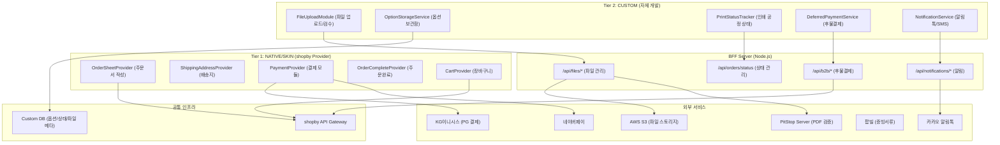
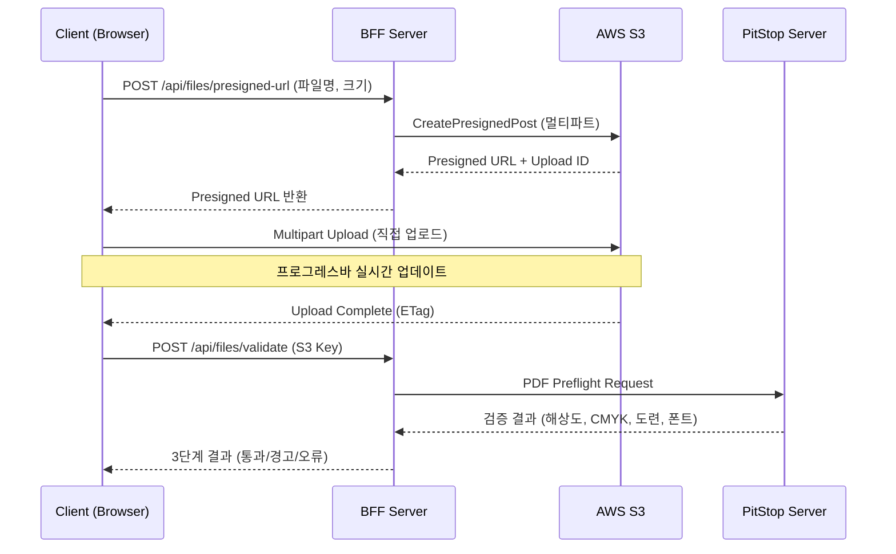
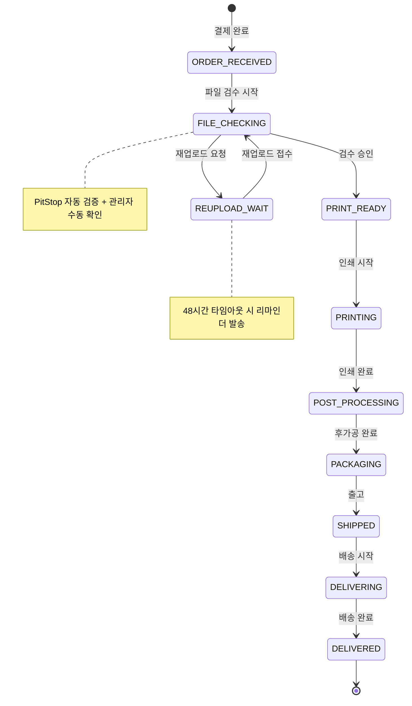
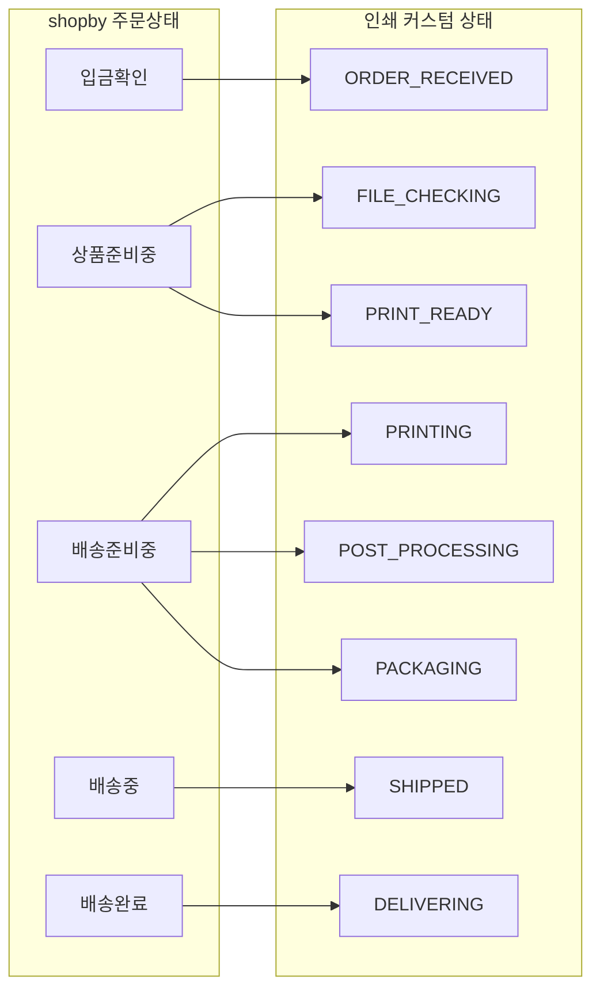
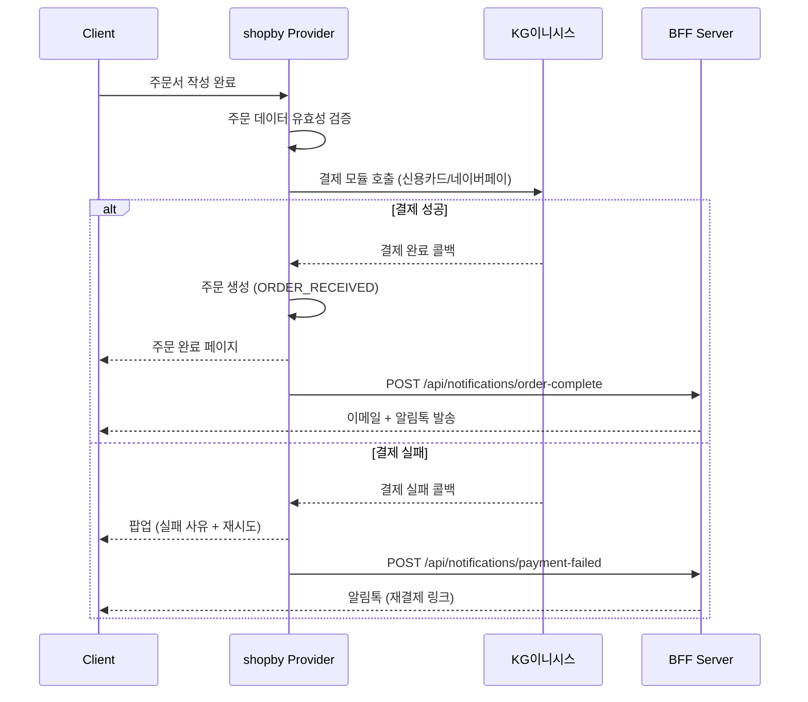
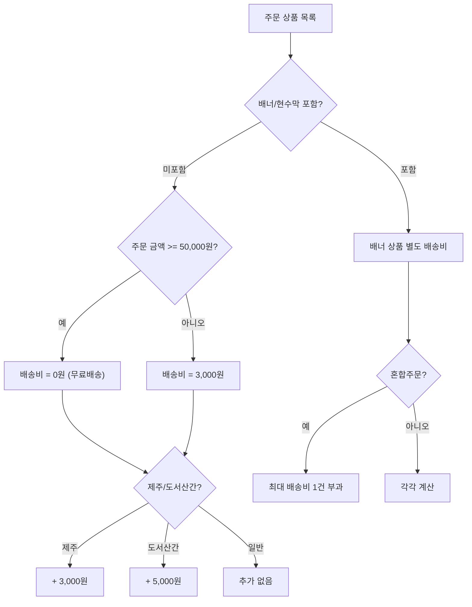
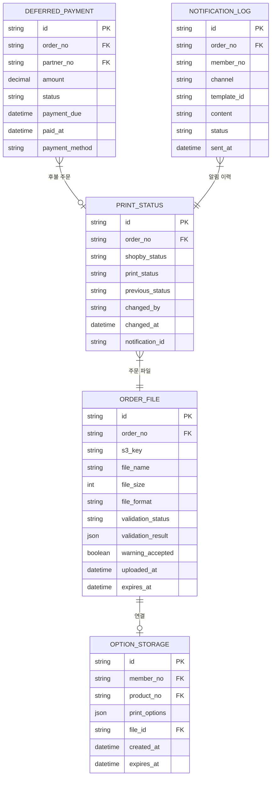

# SPEC-ORDER-001: A6B8-ORDER 아키텍처 설계

> 후니프린팅 주문관리 도메인 (15개 기능) 기술 아키텍처

---

## 1. 시스템 아키텍처 개요

### 1.1 Hybrid 아키텍처에서의 위치

### 1.2 핵심 설계 원칙

| 원칙 | 내용 |
|------|------|
| Provider 보존 | shopby 공식 Provider(Order, Cart, Shipping)는 수정하지 않고 래핑만 수행 |
| BFF 분리 | 인쇄 특화 로직(파일, 상태, 알림)은 BFF에서 처리, shopby API와 분리 |
| 이벤트 기반 동기화 | shopby 주문상태와 인쇄 커스텀 상태는 이벤트 기반으로 동기화 |
| Presigned URL | 파일 업로드/다운로드는 Presigned URL로 S3 직접 접근, BFF 부하 최소화 |
| 알림톡 우선 | 모든 고객 알림은 알림톡 우선, 실패 시 SMS 자동 폴백 |

---

## 2. 파일 업로드 아키텍처

### 2.1 업로드 시퀀스

### 2.2 파일 검증 항목

| 항목 | 검증 기준 | 오류 시 결과 |
|------|----------|------------|
| 해상도 | 300 DPI (대형은 100~150 DPI) | 경고: 인쇄 품질 저하 가능 |
| 컬러모드 | CMYK 필수 | 오류: RGB -> CMYK 변환 필요 |
| 도련(bleed) | 사방 3mm | 경고: 흰색 테두리 노출 가능 |
| 안전영역 | 재단선 안쪽 3mm | 경고: 콘텐츠 잘림 가능 |
| 폰트 | 아웃라인 변환/임베드 | 오류: 텍스트 깨짐 |
| 포맷 | PDF/AI/PSD/JPG/PNG | 오류: 지원하지 않는 포맷 |
| 파일 크기 | 300MB/파일, 1GB/주문 | 오류: 크기 초과 |
| 오버프린트 | 확인 (특히 흰색 오브젝트) | 경고: 인쇄 누락 가능 |

---

## 3. 인쇄 공정 상태 머신

### 3.1 상태 전이 다이어그램

### 3.2 shopby 상태 매핑

### 3.3 상태 변경 시 알림

| 상태 전이 | 알림 방식 | 알림 내용 |
|-----------|----------|----------|
| -> ORDER_RECEIVED | 이메일 + 알림톡 | 주문번호, 예상 제작일 |
| -> PRINT_READY | 알림톡 | 파일 확인 완료, 제작 시작 |
| -> REUPLOAD_WAIT | 알림톡 + SMS | 문제 내용, 재업로드 링크 |
| -> SHIPPED | 알림톡 | 송장번호, 배송조회 링크 |
| -> DELIVERED | 알림톡 | 배송 완료, 리뷰 유도 |

---

## 4. 결제 아키텍처

### 4.1 결제 플로우

### 4.2 배송비 계산 로직

---

## 5. 데이터 모델

### 5.1 커스텀 DB 테이블

---

## 6. BFF API 설계

### 6.1 엔드포인트 목록

| 엔드포인트 | Method | 설명 | 인증 |
|-----------|--------|------|------|
| `/api/files/presigned-url` | POST | S3 Presigned URL 발급 | 회원 |
| `/api/files/validate` | POST | PitStop 검증 요청 | 회원 |
| `/api/files/validate/:fileId` | GET | 검증 결과 조회 | 회원 |
| `/api/files/template/:productNo` | GET | PDF 가이드라인 다운로드 | 공개 |
| `/api/storage` | GET/POST/DELETE | 옵션보관함 CRUD | 회원 |
| `/api/orders/status` | GET | 인쇄 공정 상태 조회 | 회원 |
| `/api/orders/status` | PUT | 상태 변경 (관리자) | 관리자 |
| `/api/orders/status/batch` | PUT | 일괄 상태 변경 | 관리자 |
| `/api/orders/print-sheet/:orderNo` | GET | 주문서 PDF 생성 | 관리자 |
| `/api/notifications/send` | POST | 알림톡/SMS 발송 | 관리자 |
| `/api/notifications/batch` | POST | 일괄 발송 | 관리자 |
| `/api/b2b/deferred` | GET/POST/PUT | 후불결제 관리 | 관리자 |
| `/api/receipts/tax-invoice` | POST | 세금계산서 발급 | 관리자 |
| `/api/receipts/cash-receipt` | POST | 현금영수증 발급 | 관리자 |

### 6.2 인증/인가

- 회원 API: shopby accessToken 검증 (JWT)
- 관리자 API: shopby Admin Token + 역할 검증
- 파일 접근: S3 Presigned URL (15분 만료)

---

## 7. 보안 고려사항

| 항목 | 대응 |
|------|------|
| 파일 업로드 악용 | 허용 포맷 화이트리스트, 파일 크기 제한, 바이러스 스캔 |
| 결제 정보 보안 | PG 위임, 카드번호 미저장, PCI-DSS 준수 |
| 주문 데이터 암호화 | HTTPS 전송, AES-256 저장 |
| API 인증 | JWT 토큰 검증, 역할 기반 접근 제어 |
| S3 접근 제어 | Presigned URL (15분), IAM 역할, 버킷 정책 |
| CSRF 방지 | SameSite 쿠키, CSRF 토큰 |
