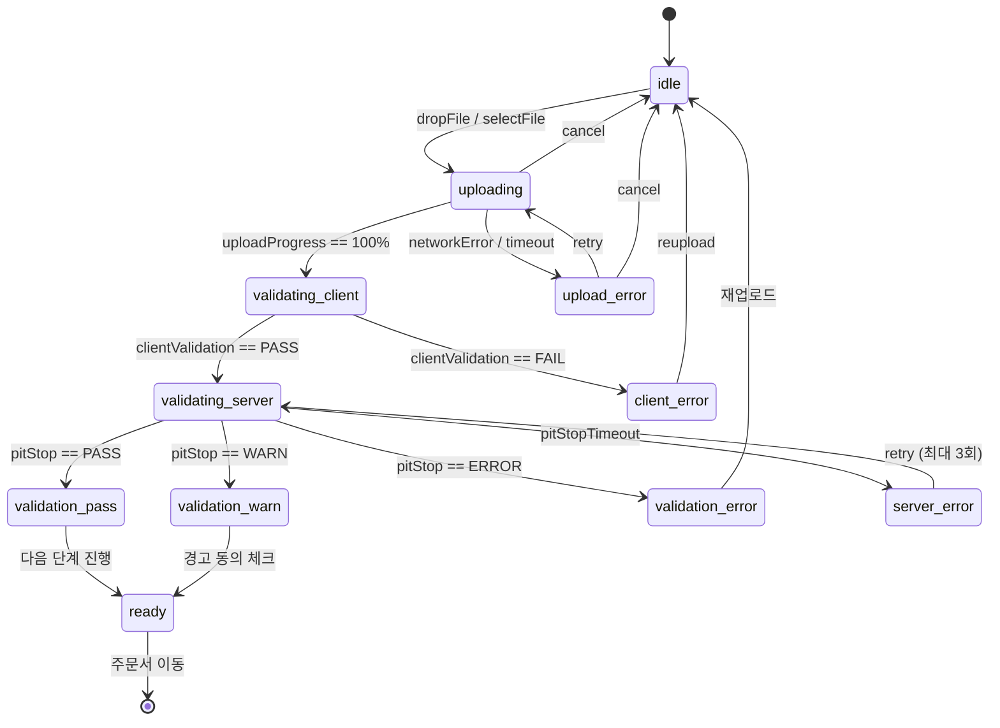
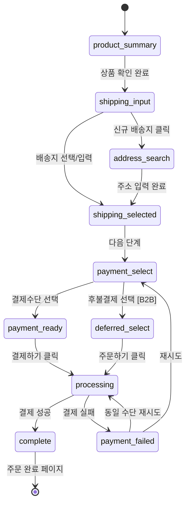
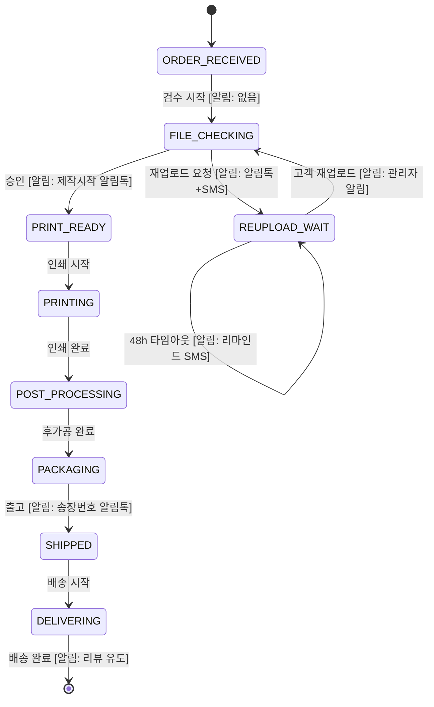
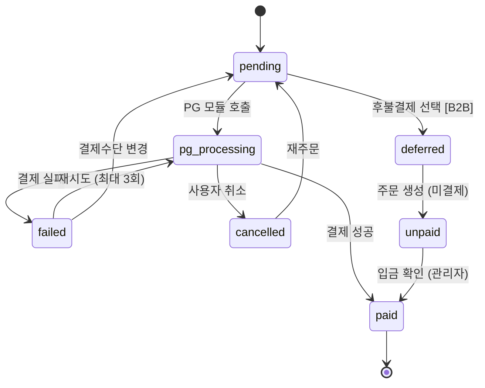

# SPEC-ORDER-001: 인터랙션 정의서

> A6B8-ORDER 주문관리 도메인 상태 머신, 조건부 규칙, 인터랙션 패턴

---

## 1. 상태 머신 (State Machines)

### 1.1 파일 업로드 상태 머신

### 1.2 주문서 작성 상태 머신

### 1.3 인쇄 공정 상태 머신 (관리자)

### 1.4 결제 상태 머신

---

## 2. 조건부 표시 규칙

### 2.1 파일 업로드 관련

| 조건 | 표시/동작 |
|------|----------|
| 상품 유형 == '인쇄' | 파일 업로드 영역 필수 표시 |
| 상품 유형 == '굿즈' | 파일 업로드 영역 비표시, 바로 주문서 |
| 파일 상태 == 'uploading' | 프로그레스바 표시, "다음" 비활성화 |
| 검증 결과 == 'PASS' | 녹색 배지, "다음" 활성화 |
| 검증 결과 == 'WARN' | 노란색 배지, 동의 체크박스 표시, 동의 시 "다음" 활성화 |
| 검증 결과 == 'ERROR' | 빨간색 배지, "재업로드" 버튼만 활성화 |
| PitStop 서버 장애 | "수동 검수 요청" 폴백 버튼 표시 |

### 2.2 배송비 관련

| 조건 | 표시/동작 |
|------|----------|
| 주문 금액 >= 50,000원 | 배송비 0원, "무료배송" 라벨 표시 |
| 주문 금액 < 50,000원 | 배송비 3,000원 표시 |
| 배송지 == 제주 | "+3,000원 (제주 추가)" 표시 |
| 배송지 == 도서산간 | "+5,000원 (도서산간 추가)" 표시 |
| 상품에 배너/현수막 포함 | "배너 상품은 별도 배송비 적용" 안내 |
| 혼합 주문 | "최대 배송비 1건만 부과됩니다" 안내 |

### 2.3 결제 관련

| 조건 | 표시/동작 |
|------|----------|
| 회원 등급 == B2B 거래처 | "후불결제" 옵션 노출 |
| 회원 등급 != B2B | "후불결제" 옵션 숨김 |
| 결제 금액 >= 50,000원 | 무이자할부 안내 표시 |
| 결제 실패 | 팝업 + "다른 결제수단" 버튼 |
| 네이버페이 가용 | 네이버페이 버튼 표시 |

### 2.4 관리자 주문관리

| 조건 | 표시/동작 |
|------|----------|
| 현재 상태 == ORDER_RECEIVED | 다음 상태: FILE_CHECKING만 선택 가능 |
| 현재 상태 == FILE_CHECKING | 다음: PRINT_READY 또는 REUPLOAD_WAIT |
| 현재 상태 == REUPLOAD_WAIT | 다음: FILE_CHECKING만 (재업로드 접수 시) |
| 역방향 상태 선택 시도 | 오류 메시지, 변경 차단 |
| 주문 다건 선택 시 | "일괄 상태변경" 버튼 활성화 |
| 48시간 초과 REUPLOAD_WAIT | 빨간색 "타임아웃" 배지 |

---

## 3. 로딩/에러 상태 패턴

### 3.1 파일 업로드 로딩 패턴

| 상태 | UI 표현 |
|------|---------|
| 파일 업로드 중 | 프로그레스바 (0~100%), 파일명, 크기, 취소 버튼 |
| PitStop 검증 중 | 스피너 + "파일 검증 중..." + 검증 항목 체크리스트 (실시간 업데이트) |
| 검증 완료 | 결과 카드 (통과/경고/오류), 항목별 상세 |

### 3.2 결제 로딩 패턴

| 상태 | UI 표현 |
|------|---------|
| PG 모듈 로딩 | 전체 화면 오버레이 + "결제 모듈 로딩 중..." |
| 결제 처리 중 | PG 팝업 내부 (제어 불가) |
| 결제 완료 | 주문 완료 페이지로 리다이렉트 |
| 결제 실패 | 모달 팝업 (사유 + 재시도 + 결제수단 변경) |

### 3.3 관리자 로딩 패턴

| 상태 | UI 표현 |
|------|---------|
| 주문 목록 로딩 | 테이블 스켈레톤 |
| 상태 변경 중 | 버튼 스피너 + 비활성화 |
| 일괄 변경 중 | 프로그레스바 (n/m건 완료) |
| SMS 발송 중 | 발송 프로그레스 + 결과 요약 |

---

## 4. 알림 템플릿

### 4.1 알림톡 템플릿

| 템플릿 ID | 발송 시점 | 내용 |
|-----------|----------|------|
| NOTI-ORD-001 | 주문 완료 | "[후니프린팅] 주문이 완료되었습니다. 주문번호: {orderNo}, 예상 제작일: {estimatedDate}" |
| NOTI-ORD-002 | 파일 확인 완료 | "[후니프린팅] 파일 확인이 완료되어 제작을 시작합니다. 주문번호: {orderNo}" |
| NOTI-ORD-003 | 재업로드 요청 | "[후니프린팅] 인쇄 파일에 문제가 발견되었습니다. 사유: {reason}. 재업로드: {reuploadUrl}" |
| NOTI-ORD-004 | 출고 완료 | "[후니프린팅] 상품이 출고되었습니다. 송장번호: {trackingNo}, 조회: {trackingUrl}" |
| NOTI-ORD-005 | 결제 실패 | "[후니프린팅] 결제에 실패했습니다. 사유: {reason}. 재결제: {retryUrl}" |
| NOTI-ORD-006 | 재업로드 리마인드 | "[후니프린팅] 파일 재업로드를 기다리고 있습니다. 재업로드: {reuploadUrl}" |
