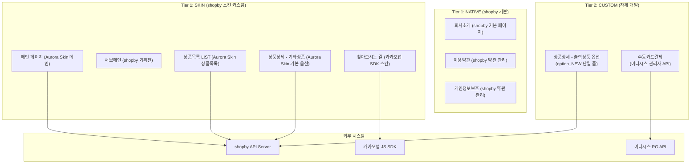
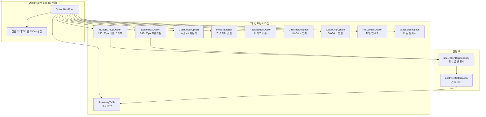
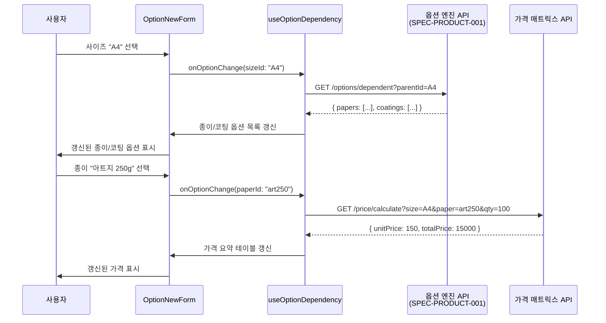
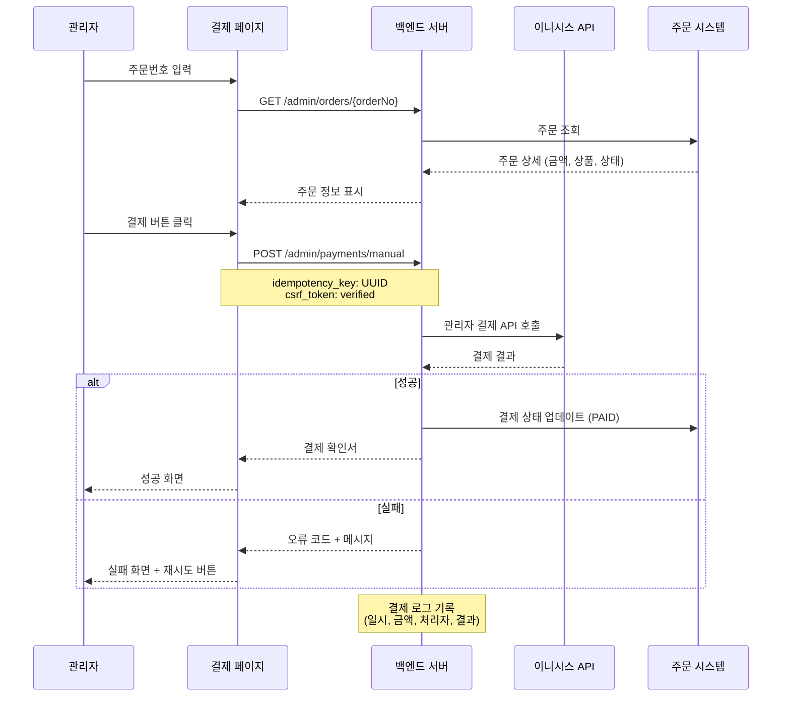
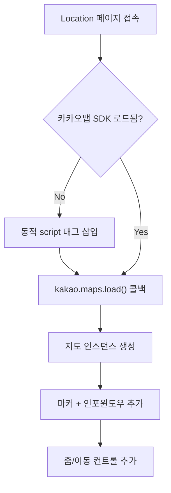
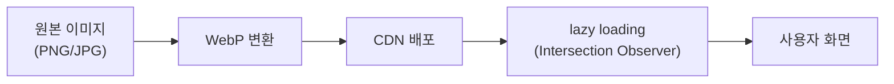

# SPEC-PAGE-001: Pages + Content + Payment 아키텍처 설계

> 후니프린팅 페이지/콘텐츠/결제 도메인 (9개 기능) 기술 아키텍처

---

## 1. 시스템 아키텍처 개요

### 1.1 3-Tier Hybrid 아키텍처에서의 위치



### 1.2 프로젝트 디렉토리 구조 (예상)

```
src/pages/
├── Main/                     # 메인 페이지
│   ├── Main.jsx
│   ├── components/
│   │   ├── HeroBanner.jsx     # 히어로 배너 슬라이드
│   │   ├── CategoryNav.jsx    # 카테고리 네비게이션
│   │   ├── PopularProducts.jsx
│   │   ├── NewProducts.jsx
│   │   └── EventBanner.jsx
│   └── hooks/
│       └── useMainSections.js
│
├── ProductList/              # 상품목록 (LIST)
│   ├── ProductList.jsx
│   ├── components/
│   │   ├── SortFilter.jsx     # 정렬/필터
│   │   ├── CategoryTree.jsx   # 카테고리 트리
│   │   └── ProductCard.jsx    # 상품 카드
│   └── hooks/
│       └── useProductList.js
│
├── ProductDetail/            # 상품 상세
│   ├── ProductDetail.jsx
│   ├── components/
│   │   ├── ImageGallery.jsx
│   │   ├── DetailTabs.jsx     # 상세/리뷰/Q&A 탭
│   │   ├── OptionNewForm/     # ★ CUSTOM: option_NEW 폼
│   │   │   ├── OptionNewForm.jsx
│   │   │   ├── ButtonGroupOption.jsx
│   │   │   ├── SelectBoxOption.jsx
│   │   │   ├── CountInputOption.jsx
│   │   │   ├── PriceTableBar.jsx
│   │   │   ├── RadioButtonOption.jsx
│   │   │   ├── DirectInputOption.jsx
│   │   │   ├── ColorChipOption.jsx
│   │   │   ├── SummaryTable.jsx
│   │   │   ├── FileUploadOption.jsx
│   │   │   └── hooks/
│   │   │       ├── useOptionDependency.js
│   │   │       └── usePriceCalculation.js
│   │   └── SkinOptionForm/    # SKIN 기본 옵션
│   │       └── SkinOptionForm.jsx
│   └── hooks/
│       └── useProductDetail.js
│
├── Content/                  # 콘텐츠 페이지
│   ├── About.jsx             # 회사소개
│   ├── Terms.jsx             # 이용약관
│   ├── Privacy.jsx           # 개인정보보호
│   └── Location/             # 찾아오시는 길
│       ├── Location.jsx
│       └── KakaoMap.jsx
│
├── SubMain/                  # 서브메인 (랜딩)
│   └── SubMain.jsx
│
└── admin/
    └── ManualPayment/        # ★ CUSTOM: 수동카드결제
        ├── ManualPayment.jsx
        ├── components/
        │   ├── OrderLookup.jsx
        │   └── PaymentForm.jsx
        └── hooks/
            └── useManualPayment.js
```

---

## 2. option_NEW 컴포넌트 아키텍처

### 2.1 컴포넌트 계층 구조



### 2.2 상품 카테고리별 옵션 구성 매핑

| 상품 카테고리 | 피그마 섹션 ID | 주요 옵션 |
|-------------|--------------|----------|
| 인쇄(PRINT) | PRODUCT_PRINT_OPTION | 사이즈, 종이, 인쇄, 코팅, 커팅, 후가공 |
| 제본(BOOK) | PRODUCT_BOOK_OPTION | 사이즈, 종이, 제본방식, 코팅, 후가공 |
| 문구(STATIONERY) | PRODUCT_STATIONERY_OPTION | 사이즈, 종이, 인쇄, 코팅 |
| 포토북(PHOTOBOOK) | PRODUCT_PHOTOBOOK_OPTION | 사이즈, 종이, 페이지수, 코팅 |
| 캘린더(CALENDAR) | PRODUCT_CALENDAR_OPTION | 사이즈, 종이, 코팅, 달력형태 |
| 디자인캘린더 | PRODUCT_DESIGN_CALENDAR | 사이즈, 디자인선택 |
| 소품(ACCESSORIES) | PRODUCT_ACCESSORIES_OPTION | 소재, 사이즈, 수량 |
| 아크릴(ACRYLIC) | PRODUCT_ACRYLIC_OPTION | 사이즈, 두께, 인쇄, 커팅 |
| 간판포스터(SIGN) | PRODUCT_SIGN_POSTER | 소재, 사이즈, 인쇄, 마감 |
| 스티커(STICKER) | PRODUCT_STICKER_OPTION | 소재, 사이즈, 코팅, 커팅 |
| 굿즈(GOODS) | PRODUCT_GOODS_OPTION | SKIN 기본 옵션 |

### 2.3 종속 옵션 데이터 플로우



---

## 3. 수동카드결제 아키텍처

### 3.1 결제 플로우



### 3.2 보안 체크리스트

| 항목 | 구현 방법 |
|------|----------|
| HTTPS | 전 페이지 HTTPS 강제 |
| CSRF | 서버 발급 토큰 + 폼 헤더 포함 |
| 인증 | 관리자 세션 토큰 검증 |
| 멱등성 | UUID 기반 idempotency_key |
| 로깅 | 전체 결제 시도 로그 (성공/실패) |
| 접근 제한 | 관리자 역할(ROLE_ADMIN) 확인 |

---

## 4. 카카오맵 연동 아키텍처

### 4.1 SDK 로딩 전략



### 4.2 구현 사양

| 항목 | 사양 |
|------|------|
| SDK 버전 | Kakao Maps JavaScript SDK v3 |
| 로딩 방식 | 동적 script 삽입 (lazy loading) |
| API Key | 환경변수 `KAKAO_MAP_APP_KEY` |
| 도메인 제한 | 프로덕션 도메인만 허용 |
| 초기 줌 레벨 | 3 (건물 수준) |
| 마커 | 후니프린팅 위치 고정 마커 |
| 인포윈도우 | 회사명, 주소, 전화번호 |

---

## 5. 성능 최적화 설계

### 5.1 이미지 최적화 파이프라인



### 5.2 메인 페이지 로딩 전략

| 순서 | 리소스 | 로딩 방식 |
|------|-------|----------|
| 1 | 히어로 배너 첫 슬라이드 | 즉시 로딩 (Critical) |
| 2 | 카테고리 아이콘 | 즉시 로딩 (Above the fold) |
| 3 | 인기 상품 이미지 | Lazy loading |
| 4 | 신규 상품 이미지 | Lazy loading |
| 5 | 이벤트 배너 | Lazy loading |
| 6 | 고객 리뷰 이미지 | Lazy loading |

### 5.3 상품 상세 페이지 로딩 전략

| 순서 | 리소스 | 로딩 방식 |
|------|-------|----------|
| 1 | 상품 이미지 갤러리 (첫 이미지) | 즉시 로딩 |
| 2 | 옵션 폼 (option_NEW or SKIN) | 즉시 로딩 |
| 3 | 가격 데이터 | API 호출 (초기 옵션 기준) |
| 4 | 상세 탭 콘텐츠 | Tab 클릭 시 로딩 |
| 5 | 리뷰 목록 | 리뷰 탭 클릭 시 로딩 |

---

## 6. SEO 설계

### 6.1 메타 태그 전략

| 페이지 | title | description | og:image |
|-------|-------|-------------|----------|
| 메인 | 후니프린팅 - 인쇄/제본/굿즈 전문 | 고품질 인쇄, 제본, 굿즈 제작... | 로고 이미지 |
| 상품목록 | {카테고리명} - 후니프린팅 | {카테고리} 전문 인쇄... | 카테고리 대표 이미지 |
| 상품상세 | {상품명} - 후니프린팅 | {상품명} 상세 정보... | 상품 대표 이미지 |
| 회사소개 | 회사소개 - 후니프린팅 | 후니프린팅 연혁, 장비... | 회사 대표 이미지 |

### 6.2 구조화 데이터 (상품 페이지)

상품 상세 페이지에 JSON-LD Product schema 적용:
- name, description, image
- offers (price, priceCurrency, availability)
- aggregateRating (리뷰 점수)
