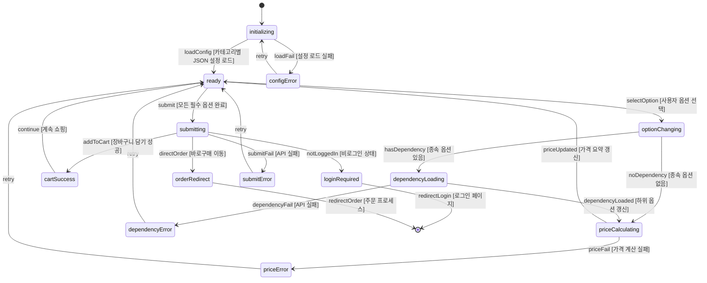
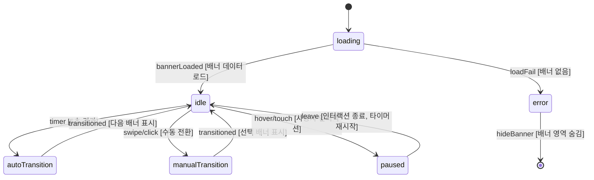
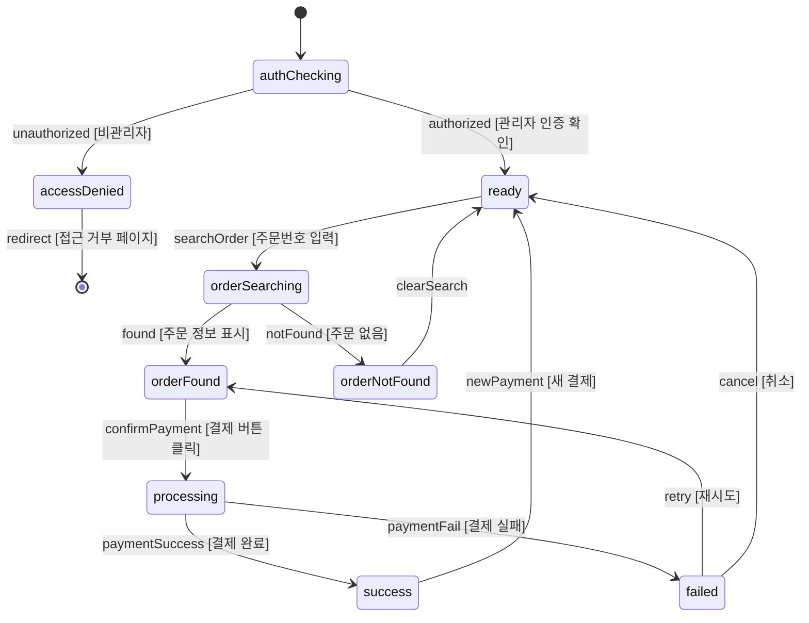
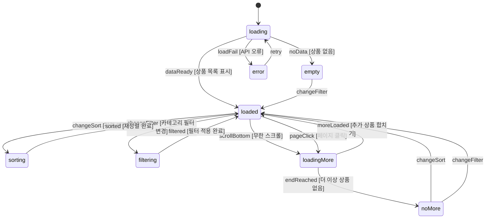

# SPEC-PAGE-001: 인터랙션 정의서

> Pages + A7A8-CONTENT + A5-PAYMENT 도메인 상태 머신, 로딩/에러 상태, 조건부 표시 규칙

---

## 1. 상태 머신 (State Machines)

### 1.1 option_NEW 폼 (OptionNewForm)

### 1.2 메인 페이지 히어로 배너 (HeroBanner)

### 1.3 수동카드결제 (ManualPayment)

### 1.4 상품목록 페이지네이션 (ProductList)

---

## 2. 로딩/에러 상태 정의

### 2.1 로딩 상태

| 화면 | 로딩 트리거 | 로딩 UI | 최대 대기 |
|------|-----------|---------|----------|
| 메인 페이지 | 초기 로드 | 섹션별 스켈레톤 | 3초 |
| 상품목록 | 카테고리 변경 / 정렬 변경 | 상품 카드 스켈레톤 | 2초 |
| 상품상세 | 초기 로드 | 이미지 + 옵션 스켈레톤 | 3초 |
| option_NEW | 종속 옵션 갱신 | 해당 섹션 스켈레톤 | 1초 |
| option_NEW | 가격 계산 | 가격 영역 스피너 | 1초 |
| 카카오맵 | SDK 로딩 | 지도 영역 스켈레톤 | 5초 |
| 수동결제 | 주문 조회 | 조회 영역 스피너 | 2초 |
| 수동결제 | 결제 처리 | 전체 오버레이 스피너 | 10초 |

### 2.2 에러 상태

| 에러 유형 | 화면 | 메시지 | 복구 액션 |
|---------|------|--------|----------|
| 옵션 로드 실패 | option_NEW | "옵션 정보를 불러오지 못했습니다" | 새로고침 버튼 |
| 가격 계산 실패 | option_NEW | "가격 정보를 확인할 수 없습니다" | 재시도 버튼 |
| 장바구니 담기 실패 | 상품상세 | "장바구니 담기에 실패했습니다" | 재시도 버튼 |
| 상품목록 로드 실패 | LIST | "상품 목록을 불러오지 못했습니다" | 새로고침 버튼 |
| 카카오맵 로드 실패 | 찾아오시는 길 | "지도를 불러올 수 없습니다" | 주소 텍스트 표시 |
| PG 결제 실패 | 수동결제 | PG 오류 코드 + 메시지 | 재시도 버튼 |
| 주문 조회 실패 | 수동결제 | "주문을 찾을 수 없습니다" | 주문번호 재입력 |

---

## 3. 조건부 표시 규칙

### 3.1 상품 상세 페이지 분기

| 조건 | 표시 컴포넌트 | 숨김 컴포넌트 |
|------|-------------|-------------|
| 출력상품 카테고리 | OptionNewForm | SkinOptionForm |
| 기타상품 카테고리 | SkinOptionForm | OptionNewForm |
| 로그인 상태 | 장바구니/바로구매 활성 | - |
| 비로그인 + 출력상품 | 장바구니/바로구매 -> 로그인 안내 | - |
| 비로그인 + 굿즈(기타) | 비회원 주문 가능 | - |
| 옵션 미완성 | CTA 버튼 비활성 | - |
| 옵션 완성 | CTA 버튼 활성 + 가격 확정 | - |

### 3.2 메인 페이지 조건부 영역

| 조건 | 표시 영역 | 숨김 영역 |
|------|----------|----------|
| 비로그인 | 기본 메인 섹션 | 재주문/쿠폰 영역 |
| 로그인 | 재주문 바로가기 + 등급별 쿠폰 | - |
| 이벤트 없음 | - | 이벤트/프로모션 섹션 |
| 배너 0건 | 기본 이미지 배너 | 슬라이드 컨트롤 |

### 3.3 수동결제 접근 제어

| 조건 | 표시 | 동작 |
|------|------|------|
| 관리자 인증 완료 | 결제 폼 전체 | 정상 사용 |
| 관리자 미인증 | 접근 거부 페이지 | 로그인 리다이렉트 |
| 일반 회원 로그인 | 접근 거부 페이지 | 권한 부족 안내 |

---

## 4. 인터랙션 세부 사양

### 4.1 option_NEW 폼 인터랙션

| 인터랙션 | 트리거 | 동작 | 피드백 |
|---------|-------|------|--------|
| 옵션 버튼 클릭 | Button Group 클릭 | 선택 상태 토글, 종속 옵션 갱신 | 선택 버튼 하이라이트 + 하위 옵션 스켈레톤 |
| 드롭다운 선택 | Select Box 변경 | 하위 옵션 갱신, 가격 재계산 | 드롭다운 닫힘 + 가격 업데이트 |
| 수량 변경 | +/- 버튼 또는 직접 입력 | 가격 재계산 | 가격 요약 실시간 갱신 |
| 컬러칩 선택 | Color Chip 클릭 | 선택 컬러 하이라이트 | 선택 칩 테두리 강조 |
| 직접 입력 | Input 필드 입력 | 값 검증 + 가격 재계산 | 유효성 피드백 (초록/빨강) |
| 파일 업로드 | 드래그앤드롭 또는 버튼 | 파일 업로드 진행 | 프로그레스 바 |
| 장바구니 담기 | CTA 클릭 | API 호출 + 장바구니 저장 | 토스트 알림 |
| 스크롤 가격 고정 | 스크롤 다운 | 가격 요약 Sticky 바 하단 고정 | 하단 고정 바 노출 |

### 4.2 메인 히어로 배너 인터랙션

| 인터랙션 | PC | 모바일 |
|---------|-----|-------|
| 자동 전환 | 5초 타이머 | 5초 타이머 |
| 수동 전환 | 좌/우 화살표 클릭 | 좌/우 스와이프 |
| 일시정지 | 마우스 호버 | 터치 홀드 |
| 인디케이터 | 하단 점 표시 | 하단 점 표시 |
| 배너 클릭 | 링크 이동 | 링크 이동 |

### 4.3 상품 카드 인터랙션

| 인터랙션 | PC | 모바일 |
|---------|-----|-------|
| 호버 | 이미지 확대(scale 1.05) + 그림자 | - |
| 클릭 | 상품 상세 이동 | 상품 상세 이동 |
| 이미지 로딩 | 스켈레톤 -> 페이드인 | 동일 |
| 품절 상품 | 반투명 + "품절" 뱃지 | 동일 |
