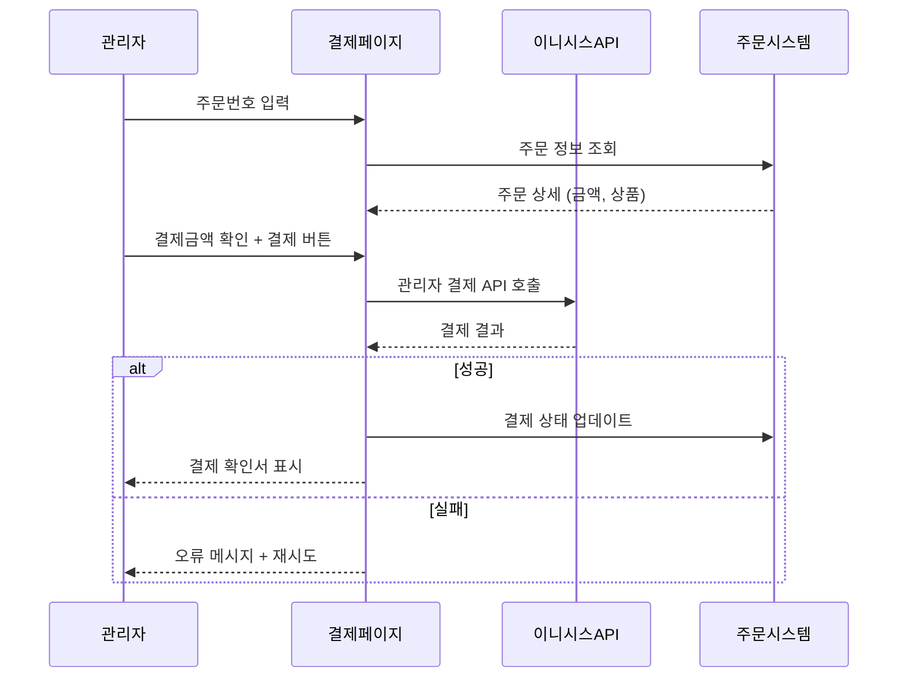

# SPEC-PAGE-001 요구사항 분석 (Pages + A7A8-CONTENT + A5-PAYMENT 도메인)

> **작성일**: 2026-03-20
> **SPEC ID**: SPEC-PAGE-001
> **대상 도메인**: Pages + A7A8-CONTENT + A5-PAYMENT
> **플랫폼**: 후니프린팅 shopby Enterprise 기반
> **shopby 구현 방식**: SKIN-heavy (1 CUSTOM 모듈: 수동결제, 1 하이브리드: 상품옵션)

---

## 목차

1. [핵심 의사결정 사항 (8개)](#1-핵심-의사결정-사항)
2. [모듈 1: 페이지 (Pages)](#2-모듈-1-페이지-pages)
3. [모듈 2: 콘텐츠 (Content)](#3-모듈-2-콘텐츠-content)
4. [모듈 3: 수동결제 (Manual Payment)](#4-모듈-3-수동결제-manual-payment)
5. [엣지 케이스 및 리스크](#5-엣지-케이스-및-리스크)
6. [크로스 도메인 의존성](#6-크로스-도메인-의존성)
7. [비기능 요구사항](#7-비기능-요구사항)

---

## 1. 핵심 의사결정 사항

### KD-PG-01: 메인 페이지 구성 전략

**결정 항목**: 메인 페이지 레이아웃 및 콘텐츠 구성

**선택 가능 옵션**:
| 옵션 | 내용 | 장점 | 단점 |
|------|------|------|------|
| A | shopby 기본 메인 템플릿 | 빠른 구현, 관리 편의 | 인쇄 업종 특화 부족 |
| B | shopby 스킨 기반 커스텀 레이아웃 | 인쇄 카테고리 맞춤 노출, 브랜드 차별화 | 스킨 개발 필요 |
| C | 완전 CUSTOM 메인 | 최대 자유도 | 개발/유지보수 비용 과다 |

**권장 결정**: **shopby 스킨 기반 커스텀 레이아웃 (옵션 B)**

**근거**:
- shopby 스킨 시스템의 섹션 관리 기능으로 인쇄 업종 5대 카테고리를 효과적으로 노출 가능
- 관리자가 배너/프로모션을 shopby 관리자에서 직접 교체 가능
- 완전 CUSTOM 대비 유지보수 부담 대폭 감소

**shopby 구현 가능 여부**: 가능 (스킨 커스터마이징)

---

### KD-PG-02: 상품목록 정렬 기준

**결정 항목**: 상품목록(LIST) 기본 정렬 및 필터 체계

**권장 결정**: **인기순 기본 + 가격순/최신순 추가**

**근거**:
- 인쇄 업계 B2B 고객은 반복 주문이 많아 인기 상품 우선 노출이 효율적
- 가격순은 가격 비교 니즈 충족, 최신순은 신규 상품 발견
- shopby 상품목록 API에서 정렬 파라미터 기본 지원

---

### KD-PG-03: 출력상품 옵션 UI 패턴

**결정 항목**: 인쇄/제본 등 출력상품의 옵션 선택 UI

**선택 가능 옵션**:
| 옵션 | 내용 | 장점 | 단점 |
|------|------|------|------|
| A | Step Wizard (단계별 마법사) | 단계별 가이드 | 왕복 수정 불편, 피그마 디자인과 불일치 |
| B | option_NEW 단일 페이지 스크롤 폼 | 전체 옵션 한 눈에 파악, 피그마 확정 디자인 | 폼 길이가 길 수 있음 |
| C | 아코디언 접기/펼치기 | 섹션별 관리 가능 | 전체 상태 파악 어려움 |

**권장 결정**: **option_NEW 단일 페이지 스크롤 폼 (옵션 B)**

**근거**:
- 피그마 option_NEW 디자인이 이미 확정됨 (12개 상품 카테고리별 폼 정의)
- Step Wizard는 사용자 피드백에서 명시적으로 거절됨
- 인쇄 업종 특성상 옵션 간 종속성이 높아 전체 옵션을 한 화면에서 파악/수정하는 것이 효율적
- 10개 컴포넌트 타입이 정의되어 재사용성 확보

---

### KD-PG-04: 기타 상품 옵션 UI

**결정 항목**: 굿즈/수작/포장재/디자인 상품의 옵션 선택

**권장 결정**: **shopby SKIN 기본 옵션 UI**

**근거**:
- 기타 상품은 옵션 구조가 단순(색상/사이즈/수량)하여 shopby 기본 옵션 UI로 충분
- CUSTOM 개발 범위를 최소화하여 리소스를 출력상품에 집중

---

### KD-PG-05: 회사소개 페이지 구성

**결정 항목**: 회사소개 페이지에 포함할 섹션

**권장 결정**: **연혁/장비/인증 포함**

**근거**:
- 인쇄 업종 B2B 고객은 업체 신뢰도를 중시하므로 장비/인증 정보 필수
- shopby 기본 페이지 HTML 편집기로 관리 가능하여 추가 개발 불필요

---

### KD-PG-06: 지도 API 선정

**결정 항목**: 찾아오시는 길 페이지 지도 서비스

**선택 가능 옵션**:
| 옵션 | 월 무료 할당 | 장점 | 단점 |
|------|-------------|------|------|
| 카카오맵 | 30만건 | 국내 점유율 1위, 로드뷰 | 해외 지원 약함 |
| 네이버맵 | 20만건 | 네이버 생태계 | API 제한 일부 |
| 구글맵 | 2.8만건 | 글로벌 | 비용 높음 |

**권장 결정**: **카카오맵 JavaScript SDK**

**근거**:
- 국내 B2B 인쇄 고객 타겟으로 국내 지도 정확도가 중요
- 월 30만건 무료로 후니프린팅 트래픽에 충분
- 로드뷰로 실제 위치 확인 가능

---

### KD-PG-07: 수동카드결제 PG사

**결정 항목**: 수동카드결제에 사용할 PG사

**권장 결정**: **이니시스 유지**

**근거**:
- 정책 확정(policy-confirmed.md)에서 KG이니시스로 PG사 확정
- 기존 계약 연속성 확보, 별도 협상 불필요
- 오프라인 전용 기능으로 우선순위 P3이므로 안정적 선택 우선

---

### KD-PG-08: 서브메인(랜딩페이지) 운영 방식

**결정 항목**: 카테고리별 서브메인 페이지 관리 방식

**권장 결정**: **shopby 기획전 페이지 활용**

**근거**:
- shopby의 기획전 기능으로 프로모션 이미지, 상품 큐레이션 직접 관리 가능
- 관리자가 코드 수정 없이 서브메인 콘텐츠 교체 가능
- 2depth 카테고리 랜딩 페이지로 활용 가능

---

## 2. 모듈 1: 페이지 (Pages)

### 2.1 메인 페이지

**기능 개요**: 후니프린팅 첫 화면으로 핵심 상품 카테고리 및 프로모션을 노출하는 페이지

**shopby 구현 방식**: SKIN (스킨 커스텀)

**필수 섹션 구성**:

| 순서 | 섹션 | 내용 | shopby 컴포넌트 |
|------|------|------|----------------|
| 1 | 히어로 배너 | 슬라이드 배너 (5초 자동전환) | shopby 메인배너 |
| 2 | 카테고리 네비게이션 | 5대 카테고리 아이콘 그리드 | 스킨 커스텀 |
| 3 | 인기 상품 | 판매량 기준 TOP 상품 | shopby 상품진열 |
| 4 | 신규 상품 | 최근 등록 상품 | shopby 상품진열 |
| 5 | 이벤트/프로모션 | 진행 중 이벤트 배너 | shopby 기획전 연동 |
| 6 | 고객 리뷰 | 최근 포토리뷰 | shopby 상품후기 |

### 2.2 서브메인(랜딩페이지)

**기능 개요**: 카테고리별 랜딩 페이지로 프로모션 이미지와 상품 큐레이션 제공

**shopby 구현 방식**: SKIN (shopby 기획전)

**우선순위**: P2 (2순위)

### 2.3 상품목록 (LIST)

**기능 개요**: 카테고리/검색 결과에 따른 상품 리스트

**shopby 구현 방식**: SKIN (상품목록 스킨)

**주요 기능**:
- 정렬: 인기순(기본)/가격순/최신순
- 필터: 2depth 카테고리 트리
- 페이지네이션 또는 무한 스크롤
- 상품 카드: 대표 이미지, 상품명, 최저가, 리뷰 수

### 2.4 상품페이지(상품옵션)

**기능 개요**: 상품 상세 정보 및 옵션 선택/주문 진입

**shopby 구현 방식**: SKIN/CUSTOM (하이브리드)

**핵심 분기 로직**:
- 출력상품(인쇄/제본/실사/패키지 등): CUSTOM (option_NEW 폼)
- 기타상품(굿즈/수작/포장재): SKIN (shopby 기본 옵션)

**option_NEW 10개 컴포넌트 타입** (피그마 확정):

| 컴포넌트 | 크기 | 사용처 |
|---------|------|--------|
| Option Group Button Type | 155x50px 버튼 그리드 | 사이즈, 인쇄, 코팅, 커팅 |
| Option Group Select Box Type | 348x50px 드롭다운 | 종이 선택 |
| Option Group Count Input Type | 수량 +/- 카운터 | 제작수량 |
| Option Group Price Table Bar | 가격 테이블 행 | 가격 요약 |
| Option Group Radio Button Type | 라디오 버튼 | 마감 타입 |
| Option Group Input Type | 140x50px 입력필드 | 박/형압 크기 |
| Option Group Color Chip Type | 50x50px 원형 칩 | 박 칼라 |
| Option Group Select Box Type (복수) | 다중 셀렉트 | 추가 옵션 |
| Option Group Summary | 가격 합산 테이블 | 주문 요약 |
| Option Group Upload | 파일 업로드 영역 | PDF, 에디터 |

---

## 3. 모듈 2: 콘텐츠 (Content)

### 3.1 회사소개

- shopby 기본 페이지 (NATIVE)
- 관리자 HTML 편집기로 콘텐츠 관리
- 필수 섹션: 회사 개요, 연혁, 장비, 인증서, 조직도
- 인쇄 업종 B2B 신뢰도 확보용

### 3.2 이용약관

- shopby 약관 관리 (NATIVE)
- 인쇄 특화 조항 필수: 색상 차이 면책, 파일 보관 기간(30일), 재제작 기준, 인쇄 불량 판정 기준
- 법무 검토 후 확정 필요

### 3.3 개인정보보호

- shopby 약관 관리 (NATIVE)
- 위탁 업체 목록: PG사(이니시스), 배송업체, 알림톡(카카오) 등
- 개인정보보호법/정보통신망법 준수

### 3.4 찾아오시는 길

- shopby 스킨 커스텀 (SKIN)
- 카카오맵 JavaScript SDK 연동
- 마커 + 인포윈도우 + 대중교통 안내
- API Key 관리: 환경변수로 분리

---

## 4. 모듈 3: 수동결제 (Manual Payment)

### 4.1 수동카드결제

- CUSTOM 자체 개발 (P3)
- PG: 이니시스 관리자 결제 API
- 오프라인 전용: 전화/방문 주문 고객 대상
- 관리자 인증 필수 (SPEC-MEMBER-001 연동)
- PC/모바일 대응

**수동결제 플로우**:

---

## 5. 엣지 케이스 및 리스크

| # | 시나리오 | 리스크 | 대응 방안 |
|---|---------|-------|----------|
| 1 | option_NEW 폼이 너무 길어 스크롤 피로 | UX 저하 | Sticky 가격 요약 바, 섹션 앵커 네비게이션 |
| 2 | 종속 옵션 로딩 지연 | 사용자 이탈 | 옵션 데이터 사전 로딩, 스켈레톤 UI |
| 3 | 카카오맵 API Key 노출 | 보안 위험 | 도메인 제한 설정, 환경변수 관리 |
| 4 | 수동결제 중 네트워크 끊김 | 이중 결제 위험 | 결제 멱등성 키, 중복 결제 방지 로직 |
| 5 | 메인 페이지 이미지 과다 | 로딩 성능 저하 | 이미지 CDN, WebP, lazy loading |
| 6 | 출력상품/기타상품 분기 오류 | 잘못된 옵션 UI 노출 | 상품 카테고리 매핑 테이블 관리 |

---

## 6. 크로스 도메인 의존성

| 의존 SPEC | 의존 내용 | 필수/선택 |
|----------|----------|----------|
| SPEC-PRODUCT-001 | 종속 옵션 엔진, 가격 매트릭스 API, 상품 카테고리 매핑 | 필수 |
| SPEC-ORDER-001 | 장바구니 담기, 바로구매 진입 | 필수 |
| SPEC-MEMBER-001 | 로그인 상태 확인, 비로그인 주문 분기 | 필수 |
| SPEC-LAYOUT-001/002 | GNB, Footer, 반응형 레이아웃 프레임 | 필수 |

---

## 7. 비기능 요구사항

| 영역 | 요구사항 | 기준 |
|------|---------|------|
| 성능 | 메인 페이지 LCP | 2.5초 이내 |
| 성능 | 상품 상세 FCP | 1.5초 이내 |
| SEO | 메타 태그 | title, description, og:image 필수 |
| SEO | 구조화 데이터 | 상품 페이지 JSON-LD Product schema |
| 접근성 | WCAG 수준 | AA 수준 (키보드, 스크린리더) |
| 보안 | 수동결제 | HTTPS, CSRF, 관리자 인증 |
| 호환성 | 브라우저 | Chrome/Safari/Edge 최신 2버전 |
| 이미지 | 최적화 | WebP 변환, lazy loading, CDN |
