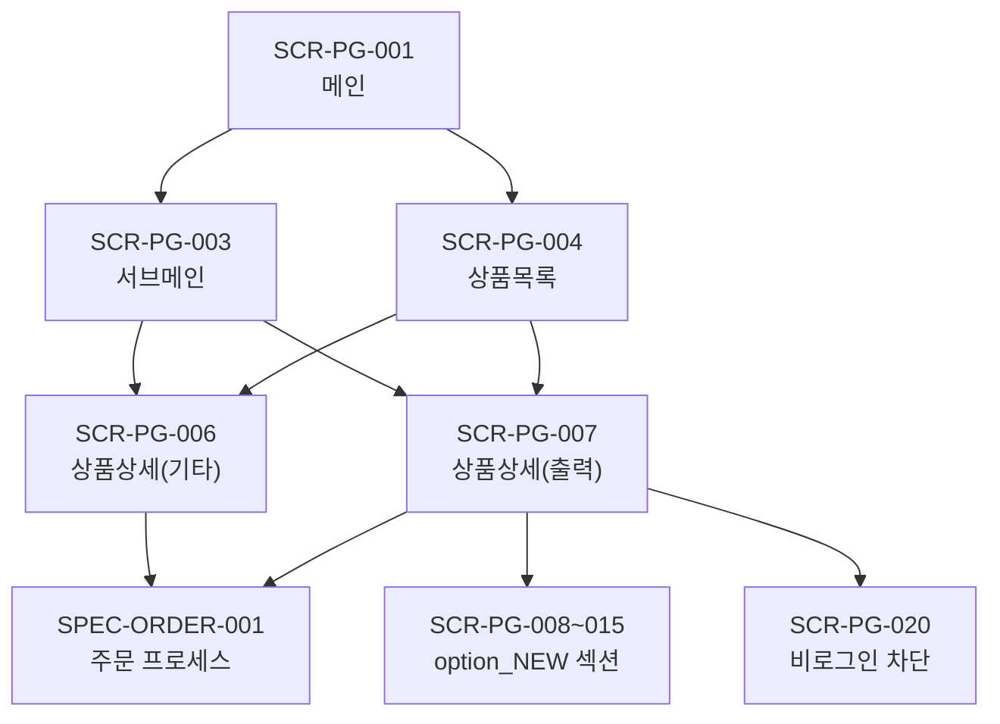

# SPEC-PAGE-001: 화면 인벤토리 (Screen Inventory)

> Pages + A7A8-CONTENT + A5-PAYMENT 도메인 전체 화면 설계 기초 자료

---

## 1. 전체 화면 인벤토리

### 1.1 모듈 1: 페이지 (Pages) - SCR-PG-001 ~ 020

| Screen ID | 화면명 | 유형 | Route Path | 부모 | 우선순위 | 모듈 | 핵심 기능 |
|-----------|--------|------|------------|------|---------|------|----------|
| SCR-PG-001 | 메인 페이지 | Page | `/` | - | P1 | MAIN | 히어로 배너(5초 자동전환), 카테고리 5종 아이콘, 인기상품, 신규상품, 이벤트, 리뷰 |
| SCR-PG-002 | 메인 - 로그인 상태 | State | `/` | SCR-PG-001 | P1 | MAIN | 재주문 바로가기, 등급별 쿠폰 영역 추가 노출 |
| SCR-PG-003 | 서브메인(랜딩) | Page | `/category/{slug}` | - | P2 | SUB | 프로모션 이미지, 큐레이션 상품 카드, 카테고리 설명 |
| SCR-PG-004 | 상품목록 (LIST) | Page | `/products?category={id}` | - | P1 | LIST | 상품 카드 그리드, 정렬(인기/가격/최신), 카테고리 필터, 페이지네이션 |
| SCR-PG-005 | 상품목록 - 빈 결과 | State | `/products?category={id}` | SCR-PG-004 | P1 | LIST | "상품이 없습니다" 안내, 다른 카테고리 추천 |
| SCR-PG-006 | 상품상세 - 기타상품 | Page | `/products/{productNo}` | - | P1 | DETAIL | 이미지 갤러리, 상품명, 가격, SKIN 기본 옵션, 장바구니/바로구매 |
| SCR-PG-007 | 상품상세 - 출력상품 | Page | `/products/{productNo}` | - | P1 | DETAIL | 이미지 갤러리, 상품명, option_NEW 스크롤 폼, 가격 요약, 장바구니/바로구매 |
| SCR-PG-008 | option_NEW 폼 - 사이즈 선택 | Section | `/products/{productNo}` | SCR-PG-007 | P1 | OPTION | Button Group 사이즈 그리드 (155x50px 버튼) |
| SCR-PG-009 | option_NEW 폼 - 종이/소재 선택 | Section | `/products/{productNo}` | SCR-PG-007 | P1 | OPTION | Select Box 드롭다운 (348x50px) |
| SCR-PG-010 | option_NEW 폼 - 인쇄/코팅 옵션 | Section | `/products/{productNo}` | SCR-PG-007 | P1 | OPTION | Button Group + Radio Button 혼합 |
| SCR-PG-011 | option_NEW 폼 - 후가공 옵션 | Section | `/products/{productNo}` | SCR-PG-007 | P1 | OPTION | Button Group + Direct Input + Color Chip |
| SCR-PG-012 | option_NEW 폼 - 수량 입력 | Section | `/products/{productNo}` | SCR-PG-007 | P1 | OPTION | Count Input (+/- 카운터) |
| SCR-PG-013 | option_NEW 폼 - 가격 요약 | Section | `/products/{productNo}` | SCR-PG-007 | P1 | OPTION | Price Table Bar + Summary Table (실시간 갱신) |
| SCR-PG-014 | option_NEW 폼 - 파일 업로드 | Section | `/products/{productNo}` | SCR-PG-007 | P1 | OPTION | File Upload 영역 (PDF, 에디터 연결) |
| SCR-PG-015 | option_NEW 폼 - CTA 버튼 | Section | `/products/{productNo}` | SCR-PG-007 | P1 | OPTION | 장바구니 + 바로구매 버튼 (Sticky 하단 고정) |
| SCR-PG-016 | 종속 옵션 로딩 상태 | State | `/products/{productNo}` | SCR-PG-007 | P1 | OPTION | 스켈레톤 UI (상위 옵션 변경 시 하위 옵션 로딩) |
| SCR-PG-017 | 상품 상세 탭 - 상세정보 | Tab | `/products/{productNo}` | SCR-PG-006/007 | P1 | DETAIL | 상품 상세 HTML 콘텐츠 |
| SCR-PG-018 | 상품 상세 탭 - 리뷰 | Tab | `/products/{productNo}` | SCR-PG-006/007 | P2 | DETAIL | 리뷰 목록, 별점, 포토리뷰 |
| SCR-PG-019 | 상품 상세 탭 - Q&A | Tab | `/products/{productNo}` | SCR-PG-006/007 | P2 | DETAIL | 상품 문의 목록, 문의하기 버튼 |
| SCR-PG-020 | 비로그인 주문 차단 | Modal | `/products/{productNo}` | SCR-PG-007 | P1 | DETAIL | "로그인이 필요합니다" 안내, 로그인/회원가입 버튼 |

### 1.2 모듈 2: 콘텐츠 (Content) - SCR-PG-021 ~ 026

| Screen ID | 화면명 | 유형 | Route Path | 부모 | 우선순위 | 모듈 | 핵심 기능 |
|-----------|--------|------|------------|------|---------|------|----------|
| SCR-PG-021 | 회사소개 | Page | `/about` | - | P2 | CONTENT | 회사 개요, 연혁, 장비, 인증서, 조직도 |
| SCR-PG-022 | 이용약관 | Page | `/terms` | - | P1 | CONTENT | 약관 전문 (인쇄 특화 조항 포함) |
| SCR-PG-023 | 개인정보보호 | Page | `/privacy` | - | P1 | CONTENT | 개인정보처리방침 전문, 위탁 업체 목록 |
| SCR-PG-024 | 찾아오시는 길 | Page | `/location` | - | P3 | CONTENT | 카카오맵 지도, 주소, 전화번호, 대중교통 안내 |
| SCR-PG-025 | 카카오맵 인포윈도우 | Overlay | `/location` | SCR-PG-024 | P3 | CONTENT | 회사명, 주소, 전화번호 팝업 |
| SCR-PG-026 | 카카오맵 로딩 실패 | State | `/location` | SCR-PG-024 | P3 | CONTENT | "지도를 불러올 수 없습니다" 안내, 주소 텍스트 표시 |

### 1.3 모듈 3: 수동결제 (Manual Payment) - SCR-PG-027 ~ 031

| Screen ID | 화면명 | 유형 | Route Path | 부모 | 우선순위 | 모듈 | 핵심 기능 |
|-----------|--------|------|------------|------|---------|------|----------|
| SCR-PG-027 | 수동카드결제 | Page | `/admin/manual-payment` | - | P3 | PAYMENT | 주문번호 검색, 주문정보 표시, 결제금액, 결제 버튼 |
| SCR-PG-028 | 수동결제 - 주문 조회 결과 | Section | `/admin/manual-payment` | SCR-PG-027 | P3 | PAYMENT | 주문 상세 (상품명, 금액, 주문자, 상태) |
| SCR-PG-029 | 수동결제 - 결제 확인서 | Section | `/admin/manual-payment` | SCR-PG-027 | P3 | PAYMENT | 결제 일시, 금액, 승인번호, 처리자 |
| SCR-PG-030 | 수동결제 - 결제 실패 | State | `/admin/manual-payment` | SCR-PG-027 | P3 | PAYMENT | PG 오류 코드, 오류 메시지, 재시도 버튼 |
| SCR-PG-031 | 수동결제 - 접근 거부 | State | `/admin/manual-payment` | SCR-PG-027 | P3 | PAYMENT | "관리자 권한이 필요합니다" 안내 |

---

## 2. 화면 통계 요약

| 구분 | P1 | P2 | P3 | 합계 |
|------|-----|-----|-----|------|
| Page | 5 | 3 | 2 | 10 |
| Section | 8 | 0 | 2 | 10 |
| State | 4 | 0 | 3 | 7 |
| Tab | 1 | 2 | 0 | 3 |
| Modal | 1 | 0 | 0 | 1 |
| Overlay | 0 | 0 | 1 | 1 |
| **합계** | **19** | **5** | **8** | **32** |

---

## 3. 화면 의존성 매트릭스

---

## 4. 반응형 브레이크포인트

| 브레이크포인트 | 범위 | 레이아웃 변화 |
|-------------|------|------------|
| PC (기본) | 1280px 이상 | 전체 레이아웃, 사이드바 카테고리 |
| 태블릿 | 768~1279px | 2컬럼 그리드, 사이드바 접기 |
| 모바일 | 767px 이하 | 1컬럼, 하단 탭 네비게이션, 아코디언 카테고리 |

### 4.1 option_NEW 폼 반응형 대응

| 브레이크포인트 | Button Group | Select Box | Price Table |
|-------------|-------------|------------|-------------|
| PC | 6열 그리드 | 전체 너비 | 전체 너비 테이블 |
| 태블릿 | 4열 그리드 | 전체 너비 | 전체 너비 테이블 |
| 모바일 | 2열 그리드 | 전체 너비 | 스택형 카드 |
