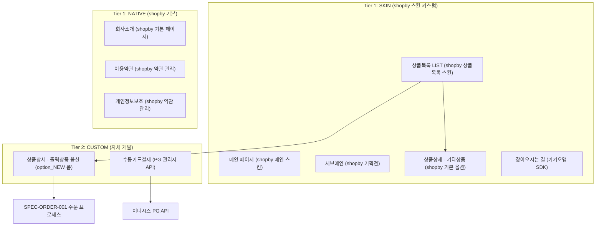
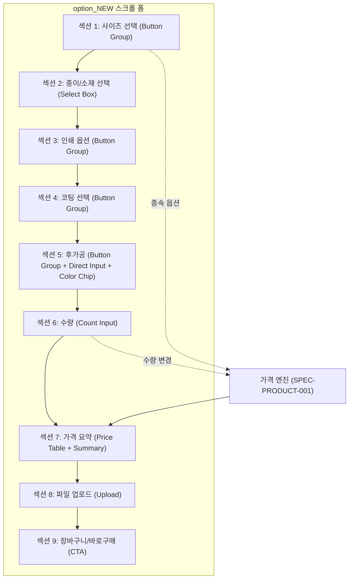
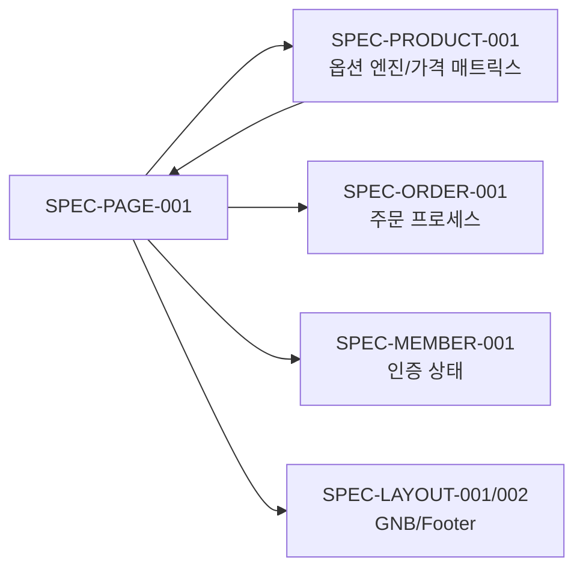

# SPEC-PAGE-001: Pages + A7A8-CONTENT + A5-PAYMENT 도메인

> 후니프린팅 shopby Enterprise 기반 페이지/콘텐츠/결제 시스템 (9개 기능, 4개 모듈)

---

## HISTORY

| 버전 | 일자 | 작성자 | 변경 내용 |
|------|------|--------|----------|
| 1.0.0 | 2026-03-20 | MoAI (manager-spec) | 초기 SPEC 작성 - 4개 모듈, 9개 기능 정의 |

---

## 1. 개요

### 1.1 목적

후니프린팅 shopby Enterprise 마이그레이션에서 Pages(메인/서브메인/LIST/상품페이지), A7A8-CONTENT(회사소개/이용약관/개인정보보호/찾아오시는 길), A5-PAYMENT(수동카드결제) 도메인의 전체 기능을 정의한다. shopby SKIN 스킨 커스터마이징을 최대한 활용하는 Tier 1 중심 구현 전략을 따르되, 출력상품 옵션은 option_NEW 단일 페이지 폼 패턴의 CUSTOM 개발로 구현한다.

### 1.2 범위

- **포함**: 메인 페이지, 서브메인(랜딩페이지), 상품목록(LIST), 상품페이지(상품옵션), 회사소개, 이용약관, 개인정보보호, 찾아오시는 길, 수동카드결제
- **제외**: 주문 프로세스(SPEC-ORDER-001), 마이페이지(SPEC-MYPAGE-001), 고객센터(별도 SPEC), 관리자 상품관리(SPEC-PRODUCT-001)

### 1.3 SPEC-PLAN-001과의 관계

본 SPEC은 SPEC-PLAN-001 v1.1.0 마스터 기획서의 Pages(policy_domain="-") + A7A8-CONTENT + A5-PAYMENT 도메인을 구현 수준으로 구체화한 문서이다.

| 원본 ID | 도메인 | 기능 | shopby 분류 |
|---------|--------|------|------------|
| - | Pages | 메인 | SKIN |
| - | Pages | 서브메인(랜딩페이지) | SKIN |
| - | Pages | LIST (검색결과) | SKIN |
| - | Pages | 상품페이지(상품옵션) | SKIN/CUSTOM |
| A-7-1 | A7A8-CONTENT | 회사소개 | NATIVE |
| A-7-2 | A7A8-CONTENT | 이용약관 | NATIVE |
| A-7-3 | A7A8-CONTENT | 개인정보보호 | NATIVE |
| A-7-4 | A7A8-CONTENT | 찾아오시는 길 | SKIN |
| A-5-1 | A5-PAYMENT | 수동카드결제 (PC+모바일) | CUSTOM |

### 1.4 관련 SPEC 참조

| SPEC ID | 관계 | 내용 |
|---------|------|------|
| SPEC-PLAN-001 | 상위 기획서 | 마스터 기획서 정책/로드맵 |
| SPEC-PRODUCT-001 | 데이터 공급 | 상품 마스터, 옵션 엔진, 가격 매트릭스 |
| SPEC-ORDER-001 | 주문 연계 | 상품 선택 후 주문 프로세스 진입 |
| SPEC-MEMBER-001 | 인증 의존 | 로그인 상태에 따른 가격 표시/주문 분기 |
| SPEC-SCREEN-001 | 화면 참조 | 88개 화면 레이아웃 가이드 |

---

## 2. 핵심 의사결정 요약

| KD ID | 항목 | 권장 결정 | 근거 요약 | 상태 |
|-------|------|----------|----------|------|
| KD-PG-01 | 메인 페이지 구성 | shopby 스킨 기반 커스텀 레이아웃 | 인쇄 업종 특화 카테고리 노출 필요 | 확정 |
| KD-PG-02 | 상품목록 정렬 기준 | 인기순 기본 + 가격순/최신순 | 인쇄 업계 B2B 고객 주문 패턴 | 확정 |
| KD-PG-03 | 출력상품 옵션 UI | option_NEW 단일 페이지 스크롤 폼 | 피그마 디자인 확정, Step Wizard 사용 금지 | 확정 |
| KD-PG-04 | 기타 상품 옵션 UI | shopby SKIN 기본 옵션 | 굿즈/수작/포장재는 표준 옵션 UI | 확정 |
| KD-PG-05 | 회사소개 구성 | 연혁/장비/인증 포함 | 인쇄 업종 B2B 신뢰도 확보 필수 | 확정 |
| KD-PG-06 | 지도 API | 카카오맵 JavaScript SDK | 국내 점유율 1위, 무료 제공 범위 | 확정 |
| KD-PG-07 | 수동카드결제 PG사 | 이니시스 유지 | 기존 PG 계약 연속성 | 확정 |
| KD-PG-08 | 서브메인 운영 방식 | shopby 기획전 페이지 활용 | 관리자가 프로모션 이미지 직접 등록 | 확정 |

> KD-PG-01~08 전체 확정 (2026-03-20). 상세 분석은 `requirements-analysis.md` 참조.

---

## 3. EARS 요구사항

### 3.1 모듈 1: 페이지 (Pages) - 4개 기능

#### REQ-PAGE-001 [Ubiquitous] 메인 페이지 구성 원칙

시스템은 항상 메인 페이지에서 후니프린팅 핵심 상품 카테고리(인쇄/제본/굿즈/실사/패키지)를 시각적으로 구분하여 노출해야 한다.

#### REQ-PAGE-002 [Ubiquitous] 메인 페이지 필수 섹션

시스템은 항상 메인 페이지에 다음 섹션을 포함해야 한다: 히어로 배너(슬라이드), 카테고리 네비게이션, 인기 상품, 신규 상품, 이벤트/프로모션 영역, 고객 리뷰.

#### REQ-PAGE-003 [Ubiquitous] 반응형 레이아웃

시스템은 항상 PC(1280px 이상), 태블릿(768~1279px), 모바일(767px 이하) 3단 반응형 레이아웃을 지원해야 한다.

#### REQ-PAGE-004 [Ubiquitous] PC 우선 설계

시스템은 항상 PC 레이아웃을 기본 설계로 하고, 모바일/태블릿은 적응형으로 대응해야 한다.

#### REQ-PAGE-005 [Event-Driven] 카테고리 클릭 네비게이션

WHEN 사용자가 메인 페이지 카테고리 아이콘을 클릭하면, THEN 해당 카테고리의 상품목록(LIST) 페이지로 이동해야 한다.

#### REQ-PAGE-006 [Event-Driven] 히어로 배너 자동 전환

WHEN 메인 페이지 히어로 배너가 5초 경과하면, THEN 다음 배너로 자동 전환되어야 한다.

#### REQ-PAGE-007 [State-Driven] 로그인 상태별 메인 구성

IF 사용자가 로그인 상태이면, THEN 최근 주문 재주문 바로가기와 등급별 쿠폰 영역을 노출해야 한다.

#### REQ-PAGE-010 [Ubiquitous] 서브메인(랜딩페이지) 관리

시스템은 항상 shopby 기획전 페이지 기능을 활용하여 카테고리별 서브메인(랜딩) 페이지를 제공해야 한다.

#### REQ-PAGE-011 [Ubiquitous] 서브메인 프로모션 이미지

시스템은 항상 관리자가 등록한 프로모션 이미지를 서브메인 페이지에 표시해야 한다.

#### REQ-PAGE-012 [Event-Driven] 서브메인에서 상품 이동

WHEN 사용자가 서브메인 페이지의 상품 카드를 클릭하면, THEN 해당 상품의 상세(상품옵션) 페이지로 이동해야 한다.

#### REQ-PAGE-020 [Ubiquitous] 상품목록 기본 정렬

시스템은 항상 상품목록(LIST) 페이지에서 인기순을 기본 정렬 기준으로 제공해야 한다.

#### REQ-PAGE-021 [Event-Driven] 정렬 기준 변경

WHEN 사용자가 정렬 기준(인기순/가격순/최신순)을 변경하면, THEN 상품목록이 해당 기준으로 즉시 재정렬되어야 한다.

#### REQ-PAGE-022 [Ubiquitous] 상품목록 카테고리 필터

시스템은 항상 좌측 사이드바 또는 상단에 카테고리 트리 필터를 제공하여 2depth까지 필터링 가능해야 한다.

#### REQ-PAGE-023 [Event-Driven] 무한 스크롤 또는 페이지네이션

WHEN 사용자가 상품목록 하단에 도달하면, THEN 추가 상품이 자동 로드(무한스크롤)되거나 페이지 번호 네비게이션을 제공해야 한다.

#### REQ-PAGE-024 [Ubiquitous] 상품 카드 정보 표시

시스템은 항상 상품 카드에 대표 이미지, 상품명, 기본 가격(최저가), 리뷰 수를 표시해야 한다.

#### REQ-PAGE-030 [Ubiquitous] 상품페이지 기본 구조

시스템은 항상 상품 상세 페이지에 상품 이미지 갤러리, 상품명, 가격, 옵션 선택 영역, 장바구니/바로구매 버튼, 상세 설명 탭(상세정보/리뷰/Q&A)을 포함해야 한다.

#### REQ-PAGE-031 [State-Driven] 출력상품 옵션 CUSTOM UI

IF 상품 카테고리가 출력상품(인쇄/제본/실사/패키지/포토북/캘린더/아크릴/간판포스터/스티커)이면, THEN option_NEW 단일 페이지 스크롤 폼 UI를 표시해야 한다.

#### REQ-PAGE-032 [State-Driven] 기타상품 옵션 SKIN UI

IF 상품 카테고리가 굿즈/수작/포장재/디자인이면, THEN shopby 기본 SKIN 옵션 UI를 표시해야 한다.

#### REQ-PAGE-033 [Ubiquitous] option_NEW 폼 컴포넌트 구성

시스템은 항상 option_NEW 폼에서 다음 컴포넌트 타입을 지원해야 한다: Button Group, Select Box, Count Input, Price Table Bar, Radio Button, Direct Input, Color Chip, Summary Table, File Upload.

#### REQ-PAGE-034 [Event-Driven] 옵션 선택 시 실시간 가격 갱신

WHEN 사용자가 option_NEW 폼에서 옵션(사이즈/종이/수량/코팅/후가공 등)을 변경하면, THEN 가격 요약 테이블이 실시간으로 갱신되어야 한다.

#### REQ-PAGE-035 [Unwanted] Step Wizard 사용 금지

시스템은 출력상품 옵션 선택에 Step Wizard(단계별 마법사) 패턴을 사용하지 않아야 한다.

#### REQ-PAGE-036 [Event-Driven] 종속 옵션 연동

WHEN 사용자가 상위 옵션(예: 사이즈)을 선택하면, THEN 하위 옵션(예: 종이, 코팅)의 선택 가능 항목이 종속적으로 갱신되어야 한다.

#### REQ-PAGE-037 [Event-Driven] 장바구니 담기

WHEN 사용자가 모든 필수 옵션을 선택한 후 "장바구니" 버튼을 클릭하면, THEN 선택한 옵션 조합과 가격이 장바구니에 저장되어야 한다.

#### REQ-PAGE-038 [Event-Driven] 바로구매

WHEN 사용자가 모든 필수 옵션을 선택한 후 "바로구매" 버튼을 클릭하면, THEN 주문 프로세스(파일/편집 정보입력)로 즉시 이동해야 한다.

#### REQ-PAGE-039 [State-Driven] 비로그인 사용자 옵션 제한

IF 사용자가 비로그인 상태이고 출력상품을 선택했으면, THEN 옵션 선택은 가능하되 장바구니/바로구매 시 로그인 페이지로 안내해야 한다.

#### REQ-PAGE-040 [Ubiquitous] 상품 상세 탭 구성

시스템은 항상 상품 상세 페이지 하단에 상세정보 탭, 리뷰 탭, Q&A(상품문의) 탭을 제공해야 한다.

---

### 3.2 모듈 2: 콘텐츠 (Content) - 4개 기능

#### REQ-CONTENT-001 [Ubiquitous] 회사소개 페이지

시스템은 항상 회사소개 페이지에 회사 개요, 연혁, 보유 장비, 인증서(품질 인증), 조직도를 포함해야 한다.

#### REQ-CONTENT-002 [Ubiquitous] 회사소개 정적 콘텐츠

시스템은 항상 회사소개 콘텐츠를 shopby 기본 페이지 기능으로 관리하며, 관리자가 HTML 편집기로 수정 가능해야 한다.

#### REQ-CONTENT-003 [Ubiquitous] 이용약관 페이지

시스템은 항상 이용약관 페이지에서 shopby 약관 관리 기능을 통해 약관 내용을 표시해야 한다.

#### REQ-CONTENT-004 [Ubiquitous] 인쇄 특화 약관 조항

시스템은 항상 이용약관에 인쇄물 색상 차이 면책, 파일 보관 기간(30일), 재제작 기준, 인쇄 불량 판정 기준을 포함해야 한다.

#### REQ-CONTENT-005 [Ubiquitous] 개인정보보호 페이지

시스템은 항상 개인정보처리방침 페이지에서 수집 항목, 보유 기간, 위탁 업체 목록, 파기 절차를 표시해야 한다.

#### REQ-CONTENT-006 [Ubiquitous] 개인정보 위탁 업체 관리

시스템은 항상 개인정보처리방침에 PG사(이니시스), 배송업체, 알림톡 업체 등 위탁 업체 목록을 최신 상태로 유지해야 한다.

#### REQ-CONTENT-007 [Ubiquitous] 찾아오시는 길 페이지

시스템은 항상 찾아오시는 길 페이지에 카카오맵 지도, 회사 주소, 전화번호, 대중교통 안내를 표시해야 한다.

#### REQ-CONTENT-008 [Ubiquitous] 카카오맵 SDK 연동

시스템은 항상 카카오맵 JavaScript SDK를 사용하여 후니프린팅 위치에 마커를 표시하고, 지도 확대/축소/이동 인터랙션을 제공해야 한다.

#### REQ-CONTENT-009 [Event-Driven] 지도 마커 클릭

WHEN 사용자가 카카오맵 마커를 클릭하면, THEN 회사명, 주소, 전화번호가 포함된 인포윈도우가 표시되어야 한다.

---

### 3.3 모듈 3: 수동결제 (Manual Payment) - 1개 기능

#### REQ-PAYMENT-001 [Ubiquitous] 수동카드결제 기본 원칙

시스템은 항상 관리자(오프라인 담당자)가 고객 대신 카드결제를 수동으로 처리할 수 있는 결제 페이지를 제공해야 한다.

#### REQ-PAYMENT-002 [Ubiquitous] 수동결제 접근 제한

시스템은 항상 수동카드결제 페이지를 관리자 권한이 있는 사용자에게만 접근 허용해야 한다.

#### REQ-PAYMENT-003 [Event-Driven] 수동결제 처리

WHEN 관리자가 주문번호, 결제금액, 카드정보를 입력하고 결제 버튼을 클릭하면, THEN PG(이니시스) 관리자 결제 API를 통해 결제가 처리되어야 한다.

#### REQ-PAYMENT-004 [Event-Driven] 결제 성공 처리

WHEN 수동카드결제가 성공하면, THEN 해당 주문의 결제 상태가 "결제완료"로 변경되고 결제 확인서가 표시되어야 한다.

#### REQ-PAYMENT-005 [Event-Driven] 결제 실패 처리

WHEN 수동카드결제가 실패하면, THEN PG 오류 코드와 메시지가 표시되고 재시도 버튼이 제공되어야 한다.

#### REQ-PAYMENT-006 [Ubiquitous] 결제 내역 기록

시스템은 항상 수동카드결제 내역(일시, 금액, 처리자, 결과)을 로그에 기록해야 한다.

#### REQ-PAYMENT-007 [Unwanted] 비인가 수동결제 금지

시스템은 관리자 인증 없이 수동카드결제를 처리하지 않아야 한다.

#### REQ-PAYMENT-008 [Ubiquitous] PC/모바일 대응

시스템은 항상 수동카드결제 페이지가 PC와 모바일 모두에서 동작해야 한다.

---

### 3.4 모듈 4: 공통 (Cross-cutting)

#### REQ-COMMON-001 [Ubiquitous] SEO 메타 태그

시스템은 항상 모든 페이지에 title, description, og:image 메타 태그를 포함해야 한다.

#### REQ-COMMON-002 [Ubiquitous] 브레드크럼 네비게이션

시스템은 항상 서브 페이지(상품목록, 상품상세, 콘텐츠 페이지)에 브레드크럼 네비게이션을 표시해야 한다.

#### REQ-COMMON-003 [Ubiquitous] 페이지 로딩 성능

시스템은 항상 주요 페이지(메인, 상품목록, 상품상세)의 LCP(Largest Contentful Paint)를 2.5초 이내로 유지해야 한다.

#### REQ-COMMON-004 [Ubiquitous] 이미지 최적화

시스템은 항상 상품 이미지에 lazy loading과 WebP 포맷 변환을 적용해야 한다.

#### REQ-COMMON-005 [Ubiquitous] 에러 페이지

시스템은 항상 404(페이지 없음), 500(서버 오류) 에러 페이지를 사용자 친화적으로 제공해야 한다.

---

## 4. 기능 분류 요약

### 4.1 구현 방식별 분류

| 구현 방식 | 기능 수 | 해당 기능 |
|----------|--------|----------|
| NATIVE (shopby 기본) | 3 | 회사소개, 이용약관, 개인정보보호 |
| SKIN (스킨 커스텀) | 4 | 메인, 서브메인, LIST, 찾아오시는 길 |
| SKIN/CUSTOM (하이브리드) | 1 | 상품페이지(상품옵션) |
| CUSTOM (자체 개발) | 1 | 수동카드결제 |

### 4.2 우선순위별 분류

| 우선순위 | 기능 수 | 해당 기능 |
|---------|--------|----------|
| P1 (1순위) | 5 | 메인, LIST, 상품페이지(상품옵션), 이용약관, 개인정보보호 |
| P2 (2순위) | 2 | 서브메인, 회사소개 |
| P3 (3순위) | 2 | 찾아오시는 길, 수동카드결제 |

---

## 5. 아키텍처 개요

### 5.1 3-Tier Hybrid 배치

### 5.2 option_NEW 단일 페이지 폼 아키텍처

---

## 6. 크로스 도메인 의존성

| 의존 SPEC | 의존 내용 | 방향 |
|----------|----------|------|
| SPEC-PRODUCT-001 | 종속 옵션 엔진, 가격 매트릭스 API | PAGE -> PRODUCT |
| SPEC-ORDER-001 | 바로구매/장바구니 진입 | PAGE -> ORDER |
| SPEC-MEMBER-001 | 로그인 상태 확인, 회원 등급 가격 | PAGE -> MEMBER |
| SPEC-LAYOUT-001/002 | GNB, Footer, 반응형 레이아웃 | PAGE -> LAYOUT |

---

## 7. 비기능 요구사항

| 항목 | 기준 |
|------|------|
| LCP (Largest Contentful Paint) | 2.5초 이내 |
| 이미지 로딩 | Lazy Loading + WebP 변환 |
| SEO | 메타 태그, 구조화 데이터 (상품: JSON-LD) |
| 접근성 | WCAG 2.1 AA 수준 (키보드 네비게이션, 스크린리더) |
| 보안 | 수동결제: HTTPS 필수, CSRF 토큰, 관리자 인증 |
| 브라우저 지원 | Chrome, Safari, Edge 최신 2 버전, IE 미지원 |
