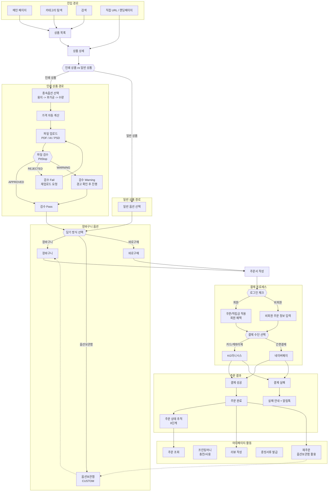
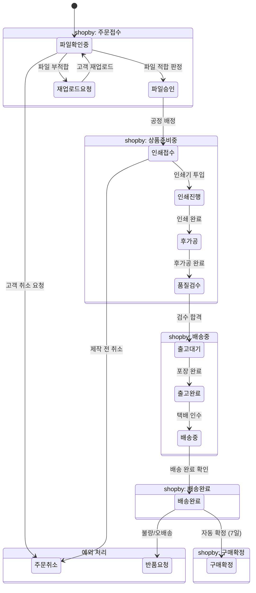
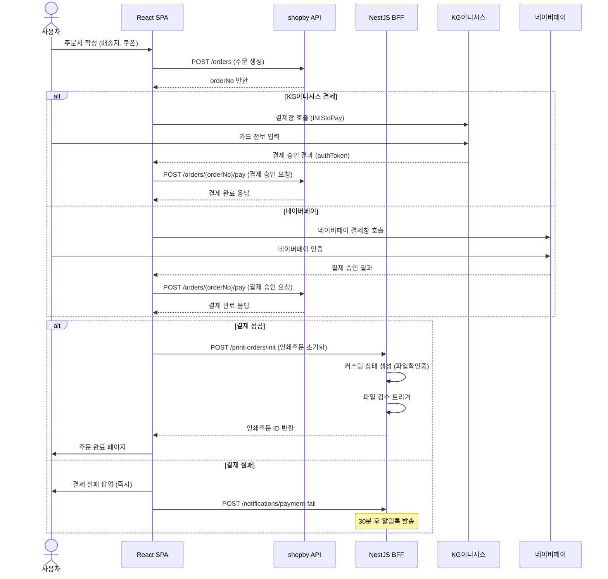
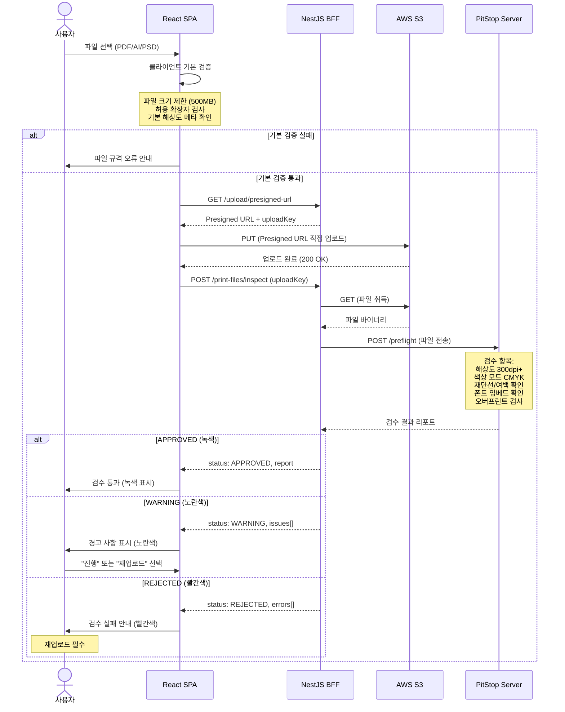
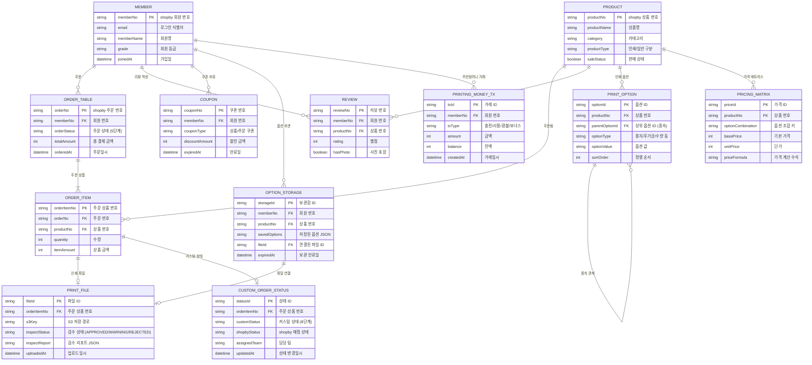
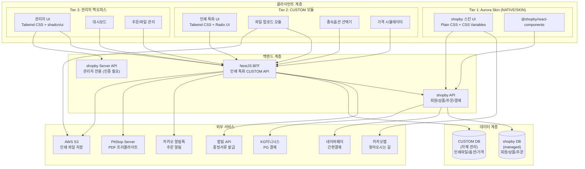
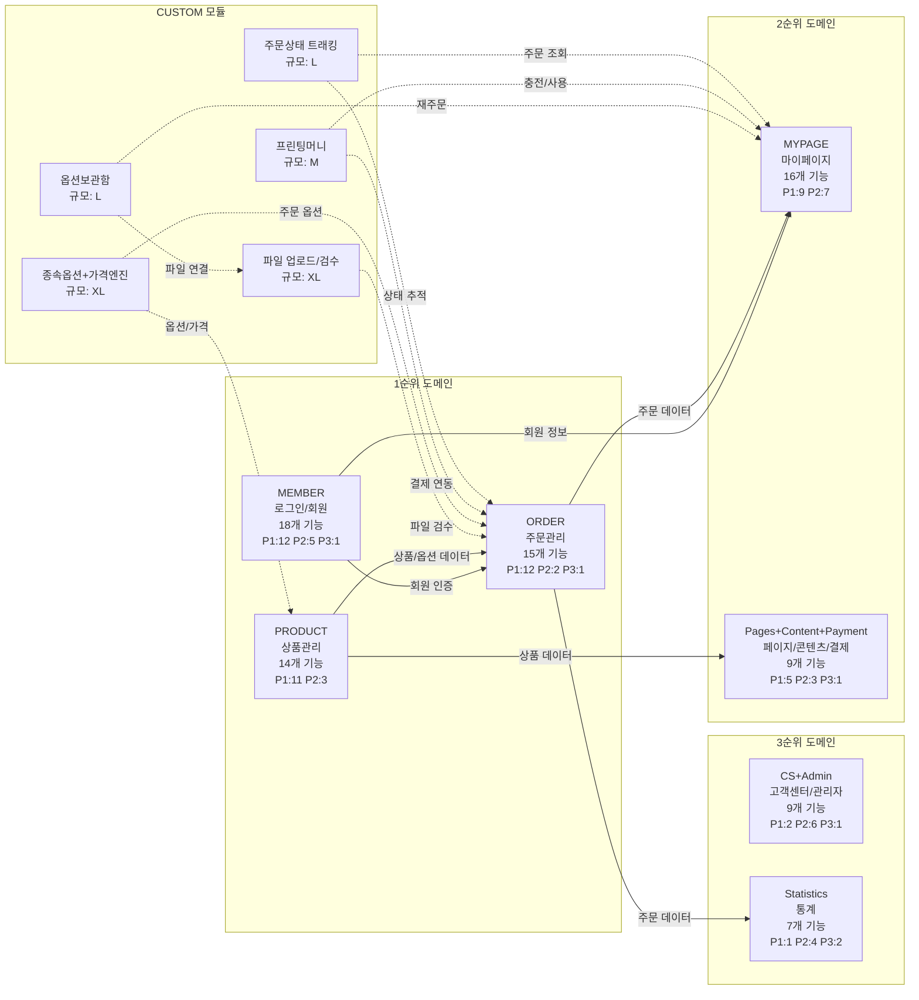
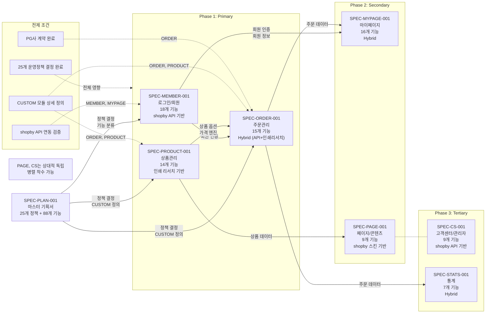

# SPEC-PLAN-001 시각화 다이어그램

> 본 문서는 SPEC-PLAN-001의 보충 자료로, 후니프린팅 리뉴얼 프로젝트의 주요 흐름과 구조를 시각화합니다.

---

## 1. 사이트 전체 UserFlow

사용자가 사이트에 진입한 시점부터 주문 완료, 마이페이지 활용까지의 전체 여정을 보여준다. 인쇄 상품과 일반 상품의 분기점, 파일 검수 프로세스, 결제 흐름, 주문 후 활동을 한눈에 파악할 수 있다.

**핵심 포인트**:
- 인쇄 상품은 종속옵션 -> 가격 계산 -> 파일 업로드 -> 검수라는 고유한 4단계를 거친다
- 파일 검수 결과는 3가지(Pass/Warning/Fail)이며, Warning은 사용자 선택에 따라 진행 가능하다
- 옵션보관함은 인쇄 도메인 특화 CUSTOM 기능으로, 재주문 시 이전 설정을 재활용한다
- 결제는 KG이니시스(기본)와 네이버페이(간편결제) 이원화 구조이다

---

## 2. 인쇄 주문 라이프사이클

shopby 플랫폼의 기본 5단계 주문 상태를 인쇄 도메인에 특화된 8단계 커스텀 상태로 매핑하는 구조이다. 인쇄 공정 특성상 파일 확인, 인쇄 진행, 후가공, 품질 검수 등의 세분화된 상태가 필요하다.

**핵심 포인트**:
- shopby 기본 5단계(주문접수 -> 상품준비중 -> 배송중 -> 배송완료 -> 구매확정)를 8단계 커스텀 상태로 확장한다
- 파일 확인 단계에서 재업로드 루프가 존재하며, 이는 인쇄 도메인 고유의 핵심 프로세스이다
- "상품준비중" 하위에 인쇄접수/인쇄진행/후가공/품질검수 4단계가 포함된다
- 구매확정은 배송완료 후 7일 자동 처리 (shopby 기본 정책)

---

## 3. 결제 흐름

사용자의 주문서 작성부터 PG 결제, BFF 인쇄주문 초기화까지의 시퀀스를 보여준다. KG이니시스와 네이버페이의 분기, 결제 실패 시 알림톡 발송 흐름을 포함한다.

**핵심 포인트**:
- shopby API로 주문을 생성하고, PG사(이니시스/네이버페이)를 통해 결제를 처리하는 2단계 구조이다
- 결제 성공 후 NestJS BFF가 인쇄 주문 고유의 초기화(커스텀 상태 생성, 파일 검수 트리거)를 수행한다
- 결제 실패 시 즉시 팝업 + 30분 후 알림톡 이중 안내 (정책 #15)

---

## 4. 파일 업로드/검수 흐름

인쇄 파일(PDF/AI/PSD)의 업로드부터 PitStop 프리플라이트 검수까지의 전체 프로세스이다. 클라이언트 사전 검증, S3 직접 업로드, BFF 검수 요청, PitStop 검수 결과 처리를 포함한다.

**핵심 포인트**:
- 클라이언트에서 파일 크기/확장자/해상도를 1차 검증하여 불필요한 업로드를 방지한다
- S3 Presigned URL을 사용하여 BFF를 거치지 않고 직접 업로드한다 (대용량 파일 최적화)
- PitStop Server가 5가지 항목(해상도, CMYK, 재단선, 폰트, 오버프린트)을 검수한다
- 검수 결과 3가지: APPROVED(즉시 진행), WARNING(선택적 진행), REJECTED(재업로드 필수)

---

## 5. Hybrid ERD

shopby 플랫폼이 관리하는 엔티티(참조용)와 후니프린팅이 자체 DB에서 관리하는 CUSTOM 엔티티의 관계를 보여준다. 두 시스템 간의 데이터 연결 지점을 명확히 한다.

**핵심 포인트**:
- shopby 관리 엔티티(MEMBER, PRODUCT, ORDER 등)는 shopby DB에 존재하며 API로만 접근한다
- CUSTOM 엔티티(PRINT_FILE, PRINT_OPTION, PRICING_MATRIX 등)는 자체 DB에서 직접 관리한다
- 두 시스템의 연결점은 memberNo, productNo, orderItemNo이다
- PRINT_OPTION은 자기 참조(parentOptionId)로 용지 -> 후가공 -> 수량의 종속 체인을 구현한다

---

## 6. 시스템 아키텍처

3-Tier Hybrid 아키텍처의 전체 구조를 보여준다. 클라이언트(Tier 1/2/3), 백엔드(shopby API + NestJS BFF), 외부 서비스, 데이터 계층의 연결 관계를 시각화한다.

**핵심 포인트**:
- Tier 1(NATIVE/SKIN)은 shopby API와 직접 통신하며, Plain CSS를 사용한다
- Tier 2(CUSTOM)는 NestJS BFF를 통해 인쇄 특화 로직을 처리하며, Tailwind + Radix UI를 사용한다
- Tier 3(관리자)는 shopby Server API + NestJS BFF 양쪽 모두와 통신한다
- 파일 업로드는 S3 직접 업로드(Presigned URL) + BFF 검수 요청의 2단계 구조이다
- shopby DB는 관리형(managed)이고, CUSTOM DB만 직접 관리한다

---

## 7. 도메인 상호작용 맵

7개 도메인과 CUSTOM 모듈 간의 데이터 흐름과 의존 관계를 보여준다. 도메인별 기능 수와 우선순위, CUSTOM 모듈의 규모와 연결 지점을 한눈에 파악할 수 있다.

**핵심 포인트**:
- Primary 도메인(MEMBER, ORDER, PRODUCT)이 전체 기능의 54%를 차지하며 가장 먼저 구현해야 한다
- CUSTOM 모듈 5개 중 4개(파일, 옵션, 보관함, 트래킹)가 ORDER 도메인과 연결된다
- MYPAGE는 ORDER, MEMBER, CUSTOM 모듈 모두와 연결되어 의존성이 가장 복잡하다
- 종속옵션+가격엔진(XL)은 PRODUCT와 ORDER 양쪽에 걸쳐 있어 가장 복잡한 CUSTOM 모듈이다

---

## 8. 후속 SPEC 의존성 체인

SPEC-PLAN-001에서 파생되는 7개 후속 SPEC의 생성 순서와 데이터 의존 관계를 보여준다. 병렬 착수 가능한 SPEC과 선행 SPEC이 필요한 SPEC을 구분한다.

**핵심 포인트**:
- Phase 1의 MEMBER, ORDER, PRODUCT는 병렬 착수 가능하나 ORDER는 MEMBER와 PRODUCT에 데이터 의존성이 있다
- MYPAGE는 MEMBER + ORDER의 데이터가 모두 필요하므로 Phase 2로 배치된다
- PAGE와 CS는 상대적으로 독립적이어서 Phase 1 완료를 기다리지 않고 착수 가능하다
- 4가지 전제 조건(정책 결정, CUSTOM 정의, API 검증, PG 계약)이 전체 SPEC 착수의 블로킹 요소이다
- STATS는 ORDER 데이터에 가장 강하게 의존하므로 Phase 3 후반에 배치된다

---

## 추적성

| 참조 다이어그램 | 관련 SPEC 절 | 데이터 소스 |
|---------------|-------------|------------|
| 1. 사이트 전체 UserFlow | spec.md 2절 (EARS 요구사항) | features-data.json |
| 2. 인쇄 주문 라이프사이클 | spec.md 5절 (CUSTOM 모듈 #5) | research-printing.md |
| 3. 결제 흐름 | spec.md 3절 (정책 #7, #8, #15) | policies-data.json |
| 4. 파일 업로드/검수 흐름 | spec.md 5절 (CUSTOM 모듈 #1) | research-printing.md |
| 5. Hybrid ERD | spec.md 5절 (CUSTOM 모듈 전체) | custom-dev-data.json |
| 6. 시스템 아키텍처 | spec.md 7절 (기술 제약사항) | plan.md 3절 |
| 7. 도메인 상호작용 맵 | spec.md 4절 (도메인 분류) | features-data.json |
| 8. 후속 SPEC 의존성 체인 | spec.md 6절 (SPEC 생성 계획) | plan.md 5절 |
