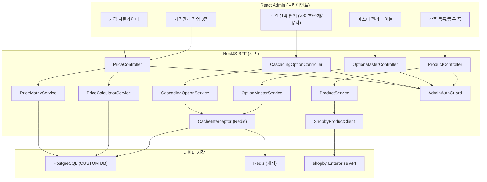
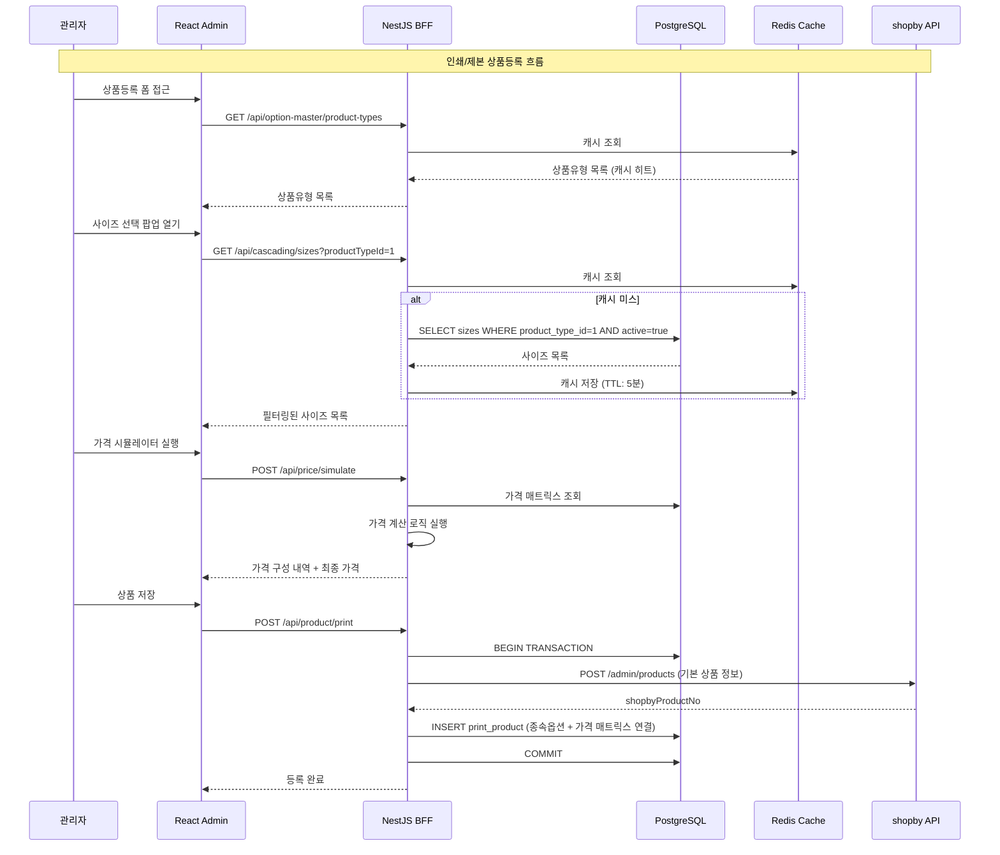
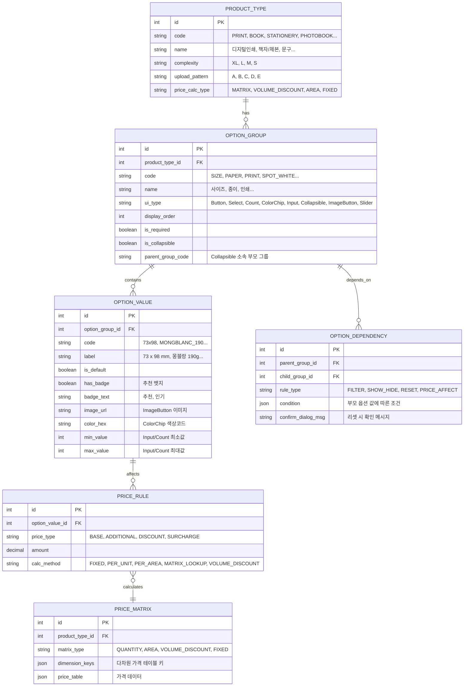
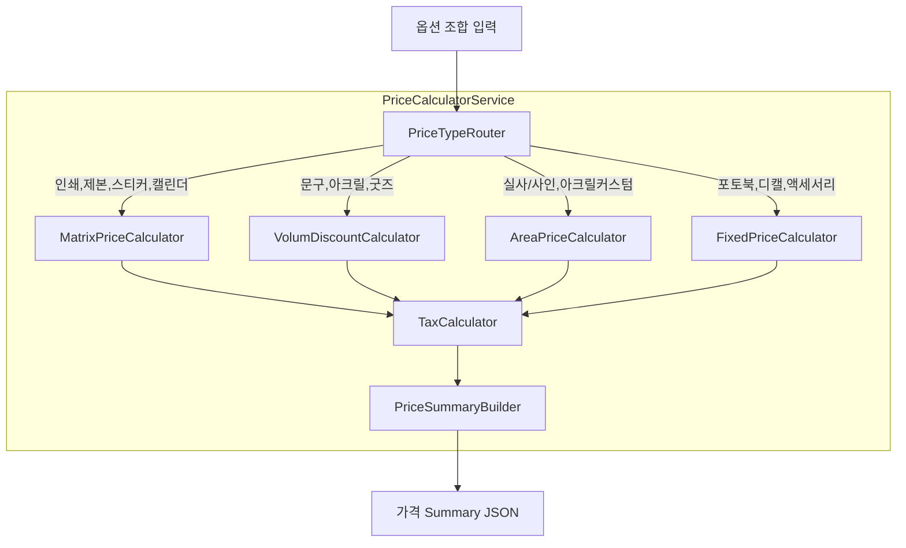
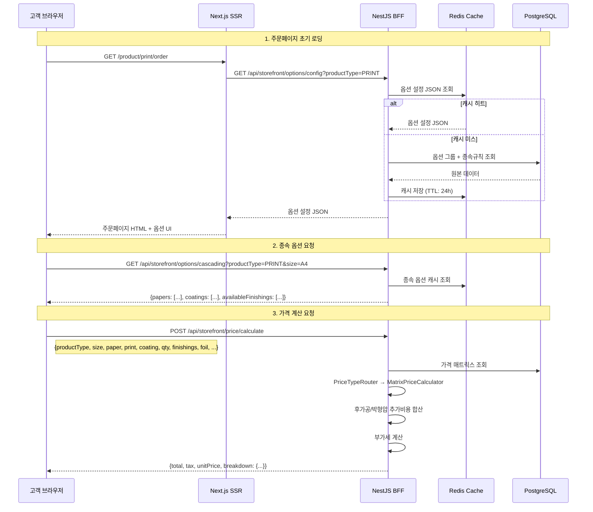

# SPEC-PRODUCT-001: A10B4-PRODUCT 아키텍처 설계

> 후니프린팅 상품관리 도메인 (14개 기능) 기술 아키텍처

---

## 1. 시스템 아키텍처 개요

### 1.1 Tier 2 CUSTOM 아키텍처



### 1.2 데이터 흐름



---

## 2. 데이터베이스 설계

### 2.1 테이블 설계

#### 상품유형 테이블 (product_type)

| 컬럼 | 타입 | 설명 |
|------|------|------|
| id | SERIAL PK | 자동 증가 |
| code | VARCHAR(20) UNIQUE | 유형 코드 (PRINT, GOODS, HANDMADE, PACKAGE, DESIGN) |
| name | VARCHAR(100) | 유형명 |
| description | TEXT | 설명 |
| active | BOOLEAN DEFAULT true | 활성 상태 |
| sort_order | INT DEFAULT 0 | 표시 순서 |
| created_at | TIMESTAMP | 생성일시 |
| updated_at | TIMESTAMP | 수정일시 |

#### 사이즈 마스터 (size_master)

| 컬럼 | 타입 | 설명 |
|------|------|------|
| id | SERIAL PK | 자동 증가 |
| product_type_id | INT FK | 상품유형 참조 |
| name | VARCHAR(100) | 사이즈명 (A4, B5 등) |
| code | VARCHAR(20) | 사이즈 코드 |
| width_mm | INT | 가로 치수(mm) |
| height_mm | INT | 세로 치수(mm) |
| sort_order | INT DEFAULT 0 | 표시 순서 |
| active | BOOLEAN DEFAULT true | 활성 상태 |
| created_at | TIMESTAMP | 생성일시 |
| updated_at | TIMESTAMP | 수정일시 |

#### 소재 마스터 (material_master)

| 컬럼 | 타입 | 설명 |
|------|------|------|
| id | SERIAL PK | 자동 증가 |
| product_type_id | INT FK | 상품유형 참조 |
| name | VARCHAR(100) | 소재명 |
| description | TEXT | 소재 설명 |
| active | BOOLEAN DEFAULT true | 활성 상태 |
| sort_order | INT DEFAULT 0 | 표시 순서 |
| created_at | TIMESTAMP | 생성일시 |
| updated_at | TIMESTAMP | 수정일시 |

#### 용지 마스터 (paper_master)

| 컬럼 | 타입 | 설명 |
|------|------|------|
| id | SERIAL PK | 자동 증가 |
| product_type_id | INT FK | 상품유형 참조 |
| name | VARCHAR(100) | 용지명 (아트지, 스노우지 등) |
| weight_gsm | INT | 평량(g/m2) |
| coating_type | VARCHAR(50) | 코팅 종류 (무광/유광/홀로그램/벨벳) |
| active | BOOLEAN DEFAULT true | 활성 상태 |
| sort_order | INT DEFAULT 0 | 표시 순서 |
| created_at | TIMESTAMP | 생성일시 |
| updated_at | TIMESTAMP | 수정일시 |

#### 사이즈-소재 매핑 (size_material_map)

| 컬럼 | 타입 | 설명 |
|------|------|------|
| id | SERIAL PK | 자동 증가 |
| size_id | INT FK | 사이즈 마스터 참조 |
| material_id | INT FK | 소재 마스터 참조 |
| UNIQUE(size_id, material_id) | | 중복 방지 |

#### 사이즈-용지 매핑 (size_paper_map)

| 컬럼 | 타입 | 설명 |
|------|------|------|
| id | SERIAL PK | 자동 증가 |
| size_id | INT FK | 사이즈 마스터 참조 |
| paper_id | INT FK | 용지 마스터 참조 |
| UNIQUE(size_id, paper_id) | | 중복 방지 |

#### 가격 코드 (price_code)

| 컬럼 | 타입 | 설명 |
|------|------|------|
| code | VARCHAR(10) PK | 가격 코드 (DP02, DP04 등) |
| name | VARCHAR(100) | 코드명 |
| product_group | VARCHAR(50) | 상품군 (디지털인쇄, 굿즈, 패키지, 제본) |
| price_components | JSONB | 가격 구성 요소 목록 |
| created_at | TIMESTAMP | 생성일시 |

#### 가격 매트릭스 (price_matrix)

| 컬럼 | 타입 | 설명 |
|------|------|------|
| id | SERIAL PK | 자동 증가 |
| price_code | VARCHAR(10) FK | 가격 코드 참조 |
| size_id | INT FK NULL | 사이즈 참조 (선택) |
| paper_id | INT FK NULL | 용지 참조 (선택) |
| print_side | VARCHAR(10) | 인쇄면 (단면/양면) |
| coating_type | VARCHAR(50) | 코팅 종류 |
| quantity_prices | JSONB | 수량별 가격 {100: 12000, 500: 30000, ...} |
| active | BOOLEAN DEFAULT true | 활성 상태 |
| version | INT DEFAULT 1 | 낙관적 잠금용 버전 |
| created_at | TIMESTAMP | 생성일시 |
| updated_at | TIMESTAMP | 수정일시 |

#### 후가공 가격 (finishing_price)

| 컬럼 | 타입 | 설명 |
|------|------|------|
| id | SERIAL PK | 자동 증가 |
| finishing_type | VARCHAR(50) | 후가공 종류 |
| unit_price | DECIMAL(10,2) | 단가 |
| quantity_discount | JSONB | 수량 할인율 |
| active | BOOLEAN DEFAULT true | 활성 상태 |

#### 제본 가격 (binding_price)

| 컬럼 | 타입 | 설명 |
|------|------|------|
| id | SERIAL PK | 자동 증가 |
| binding_type | VARCHAR(50) | 제본 방식 (무선/중철/스프링/양장) |
| page_range_prices | JSONB | 페이지 수 구간별 가격 |
| active | BOOLEAN DEFAULT true | 활성 상태 |

#### 가격 변경 이력 (price_change_log)

| 컬럼 | 타입 | 설명 |
|------|------|------|
| id | SERIAL PK | 자동 증가 |
| price_matrix_id | INT FK | 가격 매트릭스 참조 |
| before_value | JSONB | 변경 전 값 |
| after_value | JSONB | 변경 후 값 |
| changed_by | VARCHAR(100) | 변경자 |
| changed_at | TIMESTAMP | 변경일시 |
| change_reason | TEXT NULL | 변경 사유 |

#### 인쇄 상품 (print_product)

| 컬럼 | 타입 | 설명 |
|------|------|------|
| id | SERIAL PK | 자동 증가 |
| shopby_product_no | BIGINT UNIQUE | shopby 상품번호 |
| product_type_id | INT FK | 상품유형 참조 |
| price_code | VARCHAR(10) FK | 가격 코드 참조 |
| default_options | JSONB | 기본값 설정 |
| express_surcharge_rate | DECIMAL(4,2) NULL | 당일출고 할증율 (0.30~0.50) |
| guideline_pdf_url | VARCHAR(500) NULL | PDF 가이드라인 URL |
| auto_save_data | JSONB NULL | 임시저장 데이터 |
| status | VARCHAR(20) DEFAULT 'draft' | 상태 (draft/active/inactive) |
| created_at | TIMESTAMP | 생성일시 |
| updated_at | TIMESTAMP | 수정일시 |

#### 상품 옵션 셋 (product_option_set)

| 컬럼 | 타입 | 설명 |
|------|------|------|
| id | SERIAL PK | 자동 증가 |
| print_product_id | INT FK | 인쇄 상품 참조 |
| size_id | INT FK | 선택된 사이즈 |
| material_id | INT FK NULL | 선택된 소재 |
| paper_id | INT FK NULL | 선택된 용지 |
| finishing_ids | INT[] | 선택된 후가공 ID 목록 |

### 2.2 인덱스 전략

```sql
-- 사이즈 마스터 조회 최적화
CREATE INDEX idx_size_master_product_type ON size_master(product_type_id, active);

-- 소재/용지 매핑 조회 최적화
CREATE INDEX idx_size_material_map_size ON size_material_map(size_id);
CREATE INDEX idx_size_paper_map_size ON size_paper_map(size_id);

-- 가격 매트릭스 조회 최적화
CREATE INDEX idx_price_matrix_code ON price_matrix(price_code, active);
CREATE INDEX idx_price_matrix_lookup ON price_matrix(price_code, size_id, paper_id, print_side);

-- 인쇄 상품 조회 최적화
CREATE INDEX idx_print_product_shopby ON print_product(shopby_product_no);
CREATE INDEX idx_print_product_type ON print_product(product_type_id, status);

-- 가격 변경 이력 조회
CREATE INDEX idx_price_change_log_matrix ON price_change_log(price_matrix_id, changed_at DESC);
```

---

## 3. API 설계

### 3.1 옵션 마스터 API

| Method | Path | 설명 |
|--------|------|------|
| GET | /api/admin/option-master/sizes | 사이즈 목록 (필터: productTypeId, active) |
| POST | /api/admin/option-master/sizes | 사이즈 등록 |
| PUT | /api/admin/option-master/sizes/:id | 사이즈 수정 |
| PATCH | /api/admin/option-master/sizes/:id/active | 활성/비활성 토글 |
| GET | /api/admin/option-master/materials | 소재 목록 |
| POST | /api/admin/option-master/materials | 소재 등록 |
| PUT | /api/admin/option-master/materials/:id | 소재 수정 |
| PATCH | /api/admin/option-master/materials/:id/active | 활성/비활성 토글 |
| GET | /api/admin/option-master/papers | 용지 목록 |
| POST | /api/admin/option-master/papers | 용지 등록 |
| PUT | /api/admin/option-master/papers/:id | 용지 수정 |
| PATCH | /api/admin/option-master/papers/:id/active | 활성/비활성 토글 |
| POST | /api/admin/option-master/bulk-import | 엑셀 일괄 업로드 |

### 3.2 종속옵션 API

| Method | Path | 설명 |
|--------|------|------|
| GET | /api/admin/cascading/product-types | 상품유형 목록 |
| GET | /api/admin/cascading/sizes | 상품유형별 사이즈 (query: productTypeId) |
| GET | /api/admin/cascading/materials | 사이즈별 소재 (query: sizeId) |
| GET | /api/admin/cascading/papers | 사이즈별 용지 (query: sizeId) |
| GET | /api/admin/cascading/finishings | 상품유형별 후가공 (query: productTypeId) |
| POST | /api/admin/cascading/validate | 옵션 조합 유효성 검증 |

### 3.3 가격 엔진 API

| Method | Path | 설명 |
|--------|------|------|
| GET | /api/admin/price/codes | 가격 코드 목록 |
| GET | /api/admin/price/matrix/:priceCode | 가격 매트릭스 조회 |
| PUT | /api/admin/price/matrix/:priceCode | 가격 매트릭스 저장 |
| POST | /api/admin/price/simulate | 가격 시뮬레이션 |
| GET | /api/admin/price/change-log/:priceCode | 가격 변경 이력 |
| GET | /api/admin/price/finishings | 후가공 가격 목록 |
| PUT | /api/admin/price/finishings/:id | 후가공 가격 수정 |
| GET | /api/admin/price/bindings | 제본 가격 목록 |
| PUT | /api/admin/price/bindings/:id | 제본 가격 수정 |

### 3.4 상품 관리 API

| Method | Path | 설명 |
|--------|------|------|
| GET | /api/admin/product/print | 인쇄 상품 목록 |
| POST | /api/admin/product/print | 인쇄 상품 등록 |
| PUT | /api/admin/product/print/:id | 인쇄 상품 수정 |
| POST | /api/admin/product/print/:id/duplicate | 상품 복제 |
| PATCH | /api/admin/product/print/:id/status | 상태 변경 |
| POST | /api/admin/product/print/:id/auto-save | 임시저장 |
| GET | /api/admin/product/print/:id/auto-save | 임시저장 불러오기 |
| GET | /api/admin/product/print/:id/preview | 미리보기 데이터 |

### 3.5 쇼핑몰 프론트 API (SPEC-PAGE-001에서 사용)

| Method | Path | 설명 |
|--------|------|------|
| GET | /api/product/:shopbyProductNo/options | 상품 옵션 체인 |
| POST | /api/product/price/calculate | 가격 계산 (최종 서버사이드) |

---

## 4. 캐싱 전략

| 대상 | 캐시 키 | TTL | 무효화 시점 |
|------|---------|-----|-----------|
| 상품유형 목록 | `product-types:all` | 1시간 | 상품유형 변경 시 |
| 사이즈 마스터 | `sizes:productType:{id}` | 5분 | 사이즈 CRUD 시 |
| 소재 마스터 | `materials:productType:{id}` | 5분 | 소재 CRUD 시 |
| 용지 마스터 | `papers:productType:{id}` | 5분 | 용지 CRUD 시 |
| 사이즈-소재 매핑 | `size-material:size:{id}` | 5분 | 매핑 변경 시 |
| 사이즈-용지 매핑 | `size-paper:size:{id}` | 5분 | 매핑 변경 시 |
| 가격 매트릭스 | 캐시 미적용 | - | 실시간 조회 (정확성 우선) |

---

## 5. 보안 설계

### 5.1 인증/인가

- 모든 `/api/admin/*` 엔드포인트에 `AdminAuthGuard` 적용
- shopby Admin API 토큰 기반 관리자 인증
- 역할 기반 권한: SUPER_ADMIN(전체), PRODUCT_ADMIN(상품관리만)

### 5.2 가격 보안

- 가격 매트릭스 원본은 관리자 API에서만 조회 가능
- 쇼핑몰 프론트 API(`/api/product/price/calculate`)는 계산 결과만 반환
- 가격 계산 입력값 서버사이드 검증 (Zod 스키마)
- 가격 변경 이력 전수 기록 (감사 추적)

---

## 6. 쇼핑몰 옵션 엔진 아키텍처 (모듈 6)

> Figma option_NEW 분석 + product-order-pages.md + option-dependency-map.md 기반

### 6.1 옵션 엔진 데이터 모델 (6개 엔티티)



### 6.2 가격 계산 서비스 아키텍처 (4유형)



#### 매트릭스형 계산 흐름 (인쇄, 제본, 스티커, 캘린더)

```
인쇄비 = 기본단가[사이즈][용지][인쇄방식] × 수량 × 건수
별색비 = SUM(별색종류별_단가 × 면수)
코팅비 = 코팅단가[종류][단면/양면] × 수량
커팅비 = 커팅단가[방식] × 수량
접지비 = 접지단가[방식] × 수량 (인쇄만)
후가공비 = SUM(개별_후가공_단가 × 수량)
박형압비 = SUM(박_단가[면적][칼라] + 형압_단가[면적][유형])
추가상품 = 봉투_단가 × 수량
---
소계 = 인쇄비 + 별색비 + 코팅비 + 커팅비 + 접지비 + 후가공비 + 박형압비 + 추가상품
부가세 = 소계 × 10%
합계 = 소계 + 부가세
단가 = 합계 / 수량
```

#### 구간할인형 계산 흐름 (문구, 아크릴, 굿즈)

```
수량별단가 = 구간할인테이블[수량] (비선형 체감)
본체가 = 수량별단가 × 수량
할인금액 = (기본단가 - 수량별단가) × 수량  (굿즈만 마이너스 표시)
추가상품 = 봉투_단가 × 봉투수량
---
소계 = 본체가 + 추가상품
부가세 = 소계 × 10%
합계 = 소계 + 부가세
```

#### 면적형 계산 흐름 (실사/사인, 아크릴 커스텀)

```
면적(m2) = 가로(mm) × 세로(mm) / 1,000,000
기본가 = 면적(m2) × m2당_단가[소재별]
별색비 = 화이트인쇄_단가[방식] × 면적 (실사/사인만)
---
소계 = 기본가 + 별색비
부가세 = 소계 × 10%
합계 = 소계 + 부가세
```

### 6.3 Redis 캐시 전략 (쇼핑몰 프론트용)

| 데이터 | 캐시 키 | TTL | 무효화 조건 |
|--------|---------|-----|-----------|
| 상품유형별 옵션 설정 JSON | `storefront:config:{productTypeCode}` | 24시간 | 관리자 옵션 변경 시 |
| 사이즈별 종속 옵션 목록 | `storefront:cascading:{productType}:{sizeCode}` | 1시간 | 소재/용지 마스터 변경 시 |
| 가격 매트릭스 (읽기) | `storefront:price:{priceCode}:{hash}` | 30분 | 가격표 변경 시 |
| 후가공 단가표 | `storefront:finishing:{productType}` | 1시간 | 단가 변경 시 |
| 구간할인 테이블 | `storefront:volume-discount:{productType}` | 1시간 | 할인 정책 변경 시 |

### 6.4 쇼핑몰 BFF API 시퀀스 다이어그램



### 6.5 프론트엔드 옵션 엔진 구조

```
src/features/order/
├── OptionEngine.ts                    # 옵션 종속성 엔진 코어
├── PriceCalculationHook.ts            # usePriceCalculation 훅
├── components/
│   ├── OrderPageLayout.tsx            # 공통 레이아웃
│   ├── OptionGroupRenderer.tsx        # 옵션 그룹 동적 렌더러
│   ├── ButtonOption.tsx               # Button 타입 옵션
│   ├── SelectOption.tsx               # Select 드롭다운 옵션
│   ├── CountOption.tsx                # Count (+/-) 옵션
│   ├── ColorChipOption.tsx            # ColorChip 옵션
│   ├── InputOption.tsx                # 크기 직접입력 옵션
│   ├── ImageButtonOption.tsx          # Image Button (띠걸이/띠사별)
│   ├── CollapsibleSection.tsx         # 접이식 후가공/박형압
│   ├── VolumeDiscountSlider.tsx       # 구간할인 슬라이더
│   ├── PriceSummary.tsx               # 가격 Summary 패널
│   ├── PriceSummaryDetailed.tsx       # 항목별 가격 분해
│   ├── PriceSummarySimple.tsx         # 간소화 가격 (고정가)
│   └── FileUploadArea.tsx             # 파일 업로드 (패턴별)
├── pages/
│   └── [productType]/
│       └── OrderPage.tsx              # 동적 라우트 주문페이지
└── types/
    ├── option-config.ts               # 옵션 설정 타입
    ├── dependency-rule.ts             # 종속 규칙 타입
    └── price-calculation.ts           # 가격 계산 타입
```
