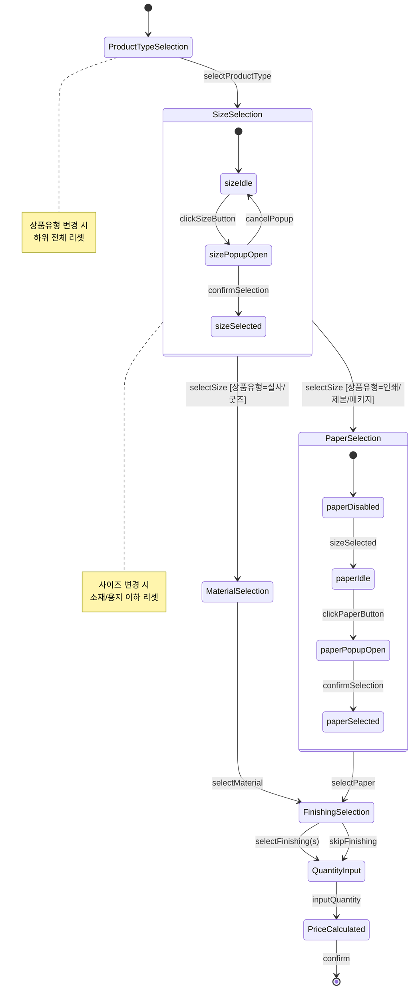
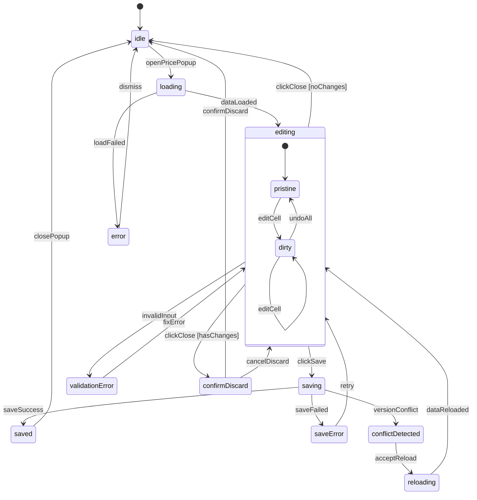
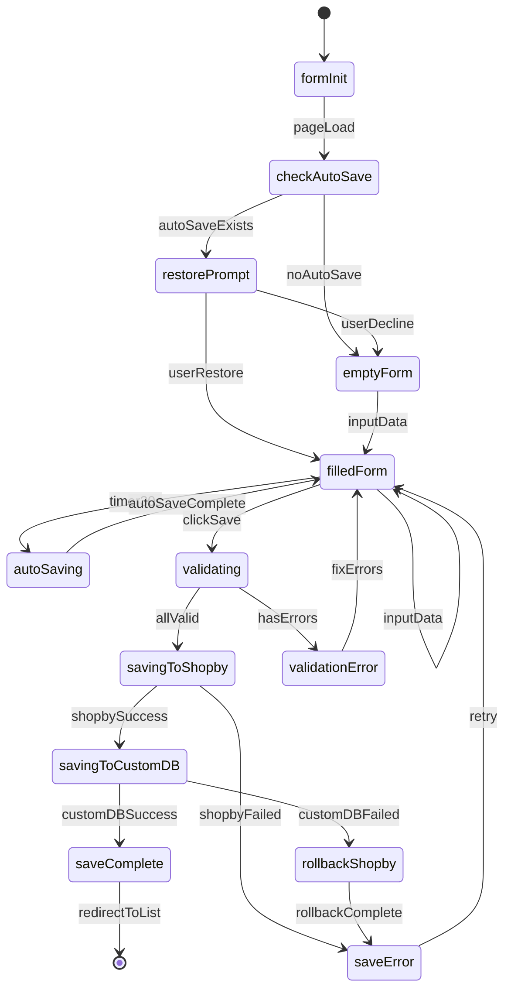
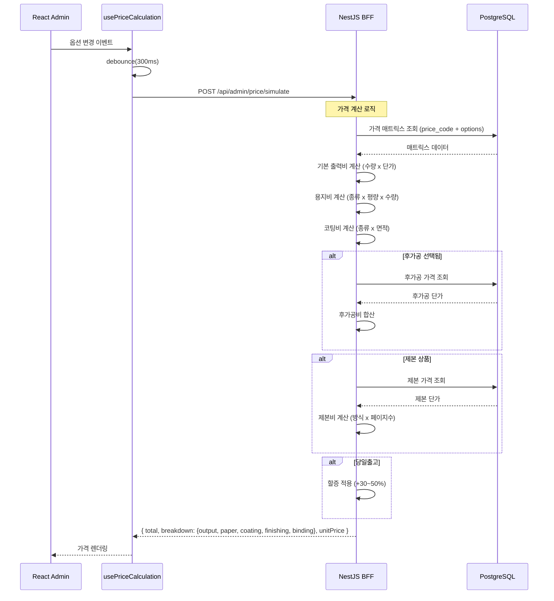
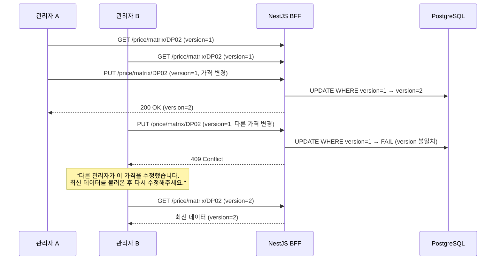
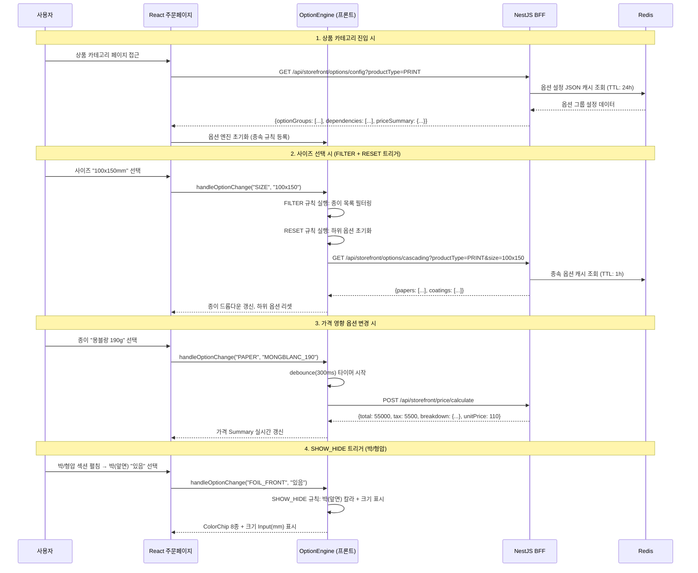
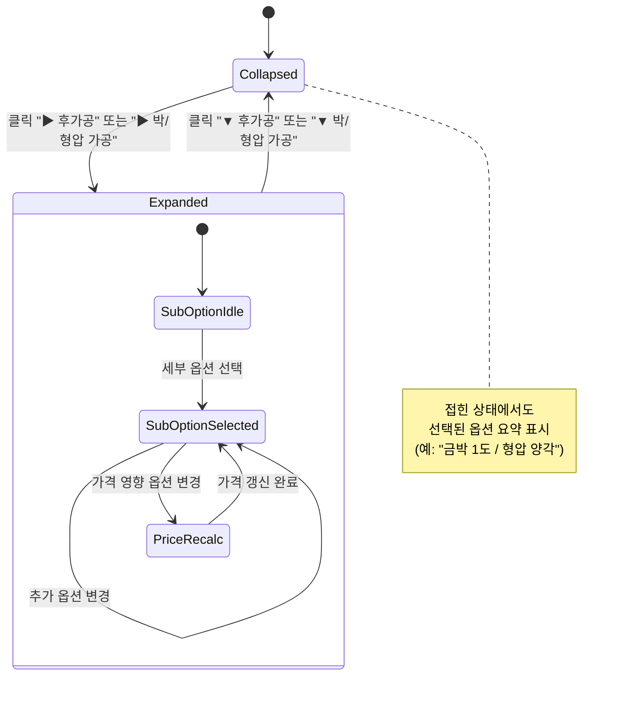
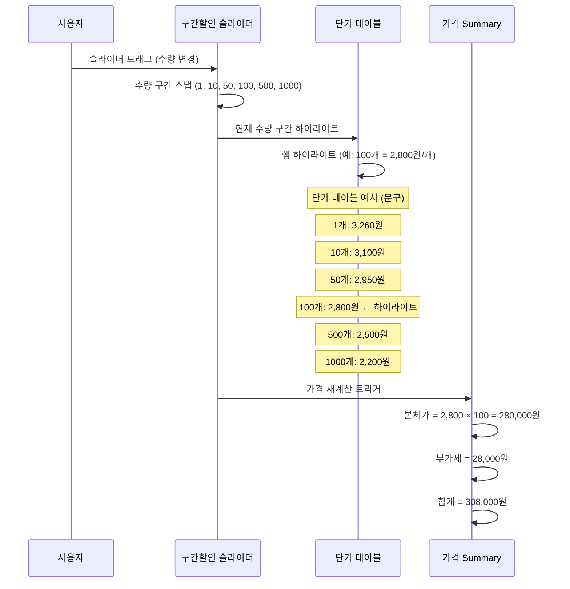
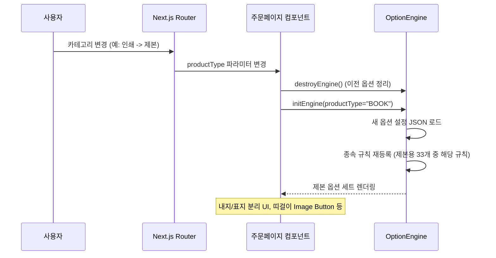

# SPEC-PRODUCT-001: 인터랙션 정의서

> A10B4-PRODUCT 상품관리 도메인 상태 머신, 옵션 캐스케이딩 로직, 가격 계산 흐름

---

## 1. 상태 머신 (State Machines)

### 1.1 종속옵션 캐스케이딩 상태



### 1.2 가격 매트릭스 편집 상태



### 1.3 상품등록 폼 상태



---

## 2. 옵션 캐스케이딩 상세 로직

### 2.1 상위 옵션 변경 시 리셋 규칙

| 변경된 옵션 | 리셋 대상 | 확인 다이얼로그 |
|------------|----------|---------------|
| 상품유형 | 사이즈, 소재/용지, 후가공, 수량 | "상품유형 변경 시 모든 하위 옵션이 초기화됩니다" |
| 사이즈 | 소재/용지, 후가공 (일부) | "사이즈 변경 시 소재/용지 선택이 초기화됩니다" |
| 소재/용지 | 없음 (독립적) | 불필요 |
| 후가공 | 없음 (독립적) | 불필요 |

### 2.2 팝업 동작 규칙

| 팝업 | 열기 조건 | 데이터 소스 | 선택 방식 |
|------|----------|-----------|----------|
| 사이즈 | 상품유형 선택 완료 | `GET /cascading/sizes?productTypeId={id}` | 다중선택 체크박스 |
| 소재 | 사이즈 선택 완료 + 상품유형=실사/굿즈 | `GET /cascading/materials?sizeId={id}` | 다중선택 체크박스 |
| 용지 | 사이즈 선택 완료 + 상품유형=인쇄/제본 | `GET /cascading/papers?sizeId={id}` | 다중선택 체크박스 |

### 2.3 비활성화 상태 표시 규칙

```
[상품유형] ────> 선택됨: 활성화
                미선택: "상품유형을 먼저 선택하세요"

[사이즈]   ────> 상품유형 선택 시: 활성화
                미선택: 비활성화 + "상품유형을 먼저 선택하세요"

[소재/용지] ──> 사이즈 선택 시: 활성화 (상품유형에 따라 소재 또는 용지)
                미선택: 비활성화 + "사이즈를 먼저 선택하세요"

[후가공]   ────> 소재/용지 선택 시: 활성화
                미선택: 비활성화 + "소재/용지를 먼저 선택하세요"

[수량]     ────> 항상 활성화 (기본값: 100)
```

---

## 3. 가격 계산 흐름

### 3.1 가격 계산 시퀀스



### 3.2 가격 구성 내역 표시 형식

```
┌─────────────────────────────────────────┐
│ 가격 구성 내역                            │
├─────────────────────────────────────────┤
│ 기본 출력비 (A4/양면/500매)    ₩30,000  │
│ 용지비 (스노우지 250g)         ₩5,000   │
│ 코팅비 (유광 양면)              ₩3,000   │
│ 후가공비 (금박 1도)             ₩15,000  │
│ 제본비                          ₩0      │
├─────────────────────────────────────────┤
│ 소계                            ₩53,000  │
│ 당일출고 할증 (+30%)           ₩15,900  │
├─────────────────────────────────────────┤
│ 최종 가격                       ₩68,900  │
│ 단가 (매당)                    ₩137.80  │
└─────────────────────────────────────────┘
```

---

## 4. 가격관리 팝업 상호작용

### 4.1 DP 계열 (디지털인쇄) 가격 그리드

```
           │  100매  │  500매  │ 1,000매 │ 5,000매 │ 10,000매 │
───────────┼─────────┼─────────┼─────────┼─────────┼──────────┤
편면/무코팅 │ 12,000  │ 30,000  │ 35,000  │ 75,000  │ 100,000  │
편면/유광   │ 15,000  │ 37,500  │ 43,750  │ 93,750  │ 125,000  │
양면/무코팅 │ 20,000  │ 50,000  │ 58,000  │ 125,000 │ 166,000  │
양면/유광   │ 25,000  │ 62,500  │ 72,500  │ 156,250 │ 208,000  │
```

**편집 규칙**:
- 셀 클릭 시 인라인 편집 (숫자만 입력)
- Tab 키로 다음 셀 이동
- Enter로 저장, ESC로 취소
- 변경된 셀은 노란색 하이라이트
- 0원 입력 시 빨간색 테두리 + "가격은 0원 이상이어야 합니다" 경고

### 4.2 PR 계열 (제본) 가격 그리드

```
           │ 20p 이하 │ 21~50p │ 51~100p │ 101~200p │ 201p+ │
───────────┼──────────┼────────┼─────────┼──────────┼───────┤
무선제본    │ 5,000    │ 8,000  │ 15,000  │ 25,000   │ 별도  │
중철제본    │ 3,000    │ 5,000  │ -       │ -        │ -     │
스프링제본  │ 7,000    │ 10,000 │ 18,000  │ 30,000   │ 별도  │
양장제본    │ 15,000   │ 20,000 │ 35,000  │ 50,000   │ 별도  │
```

---

## 5. 낙관적 잠금 충돌 처리

### 5.1 동시 편집 충돌 시나리오



---

## 6. 자동저장 로직

### 6.1 자동저장 타이머

```
폼 데이터 변경 감지
    └── isDirty = true
        └── 30초 타이머 시작
            └── 타이머 완료
                └── POST /api/admin/product/print/{id}/auto-save
                    ├── 성공: "자동저장 완료" 토스트 (3초)
                    └── 실패: 조용히 무시 (다음 주기에 재시도)
```

### 6.2 자동저장 복원 규칙

- 페이지 로드 시 `auto_save_data` 존재 여부 확인
- 존재 시: "임시저장된 데이터가 있습니다. 복원하시겠습니까?" 토스트 표시
- "복원" 선택: 임시저장 데이터로 폼 채우기
- "삭제" 선택: 임시저장 데이터 삭제, 빈 폼 표시
- 정상 저장 완료 시: 임시저장 데이터 자동 삭제

---

## 7. 조건부 표시 규칙

| # | 조건 | 표시 변화 |
|---|------|----------|
| 1 | 상품유형 미선택 | 사이즈 버튼 disabled, 안내 텍스트 표시 |
| 2 | 사이즈 미선택 | 소재/용지 버튼 disabled, 안내 텍스트 표시 |
| 3 | 상품유형=실사/굿즈 | 소재 선택 영역 표시, 용지 선택 영역 숨김 |
| 4 | 상품유형=인쇄/제본/패키지 | 용지 선택 영역 표시, 소재 선택 영역 숨김 |
| 5 | 가격 코드 미선택 | 가격관리 버튼 disabled |
| 6 | 당일출고 체크 | 할증율 입력 필드 표시 (30~50%) |
| 7 | 제본 상품 (PR01/PR02) | 페이지 수 입력 필드 표시 |
| 8 | 마스터 데이터 참조 중 | 삭제 버튼 비활성화, "비활성화" 버튼 표시 |
| 9 | 가격 매트릭스 변경 있음 | 저장 버튼 활성화, 변경 셀 하이라이트 |
| 10 | 폼 변경 있음 (dirty) | "저장하지 않은 변경사항이 있습니다" 이탈 경고 |

---

## 8. 쇼핑몰 주문페이지 인터랙션 (모듈 6)

> Figma option_NEW 분석 + option-dependency-map.md 기반

### 8.1 옵션 종속성 33개 규칙 통합 시퀀스



### 8.2 가격 실시간 갱신 트리거 매트릭스

가격 재계산은 아래 옵션 변경 시 debounce(300ms) 후 자동 트리거됩니다.

| 옵션 변경 | 인쇄 | 제본 | 문구 | 포토 | 캘린더 | 디캘 | 액세 | 아크릴 | 실사 | 스티커 | 굿즈 |
|----------|:----:|:----:|:----:|:----:|:-----:|:----:|:----:|:-----:|:----:|:-----:|:----:|
| 사이즈 | O | O | O | O | O | O | O | O | O | O | O |
| 종이/소재 | O | O | O | - | O | O | - | O | O | O | - |
| 인쇄방식 | O | O | - | - | O | - | - | - | - | O | - |
| 별색인쇄 | O | - | - | - | - | - | - | - | O | O | - |
| 코팅 | O | O | - | - | - | - | - | - | - | - | - |
| 커팅 | O | - | - | - | - | - | - | - | - | O | - |
| 수량 | O | O | O | O | O | O | O | O | O | O | O |
| 건수 | O | - | - | - | - | - | - | - | - | - | - |
| 후가공 | O | - | - | - | - | - | - | - | - | O | - |
| 박/형압 | O | O | - | - | - | - | - | - | - | - | - |
| 봉투/포장 | O | O | O | - | O | O | - | O | - | - | O |
| 크기직접입력 | - | - | - | - | - | - | - | O | O | - | - |
| 소재 컬러 | - | - | - | - | - | - | - | - | - | - | O |

### 8.3 Collapsible 토글 인터랙션



### 8.4 구간할인 슬라이더 인터랙션 (문구/아크릴/굿즈)



### 8.5 상품 카테고리 전환 시 옵션 세트 교체


