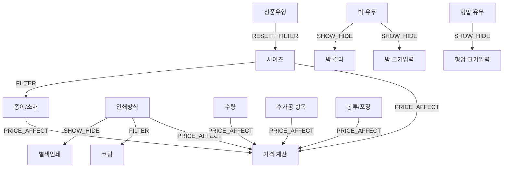
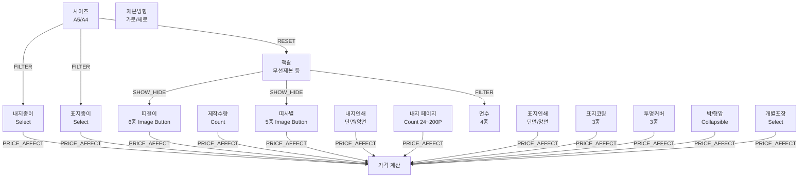
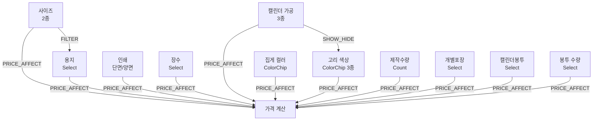
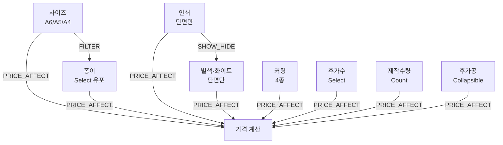
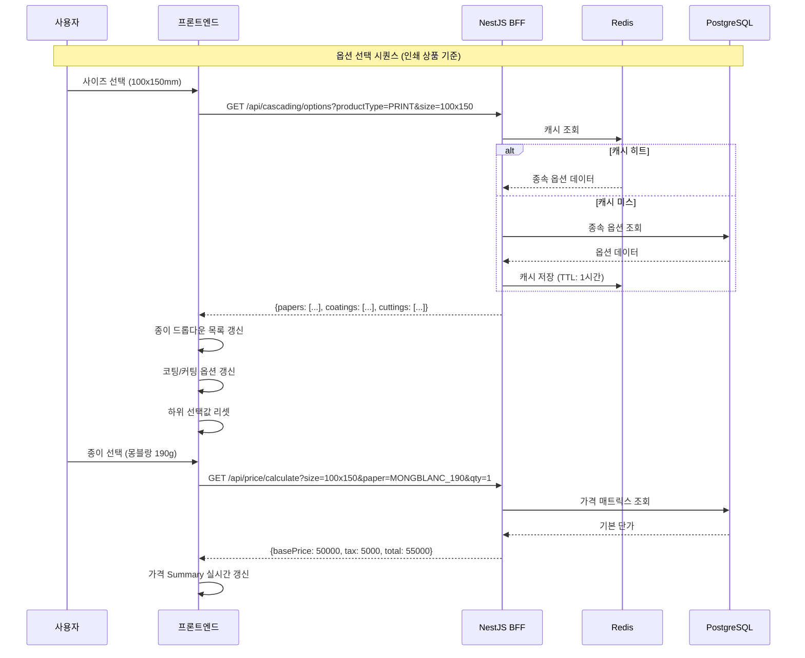

# 옵션 종속성 상세 매핑

> 11개 상품 카테고리별 옵션 간 종속 관계, 조건부 표시 규칙, 가격 영향 매트릭스
> 이 문서는 옵션 엔진(CascadingOptionService) 구현의 핵심 설계 근거입니다.

---

## 1. 종속성 유형 정의

### 1.1 종속 관계 4가지 유형

| 유형 | 코드 | 설명 | 예시 |
|------|------|------|------|
| **필터링** | FILTER | 부모 옵션 값에 따라 자식 옵션의 선택지 목록이 변경 | 사이즈 선택 -> 종이 목록 필터링 |
| **표시/숨김** | SHOW_HIDE | 부모 옵션 값에 따라 자식 옵션 그룹 전체가 표시되거나 숨겨짐 | 박(있음) -> 박 칼라/크기 표시 |
| **리셋** | RESET | 부모 옵션 변경 시 자식 옵션 값이 초기화 | 상품유형 변경 -> 전체 옵션 리셋 |
| **가격영향** | PRICE_AFFECT | 옵션 값 변경이 가격 계산에 영향 | 수량 변경 -> 가격 재계산 |

### 1.2 종속 방향



---

## 2. 상품별 종속성 체인 다이어그램

### 2.1 디지털인쇄 (XL) - 가장 복잡한 종속 체인

```mermaid
graph TD
    SIZE[사이즈<br/>7종 Button]
    PAPER[종이<br/>Select 드롭다운]
    PRINT[인쇄<br/>단면/양면]
    SPOT_W[별색-화이트<br/>없음/단면/양면]
    SPOT_C[별색-클리어<br/>없음/단면/양면]
    SPOT_P[별색-핑크<br/>없음/단면/양면]
    SPOT_G[별색-금색<br/>없음/단면/양면]
    SPOT_S[별색-은색<br/>없음/단면/양면]
    COAT[코팅<br/>5종 Button]
    CUT[커팅<br/>4종 Button]
    FOLD[접지<br/>3종 Button]
    CNT[건수<br/>Count]
    QTY[제작수량<br/>Count]
    FINISH[후가공<br/>Collapsible]
    FOIL[박/형압<br/>Collapsible]
    FOIL_F[박(앞면)<br/>있음/없음]
    FOIL_FC[박(앞면) 칼라<br/>8종 ColorChip]
    FOIL_FS[박(앞면) 크기<br/>Input]
    FOIL_B[박(뒷면)<br/>있음/없음]
    FOIL_BC[박(뒷면) 칼라<br/>8종 ColorChip]
    FOIL_BS[박(뒷면) 크기<br/>Input]
    EMB[형압<br/>없음/양각/음각]
    EMB_S[형압 크기<br/>Input]
    ENV[엽서봉투<br/>Finish Select]
    PRICE[가격 계산]

    SIZE -->|FILTER| PAPER
    SIZE -->|RESET 하위전체| PAPER
    SIZE -->|PRICE_AFFECT| PRICE

    PAPER -->|PRICE_AFFECT| PRICE

    PRINT -->|SHOW_HIDE| SPOT_W
    PRINT -->|SHOW_HIDE| SPOT_C
    PRINT -->|SHOW_HIDE| SPOT_P
    PRINT -->|SHOW_HIDE| SPOT_G
    PRINT -->|SHOW_HIDE| SPOT_S
    PRINT -->|FILTER| COAT
    PRINT -->|PRICE_AFFECT| PRICE

    SPOT_W -->|PRICE_AFFECT| PRICE
    SPOT_C -->|PRICE_AFFECT| PRICE
    SPOT_P -->|PRICE_AFFECT| PRICE
    SPOT_G -->|PRICE_AFFECT| PRICE
    SPOT_S -->|PRICE_AFFECT| PRICE

    COAT -->|PRICE_AFFECT| PRICE
    CUT -->|PRICE_AFFECT| PRICE
    FOLD -->|PRICE_AFFECT| PRICE
    CNT -->|PRICE_AFFECT| PRICE
    QTY -->|PRICE_AFFECT| PRICE

    FOIL_F -->|SHOW_HIDE| FOIL_FC
    FOIL_F -->|SHOW_HIDE| FOIL_FS
    FOIL_B -->|SHOW_HIDE| FOIL_BC
    FOIL_B -->|SHOW_HIDE| FOIL_BS
    EMB -->|SHOW_HIDE| EMB_S

    FOIL_FC -->|PRICE_AFFECT| PRICE
    FOIL_FS -->|PRICE_AFFECT| PRICE
    FOIL_BC -->|PRICE_AFFECT| PRICE
    FOIL_BS -->|PRICE_AFFECT| PRICE
    EMB -->|PRICE_AFFECT| PRICE
    EMB_S -->|PRICE_AFFECT| PRICE

    ENV -->|PRICE_AFFECT| PRICE

    FINISH -->|PRICE_AFFECT| PRICE
```

### 2.2 책자/제본 (XL)



### 2.3 캘린더 (L)



### 2.4 스티커 (L)



### 2.5 간소화 상품 (M/S) 종속 체인 요약

| 상품 | 종속 체인 | 종속 깊이 |
|------|----------|----------|
| 문구 | 사이즈 -> 종이 -> 수량(구간할인) | 2단계 |
| 포토북 | 사이즈 -> 커버타입 -> 수량 | 2단계 |
| 디자인캘린더 | 사이즈 -> 용지 -> 레디자 -> 수량 | 3단계 |
| 액세서리 | 사이즈 -> 수량 | 1단계 |
| 아크릴 | 사이즈/직접입력 -> 소재 -> 후가수 -> 수량(구간할인) | 3단계 |
| 실사/사인 | 사이즈/직접입력 -> 소재 -> 수량 | 2단계 |
| 굿즈 | 사이즈 -> 컬러 -> 가공 -> 수량(구간할인) | 3단계 |

---

## 3. 조건부 표시/숨김 규칙 전체 목록

### 3.1 SHOW_HIDE 규칙

| # | 상품 | 부모 옵션 | 부모 값 | 자식 옵션 | 동작 |
|---|------|----------|---------|----------|------|
| 1 | 인쇄 | 인쇄방식 | 양면 | 별색인쇄(화이트) | 양면 옵션 활성화 |
| 2 | 인쇄 | 인쇄방식 | 단면 | 별색인쇄 옵션 | 단면만 활성화 |
| 3 | 인쇄 | 박(앞면) | 있음 | 박(앞면) 칼라 | 표시 |
| 4 | 인쇄 | 박(앞면) | 있음 | 박(앞면) 크기입력 | 표시 |
| 5 | 인쇄 | 박(앞면) | 없음 | 박(앞면) 칼라 | 숨김 |
| 6 | 인쇄 | 박(앞면) | 없음 | 박(앞면) 크기입력 | 숨김 |
| 7 | 인쇄 | 박(뒷면) | 있음 | 박(뒷면) 칼라 | 표시 |
| 8 | 인쇄 | 박(뒷면) | 있음 | 박(뒷면) 크기입력 | 표시 |
| 9 | 인쇄 | 박(뒷면) | 없음 | 박(뒷면) 칼라 | 숨김 |
| 10 | 인쇄 | 박(뒷면) | 없음 | 박(뒷면) 크기입력 | 숨김 |
| 11 | 인쇄 | 형압 | 양각/음각 | 형압 크기입력 | 표시 |
| 12 | 인쇄 | 형압 | 없음 | 형압 크기입력 | 숨김 |
| 13 | 제본 | 박(앞면) | 있음 | 박(앞면) 칼라/크기 | 표시 (인쇄와 동일) |
| 14 | 제본 | 책갈 | 무선제본 | 띠걸이/띠사별 | 표시 |
| 15 | 제본 | 책갈 | 중철제본 | 띠걸이/띠사별 | 숨김 |
| 16 | 캘린더 | 캘린더가공 | 고리형 | 고리 색상 | 표시 |
| 17 | 캘린더 | 캘린더가공 | 카드보드/오시지 | 고리 색상 | 숨김 |
| 18 | 스티커 | 인쇄 | 단면 | 별색-화이트 | 표시 (단면만) |
| 19 | 실사/사인 | 사이즈 | 직접입력 | 크기 직접입력 필드 | 표시 |
| 20 | 실사/사인 | 사이즈 | A0/A3/A1 | 크기 직접입력 필드 | 숨김 |
| 21 | 아크릴 | (항상) | - | 크기 직접입력 | 항상 표시 (기본 사이즈와 병행) |

### 3.2 FILTER 규칙

| # | 상품 | 부모 옵션 | 자식 옵션 | 필터링 로직 |
|---|------|----------|----------|-----------|
| 1 | 전체 | 상품유형 | 전체 옵션 세트 | 상품유형별 옵션 그룹 설정 JSON 로드 |
| 2 | 인쇄 | 사이즈 | 종이 | 사이즈에 적합한 용지 목록만 표시 |
| 3 | 인쇄 | 인쇄방식(단면/양면) | 코팅 | 단면: 단면 코팅만, 양면: 양면 코팅 포함 |
| 4 | 제본 | 사이즈 | 내지종이/표지종이 | 판형에 적합한 용지 목록 |
| 5 | 제본 | 책갈 | 면수 | 제본방식에 따른 면수 제한 |
| 6 | 캘린더 | 사이즈 | 용지 | 캘린더 사이즈에 적합한 용지 |
| 7 | 스티커 | 사이즈 | 종이(유포) | 사이즈에 적합한 스티커 용지 |

### 3.3 RESET 규칙

| # | 상품 | 변경 옵션 | 리셋 대상 | 확인 다이얼로그 |
|---|------|----------|----------|---------------|
| 1 | 전체 | 상품유형 | 전체 하위 옵션 | "상품유형 변경 시 모든 옵션이 초기화됩니다" |
| 2 | 인쇄 | 사이즈 | 종이, 코팅, 후가공, 박/형압 | "사이즈 변경 시 용지 및 가공 옵션이 초기화됩니다" |
| 3 | 제본 | 사이즈 | 내지종이, 표지종이 | "사이즈 변경 시 용지 선택이 초기화됩니다" |
| 4 | 제본 | 책갈 | 띠걸이, 띠사별, 면수 | "제본방식 변경 시 부속품이 초기화됩니다" |
| 5 | 캘린더 | 사이즈 | 용지 | "사이즈 변경 시 용지가 초기화됩니다" |

---

## 4. 가격 영향 옵션 매트릭스

### 4.1 가격 계산 트리거 매트릭스

아래 O 표시는 해당 옵션 변경 시 가격이 재계산되어야 함을 의미합니다.

| 옵션 변경 | 인쇄 | 제본 | 문구 | 포토 | 캘린더 | 디캘 | 액세 | 아크릴 | 실사 | 스티커 | 굿즈 |
|----------|:----:|:----:|:----:|:----:|:-----:|:----:|:----:|:-----:|:----:|:-----:|:----:|
| 사이즈 | O | O | O | O | O | O | O | O | O | O | O |
| 종이/소재 | O | O | O | - | O | O | - | O | O | O | - |
| 인쇄방식 | O | O | - | - | O | - | - | - | - | O | - |
| 별색인쇄 | O | - | - | - | - | - | - | - | O | O | - |
| 코팅 | O | O | - | - | - | - | - | - | - | - | - |
| 커팅 | O | - | - | - | - | - | - | - | - | O | - |
| 접지 | O | - | - | - | - | - | - | - | - | - | - |
| 수량 | O | O | O | O | O | O | O | O | O | O | O |
| 건수 | O | - | - | - | - | - | - | - | - | - | - |
| 후가공 항목 | O | - | - | - | - | - | - | - | - | O | - |
| 박/형압 | O | O | - | - | - | - | - | - | - | - | - |
| 봉투/포장 | O | O | O | - | O | O | - | O | - | - | O |
| 내지 페이지 | - | O | - | - | - | - | - | - | - | - | - |
| 장수 | - | - | - | - | O | - | - | - | - | - | - |
| 커버타입 | - | - | - | O | - | - | - | - | - | - | - |
| 크기직접입력 | - | - | - | - | - | - | - | O | O | - | - |
| 소재 컬러 | - | - | - | - | - | - | - | - | - | - | O |

### 4.2 가격 재계산 빈도 (옵션 변경 횟수 기준)

| 상품 | 가격 재계산 트리거 수 | 복잡도 |
|------|-------------------|--------|
| 디지털인쇄 | 16 | 최고 |
| 책자/제본 | 13 | 높음 |
| 캘린더 | 9 | 중간 |
| 스티커 | 8 | 중간 |
| 아크릴 | 6 | 보통 |
| 굿즈 | 5 | 보통 |
| 문구 | 5 | 보통 |
| 실사/사인 | 4 | 낮음 |
| 포토북 | 3 | 최저 |
| 디자인캘린더 | 3 | 최저 |
| 액세서리 | 2 | 최저 |

---

## 5. 옵션 배타적 관계 (Mutual Exclusion)

### 5.1 배타적 그룹 내 관계

모든 Button Type, Select Type, ColorChip Type 옵션은 **그룹 내 단일 선택**(radio 패턴)입니다.
한 그룹 내에서 하나의 값만 선택 가능하며, 새 값 선택 시 이전 값은 자동 해제됩니다.

| 옵션 타입 | 선택 방식 | 예시 |
|----------|----------|------|
| Button Type | 단일 선택 (radio) | 사이즈: 73x98 OR 100x150 OR ... |
| Select Type | 단일 선택 (dropdown) | 종이: 몽블랑 190g OR 스노우지 250g OR ... |
| ColorChip Type | 단일 선택 (radio) | 박 칼라: 금유광 OR 은유광 OR ... |
| Count Type | 숫자 입력 (range) | 수량: 1 ~ max |
| Input Type | 자유 입력 (range) | 크기: min ~ max mm |

### 5.2 그룹 간 배타적 관계

| 상품 | 옵션 A | 옵션 B | 관계 |
|------|--------|--------|------|
| 인쇄 | 코팅(단면) | 코팅(양면) | 배타적 (하나만 선택) |
| 인쇄 | 박(앞면) 있음 | 박(앞면) 없음 | 배타적 (유무 선택) |
| 인쇄 | 형압 양각 | 형압 음각 | 배타적 (방식 선택) |
| 스티커 | 인쇄 | (양면 불가) | 스티커는 단면 인쇄만 가능 |
| 포토북 | PDF 업로드 | - | PDF 업로드 불가, 에디터만 |
| 디자인캘린더 | PDF 업로드 | - | PDF 업로드 불가, 에디터만 |
| 액세서리 | 파일 업로드 | - | 파일 업로드 자체 불필요 |

---

## 6. 옵션 엔진 구현 설계 가이드

### 6.1 종속 옵션 처리 시퀀스



### 6.2 옵션 설정 JSON 구조 (프론트엔드 렌더링용)

각 상품 카테고리는 아래와 같은 JSON 설정을 BFF에서 받아 동적으로 렌더링합니다:

```
상품별 옵션 설정 구조:
{
  productTypeCode: "PRINT",
  uploadPattern: "A",
  optionGroups: [
    {
      code: "SIZE",
      label: "사이즈",
      uiType: "Button",
      required: true,
      displayOrder: 1,
      values: [...],
      dependencies: [
        { targetCode: "PAPER", type: "FILTER" },
        { targetCode: "PAPER", type: "RESET" }
      ]
    },
    {
      code: "PAPER",
      label: "종이",
      uiType: "Select",
      required: true,
      displayOrder: 2,
      values: [],  // 사이즈 선택 후 동적 로딩
      badge: "추천"
    },
    {
      code: "FOIL_FRONT",
      label: "박(앞면)",
      uiType: "Button",
      required: false,
      displayOrder: 15,
      parentGroup: "FOIL_EMBOSS",
      isCollapsible: true,
      values: ["있음", "없음"],
      dependencies: [
        { targetCode: "FOIL_FRONT_COLOR", type: "SHOW_HIDE", condition: "있음" },
        { targetCode: "FOIL_FRONT_SIZE", type: "SHOW_HIDE", condition: "있음" }
      ]
    }
  ],
  priceSummary: {
    showItemizedBreakdown: true,
    showTax: true,
    showDiscount: false
  }
}
```

### 6.3 캐시 전략

| 데이터 | 캐시 TTL | 무효화 조건 |
|--------|---------|-----------|
| 상품유형별 옵션 세트 | 24시간 | 관리자 옵션 변경 시 |
| 사이즈별 종이 목록 | 1시간 | 소재 마스터 변경 시 |
| 가격 매트릭스 | 30분 | 가격표 변경 시 |
| 후가공 단가표 | 1시간 | 단가 변경 시 |
| 구간할인 테이블 | 1시간 | 할인 정책 변경 시 |

---

## 7. 크기 직접입력 상세 규격

### 7.1 직접입력 지원 상품

| 상품 | 가로 범위 | 세로 범위 | 단위 | 비고 |
|------|----------|----------|------|------|
| 아크릴 | (사이즈별 상이) | (사이즈별 상이) | mm | 기본 사이즈와 병행 표시 |
| 실사/사인 | 200 ~ 1300 | 200 ~ 8000 | mm | 대형 출력물, 기본 사이즈 선택 시 숨김 |
| 인쇄 (박/형압) | 30 ~ 125 | 30 ~ 170 | mm | 박/형압 면적 입력 |

### 7.2 면적 기반 가격 계산

직접입력이 가격에 영향을 미치는 경우:

```
면적(mm2) = 가로(mm) × 세로(mm)
면적(m2) = 면적(mm2) / 1,000,000

실사/사인: 가격 = 면적(m2) × m2당_단가(소재별)
아크릴 커스텀: 가격 = 면적(mm2) × mm2당_단가(소재별)
박/형압: 가격 = 면적(mm2) × mm2당_단가(칼라별)
```

---

## 8. 추적성

| 참조 | 파일 경로 |
|------|----------|
| 상품별 옵션 구성 원천 | `.moai/specs/SPEC-PRODUCT-001/figma-screen-design-reference.md` 섹션 3 |
| 상태 머신 정의 | `.moai/specs/SPEC-PRODUCT-001/interactions.md` 섹션 1 |
| 캐스케이딩 리셋 규칙 | `.moai/specs/SPEC-PRODUCT-001/interactions.md` 섹션 2 |
| BFF 아키텍처 | `.moai/specs/SPEC-PRODUCT-001/architecture-design.md` 섹션 1 |
| 인쇄 공정 흐름 | `.moai/specs/SPEC-PLAN-001/research-printing.md` 섹션 5 |
| 가격 구조 | `.moai/specs/SPEC-PLAN-001/research-printing.md` 섹션 7 |
| CUSTOM 모듈 정의 | `.moai/specs/SPEC-PLAN-001/custom-dev-data.json` (2.0 종속옵션+가격엔진) |
| 상품별 완전 분석 | `.moai/specs/SPEC-PRODUCT-001/product-order-pages.md` |
