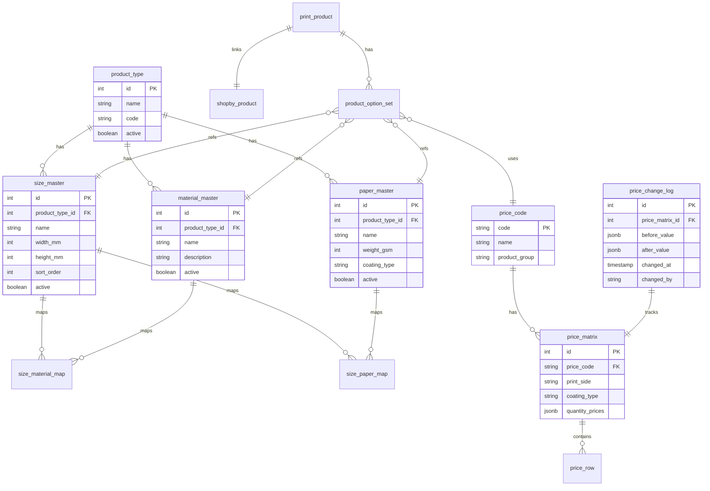
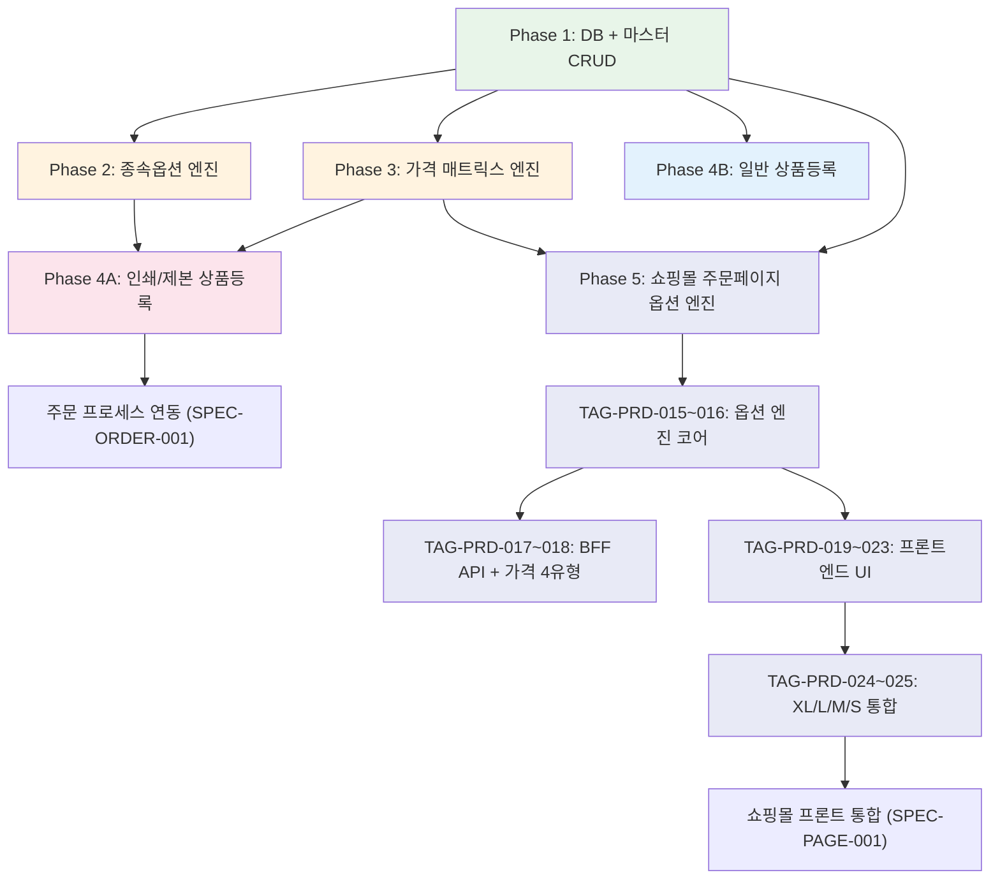

# SPEC-PRODUCT-001: 구현 계획서

> A10B4-PRODUCT 상품관리 도메인 구현 전략

---

## 1. 구현 개요

### 1.1 범위

후니프린팅 shopby Enterprise 기반 관리자 상품관리 도메인의 14개 기능을 4개 Phase로 나누어 구현한다. CUSTOM 모듈 중심(9/14개)의 Tier 2 전략으로, NestJS BFF + React 관리자 화면을 신규 개발한다.

### 1.2 접근 방식

- **CUSTOM DB 우선**: 종속옵션/가격 매트릭스는 shopby 외부 PostgreSQL에서 관리
- **shopby 연동 최소화**: 기본 상품 정보만 shopby API로 등록, 옵션/가격은 CUSTOM
- **PC 전용 설계**: 관리자 화면은 1280px 이상 데스크톱 해상도 기준
- **관리자 전용 인증**: shopby Admin API 토큰 기반 권한 검증

### 1.3 개발 방법론

DDD (ANALYZE-PRESERVE-IMPROVE) 방식 적용. shopby 기존 상품관리 구조를 분석하고 인쇄 도메인 확장 기능을 점진적으로 추가한다.

---

## 2. 아키텍처 결정사항

### 2.1 2-Tier Hybrid 배치

| Tier | 해당 기능 | 구현 방식 |
|------|----------|----------|
| Tier 2 (CUSTOM) | 인쇄/제본 상품등록, 종속옵션, 가격엔진, 마스터 관리 (9개) | NestJS BFF + PostgreSQL + React Admin |
| Tier 1 (NATIVE/SKIN) | 굿즈 카테고리, 굿즈/수작/포장재/디자인 등록 (5개) | shopby Admin API + 스킨 커스텀 |

### 2.2 데이터베이스 설계 방향



### 2.3 NestJS BFF 아키텍처

```
src/
├── modules/
│   ├── product/
│   │   ├── product.controller.ts      # 상품 CRUD API
│   │   ├── product.service.ts         # 비즈니스 로직
│   │   ├── product.module.ts
│   │   └── dto/
│   ├── option-master/
│   │   ├── size.controller.ts         # 사이즈 마스터 API
│   │   ├── material.controller.ts     # 소재 마스터 API
│   │   ├── paper.controller.ts        # 용지 마스터 API
│   │   ├── option-master.service.ts   # 마스터 공통 로직
│   │   └── option-master.module.ts
│   ├── cascading-option/
│   │   ├── cascading-option.controller.ts  # 종속옵션 체인 API
│   │   ├── cascading-option.service.ts     # 캐스케이딩 로직
│   │   └── cascading-option.module.ts
│   └── price-engine/
│       ├── price.controller.ts        # 가격 CRUD + 시뮬레이터 API
│       ├── price-calculator.service.ts # 가격 계산 엔진
│       ├── price-matrix.service.ts    # 매트릭스 관리
│       └── price-engine.module.ts
├── shared/
│   ├── guards/admin-auth.guard.ts     # 관리자 인증 가드
│   ├── interceptors/cache.interceptor.ts  # 마스터 데이터 캐싱
│   └── shopby/shopby-product.client.ts    # shopby 상품 API 클라이언트
└── database/
    ├── migrations/                     # DB 마이그레이션
    └── entities/                       # TypeORM 엔티티
```

### 2.4 React Admin 컴포넌트 구조

```
src/pages/admin/product/
├── ProductList.tsx                     # 상품 목록
├── PrintProductForm.tsx               # 인쇄/제본 상품등록 폼
├── GeneralProductForm.tsx             # 일반 상품등록 폼
├── components/
│   ├── SizePickerPopup.tsx            # 사이즈 선택 팝업
│   ├── MaterialPickerPopup.tsx        # 소재 선택 팝업
│   ├── PaperPickerPopup.tsx           # 용지 선택 팝업
│   ├── PriceMatrixEditor.tsx          # 가격 매트릭스 편집기
│   ├── PriceSimulator.tsx             # 가격 시뮬레이터
│   ├── CascadingOptionChain.tsx       # 종속옵션 체인 표시
│   └── OptionMasterTable.tsx          # 마스터 데이터 CRUD 테이블
├── master/
│   ├── SizeMaster.tsx                 # 사이즈 관리 페이지
│   ├── MaterialMaster.tsx             # 소재 관리 페이지
│   ├── PaperMaster.tsx                # 용지 관리 페이지
│   └── PriceMaster.tsx                # 가격 관리 페이지
└── hooks/
    ├── useCascadingOptions.ts         # 종속옵션 상태 관리
    ├── usePriceCalculation.ts         # 가격 계산 훅
    └── useProductForm.ts              # 상품 폼 상태 관리
```

---

## 3. 구현 단계

### Phase 1: Option Master Foundation (P1 최우선)

**목표**: 옵션 마스터 데이터 CRUD 기반 구축

| TAG | 기능 | 작업 파일 | 완료 조건 | 의존성 |
|-----|------|----------|----------|--------|
| TAG-PRD-001 | DB 스키마 + 마이그레이션 | `database/migrations/`, `database/entities/` | 전체 테이블 생성, 시드 데이터 투입 | 없음 |
| TAG-PRD-002 | 사이즈 마스터 CRUD | `option-master/size.controller.ts`, `SizeMaster.tsx` | 사이즈 CRUD + 검색 + 정렬 동작 | TAG-PRD-001 |
| TAG-PRD-003 | 소재 마스터 CRUD | `option-master/material.controller.ts`, `MaterialMaster.tsx` | 소재 CRUD + 사이즈 매핑 동작 | TAG-PRD-001 |
| TAG-PRD-004 | 용지 마스터 CRUD | `option-master/paper.controller.ts`, `PaperMaster.tsx` | 용지 CRUD + 사이즈 매핑 동작 | TAG-PRD-001 |

### Phase 2: Cascading Option Engine (P1 핵심)

**목표**: 종속옵션 캐스케이딩 로직 구현

| TAG | 기능 | 작업 파일 | 완료 조건 | 의존성 |
|-----|------|----------|----------|--------|
| TAG-PRD-005 | 종속옵션 API | `cascading-option/` 전체 | 상품유형별 옵션 체인 API 동작 | TAG-PRD-002~004 |
| TAG-PRD-006 | 사이즈/소재/용지 선택 팝업 | `SizePickerPopup.tsx`, `MaterialPickerPopup.tsx`, `PaperPickerPopup.tsx` | 상위 선택 시 하위 필터링, 리셋 동작 | TAG-PRD-005 |
| TAG-PRD-007 | 캐스케이딩 체인 통합 | `CascadingOptionChain.tsx`, `useCascadingOptions.ts` | 전체 옵션 체인 상태 관리, 유효성 검증 | TAG-PRD-006 |

### Phase 3: Price Matrix Engine (P1 핵심)

**목표**: 8종 가격 매트릭스 관리 및 계산 엔진

| TAG | 기능 | 작업 파일 | 완료 조건 | 의존성 |
|-----|------|----------|----------|--------|
| TAG-PRD-008 | 가격 매트릭스 CRUD API | `price-engine/price-matrix.service.ts`, `price.controller.ts` | 8종 가격 코드별 CRUD, 변경 이력 저장 | TAG-PRD-001 |
| TAG-PRD-009 | 가격 계산 엔진 | `price-engine/price-calculator.service.ts` | 가격 공식 적용, 수량 체감, 후가공/제본 가격 | TAG-PRD-008 |
| TAG-PRD-010 | 가격관리 팝업 8종 | `PriceMatrixEditor.tsx` | 8종 가격 코드별 매트릭스 편집 UI | TAG-PRD-008 |
| TAG-PRD-011 | 가격 시뮬레이터 | `PriceSimulator.tsx`, `usePriceCalculation.ts` | 옵션 조합별 실시간 가격 계산 + 내역 표시 | TAG-PRD-009 |

### Phase 4: Product Registration (P1-P3)

**목표**: 상품등록 폼 구현

| TAG | 기능 | 작업 파일 | 완료 조건 | 의존성 |
|-----|------|----------|----------|--------|
| TAG-PRD-012 | 인쇄/제본 상품등록 | `PrintProductForm.tsx`, `product.controller.ts` | 상품등록+옵션+가격+미리보기+복제+자동저장 | TAG-PRD-007, TAG-PRD-011 |
| TAG-PRD-013 | 굿즈/수작/포장재 상품등록 | `GeneralProductForm.tsx`, `shopby-product.client.ts` | shopby API 연동 + 스킨 옵션 커스텀 | TAG-PRD-001 |
| TAG-PRD-014 | 디자인 상품등록 | `GeneralProductForm.tsx` | 디자인 서비스 옵션 등록 | TAG-PRD-013 |

### Phase 5: Storefront Option Engine (P1 핵심)

**목표**: 쇼핑몰 주문페이지 11개 상품 카테고리별 옵션 엔진

> Figma option_NEW 기반 인쇄 상품 주문페이지 설계
> 참조: `product-order-pages.md`, `option-dependency-map.md`, `figma-screen-design-reference.md`

| TAG | 기능 | 작업 파일 | 완료 조건 | 의존성 |
|-----|------|----------|----------|--------|
| TAG-PRD-015 | 옵션 설정 JSON 스키마 + 시드 데이터 | `database/seeds/`, `entities/option-*.ts` | 11개 상품별 옵션 그룹/값/종속규칙 JSON 생성 | TAG-PRD-001 |
| TAG-PRD-016 | 옵션 엔진 코어 (종속 규칙 33개) | `OptionEngine.ts`, `dependency-rule.ts` | FILTER(7), SHOW_HIDE(21), RESET(5) 규칙 동작 | TAG-PRD-015 |
| TAG-PRD-017 | 쇼핑몰 BFF API (옵션/가격) | `storefront-option.controller.ts`, `storefront-price.controller.ts` | config/cascading/calculate/validate API 동작 | TAG-PRD-016, TAG-PRD-009 |
| TAG-PRD-018 | 가격 계산 4유형 구현 | `MatrixPriceCalc.ts`, `VolumDiscountCalc.ts`, `AreaPriceCalc.ts`, `FixedPriceCalc.ts` | 4유형 가격 계산 정확성 검증 | TAG-PRD-009 |
| TAG-PRD-019 | 옵션 UI 동적 렌더러 | `OptionGroupRenderer.tsx`, `ButtonOption.tsx`, `SelectOption.tsx`, `ColorChipOption.tsx`, `InputOption.tsx`, `ImageButtonOption.tsx` | 6종 UI 타입 동적 렌더링 | TAG-PRD-016 |
| TAG-PRD-020 | Collapsible UI (후가공/박형압) | `CollapsibleSection.tsx`, `FoilEmbossPanel.tsx` | 접이식 UI + SHOW_HIDE 연동 | TAG-PRD-019 |
| TAG-PRD-021 | 구간할인 슬라이더 | `VolumeDiscountSlider.tsx` | 슬라이더 + 단가 테이블 + 가격 연동 | TAG-PRD-018 |
| TAG-PRD-022 | 가격 Summary 패널 | `PriceSummary.tsx`, `PriceSummaryDetailed.tsx`, `PriceSummarySimple.tsx` | 항목별 분해, 간소화, 할인금액 마이너스 표시 | TAG-PRD-018 |
| TAG-PRD-023 | 파일 업로드 패턴별 UI | `FileUploadArea.tsx` | 5패턴(A/B/C/D/E) 분기 UI | TAG-PRD-019 |
| TAG-PRD-024 | XL 상품 통합 (인쇄+제본) | `OrderPage.tsx` | 디지털인쇄 16그룹 + 제본 16그룹 전체 동작 | TAG-PRD-019~023 |
| TAG-PRD-025 | L/M/S 상품 통합 (9개 카테고리) | `OrderPage.tsx` | 나머지 9개 카테고리 옵션 UI + 가격 계산 동작 | TAG-PRD-024 |
| TAG-PRD-026 | Redis 캐시 전략 적용 | `cache.interceptor.ts` | 옵션설정(24h), 종속옵션(1h), 가격(30m) TTL | TAG-PRD-017 |

---

## 4. 기술 스택

| 영역 | 기술 | 버전 | 용도 |
|------|------|------|------|
| Backend | NestJS | 10.x | BFF API 서버 |
| ORM | TypeORM | 0.3.x | PostgreSQL 엔티티 관리 |
| Database | PostgreSQL | 16 | CUSTOM 데이터 저장 |
| Cache | Redis | 7.x | 마스터 데이터 캐싱 |
| Frontend | React | 18.x | 관리자 UI |
| State | Zustand | 4.x | 클라이언트 상태 관리 |
| CSS | Tailwind CSS | 3.x | 스타일링 |
| Validation | Zod | 3.23+ | API 입력 검증 |
| HTTP Client | Axios | 1.x | shopby API 호출 |

---

## 5. 리스크 및 대응 계획

| 리스크 | 영향도 | 대응 |
|--------|--------|------|
| 가격 매트릭스 복잡도 과다 | High | 8종 중 DP02(전단지)부터 시작하여 패턴 검증 후 확장 |
| shopby 상품 API 제약 | Medium | CUSTOM DB에 옵션/가격 별도 관리, shopby는 기본 정보만 |
| 마스터 데이터 초기 투입량 | Medium | 엑셀 일괄 업로드 기능 Phase 1에서 제공 |
| 종속옵션 조합 폭발 | High | 사이즈-소재/용지 매핑 테이블로 유효 조합만 허용 |
| 가격 변경 시 기존 주문 영향 | High | 가격 스냅샷 방식 - 주문 시점 가격 별도 저장 |
| 11개 상품 카테고리 옵션 다양성 | High | 동적 렌더러 + 옵션 설정 JSON 방식으로 공통 엔진화 |
| 33개 종속 규칙 관리 복잡도 | High | 선언적 종속 규칙 JSON + OptionEngine 코어로 추상화 |
| 4가지 가격 계산 유형 분기 | Medium | PriceTypeRouter + Strategy 패턴으로 계산기 분리 |
| 크기 직접입력 면적 계산 정확성 | Medium | 단위 테스트 충분히 작성 (mm2 -> m2 변환 등) |
| Redis 캐시 무효화 타이밍 | Medium | TTL 기반 + 관리자 변경 시 수동 무효화 이중 전략 |

---

## 6. 구현 의존성 그래프


