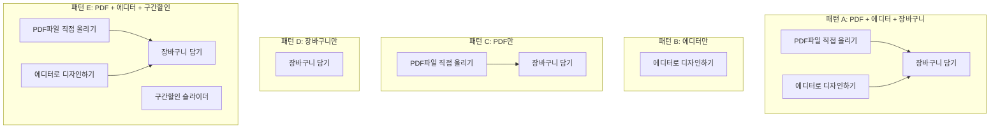
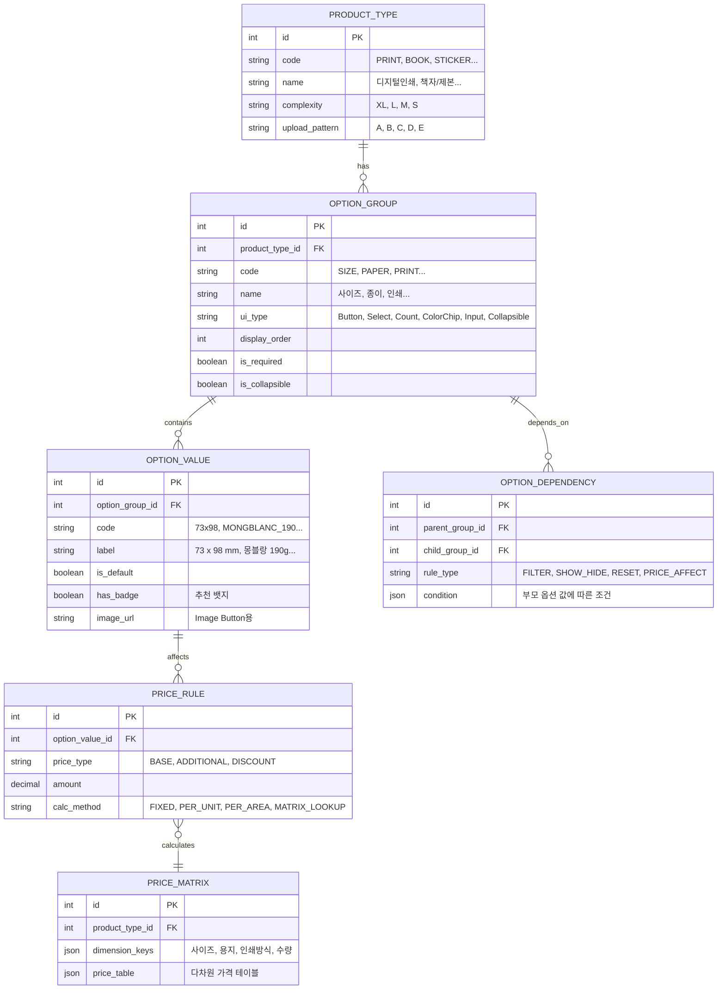

# 인쇄 상품 주문페이지 심층 분석

> 11개 상품 카테고리별 주문페이지의 인쇄 공정 관점 분석, 옵션 종속성, 가격 계산 로직 분석
> 이 문서는 추후 Excel(상품마스터, 가격표, 출력소재관리) 분석의 기준 프레임이며,
> 옵션 엔진 설계와 화면설계 와이어프레임의 원천 자료입니다.

---

## 1. 분석 개요

### 1.1 분석 대상

| # | 섹션 ID | 상품 카테고리 | Figma Node | 복잡도 |
|---|---------|-------------|------------|--------|
| 1 | PRODUCT_PRINT_OPTION | 디지털인쇄 (엽서/전단/포스터) | 1647:129 | XL |
| 2 | PRODUCT_BOOK_OPTION | 책자/제본 | 1647:525 | XL |
| 3 | PRODUCT_STAITIONERY_OPTION | 문구 (다이어리/노트) | 1647:810 | M |
| 4 | PRODUCT_PHOTOBOOK_OPTION | 포토북 | 1647:929 | S |
| 5 | PRODUCT_CALENDAR_OPTION | 캘린더 | 1647:1033 | L |
| 6 | PRODUCT_DESIGN_CALENDAR_OPTION | 디자인 캘린더 | 1647:1165 | S |
| 7 | PRODUCT_ACCESSORIES_OPTION | 액세서리 | 1647:1271 | S |
| 8 | PRODUCT_ARRYLIC_OPTION | 아크릴 | 1647:1346 | M |
| 9 | PRODUCT_SIGN_POSTER_OPTION | 실사/사인 | 1647:1487 | M |
| 10 | PRODUCT_STICKER_OPTION | 스티커 | 1647:1596 | L |
| 11 | PRODUCT_GOODS_OPTION | 굿즈/파우치 | 1647:1732 | M |

### 1.2 복잡도 등급 정의

| 등급 | 옵션 그룹 수 | 해당 상품 | 가격 계산 복잡도 |
|------|------------|----------|----------------|
| **XL** | 12+ 그룹 | 디지털인쇄, 책자/제본 | 다단계 종속 + 후가공 조합 |
| **L** | 8-11 그룹 | 스티커, 캘린더 | 중간 종속 + 부분 후가공 |
| **M** | 5-7 그룹 | 문구, 굿즈, 아크릴, 실사/사인 | 기본 종속 + 구간할인 |
| **S** | 2-4 그룹 | 포토북, 디자인캘린더, 액세서리 | 고정가 또는 단순 계산 |

### 1.3 표준 인쇄 공정 흐름 (참조 기준)

```
규격 결정 → 소재/용지 선택 → 인쇄 방식 결정 → 수량 결정 → 마감 처리 → 특수 가공 → 제본/조립 → 부가 상품
```

인쇄 업계 표준 8단계 공정:


주문페이지 옵션 선택은 이 공정의 **역방향 사양 결정** 과정이다:
고객이 선택하는 옵션이 곧 인쇄 공장에서 수행할 작업 지시서가 된다.

---

## 2. 상품별 주문페이지 완전 분석

### 2.1 디지털인쇄 (PRODUCT_PRINT_OPTION) - XL

**대표 상품**: 엽서, 전단지, 포스터, 리플릿
**Figma Node**: 1647:129

#### 인쇄 공정 관점 옵션 매핑

| 순서 | 옵션 그룹 | 인쇄 공정 단계 | UI 타입 | 공정 역할 |
|------|----------|--------------|---------|----------|
| 1 | 사이즈 | 규격 결정 | Button (7종) | 판형/재단 크기 결정 |
| 2 | 종이 | 소재 선택 | Select (드롭다운) | 용지 종류+평량 결정 |
| 3 | 인쇄 | 인쇄 방식 | Button (2종) | 단면/양면 인쇄 지정 |
| 4~8 | 별색인쇄 (5종) | 특수 인쇄 | Button (각 3종) | 화이트/클리어/핑크/금/은 별색 |
| 9 | 코팅 | 마감 처리 | Button (5종) | 무광/유광 코팅 (단면/양면) |
| 10 | 커팅 | 재단 가공 | Button (4종) | 특수 재단 형태 |
| 11 | 접지 | 접지 가공 | Button (3종) | 접지 방식 결정 |
| 12 | 건수 | 생산 수량 | Count (+/-) | 디자인 종류 수 |
| 13 | 제작수량 | 생산 수량 | Count (+/-) | 동일 디자인 인쇄 매수 |
| 14 | 후가공 | 후가공 | Collapsible | 귀돌이/오시/미싱/가변인쇄 |
| 15 | 박/형압 가공 | 특수 후가공 | Collapsible | 박(앞/뒤)+형압(양각/음각) |
| 16 | 엽서봉투 | 부가 상품 | Finish Select | OPP봉투/카드봉투 |

**공정 순서 검증**: 규격(1) -> 소재(2) -> 인쇄(3~8) -> 마감(9~11) -> 수량(12~13) -> 가공(14~15) -> 부가상품(16)
**검증 결과**: 인쇄 공정 순서와 높은 일치도. 수량이 마감 뒤에 위치하는 것은 UX 관점에서 합리적 (모든 사양 확정 후 수량 입력 -> 즉시 가격 확인)

#### 가격 계산 로직

```
인쇄비 = 기본단가(사이즈, 종이, 인쇄방식) × 수량 × 건수
별색비 = SUM(별색종류별_단가 × 면수)
코팅비 = 코팅단가(종류, 단면/양면) × 수량
커팅비 = 커팅단가(종류) × 수량
접지비 = 접지단가(방식) × 수량
후가공비 = SUM(귀돌이/오시/미싱/가변인쇄 각 단가 × 수량)
박형압비 = SUM(박_단가(면적, 칼라) + 형압_단가(면적, 유형))
추가상품 = 봉투_단가 × 수량
---
합계 = (인쇄비 + 별색비 + 코팅비 + 커팅비 + 접지비 + 후가공비 + 박형압비 + 추가상품)
부가세 = 합계 × 10%
최종금액 = 합계 + 부가세
```

#### 파일 업로드 패턴: **A (PDF + 에디터 + 장바구니)**

---

### 2.2 책자/제본 (PRODUCT_BOOK_OPTION) - XL

**대표 상품**: 무선제본 책자, 중철제본, 카탈로그, 브로슈어
**Figma Node**: 1647:525

#### 인쇄 공정 관점 옵션 매핑

| 순서 | 옵션 그룹 | 인쇄 공정 단계 | UI 타입 | 공정 역할 |
|------|----------|--------------|---------|----------|
| 1 | 사이즈 | 규격 결정 | Button (2종) | A5/A4 판형 |
| 2 | 책갈 | 제본 방식 | Button | 무선제본/중철제본 등 |
| 3 | 제본방향 | 제본 설정 | Button (2종) | 가로/세로 제본 |
| 4 | 띠걸이 | 부속품 | Image Button (6종) | 제본 부속: 은장/원형/삼각/사각/무지 |
| 5 | 띠사별 | 부속품 색상 | Image Button (5종) | 띠 색상: 백색/바탕색/적갈색/청색 |
| 6 | 면수 | 규격 상세 | Button (4종) | 8면이하/24면이하 등 |
| 7 | 제작수량 | 생산 수량 | Count | 인쇄 부수 |
| 8 | 내지종이 | 내지 소재 | Select | 내지 용지 종류+평량 |
| 9 | 내지인쇄 | 내지 인쇄 | Button (2종) | 내지 단면/양면 |
| 10 | 내지 페이지 | 내지 분량 | Count (24P~200P) | 내지 페이지 수 |
| 11 | 표지종이 | 표지 소재 | Select | 표지 용지 종류+평량 |
| 12 | 표지인쇄 | 표지 인쇄 | Button (2종) | 표지 단면/양면 |
| 13 | 표지코팅 | 표지 마감 | Button (3종) | 무광/유광 코팅 |
| 14 | 투명커버 | 표지 특수마감 | Button (3종) | 투명 OPP 커버 |
| 15 | 박/형압 가공 | 특수 후가공 | Collapsible | 인쇄와 동일 패턴 |
| 16 | 개별포장 | 부가 상품 | Finish Select | 개별봉투 포장 |

**공정 순서 검증**: 규격(1,3,6) -> 제본방식(2) -> 부속품(4~5) -> 수량(7) -> 내지(8~10) -> 표지(11~14) -> 후가공(15) -> 부가상품(16)
**검증 결과**: 제본 상품 특화 공정 반영. 내지와 표지를 명확히 분리한 구조가 제본 공정의 2트랙 작업(내지 인쇄 + 표지 인쇄 -> 합본)을 정확히 반영.

#### 가격 계산 로직

```
내지비 = 내지단가(종이, 인쇄방식) × 페이지수 × 수량
표지비 = 표지단가(종이, 인쇄방식) × 수량
코팅비 = 표지코팅단가(종류) × 수량
제본비 = 제본단가(방식, 페이지수) × 수량
부속품 = 띠걸이_단가 + 띠사별_단가
커버비 = 투명커버_단가 × 수량
박형압비 = (인쇄와 동일 계산)
포장비 = 개별포장_단가 × 수량
---
합계 = 내지비 + 표지비 + 코팅비 + 제본비 + 부속품 + 커버비 + 박형압비 + 포장비
부가세 = 합계 × 10%
```

**핵심 특성**: 내지 페이지 수(24P~200P)가 가격에 가장 큰 영향을 미침. 페이지 수 변경 시 내지비가 선형으로 증가.

#### 파일 업로드 패턴: **A (PDF + 에디터 + 장바구니)**

---

### 2.3 문구 (PRODUCT_STAITIONERY_OPTION) - M

**대표 상품**: 다이어리, 노트, 수첩
**Figma Node**: 1647:810

#### 인쇄 공정 관점 옵션 매핑

| 순서 | 옵션 그룹 | 인쇄 공정 단계 | UI 타입 | 공정 역할 |
|------|----------|--------------|---------|----------|
| 1 | 사이즈 | 규격 결정 | Button | 130x190mm 등 |
| 2 | 내지 | 내지 유형 | Button | 실내지 등 |
| 3 | 종이 | 소재 선택 | Select | 매트 130g 등 |
| 4 | 제본옵션 | 제본 방식 | Button (2종) | 5공 1조 / 14공 1조 |
| 5 | 컬러 | 부속품 색상 | ColorChip (3종) | 검정/회색/밝은회색 |
| 6 | 제작수량 | 생산 수량 | Count | +/- |
| 7 | 구간할인 | 가격 정책 | Slider + 테이블 | 1~1000개 단가표 |
| 8 | 개별포장 | 부가 상품 | Select | 개별봉투 포장 |

**공정 순서 검증**: 규격(1) -> 내지(2) -> 소재(3) -> 제본(4) -> 부속품(5) -> 수량(6~7) -> 포장(8)
**검증 결과**: 문구류 특화. 제본옵션(공 수)이 다이어리/노트 바인딩 방식을 결정하는 핵심 옵션.

#### 가격 계산 로직 (구간할인 적용)

```
기본가 = 사이즈별_기본단가(종이, 내지유형, 제본옵션)
수량별단가 = 구간할인테이블[수량] (예: 1개=3,260원, 100개=2,800원, 1000개=2,200원)
본체가 = 수량별단가 × 수량
포장비 = 개별포장_단가 × 수량
---
합계 = 본체가 + 포장비
부가세 = 합계 × 10%
```

**핵심 특성**: 구간할인 슬라이더가 존재. 수량 구간별 단가가 비선형적으로 감소 (대량 주문 인센티브).

#### 파일 업로드 패턴: **A (PDF + 에디터 + 장바구니)**

---

### 2.4 포토북 (PRODUCT_PHOTOBOOK_OPTION) - S

**대표 상품**: 포토북, 화보집
**Figma Node**: 1647:929

#### 인쇄 공정 관점 옵션 매핑

| 순서 | 옵션 그룹 | 인쇄 공정 단계 | UI 타입 | 공정 역할 |
|------|----------|--------------|---------|----------|
| 1 | 사이즈 | 규격 결정 | Button (4종) | A5/A4/8x8/16x12 |
| 2 | 커버타입 | 표지 방식 | Button (3종) | 하드/소프트/미니하드 |
| 3 | 제작수량 | 생산 수량 | Count | +/- |

**공정 순서 검증**: 규격(1) -> 커버(2) -> 수량(3)
**검증 결과**: 최소 옵션 구성. 포토북은 에디터에서 내용(사진 배치, 페이지 수)을 결정하므로, 주문페이지에서는 외형 규격만 선택.

#### 가격 계산 로직

```
합계 = 사이즈별_고정단가(커버타입) × 수량
부가세 = 합계 × 10%
```

**핵심 특성**: 가격 Summary가 간소화 (합계금액만 표시, 항목별 분리 없음). 에디터에서 페이지 수 추가 시 추가 비용 발생 가능.

#### 파일 업로드 패턴: **B (에디터만, PDF 업로드 없음, 장바구니 없음)**

---

### 2.5 캘린더 (PRODUCT_CALENDAR_OPTION) - L

**대표 상품**: 탁상캘린더, 벽걸이캘린더
**Figma Node**: 1647:1033

#### 인쇄 공정 관점 옵션 매핑

| 순서 | 옵션 그룹 | 인쇄 공정 단계 | UI 타입 | 공정 역할 |
|------|----------|--------------|---------|----------|
| 1 | 사이즈 | 규격 결정 | Button (2종) | 210x145/190x220 |
| 2 | 용지 | 소재 선택 | Select | CK P 265 등 |
| 3 | 인쇄 | 인쇄 방식 | Button (2종) | 단면/양면 |
| 4 | 장수 | 분량 결정 | Select | 13장 등 |
| 5 | 컬러 (집게) | 부속품 색상 | ColorChip | 검정/회색 |
| 6 | 캘린더 가공 | 조립 방식 | Button (3종) | 카드보드/고리/오시지 |
| 7 | 색상 (고리) | 부속품 색상 | ColorChip (3종) | 고리 색상 |
| 8 | 제작수량 | 생산 수량 | Count | +/- |
| 9 | 개별포장 | 부가 상품 | Select | 개별봉투 포장 |
| 10 | 캘린더봉투 | 부가 상품 | Select | 캘린더 전용 봉투 |
| 11 | 수량 | 부가 수량 | Select | 봉투 수량 |

**공정 순서 검증**: 규격(1) -> 소재(2) -> 인쇄(3) -> 분량(4) -> 부속품(5,7) -> 조립(6) -> 수량(8) -> 포장(9~11)
**검증 결과**: 캘린더 특화 구조. 집게/고리 등 물리적 부속품 선택이 포함되어 조립 공정을 반영.

#### 가격 계산 로직

```
인쇄비 = 기본단가(사이즈, 용지, 인쇄방식) × 장수 × 수량
부속품비 = 집게단가(컬러) + 고리단가(색상) × 수량
가공비 = 캘린더가공_단가(방식) × 수량
포장비 = 개별포장_단가 × 수량
봉투비 = 캘린더봉투_단가 × 봉투수량
---
합계 = 인쇄비 + 부속품비 + 가공비 + 포장비 + 봉투비
부가세 = 합계 × 10%
```

#### 파일 업로드 패턴: **C (PDF만, 에디터 없음)**

---

### 2.6 디자인 캘린더 (PRODUCT_DESIGN_CALENDAR_OPTION) - S

**대표 상품**: 기성 디자인 캘린더 (레디메이드)
**Figma Node**: 1647:1165

#### 인쇄 공정 관점 옵션 매핑

| 순서 | 옵션 그룹 | 인쇄 공정 단계 | UI 타입 | 공정 역할 |
|------|----------|--------------|---------|----------|
| 1 | 사이즈 | 규격 결정 | Button (2종) | 210x145/190x220 |
| 2 | 용지 | 소재 선택 | Select | CK P 265 등 |
| 3 | 레디자 | 디자인 선택 | Select | 레디 디자인 템플릿 |
| 4 | 제작수량 | 생산 수량 | Count | +/- |
| 5 | 캘린더봉투 | 부가 상품 | Select | 캘린더 전용 봉투 |

**공정 순서 검증**: 규격(1) -> 소재(2) -> 디자인(3) -> 수량(4) -> 포장(5)
**검증 결과**: 캘린더의 간소화 버전. "레디자(레디 디자인)" 선택이 고유 옵션으로, 기성 디자인 템플릿 중 선택하는 방식.

#### 가격 계산 로직

```
합계 = 사이즈별_고정단가(용지, 디자인) × 수량 + 봉투비
부가세 = 합계 × 10%
```

**핵심 특성**: 캘린더(L)의 간소화 파생 상품. 인쇄/장수/부속품 옵션이 모두 생략됨.

#### 파일 업로드 패턴: **B (에디터만, PDF 업로드 없음)**

---

### 2.7 액세서리 (PRODUCT_ACCESSORIES_OPTION) - S (최간단)

**대표 상품**: 디스플레이 스탠드, 바인더 부품
**Figma Node**: 1647:1271

#### 인쇄 공정 관점 옵션 매핑

| 순서 | 옵션 그룹 | 인쇄 공정 단계 | UI 타입 | 공정 역할 |
|------|----------|--------------|---------|----------|
| 1 | 사이즈 | 규격 결정 | Button (2종) | 79x230mm/84x190mm |
| 2 | 수량 | 생산 수량 | Count | +/- |

**공정 순서 검증**: 규격(1) -> 수량(2)
**검증 결과**: 최소 옵션. 인쇄 공정이 없는 기성품(액세서리) 판매. 파일 업로드가 불필요한 유일한 카테고리.

#### 가격 계산 로직

```
합계 = 사이즈별_고정단가 × 수량
부가세 = 합계 × 10%
```

#### 파일 업로드 패턴: **D (장바구니만, 파일 업로드 없음)**

---

### 2.8 아크릴 (PRODUCT_ARRYLIC_OPTION) - M

**대표 상품**: 아크릴 키링, 아크릴 스탠드, 아크릴 블록
**Figma Node**: 1647:1346

#### 인쇄 공정 관점 옵션 매핑

| 순서 | 옵션 그룹 | 인쇄 공정 단계 | UI 타입 | 공정 역할 |
|------|----------|--------------|---------|----------|
| 1 | 사이즈 | 규격 결정 | Button (7종, 2행) | 20x35 ~ 148x210mm |
| 2 | 크기 직접입력 | 규격 커스텀 | Input | 가로 × 세로 (범위 제한) |
| 3 | 소재 | 소재 선택 | Button | 투명아크릴 3mm |
| 4 | 후가수 | 재단 방식 | Select | 도무송 등 |
| 5 | 가공 | 후가공 | Button (3종) | 스탠딩스공/광택코팅/금속코팅 |
| 6 | 제작수량 | 생산 수량 | Count | +/- |
| 7 | 구간할인 | 가격 정책 | Slider | 대량 주문 단가표 |
| 8 | 봉투인 | 부가 상품 | Select | 개별 봉투 |
| 9 | 수량 | 부가 수량 | Select | 봉투 수량 |

**공정 순서 검증**: 규격(1,2) -> 소재(3) -> 재단(4) -> 가공(5) -> 수량(6,7) -> 포장(8,9)
**검증 결과**: 아크릴 특화 공정 반영. 직접입력 옵션은 비정형 사이즈 주문을 지원하며, 도무송(die-cutting)이 핵심 가공.

#### 가격 계산 로직 (구간할인 적용)

```
기본가 = 사이즈별_기본단가(소재) 또는 커스텀사이즈_면적단가
도무송비 = 도무송_기본요금 (형태 복잡도별)
가공비 = 가공단가(방식) × 수량
수량별단가 = 구간할인테이블[수량]
본체가 = 수량별단가 × 수량
봉투비 = 봉투_단가 × 봉투수량
---
합계 = 본체가 + 도무송비 + 가공비 + 봉투비
부가세 = 합계 × 10%
```

**핵심 특성**: 크기 직접입력은 다른 상품에 없는 고유 기능. 면적 기반 가격 계산 필요.

#### 파일 업로드 패턴: **B (에디터만)**

---

### 2.9 실사/사인 (PRODUCT_SIGN_POSTER_OPTION) - M

**대표 상품**: 현수막, X배너, PVC 사인물
**Figma Node**: 1647:1487

#### 인쇄 공정 관점 옵션 매핑

| 순서 | 옵션 그룹 | 인쇄 공정 단계 | UI 타입 | 공정 역할 |
|------|----------|--------------|---------|----------|
| 1 | 사이즈 | 규격 결정 | Button (3종 + 직접입력) | A0/A3/A1/직접입력 |
| 2 | 직접입력 | 규격 커스텀 | Input | 200~1300 × 200~8000 mm |
| 3 | 소재 | 소재 선택 | Select (색상뱃지) | PVC 투명 등 |
| 4 | 별색인쇄(화이트) | 특수 인쇄 | Button (2종) | 배경자동/영역지정 |
| 5 | 제작수량 | 생산 수량 | Count | +/- |

**공정 순서 검증**: 규격(1,2) -> 소재(3) -> 인쇄(4) -> 수량(5)
**검증 결과**: 대형 출력 특화. 사이즈 범위가 매우 넓고 (최대 8000mm), 용지 대신 소재(PVC, 비닐 등) 선택. 디지털 인쇄와 달리 옵셋이 아닌 대형 잉크젯/UV 인쇄 공정.

#### 가격 계산 로직

```
출력면적 = 가로 × 세로 (mm 단위)
기본가 = 면적단가(소재) × 출력면적 / 1000000 (m2 환산)
별색비 = 화이트인쇄_단가(방식) × 면적
---
합계 = 기본가 + 별색비
부가세 = 합계 × 10%
```

**핵심 특성**: 면적 기반 과금. 직접입력 사이즈 범위가 가장 넓음 (200~1300 × 200~8000mm). 에디터 없이 PDF만 업로드.

#### 파일 업로드 패턴: **C (PDF만, 에디터 없음)**

---

### 2.10 스티커 (PRODUCT_STICKER_OPTION) - L

**대표 상품**: 라벨스티커, 원형스티커, 도무송스티커
**Figma Node**: 1647:1596

#### 인쇄 공정 관점 옵션 매핑

| 순서 | 옵션 그룹 | 인쇄 공정 단계 | UI 타입 | 공정 역할 |
|------|----------|--------------|---------|----------|
| 1 | 사이즈 | 규격 결정 | Button (3종) | A6/A5/A4 |
| 2 | 종이 | 소재 선택 | Select | 유포 (스티커 전용지) |
| 3 | 인쇄 | 인쇄 방식 | Button | 단면 (스티커는 단면만) |
| 4 | 별색인쇄(화이트) | 특수 인쇄 | Button | 화이트인쇄(단면) |
| 5 | 커팅 | 재단 방식 | Button (4종) | 2cm/7mm(1cut)/sset/A4크기/30x17mm |
| 6 | 후가수 | 후가공 | Select | 없음/코팅 등 |
| 7 | 제작수량 | 생산 수량 | Count | +/- |
| 8 | 후가공 | 추가 후가공 | Collapsible | 간소화된 후가공 |

**공정 순서 검증**: 규격(1) -> 소재(2) -> 인쇄(3,4) -> 재단(5) -> 후가공(6,8) -> 수량(7)
**검증 결과**: 스티커 특화. 인쇄는 단면만 가능 (스티커 특성상). 커팅이 핵심 옵션 (개별 커팅 방식이 상품 형태를 결정).

#### 가격 계산 로직

```
인쇄비 = 기본단가(사이즈, 종이, 인쇄방식) × 수량
별색비 = 화이트인쇄_단가 × 수량
커팅비 = 커팅단가(방식) × 수량
후가공비 = 후가수_단가 + 추가후가공_단가
---
합계 = 인쇄비 + 별색비 + 커팅비 + 후가공비
부가세 = 합계 × 10%
```

**핵심 특성**: 스티커는 단면 인쇄만 가능. 커팅 방식(1cut/set/A4/개별)이 최종 상품 형태를 결정.

#### 파일 업로드 패턴: **A (PDF + 에디터 + 장바구니)**

---

### 2.11 굿즈/파우치 (PRODUCT_GOODS_OPTION) - M

**대표 상품**: 에코백, 파우치, 머그컵, 텀블러
**Figma Node**: 1647:1732

#### 인쇄 공정 관점 옵션 매핑

| 순서 | 옵션 그룹 | 인쇄 공정 단계 | UI 타입 | 공정 역할 |
|------|----------|--------------|---------|----------|
| 1 | 사이즈 | 규격 결정 | Button (3종) | 75x68/90x90/198x130mm |
| 2 | 컬러 | 소재 색상 | ColorChip (대형, 10종+) | 흰색/검정 + 다색 |
| 3 | 가공 | 인쇄/가공 방식 | Button (2종) | 이중전공/라벨봉제 |
| 4 | 제작수량 | 생산 수량 | Count | +/- |
| 5 | 구간할인 | 가격 정책 | Slider + 테이블 | 1~1000개 단가표 |
| 6 | 봉투인 | 부가 상품 | Select | 개별 봉투 |
| 7 | 수량 | 부가 수량 | Select | 봉투 수량 |

**공정 순서 검증**: 규격(1) -> 소재색상(2) -> 가공(3) -> 수량(4,5) -> 포장(6,7)
**검증 결과**: 굿즈 특화. 소재 색상 선택이 인쇄 전 결정사항 (흰색 vs 검정 바탕에 따라 인쇄 방식이 달라짐). 구간할인 슬라이더 존재.

#### 가격 계산 로직 (구간할인 적용)

```
수량별단가 = 구간할인테이블[수량] (예: 1개=3,260원, 100개=2,500원)
본체가 = 수량별단가 × 수량
할인금액 = 기본단가 - 수량별단가 (마이너스 표시)
봉투비 = 봉투_단가 × 봉투수량
---
합계 = 본체가 + 봉투비
부가세 = 합계 × 10%
```

**핵심 특성**: 가격 Summary에 "할인금액"이 마이너스(-)로 표시되는 유일한 카테고리. 대형 ColorChip UI로 소재 색상 강조.

#### 파일 업로드 패턴: **E (PDF + 에디터 + 구간할인 슬라이더)**

---

## 3. 공통/차이 매트릭스

### 3.1 옵션 그룹 존재 여부 매트릭스

| 옵션 그룹 | 인쇄 | 제본 | 문구 | 포토 | 캘린더 | 디캘 | 액세 | 아크릴 | 실사 | 스티커 | 굿즈 |
|----------|:----:|:----:|:----:|:----:|:-----:|:----:|:----:|:-----:|:----:|:-----:|:----:|
| 사이즈 | O | O | O | O | O | O | O | O | O | O | O |
| 종이/용지/소재 | O | O(2종) | O | - | O | O | - | O | O | O | - |
| 인쇄(단면/양면) | O | O(2종) | - | - | O | - | - | - | - | O | - |
| 별색인쇄 | O(5종) | - | - | - | - | - | - | - | O(1종) | O(1종) | - |
| 코팅 | O | O | - | - | - | - | - | - | - | - | - |
| 커팅 | O | - | - | - | - | - | - | - | - | O | - |
| 접지 | O | - | - | - | - | - | - | - | - | - | - |
| 제작수량 | O | O | O | O | O | O | O | O | O | O | O |
| 건수 | O | - | - | - | - | - | - | - | - | - | - |
| 후가공 | O | - | - | - | - | - | - | - | - | O | - |
| 박/형압 | O | O | - | - | - | - | - | - | - | - | - |
| 봉투/포장 | O | O | O | - | O(2종) | O | - | O | - | - | O |
| 구간할인 | - | - | O | - | - | - | - | O | - | - | O |
| ColorChip | - | - | O | - | O(2종) | - | - | - | - | - | O |
| 크기직접입력 | - | - | - | - | - | - | - | O | O | - | - |
| 제본방식 | - | O | O | - | - | - | - | - | - | - | - |
| 커버타입 | - | - | - | O | - | - | - | - | - | - | - |
| 캘린더가공 | - | - | - | - | O | - | - | - | - | - | - |
| Image Button | - | O(2종) | - | - | - | - | - | - | - | - | - |
| 가공방식 | - | - | - | - | - | - | - | O | - | - | O |

### 3.2 공통 옵션 그룹 (모든 상품에 존재)

| 옵션 | 존재율 | 비고 |
|------|--------|------|
| **사이즈** | 11/11 (100%) | 모든 상품의 첫 번째 옵션 |
| **제작수량** | 11/11 (100%) | 모든 상품에 존재 |

### 3.3 빈도별 옵션 분류

| 빈도 | 옵션 | 존재 상품 수 |
|------|------|------------|
| 높음 (7+) | 종이/용지/소재 | 8/11 |
| 높음 (7+) | 봉투/포장 | 7/11 |
| 중간 (4-6) | 인쇄(단면/양면) | 4/11 |
| 중간 (4-6) | ColorChip | 3/11 |
| 낮음 (1-3) | 별색인쇄 | 3/11 |
| 낮음 (1-3) | 코팅 | 2/11 |
| 낮음 (1-3) | 커팅 | 2/11 |
| 낮음 (1-3) | 구간할인 | 3/11 |
| 낮음 (1-3) | 크기직접입력 | 2/11 |
| 낮음 (1-3) | 박/형압 | 2/11 |
| 유일 (1) | 접지 | 인쇄만 |
| 유일 (1) | 건수 | 인쇄만 |
| 유일 (1) | 캘린더가공 | 캘린더만 |
| 유일 (1) | 커버타입 | 포토북만 |
| 유일 (1) | Image Button (띠걸이/띠사별) | 제본만 |

### 3.4 상품별 고유 옵션

| 상품 | 고유 옵션 | 설명 |
|------|----------|------|
| 디지털인쇄 | 접지, 건수, 5종 별색인쇄 | 가장 많은 고유 옵션 보유 |
| 책자/제본 | 내지/표지 분리, 띠걸이, 띠사별, 투명커버, 면수 | 제본 공정 특화 옵션 |
| 캘린더 | 장수, 집게 색상, 고리 색상, 캘린더가공 | 캘린더 물리적 부속품 |
| 디자인캘린더 | 레디자 (레디 디자인) | 기성 디자인 선택 |
| 포토북 | 커버타입 | 에디터 중심 상품 |
| 아크릴 | 소재(아크릴 두께), 후가수(도무송) | 비종이 소재 |
| 실사/사인 | 대형 직접입력 (최대 8000mm), 화이트배경 방식 | 대형 출력물 |
| 굿즈 | 소재 컬러 (대형 ColorChip), 가공방식(이중전공/라벨봉제) | 비인쇄 상품 |

---

## 4. 파일 업로드 패턴 종합

### 4.1 5가지 업로드 패턴



### 4.2 패턴별 상품 분류

| 패턴 | 상품 | PDF | 에디터 | 장바구니 | 구간할인 | 설명 |
|------|------|:---:|:-----:|:-------:|:-------:|------|
| **A** | 인쇄, 제본, 스티커, 문구 | O | O | O | - | 풀 기능 (가장 일반적) |
| **B** | 포토북, 디자인캘린더, 아크릴 | - | O | - | - | 에디터 전용 (직접 진입) |
| **C** | 캘린더, 실사/사인 | O | - | O | - | PDF 업로드만 (에디터 불필요) |
| **D** | 액세서리 | - | - | O | - | 기성품 (파일 불필요) |
| **E** | 굿즈 | O | O | O | O | PDF/에디터 + 구간할인 |

### 4.3 업로드 패턴 결정 로직

```
IF 기성품(인쇄 불필요) THEN 패턴 D
ELSE IF 에디터_전용(레이아웃 편집 필수) THEN 패턴 B
ELSE IF 대형_출력(정밀 파일 필수) OR 다장_인쇄(캘린더) THEN 패턴 C
ELSE IF 구간할인_적용 THEN 패턴 E
ELSE 패턴 A (기본)
```

---

## 5. 가격 계산 패턴 분류

### 5.1 가격 계산 유형

| 유형 | 설명 | 해당 상품 |
|------|------|----------|
| **매트릭스형** | 사이즈 × 용지 × 인쇄방식 × 수량 조합 테이블 | 인쇄, 제본, 스티커, 캘린더 |
| **구간할인형** | 수량 구간별 단가 체감 (슬라이더 + 테이블) | 문구, 아크릴, 굿즈 |
| **면적형** | 출력 면적(m2) 기반 과금 | 실사/사인, 아크릴(커스텀) |
| **고정가형** | 사이즈+타입별 고정 단가 | 포토북, 디자인캘린더, 액세서리 |

### 5.2 가격에 영향을 미치는 옵션 (가격 영향도)

| 옵션 | 영향도 | 적용 상품 | 비고 |
|------|--------|----------|------|
| 사이즈 | 최고 | 전체 | 판형이 기본가를 결정 |
| 수량 | 최고 | 전체 | 선형 또는 구간별 체감 |
| 종이/소재 | 높음 | 8/11 | 용지 등급이 단가에 크게 영향 |
| 인쇄면수 | 높음 | 4/11 | 양면 = 단면의 약 1.5~1.8배 |
| 페이지수 (제본) | 높음 | 1/11 | 내지 매수가 선형 증가 |
| 별색인쇄 | 중간 | 3/11 | 별색 종류당 추가 비용 |
| 코팅 | 중간 | 2/11 | 코팅 종류별 추가 비용 |
| 커팅 | 중간 | 2/11 | 커팅 방식별 추가 비용 |
| 후가공 | 중간 | 2/11 | 각 항목별 추가 비용 |
| 박/형압 | 높음 | 2/11 | 면적 기반 + 칼라별 차등 |
| 봉투/포장 | 낮음 | 7/11 | 단가 낮음 (추가 상품) |

### 5.3 부가세 처리

모든 상품에 공통 적용:
- 상품가와 부가세 **별도 표시** (Summary 테이블 하단)
- 합계금액 = 상품가 + 부가세(10%)
- 표시 형식: "상품가 75,000원 부가세 7,500원" → **합계금액 82,500**

---

## 6. 데이터 모델 관점 분석

### 6.1 옵션 엔진 핵심 엔티티



### 6.2 Excel 분석 연결 포인트

이 분석 결과가 Excel 데이터와 매핑되는 지점:

| 본 분석 항목 | Excel 파일 | 매핑 내용 |
|-------------|-----------|----------|
| 상품 카테고리 11종 | 상품마스터 | 상품유형 코드 (DP02, PR01, GD01 등) |
| 사이즈 옵션값 | 상품마스터 | 규격 코드 매핑 |
| 종이/소재 옵션값 | 출력소재관리 | 소재 코드 + 평량 + 단가 |
| 가격 계산 로직 | 가격표 | 가격 매트릭스 테이블 |
| 후가공 옵션 | 가격표 (추가) | 후가공별 단가 테이블 |
| 구간할인 테이블 | 가격표 | 수량 구간별 단가 |
| 봉투/포장 옵션 | 상품마스터 (부가상품) | 부가상품 코드 + 단가 |

---

## 7. 추적성

| 참조 | 파일 경로 |
|------|----------|
| Figma 원본 | `gEJhQRtmKI66BPhOpqoW3j` page `option_NEW` (1647:128) |
| 기존 분석 | `.moai/docs/figma-option-new-analysis.md` |
| 화면설계 참조 | `.moai/specs/SPEC-PRODUCT-001/figma-screen-design-reference.md` |
| 인쇄 도메인 리서치 | `.moai/specs/SPEC-PLAN-001/research-printing.md` |
| CUSTOM 모듈 정의 | `.moai/specs/SPEC-PLAN-001/custom-dev-data.json` |
| 옵션 종속성 상세 | `.moai/specs/SPEC-PRODUCT-001/option-dependency-map.md` |
| 인터랙션 정의 | `.moai/specs/SPEC-PRODUCT-001/interactions.md` |
| 아키텍처 설계 | `.moai/specs/SPEC-PRODUCT-001/architecture-design.md` |
