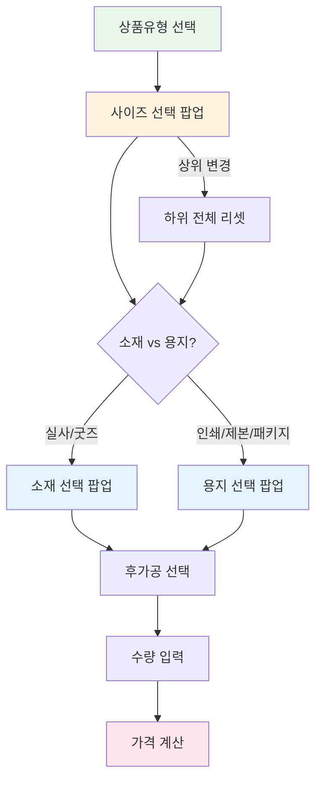

# SPEC-PRODUCT-001 요구사항 분석 (A10B4-PRODUCT 도메인)

> **작성일**: 2026-03-20
> **SPEC ID**: SPEC-PRODUCT-001
> **대상 도메인**: A10B4-PRODUCT (상품관리)
> **플랫폼**: 후니프린팅 shopby Enterprise 기반
> **shopby 구현 방식**: CUSTOM-heavy (9 CUSTOM / 14 전체)

---

## 목차

1. [핵심 의사결정 사항 (8개)](#1-핵심-의사결정-사항)
2. [모듈 1: 옵션 마스터 관리](#2-모듈-1-옵션-마스터-관리)
3. [모듈 2: 종속옵션 엔진](#3-모듈-2-종속옵션-엔진)
4. [모듈 3: 가격 매트릭스 엔진](#4-모듈-3-가격-매트릭스-엔진)
5. [모듈 4: 인쇄/제본 상품등록](#5-모듈-4-인쇄제본-상품등록)
6. [모듈 5: 일반 상품등록](#6-모듈-5-일반-상품등록)
7. [엣지 케이스 및 리스크](#7-엣지-케이스-및-리스크)
8. [크로스 도메인 의존성](#8-크로스-도메인-의존성)

---

## 1. 핵심 의사결정 사항

### KD-PRD-01: 상품유형 분류 체계

**결정 항목**: 후니프린팅 상품 분류 체계

**선택 가능 옵션**:
| 옵션 | 내용 | 장점 | 단점 |
|------|------|------|------|
| A | 5종 (인쇄/제본, 굿즈, 수작, 포장재, 디자인) | 기존 상품 라인 반영, 관리 명확 | 카테고리 확장 시 코드 변경 필요 |
| B | 3종 (출력상품, 일반상품, 서비스) | 단순화, 확장 용이 | 기존 운영 흐름과 불일치 |
| C | 자유 카테고리 | 유연성 최대 | 가격 코드 체계 복잡도 증가 |

**권장 결정**: **5종 분류 (옵션 A)**

**근거**:
- 후니프린팅 기존 상품 라인업(인쇄물, 굿즈, 수작, 포장재)과 1:1 매핑
- 가격 코드 8종(DP02/04/06, GD01/02, PK01, PR01/02)이 5종 분류와 자연스럽게 대응
- 디자인 서비스는 별도 유형으로 분리하여 물리적 상품과 구분
- 신규 유형 추가 시 마스터 데이터만 확장하면 되므로 코드 변경 최소화

### KD-PRD-02: 옵션 캐스케이딩 순서

**결정 항목**: 종속옵션 선택 순서

**경쟁사 벤치마크**:
- 와우프레스: 규격 -> 인쇄도수 -> 용지 -> 당일출고 -> 수량 -> 부속품
- 레드프린팅: 인쇄방식 -> 용지사이즈 -> 디자인수량 -> 주문수량
- Vistaprint: 두께 -> 용지 -> 모서리 -> 수량
- MOO: 용지등급(Material-First) -> 나머지 옵션

**권장 결정**: **상품유형 -> 사이즈 -> 소재/용지 -> 후가공 -> 수량**

**근거**:
- 상품유형이 최상위인 이유: 유형에 따라 사이즈/소재/용지 마스터가 완전히 다름
- 와우프레스의 캐스케이딩 드롭다운 + 레드프린팅의 조건부 필드 패턴 결합
- Baymard Institute 권장 Progressive Disclosure 적용
- 후가공은 사이즈/소재와 독립적이므로 하위에 배치

### KD-PRD-03: 가격 매트릭스 코드 체계

**결정 항목**: 가격 관리 코드 분류

**권장 결정**: **8종 유지 (DP02, DP04, DP06, GD01, GD02, PK01, PR01, PR02)**

**근거**:
- 기존 후니프린팅 가격표 구조를 그대로 유지하여 마이그레이션 부담 최소화
- 각 코드별 가격 구성 요소(출력비/용지비/코팅비/후가공비/제본비)가 상이
- DP(디지털인쇄), GD(굿즈), PK(패키지), PR(제본/인쇄)로 그룹화
- 신규 코드 추가는 마스터 데이터 추가만으로 가능

### KD-PRD-04: 옵션 마스터 관리 방식

**결정 항목**: 사이즈/소재/용지 마스터 데이터 관리 구조

**권장 결정**: **CRUD 기반 독립 마스터 테이블**

**근거**:
- 마스터 데이터를 독립 테이블로 관리하면 여러 상품에서 재사용 가능
- shopby 옵션 시스템과 분리하여 인쇄 도메인 특화 옵션 체계 구현
- 사이즈-소재, 사이즈-용지 간 매핑 테이블로 유효 조합만 허용
- 비활성화 시 기존 참조 유지(소프트 삭제)로 데이터 무결성 보장

### KD-PRD-05: 가격 계산 방식

**결정 항목**: 클라이언트 vs 서버 가격 계산

**권장 결정**: **서버사이드 계산(보안) + 클라이언트 프리뷰(UX)**

**근거**:
- 최종 가격은 서버에서만 계산하여 클라이언트 위변조 방지
- 클라이언트에서는 근사 가격을 프리뷰로 표시하여 UX 실시간성 확보
- 와우프레스 `getJobCost(rt)` AJAX 패턴과 유사
- 가격 매트릭스 원본 데이터는 클라이언트에 노출하지 않음

### KD-PRD-06: 상품등록 폼 방식

**결정 항목**: Step Wizard vs 단일 페이지 폼

**권장 결정**: **단일 페이지 탭 폼 (Step Wizard 미사용)**

**근거**:
- feedback_product_design 메모리: "Step Wizard 거절, 단일 페이지 폼 방식으로 재설계"
- 관리자는 상품 정보를 한눈에 보면서 수정하는 것을 선호
- 탭 구조: 기본정보 | 옵션설정 | 가격관리 | 미리보기
- PC 전용이므로 넓은 화면을 활용한 단일 페이지 폼이 적합

### KD-PRD-07: 가격 시뮬레이터 제공

**결정 항목**: 관리자 가격 검증 도구 제공 여부

**권장 결정**: **제공**

**근거**:
- 8종 가격 매트릭스의 복잡한 가격 조합을 사전 검증
- 옵션 조합별 최종 가격을 실시간으로 확인
- 가격 오류 사전 방지로 운영 리스크 감소
- 가격 구성 내역(출력비/용지비/코팅비/후가공비/제본비) 분해 표시

### KD-PRD-08: 굿즈/수작/포장재 등록 방식

**결정 항목**: 일반 상품의 등록 구현 방식

**권장 결정**: **shopby 기본 상품등록 + 스킨 커스텀**

**근거**:
- 일반 상품은 인쇄 종속옵션/가격엔진이 불필요
- shopby NATIVE 상품등록 기능을 최대한 활용
- 각 상품유형별 추가 옵션만 스킨(SKIN)으로 커스텀
- 개발 비용 최소화, shopby 업데이트 호환성 유지

---

## 2. 모듈 1: 옵션 마스터 관리

### 2.1 사이즈 마스터

**관리 대상 필드**:
- 상품유형 (FK -> product_type)
- 사이즈명 (예: A4, A3, B5, 명함, 특수규격)
- 가로 치수 (mm)
- 세로 치수 (mm)
- 표시순서 (정렬용)
- 활성/비활성 상태

**초기 시드 데이터 (예시)**:
| 상품유형 | 사이즈명 | 가로(mm) | 세로(mm) |
|---------|---------|---------|---------|
| 디지털인쇄 | A4 | 210 | 297 |
| 디지털인쇄 | A5 | 148 | 210 |
| 디지털인쇄 | B5 | 176 | 250 |
| 명함 | 일반명함 | 90 | 50 |
| 명함 | 미니명함 | 85 | 45 |
| 포스터 | A2 | 420 | 594 |
| 포스터 | A1 | 594 | 841 |

### 2.2 소재 마스터

**관리 대상 필드**:
- 상품유형 (FK)
- 소재명 (예: PVC, 현수막 원단, 에코솔벤트)
- 소재 설명
- 적용 가능 사이즈 목록 (M:N 매핑)
- 활성/비활성 상태

### 2.3 용지 마스터

**관리 대상 필드**:
- 상품유형 (FK)
- 용지명 (예: 아트지, 스노우지, 모조지, 크라프트)
- 평량 (g/m2): 80, 100, 120, 150, 180, 200, 250, 300, 350, 400
- 코팅 종류: 무광/유광/홀로그램/벨벳/스크래치프리
- 적용 가능 사이즈 목록 (M:N 매핑)
- 활성/비활성 상태

---

## 3. 모듈 2: 종속옵션 엔진

### 3.1 옵션 캐스케이딩 흐름



### 3.2 필터링 규칙

| 상위 옵션 | 하위 옵션 | 필터링 기준 |
|----------|----------|-----------|
| 상품유형 | 사이즈 | product_type_id 일치 |
| 사이즈 | 소재 | size_material_map 존재 + active=true |
| 사이즈 | 용지 | size_paper_map 존재 + active=true |
| 상품유형 | 후가공 | product_type에 따른 허용 후가공 목록 |

---

## 4. 모듈 3: 가격 매트릭스 엔진

### 4.1 가격 코드별 특성

| 코드 | 상품군 | 가격 구성 요소 | 특이사항 |
|------|--------|--------------|---------|
| DP02 | 디지털인쇄(전단지/포스터) | 출력비+용지비+코팅비 | 수량 체감율 높음 |
| DP04 | 디지털인쇄(명함/카드) | 출력비+용지비+코팅비+후가공비 | 박/라운딩 후가공 빈도 높음 |
| DP06 | 디지털인쇄(특수규격) | 출력비+용지비+코팅비 | 사이즈 기반 가격 변동 큼 |
| GD01 | 일반 굿즈 | 단일 가격 | 옵션(색상/사이즈)별 가격 |
| GD02 | 특수 굿즈 | 단일 가격+가공비 | 인쇄 포함 굿즈 |
| PK01 | 패키지 | 출력비+소재비+가공비 | 도무송 필수 |
| PR01 | 제본/인쇄(카탈로그/책자) | 출력비+용지비+코팅비+제본비 | 페이지 수 기반 가격 |
| PR02 | 특수 제본 | 출력비+용지비+코팅비+제본비+후가공비 | 양장/스프링 제본 |

### 4.2 가격 계산 공식

```
최종 가격 = 기본 출력비(수량, 사이즈, 인쇄면)
          + 용지비(용지종류, 평량, 수량)
          + 코팅비(코팅종류, 면적)
          + SUM(후가공비_i(종류, 수량, 난이도))
          + 제본비(방식, 페이지수)
          + 당일출고할증(해당 시 +30~50%)
```

---

## 5. 모듈 4: 인쇄/제본 상품등록

### 5.1 상품등록 폼 구조

**탭 1: 기본정보**
- 상품명, 상품 코드, 상품유형 선택
- 대표 이미지, 상세 설명 (WYSIWYG)
- 판매 상태 (판매중/판매중지)
- PDF 가이드라인 템플릿 업로드

**탭 2: 옵션설정**
- 사이즈 선택 (팝업)
- 소재/용지 선택 (팝업, 상품유형에 따라 분기)
- 후가공 선택 (체크박스)
- 기본값 설정 (각 옵션별 기본 선택값)

**탭 3: 가격관리**
- 가격 코드 선택 (8종 중 택 1)
- 가격관리 팝업 호출
- 당일출고 할증 설정
- 가격 시뮬레이터

**탭 4: 미리보기**
- 쇼핑몰 상품상세 형태 프리뷰
- 옵션 캐스케이딩 + 가격 계산 동작 확인

---

## 6. 모듈 5: 일반 상품등록

### 6.1 상품유형별 커스텀 옵션

| 상품유형 | 추가 옵션 | shopby 활용 방식 |
|---------|----------|----------------|
| 굿즈 | 색상, 사이즈, 재질 | shopby 옵션 조합형 |
| 수작 | 소재, 크기, 작업 방식 | shopby 옵션 조합형 + 설명 필드 |
| 포장재 | 재질, 크기, 수량 단위(묶음) | shopby 옵션 조합형 |
| 디자인 | 작업 범위, 수정 횟수, 납기일 | shopby 텍스트 옵션 |

---

## 7. 엣지 케이스 및 리스크

### 7.1 엣지 케이스

| # | 케이스 | 대응 방안 |
|---|--------|----------|
| 1 | 사이즈-용지 매핑이 없는 조합 선택 시도 | 매핑 테이블 기반 필터링으로 선택 자체 차단 |
| 2 | 가격 매트릭스에 빈 구간 존재 | 저장 시 전체 구간 완성도 검증 |
| 3 | 동시에 같은 가격 매트릭스 편집 | 낙관적 잠금(Optimistic Locking) + 충돌 시 재로드 안내 |
| 4 | 마스터 데이터 대량 변경 시 참조 상품 영향 | 변경 영향도 사전 표시 + 확인 다이얼로그 |
| 5 | 수량 0 또는 음수 입력 | 프론트엔드 + 서버 양쪽에서 유효성 검증 |
| 6 | 가격 매트릭스 마이그레이션 시 기존 데이터 포맷 차이 | 마이그레이션 스크립트에서 변환 로직 포함 |

### 7.2 리스크 매트릭스

| 리스크 | 가능성 | 영향도 | 대응 |
|--------|--------|--------|------|
| 가격 매트릭스 8종의 UX 복잡도 | High | High | DP02부터 구현하여 패턴 검증 후 나머지 확장 |
| shopby 상품 API와 CUSTOM DB 동기화 | Medium | High | 트랜잭션 기반 동시 저장, 실패 시 롤백 |
| 초기 마스터 데이터 투입 | Medium | Medium | 엑셀 일괄 업로드 + 검증 기능 제공 |
| 종속옵션 조합 폭발 (사이즈x소재x후가공) | High | Medium | 매핑 테이블로 유효 조합만 허용, 조합 수 제한 |

---

## 8. 크로스 도메인 의존성

### 8.1 하류 의존 (PRODUCT -> 다른 SPEC)

| 의존 SPEC | 의존 기능 | 인터페이스 |
|----------|----------|----------|
| SPEC-ORDER-001 | 주문 시 옵션 조합 + 가격 참조 | BFF API: GET /api/product/{id}/options, POST /api/price/calculate |
| SPEC-PAGE-001 | 상품상세 페이지 옵션 캐스케이딩 | BFF API: GET /api/cascading/{productTypeId} |
| SPEC-MYPAGE-001 | 옵션보관함에서 상품옵션 참조 | BFF API: GET /api/product/{id}/option-set |

### 8.2 상류 의존 (다른 SPEC -> PRODUCT)

- 없음 (PRODUCT는 독립적으로 동작하며 다른 도메인에 의존하지 않음)
