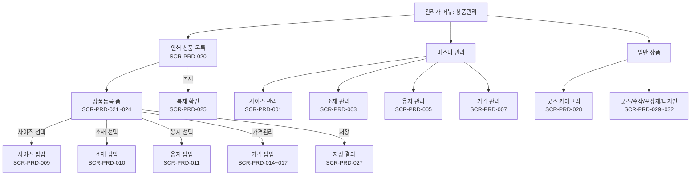

# SPEC-PRODUCT-001: 화면 인벤토리 (Screen Inventory) v2.0

> A10B4-PRODUCT 상품관리 도메인 전체 화면 설계 기초 자료 (관리자 전용)
> v2.0: 상품마스터/가격표/출력소재관리 엑셀 GAP 분석 반영

---

## 1. 전체 화면 인벤토리

### 1.1 모듈 1: 옵션 마스터 관리 - SCR-PRD-001 ~ 008

| Screen ID | 화면명 | 유형 | Route Path | 우선순위 | 모듈 | 핵심 기능 |
|-----------|--------|------|------------|---------|------|----------|
| SCR-PRD-001 | 사이즈 관리 | Page | `/admin/product/master/size` | P1 | MASTER | 사이즈 CRUD 테이블, 상품유형 필터, 검색, 정렬, 활성/비활성 토글, **기준판형/판걸이수 표시 컬럼** |
| SCR-PRD-002 | 사이즈 등록/수정 | Modal | - | P1 | MASTER | 사이즈명, **재단사이즈(가로x세로 mm)**, **작업사이즈(가로x세로 mm)**, **블리드(mm: 0/1/2/3/5/7/15)**, **판걸이수(국4절/A3 기준)**, **기준판형(A3/3절)**, **출력용지규격(316x467, 330x660, 330x470 등)**, **비규격 가로/세로 범위(실사/아크릴용 최소~최대 mm)**, **MES ITEM_CD**, **파일명약어(MES 파일명 규칙)**, 표시순서, 상품유형 선택, **적용 상품 목록(사이즈-상품 매핑 표시)** |
| SCR-PRD-003 | 소재 관리 | Page | `/admin/product/master/material` | P1 | MASTER | 소재 CRUD 테이블, **대분류/중분류 필터**, 사이즈 매핑 관리, 활성/비활성 토글, **단가 표시 컬럼** |
| SCR-PRD-004 | 소재 등록/수정 | Modal | - | P1 | MASTER | 소재명, 설명, **대분류(실사출력/패브릭소재/시트커팅/아크릴)**, **중분류**, **가격/단가**, **코팅옵션(코팅없음/무광/유광 + 추가 가격)**, **파일명약어(MES 연동)**, 적용 사이즈 다중선택, **적용 상품 목록(소재-상품 매핑)** |
| SCR-PRD-005 | 용지 관리 | Page | `/admin/product/master/paper` | P1 | MASTER | 용지 CRUD 테이블, **대분류 필터(디지털인쇄용지/3절/색지/PET/스티커용지/특수지)**, 평량/코팅 필터, 활성/비활성 토글, **국4절 가격/3절 가격 컬럼**, **상품별 적용 매핑 아이콘 표시** |
| SCR-PRD-006 | 용지 등록/수정 | Modal | - | P1 | MASTER | 용지명, 평량, 코팅 종류, **대분류(디지털인쇄용지/3절/색지/PET/스티커용지/특수지 등)**, **전지규격(국전(939x636)/4x6(1091x788) 등)**, **연당가(원가)**, **국4절 가격(판당 원가 30.57~1,300원)**, **3절 가격(89.54~272.95원)**, **종이사이즈(인쇄기 투입 사이즈 316x467 등)**, **파일명약어(MES 연동)**, **구매정보(특이사항)**, 적용 사이즈 다중선택, **상품별 적용 매핑 체크박스(출력소재관리 L~Z열 기반 15개 카테고리: 엽서/명함/전단지/리플렛/슬로건/라벨/상품권/배경지/봉투/스티커/포스터/책자내지/책자표지/캘린더/포토북)** |
| SCR-PRD-007 | 가격 관리 (마스터) | Page | `/admin/product/master/price` | P1 | MASTER | **14종 가격 유형별 매트릭스 목록** (디지털출력비, 후가공-미싱/오시, 후가공-접지, 후가공-가변, 박-동판비, 박-일반/특수, 명함박, 제본비, 스티커 가공비, 아크릴 단가, 실사 단가, 명함 단가, 옵션결합 단가, 수량할인율), 변경 이력 조회, **가격 유형별 탭 또는 필터 전환** |
| SCR-PRD-008 | 엑셀 일괄 업로드 | Modal | - | P1 | MASTER | 마스터 데이터 엑셀 업로드, 검증 결과 표시, 미리보기 |

### 1.2 모듈 2: 종속옵션 엔진 - SCR-PRD-009 ~ 013

| Screen ID | 화면명 | 유형 | Route Path | 우선순위 | 모듈 | 핵심 기능 |
|-----------|--------|------|------------|---------|------|----------|
| SCR-PRD-009 | 사이즈 선택 팝업 | Popup | - | P1 | CASCADE | 상품유형별 사이즈 목록, 다중선택 체크박스, 검색, 활성 항목만 표시, **판걸이수/기준판형 정보 표시** |
| SCR-PRD-010 | 소재 선택 팝업 | Popup | - | P1 | CASCADE | 선택된 사이즈 기반 필터링, 소재 설명 툴팁, 다중선택, **대분류/중분류 필터** |
| SCR-PRD-011 | 용지 선택 팝업 | Popup | - | P1 | CASCADE | 선택된 사이즈 기반 필터링, 평량/코팅 표시, 다중선택, **용지-상품 매핑 필터(15개 카테고리별 "●" 매핑 표시로 현재 상품에 적용 가능한 용지만 필터링)** |
| SCR-PRD-012 | 옵션 체인 상태 표시 | Section | - | P1 | CASCADE | 현재 선택된 옵션 체인 시각화, 비활성 단계 표시, "상위 옵션을 먼저 선택하세요" 안내, **조건부 옵션 표시 기능("사이즈선택시 커팅모양다름", "180g이상 코팅가능" 등 조건부 제약 뱃지)** |
| SCR-PRD-013 | 상위 옵션 변경 확인 | Dialog | - | P1 | CASCADE | "상위 옵션 변경으로 하위 옵션이 초기화됩니다" 확인/취소 |

### 1.3 모듈 3: 가격 매트릭스 엔진 - SCR-PRD-014 ~ 019

| Screen ID | 화면명 | 유형 | Route Path | 우선순위 | 모듈 | 핵심 기능 |
|-----------|--------|------|------------|---------|------|----------|
| SCR-PRD-014 | 가격관리 팝업 (매트릭스형) | Popup | - | P1 | PRICE | **수량 x 옵션 그리드, 최대 23단계 수량구간** (디지털출력비: 수량 x 인쇄방식, 후가공: 수량 x 줄수/접지방식, 박: 수량 x 크기코드 64종, 명함박: 수량 x 크기코드 15종), 행/열 편집, 일괄 수정 |
| SCR-PRD-015 | 가격관리 팝업 (고정단가형) | Popup | - | P1 | PRICE | **상품별 옵션별 단가 입력** (명함 단가: 상품 x 용지 x 인쇄면 → 100장 단가, 제본비: 수량 x 제본방식 → 제본 단가), 단가 직접 입력 폼 |
| SCR-PRD-016 | 가격관리 팝업 (면적형) | Popup | - | P1 | PRICE | **가로 x 세로 2D 그리드** (아크릴 단가: 가로 x 세로 x 두께 → 개당 단가, 실사 단가: 면적 구간 → 단가, 박-동판비: 가로 x 세로 → 동판 1회 비용), 면적 자동 계산 표시 |
| SCR-PRD-017 | 가격관리 팝업 (수량할인형) | Popup | - | P1 | PRICE | **구간별 할인율(%) 설정** (수량 구간 → 할인율%, 구간 추가/삭제, 구간 미리보기 차트), 할인 적용 시뮬레이션 |
| SCR-PRD-018 | 후가공/제본 가격 설정 | Section | - | P1 | PRICE | **14종 가격 유형별 후가공/제본 가격** (후가공-미싱/오시: 수량 x 줄수, 후가공-접지: 수량 x 접지방식, 후가공-가변: 수량 x 개수, 스티커 가공비: 수량 x 사이즈/모양, 제본비: 수량 x 제본방식), 가격 유형 탭 전환, 수량 할인율 설정 |
| SCR-PRD-019 | 가격 시뮬레이터 | Section | - | P1 | PRICE | 옵션 조합 선택 UI, 실시간 가격 계산 결과, 가격 구성 내역 분해 |

### 1.4 모듈 4: 인쇄/제본 상품등록 - SCR-PRD-020 ~ 027

| Screen ID | 화면명 | 유형 | Route Path | 우선순위 | 모듈 | 핵심 기능 |
|-----------|--------|------|------------|---------|------|----------|
| SCR-PRD-020 | 인쇄 상품 목록 | Page | `/admin/product/print` | P1 | PRINT | 상품 목록 테이블, 상품유형/상태 필터, 검색, 복제/삭제 액션 |
| SCR-PRD-021 | 인쇄/제본 상품등록 - 기본정보 탭 | Tab | `/admin/product/print/new` | P1 | PRINT | 상품명, 코드, 유형 선택, 대표 이미지, 상세 설명, 판매 상태, PDF 가이드라인, **MES 연동 필드(ITEM_CD, 파일명약어, 폴더, 출력파일)**, **견적방식 선택(자동견적/고정단가/수량할인 3종 라디오)** |
| SCR-PRD-022 | 인쇄/제본 상품등록 - 옵션설정 탭 | Tab | `/admin/product/print/new` | P1 | PRINT | 사이즈/소재/용지 선택(팝업 호출), 후가공 선택, 기본값 설정, **복합 상품 이중 구조(내지+표지 별도 섹션: 책자/포토북용)**, **조건부 옵션 규칙 설정(사이즈->커팅 제약, 평량->코팅 제약 등 "IF-THEN" 규칙 편집기)**, **수량 제약 조건 설정(최소/최대/증가단위 - 판수 연동)** |
| SCR-PRD-023 | 인쇄/제본 상품등록 - 가격관리 탭 | Tab | `/admin/product/print/new` | P1 | PRINT | 가격 코드 선택, 가격관리 팝업 호출, 당일출고 할증, 시뮬레이터, **견적방식별 UI 분기(자동견적→매트릭스형 팝업, 고정단가→고정단가형 팝업, 수량할인→수량할인형 팝업)**, **가격 유형 선택(14종 중 해당 유형 체크박스)** |
| SCR-PRD-024 | 인쇄/제본 상품등록 - 미리보기 탭 | Tab | `/admin/product/print/new` | P1 | PRINT | 쇼핑몰 상품상세 형태 프리뷰, 옵션 캐스케이딩 + 가격 계산 시연 |
| SCR-PRD-025 | 상품 복제 확인 | Dialog | - | P1 | PRINT | "상품을 복제하시겠습니까?" 확인, 복제 범위 표시 |
| SCR-PRD-026 | 자동저장 복원 안내 | Toast | - | P1 | PRINT | "임시저장된 데이터가 있습니다. 복원하시겠습니까?" |
| SCR-PRD-027 | 저장 성공/실패 알림 | Toast | - | P1 | PRINT | 저장 완료/실패 메시지, shopby 연동 결과 |

### 1.5 모듈 5: 일반 상품등록 - SCR-PRD-028 ~ 032

| Screen ID | 화면명 | 유형 | Route Path | 우선순위 | 모듈 | 핵심 기능 |
|-----------|--------|------|------------|---------|------|----------|
| SCR-PRD-028 | 굿즈 카테고리 관리 | Page | `/admin/product/goods/category` | P2 | GENERAL | shopby 카테고리 API CRUD, 트리 구조, 드래그 정렬 |
| SCR-PRD-029 | 굿즈 상품등록 | Page | `/admin/product/goods/new` | P2 | GENERAL | shopby 기본 상품등록 + 색상/사이즈 옵션 조합형, **구매수량별 할인 설정(구간별 할인율% 테이블)** |
| SCR-PRD-030 | 수작 상품등록 | Page | `/admin/product/handmade/new` | P2 | GENERAL | shopby 기본 + 수작업 옵션(소재, 크기, 작업방식) |
| SCR-PRD-031 | 포장재 상품등록 | Page | `/admin/product/package/new` | P2 | GENERAL | shopby 기본 + 포장재 옵션(재질, 크기, 수량단위) |
| SCR-PRD-032 | 디자인 상품등록 | Page | `/admin/product/design/new` | P3 | GENERAL | shopby 기본 + 디자인 옵션(작업범위, 수정횟수, 납기일) |

### 1.6 모듈 6: 쇼핑몰 주문페이지 - SCR-PRD-033 ~ 048

> Figma option_NEW (1647:128) 기반 11개 상품 카테고리별 주문페이지

| Screen ID | 화면명 | 유형 | Figma Node | 복잡도 | 옵션 그룹 수 | 가격 유형 | 업로드 패턴 | 핵심 옵션 |
|-----------|--------|------|------------|--------|------------|----------|-----------|----------|
| SCR-PRD-033 | 디지털인쇄 주문페이지 | Page | 1647:129 | XL | 16 | 매트릭스 | A | 사이즈(7종), 종이, 인쇄(2종), 별색인쇄(5종), 코팅(5종), 커팅(4종), 접지(3종), 건수, 수량, 후가공(Collapsible), 박/형압(Collapsible), 봉투 |
| SCR-PRD-034 | 책자/제본 주문페이지 | Page | 1647:525 | XL | 16 | 매트릭스 | A | 사이즈(2종), 책갈, 제본방향(2종), 띠걸이(6종 ImageBtn), 띠사별(5종 ImageBtn), 면수(4종), 수량, 내지(종이+인쇄+페이지수), 표지(종이+인쇄+코팅+커버), 박/형압, 포장 |
| SCR-PRD-035 | 문구 주문페이지 | Page | 1647:810 | M | 8 | 구간할인 | A | 사이즈, 내지, 종이, 제본옵션(2종), 컬러(3종 ColorChip), 수량, 구간할인(Slider+테이블), 포장 |
| SCR-PRD-036 | 포토북 주문페이지 | Page | 1647:929 | S | 3 | 고정가 | B | 사이즈(4종), 커버타입(3종), 수량 |
| SCR-PRD-037 | 캘린더 주문페이지 | Page | 1647:1033 | L | 11 | 매트릭스 | C | 사이즈(2종), 용지, 인쇄(2종), 장수, 집게컬러(ColorChip), 캘린더가공(3종), 고리색상(3종 ColorChip), 수량, 포장, 봉투, 봉투수량 |
| SCR-PRD-038 | 디자인캘린더 주문페이지 | Page | 1647:1165 | S | 5 | 고정가 | B | 사이즈(2종), 용지, 레디자(Select), 수량, 봉투 |
| SCR-PRD-039 | 액세서리 주문페이지 | Page | 1647:1271 | S | 2 | 고정가 | D | 사이즈(2종), 수량 |
| SCR-PRD-040 | 아크릴 주문페이지 | Page | 1647:1346 | M | 9 | 구간할인+면적 | B | 사이즈(7종 2행), 크기직접입력(Input), 소재, 후가수(Select), 가공(3종), 수량, 구간할인(Slider), 봉투, 봉투수량 |
| SCR-PRD-041 | 실사/사인 주문페이지 | Page | 1647:1487 | M | 5 | 면적 | C | 사이즈(3종+직접입력), 직접입력(200~1300x200~8000mm), 소재(색상뱃지 Select), 별색-화이트(2종), 수량 |
| SCR-PRD-042 | 스티커 주문페이지 | Page | 1647:1596 | L | 8 | 매트릭스 | A | 사이즈(3종), 종이(유포), 인쇄(단면만), 별색-화이트, 커팅(4종), 후가수, 수량, 후가공(Collapsible) |
| SCR-PRD-043 | 굿즈/파우치 주문페이지 | Page | 1647:1732 | M | 7 | 구간할인 | E | 사이즈(3종), 컬러(대형 ColorChip 10종+), 가공(2종), 수량, 구간할인(Slider+테이블), 봉투, 봉투수량 |

#### 쇼핑몰 주문페이지 공통 UI 요소

| Screen ID | 화면명 | 유형 | 핵심 기능 |
|-----------|--------|------|----------|
| SCR-PRD-044 | 가격 Summary 패널 | Section | 항목별 가격 분해 (출력비/용지비/코팅비/후가공비/제본비), 부가세, 합계금액, 단가(매당) |
| SCR-PRD-045 | 구간할인 슬라이더 | Section | 수량 슬라이더, 구간별 단가 테이블, 현재 단가 하이라이트 |
| SCR-PRD-046 | 파일 업로드 영역 (패턴별) | Section | PDF 업로드 버튼, 에디터 진입 버튼, 장바구니 담기 버튼 (패턴 A/B/C/D/E별 조합) |
| SCR-PRD-047 | 박/형압 Collapsible 패널 | Section | 박(앞/뒤) 있음/없음, ColorChip 8종, 크기 Input, 형압 양각/음각, 크기 Input |
| SCR-PRD-048 | 후가공 Collapsible 패널 | Section | 귀돌이/오시/미싱/가변인쇄 등 개별 선택 |

---

## 2. 화면 통계 요약

| 구분 | 관리자 | 쇼핑몰 | 합계 | 비율 |
|------|--------|--------|------|------|
| Page | 10 | 11 | 21 | 43.8% |
| Modal/Dialog | 5 | 0 | 5 | 10.4% |
| Popup | 7 | 0 | 7 | 14.6% |
| Tab | 4 | 0 | 4 | 8.3% |
| Section | 3 | 5 | 8 | 16.7% |
| Toast | 2 | 0 | 2 | 4.2% |
| State | 1 | 0 | 1 | 2.1% |
| **합계** | **32** | **16** | **48** | 100% |

| 우선순위 | 수량 |
|---------|------|
| P1 | 43 |
| P2 | 4 |
| P3 | 1 |

### 복잡도별 쇼핑몰 주문페이지 분류

| 복잡도 | 옵션 그룹 수 | 상품 | 수량 |
|--------|------------|------|------|
| XL | 12+ | 디지털인쇄, 책자/제본 | 2 |
| L | 8-11 | 스티커, 캘린더 | 2 |
| M | 5-7 | 문구, 아크릴, 실사/사인, 굿즈 | 4 |
| S | 2-4 | 포토북, 디자인캘린더, 액세서리 | 3 |

---

## 3. v2.0 GAP 반영 변경 요약

> excel-data-analysis.md Section 5 "핵심 GAP 항목" 8건 반영 현황

| GAP 항목 | 반영 화면 | 변경 내용 |
|---------|----------|----------|
| GAP-1: 다중 가격 매트릭스 (3~4차원) | SCR-PRD-007, SCR-PRD-014~017 | 8종 -> 14종 가격 유형 확장, 팝업 4종 유형별 분리 (매트릭스형/고정단가형/면적형/수량할인형) |
| GAP-2: 용지-상품 매핑 (L~Z열) | SCR-PRD-005, SCR-PRD-006, SCR-PRD-011 | 15개 카테고리별 적용 매핑 체크박스/아이콘, 용지 선택 팝업에 매핑 필터 추가 |
| GAP-3: 비규격 사이즈 | SCR-PRD-002 | 비규격 가로/세로 범위 입력 필드 (실사/아크릴용) 추가 |
| GAP-4: 견적 방식 다양성 (3종) | SCR-PRD-021, SCR-PRD-023 | 견적방식 선택 라디오 (자동견적/고정단가/수량할인), 가격관리 탭에서 견적방식별 UI 분기 |
| GAP-5: MES 연동 필드 | SCR-PRD-002, SCR-PRD-004, SCR-PRD-006, SCR-PRD-021 | ITEM_CD, 파일명약어, 폴더, 출력파일 필드 추가 |
| GAP-6: 조건부 옵션 | SCR-PRD-012, SCR-PRD-022 | 조건부 제약 뱃지 표시, IF-THEN 규칙 편집기 추가 |
| GAP-7: 복합 상품 (내지+표지) | SCR-PRD-022 | 내지+표지 별도 섹션 이중 구조 추가 |
| GAP-8: 상품악세사리 | SCR-PRD-029 | 굿즈 상품등록에 구매수량별 할인 설정 추가 |

---

## 4. 화면 간 네비게이션 흐름

---

## 5. 레이아웃 사양

### 5.1 공통 레이아웃

- **해상도**: 1280px 이상 (PC 전용)
- **사이드바**: 240px 고정 (관리자 메뉴)
- **컨텐츠 영역**: 최소 1040px
- **폰트**: Pretendard (본문 14px, 제목 18px, 소제목 16px)

### 5.2 테이블 레이아웃 (마스터 관리)

- 헤더: 고정 (sticky)
- 행 높이: 48px
- 페이지네이션: 20/50/100건 선택
- 정렬: 각 컬럼 클릭 시 ASC/DESC 토글
- 필터: 상단 필터 바 (상품유형, 활성상태, 검색어)

### 5.3 팝업 레이아웃

- 최대 너비: 800px (가격관리), 600px (옵션 선택)
- 최대 높이: 80vh
- 오버레이: 반투명 배경
- 닫기: X 버튼 + ESC 키 + 오버레이 클릭

### 5.4 탭 폼 레이아웃 (상품등록)

- 탭 바: 상단 고정
- 하단 액션 바: 고정 (임시저장, 미리보기, 저장 버튼)
- 폼 영역: 스크롤 가능
- 2단 컬럼: 좌측 레이블(200px) + 우측 입력(나머지)
