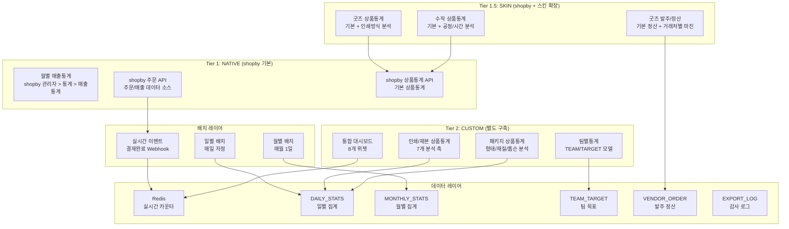
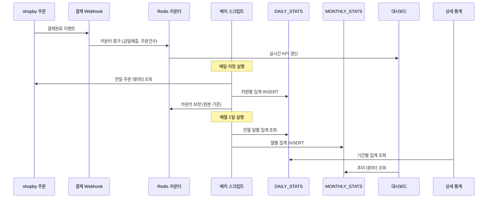
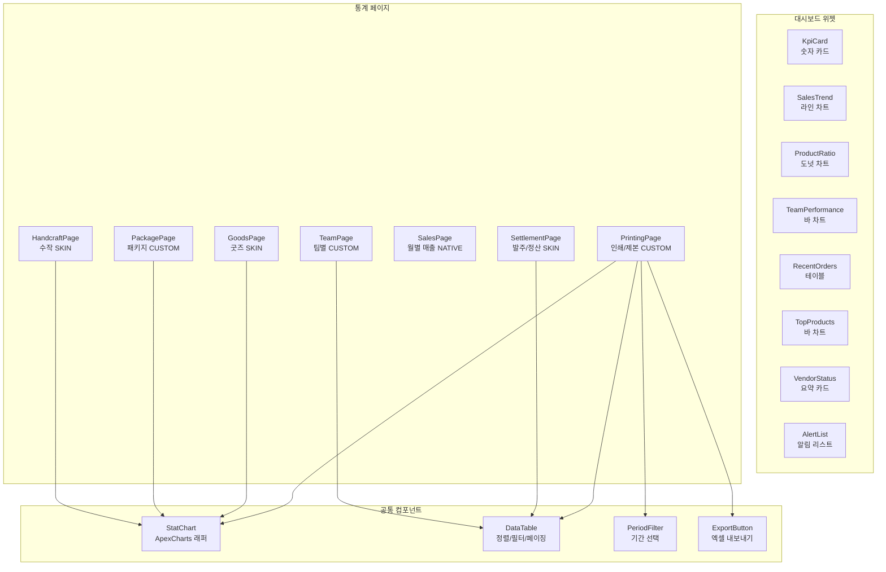
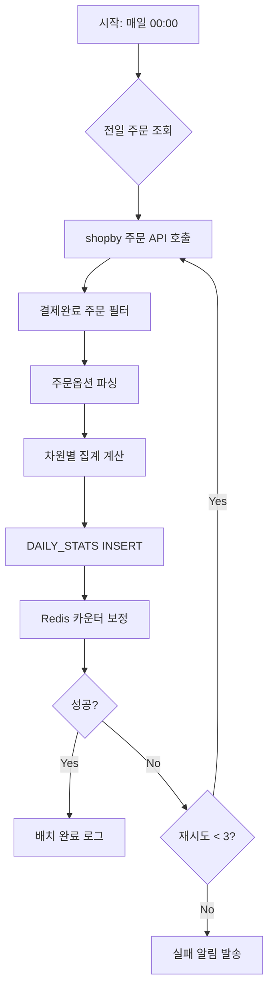
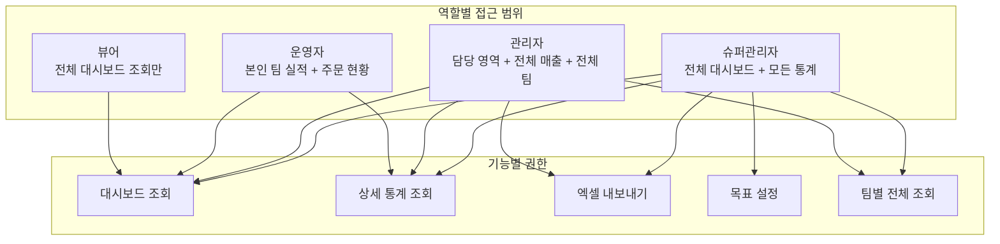

# SPEC-STATS-001: B7-STATISTICS 아키텍처 설계

> 후니프린팅 통계/리포트 도메인 (7개 기능) 기술 아키텍처

---

## 1. 시스템 아키텍처 개요

### 1.1 3-Tier Hybrid 아키텍처에서의 위치



### 1.2 핵심 설계 원칙

| 원칙 | 내용 |
|------|------|
| shopby API 우선 | NATIVE 매출통계는 shopby 기본 기능 그대로 활용 |
| 집계 테이블 분리 | 원본 주문 데이터와 집계 데이터를 분리하여 조회 성능 확보 |
| 2계층 갱신 | 실시간(Redis) + 배치(DB)로 성능과 정합성 양립 |
| 유연한 차원 모델 | dimension/dimension_value 패턴으로 분석 축 확장 |
| 역할 기반 접근 제어 | RBAC로 팀별/역할별 데이터 접근 통제 |

---

## 2. 데이터 아키텍처

### 2.1 집계 테이블 설계

#### DAILY_STATS (일별 집계)

```
DAILY_STATS
├── id (PK)
├── stat_date (DATE, INDEX)
├── category (VARCHAR) - 인쇄/제본/굿즈/패키지/수작
├── dimension (VARCHAR) - 분석 축 (paper/coating/finishing 등)
├── dimension_value (VARCHAR) - 분석 값 (아트지/무광 등)
├── order_count (INT) - 주문 건수
├── total_amount (DECIMAL) - 매출 합계 (공급가)
├── created_at (TIMESTAMP)
└── updated_at (TIMESTAMP)

INDEX: (stat_date, category, dimension)
```

**차원 모델 패턴**: dimension/dimension_value 조합으로 새로운 분석 축 추가 시 스키마 변경 없이 데이터만 추가.

예시:
| stat_date | category | dimension | dimension_value | order_count | total_amount |
|-----------|----------|-----------|----------------|-------------|-------------|
| 2026-03-19 | printing | paper | 아트지 | 45 | 2,250,000 |
| 2026-03-19 | printing | coating | 무광 | 32 | 1,800,000 |
| 2026-03-19 | binding | method | 중철 | 12 | 960,000 |
| 2026-03-19 | goods | print_method | 실크 | 8 | 480,000 |

#### MONTHLY_STATS (월별 집계)

```
MONTHLY_STATS
├── id (PK)
├── year_month (VARCHAR, INDEX) - "2026-03"
├── category (VARCHAR)
├── total_amount (DECIMAL) - 월 총매출
├── order_count (INT)
├── prev_month_amount (DECIMAL) - 전월 매출
├── prev_year_amount (DECIMAL) - 전년동기 매출
├── growth_rate_mom (DECIMAL) - 전월 대비 증감률
├── growth_rate_yoy (DECIMAL) - 전년 대비 증감률
├── created_at (TIMESTAMP)
└── updated_at (TIMESTAMP)

INDEX: (year_month, category)
```

#### TEAM/TEAM_MEMBER/TEAM_TARGET

```
TEAM
├── id (PK)
├── team_name (VARCHAR)
├── team_leader_id (INT, FK -> TEAM_MEMBER)
├── is_active (BOOLEAN)
├── created_at (TIMESTAMP)
└── updated_at (TIMESTAMP)

TEAM_MEMBER
├── id (PK)
├── member_name (VARCHAR)
├── team_id (INT, FK -> TEAM)
├── role (VARCHAR) - leader/member
├── shopby_admin_id (VARCHAR) - shopby 관리자 계정 매핑
├── is_active (BOOLEAN)
├── created_at (TIMESTAMP)
└── updated_at (TIMESTAMP)

TEAM_TARGET
├── id (PK)
├── team_id (INT, FK -> TEAM)
├── member_id (INT, FK -> TEAM_MEMBER, NULLABLE)
├── period (VARCHAR) - "2026-03"
├── target_amount (DECIMAL) - 목표 매출
├── target_count (INT) - 목표 건수
├── created_at (TIMESTAMP)
└── updated_at (TIMESTAMP)

INDEX: (team_id, period)
```

#### ORDER_HANDLER_SNAPSHOT (주문-담당자 스냅샷)

```
ORDER_HANDLER_SNAPSHOT
├── id (PK)
├── order_id (VARCHAR) - shopby 주문 ID
├── handler_id (INT, FK -> TEAM_MEMBER)
├── team_id (INT, FK -> TEAM)
├── handled_at (TIMESTAMP)
├── order_amount (DECIMAL)
└── created_at (TIMESTAMP)

INDEX: (handler_id, handled_at)
INDEX: (team_id, handled_at)
```

#### VENDOR_ORDER (외주 발주)

```
VENDOR_ORDER
├── id (PK)
├── vendor_id (INT, FK -> VENDOR)
├── order_date (DATE)
├── product_name (VARCHAR)
├── order_price (DECIMAL) - 발주가
├── sell_price (DECIMAL) - 판매가
├── margin_rate (DECIMAL) - 마진율
├── settlement_status (VARCHAR) - pending/settled
├── settlement_date (DATE, NULLABLE)
├── due_date (DATE) - 납기일
├── actual_delivery_date (DATE, NULLABLE)
├── quality_issue (BOOLEAN, DEFAULT false)
├── created_at (TIMESTAMP)
└── updated_at (TIMESTAMP)

INDEX: (vendor_id, order_date)
INDEX: (settlement_status)
```

#### EXPORT_LOG (감사 로그)

```
EXPORT_LOG
├── id (PK)
├── user_id (INT)
├── user_name (VARCHAR)
├── export_time (TIMESTAMP)
├── export_type (VARCHAR) - printing/goods/settlement/team
├── conditions (JSON) - 조회 조건
├── filename (VARCHAR)
├── row_count (INT)
├── created_at (TIMESTAMP)

INDEX: (user_id, export_time)
```

### 2.2 데이터 흐름



---

## 3. 프론트엔드 아키텍처

### 3.1 컴포넌트 구조



### 3.2 커스텀 훅

| 훅 | 용도 |
|-----|------|
| `useStatQuery(category, dimension, period)` | 집계 데이터 조회 (기간/차원 기반) |
| `useDashboardKpi()` | 대시보드 KPI 실시간 데이터 |
| `useExport(type, conditions)` | 엑셀 내보내기 + 감사 로그 |
| `useTeamStats(teamId)` | 팀별 통계 + RBAC 필터 |
| `useVendorSettlement(vendorId)` | 거래처별 발주/정산 |

### 3.3 라우팅

| 경로 | 페이지 | 권한 |
|------|--------|------|
| `/admin/statistics/dashboard` | 통합 대시보드 | 운영자 이상 |
| `/admin/statistics/printing` | 인쇄/제본 통계 | 관리자 이상 |
| `/admin/statistics/goods` | 굿즈 통계 | 관리자 이상 |
| `/admin/statistics/package` | 패키지 통계 | 관리자 이상 |
| `/admin/statistics/handcraft` | 수작 통계 | 관리자 이상 |
| `/admin/statistics/sales` | 월별 매출 (NATIVE) | 관리자 이상 |
| `/admin/statistics/settlement` | 발주/정산 | 관리자 이상 |
| `/admin/statistics/team` | 팀별 통계 | 운영자: 본인팀, 관리자: 전체 |
| `/admin/statistics/team/:teamId` | 팀 상세 (담당자별) | 운영자: 본인팀, 관리자: 전체 |
| `/admin/statistics/team/target` | 목표 설정 | 관리자만 |

---

## 4. 배치 처리 아키텍처

### 4.1 일별 배치 (Daily Aggregation)



**주문옵션 파싱 매핑**:

| shopby 옵션 필드 | dimension | 파싱 로직 |
|-----------------|-----------|----------|
| option_name에 "용지" 포함 | paper | option_value 추출 |
| option_name에 "코팅" 포함 | coating | option_value 추출 |
| option_name에 "후가공" 포함 | finishing | option_value 추출 |
| option_name에 "인쇄도수" 포함 | color | option_value 추출 |
| option_name에 "사이즈" 포함 | size | option_value 추출 |
| product_quantity | quantity_range | 구간화 (100/200/500/1000+) |

### 4.2 월별 배치 (Monthly Aggregation)

- 매월 1일 실행
- DAILY_STATS에서 전월 데이터 SUM
- 전월/전년동기 매출 자동 계산
- 증감률 산출

---

## 5. 보안 아키텍처

### 5.1 RBAC (역할 기반 접근 제어)



### 5.2 데이터 보안

- 엑셀 다운로드: 관리자 이상만 허용, 감사 로그 기록
- 팀별 통계: 운영자는 본인 팀 데이터만 API 응답에 포함 (서버 사이드 필터링)
- 집계 데이터: 직접 수정 API 미제공 (배치만 가능)
- 내보내기 로그: 사용자, 시각, 조건, 파일명, 행 수 기록

---

## 6. 성능 설계

### 6.1 캐싱 전략

| 데이터 | 캐시 레이어 | TTL | 갱신 전략 |
|--------|-----------|-----|----------|
| 대시보드 KPI | Redis | 실시간 | 결제완료 이벤트 시 즉시 |
| 일별 집계 | DB + 메모리 캐시 | 24시간 | 배치 완료 시 무효화 |
| 월별 집계 | DB | 영구 | 월별 배치 시 갱신 |
| 차트 데이터 | 브라우저 로컬 | 5분 | SWR/React Query staleTime |

### 6.2 인덱스 전략

| 테이블 | 인덱스 | 용도 |
|--------|--------|------|
| DAILY_STATS | (stat_date, category, dimension) | 기간+카테고리+차원 복합 조회 |
| MONTHLY_STATS | (year_month, category) | 월별+카테고리 조회 |
| TEAM_TARGET | (team_id, period) | 팀별 기간 목표 조회 |
| ORDER_HANDLER_SNAPSHOT | (handler_id, handled_at) | 담당자별 기간 실적 |
| VENDOR_ORDER | (vendor_id, order_date) | 거래처별 기간 발주 |
| EXPORT_LOG | (user_id, export_time) | 사용자별 다운로드 이력 |

### 6.3 대용량 엑셀 처리

- 1만 행 이하: 클라이언트 사이드 생성 (SheetJS)
- 1만~10만 행: 서버 사이드 생성 (스트리밍 xlsx)
- 10만 행 초과: 비동기 백그라운드 생성 + 다운로드 링크 알림
