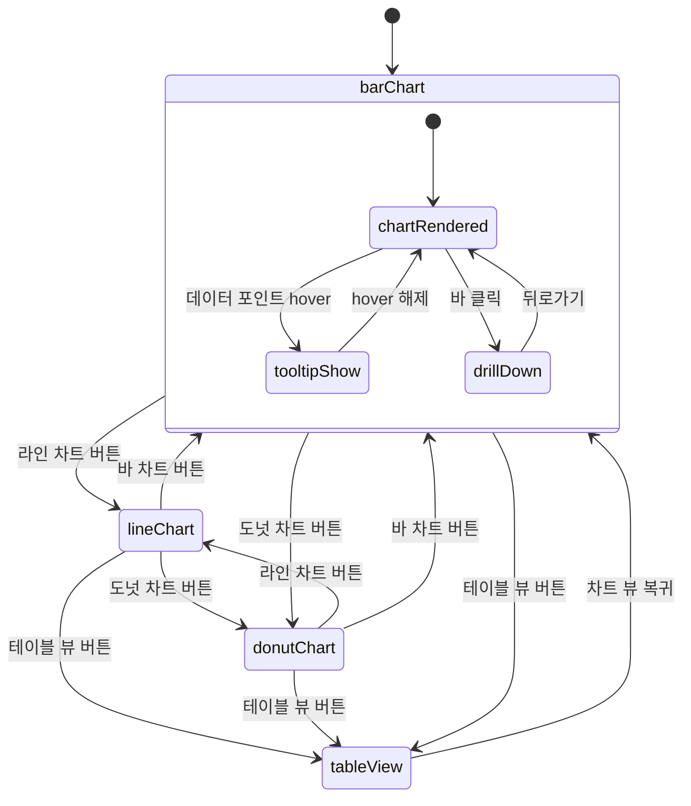
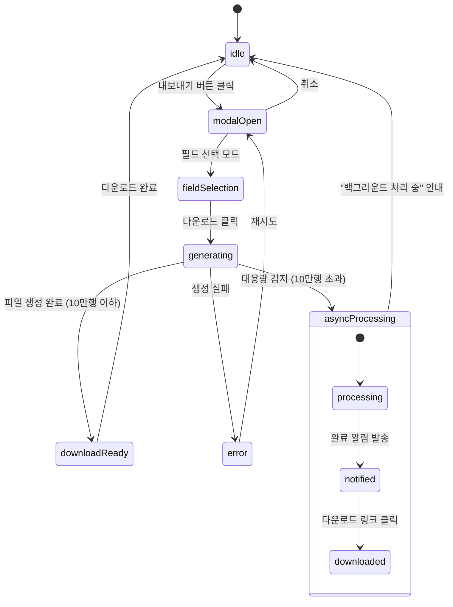
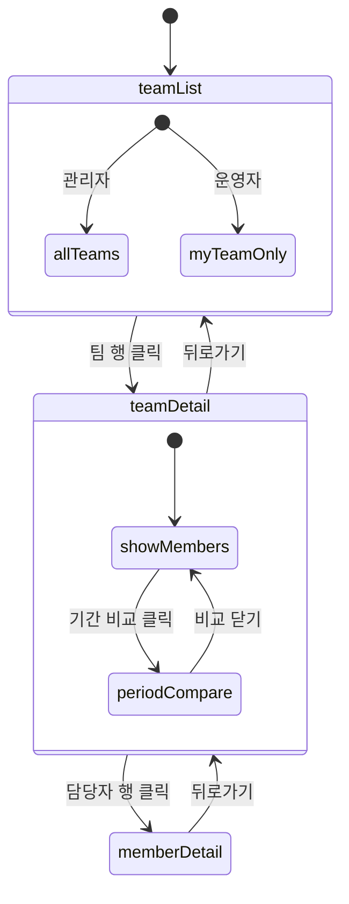
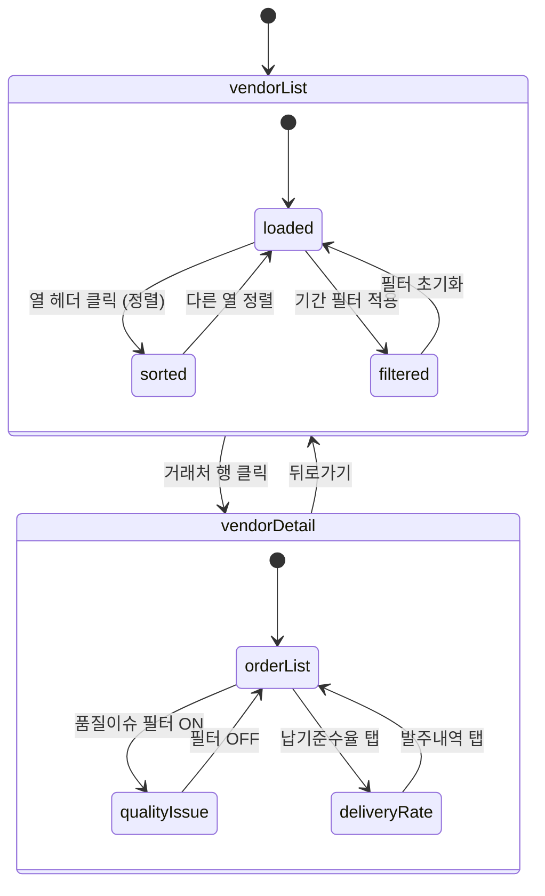

# SPEC-STATS-001: 인터랙션 정의서

> B7-STATISTICS 통계/리포트 도메인 상태 머신, 로딩/에러 상태, 조건부 표시 규칙

---

## 1. 상태 머신 (State Machines)

### 1.1 기간 필터 (PeriodFilter)

```mermaid
stateDiagram-v2
    [*] --> default

    default --> selecting : 기간 드롭다운 클릭
    default : 기본값 = 이번 달

    selecting --> preset : 프리셋 선택 (일/주/월/분기/연)
    selecting --> customRange : 직접선택 클릭

    preset --> loading : 기간 적용

    customRange --> datePickerOpen : 달력 표시
    datePickerOpen --> customRange : 시작일 선택
    customRange --> loading : 종료일 선택 & 적용
    datePickerOpen --> default : 취소

    loading --> dataLoaded : 데이터 조회 완료
    loading --> empty : 데이터 없음
    loading --> error : 조회 실패

    dataLoaded --> default : 기간 변경
    empty --> default : 기간 변경
    error --> default : 재시도
```

### 1.2 차트 뷰 (StatChart)



### 1.3 엑셀 내보내기 (ExportFlow)



### 1.4 팀별 통계 드릴다운 (TeamDrillDown)



### 1.5 거래처 발주/정산 (VendorSettlement)



---

## 2. 로딩/에러 상태

### 2.1 로딩 상태 정의

| 화면 영역 | 로딩 유형 | 표시 방법 | 타임아웃 |
|-----------|----------|----------|---------|
| KPI 카드 | 스켈레톤 | 숫자 영역 펄스 애니메이션 | 5초 |
| 차트 영역 | 스켈레톤 | 차트 영역 그레이 박스 + 펄스 | 5초 |
| 데이터 테이블 | 스켈레톤 | 행 3개 펄스 애니메이션 | 5초 |
| 엑셀 내보내기 | 스피너 | 버튼 내 스피너 + "생성 중..." 텍스트 | 30초 |
| 대시보드 전체 | 프로그레시브 | 위젯별 순차 로딩 (KPI 먼저) | 10초 |

### 2.2 에러 상태 정의

| 에러 유형 | 표시 방법 | 사용자 액션 |
|-----------|----------|------------|
| 네트워크 오류 | "데이터를 불러올 수 없습니다" + 재시도 버튼 | 재시도 클릭 |
| 권한 없음 | "접근 권한이 없습니다" + 관리자 문의 안내 | 뒤로가기 |
| 데이터 없음 | "해당 기간의 데이터가 없습니다" + 기간 변경 안내 | 기간 변경 |
| 내보내기 실패 | "파일 생성에 실패했습니다" + 재시도 버튼 | 재시도 |
| 배치 지연 | "최신 데이터 반영 중입니다" 안내 배너 | 자동 해소 |
| 타임아웃 | "요청 시간이 초과되었습니다" + 기간 축소 안내 | 기간 축소 |

### 2.3 빈 상태 (Empty State)

| 화면 | 빈 상태 메시지 | 안내 액션 |
|------|---------------|----------|
| 상품 통계 | "해당 기간의 데이터가 없습니다" | "기간을 변경해보세요" |
| 팀별 통계 | "등록된 팀이 없습니다" | "팀 설정에서 팀을 추가해주세요" |
| 발주/정산 | "해당 기간의 발주 내역이 없습니다" | "기간을 변경해보세요" |
| 대시보드 | "아직 집계된 데이터가 없습니다" | "첫 주문이 접수되면 통계가 시작됩니다" |
| 목표 설정 | "설정된 목표가 없습니다" | "목표 추가 버튼을 눌러 설정하세요" |

---

## 3. 조건부 표시 규칙

### 3.1 역할 기반 표시

| 조건 | 표시/숨김 | 대상 화면 |
|------|----------|----------|
| role === 'SUPER_ADMIN' | 전체 표시 | 모든 통계 화면 |
| role === 'ADMIN' | 전체 표시 (목표 설정 가능) | 모든 통계 + 목표 설정 |
| role === 'OPERATOR' | 본인 팀만 표시 | 팀별 통계 (본인 팀 필터) |
| role === 'OPERATOR' | 엑셀 버튼 숨김 | 모든 통계 페이지 |
| role === 'VIEWER' | 조회만 허용 | 대시보드 (조회 전용) |

### 3.2 데이터 기반 표시

| 조건 | 표시 내용 | 대상 화면 |
|------|----------|----------|
| achievement >= 100% | 초록색 + 체크 아이콘 | 팀별 달성률 |
| 80% <= achievement < 100% | 노란색 + 경고 아이콘 | 팀별 달성률 |
| achievement < 80% | 빨간색 + 경고 아이콘 | 팀별 달성률 |
| unsettledAmount > 0 | 빨간색 하이라이트 + 알림 뱃지 | 발주/정산 미정산 행 |
| qualityIssue === true | 주황색 텍스트 + 경고 아이콘 | 발주 상세 품질이슈 행 |
| deliveryRate < 90% | 빨간색 텍스트 | 거래처 납기 준수율 |
| growthRate > 0 | 초록색 + 상승 화살표 | 매출 증감률 |
| growthRate < 0 | 빨간색 + 하락 화살표 | 매출 증감률 |
| growthRate === 0 | 회색 + 수평선 | 매출 증감률 |

### 3.3 기능 기반 표시

| 조건 | 표시/숨김 | 대상 |
|------|----------|------|
| dataCount > 100,000 | 비동기 내보내기 모달 표시 | 엑셀 내보내기 |
| dataCount <= 100,000 | 즉시 다운로드 | 엑셀 내보내기 |
| 배치 미완료 (금일) | "최신 데이터 반영 중" 배너 | 전체 통계 |
| Redis 장애 | KPI 카드에 "마지막 갱신: HH:mm" 표시 | 대시보드 |

---

## 4. 애니메이션 & 전환

### 4.1 차트 전환

| 전환 | 애니메이션 | 지속 시간 |
|------|-----------|----------|
| 차트 유형 변경 (바 -> 라인) | Fade out -> Fade in | 300ms |
| 분석 축 탭 전환 | Slide left/right | 200ms |
| 차트 -> 테이블 뷰 | Crossfade | 300ms |
| 드릴다운 진입 | Slide left | 300ms |
| 드릴다운 복귀 | Slide right | 300ms |

### 4.2 데이터 갱신

| 갱신 유형 | 애니메이션 | 지속 시간 |
|----------|-----------|----------|
| KPI 카드 수치 변경 | 숫자 카운트업 | 500ms |
| 차트 데이터 갱신 | 막대/라인 리사이즈 | 500ms |
| 테이블 행 추가 | Fade in (top) | 200ms |
| 스켈레톤 -> 데이터 | Fade in | 300ms |

---

## 5. 키보드 & 접근성

### 5.1 키보드 네비게이션

| 키 | 동작 | 화면 |
|-----|------|------|
| Tab | 위젯/필터/버튼 간 포커스 이동 | 전체 |
| Enter | 선택/실행 | 전체 |
| Escape | 모달 닫기, 드롭다운 닫기 | 모달, 필터 |
| Arrow Up/Down | 테이블 행 이동 | 데이터 테이블 |
| Arrow Left/Right | 탭 전환 | 분석 축 탭 |
| Space | 체크박스 토글 | 필드 선택 |

### 5.2 스크린 리더 지원

| 요소 | aria 속성 | 내용 |
|------|-----------|------|
| KPI 카드 | aria-label | "금일매출 3,250,000원" |
| 차트 | aria-label | "2026년 1~3월 인쇄 상품 용지별 분포 바 차트" |
| 달성률 | aria-label | "영업팀 달성률 85%, 경고 상태" |
| 증감률 | aria-label | "전월 대비 12% 상승" |
| 엑셀 버튼 (비활성) | aria-disabled + title | "관리자 권한이 필요합니다" |
