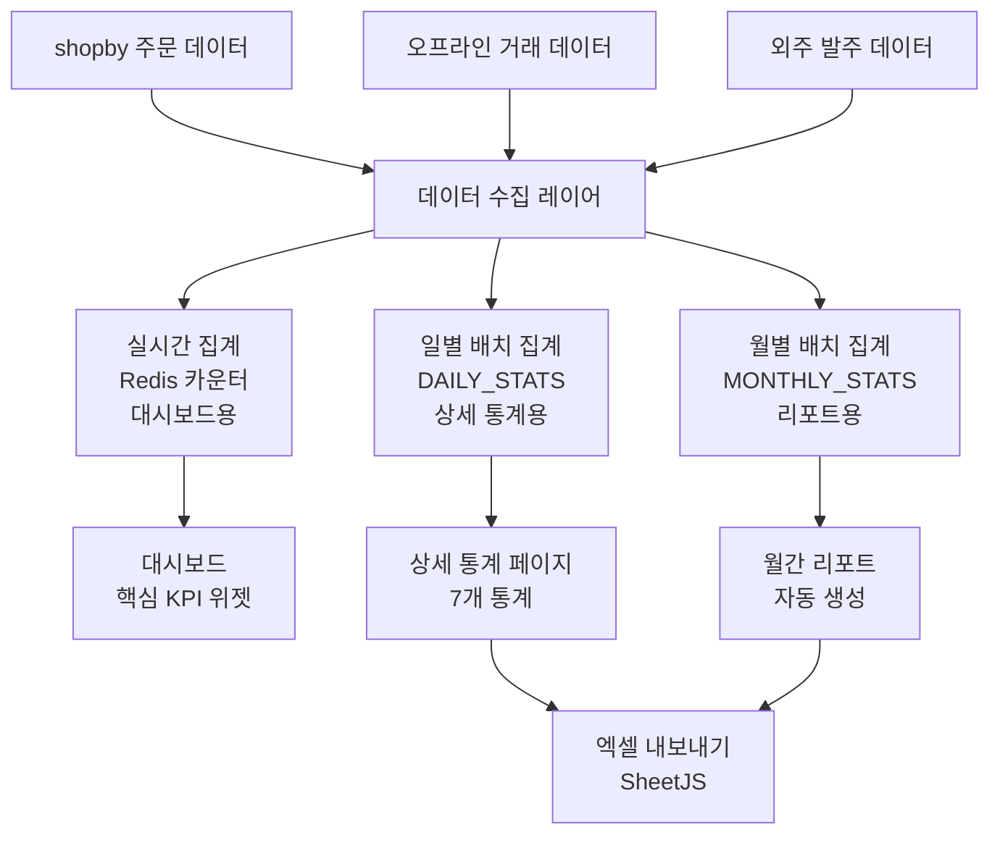
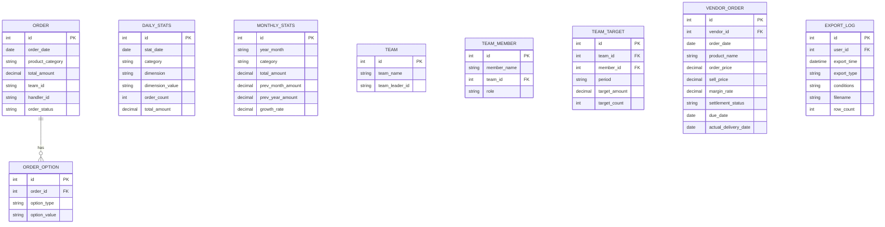

# SPEC-STATS-001: 구현 계획서

> B7-STATISTICS 통계/리포트 도메인 구현 전략

---

## 1. 구현 개요

### 1.1 범위

후니프린팅 shopby Enterprise 기반 통계/리포트 도메인의 7개 기능을 4개 Phase로 나누어 구현한다. shopby NATIVE 매출통계를 기반으로, SKIN 확장과 CUSTOM 별도 구축을 Hybrid로 병행한다.

### 1.2 접근 방식

- **shopby API 우선**: 월별 매출통계는 shopby 기본 통계 API 활용
- **SKIN 확장**: 굿즈/수작/발주정산은 shopby 기본 화면에 분석 축 추가
- **CUSTOM 구축**: 인쇄/제본, 패키지, 팀별통계는 별도 통계 페이지 구축
- **PC-First 설계**: 관리자 전용이므로 PC 대화면 최적화 (데이터 테이블, 차트)
- **집계 성능**: 실시간(Redis) + 일별 배치(DB) 2계층 집계 전략

### 1.3 개발 방법론

TDD (RED-GREEN-REFACTOR) 방식 적용. 통계 집계 로직의 정확성이 핵심이므로 테스트 우선 개발로 데이터 정합성을 보장한다.

---

## 2. 아키텍처 결정사항

### 2.1 3-Tier Hybrid 배치

| Tier | 해당 기능 | 구현 방식 |
|------|----------|----------|
| Tier 1 (NATIVE) | 월별 매출통계 | shopby 기본 매출통계 API/화면 활용 |
| Tier 1.5 (SKIN) | 굿즈/수작 통계, 발주/정산 | shopby 기본 + 스킨 커스텀 확장 |
| Tier 2 (CUSTOM) | 인쇄/제본, 패키지, 팀별, 대시보드 | 별도 통계 페이지/API 구축 |

### 2.2 데이터 흐름 아키텍처



### 2.3 기술 스택

| 영역 | 기술 | 용도 |
|------|------|------|
| 차트 | ApexCharts | 반응형 인터랙티브 차트 (바/라인/도넛) |
| 테이블 | AG Grid 또는 커스텀 테이블 | 정렬/필터/페이징 데이터 테이블 |
| 엑셀 | SheetJS (xlsx) | xlsx 파일 생성/다운로드 |
| 실시간 | Redis 기반 카운터 | 대시보드 KPI 실시간 갱신 |
| 배치 | Cron Job (서버 사이드) | 일별/월별 집계 배치 |
| 프론트 | React (shopby 스킨 기반) | 관리자 통계 페이지 |
| 레이아웃 | CSS Grid | 대시보드 위젯 배치 |

### 2.4 데이터 모델 (집계 테이블)



---

## 3. 구현 단계

### Phase 1: 핵심 기반 (1순위) - 최우선

**목표**: 월별 매출통계(NATIVE) + 대시보드 핵심 위젯 + 데이터 집계 기반

| TAG | 기능 | 작업 범위 | 완료 조건 | 의존성 |
|-----|------|----------|----------|--------|
| TAG-001 | 데이터 집계 기반 | 배치 스크립트, DAILY/MONTHLY_STATS 테이블, Redis 카운터 | 일별/월별 배치 정상 동작, 실시간 카운터 갱신 | 주문 데이터 (SPEC-ORDER) |
| TAG-002 | 월별 매출통계 | shopby 기본 매출통계 화면 활용 | shopby 매출통계 접근 가능, 기간별 조회 동작 | 없음 (NATIVE) |
| TAG-003 | 핵심 대시보드 | KPI 카드 4개, 매출 추이 라인 차트, 상품군 비율 도넛 차트 | 대시보드 렌더링, 실시간 KPI 갱신 | TAG-001 |

**핵심 리스크**: shopby 주문 API 대량 데이터 조회 시 성능 - TAG-001에서 최우선 검증

### Phase 2: 상품군별 통계 (2순위)

**목표**: 5개 상품군 통계 화면 구축

| TAG | 기능 | 작업 범위 | 완료 조건 | 의존성 |
|-----|------|----------|----------|--------|
| TAG-004 | 인쇄/제본 상품통계 (CUSTOM) | 통계 페이지, 7개 분석 축 차트, 데이터 테이블 | 용지/코팅/후가공/수량/도수/사이즈별 통계 조회 | TAG-001 |
| TAG-005 | 굿즈 상품통계 (SKIN) | shopby 기본 확장, 인쇄방식 분석 축 추가 | 상품유형/인쇄방식/용도/MOQ별 통계 조회 | TAG-001 |
| TAG-006 | 패키지 상품통계 (CUSTOM) | 통계 페이지, 형태/재질/톰슨/후가공 분석 | 4개 분석 축 통계 조회 | TAG-001 |
| TAG-007 | 수작 상품통계 (SKIN) | shopby 기본 확장, 공정/시간 분석 축 추가 | 공정/소요시간/단가별 통계 조회 | TAG-001 |
| TAG-008 | 엑셀 내보내기 (공통) | SheetJS 기반, 필드 선택, 비동기 대용량 | 상품통계 xlsx 다운로드, 감사 로그 기록 | TAG-004~007 |

### Phase 3: 팀별통계 + 발주정산 (3순위)

**목표**: 팀별 실적 관리 + 굿즈 외주 정산

| TAG | 기능 | 작업 범위 | 완료 조건 | 의존성 |
|-----|------|----------|----------|--------|
| TAG-009 | 팀별통계 데이터 모델 (CUSTOM) | TEAM, TEAM_MEMBER, TEAM_TARGET 테이블, RBAC | 팀/담당자 CRUD, 목표 설정, 권한 제어 | 없음 |
| TAG-010 | 팀별통계 UI | 팀별 매출, 담당자별 실적, 목표 달성률 차트 | 팀 드릴다운, 달성률 색상 코드, 엑셀 다운 | TAG-009 |
| TAG-011 | 굿즈 발주/정산 (SKIN) | shopby 기본 확장, 거래처별 마진/미정산 | 거래처별 테이블, 상세 드릴다운, 납기 준수율 | TAG-001 |

### Phase 4: 대시보드 확장 + 심화 분석 (선택)

**목표**: 대시보드 전체 위젯 + 알림 시스템

| TAG | 기능 | 작업 범위 | 완료 조건 | 의존성 |
|-----|------|----------|----------|--------|
| TAG-012 | 대시보드 확장 위젯 | 팀별 실적, 최근 주문, 인기 TOP 10, 외주 현황 | 8개 위젯 전체 렌더링 | TAG-001, TAG-009, TAG-011 |
| TAG-013 | 알림 시스템 | 목표 달성, 이상치 감지, 미수금 알림 | 알림 규칙 설정, 실시간 알림 표시 | TAG-012 |
| TAG-014 | 인쇄옵션 심화 분석 | 옵션 조합 분석, 트렌드 분석, 비교 분석 | 다차원 분석 차트, 기간 비교 기능 | TAG-004 |

---

## 4. 리스크 및 대응

| 리스크 | 영향 | 대응 방안 |
|--------|------|----------|
| shopby 주문 API 대량 조회 성능 | 통계 로딩 지연 | 집계 테이블 사전 구축, API 페이지네이션 활용 |
| 인쇄 옵션 데이터 구조 불일치 | 분석 축 매핑 오류 | shopby 주문옵션 필드 사전 매핑 테이블 정의 |
| Redis 카운터 원본 불일치 | 대시보드 수치 오류 | 일별 배치에서 Redis 카운터 보정 로직 추가 |
| 팀 구조 변경 시 통계 정합성 | 과거 데이터 왜곡 | 주문-담당자 매핑은 주문 시점 스냅샷 보관 |
| 대용량 엑셀 내보내기 메모리 | 서버 OOM | 스트리밍 방식 xlsx 생성 (서버 사이드) |

---

## 5. 품질 기준

### 5.1 테스트 전략

| 테스트 유형 | 대상 | 도구 |
|------------|------|------|
| 단위 테스트 | 집계 로직, 마진 계산, 기간 필터 | Jest / Vitest |
| 통합 테스트 | 배치 집계 → DB 검증, API → 집계 데이터 | Jest + DB |
| E2E 테스트 | 대시보드 렌더링, 차트 인터랙션, 엑셀 다운로드 | Playwright |
| 성능 테스트 | 대량 데이터 조회, 엑셀 내보내기 | k6 / Artillery |

### 5.2 커버리지 목표

- 집계 로직: 95% 이상 (핵심 비즈니스 로직)
- API 레이어: 85% 이상
- UI 컴포넌트: 80% 이상
- 전체: 85% 이상

---

## 6. 파일 구조 (예상)

```
src/pages/admin/statistics/
  dashboard/                 # 대시보드
    index.jsx
    widgets/
      KpiCard.jsx
      SalesTrend.jsx
      ProductRatio.jsx
      TeamPerformance.jsx
      RecentOrders.jsx
      TopProducts.jsx
      VendorStatus.jsx
  printing/                  # 인쇄/제본 통계 (CUSTOM)
    index.jsx
    PrintingChart.jsx
    BindingChart.jsx
    AnalysisFilter.jsx
  goods/                     # 굿즈 통계 (SKIN)
    index.jsx
    GoodsChart.jsx
  package/                   # 패키지 통계 (CUSTOM)
    index.jsx
  handcraft/                 # 수작 통계 (SKIN)
    index.jsx
  sales/                     # 월별 매출 (NATIVE)
    index.jsx
  settlement/                # 굿즈 발주/정산 (SKIN)
    index.jsx
    VendorDetail.jsx
  team/                      # 팀별 통계 (CUSTOM)
    index.jsx
    TeamDetail.jsx
    TargetSetting.jsx
  shared/
    components/
      StatChart.jsx          # ApexCharts 래퍼
      DataTable.jsx          # 정렬/필터/페이징 테이블
      PeriodFilter.jsx       # 기간 필터 공통
      ExportButton.jsx       # 엑셀 내보내기
    hooks/
      useStatQuery.js        # 통계 조회 커스텀 훅
      useExport.js           # 엑셀 내보내기 훅
    utils/
      aggregation.js         # 집계 유틸
      format.js              # 금액/비율 포맷
```

---

## 7. expert 자문 권장

| 영역 | expert | 자문 내용 |
|------|--------|----------|
| 백엔드 | expert-backend | 배치 집계 설계, Redis 카운터, 대용량 데이터 처리 |
| 프론트엔드 | expert-frontend | ApexCharts 통합, 대시보드 위젯 설계, 반응형 레이아웃 |
| 성능 | expert-performance | 대량 데이터 조회 최적화, 엑셀 내보내기 성능 |
