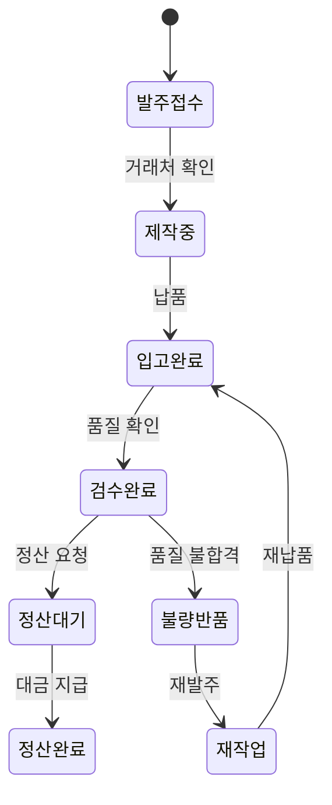
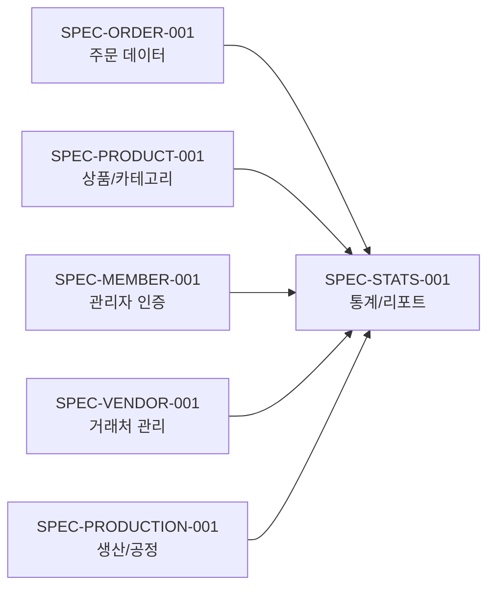

# SPEC-STATS-001 요구사항 분석 (B7-STATISTICS 도메인)

> **작성일**: 2026-03-20
> **SPEC ID**: SPEC-STATS-001
> **대상 도메인**: B7-STATISTICS (통계/리포트)
> **플랫폼**: 후니프린팅 shopby Enterprise 기반
> **shopby 구현 방식**: Hybrid (1 NATIVE + 3 SKIN + 3 CUSTOM)

---

## 목차

1. [핵심 의사결정 사항 (8개)](#1-핵심-의사결정-사항)
2. [모듈 1: 상품 통계](#2-모듈-1-상품-통계)
3. [모듈 2: 매출/정산 통계](#3-모듈-2-매출정산-통계)
4. [모듈 3: 팀별 통계](#4-모듈-3-팀별-통계)
5. [엣지 케이스 및 리스크](#5-엣지-케이스-및-리스크)
6. [크로스 도메인 의존성](#6-크로스-도메인-의존성)
7. [비기능 요구사항](#7-비기능-요구사항)

---

## 1. 핵심 의사결정 사항

### KD-STS-01: 통계 조회 기간 범위

**결정 항목**: 통계 조회 시 제공할 기간 선택 옵션

**선택 가능 옵션**:
| 옵션 | 내용 | 장점 | 단점 |
|------|------|------|------|
| A | 일/월/연 3가지만 | 단순, 구현 비용 낮음 | 분석 유연성 부족 |
| B | 일/주/월/분기/연 + 직접선택 | 다양한 분석 가능 | UI 복잡성 증가 |
| C | 자유 기간 선택만 | 최대 유연성 | 프리셋 없어 불편 |

**경쟁사 벤치마크**:
- 레드프린팅: 추정 - 월/분기/연 (대규모 조직)
- 와우프레스: 3개월 단위 (회원등급 3개월 접수액 기준)

**권장 결정**: **옵션 B (일/주/월/분기/연 + 직접선택)**

**근거**:
- 일별: 당일 실적 확인용
- 주별: 주간 리뷰용
- 월별: 월간 성과 분석 (가장 빈번한 사용)
- 분기별: 분기 목표 달성 검토
- 연별: 연간 추이 파악
- 직접선택: 특정 이벤트/프로모션 기간 분석

---

### KD-STS-02: 데이터 갱신 주기

**결정 항목**: 통계 데이터 갱신 빈도

**선택 가능 옵션**:
| 옵션 | 내용 | 장점 | 단점 |
|------|------|------|------|
| A | 전체 실시간 | 항상 최신 데이터 | 서버 부하 높음, 비용 증가 |
| B | 대시보드 실시간 + 상세통계 일별 | 핵심 KPI 즉시 + 상세 분석 안정적 | 상세통계 최대 1일 지연 |
| C | 전체 일별 배치 | 서버 부하 최소 | 당일 실적 확인 불가 |

**권장 결정**: **옵션 B (대시보드 실시간 + 상세통계 일별)**

**근거**:
- 대시보드 KPI(금일매출, 주문건수)는 경영진이 실시간 확인 필요
- 상세 분석(옵션별 분포, 추이 등)은 일별 집계로 충분
- Redis 기반 카운터로 실시간 부분만 처리하여 비용 최적화
- 일별 배치로 정확한 집계 보장 (원본 데이터 검증)

---

### KD-STS-03: 통계 기준 금액

**결정 항목**: 매출 통계의 기준 금액

**선택 가능 옵션**:
| 옵션 | 내용 | 장점 | 단점 |
|------|------|------|------|
| A | 판매가 (VAT 포함) | 고객 입장 가격, 직관적 | 세무/회계와 불일치 |
| B | 공급가 (VAT 제외) | 세무/회계 기준 일치 | 고객 결제액과 다름 |
| C | 둘 다 표시 | 양쪽 관점 모두 제공 | UI 복잡, 혼동 가능 |

**권장 결정**: **옵션 B (공급가, VAT 제외)**

**근거**:
- 법인 세무신고 시 공급가 기준 매출 산정
- B2B 거래가 많은 인쇄 업종에서 공급가 기준이 표준
- 필요 시 "VAT 포함" 토글로 판매가 전환 가능하게 구현

---

### KD-STS-04: 팀별 통계 열람 권한

**결정 항목**: 팀별 통계 데이터 열람 범위

**선택 가능 옵션**:
| 옵션 | 내용 | 장점 | 단점 |
|------|------|------|------|
| A | 전체 공개 | 투명성 최대 | 비교 스트레스, 개인정보 우려 |
| B | 관리자 전체, 운영자 본인팀 | 적절한 접근 제어 | 운영자 간 협업 시 불편 |
| C | 관리자만 접근 | 보안 최대 | 팀장 자기팀 실적 확인 불가 |

**권장 결정**: **옵션 B (관리자: 전체, 운영자: 본인팀만)**

**근거**:
- 관리자(대표, 경영지원): 전체 팀 비교 분석 필요
- 운영자(팀장): 자기 팀 실적 관리에 집중
- 담당자별 상세 실적은 해당 팀 내에서만 열람
- RBAC(역할 기반 접근 제어)로 구현

---

### KD-STS-05: 엑셀 내보내기 형식

**결정 항목**: 내보내기 파일 형식 및 옵션

**선택 가능 옵션**:
| 옵션 | 내용 | 장점 | 단점 |
|------|------|------|------|
| A | xlsx 고정 전체 필드 | 단순 구현 | 불필요한 데이터 포함 |
| B | xlsx + 사용자 필드 선택 | 유연성, 파일 크기 절감 | 구현 복잡도 증가 |
| C | xlsx + csv 둘 다 | 다양한 활용 | 구현/유지보수 비용 |

**권장 결정**: **옵션 B (xlsx + 사용자 필드 선택)**

**근거**:
- xlsx: 서식 유지, 피벗 테이블 활용 가능
- 필드 선택: 필요한 데이터만 추출하여 효율적 분석
- 관리자 이상만 다운로드 가능 (데이터 보안)
- 다운로드 로그 기록 (감사 추적)

---

### KD-STS-06: 차트 라이브러리

**결정 항목**: 통계 차트 렌더링 라이브러리

**선택 가능 옵션**:
| 옵션 | 내용 | 장점 | 단점 |
|------|------|------|------|
| A | Chart.js | 경량, 간단한 차트 | 인터랙티브 기능 제한 |
| B | ApexCharts | 반응형, 인터랙티브, React 호환 | 번들 크기 (100KB+) |
| C | Recharts | React 네이티브, D3 기반 | 복잡한 차트 유형 제한 |

**권장 결정**: **옵션 B (ApexCharts)**

**근거**:
- 반응형 차트로 다양한 화면 크기 대응
- 인터랙티브 기능(줌, 팬, 툴팁, 드릴다운) 기본 제공
- 바/라인/도넛/수평바 등 필요한 차트 유형 모두 지원
- React 래퍼(react-apexcharts) 공식 제공
- POLICY-B7-STATISTICS에서도 ApexCharts 추천

---

### KD-STS-07: 주문 상태별 포함 기준

**결정 항목**: 통계에 포함할 주문 상태 범위

**선택 가능 옵션**:
| 옵션 | 내용 | 장점 | 단점 |
|------|------|------|------|
| A | 주문접수부터 | 모든 주문 가시성 | 취소/환불 전 데이터 왜곡 |
| B | 결제완료 이후 | 실제 매출만 집계 | 미결제 주문 추이 누락 |
| C | 배송완료만 | 확정 매출 기준 | 지연 반영, 실시간성 저하 |

**권장 결정**: **옵션 B (결제완료 이후만 포함)**

**근거**:
- 결제완료 = 실제 매출 발생 시점
- 취소/반품 건은 별도 차감 처리
- 실시간 KPI에는 결제완료 시점 반영
- 환불은 환불 처리 시점에 매출 차감

---

### KD-STS-08: 데이터 보관 기간

**결정 항목**: 통계 원본 및 집계 데이터 보관 기간

**선택 가능 옵션**:
| 옵션 | 내용 | 장점 | 단점 |
|------|------|------|------|
| A | 원본 3년, 집계 5년 | 스토리지 절감 | 장기 분석 제한 |
| B | 원본 5년, 집계 무기한 | 세무 의무 충족 + 장기 트렌드 | 스토리지 비용 증가 |
| C | 전체 무기한 | 완전한 이력 보존 | 스토리지 비용 최대 |

**권장 결정**: **옵션 B (원본 5년, 집계 무기한)**

**근거**:
- 세무 관련 증빙 보관 의무: 5년 (국세기본법 제26조의2)
- 집계 데이터는 용량이 작아 무기한 보관 비용 미미
- 장기 매출 트렌드 분석(연도별 비교)에 집계 무기한 필요

---

## 2. 모듈 1: 상품 통계

### 2.1 인쇄/제본 상품통계 (CUSTOM)

**구현 배경**: shopby 기본 상품통계에는 인쇄 특화 옵션(용지/코팅/후가공/도수/사이즈)별 분석 기능이 없다. 인쇄 업종 핵심 분석 축이므로 별도 CUSTOM 통계 페이지를 구축한다.

**7개 분석 축**:
| 분석 축 | 항목 예시 | 데이터 소스 |
|---------|----------|------------|
| 상품별 | 명함/전단/리플렛/포스터/스티커/현수막 | shopby 주문 상품 카테고리 |
| 용지별 | 아트지/스노우지/모조지/특수지 | shopby 주문 옵션 (option_type='paper') |
| 코팅별 | 무광/유광/벨벳/엠보 | shopby 주문 옵션 (option_type='coating') |
| 후가공별 | 박/형압/톰슨/오시 | shopby 주문 옵션 (option_type='finishing') |
| 수량별 | 100매/200매/500매/1000매+ | shopby 주문 수량 구간화 |
| 인쇄도수별 | 단도/양면/4도+4도 | shopby 주문 옵션 (option_type='color') |
| 사이즈별 | A4/A3/A2/명함/맞춤 | shopby 주문 옵션 (option_type='size') |

**데이터 흐름**: shopby 주문 API -> 주문옵션 파싱 -> DAILY_STATS 집계 -> 차트/테이블 렌더링

### 2.2 굿즈 상품통계 (SKIN)

**구현 배경**: shopby 기본 상품통계를 스킨으로 확장하여 인쇄방식(실크/UV/전사/각인/디지털) 분석 축을 추가한다.

**추가 분석 축**: 인쇄방식별 분포 (shopby 주문 옵션에서 추출)

### 2.3 패키지 상품통계 (CUSTOM)

**구현 배경**: 패키지 상품의 톰슨(칼형) 분석은 shopby 기본 통계로 불가. 별도 CUSTOM 구축.

**핵심 분석**: 기존톰슨/신규톰슨 비율 - 신규 칼형 제작은 추가 비용이 발생하므로 경영 판단에 중요.

### 2.4 수작 상품통계 (SKIN)

**구현 배경**: shopby 기본 상품통계에 공정별/소요시간별 분석을 스킨 확장으로 추가.

**핵심 분석**: 공정별 소요시간 분포 - 수작업 생산 용량 계획에 활용.

---

## 3. 모듈 2: 매출/정산 통계

### 3.1 월별 매출통계 (NATIVE)

**구현 배경**: shopby 관리자 > 통계 > 매출통계 기본 기능을 그대로 활용. 추가 커스텀 불요.

**shopby 기본 제공 항목**: 일별/주별/월별 매출, 주문건수, 결제수단별 분포

### 3.2 굿즈 발주/정산 (SKIN)

**구현 배경**: shopby 기본 정산 기능 위에 거래처별 발주/정산 매칭, 마진율 계산을 스킨 커스텀으로 추가.

**핵심 데이터**: 거래처관리(B-2) 도메인과 연동하여 외주 발주 데이터를 조회.

**정산 상태 흐름**:

---

## 4. 모듈 3: 팀별 통계

### 4.1 CUSTOM 구축 필요성

shopby에는 팀/담당자 개념이 없으므로 완전 별도 구축이 필요하다.

**필요 데이터 모델**:
- 팀 테이블: 팀ID, 팀명, 팀장
- 담당자 테이블: 담당자ID, 이름, 팀ID, 역할
- 주문-담당자 매핑: 주문ID, 담당자ID, 처리일시 (주문 시점 스냅샷)
- 목표 테이블: 팀ID/담당자ID, 기간, 목표매출, 목표건수

### 4.2 주문-담당자 매핑 전략

주문 처리 시점의 담당자를 스냅샷으로 기록. 팀 구조 변경(담당자 이동, 팀 분할)이 발생해도 과거 통계는 주문 시점의 팀 기준으로 유지.

### 4.3 목표 관리

| 항목 | 설정 |
|------|------|
| 목표 주기 | 월별 설정, 분기 리뷰 |
| 목표 지표 | 매출액 (주 지표) + 주문건수 (보조 지표) |
| 달성률 표시 | 실시간 업데이트, 색상 구분 (초록/노랑/빨강) |
| 설정 권한 | 관리자만 (운영자는 조회만) |

---

## 5. 엣지 케이스 및 리스크

### 5.1 데이터 정합성

| 케이스 | 설명 | 대응 |
|--------|------|------|
| 부분 환불 | 주문 일부 상품만 환불 시 통계 반영 | 환불 금액만 차감, 원 주문 유지 |
| 주문 수정 | 결제 후 옵션 변경 시 통계 반영 | 수정 시점 기준 재집계 |
| 중복 결제 | 동일 주문 중복 결제 시 | 결제 건 기준 1건만 집계 |
| 배치 실패 | 일별 집계 배치 실패 시 | 자동 재시도 3회, 실패 시 관리자 알림 |
| Redis 장애 | 실시간 카운터 불일치 시 | 일별 배치에서 Redis 카운터 보정 |

### 5.2 성능 리스크

| 케이스 | 설명 | 대응 |
|--------|------|------|
| 대량 데이터 조회 | 1년 전체 인쇄 옵션별 집계 | 집계 테이블 사전 구축, 인덱스 최적화 |
| 대시보드 동시접속 | 경영진 회의 시 다수 동시 접근 | Redis 캐시, CDN 정적 자산 |
| 엑셀 대용량 | 10만 행 이상 내보내기 | 서버 사이드 스트리밍 생성, 비동기 알림 |

---

## 6. 크로스 도메인 의존성

| 의존 도메인 | 의존 데이터 | 영향도 |
|------------|-----------|--------|
| 주문관리 | 주문건수, 매출액, 상품옵션, 결제수단 | 높음 (핵심 데이터 소스) |
| 상품관리 | 상품 카테고리, 옵션 정보 | 높음 (분석 축 매핑) |
| 회원관리 | 관리자 인증, 권한 등급 (RBAC) | 중간 (접근 제어) |
| 거래처관리 | 거래처 정보, 발주/납품 데이터 | 중간 (발주정산 전용) |
| 생산관리 | 공정 현황, 트래킹 포인트 | 낮음 (대시보드 연동) |

---

## 7. 비기능 요구사항

### 7.1 성능 요구사항

| 지표 | 목표 | 측정 방법 |
|------|------|----------|
| 대시보드 초기 로딩 | 2초 이내 | Lighthouse, WebPageTest |
| 상세 통계 페이지 로딩 | 3초 이내 (1년 데이터) | k6 부하 테스트 |
| 차트 렌더링 | 1초 이내 | Performance API |
| 엑셀 내보내기 (1만 행) | 5초 이내 | 자동화 테스트 |
| 실시간 카운터 갱신 | 1초 이내 | Redis Pub/Sub 지연 |

### 7.2 확장성

- 새로운 상품군 통계 추가 시 분석 축 설정만으로 확장 가능하도록 설계
- 대시보드 위젯은 플러그인 방식으로 추가/삭제/순서변경 가능하도록 설계
- 집계 차원(dimension) 추가 시 DAILY_STATS 테이블 스키마 변경 불요 (dimension/dimension_value 패턴)

### 7.3 접근성

- 차트에 대체 텍스트(aria-label) 제공
- 데이터 테이블 키보드 네비게이션 지원
- 색상만으로 정보 전달하지 않음 (달성률: 색상 + 수치 + 아이콘)
- 고대비 모드 지원
