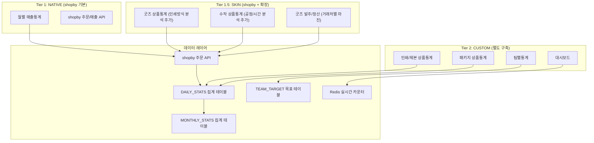

# SPEC-STATS-001: B7-STATISTICS 통계/리포트 도메인

> 후니프린팅 shopby Enterprise 기반 통계/리포트 시스템 (7개 기능, 3개 모듈)

---

## HISTORY

| 버전 | 일자 | 작성자 | 변경 내용 |
|------|------|--------|----------|
| 1.0.0 | 2026-03-20 | MoAI (manager-spec) | 초기 SPEC 작성 - 3개 모듈, 7개 기능 정의 |

---

## 1. 개요

### 1.1 목적

후니프린팅 shopby Enterprise 마이그레이션에서 통계/리포트(B7-STATISTICS) 도메인의 전체 기능을 정의한다. 상품군별(인쇄/제본/굿즈/패키지/수작) 통계, 매출 통계, 발주 정산, 팀별 실적 통계를 포괄하며, shopby 기본 통계를 활용하는 NATIVE 기능과 인쇄 도메인 특화 CUSTOM 통계를 Hybrid로 구현한다.

### 1.2 범위

- **포함**: 인쇄/제본 상품통계, 굿즈 상품통계, 패키지 상품통계, 수작 상품통계, 월별 매출통계, 굿즈 발주/정산, 팀별통계, 대시보드
- **제외**: 실시간 생산 모니터링(SPEC-PRODUCTION), 재고 통계(SPEC-INVENTORY), 예측 분석/AI(Phase 5)

### 1.3 SPEC-PLAN-001과의 관계

본 SPEC은 SPEC-PLAN-001 v1.1.0 마스터 기획서의 B7-STATISTICS 도메인 정책을 구현 수준으로 구체화한 문서이다. POLICY-B7-STATISTICS의 11개 결정 항목과 8개 통계 기능을 포괄한다.

### 1.4 도메인 특성

- **관리자 전용**: 모든 기능이 관리자 시스템(Admin) 측에서만 사용
- **PC-First**: 인쇄 업종 특성상 PC 대형 화면 최적화 (데이터 테이블, 차트)
- **데이터 중심**: 대량 데이터 조회/집계/내보내기 성능이 핵심

---

## 2. 핵심 의사결정 요약

| KD ID | 항목 | 권장 결정 | 근거 요약 | 상태 |
|-------|------|----------|----------|------|
| KD-STS-01 | 통계 조회 기간 범위 | 일/주/월/분기/연 + 직접선택 | 유연한 기간 분석 지원, 경쟁사 대비 차별화 | 미결정 |
| KD-STS-02 | 데이터 갱신 주기 | 대시보드 실시간, 상세통계 일별 집계 | 실시간 KPI + 일별 배치로 성능/비용 균형 | 미결정 |
| KD-STS-03 | 통계 기준 금액 | 공급가(VAT 제외) | 세무/회계 기준 일치, 매출 비교 정확성 | 미결정 |
| KD-STS-04 | 팀별 통계 열람 권한 | 관리자: 전체, 운영자: 본인팀만 | 데이터 보안 + 자기팀 성과 관리 양립 | 미결정 |
| KD-STS-05 | 엑셀 내보내기 형식 | xlsx + 사용자 필드 선택 | 서식 유지, 피벗 활용, 유연성 제공 | 미결정 |
| KD-STS-06 | 차트 라이브러리 | ApexCharts | 반응형, 인터랙티브, React 호환성 우수 | 미결정 |
| KD-STS-07 | 주문 상태별 포함 기준 | 결제완료 이후만 포함 | 취소/환불 전 데이터 오염 방지 | 미결정 |
| KD-STS-08 | 데이터 보관 기간 | 원본 5년, 집계 무기한 | 세무 보관 의무(5년) + 장기 트렌드 분석 | 미결정 |

> KD-STS-01~08 전체 미결정. 정책 결정 후 본 문서 업데이트 필요. 상세 분석은 `requirements-analysis.md` 참조.

---

## 3. EARS 요구사항

### 3.1 모듈 1: 상품 통계 (Product Statistics) - 5개 기능

#### REQ-STS-001 [Ubiquitous] 상품군별 통계 분리

시스템은 항상 인쇄/제본, 굿즈, 패키지, 수작 상품군을 독립된 통계 화면으로 분리 제공해야 한다.

#### REQ-STS-002 [Ubiquitous] 기간 필터 기본 제공

시스템은 항상 모든 통계 화면에서 일/주/월/분기/연/직접선택 기간 필터를 제공해야 한다.

#### REQ-STS-003 [Ubiquitous] 결제완료 기준 집계

시스템은 항상 결제완료 상태 이후의 주문만 통계에 포함해야 한다. (취소/환불 건은 제외)

#### REQ-STS-004 [Ubiquitous] 공급가 기준 금액

시스템은 항상 VAT 제외 공급가를 기준으로 통계 금액을 산출해야 한다.

#### REQ-STS-005 [Event-Driven] 인쇄/제본 상품통계 조회

WHEN 관리자가 인쇄/제본 통계 페이지에 접근하면 THEN 시스템은 기간별 주문건수, 매출액을 표시하고 용지별/코팅별/후가공별/수량별/인쇄도수별/사이즈별 분석 축으로 세분화된 통계를 제공해야 한다.

#### REQ-STS-006 [Event-Driven] 제본 상품 분석 축

WHEN 관리자가 제본 상품통계 탭을 선택하면 THEN 시스템은 제본방식별(중철/무선/사철/스프링/양장), 페이지수별, 표지용지별, 합판/독판별, 부수별 분석을 제공해야 한다.

#### REQ-STS-007 [Event-Driven] 굿즈 상품통계 조회

WHEN 관리자가 굿즈 통계 페이지에 접근하면 THEN 시스템은 상품유형별(머그컵/텀블러/에코백 등), 인쇄방식별(실크/UV/전사/각인/디지털), 용도별, MOQ별 분석을 제공해야 한다.

#### REQ-STS-008 [Event-Driven] 패키지 상품통계 조회

WHEN 관리자가 패키지 통계 페이지에 접근하면 THEN 시스템은 형태별(박스/봉투/쇼핑백/포장지), 재질별, 톰슨별(기존/신규), 후가공별 분석을 제공해야 한다.

#### REQ-STS-009 [Event-Driven] 수작 상품통계 조회

WHEN 관리자가 수작 통계 페이지에 접근하면 THEN 시스템은 공정별(엠보싱/형압/수제본/특수접지/손칼), 소요시간별, 단가별 분석을 제공해야 한다.

#### REQ-STS-010 [Event-Driven] 상품통계 차트 전환

WHEN 관리자가 차트 유형 전환 버튼을 클릭하면 THEN 시스템은 바 차트/라인 차트/도넛 차트 간 전환을 지원해야 한다.

#### REQ-STS-011 [Event-Driven] 상품통계 데이터 테이블

WHEN 관리자가 테이블 뷰로 전환하면 THEN 시스템은 정렬/필터/페이징이 가능한 데이터 테이블을 표시하고 각 행의 상세 드릴다운을 지원해야 한다.

#### REQ-STS-012 [State-Driven] 데이터 로딩 상태

IF 통계 데이터 조회가 3초 이상 소요되면 THEN 시스템은 스켈레톤 로딩 UI를 표시해야 한다.

#### REQ-STS-013 [State-Driven] 빈 데이터 상태

IF 선택된 기간에 해당하는 통계 데이터가 없으면 THEN 시스템은 "해당 기간의 데이터가 없습니다" 메시지와 기간 변경 안내를 표시해야 한다.

#### REQ-STS-014 [Unwanted] 미결제 주문 집계 금지

시스템은 결제완료 이전 상태(입금대기, 주문접수)의 주문을 통계 금액에 포함하지 않아야 한다.

### 3.2 모듈 2: 매출/정산 통계 (Sales & Settlement) - 2개 기능

#### REQ-STS-015 [Event-Driven] 월별 매출통계 조회

WHEN 관리자가 월별 매출통계 페이지에 접근하면 THEN 시스템은 월 총매출, 전월 대비 증감률, 전년동기 대비 증감률, 상품군별 비율, 결제수단별 분포를 표시해야 한다.

#### REQ-STS-016 [Event-Driven] 매출 추이 차트

WHEN 관리자가 매출 추이 차트를 조회하면 THEN 시스템은 최근 12개월 매출 라인 차트와 전년 동기 비교선을 함께 표시해야 한다.

#### REQ-STS-017 [Event-Driven] 비교 기간 선택

WHEN 관리자가 비교 기간을 선택하면 THEN 시스템은 전월/전년동기/직접선택 중 선택된 기간과 현재 기간의 비교 분석을 제공해야 한다.

#### REQ-STS-018 [Event-Driven] 굿즈 발주/정산 조회

WHEN 관리자가 굿즈 발주/정산 페이지에 접근하면 THEN 시스템은 거래처별 발주액, 정산액, 마진율, 미정산액, 발주건수를 테이블 형태로 표시해야 한다.

#### REQ-STS-019 [Event-Driven] 발주/정산 상세 드릴다운

WHEN 관리자가 특정 거래처 행을 클릭하면 THEN 시스템은 해당 거래처의 발주 내역(상품명, 발주일, 발주가, 판매가, 마진, 상태)을 상세 테이블로 표시해야 한다.

#### REQ-STS-020 [Event-Driven] 미정산 알림

WHEN 미정산 금액이 존재하면 THEN 시스템은 대시보드 외주 현황 위젯에 미정산 알림을 표시해야 한다.

#### REQ-STS-021 [Event-Driven] 납기 준수율 표시

WHEN 관리자가 거래처별 납기 준수율을 조회하면 THEN 시스템은 약정 납기 대비 실제 납품 비율을 백분율로 표시해야 한다.

### 3.3 모듈 3: 팀별 통계 (Team Statistics) - 1개 기능 (CUSTOM)

#### REQ-STS-022 [Event-Driven] 팀별 매출 통계

WHEN 관리자가 팀별 통계 페이지에 접근하면 THEN 시스템은 팀별 매출 합계, 주문 처리 건수, 목표 달성률을 표시해야 한다.

#### REQ-STS-023 [Event-Driven] 담당자별 실적 조회

WHEN 관리자가 특정 팀을 선택하면 THEN 시스템은 해당 팀의 담당자별 매출, 처리 건수, 목표 달성률, 평균 처리 시간을 상세 표시해야 한다.

#### REQ-STS-024 [Event-Driven] 목표 설정

WHEN 관리자가 팀/담당자 목표를 설정하면 THEN 시스템은 월별 목표매출과 목표건수를 저장하고 달성률 계산에 반영해야 한다.

#### REQ-STS-025 [State-Driven] 달성률 색상 코드

IF 달성률이 100% 이상이면 THEN 초록색, IF 80~99%이면 THEN 노란색, IF 80% 미만이면 THEN 빨간색으로 표시해야 한다.

#### REQ-STS-026 [State-Driven] 팀별 열람 권한

IF 현재 사용자가 운영자 등급이면 THEN 본인 팀 통계만 조회 가능하고, IF 관리자 등급 이상이면 THEN 전체 팀 통계를 조회할 수 있어야 한다.

#### REQ-STS-027 [Unwanted] 타팀 데이터 접근 차단

시스템은 운영자 등급 사용자가 본인 소속 팀 외의 담당자별 실적 데이터에 접근하지 못하게 해야 한다.

### 3.4 공통: 대시보드 (Dashboard)

#### REQ-STS-028 [Ubiquitous] 핵심 KPI 카드

시스템은 항상 대시보드 상단에 금일매출, 금월매출, 전월대비 증감률, 주문건수를 숫자 카드로 표시해야 한다.

#### REQ-STS-029 [Ubiquitous] 대시보드 접근 권한

시스템은 항상 슈퍼관리자는 전체 대시보드, 관리자는 담당 영역+전체 매출, 운영자는 본인 팀 실적+주문 현황을 표시해야 한다.

#### REQ-STS-030 [Event-Driven] 매출 추이 위젯

WHEN 관리자가 대시보드에 접근하면 THEN 시스템은 최근 12개월 매출 추이 라인 차트와 전년 비교선을 표시해야 한다.

#### REQ-STS-031 [Event-Driven] 상품군 비율 위젯

WHEN 관리자가 대시보드에 접근하면 THEN 시스템은 인쇄/제본/굿즈/패키지/수작 매출 비율 도넛 차트를 표시해야 한다.

#### REQ-STS-032 [Event-Driven] 팀별 실적 위젯

WHEN 관리자가 대시보드에 접근하면 THEN 시스템은 팀별 월 매출과 목표 달성률을 수평 바 차트로 표시해야 한다.

#### REQ-STS-033 [Event-Driven] 최근 주문 위젯

WHEN 관리자가 대시보드에 접근하면 THEN 시스템은 최근 10건의 주문을 상태와 함께 테이블로 표시해야 한다.

#### REQ-STS-034 [Event-Driven] 인기 상품 TOP 10 위젯

WHEN 관리자가 대시보드에 접근하면 THEN 시스템은 주문건수 기준 상위 10개 상품을 수평 바 차트로 표시해야 한다.

#### REQ-STS-035 [Event-Driven] 외주 현황 위젯

WHEN 관리자가 대시보드에 접근하면 THEN 시스템은 굿즈 발주 현황과 미정산 알림을 요약 카드로 표시해야 한다.

### 3.5 공통: 엑셀 내보내기 (Export)

#### REQ-STS-036 [Event-Driven] 엑셀 다운로드

WHEN 관리자가 엑셀 내보내기 버튼을 클릭하면 THEN 시스템은 현재 조회 조건에 맞는 데이터를 xlsx 형식으로 다운로드해야 한다.

#### REQ-STS-037 [Event-Driven] 필드 선택 내보내기

WHEN 관리자가 내보내기 시 필드 선택 옵션을 사용하면 THEN 시스템은 선택된 필드만 포함하여 엑셀 파일을 생성해야 한다.

#### REQ-STS-038 [State-Driven] 대용량 내보내기 비동기 처리

IF 내보내기 데이터가 10만 행을 초과하면 THEN 시스템은 백그라운드에서 파일을 생성하고 다운로드 링크를 알림으로 제공해야 한다.

#### REQ-STS-039 [Ubiquitous] 다운로드 로그 기록

시스템은 항상 엑셀 다운로드 시 사용자, 시각, 조건, 파일명을 감사 로그에 기록해야 한다.

#### REQ-STS-040 [State-Driven] 내보내기 권한 제한

IF 현재 사용자가 관리자 등급 미만이면 THEN 엑셀 내보내기 버튼을 비활성화해야 한다.

### 3.6 공통: 데이터 집계 (Aggregation)

#### REQ-STS-041 [Ubiquitous] 일별 배치 집계

시스템은 항상 매일 자정에 전일 주문 데이터를 일별 집계 테이블(DAILY_STATS)에 배치 집계해야 한다.

#### REQ-STS-042 [Ubiquitous] 월별 리포트 집계

시스템은 항상 매월 1일에 전월 일별 집계를 기반으로 월별 집계 테이블(MONTHLY_STATS)을 생성해야 한다.

#### REQ-STS-043 [Event-Driven] 실시간 카운터 갱신

WHEN 결제완료 주문이 발생하면 THEN 시스템은 대시보드용 실시간 카운터(금일매출, 주문건수)를 즉시 갱신해야 한다.

#### REQ-STS-044 [Unwanted] 집계 데이터 직접 수정 금지

시스템은 집계 테이블(DAILY_STATS, MONTHLY_STATS)의 데이터를 관리자가 직접 수정하지 못하게 해야 한다.

---

## 4. 기능-shopby 구현 분류

| 기능 | shopby 분류 | 구현 방식 | 개발 규모 | 우선순위 |
|------|------------|----------|----------|---------|
| 인쇄/제본 상품통계 | CUSTOM | shopby 주문 데이터 + 별도 통계 페이지 | L | 2순위 |
| 굿즈 상품통계 | SKIN | shopby 기본 + 스킨 확장 (인쇄방식 분석 추가) | M | 2순위 |
| 패키지 상품통계 | CUSTOM | shopby 주문 데이터 + 별도 통계 페이지 | L | 2순위 |
| 수작 상품통계 | SKIN | shopby 기본 + 스킨 확장 (공정/시간 분석 추가) | M | 3순위 |
| 월별 매출통계 | NATIVE | shopby 기본 매출통계 활용 | S | 1순위 |
| 굿즈 발주/정산 | SKIN | shopby 기본 정산 + 스킨 확장 (거래처별 마진) | M | 2순위 |
| 팀별통계 | CUSTOM | shopby 미지원, 완전 별도 구축 | L | 3순위 |

---

## 5. 3-Tier Hybrid 아키텍처 배치

---

## 6. 크로스 도메인 의존성

| 의존 SPEC | 의존 내용 | 의존 방향 |
|-----------|---------|----------|
| SPEC-ORDER-001 | 주문 데이터 (주문건수, 매출액, 상품옵션) | 통계 <- 주문 |
| SPEC-PRODUCT-001 | 상품 카테고리, 옵션 정보 | 통계 <- 상품 |
| SPEC-MEMBER-001 | 관리자 인증, 권한 등급 | 통계 <- 회원 |
| SPEC-VENDOR-001 | 거래처 정보 (굿즈 발주/정산) | 통계 <- 거래처 |
| SPEC-PRODUCTION-001 | 공정 현황 데이터 (대시보드 연동) | 통계 <- 생산 |

---

## 7. 비기능 요구사항

### 7.1 성능

| 항목 | 목표 |
|------|------|
| 상세 통계 페이지 로딩 | 3초 이내 (1년 데이터 기준) |
| 대시보드 위젯 로딩 | 2초 이내 |
| 엑셀 내보내기 (1만 행) | 5초 이내 |
| 엑셀 내보내기 (10만 행+) | 비동기 처리 (1분 이내) |
| 실시간 카운터 갱신 | 1초 이내 |

### 7.2 보안

- 통계 데이터 접근은 관리자 등급 이상으로 제한
- 팀별 통계는 역할 기반 접근 제어 (RBAC) 적용
- 엑셀 다운로드는 감사 로그 기록 필수
- 집계 데이터 직접 수정 차단

### 7.3 가용성

- 일별 배치 집계 실패 시 자동 재시도 (최대 3회)
- 배치 실패 알림 (관리자 이메일/슬랙)
- 집계 데이터와 원본 데이터 불일치 감지 메커니즘

---

## 8. 단계별 도입 계획 (POLICY-B7-STATISTICS 기반)

| 단계 | 항목 | 시기 |
|------|------|------|
| 1단계 | 월별매출(NATIVE) + 핵심 대시보드 (KPI 카드, 매출추이) | 오픈 시 |
| 2단계 | 상품군별 5개 통계 (인쇄/제본/굿즈/패키지/수작) | 오픈 후 1개월 |
| 3단계 | 팀별통계 + 굿즈발주정산 + 엑셀 내보내기 | 오픈 후 2개월 |
| 4단계 | 인쇄옵션 기반 심화 분석 + 알림 시스템 | 오픈 후 3개월 |

---

## 9. 용어 정의

| 용어 | 정의 |
|------|------|
| 공급가 | VAT(부가가치세) 제외 금액 |
| 합판 | 여러 고객의 주문을 하나의 인쇄판에 모아 인쇄하는 방식 |
| 독판 | 고객 단독 인쇄판을 사용하는 방식 |
| 톰슨 | 골판지/백판지 등을 특정 형태로 커팅하는 칼형(다이) |
| MOQ | Minimum Order Quantity, 최소 주문 수량 |
| 마진율 | (판매가 - 발주가) / 판매가 x 100 |
| KPI | Key Performance Indicator, 핵심 성과 지표 |
| RBAC | Role-Based Access Control, 역할 기반 접근 제어 |
