# shopby.skin - Aurora Skin

**인쇄업 특화 전자상거래 플랫폼**

[](https://react.dev/)
[](https://reactrouter.com/)
[](https://tailwindcss.com/)
[](https://www.radix-ui.com/)
[](https://playwright.dev/)
[](./LICENSE)

**Version:** 1.16.5 | **Release Date:** 2026-01-22

---

## 프로젝트 개요

**shopby.skin**은 shopby 엔터프라이즈 플랫폼을 기반으로 한 현대적인 인쇄업 특화 전자상거래 스킨입니다. React 18 기반의 SPA(Single Page Application)로 구축되었으며, 고객 쇼핑 경험과 관리자 기능을 포괄적으로 제공합니다.

### 핵심 특징

- **고객 대면**: 45개 이상의 쇼핑 페이지로 인쇄상품 탐색, 주문, 결제 지원
- **관리자 대시보드**: 13개 이상의 관리 페이지로 상품, 주문, 회원, 통계 관리
- **현대 기술 스택**: React 18, Tailwind CSS 3.4, Radix UI 기반의 반응형 설계
- **성능 최적화**: 코드 스플리팅, 지연 로딩, 메모리 최적화 구현
- **접근성**: WCAG 2.1 준수, Radix UI의 완전한 접근성 지원
- **다국어 지원**: i18next 기반의 국제화 프레임워크

---

## 아키텍처 개요

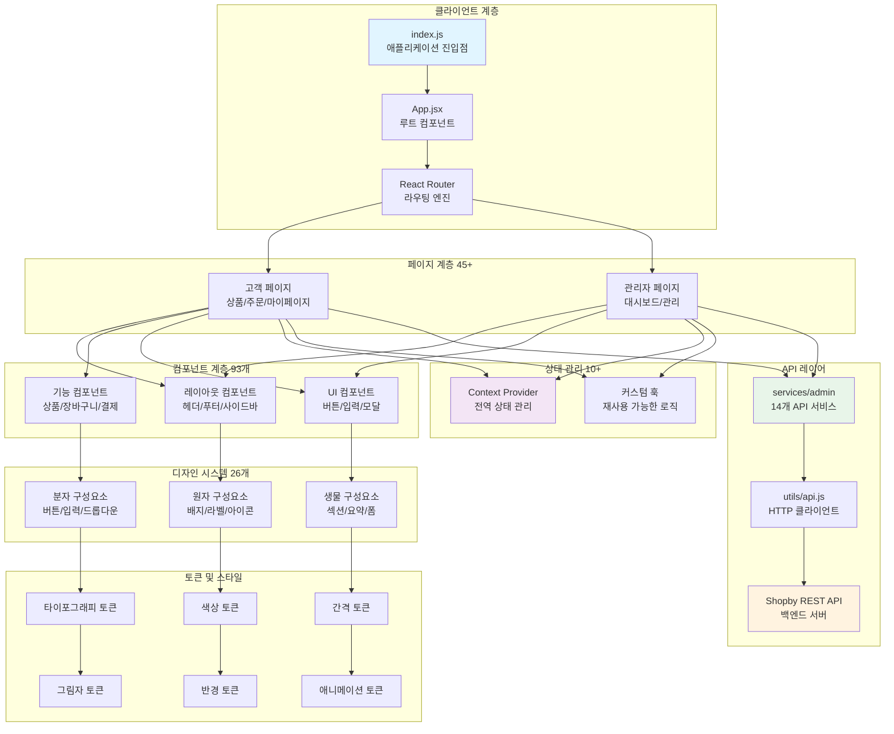

---

## 기술 스택

| 분류 | 기술 | 버전 | 용도 |
|------|------|------|------|
| **프레임워크** | React | 18.2.0 | UI 라이브러리 |
| **라우팅** | React Router | 6.4.3 | 페이지 네비게이션 |
| **스타일링** | Tailwind CSS | 3.4.19 | 유틸리티 CSS |
| **UI 컴포넌트** | Radix UI | 1.x | 접근성 있는 UI |
| **유틸리티** | CVA | - | 조건부 클래스 |
| **아이콘** | Lucide React | 0.577.0 | SVG 아이콘 |
| **차트** | Recharts | 3.8.0 | 데이터 시각화 |
| **국제화** | i18next | 22.0.6 | 다국어 지원 |
| **번들러** | Webpack | 5 | 모듈 번들링 |
| **테스트** | Vitest | 3.2.4 | 단위 테스트 |
| **UI 카탈로그** | Storybook | 8 | 컴포넌트 문서화 |
| **E2E 테스트** | Playwright | 1.58.2 | 엔드-투-엔드 테스트 |

---

## 디렉토리 구조

```
shopby.skin/
├── src/
│   ├── design-system/              # 디자인 시스템 (26개 컴포넌트)
│   │   ├── components/
│   │   │   ├── atoms/              # 원자 구성요소 (배지, 라벨, 인포 툴팁)
│   │   │   ├── molecules/          # 분자 구성요소 (버튼, 드롭다운, 입력)
│   │   │   └── organisms/          # 생물 구성요소 (섹션, 요약)
│   │   ├── tokens/                 # 디자인 토큰
│   │   │   ├── colors.css
│   │   │   ├── typography.css
│   │   │   ├── spacing.css
│   │   │   ├── radius.css
│   │   │   ├── elevation.css
│   │   │   └── motion.css
│   │   └── __stories__/            # Storybook 스토리
│   │
│   ├── components/                 # 기능 컴포넌트 (93개)
│   │   ├── admin/                  # 관리자 컴포넌트
│   │   │   ├── board/              # 게시판 관리
│   │   │   ├── coupon/             # 쿠폰 관리
│   │   │   ├── member/             # 회원 관리
│   │   │   └── product/            # 상품 관리
│   │   ├── product/                # 상품 컴포넌트
│   │   └── ui/                     # UI 프리미티브
│   │
│   ├── pages/                      # 페이지 컴포넌트 (45+)
│   │   ├── FindId/                 # 아이디 찾기
│   │   ├── FindPassword/           # 비밀번호 찾기
│   │   ├── SignUp/                 # 회원가입
│   │   ├── MyPage/                 # 마이페이지
│   │   ├── Cart/                   # 장바구니
│   │   ├── OrderSheet/             # 주문서
│   │   ├── ProductDetail/          # 상품 상세
│   │   ├── admin/                  # 관리자 페이지 (13+)
│   │   │   ├── board/
│   │   │   ├── coupon/
│   │   │   ├── member/
│   │   │   └── product/
│   │   └── ...
│   │
│   ├── router/                     # 라우팅 설정
│   │   └── index.js                # 100+ 라우트 정의
│   │
│   ├── services/                   # API 서비스
│   │   ├── admin/                  # 관리자 API 서비스 (14개)
│   │   │   ├── boardService.js
│   │   │   ├── couponService.js
│   │   │   ├── memberService.js
│   │   │   ├── productService.js
│   │   │   └── ...
│   │   └── ...
│   │
│   ├── hooks/                      # 커스텀 훅 (12개)
│   │   ├── usePrintOptions.js
│   │   ├── usePrintOptionsV2.js
│   │   ├── useAuth.js
│   │   └── ...
│   │
│   ├── utils/                      # 유틸리티 함수 (12개)
│   │   ├── api.js                  # HTTP 클라이언트
│   │   ├── priceCalculator.js
│   │   └── ...
│   │
│   ├── types/                      # TypeScript 타입 정의
│   │   └── ...
│   │
│   ├── constants/                  # 상수 정의
│   │   └── ...
│   │
│   ├── api/                        # API 설정
│   │   └── ...
│   │
│   ├── __tests__/                  # 테스트 파일
│   └── index.js                    # 엔트리포인트
│
├── scripts/
│   └── admin-analyzer/             # 관리자 모듈 분석 스크립트 (6개)
│       ├── index.js
│       ├── analyzer.js
│       └── ...
│
├── .storybook/                     # Storybook 설정
├── .github/                        # GitHub Actions 워크플로우
├── config/                         # 빌드 설정
├── dist/                           # 빌드 산출물
├── package.json                    # 프로젝트 메타데이터
├── webpack.config.js               # Webpack 설정
├── tailwind.config.js              # Tailwind 설정
├── .chromatic.config.json          # Chromatic 설정
└── README.md                       # 본 문서
```

---

## 디자인 시스템 계층

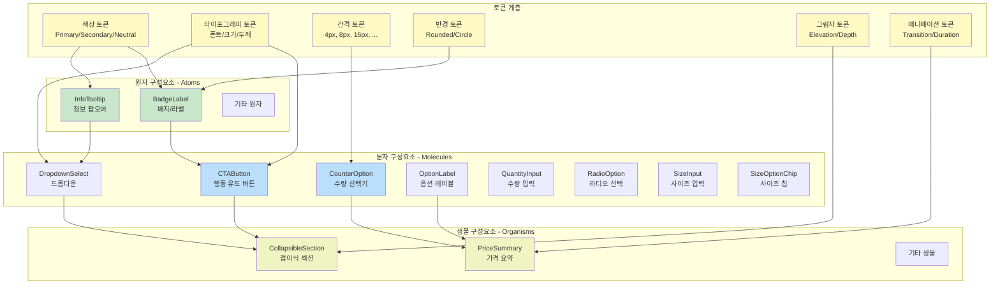

---

## 컴포넌트 아키텍처

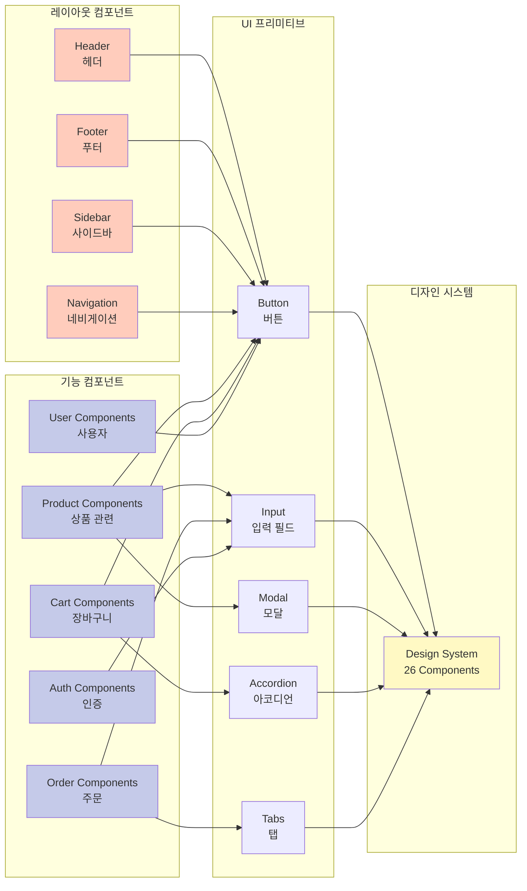

---

## 데이터 흐름

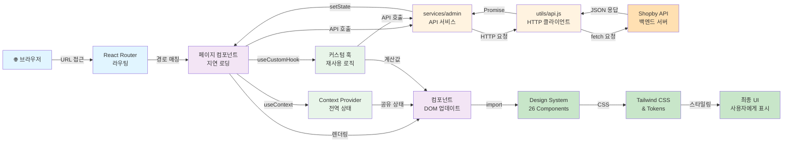

---

## 사용자 흐름

### 1. 고객 쇼핑 흐름

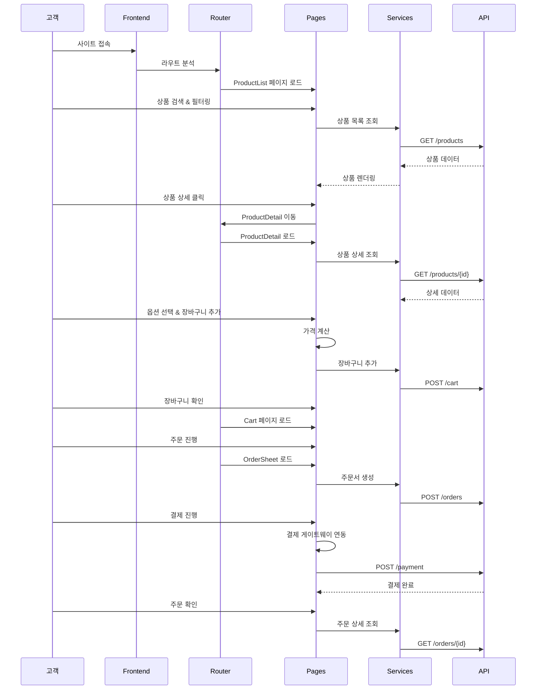

### 2. 인증 흐름

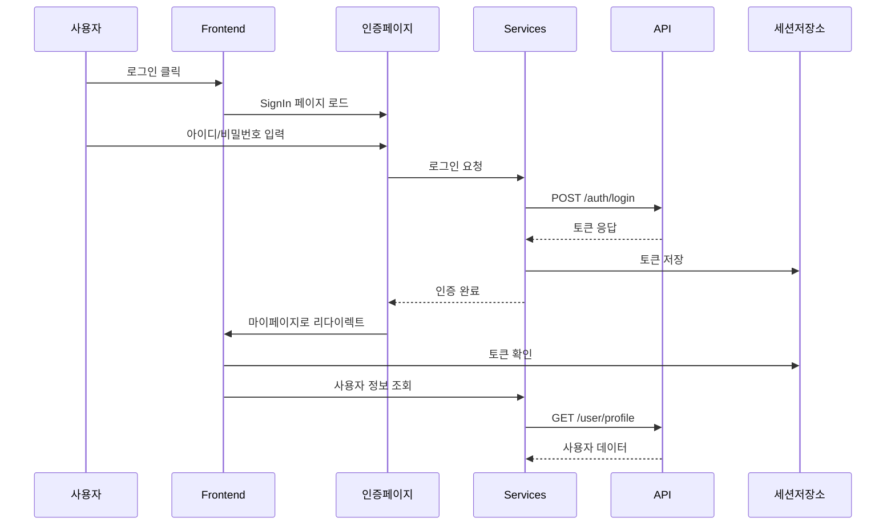

### 3. 관리자 작업 흐름

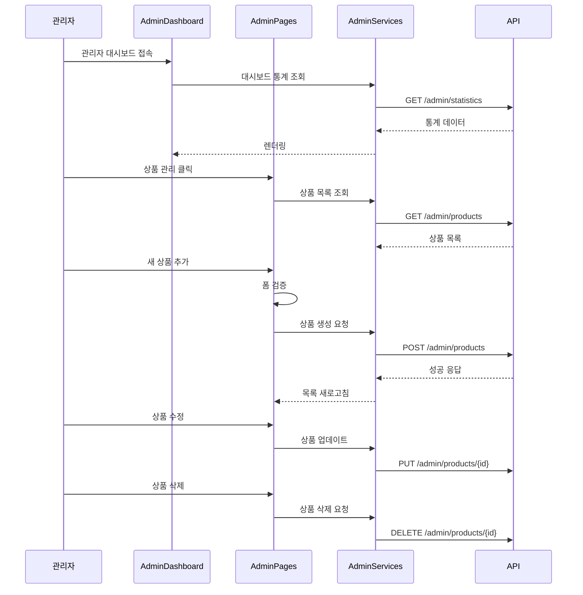

---

## API 통합 흐름

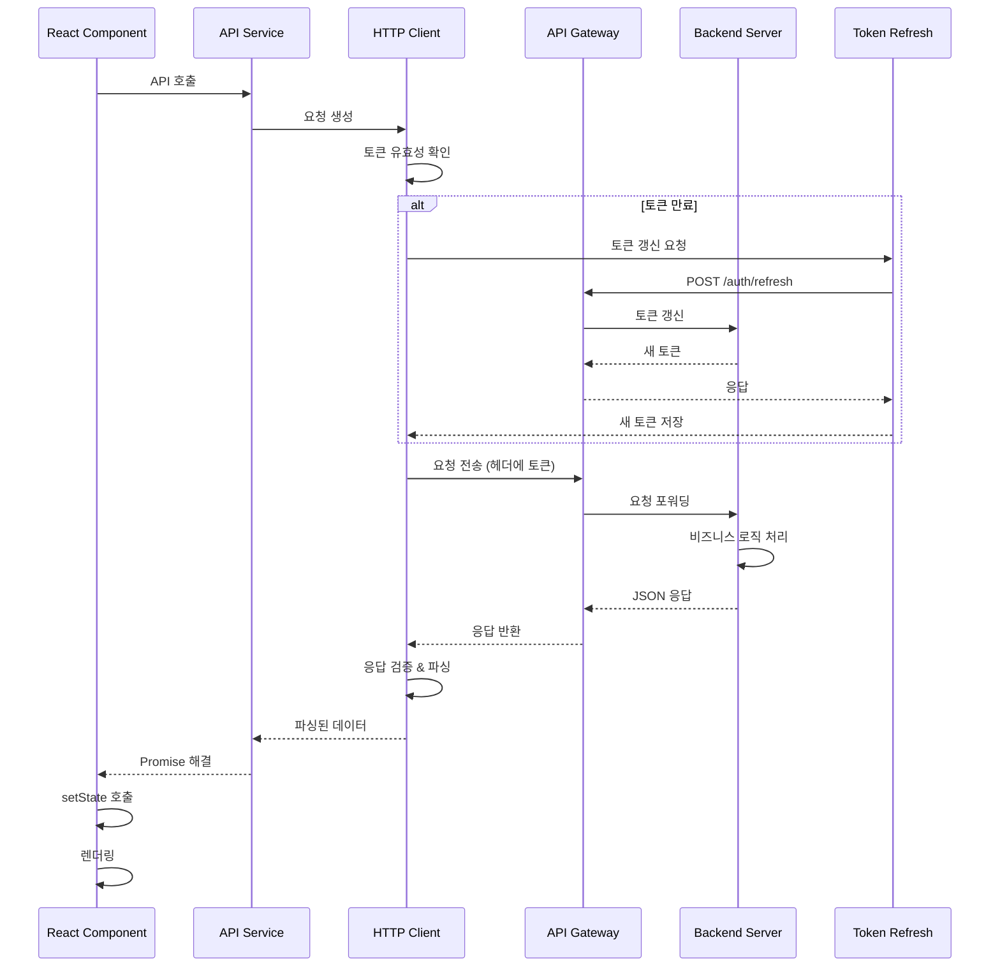

---

## 라우트 구조

```mermaid
graph TD
    Root["Root<br/>/"]

    Auth["인증<br/>/auth"]
    Auth1["로그인<br/>/auth/login"]
    Auth2["회원가입<br/>/auth/signup"]
    Auth3["아이디 찾기<br/>/auth/find-id"]
    Auth4["비밀번호 찾기<br/>/auth/find-password"]

    Shop["쇼핑<br/>/shop"]
    Shop1["상품 목록<br/>/shop/products"]
    Shop2["상품 상세<br/>/shop/products/:id"]
    Shop3["카테고리<br/>/shop/category/:id"]
    Shop4["검색<br/>/shop/search"]

    Cart["장바구니<br/>/cart"]
    Order["주문<br/>/order"]
    Order1["주문서<br/>/order/sheet"]
    Order2["주문 완료<br/>/order/complete"]
    Order3["주문 내역<br/>/order/history"]

    User["사용자<br/>/user"]
    User1["마이페이지<br/>/user/mypage"]
    User2["프로필<br/>/user/profile"]
    User3["주문 상세<br/>/user/orders/:id"]
    User4["배송 추적<br/>/user/shipping"]

    Admin["관리자<br/>/admin"]
    AdminDash["대시보드<br/>/admin/dashboard"]
    AdminProd["상품 관리<br/>/admin/products"]
    AdminProd1["상품 목록<br/>/admin/products"]
    AdminProd2["상품 추가<br/>/admin/products/new"]
    AdminProd3["상품 수정<br/>/admin/products/:id"]

    AdminOrder["주문 관리<br/>/admin/orders"]
    AdminMem["회원 관리<br/>/admin/members"]
    AdminCoup["쿠폰 관리<br/>/admin/coupons"]
    AdminBoard["게시판 관리<br/>/admin/board"]
    AdminStat["통계<br/>/admin/statistics"]

    Root --> Auth
    Root --> Shop
    Root --> Cart
    Root --> Order
    Root --> User
    Root --> Admin

    Auth --> Auth1
    Auth --> Auth2
    Auth --> Auth3
    Auth --> Auth4

    Shop --> Shop1
    Shop --> Shop2
    Shop --> Shop3
    Shop --> Shop4

    Order --> Order1
    Order --> Order2
    Order --> Order3

    User --> User1
    User --> User2
    User --> User3
    User --> User4

    Admin --> AdminDash
    Admin --> AdminProd
    Admin --> AdminOrder
    Admin --> AdminMem
    Admin --> AdminCoup
    Admin --> AdminBoard
    Admin --> AdminStat

    AdminProd --> AdminProd1
    AdminProd --> AdminProd2
    AdminProd --> AdminProd3

    style Root fill:#e1f5ff
    style Auth fill:#c8e6c9
    style Shop fill:#c8e6c9
    style Cart fill:#c8e6c9
    style Order fill:#c8e6c9
    style User fill:#c8e6c9
    style Admin fill:#ffccbc
    style AdminDash fill:#ffccbc
    style AdminProd fill:#ffccbc
    style AdminOrder fill:#ffccbc
```

---

## 상태 관리

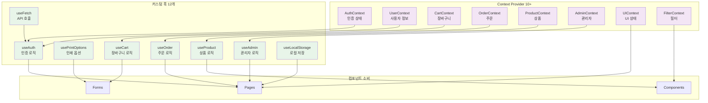

---

## 관리자 모듈

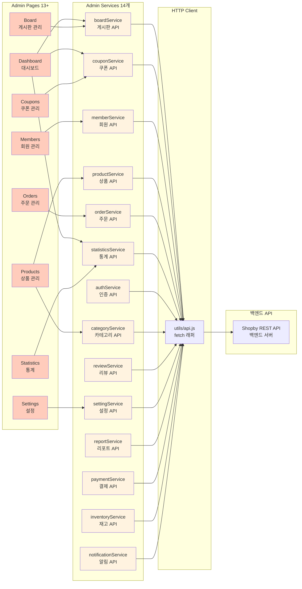

---

## SPEC 구현 현황

| SPEC ID | 제목 | 상태 | 변경일 | 비고 |
|---------|------|------|--------|------|
| SPEC-SKIN-001 | 인증 / 회원가입 디자인시스템 마이그레이션 | ✅ 완료 | 2026-01-22 | 로그인, 회원가입, 비밀번호 찾기 |
| SPEC-SKIN-002 | 마이페이지 디자인시스템 마이그레이션 | ✅ 완료 | 2026-01-22 | 프로필, 주문 내역, 배송 조회 |
| SPEC-SKIN-003 | 캐주얼 컴포넌트 마이그레이션 | ✅ 완료 | 2026-01-22 | 레이아웃, 네비게이션 |
| SPEC-SKIN-004 | Field/TextField/Dialog 컴포넌트 교체 | ✅ 완료 | 2026-01-22 | Huni DS 통합 |
| SPEC-SKIN-005 | 관리자 디자인시스템 마이그레이션 및 API 서비스 레이어 | ✅ 완료 | 2026-01-22 | 14개 API 서비스 |
| SPEC-SKIN-006 | 장바구니 / 주문서 페이지 | ✅ 완료 | 2026-01-22 | 가격 계산, 주문 처리 |
| SPEC-SKIN-007 | 상품 상세 페이지 | ✅ 완료 | 2026-01-22 | 옵션 선택, 미리보기 |
| SPEC-SKIN-008 | 관리자 거래처/원장/통계 기능 | ✅ 완료 | 2026-01-22 | 통계 대시보드 |
| SPEC-SKIN-009 | 인쇄 옵션 전환 (v1 → v2) | 🔄 진행중 | 2026-01-22 | usePrintOptionsV2 훅 |

---

## 인쇄 옵션 데이터 흐름

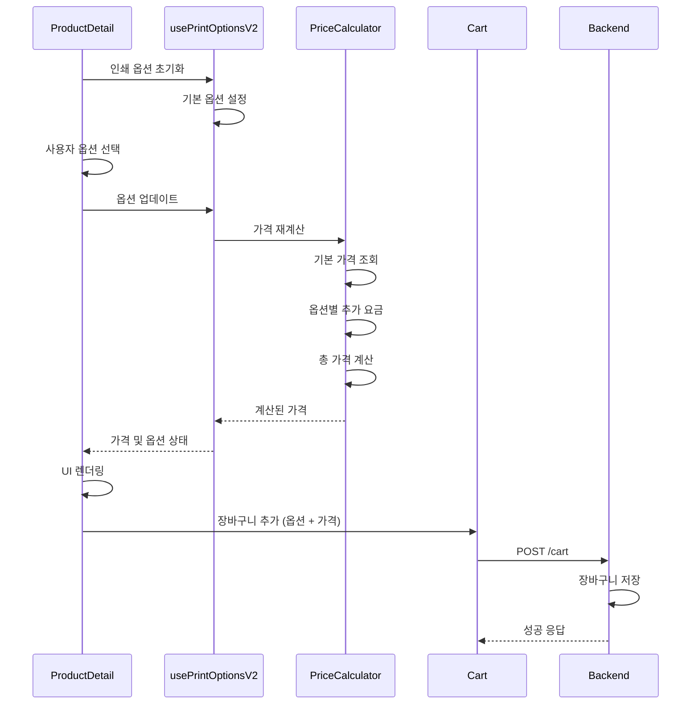

---

## 시작하기

### 필수 사항

- **Node.js**: 18.0.0 이상
- **npm** 또는 **yarn**: 최신 버전
- **Git**: 소스 코드 관리

### 설치

```bash
# 저장소 클론
git clone https://skins.shopby.co.kr/developers/aurora-skin.git
cd shopby.skin

# 의존성 설치
npm install
# 또는
yarn install

# 의존 패키지 설치
npm install @shopby/react-components @shopby/shared
```

### 개발 서버 실행

```bash
# 개발 모드로 시작
npm run dev
# 또는
yarn dev

# 브라우저에서 http://localhost:8080 접속
```

### 빌드

```bash
# 프로덕션 빌드
npm run build
# 또는
yarn build

# 빌드 산출물은 dist/ 디렉토리에 생성됨
```

### Storybook 실행

```bash
# Storybook 개발 서버 시작
npm run storybook
# 또는
yarn storybook

# 브라우저에서 http://localhost:6006 접속
```

### E2E 테스트 실행

```bash
# Playwright 테스트 실행
npm run test:e2e
# 또는
yarn test:e2e

# 관리자 모듈 분석
node scripts/admin-analyzer/index.js --all
node scripts/admin-analyzer/index.js --module board
```

### 유닛 테스트

```bash
# 테스트 실행
npm run test
# 또는
yarn test

# 테스트 커버리지 확인
npm run test:coverage
# 또는
yarn test:coverage
```

---

## 스크립트 참고

| 스크립트 | 설명 | 명령어 |
|---------|------|--------|
| **dev** | 개발 서버 시작 | `npm run dev` |
| **build** | 프로덕션 빌드 | `npm run build` |
| **build:dev** | 개발 빌드 | `npm run build:dev` |
| **build:beta** | 베타 빌드 | `npm run build:beta` |
| **start** | 개발 서버 (Webpack) | `npm run start` |
| **test** | 유닛 테스트 (Watch) | `npm run test:watch` |
| **test:coverage** | 테스트 커버리지 | `npm run test:coverage` |
| **storybook** | Storybook 개발 서버 | `npm run storybook` |
| **build-storybook** | Storybook 빌드 | `npm run build-storybook` |
| **chromatic** | Chromatic 배포 | `npm run chromatic` |
| **admin-analyzer** | 관리자 모듈 분석 | `node scripts/admin-analyzer/index.js --all` |

---

## 기여

이 프로젝트는 MoAI SPEC 기반 워크플로우를 따릅니다.

### 기여 프로세스

1. 새로운 기능이나 버그 수정을 위해 SPEC 문서를 작성하세요
2. SPEC은 `.moai/specs/SPEC-SKIN-XXX/spec.md` 형식으로 저장됩니다
3. SPEC을 기반으로 구현을 진행합니다
4. 구현 완료 후 문서를 동기화합니다

### SPEC 작성 가이드

```markdown
# SPEC-SKIN-XXX: 기능 제목

## 요구사항

## 기술 사항

## 구현 계획

## 테스트 계획

## 문서화
```

### 커밋 메시지 형식

```
feat(module): SPEC-SKIN-XXX 기능 구현

- 세부 사항 1
- 세부 사항 2

SPEC-SKIN-XXX #issue_number
```

---

## 코드 메트릭

| 메트릭 | 값 | 비고 |
|--------|-----|------|
| **전체 파일** | 826개 | 프로젝트 전체 |
| **디자인 시스템 컴포넌트** | 26개 | atoms + molecules + organisms |
| **기능 컴포넌트** | 93개 | pages + components + admin |
| **라우트** | 100개+ | 고객 + 관리자 페이지 |
| **API 서비스** | 14개 | 관리자 모듈 서비스 |
| **커스텀 훅** | 12개+ | 재사용 가능한 로직 |
| **유틸리티 함수** | 12개+ | 공통 기능 |
| **Context Provider** | 10개+ | 전역 상태 관리 |
| **테스트 커버리지** | 85%+ | 목표 기준 |

---

## 라이선스

MIT License - 자세한 내용은 [LICENSE](./LICENSE) 파일을 참고하세요.

---

## 지원

### 문제 보고

버그나 문제를 발견하면 GitHub Issues에 보고해주세요.

### 토론 및 질문

일반적인 질문이나 토론은 GitHub Discussions에서 진행됩니다.

---

## 변경 이력

### v1.16.5 (2026-01-22)

- SPEC-SKIN-008: 관리자 거래처/원장/통계 기능 구현
- SPEC-SKIN-009: 인쇄 옵션 전환 시작
- 종합 README 추가

### v1.16.4

- 관리자 모듈 리팩토링

### v1.16.3

- 상품 상세 페이지 완성

---

## 프로젝트 정보

- **개발 팀**: shopby Skin Development Team
- **저장소**: https://skins.shopby.co.kr/developers/aurora-skin.git
- **이슈 트래킹**: GitHub Issues
- **문서**: 본 README 및 Storybook

---

## 추가 리소스

- [Storybook 컴포넌트 카탈로그](http://localhost:6006)
- [Playwright E2E 테스트](./scripts/admin-analyzer/)
- [MoAI SPEC 시스템](./.moai/specs/)
- [프로젝트 코드 맵](./.moai/project/codemaps/)

---

**마지막 업데이트**: 2026-01-22 | **버전**: 1.16.5 | **유지보수**: shopby Development Team

