# Printly 인쇄 파일처리 자동화 시스템
## 개발 명세서 (Development Specification Document)

**프로젝트명:** Printly Print File Processing Automation  
**문서 버전:** v1.0  
**작성일:** 2026-03-03  
**기술 스택:** Next.js · React · TypeScript · NestJS · AWS S3/SQS · Neon PostgreSQL  
**배포 환경:** Vercel · Railway · Neon  

---

# 목차

1. 프로젝트 개요 및 배경
2. AS-IS 시스템 분석 (CRT DigitalEdit V2)
3. TO-BE 시스템 아키텍처
4. 기술 스택 상세 정의
5. 데이터 모델 설계 (ERD)
6. API 설계 (NestJS)
7. AWS 연동 설계 (S3 · SQS)
8. PDF 파일처리 파이프라인
9. User Flow 및 UI/UX 설계
10. 프론트엔드 화면 설계
11. 에러 처리 및 모니터링
12. 보안 설계
13. 배포 및 인프라
14. 개발 환경 세팅 가이드
15. 개발 범위 및 일정

---

# 1. 프로젝트 개요 및 배경

## 1.1 프로젝트 목적

기존 Windows 데스크톱 기반의 인쇄 파일처리 시스템(CRT DigitalEdit V2)을 웹 기반 SaaS로 전환하여, 고객이 업로드한 PDF 파일을 자동으로 검증·변환·최적화하는 클라우드 네이티브 파이프라인을 구축한다.

## 1.2 핵심 목표

| 구분 | 설명 |
|------|------|
| 클라우드 전환 | Windows 로컬 → AWS 클라우드 기반 처리 |
| 자동화 확대 | 수동 PitStop CLI 실행 → 이벤트 기반 자동 파이프라인 |
| 실시간 모니터링 | 콘솔 로그 → 웹 대시보드 실시간 상태 추적 |
| 확장성 확보 | 단일 서버 → 수평 스케일링 가능한 큐 기반 처리 |
| 접근성 개선 | 데스크톱 앱 → 브라우저 어디서든 접근 |

## 1.3 문서 범위

본 문서는 AS-IS 시스템(C#/.NET 기반 393개 소스 파일, 47개 프로젝트)의 분석 결과를 토대로, TO-BE 시스템의 전체 아키텍처, 데이터 모델, API, UI/UX, 배포 전략을 정의한다. 개발자가 이 문서만으로 환경 세팅부터 개발·배포까지 수행할 수 있도록 작성하였다.

---

# 2. AS-IS 시스템 분석 (CRT DigitalEdit V2)

## 2.1 시스템 구성 개요

기존 시스템은 C# .NET Framework 기반의 Windows 데스크톱 애플리케이션으로, 13개 프레임워크 프로젝트, 16개 클라이언트 모듈, 6개 서버 프로젝트로 구성되어 있다.

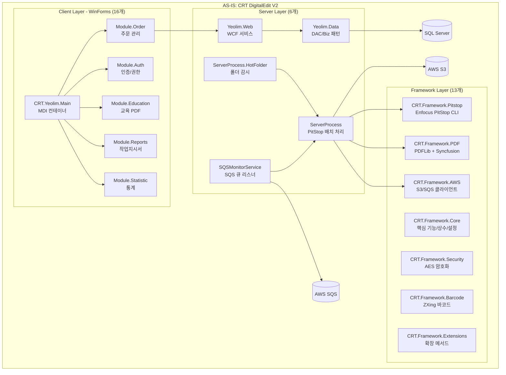

## 2.2 핵심 파일처리 파이프라인 (AS-IS)

기존 시스템의 PDF 파일처리는 3개의 독립 서버 프로세스를 통해 수행된다.

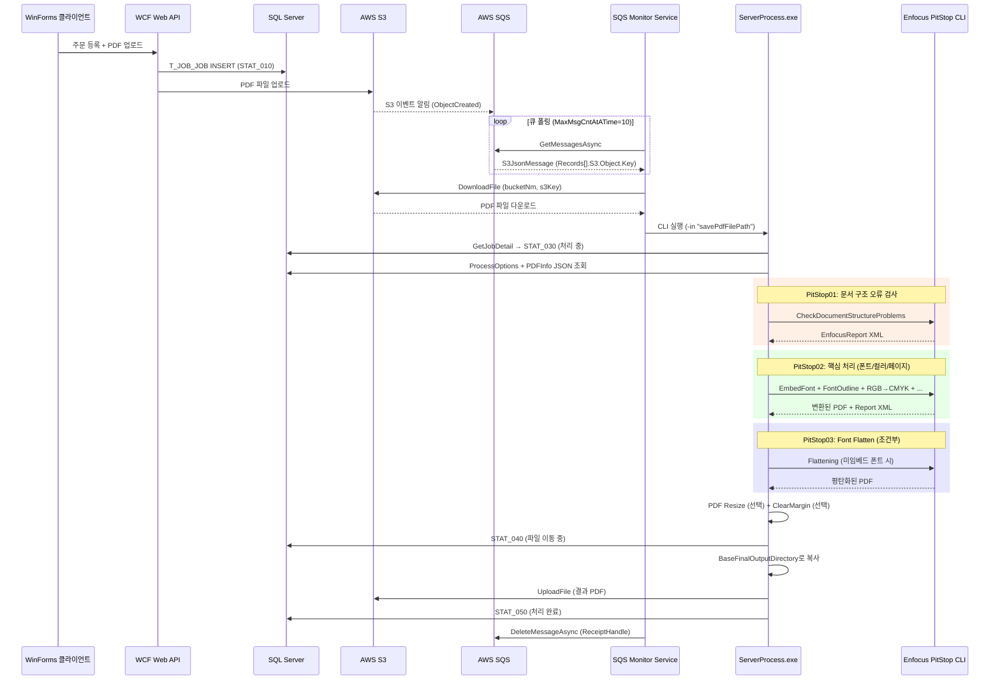

## 2.3 Job 상태 코드 체계 (AS-IS 분석)

소스 코드에서 추출한 상태 코드 체계는 다음과 같다.

| 상태 코드 | 의미 | 전이 조건 |
|-----------|------|-----------|
| STAT_010 | 주문 접수 (Job 등록) | 클라이언트에서 주문 생성 시 |
| STAT_020 | 파일 업로드 완료 | S3 업로드 성공 시 |
| STAT_030 | Job 처리 중 | ServerProcess 시작 시 |
| STAT_040 | 처리 완료 - 파일 이동 중 | PitStop 전 과정 완료 시 |
| STAT_050 | Job 처리 완료 | 최종 Output 이동 완료 |
| STAT_900 | Job 오류 | 어느 단계에서든 Exception 시 |

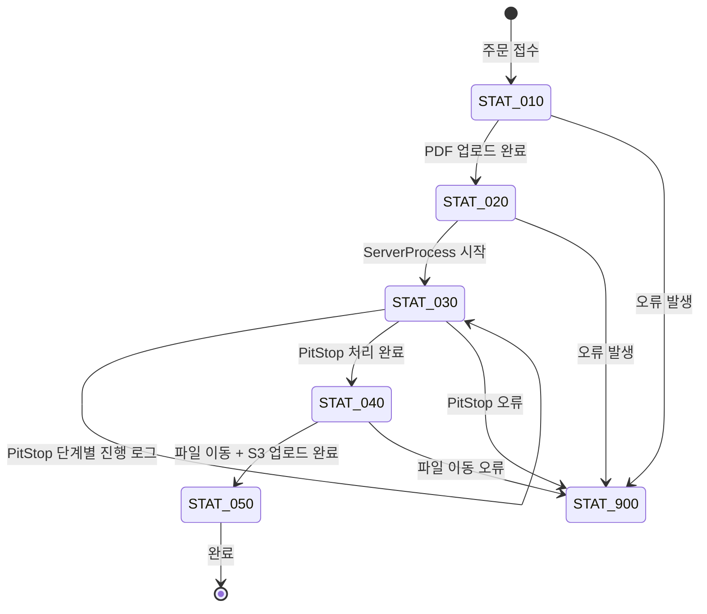

## 2.4 ProcessOptions 구조 분석

기존 시스템의 핵심 설정 객체인 ProcessOptions를 분석한 결과, PDF 처리에 필요한 모든 옵션이 JSON으로 직렬화되어 DB에 저장된다.

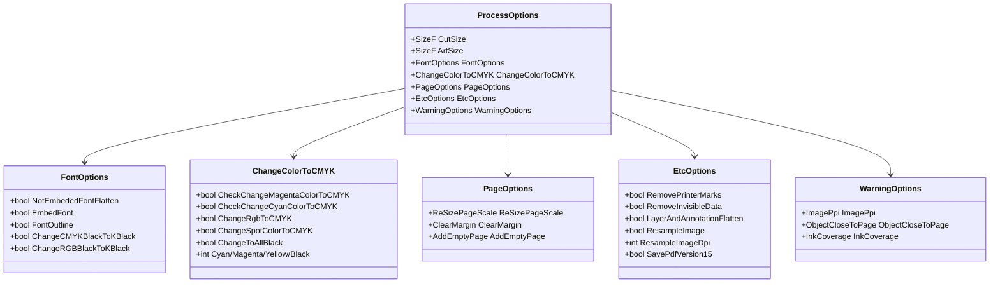

## 2.5 PDF 메타데이터 구조 (PDFInfo)

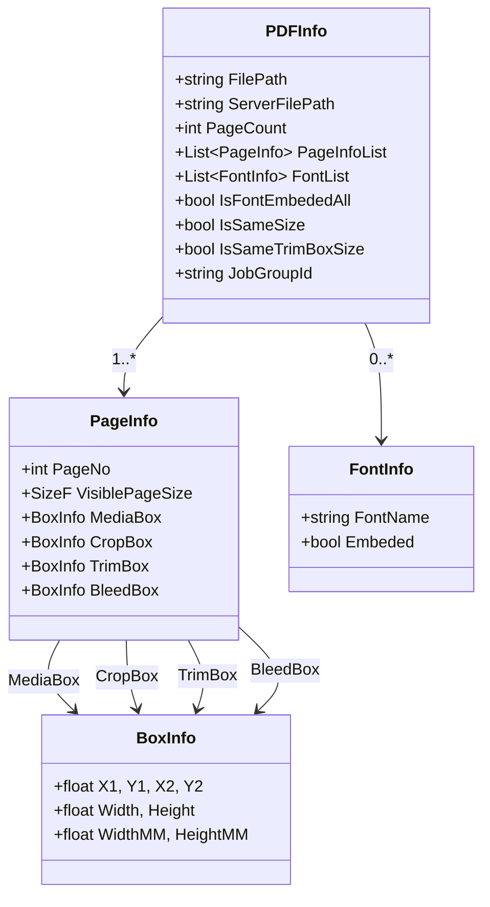

---

# 3. TO-BE 시스템 아키텍처

## 3.1 전체 시스템 아키텍처

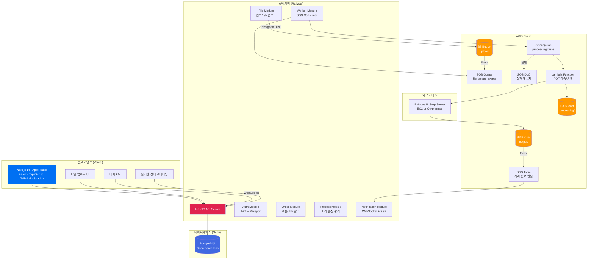

## 3.2 레이어드 아키텍처 상세

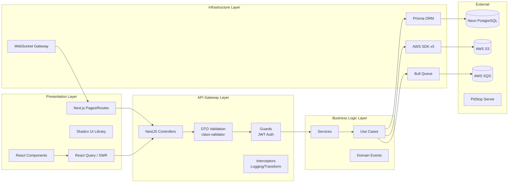

---

# 4. 기술 스택 상세 정의

## 4.1 프론트엔드

| 기술 | 버전 | 용도 |
|------|------|------|
| Next.js | 14+ (App Router) | SSR/SSG, 라우팅, 미들웨어 |
| React | 18+ | UI 컴포넌트 |
| TypeScript | 5.x | 타입 안전성 |
| Tailwind CSS | 3.x | 유틸리티 기반 스타일링 |
| Shadcn/ui | latest | 재사용 가능한 UI 컴포넌트 |
| React Query | 5.x | 서버 상태 관리 + 캐싱 |
| Zustand | 4.x | 클라이언트 상태 관리 |
| React Hook Form | 7.x | 폼 상태 관리 |
| Zod | 3.x | 런타임 스키마 검증 |
| Recharts | 2.x | 차트/통계 시각화 |

## 4.2 백엔드

| 기술 | 버전 | 용도 |
|------|------|------|
| NestJS | 10.x | API 프레임워크 |
| Prisma | 5.x | ORM + 마이그레이션 |
| @nestjs/bull | latest | 작업 큐 (Redis 기반) |
| @nestjs/websockets | latest | 실시간 통신 |
| @aws-sdk/client-s3 | 3.x | S3 파일 관리 |
| @aws-sdk/client-sqs | 3.x | SQS 메시지 관리 |
| class-validator | latest | DTO 유효성 검증 |
| Passport + JWT | latest | 인증 |
| pdf-lib | latest | 서버사이드 PDF 메타데이터 추출 |

## 4.3 인프라

| 서비스 | 용도 | 비고 |
|--------|------|------|
| Vercel | 프론트엔드 배포 | Next.js 최적화 |
| Railway | 백엔드 배포 | NestJS + Worker |
| Neon | PostgreSQL DB | Serverless, 브랜치 지원 |
| AWS S3 | 파일 저장소 | 업로드/처리/결과 3개 prefix |
| AWS SQS | 메시지 큐 | Standard + DLQ |
| AWS Lambda | PDF 처리 워커 | 선택적 (EC2 대체 가능) |
| Redis (Upstash) | 캐시 + Bull Queue | Railway 애드온 |

---

# 5. 데이터 모델 설계 (ERD)

## 5.1 전체 ERD

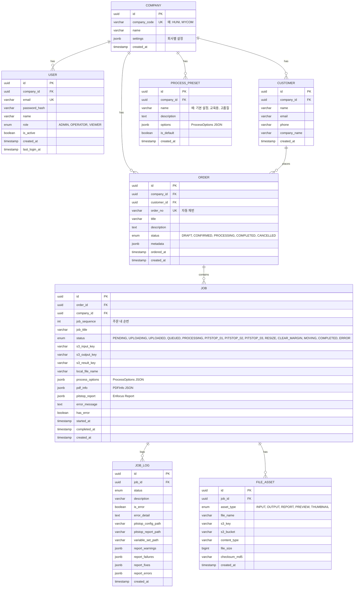

## 5.2 핵심 테이블 상세

### JOB 테이블 상태 머신

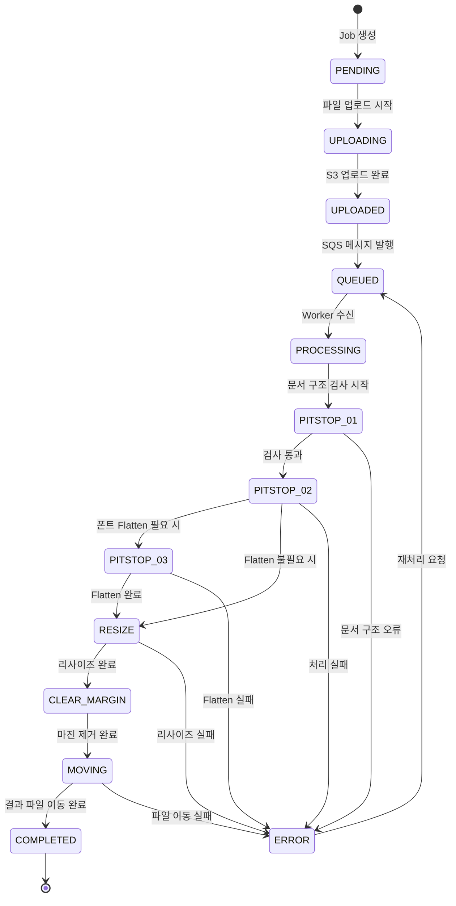

### ProcessOptions JSON 스키마

```json
{
  "cutSize": { "width": 210, "height": 297 },
  "artSize": { "width": 216, "height": 303 },
  "fontOptions": {
    "notEmbeddedFontFlatten": false,
    "embedFont": true,
    "fontOutline": false,
    "changeCMYKBlackToKBlack": true,
    "changeRGBBlackToKBlack": true
  },
  "colorOptions": {
    "changeRgbToCMYK": true,
    "changeSpotColorToCMYK": false,
    "changeToAllBlack": false,
    "targetCyan": 0,
    "targetMagenta": 0,
    "targetYellow": 0,
    "targetBlack": 0
  },
  "pageOptions": {
    "resizePageScale": { "enabled": false, "type": "ART" },
    "clearMargin": { "enabled": false, "left": 0, "top": 0, "right": 0, "bottom": 0 },
    "addEmptyPage": { "firstPage": false, "lastPage": false }
  },
  "etcOptions": {
    "removePrinterMarks": true,
    "removeInvisibleData": true,
    "layerAndAnnotationFlatten": true,
    "resampleImage": false,
    "resampleImageDpi": 300,
    "savePdfVersion15": true
  },
  "warningOptions": {
    "imagePpi": { "check": true, "ppi": 150 },
    "objectCloseToPage": { "check": true, "length": 3 },
    "inkCoverage": { "check": false, "value": 300, "ignoreAreaPt": 6 }
  }
}
```

---

# 6. API 설계 (NestJS)

## 6.1 API 모듈 구조

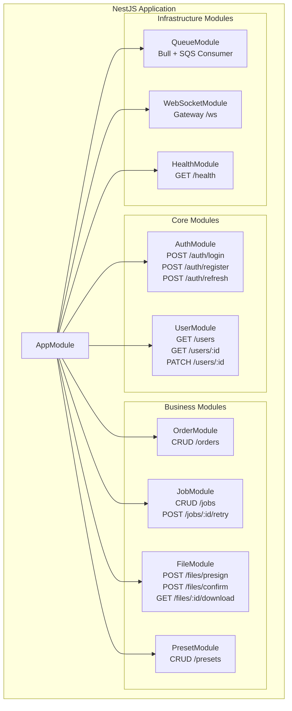

## 6.2 주요 API 엔드포인트

### 파일 업로드 플로우

| 단계 | Method | Endpoint | 설명 |
|------|--------|----------|------|
| 1 | POST | /api/files/presign | Presigned URL 발급 (S3 직접 업로드용) |
| 2 | PUT | (S3 Presigned URL) | 클라이언트 → S3 직접 업로드 |
| 3 | POST | /api/files/confirm | 업로드 완료 확인 + Job 생성 |
| 4 | GET | /api/jobs/:id/status | Job 상태 조회 (폴링 또는 SSE) |
| 5 | GET | /api/files/:id/download | 결과 파일 다운로드 |

### 주문 관리 API

| Method | Endpoint | 설명 |
|--------|----------|------|
| POST | /api/orders | 주문 생성 |
| GET | /api/orders | 주문 목록 (필터/페이지네이션) |
| GET | /api/orders/:id | 주문 상세 + Job 목록 |
| PATCH | /api/orders/:id | 주문 수정 |
| DELETE | /api/orders/:id | 주문 삭제 (소프트) |

### Job 관리 API

| Method | Endpoint | 설명 |
|--------|----------|------|
| POST | /api/jobs | Job 생성 (주문에 파일 추가) |
| GET | /api/jobs | Job 목록 (상태별 필터) |
| GET | /api/jobs/:id | Job 상세 + 로그 |
| POST | /api/jobs/:id/retry | 실패 Job 재처리 |
| POST | /api/jobs/:id/cancel | 처리 중단 |
| GET | /api/jobs/:id/report | PitStop 리포트 조회 |
| GET | /api/jobs/:id/preview | PDF 미리보기 이미지 |

## 6.3 Presigned URL 업로드 시퀀스

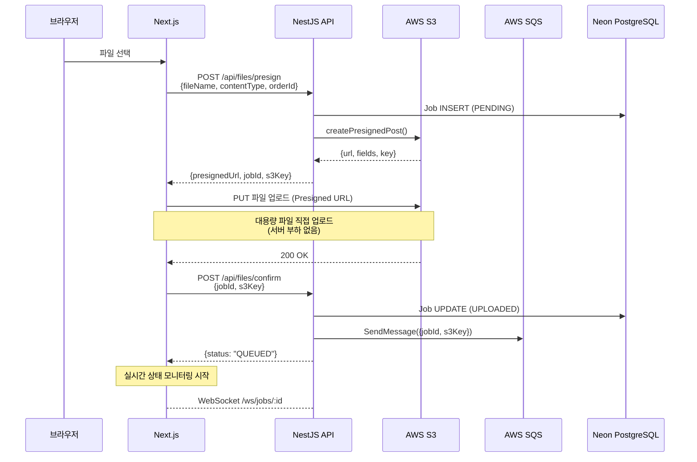

---

# 7. AWS 연동 설계 (S3 · SQS)

## 7.1 S3 버킷 구조

```
printly-files-{env}/
├── uploads/                          # 고객 원본 파일
│   └── {company_id}/
│       └── {YYYY-MM-DD}/
│           └── {job_id}_{filename}.pdf
│
├── processing/                       # 처리 중간 파일
│   └── {company_id}/
│       └── {YYYY-MM-DD}/
│           └── {job_id}/
│               ├── [step1]_output.pdf
│               ├── [step2]_output.pdf
│               ├── config.xml
│               ├── variable_set.evl
│               └── report.xml
│
├── output/                           # 최종 결과 파일
│   └── {company_id}/
│       └── {YYYY-MM-DD}/
│           └── {job_title}/
│               └── [{job_id}]_{filename}_완료.pdf
│
└── previews/                         # 미리보기 이미지
    └── {job_id}/
        ├── thumb_page1.jpg
        └── preview_page1.jpg
```

## 7.2 SQS 큐 설계

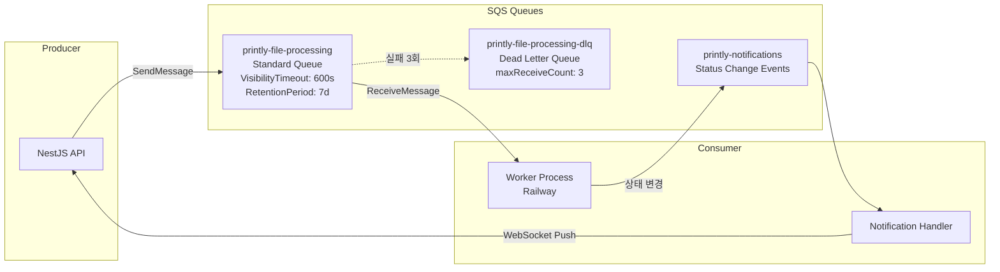

## 7.3 SQS 메시지 포맷

```json
{
  "messageType": "FILE_PROCESSING_REQUEST",
  "version": "1.0",
  "payload": {
    "jobId": "uuid",
    "companyId": "uuid",
    "s3Key": "uploads/company-id/2026-03-03/job-id_file.pdf",
    "s3Bucket": "printly-files-production",
    "processOptions": { "...ProcessOptions JSON..." },
    "pdfInfo": { "...PDFInfo JSON..." },
    "callbackUrl": "https://api.printly.io/api/jobs/{jobId}/callback",
    "priority": "NORMAL",
    "retryCount": 0
  },
  "metadata": {
    "timestamp": "2026-03-03T12:00:00Z",
    "source": "printly-api",
    "traceId": "uuid"
  }
}
```

---

# 8. PDF 파일처리 파이프라인

## 8.1 전체 처리 파이프라인

```mermaid
graph TB
    START([파일 업로드 완료]) --> VALIDATE

    subgraph "Step 1: 검증"
        VALIDATE[PDF 유효성 검증<br/>pdf-lib으로 메타데이터 추출]
        VALIDATE --> CHECK_PAGE[페이지 수/사이즈 확인]
        CHECK_PAGE --> CHECK_FONT[폰트 임베딩 확인]
        CHECK_FONT --> CHECK_COLOR[색상 공간 확인]
        CHECK_COLOR --> GEN_INFO[PDFInfo JSON 생성]
    end

    GEN_INFO --> QUEUE[SQS 큐에 발행]

    subgraph "Step 2: PitStop 01 - 문서 구조 검사"
        PS1[CheckDocumentStructureProblems]
        PS1 --> PS1_RPT{Report 확인}
        PS1_RPT -->|Failure/Error| ERR1[에러 처리<br/>STAT_900]
        PS1_RPT -->|Pass| PS2_START
    end

    subgraph "Step 3: PitStop 02 - 핵심 변환"
        PS2_START[Action List 동적 구성]
        PS2_START --> FONT[폰트 처리<br/>Embed + Outline + K-Black]
        FONT --> COLOR[색상 변환<br/>RGB→CMYK + Spot→CMYK]
        COLOR --> PAGE[페이지 처리<br/>빈 페이지 추가]
        PAGE --> ETC[기타 처리<br/>마크 제거 + 레이어 평탄화]
        ETC --> WARN[경고 검사<br/>DPI + 객체 근접 + 잉크 농도]
    end

    subgraph "Step 4: 조건부 처리"
        FLATTEN{폰트 미임베드?}
        FLATTEN -->|Yes| PS3[PitStop 03<br/>Font Flattening]
        FLATTEN -->|No| RESIZE_CHK
        PS3 --> RESIZE_CHK
        
        RESIZE_CHK{리사이즈 필요?}
        RESIZE_CHK -->|Yes| RESIZE[PDFLib Resize<br/>Art/Cut Size 기준]
        RESIZE_CHK -->|No| MARGIN_CHK
        RESIZE --> MARGIN_CHK
        
        MARGIN_CHK{마진 제거?}
        MARGIN_CHK -->|Yes| MARGIN[PDFLib ClearMargin<br/>L/T/R/B]
        MARGIN_CHK -->|No| OUTPUT
        MARGIN --> OUTPUT
    end

    subgraph "Step 5: 결과 처리"
        OUTPUT[최종 PDF 파일]
        OUTPUT --> LOCAL_COPY[로컬 Output 폴더 복사]
        LOCAL_COPY --> S3_UPLOAD[S3 Output 업로드]
        S3_UPLOAD --> DB_UPDATE[DB 상태 업데이트<br/>STAT_050]
        DB_UPDATE --> NOTIFY[WebSocket 완료 알림]
    end

    QUEUE --> PS1
    PS1_RPT -->|Pass| PS2_START
    WARN --> FLATTEN

    ERR1 --> NOTIFY_ERR[에러 알림]

    style START fill:#4caf50,color:#fff
    style ERR1 fill:#f44336,color:#fff
    style NOTIFY fill:#2196f3,color:#fff
```

## 8.2 PitStop Action 매핑 (AS-IS → TO-BE)

기존 EnumActionType 기반 Action을 새로운 시스템의 ProcessingStep으로 매핑한다.

| AS-IS EnumActionType | 카테고리 | TO-BE ProcessingStep | 조건 |
|---------------------|----------|---------------------|------|
| CheckDocumentStructureProblems | 검증 | VALIDATE_STRUCTURE | 항상 실행 |
| EmbedFont | 폰트 | EMBED_FONT | fontOptions.embedFont = true |
| FontOutline | 폰트 | FONT_OUTLINE | fontOptions.fontOutline = true |
| ChangeCMYKBlackToKBlack | 폰트 | CMYK_BLACK_TO_K | fontOptions.changeCMYKBlackToKBlack |
| ChangeRGBBlackToKBlack | 폰트 | RGB_BLACK_TO_K | fontOptions.changeRGBBlackToKBlack |
| AddBackground | 폰트 | ADD_BACKGROUND | 미임베드 + Flatten 체크 시 |
| ChangeRgbToCMYK | 색상 | RGB_TO_CMYK | colorOptions.changeRgbToCMYK |
| ChangeSpotColorToCMYK | 색상 | SPOT_TO_CMYK | colorOptions.changeSpotColorToCMYK |
| ChangeMagentaToCMYK | 색상 | MAGENTA_TO_CMYK | 마젠타 변환 체크 시 |
| ChangeCyanToCMYK | 색상 | CYAN_TO_CMYK | 시안 변환 체크 시 |
| ChangeAllBlack | 색상 | ALL_BLACK | colorOptions.changeToAllBlack |
| AddEmptyPageFirst/Last | 페이지 | ADD_EMPTY_PAGE | pageOptions.addEmptyPage |
| RemovePrinterMarks | 기타 | REMOVE_MARKS | TrimBox 존재 시 |
| RemoveInvisibleData | 기타 | REMOVE_INVISIBLE | etcOptions.removeInvisibleData |
| LayerAndAnnotationFlatten | 기타 | FLATTEN_LAYERS | etcOptions.layerAndAnnotationFlatten |
| ResampleImage | 기타 | RESAMPLE_IMAGE | etcOptions.resampleImage |
| SavePdfVersion15 | 기타 | SAVE_PDF_1_5 | etcOptions.savePdfVersion15 |
| CheckImageDPI | 경고 | CHECK_IMAGE_DPI | warningOptions.imagePpi.check |
| CheckObjectCloseToPage | 경고 | CHECK_OBJECT_PROXIMITY | warningOptions.objectCloseToPage.check |

---

# 9. User Flow 및 UI/UX 설계

## 9.1 전체 User Flow

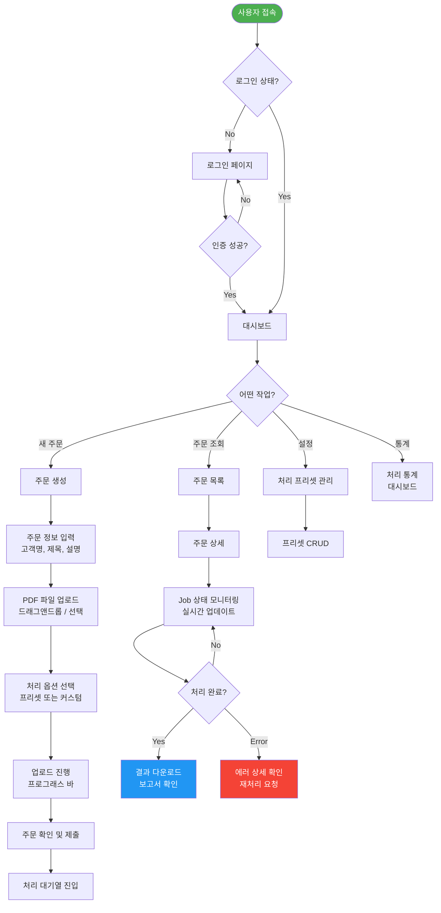

## 9.2 파일 업로드 상세 User Flow

```mermaid
flowchart TB
    A[파일 선택/드래그] --> B{파일 유효성?}
    B -->|PDF 아님| C[⚠️ "PDF 파일만 업로드 가능합니다"]
    B -->|100MB 초과| D[⚠️ "파일 크기 제한: 100MB"]
    B -->|유효| E[파일 정보 표시<br/>이름, 크기, 페이지 수]
    
    E --> F[처리 옵션 패널]
    F --> G{프리셋 사용?}
    G -->|Yes| H[프리셋 선택<br/>드롭다운]
    G -->|No| I[커스텀 옵션<br/>아코디언 폼]
    
    I --> I1[폰트 옵션]
    I --> I2[색상 옵션]
    I --> I3[페이지 옵션]
    I --> I4[기타 옵션]
    I --> I5[경고 옵션]
    
    H --> J[업로드 시작 버튼]
    I1 & I2 & I3 & I4 & I5 --> J
    
    J --> K[Presigned URL 요청]
    K --> L[S3 직접 업로드<br/>프로그래스 바 표시]
    L --> M[업로드 완료 확인]
    M --> N[✅ "업로드 완료! 처리가 시작됩니다"]
    N --> O[Job 상태 카드 표시<br/>실시간 업데이트 시작]
```

## 9.3 실시간 상태 모니터링 Flow

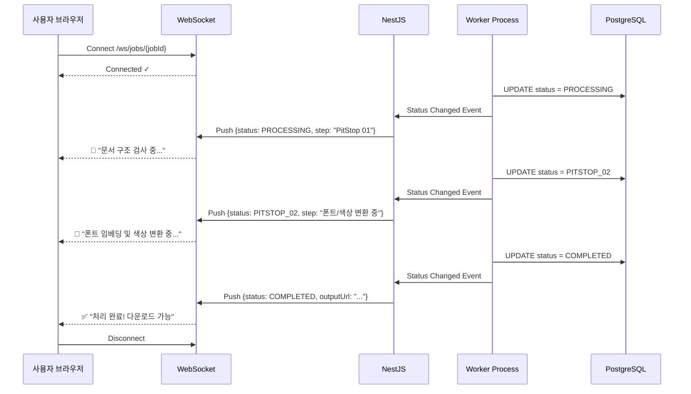

---

# 10. 프론트엔드 화면 설계

## 10.1 화면 구성도 (Sitemap)

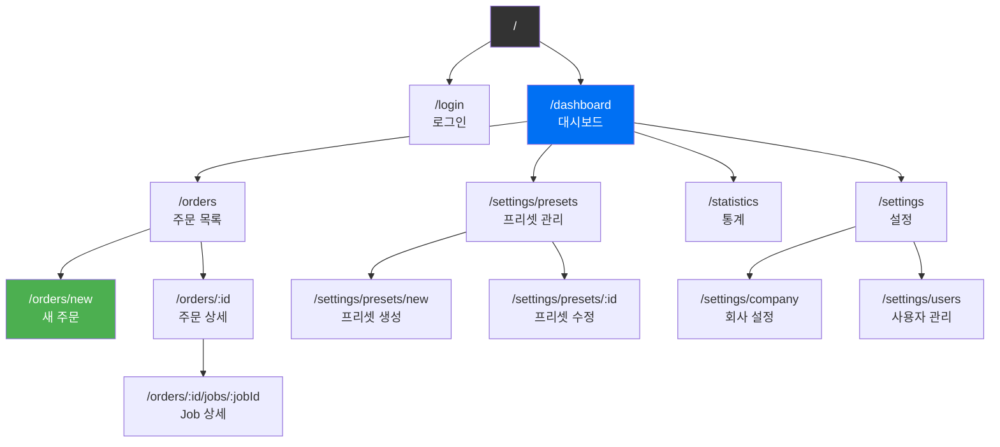

## 10.2 주요 화면 와이어프레임 설명

### 대시보드 (Dashboard)

```
┌─────────────────────────────────────────────────────────┐
│  🏠 Printly     📦 주문    ⚙️ 설정    📊 통계    👤     │
├─────────────────────────────────────────────────────────┤
│                                                         │
│  오늘의 현황                                             │
│  ┌──────────┐ ┌──────────┐ ┌──────────┐ ┌──────────┐    │
│  │ 대기 중   │ │ 처리 중   │ │ 완료      │ │ 오류      │    │
│  │   12     │ │    5     │ │   83     │ │    2     │    │
│  └──────────┘ └──────────┘ └──────────┘ └──────────┘    │
│                                                         │
│  실시간 처리 현황                                         │
│  ┌─────────────────────────────────────────────────┐    │
│  │ Job #1234  명함_앞면.pdf      ████████░░ 80%     │    │
│  │ Job #1235  전단지_A4.pdf      ██████░░░░ 60%     │    │
│  │ Job #1236  카탈로그.pdf       ███░░░░░░░ 30%     │    │
│  └─────────────────────────────────────────────────┘    │
│                                                         │
│  최근 주문                          처리량 추이 (7일)     │
│  ┌──────────────────────┐   ┌────────────────────────┐  │
│  │ #ORD-2026-0301  처리중│   │     📈 Recharts       │  │
│  │ #ORD-2026-0300  완료  │   │     Line/Bar Chart    │  │
│  │ #ORD-2026-0299  완료  │   │                        │  │
│  └──────────────────────┘   └────────────────────────┘  │
└─────────────────────────────────────────────────────────┘
```

### 새 주문 생성 (New Order)

```
┌─────────────────────────────────────────────────────────┐
│  ← 주문 목록    새 주문 생성                              │
├─────────────────────────────────────────────────────────┤
│                                                         │
│  Step 1: 주문 정보                                       │
│  ┌─────────────────────────────────────────────────┐    │
│  │ 고객명*    [________________▼]  (기존 고객 검색)   │    │
│  │ 주문명*    [________________________]             │    │
│  │ 설명       [________________________]             │    │
│  └─────────────────────────────────────────────────┘    │
│                                                         │
│  Step 2: 파일 업로드                                     │
│  ┌─────────────────────────────────────────────────┐    │
│  │                                                   │    │
│  │     ┌────────────────────────────────┐            │    │
│  │     │   📄  여기에 PDF를 끌어놓거나     │            │    │
│  │     │       클릭하여 선택하세요         │            │    │
│  │     │   (최대 100MB, PDF만 가능)       │            │    │
│  │     └────────────────────────────────┘            │    │
│  │                                                   │    │
│  │  업로드된 파일:                                      │    │
│  │  ✅ 명함_앞면.pdf (2.3MB, 1p)    [🗑️]             │    │
│  │  ✅ 명함_뒷면.pdf (1.8MB, 1p)    [🗑️]             │    │
│  │  ⏳ 전단지.pdf     ████░░ 40%                     │    │
│  └─────────────────────────────────────────────────┘    │
│                                                         │
│  Step 3: 처리 옵션                                       │
│  ┌─────────────────────────────────────────────────┐    │
│  │ 프리셋: [기본 설정 ▼]  또는  [커스텀 설정 열기 ▶]   │    │
│  │                                                   │    │
│  │ ▼ 폰트 옵션                                       │    │
│  │   ☑ 폰트 임베딩    ☐ 폰트 아웃라인                 │    │
│  │   ☑ CMYK Black → K  ☑ RGB Black → K              │    │
│  │                                                   │    │
│  │ ▶ 색상 옵션  ▶ 페이지 옵션  ▶ 기타 옵션             │    │
│  └─────────────────────────────────────────────────┘    │
│                                                         │
│                              [취소]  [💾 주문 제출]       │
└─────────────────────────────────────────────────────────┘
```

### Job 상세 화면

```
┌─────────────────────────────────────────────────────────┐
│  ← 주문 #ORD-2026-0301    Job 상세                      │
├─────────────────────────────────────────────────────────┤
│                                                         │
│  명함_앞면.pdf                                           │
│  ┌────────────┐  상태: ✅ 처리 완료                      │
│  │            │  페이지: 1p (90×50mm)                    │
│  │  PDF 미리   │  폰트: 3개 (전체 임베딩됨)                │
│  │  보기 영역   │  소요시간: 12.3초                        │
│  │            │                                         │
│  └────────────┘  [📥 결과 다운로드]  [🔄 재처리]          │
│                                                         │
│  처리 타임라인                                            │
│  ┌─────────────────────────────────────────────────┐    │
│  │ ●─ 14:30:01  UPLOADED      파일 업로드 완료        │    │
│  │ ●─ 14:30:02  QUEUED        처리 대기열 진입        │    │
│  │ ●─ 14:30:05  PITSTOP_01    문서 구조 검사 통과     │    │
│  │ ●─ 14:30:08  PITSTOP_02    폰트/색상 변환 완료     │    │
│  │    Warnings: 이미지 해상도 150dpi 미만 (2건)        │    │
│  │ ●─ 14:30:12  COMPLETED     처리 완료 ✅            │    │
│  └─────────────────────────────────────────────────┘    │
│                                                         │
│  PitStop 리포트                                          │
│  ┌─────────────────────────────────────────────────┐    │
│  │ ⚠️ Warnings (2)                                   │    │
│  │   - 페이지 1: 이미지 해상도 120dpi (권장 150dpi)    │    │
│  │   - 페이지 1: 객체가 재단선에서 2mm 이내            │    │
│  │ ✅ Fixes (5)                                      │    │
│  │   - RGB → CMYK 변환: 3건                          │    │
│  │   - 폰트 임베딩: 2건                               │    │
│  └─────────────────────────────────────────────────┘    │
└─────────────────────────────────────────────────────────┘
```

---

# 11. 에러 처리 및 모니터링

## 11.1 에러 처리 전략

```mermaid
flowchart TB
    ERR([에러 발생]) --> TYPE{에러 유형?}
    
    TYPE -->|파일 유효성| V[검증 에러]
    V --> V1[사용자에게 즉시 알림<br/>"유효하지 않은 PDF입니다"]
    V1 --> V2[Job 상태: ERROR<br/>재업로드 안내]
    
    TYPE -->|PitStop 처리| P[처리 에러]
    P --> P1{Failure?}
    P1 -->|Document Structure| P2[문서 구조 오류<br/>재처리 불가 → 수정 필요]
    P1 -->|Font/Color| P3[변환 오류<br/>자동 재시도 1회]
    P3 --> P4{재시도 성공?}
    P4 -->|No| P5[DLQ 이동<br/>관리자 알림]
    P4 -->|Yes| P6[정상 완료]
    
    TYPE -->|인프라| I[시스템 에러]
    I --> I1[S3/SQS 연결 실패]
    I1 --> I2[지수 백오프 재시도<br/>최대 3회]
    I2 --> I3{복구?}
    I3 -->|No| I4[Circuit Breaker<br/>관리자 알림]
    I3 -->|Yes| I5[정상 복구]
    
    TYPE -->|타임아웃| T[타임아웃]
    T --> T1[ExecuteTimeoutSec: 600<br/>SQS VisibilityTimeout: 900]
    T1 --> T2[메시지 자동 재처리<br/>maxReceiveCount: 3]

    style ERR fill:#f44336,color:#fff
    style P6 fill:#4caf50,color:#fff
    style I5 fill:#4caf50,color:#fff
```

## 11.2 모니터링 대시보드 지표

| 지표 | 측정 방법 | 알림 임계값 |
|------|-----------|------------|
| 처리 대기 Job 수 | SQS ApproximateNumberOfMessages | > 50 |
| DLQ 메시지 수 | SQS DLQ 모니터링 | > 0 |
| 평균 처리 시간 | Job started_at ~ completed_at | > 120초 |
| 에러율 | ERROR / 전체 Job | > 5% |
| S3 스토리지 사용량 | CloudWatch | > 80% 알림 |
| API 응답 시간 | p99 latency | > 2초 |
| WebSocket 연결 수 | 동시 접속 | > 500 |

---

# 12. 보안 설계

## 12.1 인증/인가 Flow

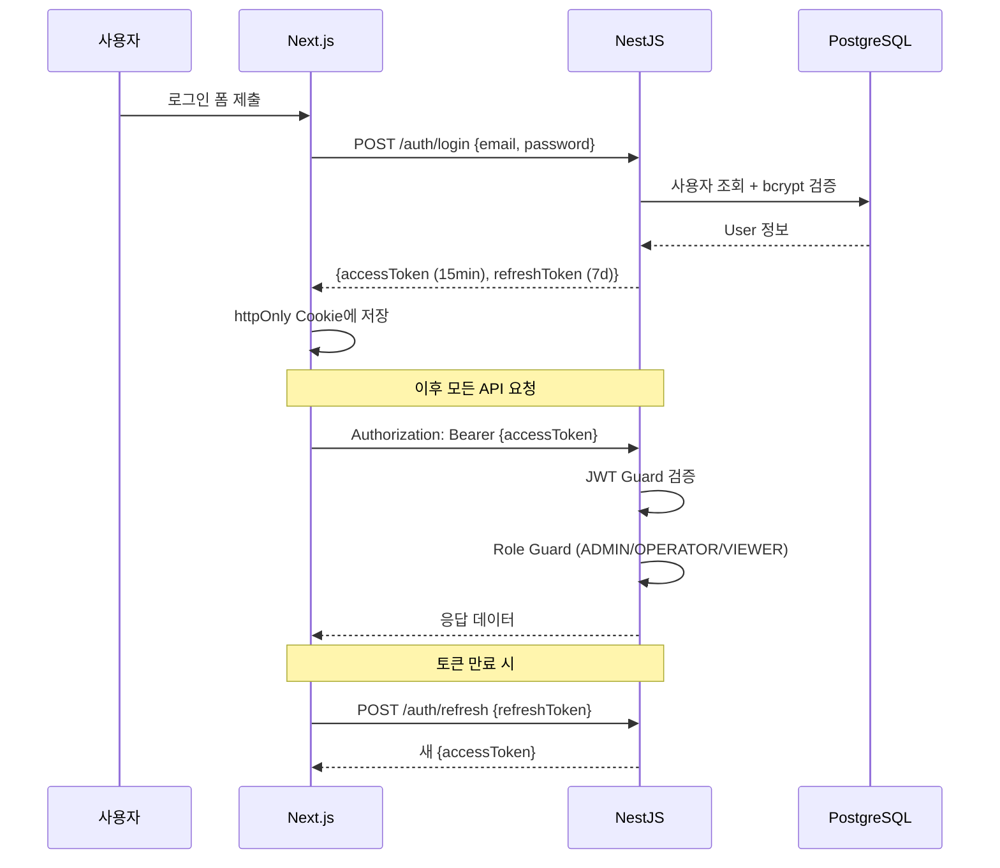

## 12.2 S3 보안 정책

| 항목 | 설정 |
|------|------|
| 버킷 접근 | Private (Public Access Block 활성화) |
| 업로드 | Presigned URL (5분 만료) |
| 다운로드 | Presigned URL (1시간 만료) |
| 암호화 | SSE-S3 (AES-256) |
| 버전 관리 | 활성화 (실수 복구용) |
| 수명 주기 | processing/ 30일 후 삭제, output/ 90일 후 Glacier |

---

# 13. 배포 및 인프라

## 13.1 배포 아키텍처

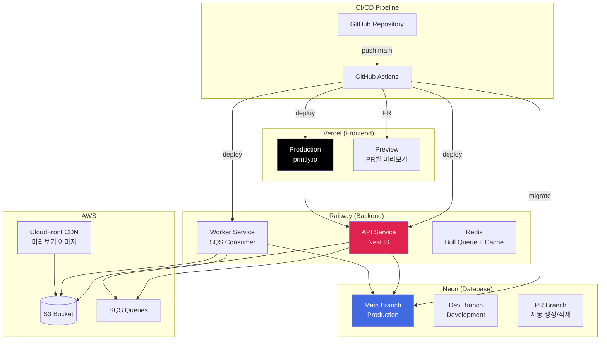

## 13.2 환경별 설정

| 환경 | Frontend | Backend | Database | AWS |
|------|----------|---------|----------|-----|
| Local | localhost:3000 | localhost:4000 | Neon Dev Branch | LocalStack |
| Preview | xxx.vercel.app | Railway Preview | Neon PR Branch | Dev S3/SQS |
| Production | printly.io | api.printly.io | Neon Main | Prod S3/SQS |

## 13.3 환경변수

```
# Frontend (.env.local)
NEXT_PUBLIC_API_URL=http://localhost:4000
NEXT_PUBLIC_WS_URL=ws://localhost:4000

# Backend (.env)
DATABASE_URL=postgresql://...@ep-xxx.ap-northeast-1.aws.neon.tech/printly
JWT_SECRET=your-secret-key
JWT_REFRESH_SECRET=your-refresh-secret

AWS_REGION=ap-northeast-2
AWS_ACCESS_KEY_ID=AKIA...
AWS_SECRET_ACCESS_KEY=...
S3_BUCKET_NAME=printly-files-dev
SQS_QUEUE_URL=https://sqs.ap-northeast-2.amazonaws.com/.../printly-file-processing
SQS_DLQ_URL=https://sqs.ap-northeast-2.amazonaws.com/.../printly-file-processing-dlq

REDIS_URL=redis://...
```

---

# 14. 개발 환경 세팅 가이드

## 14.1 필수 도구

| 도구 | 버전 | 설치 |
|------|------|------|
| Node.js | 20 LTS | fnm 또는 nvm |
| pnpm | 8+ | npm install -g pnpm |
| Docker | 24+ | Docker Desktop |
| AWS CLI | 2.x | brew install awscli |
| Git | 2.40+ | 기본 설치 |

## 14.2 프로젝트 구조 (Monorepo)

```
printly/
├── apps/
│   ├── web/                    # Next.js 프론트엔드
│   │   ├── app/                # App Router
│   │   │   ├── (auth)/         # 인증 레이아웃 그룹
│   │   │   │   └── login/
│   │   │   ├── (dashboard)/    # 대시보드 레이아웃 그룹
│   │   │   │   ├── orders/
│   │   │   │   ├── statistics/
│   │   │   │   └── settings/
│   │   │   ├── layout.tsx
│   │   │   └── page.tsx
│   │   ├── components/
│   │   │   ├── ui/             # Shadcn 컴포넌트
│   │   │   ├── orders/         # 주문 관련 컴포넌트
│   │   │   ├── jobs/           # Job 관련 컴포넌트
│   │   │   └── common/         # 공통 컴포넌트
│   │   ├── hooks/              # 커스텀 훅
│   │   ├── lib/                # 유틸리티
│   │   └── types/              # TypeScript 타입
│   │
│   └── api/                    # NestJS 백엔드
│       ├── src/
│       │   ├── auth/           # 인증 모듈
│       │   ├── orders/         # 주문 모듈
│       │   ├── jobs/           # Job 모듈
│       │   ├── files/          # 파일 모듈
│       │   ├── presets/        # 프리셋 모듈
│       │   ├── workers/        # SQS Worker 모듈
│       │   ├── notifications/  # WebSocket 모듈
│       │   ├── common/         # 공통 (Guards, Pipes, Filters)
│       │   ├── prisma/         # Prisma 모듈
│       │   └── main.ts
│       └── prisma/
│           ├── schema.prisma
│           └── migrations/
│
├── packages/
│   ├── shared/                 # 공유 타입/유틸
│   │   ├── types/              # 공유 TypeScript 타입
│   │   ├── constants/          # 공유 상수
│   │   └── validators/         # Zod 스키마
│   └── config/                 # 공유 설정
│       ├── eslint/
│       ├── tsconfig/
│       └── tailwind/
│
├── docker-compose.yml          # 로컬 개발 환경
├── pnpm-workspace.yaml
├── turbo.json                  # Turborepo 설정
└── README.md
```

## 14.3 초기 세팅 명령어

```bash
# 1. 저장소 클론
git clone https://github.com/printly/printly.git
cd printly

# 2. 의존성 설치
pnpm install

# 3. 환경변수 설정
cp apps/web/.env.example apps/web/.env.local
cp apps/api/.env.example apps/api/.env

# 4. 로컬 인프라 시작 (Redis, LocalStack)
docker-compose up -d

# 5. DB 마이그레이션
cd apps/api
pnpm prisma migrate dev

# 6. 시드 데이터
pnpm prisma db seed

# 7. 개발 서버 시작 (Turborepo)
cd ../..
pnpm dev
```

## 14.4 docker-compose.yml

```yaml
version: '3.8'
services:
  redis:
    image: redis:7-alpine
    ports:
      - '6379:6379'

  localstack:
    image: localstack/localstack:latest
    ports:
      - '4566:4566'
    environment:
      - SERVICES=s3,sqs
      - DEFAULT_REGION=ap-northeast-2
    volumes:
      - ./scripts/localstack-init.sh:/etc/localstack/init/ready.d/init.sh
```

---

# 15. 개발 범위 및 일정

## 15.1 개발 단계 (Phase)

```mermaid
gantt
    title Printly 파일처리 시스템 개발 일정
    dateFormat  YYYY-MM-DD
    
    section Phase 1: 기반 구축 (4주)
    프로젝트 세팅 + Monorepo       :p1_1, 2026-03-10, 5d
    DB 스키마 + Prisma 마이그레이션  :p1_2, after p1_1, 3d
    NestJS 기본 모듈 (Auth/User)    :p1_3, after p1_2, 5d
    Next.js 레이아웃 + 로그인       :p1_4, after p1_2, 5d
    AWS S3/SQS 연동 모듈           :p1_5, after p1_3, 4d
    
    section Phase 2: 핵심 기능 (6주)
    주문 CRUD (API + UI)           :p2_1, after p1_5, 7d
    파일 업로드 (Presigned URL)     :p2_2, after p2_1, 5d
    SQS Worker + 처리 파이프라인    :p2_3, after p2_2, 10d
    PitStop 연동 (Action 매핑)     :p2_4, after p2_3, 7d
    결과 처리 + S3 업로드           :p2_5, after p2_4, 5d
    
    section Phase 3: 실시간 + UX (3주)
    WebSocket 실시간 상태           :p3_1, after p2_5, 5d
    대시보드 + 통계                 :p3_2, after p3_1, 5d
    PitStop 리포트 뷰어             :p3_3, after p3_2, 5d
    처리 프리셋 관리                :p3_4, after p3_2, 3d
    
    section Phase 4: 안정화 (3주)
    에러 처리 + DLQ                 :p4_1, after p3_3, 5d
    성능 최적화 + 캐싱              :p4_2, after p4_1, 5d
    E2E 테스트 + QA                :p4_3, after p4_2, 5d
    배포 파이프라인 + 문서화         :p4_4, after p4_3, 5d
```

## 15.2 Phase별 세부 산출물

### Phase 1: 기반 구축 (4주)

| 태스크 | 산출물 | 담당 |
|--------|--------|------|
| Monorepo 세팅 | pnpm + Turborepo 구성 완료 | Full-stack |
| DB 설계 | Prisma schema + 초기 마이그레이션 | Backend |
| 인증 모듈 | JWT 로그인/회원가입/토큰 갱신 | Backend |
| 레이아웃 | Sidebar + Header + 라우팅 구조 | Frontend |
| AWS 모듈 | S3Client + SQSClient NestJS 서비스 | Backend |

### Phase 2: 핵심 기능 (6주)

| 태스크 | 산출물 | 담당 |
|--------|--------|------|
| 주문 관리 | Order CRUD API + UI (목록/상세/생성) | Full-stack |
| 파일 업로드 | Presigned URL + 드래그앤드롭 UI | Full-stack |
| SQS Worker | BullMQ + SQS Consumer 서비스 | Backend |
| PitStop 연동 | ProcessOptions → PitStop Action 변환 | Backend |
| 결과 처리 | 결과 파일 S3 업로드 + DB 업데이트 | Backend |

### Phase 3: 실시간 + UX (3주)

| 태스크 | 산출물 | 담당 |
|--------|--------|------|
| WebSocket | 실시간 Job 상태 업데이트 | Full-stack |
| 대시보드 | 통계 차트 + 실시간 처리 현황 | Frontend |
| 리포트 뷰어 | PitStop Report XML 파싱 + 표시 | Full-stack |
| 프리셋 관리 | 처리 옵션 프리셋 CRUD | Full-stack |

### Phase 4: 안정화 (3주)

| 태스크 | 산출물 | 담당 |
|--------|--------|------|
| 에러 처리 | DLQ 모니터링 + 재시도 로직 | Backend |
| 성능 최적화 | Redis 캐싱 + 쿼리 최적화 | Full-stack |
| E2E 테스트 | Playwright + Jest 테스트 스위트 | QA |
| CI/CD | GitHub Actions + 배포 파이프라인 | DevOps |

## 15.3 우선순위 매트릭스

```mermaid
quadrantChart
    title 기능 우선순위 매트릭스
    x-axis "낮은 임팩트" --> "높은 임팩트"
    y-axis "낮은 긴급도" --> "높은 긴급도"
    quadrant-1 즉시 개발
    quadrant-2 계획 개발
    quadrant-3 검토 후 결정
    quadrant-4 후순위
    "파일 업로드": [0.9, 0.95]
    "PitStop 연동": [0.85, 0.9]
    "주문 관리 CRUD": [0.8, 0.85]
    "실시간 상태": [0.7, 0.7]
    "대시보드": [0.6, 0.5]
    "프리셋 관리": [0.5, 0.4]
    "통계": [0.4, 0.3]
    "사용자 관리": [0.3, 0.6]
    "PDF 미리보기": [0.55, 0.35]
    "DLQ 모니터링": [0.65, 0.55]
```

---

# 부록

## A. AS-IS 소스코드 프로젝트 목록 (47개)

| 분류 | 프로젝트 | 주요 역할 |
|------|---------|-----------|
| Framework | CRT.Framework.Core | 핵심 상수, 설정, 파라미터 |
| Framework | CRT.Framework.PDF | PDFLib + Syncfusion PDF 조작 |
| Framework | CRT.Framework.PDF.Objects | PDFInfo, PageInfo, BoxInfo 객체 |
| Framework | CRT.Framework.AWS | S3Client, SqsClient, AwsConfig |
| Framework | CRT.Framework.Pitstop | PitStop CLI 설정, Report 파싱 |
| Framework | CRT.Framework.Barcode | ZXing 바코드 생성 |
| Framework | CRT.Framework.Security | AES 암호화, 하드웨어 키 |
| Framework | CRT.Framework.Extensions | 확장 메서드 (DataTable, String 등) |
| Framework | CRT.Framework.Utils | CommandLine, PathUtil |
| Framework | CRT.Framework.Attribute | StringValue 커스텀 어트리뷰트 |
| Framework | CRT.Framework.DevExpr | DevExpress WinForms 확장 |
| Framework | CRT.Framework.WinForms | BaseForm, 공통 컨트롤 |
| Client | CRT.Yeolim.Main | MDI 메인 앱 (FrmMain, FrmLogin) |
| Client | CRT.Yeolim.Core | AppConstants, AppGlobalVariant |
| Client | CRT.Yeolim.Objects | ProcessOptions (핵심 설정 객체) |
| Client | CRT.Yeolim.Module.Order | 주문 관리 (FrmOrder, FrmOrderDetail) |
| Client | CRT.Yeolim.Module.Auth | 인증 (FrmUser, FrmAuthGroup) |
| Client | CRT.Yeolim.Module.Education | 교육 PDF 관리 |
| Client | CRT.Yeolim.Module.Common | 공용 코드 관리 |
| Client | CRT.Yeolim.Module.Reports | 작업지시서 리포트 |
| Client | CRT.Yeolim.Module.Statistic | 통계 |
| Client | CRT.Yeolim.Module.Customer | 고객 관리 |
| Server | CRT.Yeolim.ServerProcess | 배치 PDF 처리 (PitStop 01/02/03) |
| Server | CRT.Yeolim.ServerProcess.HotFolder | 핫폴더 감시 + 처리 |
| Server | CRT.Yeolim.SQSMonitorService | SQS 큐 폴링 + ServerProcess 호출 |
| Server | CRT.Yeolim.Data | DAC/Biz 데이터 계층 |
| Server | CRT.Yeolim.Web | WCF 웹 서비스 |
| Tool | CRT.Yeolim.PdfBarcodeWriter | PDF 바코드 삽입 |
| Tool | CRT.Yeolim.PdfClearMargin | PDF 마진 제거 |
| Tool | CRT.Yeolim.PdfResize | PDF 리사이징 |
| Tool | CRT.Yeolim.SaveAsErrorPdf | 에러 PDF 저장 |
| Tool | AddMarginPdf | PDF 마진 추가 |
| Tool | MergePdfs | PDF 병합 |
| Tool | FoxitSaveAs | Foxit SaveAs 변환 |
| Tool | UnEmbededFontList | 미임베드 폰트 목록 |
| Tool | PitStopConfig | PitStop 설정 관리 |
| Tool | RunPitstopCLI | PitStop CLI 실행기 |
| Tool | ShowToastMessage | 토스트 알림 |
| Tool | SpreadSheetAddImage | 엑셀 이미지 추가 |
| Tool | FtpTlsTest | FTP TLS 테스트 |

## B. 핵심 TypeScript 타입 정의 (공유 패키지)

```typescript
// packages/shared/types/job.ts

export enum JobStatus {
  PENDING = 'PENDING',
  UPLOADING = 'UPLOADING',
  UPLOADED = 'UPLOADED',
  QUEUED = 'QUEUED',
  PROCESSING = 'PROCESSING',
  PITSTOP_01 = 'PITSTOP_01',
  PITSTOP_02 = 'PITSTOP_02',
  PITSTOP_03 = 'PITSTOP_03',
  RESIZE = 'RESIZE',
  CLEAR_MARGIN = 'CLEAR_MARGIN',
  MOVING = 'MOVING',
  COMPLETED = 'COMPLETED',
  ERROR = 'ERROR',
}

export interface ProcessOptions {
  cutSize: { width: number; height: number };
  artSize: { width: number; height: number };
  fontOptions: FontOptions;
  colorOptions: ColorOptions;
  pageOptions: PageOptions;
  etcOptions: EtcOptions;
  warningOptions: WarningOptions;
}

export interface FontOptions {
  notEmbeddedFontFlatten: boolean;
  embedFont: boolean;
  fontOutline: boolean;
  changeCMYKBlackToKBlack: boolean;
  changeRGBBlackToKBlack: boolean;
}

export interface ColorOptions {
  changeRgbToCMYK: boolean;
  changeSpotColorToCMYK: boolean;
  changeToAllBlack: boolean;
  targetCyan: number;
  targetMagenta: number;
  targetYellow: number;
  targetBlack: number;
}

export interface PageOptions {
  resizePageScale: { enabled: boolean; type: 'ART' | 'CUT' };
  clearMargin: {
    enabled: boolean;
    left: number; top: number;
    right: number; bottom: number;
  };
  addEmptyPage: { firstPage: boolean; lastPage: boolean };
}

export interface PdfInfo {
  filePath: string;
  pageCount: number;
  pages: PageInfo[];
  fonts: FontInfo[];
  isFontEmbeddedAll: boolean;
  isSameSize: boolean;
}

export interface PageInfo {
  pageNo: number;
  visiblePageSize: { width: number; height: number };
  mediaBox: BoxInfo | null;
  cropBox: BoxInfo | null;
  trimBox: BoxInfo | null;
  bleedBox: BoxInfo | null;
}

export interface BoxInfo {
  x1: number; y1: number;
  x2: number; y2: number;
  widthMm: number; heightMm: number;
}
```

## C. Prisma 스키마

```prisma
generator client {
  provider = "prisma-client-js"
}

datasource db {
  provider = "postgresql"
  url      = env("DATABASE_URL")
}

enum UserRole { ADMIN OPERATOR VIEWER }
enum OrderStatus { DRAFT CONFIRMED PROCESSING COMPLETED CANCELLED }
enum JobStatus {
  PENDING UPLOADING UPLOADED QUEUED
  PROCESSING PITSTOP_01 PITSTOP_02 PITSTOP_03
  RESIZE CLEAR_MARGIN MOVING COMPLETED ERROR
}
enum AssetType { INPUT OUTPUT REPORT PREVIEW THUMBNAIL }

model Company {
  id        String   @id @default(uuid())
  code      String   @unique
  name      String
  settings  Json     @default("{}")
  users     User[]
  orders    Order[]
  customers Customer[]
  presets   ProcessPreset[]
  createdAt DateTime @default(now()) @map("created_at")
  @@map("companies")
}

model User {
  id           String   @id @default(uuid())
  companyId    String   @map("company_id")
  company      Company  @relation(fields: [companyId], references: [id])
  email        String   @unique
  passwordHash String   @map("password_hash")
  name         String
  role         UserRole @default(OPERATOR)
  isActive     Boolean  @default(true) @map("is_active")
  createdAt    DateTime @default(now()) @map("created_at")
  lastLoginAt  DateTime? @map("last_login_at")
  @@map("users")
}

model Order {
  id          String      @id @default(uuid())
  companyId   String      @map("company_id")
  company     Company     @relation(fields: [companyId], references: [id])
  customerId  String?     @map("customer_id")
  customer    Customer?   @relation(fields: [customerId], references: [id])
  orderNo     String      @unique @map("order_no")
  title       String
  description String?
  status      OrderStatus @default(DRAFT)
  metadata    Json        @default("{}")
  orderedAt   DateTime?   @map("ordered_at")
  jobs        Job[]
  createdAt   DateTime    @default(now()) @map("created_at")
  updatedAt   DateTime    @updatedAt @map("updated_at")
  @@map("orders")
}

model Job {
  id              String    @id @default(uuid())
  orderId         String    @map("order_id")
  order           Order     @relation(fields: [orderId], references: [id])
  companyId       String    @map("company_id")
  jobSequence     Int       @map("job_sequence")
  jobTitle        String    @map("job_title")
  status          JobStatus @default(PENDING)
  s3InputKey      String?   @map("s3_input_key")
  s3OutputKey     String?   @map("s3_output_key")
  s3ResultKey     String?   @map("s3_result_key")
  localFileName   String?   @map("local_file_name")
  processOptions  Json?     @map("process_options")
  pdfInfo         Json?     @map("pdf_info")
  pitstopReport   Json?     @map("pitstop_report")
  errorMessage    String?   @map("error_message")
  hasError        Boolean   @default(false) @map("has_error")
  startedAt       DateTime? @map("started_at")
  completedAt     DateTime? @map("completed_at")
  logs            JobLog[]
  assets          FileAsset[]
  createdAt       DateTime  @default(now()) @map("created_at")
  @@map("jobs")
}

model JobLog {
  id              String   @id @default(uuid())
  jobId           String   @map("job_id")
  job             Job      @relation(fields: [jobId], references: [id])
  status          JobStatus
  description     String?
  isError         Boolean  @default(false) @map("is_error")
  errorDetail     String?  @map("error_detail")
  reportWarnings  Json?    @map("report_warnings")
  reportFailures  Json?    @map("report_failures")
  reportFixes     Json?    @map("report_fixes")
  reportErrors    Json?    @map("report_errors")
  createdAt       DateTime @default(now()) @map("created_at")
  @@map("job_logs")
}

model FileAsset {
  id          String    @id @default(uuid())
  jobId       String    @map("job_id")
  job         Job       @relation(fields: [jobId], references: [id])
  assetType   AssetType @map("asset_type")
  fileName    String    @map("file_name")
  s3Key       String    @map("s3_key")
  s3Bucket    String    @map("s3_bucket")
  contentType String    @map("content_type")
  fileSize    BigInt    @map("file_size")
  checksumMd5 String?   @map("checksum_md5")
  createdAt   DateTime  @default(now()) @map("created_at")
  @@map("file_assets")
}

model ProcessPreset {
  id          String  @id @default(uuid())
  companyId   String  @map("company_id")
  company     Company @relation(fields: [companyId], references: [id])
  name        String
  description String?
  options     Json
  isDefault   Boolean @default(false) @map("is_default")
  createdAt   DateTime @default(now()) @map("created_at")
  @@map("process_presets")
}

model Customer {
  id          String   @id @default(uuid())
  companyId   String   @map("company_id")
  company     Company  @relation(fields: [companyId], references: [id])
  name        String
  email       String?
  phone       String?
  companyName String?  @map("company_name")
  orders      Order[]
  createdAt   DateTime @default(now()) @map("created_at")
  @@map("customers")
}
```

---

**문서 끝**

*본 문서는 CRT DigitalEdit V2 소스코드(393개 C# 파일) 분석을 기반으로 작성되었으며, Printly 인쇄 파일처리 자동화 시스템의 전체 개발 범위를 정의합니다.*
